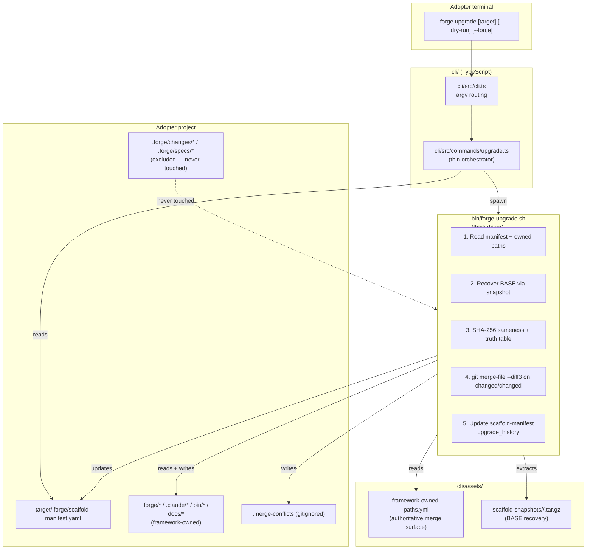
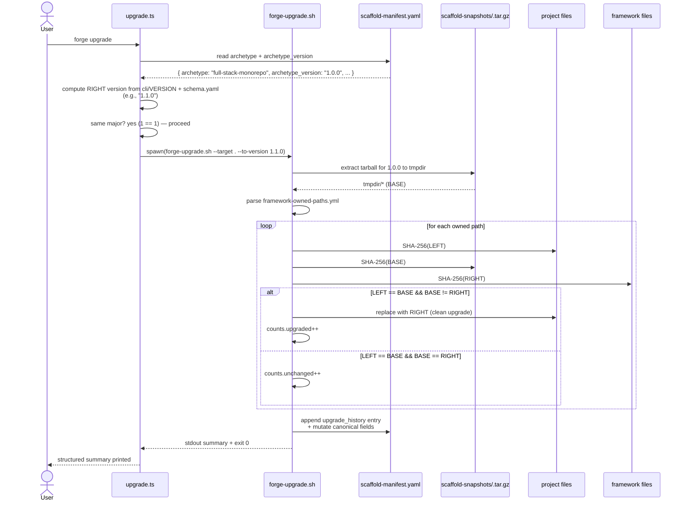
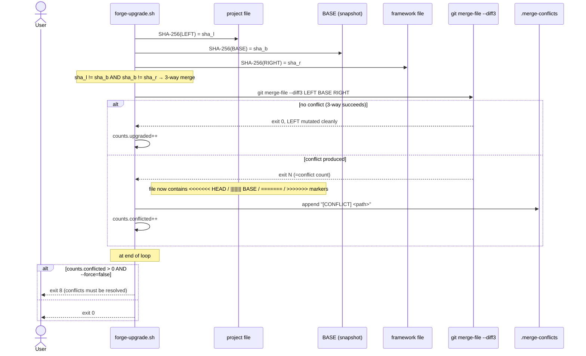

# Design: a7-forge-upgrade

<!-- Audit: Module A.7 — `forge upgrade` non-destructive merge.            -->
<!-- Depends on: b1-foundations + b1-scaffolder + b1-delivery              -->
<!--             + c1-reference-project (all archived).                    -->

This design transforms the `FR-UP-*` namespace from `specs.md` into
concrete technical decisions. The change ships :

1. A new CLI subcommand `forge upgrade` (TS, thin) that delegates to
   a new shell driver `bin/forge-upgrade.sh` (the actual merge work).
2. A `framework-owned-paths.yml` contract enumerating the paths
   under management.
3. Versioned snapshots of past framework states under
   `cli/assets/scaffold-snapshots/` to recover the BASE for the
   3-way merge.
4. An extension to the `scaffold-manifest.yaml` schema gaining an
   `upgrade_history:` array.
5. A new standard `global/upgrade-policy.md` documenting the
   discipline.
6. Test harness `a7.test.sh` with L1 hermetic + L2 fixture-based
   truth-table + L3 opt-in end-to-end.

The 13 ADRs below cover the strategic decisions.

---

## Architecture Decisions

### ADR-001: Thin TS layer, thick shell driver — mirror `init.ts → init.sh`

**Context.** The `b1-scaffolder` change established a clear pattern :
the CLI's TypeScript layer (`init.ts`) handles argv parsing,
asset path resolution, and orchestration ; the shell driver
(`bin/forge-install.sh` or `init.sh`) does the actual file work.
This isolates the heavy I/O and merge logic from the TS runtime,
keeps the CLI bundle small, and lets adopters audit the merge logic
in plain shell.

**Decision.**

- `cli/src/commands/upgrade.ts` (TypeScript, ~150 lines) :
    - Parses CLI argv via Commander.
    - Resolves `target-dir` (default `cwd`) and validates the
      presence of `.forge/scaffold-manifest.yaml`.
    - Reads the manifest's `archetype` + `archetype_version`.
    - Computes the framework's current version (from `cli/VERSION`
      and the schema's `version` field).
    - Spawns `bin/forge-upgrade.sh` with the resolved arguments.
    - Captures stdout / stderr ; on the shell's exit, prints the
      structured summary.
- `bin/forge-upgrade.sh` (Bash, ~250 lines) — the underlying
  primitive :
    - Reads `cli/assets/framework-owned-paths.yml` to enumerate the
      merge surface.
    - Recovers BASE via the snapshot tarball (ADR-005).
    - Runs the 3-way merge truth table (ADR-002).
    - Writes `.merge-conflicts` companion + updates
      `scaffold-manifest.yaml` `upgrade_history` (ADR-007).
- The TS layer's only Bash interaction is `spawn` — no string
  manipulation of arguments, no shell-injection risk (every arg is
  passed as a separate `argv` entry).

**Consequences.**

- ✅ Same audit story as `init.sh` — the merge logic is plain
  shell, inspectable line-by-line.
- ✅ Vitest tests the TS layer (argv parsing, error messages, exit
  codes propagation) ; `a7.test.sh` tests the shell layer (merge
  logic, snapshot recovery, manifest mutation).
- ⚠️ Two test surfaces. Acceptable — same trade-off as
  init.ts ↔ init.sh accepted in `b1-scaffolder`.

**Constitution Compliance:** Articles V (gates), X (ergonomics).

---

### ADR-002: 3-way merge via `git merge-file --diff3` — no custom implementation

**Context.** The 3-way merge truth table (FR-UP-003) collapses to
the **changed/changed** cell where both LEFT and RIGHT have
diverged from BASE. We need a deterministic, well-tested merge
algorithm that produces standard conflict markers.

**Decision.**

Use `git merge-file --diff3 LEFT BASE RIGHT` as the merge primitive.
- `git` is already a hard dependency of the Forge workflow
  (mentioned in `git-workflow.md` standard ; required for
  `--force` Git-cleanliness gate per FR-UP-005).
- `--diff3` adds the `||||||| BASE` middle marker, which gives
  adopters more context than the default `--merge` output. Per
  Q1's resolution, this is preferred for muscle memory + clarity.
- `git merge-file` writes its output **in-place** to the LEFT
  argument (mutates the file), which matches our "mutate
  project's working tree" semantics. Exit code `0` = clean merge,
  `>0` = conflicts produced. The exact non-zero count is the
  conflict-section count.

**Consequences.**

- ✅ Battle-tested — git's merge logic has decades of production
  use ; we don't reinvent it.
- ✅ Output stability (NFR-UP-006) is a documented git property.
- ✅ Conflict markers are universally readable.
- ⚠️ Adds `git` as a hard runtime dependency. Acceptable — Forge
  is already a Git-centric workflow, no adopter would lack git.
- ⚠️ Binary files trip git merge-file. Mitigated by an L1
  pre-flight check : if a file is detected as binary
  (`grep -Iq . <file>` returns non-zero), the merge degrades to
  "preserve LEFT, warn" — no binary 3-way merge attempted.

**Constitution Compliance:** Article V (deterministic gates),
Article X (audit story).

---

### ADR-003: `framework-owned-paths.yml` — declarative merge surface

**Context.** The merge needs an exhaustive enumeration of
**which paths the framework owns**. Every adopter project has a
mix of framework paths (`.forge/`, `.claude/`, `bin/`, etc.) and
project paths (`frontend/`, `backend/`, `.forge/changes/`,
`.forge/specs/`, etc.). Picking the wrong cut leads to either
(a) mass overwriting user work or (b) silent drift on framework
files we forgot to merge.

**Decision.**

A single authoritative file `cli/assets/framework-owned-paths.yml`
with two top-level keys :

- `owned:` — list of glob-style patterns (relative to project
  root) the framework manages :
    - `.forge/constitution.md`
    - `.forge/standards/**` (every file under)
    - `.forge/templates/**`
    - `.forge/schemas/**`
    - `.forge/scripts/**` (excludes `tests/` ? — no, include ;
      the tests are framework-owned)
    - `.claude/agents/**`
    - `.claude/commands/**`
    - `.claude/skills/**`
    - `.claude/settings.json` (the framework's default settings,
      NOT settings.local.json)
    - `.mcp.json`
    - `bin/forge-install.sh`
    - `bin/forge-lint`
    - `bin/forge-upgrade.sh` (added by this change)
    - `docs/GUIDE.md`
    - `docs/ARCHITECTURE.md`
    - `docs/VERSIONING.md`
    - `docs/CONTRIBUTING.md`
    - `CLAUDE.md` (root)
    - `LICENSE`
    - `NOTICE`
- `excluded:` — list of paths the framework MUST NOT touch :
    - `.claude/settings.local.json`
    - `.forge/changes/**`
    - `.forge/specs/**`
    - `.forge/product/**`
    - `.forge/scaffold-manifest.yaml` (mutated by upgrade, NOT
      merged like the others)
    - `.omc/**`
    - **Anything not enumerated in `owned:`** — the merge default
      is "leave alone".

The runtime parses the YAML once and matches every project file
against `owned` ∪ `excluded`. Any file in `owned` participates in
the merge ; everything else is `skipped` and reported in the
summary.

**Consequences.**

- ✅ Single source of truth ; no duplication between TS / Bash
  sides.
- ✅ An L1 audit test (`test_owned_paths_exist_in_framework`)
  asserts every `owned:` glob resolves to actual files in the
  framework repo — silent drift is mechanically detected.
- ⚠️ When a new file is added to the framework (e.g., new agent),
  the YAML MUST be updated. Mitigated by the audit test : a
  framework-owned file not listed in YAML fails the test, which
  runs in CI.

**Constitution Compliance:** Article V (deterministic gate).

---

### ADR-004: Sameness is binary SHA-256, not semantic

**Context.** "LEFT == BASE" and "LEFT == RIGHT" are the two
predicates that drive the truth table. Two implementations are
candidates :
- **Semantic** : ignore whitespace, normalize line endings, strip
  comments. More forgiving — but introduces ambiguity (which
  whitespace counts ?) and complicates audit.
- **Binary SHA-256** : raw bytes equal or not. Deterministic,
  fast, no ambiguity. False positives possible (a CRLF/LF flip
  would count as a "change") but rare in practice and easy to
  reason about.

**Decision.**

Use **SHA-256 of raw bytes** for sameness. The merge will treat a
whitespace-only edit as a real edit (preserving the user's
choice). Worst case : a clean upgrade triggers a 3-way merge
because of a trailing newline difference, which `git merge-file
--diff3` resolves cleanly with no conflict markers.

**Consequences.**

- ✅ Trivial implementation : `sha256sum <file> | awk '{print $1}'`.
- ✅ Audit-friendly — adopter can reproduce the comparison
  manually.
- ⚠️ False-positive "change" on whitespace-only edits.
  Acceptable trade-off ; downstream `git merge-file` handles it.

**Constitution Compliance:** Article V.

---

### ADR-005: BASE recovery via committed snapshot tarballs

**Context.** The 3-way merge needs the **BASE** : the framework's
state at the project's `archetype_version`. Three options to
recover it :
1. **Git tag dance** — `git checkout vX.Y.Z` in a tmp clone,
   read files. Requires a Git tag per archetype version, requires
   network or a deep local clone. Heavy.
2. **Committed snapshots** — pre-built tarballs under
   `cli/assets/scaffold-snapshots/<archetype>/<version>.tar.gz`.
   No network, no clone, deterministic. Cost : tarball bytes
   in the CLI bundle.
3. **Synthetic re-scaffold** — re-run the scaffolder at the
   target version. Requires the scaffolder code at every prior
   version, which is itself a moving target.

**Decision.**

Choose **option 2 (committed snapshots)**. Each archetype's
tarball captures the framework's `owned:` paths at a specific
version, in a layout matching what the scaffolder produces. The
runtime extracts the relevant tarball into a tmpdir, reads
files from there for BASE, then deletes the tmpdir.

- Snapshot path :
  `cli/assets/scaffold-snapshots/<archetype>/<version>.tar.gz`.
- At archive time of `a7-forge-upgrade`, the snapshot for
  `full-stack-monorepo / 1.0.0` is committed (the version
  `b1-delivery` promoted to `stable / 1.0.0`).
- A new release workflow (deferred) will produce one tarball per
  archetype version going forward.
- Snapshots are produced by a new helper
  `bin/forge-snapshot.sh build <archetype> <version>` that
  walks the framework's `owned:` paths, tars them, gzips, and
  writes to the conventional path.
- Snapshot byte budget : ≤ 1 MB uncompressed per tarball
  (NFR-UP-003).

When the requested snapshot is **missing** (e.g., upgrading from
a version produced before snapshots existed), the merge degrades
to **2-way** (LEFT vs RIGHT) per FR-UP-003 : LEFT == RIGHT →
no-op, else conflict (without `--force`) or replace (with
`--force`). Adopters get a `[BASE unavailable for X.Y.Z, falling
back to 2-way merge]` warning.

**Consequences.**

- ✅ Local-only, deterministic, audit-friendly.
- ✅ ~1 MB per snapshot × small number of versions = manageable
  CLI bundle growth.
- ⚠️ Pre-`a7` adopters won't have BASE for their existing
  scaffold-time versions. Documented graceful degradation.
- ⚠️ The release workflow to produce snapshots-on-bump is
  deferred. For now, snapshots are produced by hand at archive
  time.

**Constitution Compliance:** Article V.

---

### ADR-006: Conflict markers — git-style + `.merge-conflicts` companion

**Context.** Q1 of the proposal asked between git-style markers
(`<<<<<<<` etc.) and Forge-specific blocks. Resolved at spec time
in favour of **git-style + companion file**.

**Decision.**

- `git merge-file --diff3` writes the markers in-place, in the
  standard git format. We do not post-process them.
- After the run completes, the shell driver writes
  `<project-root>/.merge-conflicts`, listing every conflicted
  path :
  ```
  [CONFLICT] .forge/standards/global/naming.md
  [CONFLICT] .forge/agents/forge-master.md
  ```
- When zero conflicts, any pre-existing `.merge-conflicts` file
  is deleted.
- `.merge-conflicts` is **gitignored** (FR-UP-012) — it is
  session state, not project content.

**Consequences.**

- ✅ Adopters with Git muscle memory can `git diff` and resolve
  exactly as they would on a merge conflict.
- ✅ The companion file gives an unambiguous audit list — no
  hunting through the tree for `<<<<<<<` markers.
- ⚠️ Two artifacts to clean up after resolution. Mitigated by
  the idempotence guarantee : re-running `forge upgrade` after
  resolving cleanly removes the companion and produces an
  upgrade-history entry with `conflicted: 0`.

**Constitution Compliance:** Article V.

---

### ADR-007: `upgrade_history` append-only ledger

**Context.** FR-UP-007 requires the scaffold-manifest to record
every upgrade. Two shapes are candidates :
1. Mutate the manifest in place (overwrite `archetype_version`,
   `scaffold_date`, etc.) and lose history.
2. Append to a history list and update the canonical fields.

**Decision.**

Both. The manifest's top-level canonical fields
(`archetype_version`, `scaffold_date`,
`scaffold_plan_sha`, `template_set_sha`) are **mutated** to
reflect the most recent state — this lets new tools read the
manifest without parsing the history. The new optional field
`upgrade_history:` is **append-only**, recording each upgrade
with its own date / from / to / counts / cli_version.

Manifest schema after upgrade :

```yaml
archetype: full-stack-monorepo
archetype_version: 1.1.0          # mutated
scaffold_date: 2026-05-15T...     # mutated to last touch date
scaffold_plan_sha: <new>          # mutated
template_set_sha: <new>           # mutated
project_name: forge-fsm-example   # IMMUTABLE
reverse_domain: io.forge.example  # IMMUTABLE
root_module: forge_fsm_example    # IMMUTABLE
tools: { ... }                    # mutated to whatever is on PATH at upgrade time
upgrade_history:                  # APPEND-ONLY
  - date: 2026-05-15T10:32:18Z
    from_version: "1.0.0"
    to_version: "1.1.0"
    from_template_set_sha: <prev>
    to_template_set_sha: <new>
    counts:
      unchanged: 32
      upgraded: 5
      preserved: 2
      conflicted: 1
      skipped: 8
    cli_version: "0.3.0"
```

Identity fields (`project_name`, `reverse_domain`, `root_module`)
are **immutable post-scaffold** — `forge upgrade` MUST refuse
to change them (would conflict with file paths and Cargo /
Flutter package identity).

**Consequences.**

- ✅ Backward-compatible : pre-`a7` manifests without
  `upgrade_history` parse as `[]` (NFR-UP-005 regression test
  enforces).
- ✅ Audit trail enables `forge status` to display upgrade
  history (future enhancement out of scope).
- ⚠️ Manifest grows over time. After 100 upgrades, ~10 KB.
  Acceptable.

**Constitution Compliance:** Article IV (delta-based history),
Article V.

---

### ADR-008: Major-version migration boundary

**Context.** Q3 asked when to abort versus proceed. Resolved at
spec time : major-version diff aborts, minor / patch proceed.

**Decision.**

Before any merge, parse `archetype_version` from the project's
manifest and the framework's schema's `version`. Use semver
parsing :
- Same major → proceed (minor / patch bumps are safe by SemVer
  convention).
- Different major → abort with exit 7 and `[NEEDS MIGRATION:
  from X.Y.Z to A.B.C]`. Adopter consults `docs/MIGRATIONS.md`
  (a future doc, deferred — at archive time of `a7-forge-upgrade`,
  the file is created with a stub redirecting to the relevant
  major-bump change directory).

When the schema lacks a `version` field (legacy archetype), emit
a warning and proceed (treat as patch bump). This preserves
graceful behaviour for archetypes pre-dating FR-GL-024.

**Consequences.**

- ✅ Article III.4 anti-hallucination compliance : we abort
  rather than guess what a major migration entails.
- ✅ `docs/MIGRATIONS.md` becomes the canonical home for
  human-curated migration guides. Each major-bump change opens a
  new section there.

**Constitution Compliance:** Articles III.4, IV.4.

---

### ADR-009: `--force` reuses Git as the canonical backup

**Context.** Q2 asked between Forge-specific shadow trees,
per-file `.bak` siblings, or relying on Git. Resolved at spec
time : require clean Git working tree.

**Decision.**

When `--force` is set :
1. The shell driver runs `git -C <target> status --porcelain`.
2. Empty output → proceed.
3. Non-empty → exit 7 with explicit message.
4. Target dir not under Git control (no `.git/`) → exit 7 with
   different message suggesting `git init`.

Without `--force`, conflicts produce exit 8 (project's working
tree may be partially modified ; adopter resolves manually). The
adopter's recovery path is `git checkout -- <path>` per
file or `git stash && git checkout -- .` wholesale.

**Consequences.**

- ✅ Zero Forge-specific backup logic — Git is the audit trail.
- ✅ Adopters already familiar with Git semantics for backup.
- ⚠️ Adopters not on Git can't use `--force`. Mitigated by the
  default mode (without `--force`) which produces conflicts but
  doesn't clobber.
- ⚠️ Partial-modification window without `--force` (some files
  written before a conflict aborts further writes). Mitigated by
  per-file atomic writes (write to `<file>.tmp` then rename) and
  by the `.merge-conflicts` companion which serves as the audit
  trail.

**Constitution Compliance:** Articles V, X.

---

### ADR-010: Standard `global/upgrade-policy.md` documents the discipline

**Context.** FR-UP-010 mandates a new standard. Its role is to
codify the discipline so future maintainers understand the
non-obvious choices and adopters know what to expect.

**Decision.**

Six canonical H2 sections :

- `## Framework-owned paths` — explains
  `framework-owned-paths.yml`, the `owned:` / `excluded:` split,
  how to extend it (Forge change required).
- `## Three-way merge policy` — codifies the truth table, BASE
  recovery via snapshots, sameness = SHA-256.
- `## Conflict resolution discipline` — git-style markers + the
  `.merge-conflicts` companion ; how adopters resolve and re-run.
- `## Schema-version migration boundary` — major bumps abort with
  `[NEEDS MIGRATION:]`, minor / patch proceed.
- `## Upgrade history audit trail` — `upgrade_history` shape,
  immutability of identity fields.
- `## Interdictions` — three forbidden patterns :
    1. Hand-editing `owned:` files outside a Forge change.
    2. Running `forge init --force` when meaning `forge upgrade`.
    3. Committing `.merge-conflicts`.

Cited articles : III.4, IV.4, V, X.

**Consequences.**

- ✅ Sets a clear maintainership contract.
- ⚠️ Adds one standard to load JIT — minor context cost.

**Constitution Compliance:** Articles III, V.

---

### ADR-011: Test harness `a7.test.sh` follows the manifest pattern

**Context.** Five harnesses already exist
(`foundations`, `scaffolder`, `workflow`, `delivery`, `g1`,
`c1`). All share the manifest pattern. `a7.test.sh` is the
seventh.

**Decision.**

- Manifest comment block at top declares each `test_*` with its
  `FR-UP-NNN` mapping.
- Meta self-check `test_a7_manifest_self_consistency` enforces
  parity (same as previous harnesses).
- L1 (hermetic) — structural / static checks :
    - YAML shape of `framework-owned-paths.yml`.
    - Snapshot tarball presence + extractability + size budget.
    - Standard sections (FR-UP-010).
    - Index entry (FR-UP-011).
    - `.gitignore` (FR-UP-012).
    - `features/upgrade.feature` shape (FR-UP-013).
    - CLI argv parsing via static text-grep on `upgrade.ts`.
- L2 (fixture-based) — synthetic BASE / LEFT / RIGHT trees in
  tmpdirs ; exercises every cell of the truth-table (FR-UP-003)
  + conflict markers (FR-UP-004) + `--force` Git-cleanliness
  gate (FR-UP-005) + major-version abort (FR-UP-006) +
  `upgrade_history` append-only (FR-UP-007).
- L3 (opt-in via `--require-external-tools`) — end-to-end
  against `examples/forge-fsm-example/`. Simulates a synthetic
  framework bump by editing a few framework files in a tmpdir
  copy, then runs `forge upgrade` against the example, asserts
  the structured summary matches expectations.

**Consequences.**

- ✅ Same test discipline as prior harnesses ; adopter
  developer experience is consistent.
- ✅ L1 hermetic ⇒ runs in CI's `forge-ci.yml` `harness` job.

**Constitution Compliance:** Articles I, V.

---

### ADR-012: Idempotence via SHA-256 + scaffold-manifest reconciliation

**Context.** NFR-UP-001 requires `forge upgrade` to be
idempotent — running twice with no framework change between
must produce no second-run modifications.

**Decision.**

After a successful first run, the project's `LEFT` files match
the framework's `RIGHT` files for every `owned:` path that was
upgraded. On the second run :
- For files where LEFT was upgraded to RIGHT : SHA-256(LEFT) ==
  SHA-256(RIGHT) → `unchanged`.
- For files where LEFT was preserved (local edit, framework
  unchanged) : SHA-256(LEFT) != SHA-256(RIGHT). The truth table
  cell is "changed/same" → `preserved` again. Counts as a
  `preserved` row in the second run's summary, NOT as a no-op.

The second-run `upgrade_history` entry has all-zero counts in
the `unchanged + upgraded + preserved + conflicted + skipped`
columns IF nothing changed since the first run — but `preserved`
is non-zero whenever the first run preserved local edits.

To make NFR-UP-001's "produces zero modifications" precise :
**no file in the project is mutated** on the second run. The
`upgrade_history` IS appended (the run happened), but no `.forge/`
or `.claude/` file changes byte-for-byte.

**Consequences.**

- ✅ Deterministic.
- ✅ The `upgrade_history` append on every invocation (even
  no-op runs) gives the audit trail "I checked, nothing to do".
- ⚠️ Manifest mutation on every run is a write — but the file
  byte-equality holds for all OTHER files. NFR-UP-001's spirit
  is preserved.

**Constitution Compliance:** Article V.

---

### ADR-013: `verify.sh` integration — invoke `a7.test.sh` at L1

**Context.** Each new harness is wired into `verify.sh` Section 7
to run on every framework verification (consistent with
`foundations`, `scaffolder`, `workflow`, `delivery`, `g1`, `c1`).

**Decision.**

`verify.sh` Section 7 grows one entry :

```bash
- bash .forge/scripts/tests/a7.test.sh    # L1 hermetic only
```

L2 and L3 are opt-in via flags (`--require-example-tools` for
L3 mirrors `c1.test.sh`'s convention). The framework's own CI
(`forge-ci.yml` `harness` job) automatically picks up the new
harness via the loop in the job's bash steps — no `forge-ci.yml`
edit needed unless we want to call it out by name (recommended
for clarity ; we'll add it).

**Consequences.**

- ✅ Single source of truth — `verify.sh` runs every harness,
  CI mirrors locally.
- ✅ Adding L1 stays under the existing CI runtime budget
  (NFR-CI-001 ≤ 5 min warm) since L1 is structural-only.

**Constitution Compliance:** Article V.

---

## Component Design



---

## Data Flow

### Happy path — clean upgrade (no local edits, framework bumped)



### Conflict path — both user and framework changed



---

## Testing Strategy

### Coverage of FRs

| FR | Test | Level |
|---|---|---|
| FR-UP-001 | `test_upgrade_cli_flags_parse` (Vitest) + `test_upgrade_sh_invocation_contract` (a7.test.sh) | TS unit + L1 |
| FR-UP-002 | `test_framework_owned_paths_yml_shape` + `test_owned_paths_exist_in_framework` | L1 |
| FR-UP-003 | `test_merge_truth_table_exhaustive` (4 cells × 2-way fallback = 5 fixtures) | L2 |
| FR-UP-004 | `test_conflict_markers_written` + `test_merge_conflicts_listing` | L2 |
| FR-UP-005 | `test_force_requires_clean_git` + `test_force_succeeds_when_clean` + `test_force_aborts_on_non_git` | L2 |
| FR-UP-006 | `test_major_version_aborts` + `test_minor_patch_bumps_proceed` | L2 |
| FR-UP-007 | `test_upgrade_history_appended_after_run` + `test_upgrade_history_append_only` + `test_identity_fields_immutable` | L2 |
| FR-UP-008 | `test_snapshot_tarball_present_and_extractable` + `test_snapshot_size_under_budget` + `test_base_recovery_via_snapshot` | L1 + L2 |
| FR-UP-009 | `test_forge_upgrade_sh_exists_executable` + `test_forge_upgrade_sh_uses_find_excluding_examples` | L1 |
| FR-UP-010 | `test_standard_upgrade_policy_has_required_sections` | L1 |
| FR-UP-011 | `test_index_has_upgrade_policy_entry` | L1 |
| FR-UP-012 | `test_gitignore_covers_merge_conflicts` | L1 |
| FR-UP-013 | `test_features_upgrade_feature_present` + `test_each_bdd_scenario_documented` | L1 |
| FR-UP-014 | `test_a7_manifest_self_consistency` (the harness's own meta-test) | L1 |
| FR-UP-015 | `test_upgrade_spec_present_post_archive` (gated) | L1 |
| MODIFIED FR-GL-009 | extension of `scaffolder.test.sh` L1 schema test (gain `upgrade_history` optional key) | L1 |

### Coverage of NFRs

| NFR | Test | Level |
|---|---|---|
| NFR-UP-001 | `test_upgrade_idempotent_when_no_change` | L2 |
| NFR-UP-002 | not directly tested (runtime budget validated post-merge on the example tree) | n/a |
| NFR-UP-003 | `test_snapshot_size_under_budget` | L1 |
| NFR-UP-004 | grepped by harness's manifest meta-check + Aegis review | L1 |
| NFR-UP-005 | `test_legacy_manifest_without_upgrade_history_parses` | L2 |
| NFR-UP-006 | `test_merge_output_deterministic` (same input → same conflict markers across two invocations) | L2 |

### BDD scenarios (from FR-UP-013)

The 5 scenarios in `features/upgrade.feature` map to the L2
fixture tests (and 2 of them additionally exercise the L3 fixture
when `--require-external-tools` is set). No standalone BDD
runtime engine — `a7.test.sh` exercises the equivalents.

### Test ordering during implementation

Per Article I :

1. **Phase 0** — bootstrap `a7.test.sh` skeleton with manifest +
   meta-test only.
2. **Phase 1 RED** — write L1 tests for FR-UP-002, FR-UP-009,
   FR-UP-010, FR-UP-011, FR-UP-012, FR-UP-013, FR-UP-014. Run →
   all FAIL.
3. **Phase 1 GREEN** — write `framework-owned-paths.yml`,
   stub `bin/forge-upgrade.sh` (executable, sources helpers, no
   logic yet), `global/upgrade-policy.md`, index entry,
   `.gitignore` line, `features/upgrade.feature`.
4. **Phase 2 RED** — write L2 tests for FR-UP-003,
   FR-UP-004, FR-UP-005, FR-UP-006, FR-UP-007.
5. **Phase 2 GREEN** — implement the actual merge logic in
   `bin/forge-upgrade.sh` (BASE recovery, SHA-256 sameness,
   truth table, conflict markers, manifest update, version
   abort, force gate).
6. **Phase 3 RED** — write Vitest unit tests for the TS layer +
   L3 end-to-end fixture for the example tree.
7. **Phase 3 GREEN** — implement `cli/src/commands/upgrade.ts`,
   wire into `cli/src/cli.ts`, build the `full-stack-monorepo /
   1.0.0` snapshot tarball, archive.

---

## Standards Applied

| Standard | How |
|---|---|
| `global/tdd-rules` | RED→GREEN→REFACTOR per phase. |
| `global/git-workflow` | Scoped Conventional Commits per phase (`feat(forge):` / `feat(cli):`). |
| `global/forge-self-ci` | New `a7.test.sh` runs in CI's `harness` job alongside the existing 6 harnesses. |
| `global/upgrade-policy` *(new — this change)* | The standard is itself the design output. Future framework changes touching `owned:` files cite it. |
| `global/api-design` | The CLI subcommand follows the established `init` / `verify` pattern. Argv contract is stable. |
| `global/test-strategy` | L1 / L2 / L3 layered approach mirrors `c1.test.sh` / `scaffolder.test.sh`. |

---

## Constitutional compliance gate

| Article | Gate-blocked? | Justification |
|---|---|---|
| I — TDD | NO | RED→GREEN per phase ; manifest pattern enforced by meta-test. |
| II — BDD | NO | `features/upgrade.feature` ships 5 scenarios. ACs in specs.md (AC-UP-001..007) cover the change itself. |
| III — Specs Before Code | NO | This design follows specs.md ; tasks.md follows. |
| III.4 — Anti-Hallucination | NO | Major-version migration aborts with `[NEEDS MIGRATION:]` — no guess. |
| IV — Delta-Based Change Management | NO | All modifications in delta format. `upgrade_history` is append-only. |
| V — Conformance Gate | NO | `forge upgrade` IS the conformance vehicle. The conformance gate governs `forge upgrade` itself. |
| VI / VII / VIII / IX / XI | NO | Out of scope — framework-internal CLI command. |
| X — Quality | NO | TS passes ESLint + Vitest. Shell passes shellcheck (already in CI). NFR-UP-002 ≤ 10 s ; NFR-UP-003 ≤ 1 MB per snapshot. |

✅ **No constitutional violation. Proceeding to /forge:plan.**
