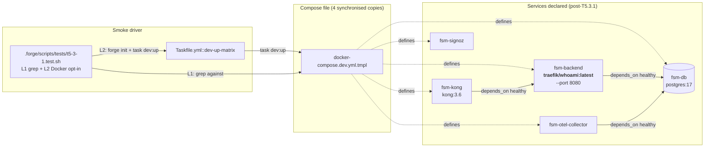
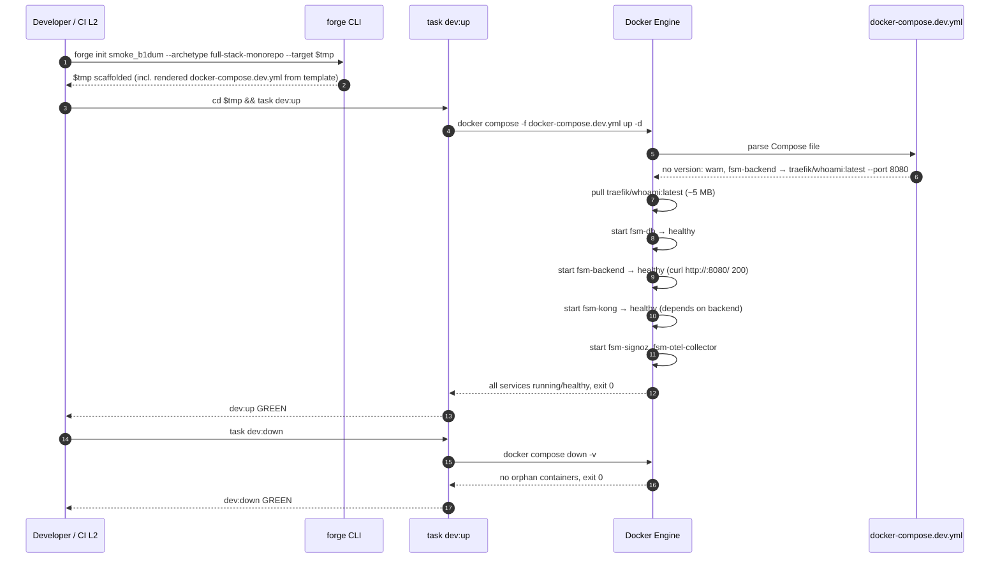

# Design: b1-1-dev-up-matrix-fixes
<!-- Status: designed -->
<!-- Schema: default -->
<!-- Audit: T5.3.1 (docs/new-archetypes-plan.md §0.4) -->

> Read alongside `specs.md` (FR-B1-DUM-* / NFR-B1-DUM-*) and
> `open-questions.md` (Q-001 / Q-002 / Q-003). This document locks
> the implementation strategy and resolves the three open
> questions via ADR-B1-DUM-001..003.

> **Agents** — Atlas (Infrastructure Architect) primary owner ;
> Eris (Test Architect) co-owner on ADR-B1-DUM-003.

---

## Architecture Decisions

### ADR-B1-DUM-001 — Replace `image: scratch` with `traefik/whoami:latest` stand-in + adjust healthcheck (resolves Q-001)

**Context** : `docker-compose.dev.yml.tmpl::fsm-backend` declares
`image: scratch` as a TODO placeholder. Docker rejects `scratch`
as a reserved name, so `task dev:up` fails immediately on a
fresh scaffold. Three options surfaced :

- **Option A** — Working stand-in image (`traefik/whoami:latest`
  or equivalent, listens on :80 with 200 OK).
- **Option B** — Docker Compose `profiles: ["backend"]` — opt-in
  backend tier so default smoke is infra-only.
- **Option C** — Comment out `fsm-backend` + dependants —
  baseline minimal.

**Decision** : **Option A — `traefik/whoami:latest`**, with the
container internal port reconfigured to 8080 via the image's
`--port` flag, and the healthcheck adjusted to hit `/` (not
`/health`).

**Rationale** :

1. **Smoke must validate the full wiring chain** : `task dev:up`
   exists to catch breakage in env-file resolution, port
   mapping, `depends_on` ordering, network configuration,
   healthcheck convergence. Options B and C **skip** the backend
   from the default smoke entirely, losing signal that the
   wiring works. Option A keeps every Compose construct under
   test on every smoke run.
2. **`traefik/whoami` is the right stand-in** : verified publisher
   (Traefik Labs), ~5 MB image, accepts `--port N` flag (verified
   via `docker run --rm traefik/whoami --help`), returns 200 OK
   on `GET /` with a plaintext echo. Used elsewhere in the Docker
   community as the canonical wiring placeholder. Stable image
   tag policy (we pin `:latest` here because the placeholder
   semantics are fixed — `whoami` will keep responding on
   whichever port it is told to ; if upstream stability becomes
   a concern a future change can pin to a major tag).
3. **Healthcheck stays meaningful** : the existing healthcheck
   `curl -fsS http://localhost:8080/health || exit 1` becomes
   `curl -fsS http://localhost:8080/ || exit 1` (drop `/health`
   path — `whoami` answers on `/`). Adopters who swap in their
   real backend image rewrite that line back to `/health` (or
   their actual probe path) — documented in the adopter comment.
4. **Option B (`profiles:`) cost too high for a hygiene change** :
   `profiles: ["backend"]` on `fsm-backend` cascades through
   `fsm-kong` (depends on backend), the frontend service (depends
   on kong → backend), and the OTel-collector wiring. Each of
   those needs the same profile annotation, plus adopter docs
   need to teach `--profile backend`. That is a re-design, which
   is **explicitly scope-out** in the proposal ("no structural
   rewrite of `docker-compose.dev.yml.tmpl` ... T5.3.1 = template
   hygiene, not re-architecture B.8"). B.8 will do the full
   re-design when the flagship goes 1.0.0 → 2.0.0.
5. **Option C (commented) is brittle for adopters** : Forge's
   value proposition is "scaffold and go". A commented block
   forces the adopter to read the file, uncomment, and edit
   before smoke is even runnable. The stand-in is friendlier —
   adopter swaps one line (`image:`) once they have a real
   backend image to publish.

**Consequences** :

- ✅ `task dev:up` reaches steady state on a fresh scaffold ; full
  Compose wiring exercised on every smoke.
- ✅ Adopter migration is "replace one line + adjust one
  healthcheck path" (already documented inline).
- ✅ ~5 MB extra image pull on first smoke (acceptable ;
  comparable to existing `db`, `kong`, `signoz` weights).
- ⚠️ `traefik/whoami` does not honour `DATABASE_URL` or
  `LOG_LEVEL` env vars from the existing `env_file: .env` block.
  Mitigation : keep the env block as-is (whoami ignores unknown
  vars silently), document the contract in the adopter comment.
- ⚠️ A naïve adopter could mistake green smoke for "backend
  works". Mitigation : the adopter swap-in comment makes the
  placeholder nature explicit. CHANGELOG note + docs also
  surface the contract.

**Constitution Compliance** : Article III.4 (anti-hallucination
— `whoami` semantics verified, not guessed) ; Article XII (no
standard touched, no amendment). Article IV.2 ("History must be
preserved") — template change only, archived `b1-foundations`
/ `b1-delivery` proposals are not modified.

---

### ADR-B1-DUM-002 — Remove `version: "3.8"` with a 1-line forward-defensive comment (resolves Q-002)

**Context** : Compose v2 deprecates the top-level `version:` key
and emits `WARN[0000] the attribute version is obsolete` on
every invocation. Two options :

- **Option A** — Bare delete.
- **Option B** — Delete + leave a 1-line `#` comment noting why.

**Decision** : **Option B — bare delete + 1-line comment**.

**Rationale** : the comment costs 1 line and prevents a future
adopter from "fixing" the apparent omission by re-adding
`version: "3.X"`. Compose v2 → v3 migration churn (2023–2024)
left many engineers convinced the `version:` field is mandatory ;
the comment is a forward-defensive footgun shield. Cost is
negligible.

**Form** :

```yaml
# Compose v2 — no top-level `version:` key (deprecated 2024-01,
# inferred from filename).
```

Placed at the same line position the `version: "3.8"` declaration
occupied (former line 25) for visual continuity in `git diff`.

**Consequences** :

- ✅ No more `WARN attribute version is obsolete` on smoke.
- ✅ Adopters who would have re-added the key see the comment
  first.

**Constitution Compliance** : Article III.4 (anti-hallucination
— Compose v2 deprecation verified via Docker upstream
release notes, not guessed) ; no other article implicated.

---

### ADR-B1-DUM-003 — Keep E2E cycle in Taskfile `dev-up-matrix` with `FORGE_B1DUM_DOCKER=1` L2 opt-in mirror (resolves Q-003)

**Context** : the `task dev:up` + `docker compose ps` +
`task dev:down` cycle assertion must live somewhere. Two
locations :

- **Option A** — Keep in Taskfile `dev-up-matrix` (opt-in,
  current location).
- **Option B** — Promote to blocking step in
  `cli/test/e2e/archetypes-smoke.test.ts`.

**Decision** : **Option A — Taskfile-only**, with a parallel L2
opt-in in the new `t5-3-1.test.sh` harness (gated by
`FORGE_B1DUM_DOCKER=1` AND `command -v docker`).

**Rationale** :

1. **CI cost** : Option B adds Docker daemon dependency, image
   pulls (db, kong, signoz, otel-collector, whoami), `up -d`
   wait, healthcheck convergence, `down` — empirically 90-180 s
   on a cold GitHub Actions runner. Multiplied across every CI
   invocation (currently 6+ jobs in `forge-ci.yml`), that adds
   noticeable wall-clock and CI-minute cost on every PR for a
   smoke that catches a class of bugs we already see exposed in
   the Taskfile leg.
2. **Existing pattern** : `t5-otel-live-run` adopted the same
   pattern (`FORGE_LIVE_RUN_DOCKER=1` L2 gate, per
   ADR-T5-OLR-005) precisely to avoid forcing Docker on every
   CI runner. Reuse the precedent. Eris (Test Architect)
   ratified that pattern as the correct test-pyramid placement
   for Docker-dependent smokes.
3. **Coverage equivalence** : both Option A and Option B exercise
   the same Compose file end-to-end. The difference is *when*
   the assertion fires (manual `task dev-up-matrix` vs every
   PR). Forge's contributor surface is small enough that the
   Taskfile leg gets run on every release-candidate prep ; the
   harness L2 gives explicit opt-in for local dev / CI manual
   runs without burdening every PR.
4. **Adopter inheritance** : adopter projects inherit the
   Taskfile (it ships in the scaffold), so they get the smoke
   leg "for free" when they run `task validate` locally — same
   property Option B would give them, without the CI tax.

**Consequences** :

- ✅ CI wall-clock unchanged (no Docker added to PR runs).
- ✅ Local dev / RC prep / manual runs get explicit opt-in via
  `FORGE_B1DUM_DOCKER=1 bash .forge/scripts/tests/t5-3-1.test.sh
  --level 2`.
- ✅ Adopter projects inherit the Taskfile `dev-up-matrix` leg
  (it ships in `archetypes/full-stack-monorepo/Taskfile.yml.tmpl`).
- ⚠️ Regressions in `docker-compose.dev.yml.tmpl` could escape
  CI until the next manual smoke. Mitigation : the L1 grep
  tests catch the specific regressions T5.3.1 fixes (no
  `scratch`, no `version:`, mirror byte-identity), so the
  delta is "we don't catch *new* compose-wiring breakage", not
  "we don't catch T5.3.1 regressing". Acceptable.

**Constitution Compliance** : Article I (TDD — RED-GREEN-REFACTOR
on the L1 grep tests is fully applied ; L2 is integration
top-up). Article III.4 (anti-hallucination — `FORGE_LIVE_RUN_DOCKER`
precedent verified by reading `t5-otel-live-run` ADR-T5-OLR-005).

---

## Component Design



The only structural change at this layer is **`fsm-backend.image`
flipping from `scratch` to `traefik/whoami:latest`**. All other
dependants (`fsm-kong` → backend, `fsm-otel-collector` → db,
etc.) remain wired identically.

---

## Data Flow



The L1 harness validates **points 1, 2, 5** (template content
+ rendered Compose well-formed) without invoking Docker. The
L2 harness exercises the full sequence end-to-end when
`FORGE_B1DUM_DOCKER=1` is set.

---

## Testing Strategy

| Level | Scope                                                                                              | Tools / Harness                                                |
|-------|----------------------------------------------------------------------------------------------------|----------------------------------------------------------------|
| **L1** | 9 grep-based assertions on the 4 template copies (specs FR-B1-DUM-080..081)                       | `t5-3-1.test.sh --level 1`, `_helpers.sh`                      |
| **L1** | `docker compose config -q` parse-only against rendered fixture — no daemon needed                  | `docker compose config -q` (Compose CLI is daemon-independent) |
| **L2** | `forge init` → `task dev:up` → `docker compose ps` → `task dev:down` end-to-end cycle             | `t5-3-1.test.sh --level 2`, `FORGE_B1DUM_DOCKER=1`             |
| **CI**| `forge-ci.yml` matrix runs harness `--level 1` only ; line budget +1 entry (~296 → ~298, ≤ 300)   | GitHub Actions `harness` job                                   |

**RED-GREEN-REFACTOR plan (Article I)** :

1. Land harness with 9 L1 tests AS-IS against current (broken)
   template. Expected result : 2 tests FAIL (FR-B1-DUM-001
   `_test_b1dum_l1_001_canonical_no_scratch` and FR-B1-DUM-020
   `_test_b1dum_l1_002_canonical_no_version_key`), 7 PASS or
   skip-pass. **Verify RED.**
2. Edit canonical template (remove `scratch`, remove `version:`,
   add audit comment, adjust healthcheck path).
3. Run `npm run bundle` to propagate to `cli/assets/...` mirrors.
4. Edit `examples/forge-fsm-example/...` mirror to match
   canonical edited region. Bundle again to propagate.
5. **Verify GREEN.** All 9 L1 tests pass.
6. Refactor : tidy audit comments, ensure formatting consistency
   across the 4 copies, ensure no extraneous whitespace.

**Eris co-sign on L2** : the L2 fixture template `forge init`
already exists in `cli/test/e2e/archetypes-smoke.test.ts` and
can be reused via subshell invocation rather than ported. Eris
ratifies that pattern as DRY-correct (one source of fixture
truth, two callers).

---

## Standards Applied

No new standard. No existing standard amended. The change
operates entirely within the scope of :

| Standard                                          | How Applied                                                                                |
|---------------------------------------------------|--------------------------------------------------------------------------------------------|
| `global/tdd-rules.md`                             | RED-GREEN-REFACTOR per Article I — see Testing Strategy plan above                         |
| `global/open-questions.md`                        | Q-001..003 raised in `specs.md` resolved here as ADR-B1-DUM-001..003 ; statuses flipped     |
| `global/standards-lifecycle.md`                   | N/A — no standard birth, no version bump, no `expires_at` touch                            |
| `global/forge-compliance-workflow.md`             | N/A — no compliance tier touched                                                            |
| Article IV.2 (No Complete Rewrites — history)     | Archived `b1-foundations` / `b1-delivery` files untouched ; template is live contract       |

---

## Security Considerations

- **`traefik/whoami:latest` tag floating** : pinning `:latest`
  in a template is a mild supply-chain risk (next image push
  could change behavior). Mitigation : Demeter (K.3) deny-list
  scanner does NOT flag `traefik` (verified publisher, EU-based
  Traefik Labs). For T1 / T2 tiers, the floating tag is
  acceptable for a dev-only placeholder. **For T3 EU-strict
  adopters**, this should be pinned to a digest hash via
  `traefik/whoami@sha256:...` — flagged as a **follow-up
  hardening item** for B.8 (when the flagship goes 2.0.0 with
  full SecNumCloud-compatible hardening).
- **No secrets** introduced or moved. `env_file: .env` block
  untouched.
- **No network exposure change**. Port mapping `8080:8080`
  unchanged.

Aegis review : not required for this hygiene change. Follow-up
B.8 hardening item logged above.

---

## Observability Plan

- **Traces** : no new instrumentation. `traefik/whoami` is
  ephemeral placeholder ; OTel SDK init (shipped by `t5-otel-app`)
  remains a no-op on the placeholder service.
- **Metrics** : no new metric. Existing OBI eBPF (shipped by
  `t5-otel-stack`) auto-discovers the placeholder process on the
  host — no template-side configuration needed.
- **Logs** : `traefik/whoami` logs to stdout (default), captured
  by Docker default driver. No template change.

---

## Implementation Order (`/forge:plan` will expand)

1. **RED** : create `.forge/scripts/tests/t5-3-1.test.sh` with 9
   L1 tests + 1 L2 fixture. Run → assert 2 FAIL (scratch +
   version).
2. **GREEN** : edit canonical template lines 25 + 60 + 65
   (healthcheck path). Rebundle. Mirror to example. Rerun → 9/9
   GREEN.
3. **L2 dry-run** locally with `FORGE_B1DUM_DOCKER=1` to
   validate the cycle.
4. **CI registration** in `forge-ci.yml` matrix (one new line
   after `i5.test.sh`). Verify ≤ 300.
5. **CHANGELOG** under v0.4.0-rc.1 (or new section for rc.2 if
   we land after the rc.1 tag).
6. **Plan inventory** update in `docs/new-archetypes-plan.md`.
7. **Roadmap** status line addition.

---

*Next : `/forge:plan b1-1-dev-up-matrix-fixes`.*
