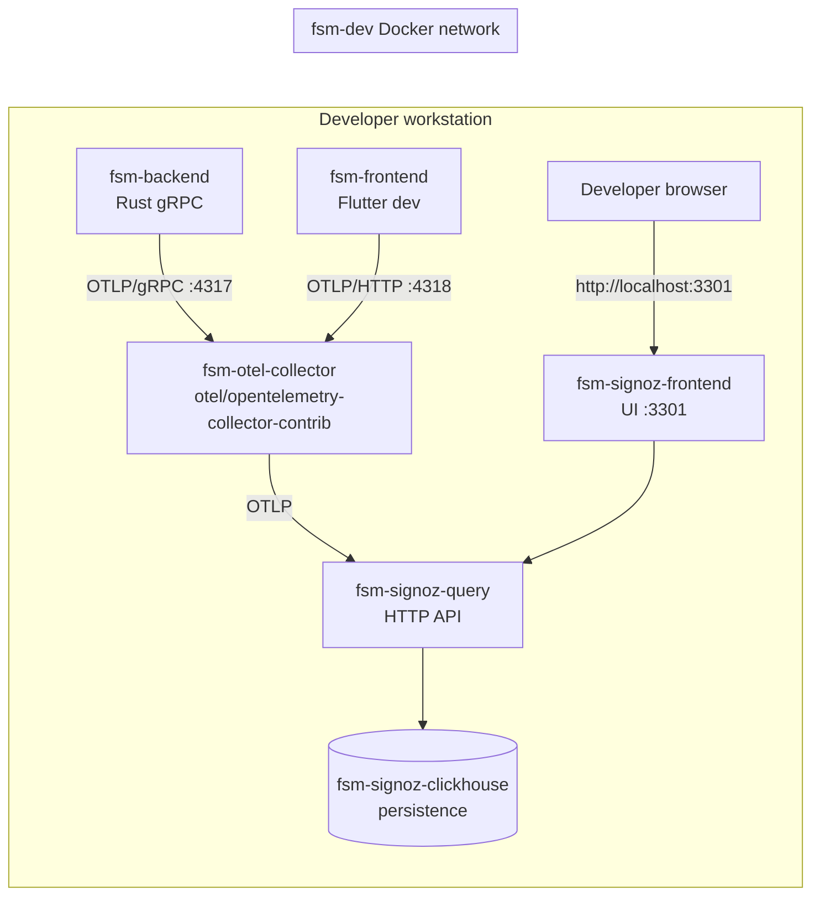
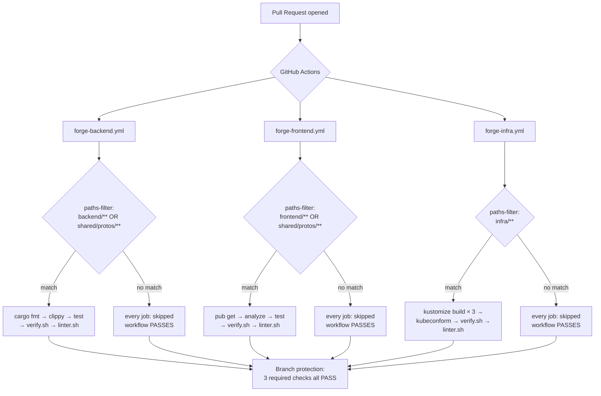
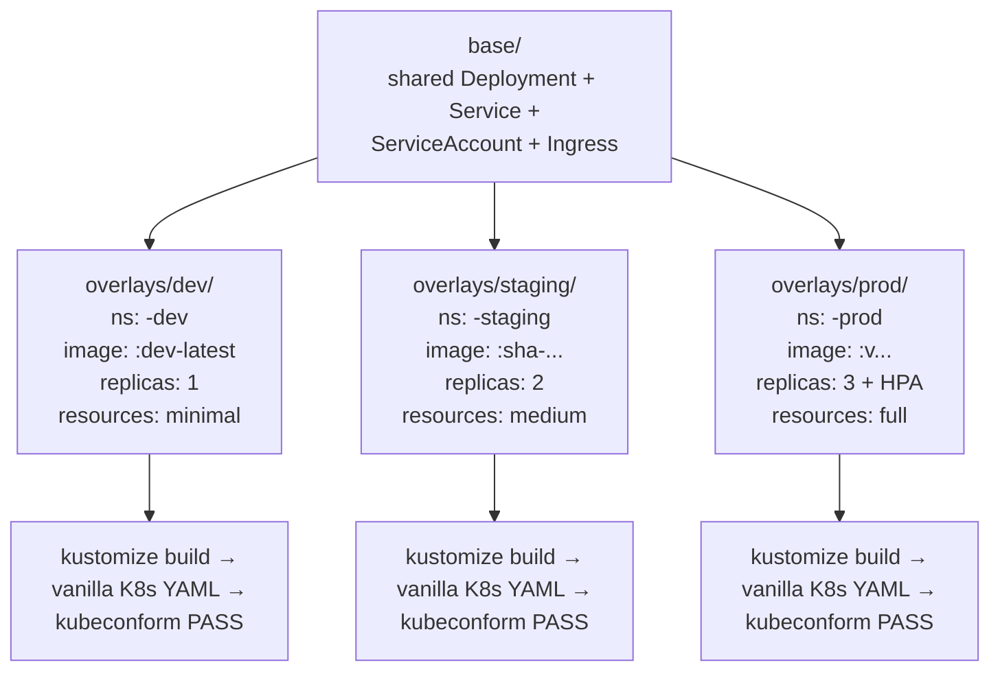
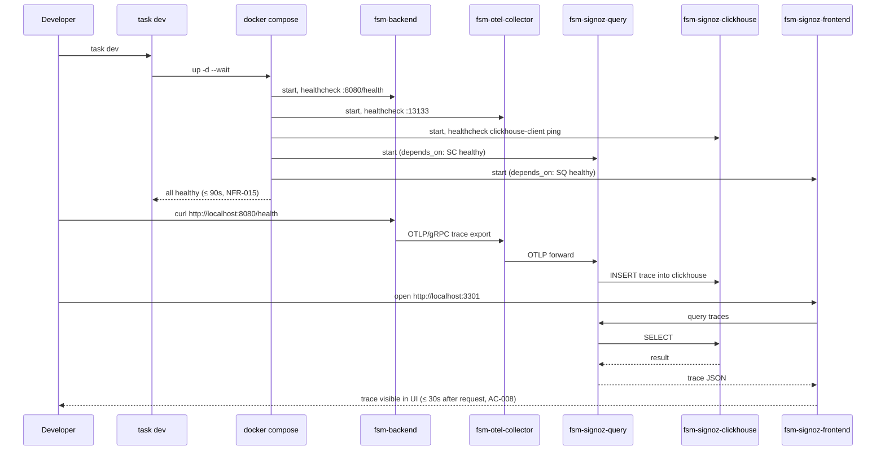
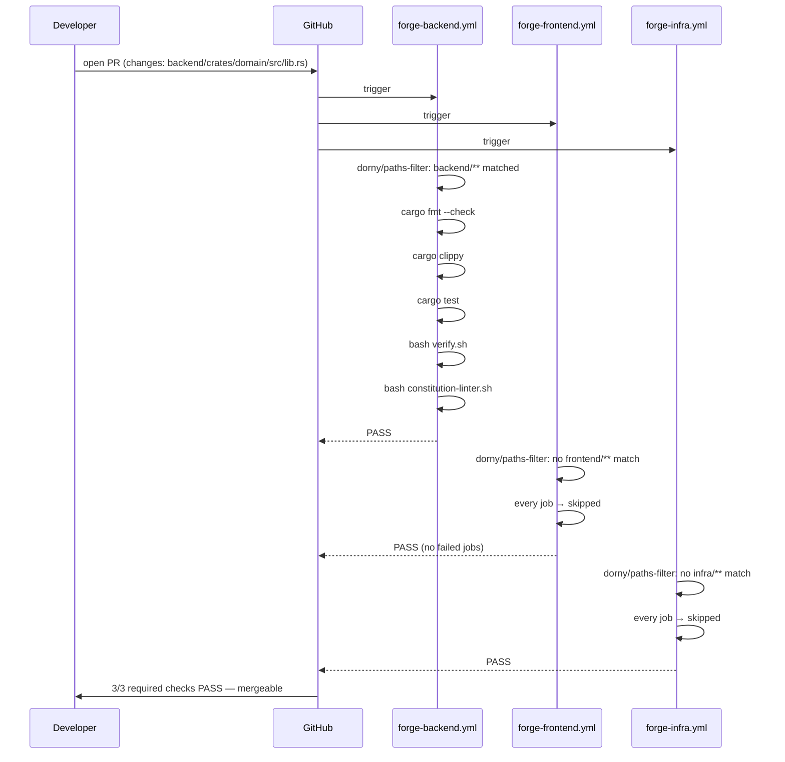

# Design: b1-delivery
<!-- Audit: B.1.9 + B.1.12 + B.1.14 -->
<!-- Agents invoked: Atlas (CI workflows + K8s overlays + compose stack), Argus (OTel + SigNoz topology), Eris (test strategy + delivery.test.sh shape), Aegis (security pass on secrets handling + image pinning) -->
<!-- Depends on: b1-foundations + b1-scaffolder + b1-workflow (all archived) -->
<!-- Closes B.1: drives schema promotion candidate / 1.0.0-rc.1 → stable / 1.0.0 -->

## Architecture Decisions

### ADR-001: Reference workflows ship as `.tmpl` files; Forge itself does not run them

- **Context** — FR-IN-002..005 declare four reference workflows.
  Two locations could host them : (a) live under `.github/workflows/`
  on the Forge repo itself, so Forge dog-foods its own CI, or
  (b) under `.forge/templates/archetypes/full-stack-monorepo/.github/workflows/`
  as templates inert until scaffolded.

- **Options Considered** —
    - Option A — Forge runs the workflows on itself. Strong
      dog-fooding signal. But Forge is not a `full-stack-monorepo`
      project (it has no `frontend/`, `backend/`, `infra/` trees) ;
      the workflows would either skip every job (filters never match)
      or need bespoke adaptation, defeating the point. Adopters
      would also have to figure out which version of the workflow
      they should copy out of Forge's own `.github/workflows/`,
      which is brittle.
    - Option B — Templates only. Forge keeps its existing minimal
      CI (which covers the framework's own `.forge/scripts/tests/`
      harnesses) and ships the four workflows as templates that the
      scaffolder writes to a target project's `.github/workflows/`.
      Schema promotion (FR-GL-024) is what asserts they are fit
      for use ; the integration test harness (FR-GL-025) covers
      validation on Forge's own CI.

- **Decision** — **Option B**. The Forge repo's own
  `.github/workflows/` is unchanged. The four reference workflows
  live under `.forge/templates/archetypes/full-stack-monorepo/.github/workflows/`
  with `.tmpl` extension. The scaffolder strips `.tmpl` on copy
  and substitutes placeholders.

- **Consequences** —
    - ✅ Single source of truth in `scaffold-plan.yaml` ; one new
      entry per `.tmpl` file (4 entries for FR-IN-002..005).
    - ✅ The harness (FR-GL-025) validates the workflows by parsing
      the rendered YAML inside a fixture-scaffolded project tree,
      so we still get end-to-end coverage without running them on
      Forge's own actions.
    - ⚠️ No live Forge dog-fooding of the four workflows. Mitigated
      by the harness running the actual `kustomize build`,
      `docker compose config`, and `act --dry-run` paths — which is
      stronger than just executing the workflows in CI (those would
      only cover the happy path).

- **Constitution Compliance** — Article V (gates), Article X
  (quality). No violation : the gates exist in the templates and
  are validated by the harness.

---

### ADR-002: `dorny/paths-filter@v3` is the single canonical pattern; no fork-based alternatives

- **Context** — Multiple actions can implement per-layer filtering :
  `dorny/paths-filter`, GitHub-native `paths:` triggers,
  `tj-actions/changed-files`, custom shell scripts. Spec FR-IN-002
  through FR-IN-005 prescribe `dorny/paths-filter@v3`.

- **Decision** — **`dorny/paths-filter@v3` exclusively**. The
  alternative GitHub-native `paths:` filter at the workflow level
  is rejected because it makes the workflow itself skip rather
  than running with skipped jobs — the result is "no required
  status" rather than "passed", which breaks branch protection
  rules requiring `forge-backend` as a status check.

- **Consequences** —
    - ✅ Branch protection sees a `forge-backend.yml` PASS on every
      PR (even when no backend file changed) because the workflow
      always runs ; jobs guarded by the filter just skip with
      success.
    - ✅ Single dependency to upgrade across all four workflows.
    - ⚠️ Forge takes a versioned dependency on a third-party action.
      Mitigation : pinned to a specific minor (`@v3`) ; bumps go
      through a normal change cycle.

- **Constitution Compliance** — Article V, Article X.

---

### ADR-003: Kubernetes manifest validation uses `kubeconform` exclusively

- **Context** — Spec FR-IN-004 prescribes `kubeconform`. Two
  alternatives existed : `kubeval` (deprecated upstream) and
  `kustomize` + `kubectl --dry-run=server` (requires a live cluster).

- **Decision** — **`kubeconform` only**. Faster than `kubeval`,
  actively maintained, supports CRDs via the Datree CRDs catalog,
  works offline, exits non-zero on schema violations.

- **Consequences** —
    - ✅ One tool to install in the workflow.
    - ✅ Offline validation — no live cluster required for the
      gate.
    - ⚠️ CRDs not in the Datree catalog (rare custom CRDs) need
      explicit `--schema-location` overrides. Documented in
      `standards/infra/ci-workflows.md`.

- **Constitution Compliance** — Article VIII, Article X.

---

### ADR-004: Kustomize "base + overlays" topology, not Helm

- **Context** — Spec FR-IN-006 prescribes Kustomize. Helm exists as
  an alternative and is documented in B.1 as out-of-scope for v1.0.0.

- **Decision** — **Kustomize only for v1.0.0**. Three overlays
  (`dev`, `staging`, `prod`) on a shared `base/`. Each overlay
  owns its namespace, image tag, replica count, resources, and
  ConfigMap generators. The base owns the shared Deployment +
  Service + ServiceAccount + Ingress shapes.

- **Options Considered** —
    - Option A — Helm chart with values per environment. More
      idiomatic for some teams but adds a templating layer
      (`{{ .Values.* }}`) that fights with Kustomize-native diffs.
    - Option B — Kustomize. Plain YAML + strategic merge patches.
      No templating language ; `kustomize build` produces vanilla
      Kubernetes manifests reviewable as YAML.

- **Decision** — **Option B (Kustomize)**. Aligns with the
  archetype's "vanilla, reviewable, spec-shaped" ethos.

- **Consequences** —
    - ✅ `kubectl diff -k overlays/staging` produces a real diff
      against the cluster, not a templated string.
    - ✅ NFR-017's "≤ 4 KB diff between dev and prod overlays" is
      mechanically achievable with strategic merge patches.
    - ⚠️ Adopters who prefer Helm have to migrate. Acceptable :
      v1.0.0 stays opinionated.

- **Constitution Compliance** — Article VIII (declarative deployment).

---

### ADR-005: SigNoz over the Grafana stack for local observability

- **Context** — Spec FR-IN-008 names SigNoz. Alternatives :
  Tempo + Prometheus + Loki + Grafana ("Grafana stack") or
  Jaeger + Prometheus.

- **Options Considered** —
    - Option A — Grafana stack. Industry standard, four
      independent services to wire up, three different query
      languages (PromQL / LogQL / TraceQL), bigger compose
      footprint.
    - Option B — SigNoz. Single integrated UI for traces, metrics,
      logs ; Clickhouse-backed ; OTLP-native ingest. Smaller
      compose footprint (3 services), single query interface.
    - Option C — Jaeger only. Traces only — no metrics, no logs.
      Insufficient for Article IX which requires the three signals.

- **Decision** — **Option B (SigNoz)**. Single integrated UI
  reduces the cognitive load on a developer running `task dev`
  for the first time. NFR-015's "≤ 90s startup" is achievable
  with three pinned images on a developer-class machine.

- **Consequences** —
    - ✅ One web UI at `localhost:3301`, three signals.
    - ✅ Smaller `docker-compose.dev.yml` delta.
    - ⚠️ Clickhouse is heavier than Prometheus + Loki at idle.
      Mitigated by `restart: unless-stopped` and persistent volume
      so re-runs are warm.
    - ⚠️ Migration to a managed observability backend (out of
      scope here) requires re-pointing the OTLP exporter, not
      reconfiguring the apps. Documented in
      `standards/infra/observability-local.md` § Migration to
      production observability.

- **Constitution Compliance** — Article IX (three signals first-class).

---

### ADR-006: OTel collector runs in single-instance mode (no agent/gateway split)

- **Context** — Production OTel deployments often split collectors
  into "agent" (per-host sidecar) and "gateway" (central aggregator).
  For local dev, this split is over-engineered.

- **Decision** — **Single collector instance**. One
  `otel-collector` container in the compose stack receives OTLP
  from the apps and exports to SigNoz. No agent, no gateway, no
  dual-deployment topology.

- **Consequences** —
    - ✅ Simpler mental model for the developer running `task dev`.
    - ✅ Fewer healthchecks to wire.
    - ⚠️ Production parity is "logical" rather than "topological" :
      the collector config (receivers + exporters) is the same
      shape ; the deployment topology differs. Documented in the
      observability standard's Migration section.

- **Constitution Compliance** — Article IX.

---

### ADR-007: Service and network naming follow the existing `fsm-` prefix

- **Context** — `b1-scaffolder` established a `fsm-` prefix
  convention for compose services (`fsm-db`, `fsm-backend`,
  `fsm-kong`) and a `fsm-dev` Docker network. The new
  observability services must align.

- **Decision** — **Use `fsm-` prefix uniformly**. New services :
  `fsm-otel-collector`, `fsm-signoz-clickhouse`,
  `fsm-signoz-query`, `fsm-signoz-frontend`. Network unchanged
  (`fsm-dev`).

- **Consequences** —
    - ✅ `docker compose ps` groups all archetype services under
      one prefix.
    - ✅ DNS resolution inside the network uses
      `fsm-otel-collector:4317`, matching the convention.
    - ✅ Spec correction : FR-IN-007's network name reads `fsm-dev`,
      not `forge-dev` (caught during design).
    - ⚠️ `fsm-` is implementation-specific to the archetype name.
      Accepted — it's the canonical archetype prefix.

- **Constitution Compliance** — Article VIII (consistency with
  existing infra conventions).

---

### ADR-008: Image pinning uses minor-version tags, bumped via dedicated changes

- **Context** — NFR-018 forbids `:latest`. Choices for what tag
  format to use : major (`:0`), minor (`:0.96`), patch
  (`:0.96.0`), or digest (`@sha256:...`).

- **Decision** — **Minor-version tag** (e.g.
  `otel/opentelemetry-collector-contrib:0.96.0`). Patch-pinned
  for reproducibility ; minor bumps require a deliberate change
  cycle (no auto-merge).

- **Consequences** —
    - ✅ `task dev` is bit-for-bit reproducible across developers.
    - ✅ Bumping versions surfaces in PR diffs as a single-line
      change reviewable by Atlas.
    - ⚠️ Image hashes drift over time within a single tag (registries
      can re-tag). Mitigation : `standards/infra/observability-local.md`
      records the digest at the time of pinning ; the integration
      workflow caches the image so the digest is observable in
      cache logs.

- **Constitution Compliance** — Article X (reproducibility).

---

### ADR-009: Schema promotion is performed at `/forge:archive`, not at `/forge:design`

- **Context** — FR-GL-024 demands a schema header bump from
  `candidate / 1.0.0-rc.1` to `stable / 1.0.0`. When does this
  bump physically happen ?

- **Options Considered** —
    - Option A — bump at `/forge:design`. Earliest possible
      moment ; risks declaring "stable" before tests pass.
    - Option B — bump at `/forge:implement`. After tests are green
      but before archive. Premature : the change can still fail
      review.
    - Option C — bump at `/forge:archive`. Schema flips only when
      every prior gate has passed. The archive script (or the
      `/forge:archive` skill) writes the bump as the final action.

- **Decision** — **Option C**. The bump is a single edit performed
  by `/forge:archive b1-delivery` after specs.md → design.md →
  tasks.md → implementation → review have all completed.

- **Consequences** —
    - ✅ Schema status reflects reality : stable means "fully
      delivered, reviewed, archived".
    - ✅ Reverting is mechanical : if `b1-delivery` is reverted
      via git, the schema header reverts with it.
    - ⚠️ The `delivery.test.sh` test for schema promotion
      (FR-GL-024 Testable) must therefore be **gated on the
      change's status being `archived`** to avoid false-positives
      during implementation. Test code reads the change's
      `.forge.yaml` and skips the schema-header assertion when
      `status != archived`.

- **Constitution Compliance** — Article IV (deltas applied at the
  right gate), Article V.

---

### ADR-010: `delivery.test.sh` reuses the existing test framework, no new abstractions

- **Context** — `b1-foundations` introduced
  `.forge/scripts/tests/foundations.test.sh` ; `b1-workflow` added
  `workflow.test.sh` with the same idioms (a TAP-flavoured `[PASS]`
  / `[FAIL]` line per test, a manifest header listing every
  `test_*` function for the meta-self-check). FR-GL-025 mandates
  that `delivery.test.sh` follow the same pattern.

- **Decision** — **Reuse the framework verbatim**. Copy the test
  helpers (assertion functions, fixture setup teardown, manifest
  block) from `workflow.test.sh` into `delivery.test.sh`. No
  shared library extraction yet — the duplication is small (~50
  lines) and a premature shared lib would couple the three
  harnesses tighter than they need.

- **Consequences** —
    - ✅ Reviewer can read each `.test.sh` file standalone.
    - ✅ One harness can be edited without breaking the others.
    - ⚠️ ~50 lines of duplication across three files. Acceptable
      for now ; a future change can extract a `lib/test-helpers.sh`
      if the duplication grows.

- **Constitution Compliance** — Article I (TDD), Article X.

---

### ADR-011: Caching strategy: per-language, keyed on lockfiles

- **Context** — NFR-013 prescribes ≤ 8 min warm-cache runs. Cache
  invalidation strategy must be deterministic.

- **Decision** —
    - Backend (Rust) : cache `~/.cargo/registry`, `~/.cargo/git`,
      `target/` keyed on `${{ hashFiles('backend/Cargo.lock') }}`.
    - Frontend (Flutter) : cache `~/.pub-cache` keyed on
      `${{ hashFiles('frontend/pubspec.lock') }}`.
    - Infra : no cache. `kustomize` and `kubeconform` are static
      binaries downloaded fresh per run (~2s overhead).

- **Consequences** —
    - ✅ Cache hit rate ~ 100% on PRs that don't touch Cargo.lock /
      pubspec.lock.
    - ✅ Cache key embeds the lockfile hash, so dependency bumps
      trigger a fresh cache warm-up (correct semantics).
    - ⚠️ Cache size grows with the project ; capped at 10 GB per
      repo by GitHub. NFR-013 ≤ 8 min already accounts for warm
      restoration time.

- **Constitution Compliance** — Article X.

---

### ADR-012: Integration workflow uses `docker compose up --wait`, not custom polling

- **Context** — FR-IN-005 mandates the integration workflow boots
  the stack and waits for readiness.

- **Decision** — **`docker compose up -d --wait`** (Compose v2
  feature, available since 2.1.0). Compose blocks until every
  service with a `healthcheck:` reports healthy or any service
  reports unhealthy.

- **Consequences** —
    - ✅ No bespoke `until curl -fs http://...` polling loops.
    - ✅ Failure mode is a single Compose exit code, easy to handle.
    - ✅ Forces every observability service to declare a
      healthcheck (FR-IN-007, FR-IN-008) — desirable hygiene.
    - ⚠️ Requires Compose v2 ≥ 2.1.0. Documented as a workflow
      runner prerequisite in `standards/infra/ci-workflows.md`.

- **Constitution Compliance** — Article X.

---

## Component Design

### Arborescence créée par ce change

```
.forge/templates/archetypes/full-stack-monorepo/
├── .github/                            ← NEW (B.1.9)
│   └── workflows/
│       ├── forge-backend.yml.tmpl
│       ├── forge-frontend.yml.tmpl
│       ├── forge-infra.yml.tmpl
│       └── forge-integration.yml.tmpl
├── backend/
│   └── .env.dev.tmpl                   ← NEW (B.1.14, FR-IN-009)
├── frontend/
│   └── .env.dev.tmpl                   ← NEW (B.1.14, FR-IN-009)
├── infra/
│   ├── k8s/                            ← MODIFIED (B.1.12)
│   │   ├── base/                       ← was empty .gitkeep, now populated
│   │   │   ├── kustomization.yaml.tmpl
│   │   │   ├── deployment.yaml.tmpl
│   │   │   ├── service.yaml.tmpl
│   │   │   ├── serviceaccount.yaml.tmpl
│   │   │   ├── ingress.yaml.tmpl
│   │   │   └── README.md.tmpl
│   │   └── overlays/                   ← was empty .gitkeep, now populated
│   │       ├── dev/kustomization.yaml.tmpl
│   │       ├── staging/kustomization.yaml.tmpl
│   │       └── prod/
│   │           ├── kustomization.yaml.tmpl
│   │           └── hpa.yaml.tmpl
│   └── observability/                  ← NEW (B.1.14)
│       ├── otel-collector-config.yaml.tmpl
│       └── signoz-config.yaml.tmpl
├── docker-compose.dev.yml.tmpl         ← MODIFIED (B.1.14, FR-IN-007 + FR-IN-008)
├── Taskfile.yml.tmpl                   ← MODIFIED (B.1.14, `task observe` added)
└── scaffold-plan.yaml                  ← MODIFIED (new template entries)

.forge/standards/infra/                 ← NEW (3 files)
├── ci-workflows.md                     ← FR-IN-010
├── k8s-overlays.md                     ← FR-IN-011
└── observability-local.md              ← FR-IN-012

.forge/standards/index.yml              ← MODIFIED (3 new entries)

.forge/schemas/full-stack-monorepo/
└── schema.yaml                         ← MODIFIED at archive time (FR-GL-024)

.forge/specs/full-stack-monorepo.md     ← MODIFIED at archive time
                                            (delta: 12 ADDED FRs + 6 ADDED NFRs +
                                             1 MODIFIED FR-GL-001 + Schema Evolution row)

.forge/scripts/tests/delivery.test.sh   ← NEW (FR-GL-025)
```

### Component diagram — local observability stack on `task dev`



### Component diagram — CI workflow routing on a PR



### Component diagram — Kustomize overlay topology



---

## Data Flow

### Sequence : developer-traced request from `task dev` to SigNoz UI



### Sequence : PR touching only `backend/`



---

## Testing Strategy

### Test layers per FR

| FR             | Layer                                  | Mechanism                                                              | Where                          |
|----------------|----------------------------------------|------------------------------------------------------------------------|--------------------------------|
| FR-IN-002..005 | Workflow YAML structure                | `yq` parses each `.tmpl`, asserts triggers, paths-filter, step ordering | `delivery.test.sh`             |
| FR-IN-002..004 | Workflow runs on a fixture project     | `act --dry-run` against a fixture-scaffolded tree (skip if `act` absent)| `delivery.test.sh`             |
| FR-IN-006      | Overlay renders                        | `kustomize build overlays/<env>` exits 0                                | `delivery.test.sh`             |
| FR-IN-006      | Overlay validates                      | `kubeconform --strict` against rendered YAML exits 0                    | `delivery.test.sh`             |
| FR-IN-006      | Overlay diff size                      | `diff` between `dev` and `prod` rendered output ≤ 4 KB (NFR-017)        | `delivery.test.sh`             |
| FR-IN-007      | OTel collector compose definition      | `docker compose config` parses, asserts service shape, healthcheck      | `delivery.test.sh`             |
| FR-IN-008      | SigNoz services compose definition     | `docker compose config` asserts the 3 services + dependencies + ports   | `delivery.test.sh`             |
| FR-IN-009      | `.env.dev` files declare OTel vars     | Parse `KEY=value` lines, assert OTEL_* presence + correct protocol      | `delivery.test.sh`             |
| FR-IN-010..012 | Standards have required H2 sections    | `grep '^## '` against each standard, set-equal to required list         | `delivery.test.sh`             |
| FR-GL-024      | Schema header reflects promotion       | YAML parse of `schema.yaml`, gated on change `status: archived`         | `delivery.test.sh` (gated)     |
| FR-GL-025      | Harness self-consistency               | Manifest header lists every `test_*` function ; meta-test               | `delivery.test.sh` (meta)      |
| NFR-013, 014   | Workflow runtime budget                | Recorded via `time` wrapper around `act --dry-run` ; numeric threshold  | `delivery.test.sh`             |
| NFR-015        | Compose stack startup ≤ 90s            | `time docker compose up -d --wait` on a fixture                         | `delivery.test.sh` (long-mode) |
| NFR-016        | Workflow file size                     | `wc -l` against each workflow `.tmpl`, threshold 250                    | `delivery.test.sh`             |
| NFR-018        | No `:latest` tag                       | `grep -E ':latest\b'` against templates, must be empty                  | `delivery.test.sh`             |

### TDD cycle — RED → GREEN → REFACTOR

For every FR-IN-002..012 and FR-GL-024..025, the cycle is :

1. **RED** — add the corresponding `test_*` function in
   `delivery.test.sh` and run the harness. The test fails because
   the template / standard / config does not yet exist.

2. **Verify RED** — `bash .forge/scripts/tests/delivery.test.sh`
   exits non-zero with a clear `[FAIL]` line naming the missing
   artefact.

3. **GREEN** — write the minimum template / standard / config to
   make the test pass. Only the structure asserted by the test is
   required ; surrounding boilerplate goes in REFACTOR.

4. **Verify GREEN** — re-run the harness ; line flips to `[PASS]`.

5. **REFACTOR** — clean up the template (consistent comment style,
   remove duplication across overlays, factor common config blocks)
   without breaking the test.

### BDD scenarios (Eris)

Spec acceptance criteria AC-001 through AC-010 are kept as
Gherkin in the spec. Two of them (AC-001 backend filter skip,
AC-006 Kustomize render) are mechanically reproducible inside
`delivery.test.sh` with the harness invoking `act --dry-run` and
`kustomize build`. The others (AC-005 nightly integration,
AC-007 `task dev` boot, AC-008 trace visibility) are
**aspirational acceptance** — they describe end-state behaviour
and are validated **on a real scaffolded project once C.1
(reference example project) ships**. We accept this gap because
running a full integration nightly inside Forge's own CI would
delay this change for marginal value. C.1 is the right vehicle.

### Anti-rationalization checks

Eris flags these temptations and the rejection reason :

| Temptation                                   | Why rejected                                                                                  |
|----------------------------------------------|-----------------------------------------------------------------------------------------------|
| "Skip the YAML structure tests, the linter will catch issues" | Linter only catches syntax. Structure (filter paths, step ordering) is not syntax — it's contract. |
| "Defer NFR-015 stack-startup test, hard to measure"           | NFR-015 is the user-facing promise. Long-mode test runs in `LONG_TESTS=1` env, gracefully skips otherwise. |
| "Mock SigNoz HTTP endpoint instead of real container"          | Defeats the purpose of integration testing the compose stack. Real Docker only.                |
| "Combine FR-IN-007 and FR-IN-008 tests"                        | They have distinct failure modes (collector config vs SigNoz topology). Separate tests = better failure messages. |

---

## Standards Applied

| Standard                                              | How applied                                                                                                                                            |
|-------------------------------------------------------|--------------------------------------------------------------------------------------------------------------------------------------------------------|
| `infra/docker-compose.md` (existing)                  | The new compose services (`fsm-otel-collector`, `fsm-signoz-*`) follow the prefix + healthcheck + named-volume conventions established in B.1.14 base. |
| `global/multi-layer-workflow.md` (existing)           | Confirms this change is single-layer (infra-only templates) ; no Janus invocation, single `design.md`, single `tasks.md`.                              |
| `global/git-workflow.md` (existing)                   | Commits scoped : `feat(infra): ...`, `feat(workflows): ...`, `chore(observability): ...`. Final archive commit matches B.1 Conventional Commits.        |
| `infra/ci-workflows.md` (NEW — FR-IN-010)             | Authoritative for the four reference workflows ; this design materialises its prescribed ordering + caching + concurrency.                              |
| `infra/k8s-overlays.md` (NEW — FR-IN-011)             | Authoritative for the three-environment promotion model ; this design materialises the resource-budget table and image-tag policy.                      |
| `infra/observability-local.md` (NEW — FR-IN-012)      | Authoritative for the OTel + SigNoz pinned versions and topology ; this design references the standard's version table rather than inlining it.         |

---

## Security Considerations (Aegis)

- **No secrets in any template.** All `.env.dev` files are
  committed (per FR-IN-009 header comment) ; `.env.local` is
  gitignored by the existing scaffolder gitignore template.
  `delivery.test.sh` includes a check that no template contains
  `password`, `api[_-]?key`, or `secret` outside of comments.
- **Image pinning is a supply-chain control.** ADR-008 + NFR-018
  forbid `:latest`. Every image tag is reviewable in the PR diff.
- **No public network exposure in overlays.** The `dev` overlay
  exposes the Ingress on `localhost`-bound annotations only ;
  staging / prod overlays declare an Ingress but assume the
  cluster operator gates external traffic. Documented in
  `standards/infra/k8s-overlays.md` § Secret management +
  ingress conventions.
- **SigNoz auth disabled in dev only.** The compose stack is
  developer-local ; no auth required. The standard explicitly
  documents that staging/prod overlays MUST flip auth on (out of
  scope here, but the contract is set).
- **No cross-tenant data leakage in observability.** OTel resource
  attributes include `service.name=<project>-<layer>` (FR-IN-009),
  scoping every span to the project. SigNoz query API filters on
  `service.name` by default.

---

## Observability Plan (Argus)

This change *is* the observability deliverable. Argus's role here
is to validate that :

- The OTel collector config (`infra/observability/otel-collector-config.yaml.tmpl`)
  declares both OTLP receivers (gRPC + HTTP) for cross-language
  compatibility (Rust uses gRPC ; Flutter uses HTTP per FR-IN-009
  ADR).
- The SigNoz exporter is configured with **batch processing**
  (`processors.batch`) to avoid per-span network overhead. Memory
  limits (`processors.memory_limiter`) are set to prevent the
  collector from exhausting host memory under load.
- The collector's `service.pipelines` declare three independent
  pipelines (`traces`, `metrics`, `logs`) per Article IX.
- A `debug` exporter is wired in parallel to the SigNoz exporter
  so a developer can `docker logs fsm-otel-collector` to inspect
  exported telemetry without opening the SigNoz UI.

Future production-grade observability (managed collector, tail
sampling, retention, alerting) is explicitly out of scope —
documented in `standards/infra/observability-local.md` § Migration
to production observability with a runbook stub.

---

## Constitutional Compliance Gate

| Article                              | Compliance evidence                                                                                                                                                |
|--------------------------------------|--------------------------------------------------------------------------------------------------------------------------------------------------------------------|
| **I — TDD**                          | Every FR has a Testable line ; `delivery.test.sh` (FR-GL-025) hosts the RED-first cycle. ADR-010 documents the framework reuse.                                    |
| **II — BDD**                         | AC-001..010 in spec ; AC-001 + AC-006 are mechanically reproducible in the harness ; the rest are aspirational and validated by C.1.                               |
| **III — Specs Before Code**          | Spec is complete (`status: specified`). Design references spec-IDs ; no template / config mentioned in design without a spec-FR.                                    |
| **IV — Semantic Deltas**             | Schema bump is `MODIFIED FR-GL-001` ; templates / standards are `ADDED`. Section "ADDED Requirements" in spec lists 12 ADDED, 1 MODIFIED, 0 REMOVED.                |
| **V — Conformance Gate**             | The four workflows enforce `verify.sh` + `constitution-linter.sh` on every PR. Schema promotion gated on archive (ADR-009).                                         |
| **VI — Flutter architecture**        | N/A — no Flutter code in this change. The frontend `.env.dev.tmpl` is config only.                                                                                  |
| **VII — Rust architecture**          | N/A — no Rust code. The backend `.env.dev.tmpl` is config only.                                                                                                     |
| **VIII — Infrastructure**            | Atlas-led design. Kustomize topology + overlay promotion (ADR-004), service prefix consistency (ADR-007), Compose v2 + healthchecks (ADR-012).                      |
| **IX — Observability**               | Argus-led. Three-signal pipeline (traces + metrics + logs), env defaults (FR-IN-009), pinned versions (ADR-008). SigNoz over Grafana stack (ADR-005).               |
| **X — Quality**                      | Image pinning (NFR-018), workflow file size (NFR-016), runtime budgets (NFR-013/014), reproducibility (ADR-008/011), zero-warning gates (clippy `-D`, `flutter analyze --fatal-*`). |
| **XI — AI-First**                    | N/A — no AI feature ships in this change.                                                                                                                           |

**Gate status: PASS.** No article violation detected.

---

## Open Questions (post-design)

*None.* All twelve open-design questions resolved into ADRs.
Surfaced corrections (e.g. spec network name `forge-dev` → `fsm-dev`
in ADR-007) have been pushed back into the spec.
