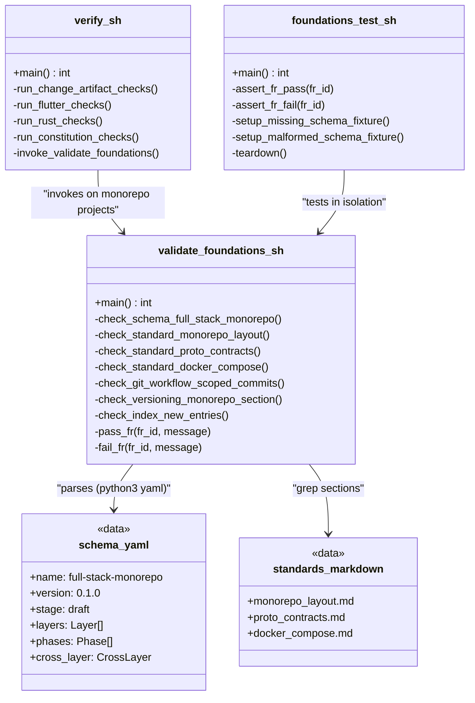
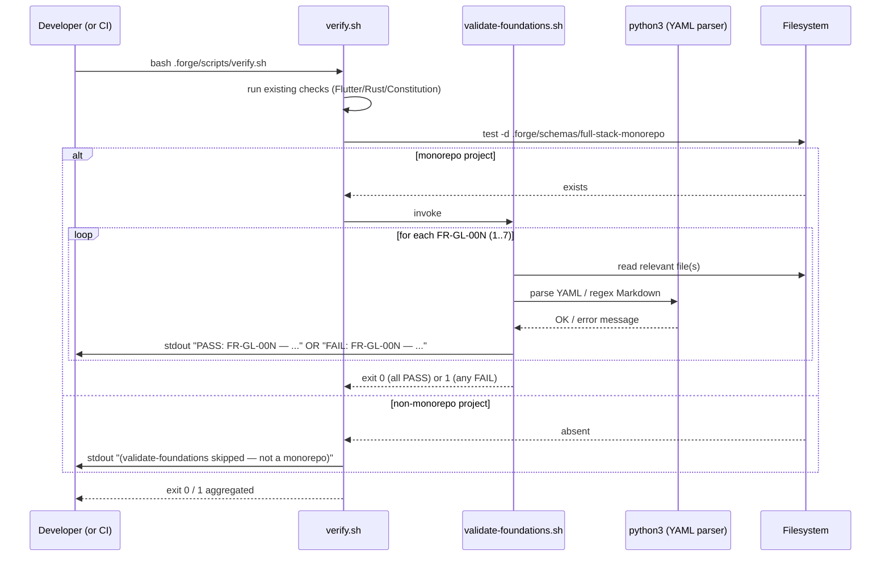
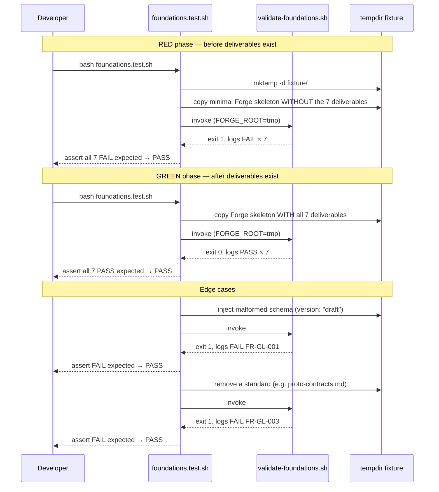

# Design: b1-foundations
<!-- Audit: B.1.1, B.1.5, B.1.10, B.1.11 -->
<!-- Agents invoked: Atlas (infra/tooling lead), Eris (test strategy), Aegis (security pass), Calliope (editorial review) -->
<!-- Flutter/Rust/API architects NOT invoked: no code in this change. -->

## Architecture Decisions

### ADR-001: Validator lives in a dedicated script, invoked from `verify.sh`

- **Context** : FR-GL-008 demande un check structural pour les 7 premiers
  FR. `verify.sh` actuel fait 228 lignes et mélange déjà
  change-artifacts + Flutter + Rust + Constitution. Y ajouter 200 lignes
  de validation YAML/Markdown rendrait le script difficile à relire et à
  tester isolément. Un script dédié facilite aussi la réutilisation depuis
  `b1-scaffolder` (qui voudra valider un monorepo scaffolé chez
  l'adopter).

- **Options Considered** :
    - Option A : étendre `verify.sh` directement (nouvelles sections 5 et
      6). Plus simple à câbler, mais couplage fort, pas de réutilisation.
    - Option B : nouveau script `.forge/scripts/validate-foundations.sh`,
      invoqué conditionnellement depuis `verify.sh` section finale. Testable
      en isolation via `bash validate-foundations.sh`, appelable depuis le
      futur `b1-scaffolder`. Découplage propre.
    - Option C : réécrire `verify.sh` en plusieurs modules sous
      `.forge/scripts/checks/*.sh`. Refactor de fond — hors scope
      b1-foundations.

- **Decision** : **Option B**. Nouveau script
  `.forge/scripts/validate-foundations.sh`, exposant un contrat stable
  (exit 0/1, logs `PASS/FAIL: <FR-ID> — <msg>`). `verify.sh` ajoute une
  section finale qui l'appelle si le répertoire `.forge/schemas/full-stack-monorepo/`
  existe (permet au script de rester no-op tant que le schema n'est pas
  présent, ce qui arrive pour tout projet Forge non-monorepo).

- **Consequences** :
    - ✅ Validator réutilisable depuis `b1-scaffolder` pour vérifier un
      projet fraîchement scaffoldé.
    - ✅ Testable en isolation avec des fixtures (répertoire temp, schema
      invalide → assertion FAIL).
    - ✅ Aucune régression sur les users Forge non-monorepo (le validator
      ne s'active que si le schema existe).
    - ⚠️ Deux scripts shell à maintenir au lieu d'un. Mitigé par des
      helpers partagés (section suivante).

- **Constitution Compliance** : Article V (gates déterministes) — confirmé,
  exit code binaire. Article I (TDD) — le script est écrit après des tests
  qui le précèdent (cycle RED → GREEN strict).

---

### ADR-002: YAML/Markdown parsing via `python3`, pas `yq` ni shell brut

- **Context** : FR-GL-001 exige de parser un YAML, vérifier les champs,
  valider une regex SemVer, vérifier un tableau `layers` de longueur ≥ 3.
  FR-GL-007 exige de parser `index.yml`. FR-GL-002/003/004/006 exigent de
  détecter la présence de sections Markdown nommées.

- **Options Considered** :
    - Option A : `yq` (binaire Go). Puissant, syntaxe JQ. Inconvénient :
      dépendance externe non présente par défaut dans tous les envs dev.
      L'image `forge/linter` devrait être rebuild avec `yq`.
    - Option B : `python3` avec `yaml` + `re` stdlib. Python3 est déjà
      dans l'image `forge/linter` (et sur macOS/Linux par défaut).
      Parsing robuste, messages d'erreur clairs, regex natives.
    - Option C : pur shell (`grep`, `sed`, `awk`). Fragile sur YAML
      multi-ligne, erreurs cryptiques, maintenance pénible.

- **Decision** : **Option B**. Le validator embarque des heredocs Python
  courts (< 30 lignes chacun) pour les vérifications YAML et les regex.
  Shell reste le glue (dispatch des FR, agrégation PASS/FAIL, exit code).

- **Consequences** :
    - ✅ Messages d'erreur parseables (`FAIL: FR-GL-001 — field 'version'
      does not match SemVer: got 'draft'`).
    - ✅ Aucune dépendance nouvelle. Image Docker inchangée.
    - ✅ Python disponible partout (>= 3.8 en pratique sur tous les envs
      cibles).
    - ⚠️ Mélange shell/python dans un script. Mitigé par convention
      stricte : 1 fonction shell = 1 heredoc Python. Documenté en tête du
      script.

- **Constitution Compliance** : Article V.2 (outillage déterministe) —
  python3 stdlib est déterministe. Article VIII.3 (minimal runtime) —
  pas de dépendance ajoutée au runtime/CI.

---

### ADR-003: Test harness en pur shell (POSIX + bash) — pas de `bats` pour l'instant

- **Context** : FR-GL-008 et NFR-001 (idempotence) exigent un harness de
  tests reproductible, idempotent, rapide.

- **Options Considered** :
    - Option A : `bats` (Bash Automated Testing System). Framework dédié,
      syntaxe TAP, asserts propres. Dépendance Homebrew/apt.
    - Option B : pur shell avec `set -euo pipefail`, fonctions
      `assert_pass` / `assert_fail`, fixture dir via `mktemp`. Zéro dep.
    - Option C : Python3 avec `pytest` + `subprocess`. Plus lourd pour ce
      cas d'usage (tester un script shell via subprocess est verbeux).

- **Decision** : **Option B** pour b1-foundations. Les tests vivent sous
  `.forge/scripts/tests/foundations.test.sh`. Un switch vers `bats`
  pourra être évalué en `b1-delivery` si d'autres scripts shell testables
  émergent (Article V.4 permet l'introduction d'outils si justifiée).

- **Consequences** :
    - ✅ Tests exécutables partout sans install. Runtime < 2s (NFR-002).
    - ✅ Même langage que le validator — moins de friction cognitive.
    - ⚠️ Asserts custom (20 lignes de helpers). Peu coûteux à maintenir
      pour 8 FR.

- **Constitution Compliance** : Article I.3 (RED → GREEN → REFACTOR) —
  les tests sont écrits **avant** les livrables, validés en état
  "tout absent" → FAIL, puis en état "tout présent" → PASS.

---

### ADR-004: Schéma démarre en `stage: draft`, `version: 0.1.0` — politique de bump documentée

- **Context** : FR-GL-001 déclare `stage: draft` et `version: "0.1.0"`.
  Il faut une politique claire qui dit **quand** et **par qui** ces
  champs bougent. Sans politique, le risque est que le schema reste figé
  en draft indéfiniment ou que des changements incompatibles passent sans
  bump.

- **Options Considered** :
    - Option A : `stage` et `version` mutés librement par tout contributeur.
      Pas de gouvernance → risque de dérive.
    - Option B : bumps réservés au maintainer lors des release trains
      Forge. Couplé à `VERSION` racine.
    - Option C : bumps déclenchés par événements clairs (b1-scaffolder
      validé, premier adopter, etc.). Plus granulaire.

- **Decision** : **Option C**, documentée dans `schema.yaml` via un
  bloc de commentaires en tête et reprise comme section dédiée dans
  `global/monorepo-layout.md`. Politique :
    - `stage: draft` + `version: "0.x.y"` : schema en évolution libre,
      bumps mineur à chaque modification structurelle.
    - Passage à `stage: candidate` : déclenché **uniquement** par la
      review d'archivage de `b1-scaffolder` (quand un scaffolder réel
      consomme le schema avec succès). Bump à `version: "1.0.0-rc.1"`.
    - Passage à `stage: stable` : déclenché après 3 adopters externes
      publiquement scaffoldés (cf. Module C.1). Bump à `version: "1.0.0"`.
    - Breaking change post-stable : bump major (+ amendement Constitution
      si les articles invoqués changent).

- **Consequences** :
    - ✅ Gouvernance explicite, checkable mécaniquement par `verify.sh`
      (FAIL si `stage: stable` mais `version` pré-1.0, et inversement).
    - ✅ Signal clair aux adopters : tant que `stage ≠ stable`, contrat
      pouvant évoluer.
    - ⚠️ Ajoute un nouveau check structural dans le validator (FR-GL-001
      sub-check). Coût marginal.

- **Constitution Compliance** : Article A6 (SemVer) — confirmé.
  Article III.2 (specs-as-code) — confirmé, le schema **est** une spec
  versionnée.

---

### ADR-005: Standards Markdown sans frontmatter — traçabilité via HTML comment

- **Context** : NFR-004 demande traçabilité `<!-- Audit: B.X.Y -->` en
  tête de chaque livrable. Question : adopte-t-on une frontmatter YAML
  (style Jekyll/Hugo) ou une simple ligne HTML comment ?

- **Options Considered** :
    - Option A : frontmatter YAML. Cohérent avec d'autres écosystèmes
      Markdown. Mais **aucun** standard Forge existant ne l'utilise — on
      créerait une incohérence.
    - Option B : HTML comment `<!-- Audit: B.X.Y -->` + `<!-- Stage: draft -->`
      en première ligne. Cohérent avec les templates existants
      (`proposal.md`, `spec.md` utilisent des HTML comments).

- **Decision** : **Option B**. Première ligne de chaque standard :
  `<!-- Audit: B.1.5 (part of b1-foundations) -->` ; deuxième ligne
  optionnelle `<!-- Stage: draft -->` pour les standards liés au schema
  monorepo.

- **Consequences** :
    - ✅ Cohérence avec le reste de la base Forge.
    - ✅ Parsing trivial par le validator (grep sur la première ligne).
    - ✅ Invisibles au rendu Markdown — pas de pollution visuelle.

- **Constitution Compliance** : Article X.3 (doc publique) — confirmé,
  forme homogène.

---

### ADR-006: `.forge/standards/index.yml` mutation = append strictement ordonné

- **Context** : FR-GL-007 exige l'ajout de 3 entrées à l'index sans
  modifier les existantes. NFR-001 exige l'idempotence.

- **Options Considered** :
    - Option A : append en fin de fichier. Diff minimal, facile à
      reviewer.
    - Option B : insertion dans l'ordre alphabétique par `scope` puis
      `name`. Plus "propre" mais diff plus large.
    - Option C : regrouper par scope via sections YAML. Refactor hors
      scope.

- **Decision** : **Option A**. Les 3 nouvelles entrées sont concaténées à
  la fin du fichier dans l'ordre : `monorepo-layout`, `proto-contracts`,
  `docker-compose`. L'ordre reflète la dépendance logique
  (layout → contrats → outillage local).

- **Consequences** :
    - ✅ Diff minimal et reviewable.
    - ✅ Validator check idempotent : il vérifie juste la présence, pas
      l'ordre.
    - ⚠️ Une réorganisation ultérieure par scope demandera un change
      dédié.

---

### ADR-007: `docs/VERSIONING.md` — nouvelle section `## Monorepo Versioning Models` insérée avant `## Who Bumps the Version`

- **Context** : FR-GL-006 ajoute une section documentant release-train
  vs per-package. L'emplacement impacte la lisibilité.

- **Decision** : insérer la nouvelle section **après** `## Release
  Artifacts` et **avant** `## Who Bumps the Version`. Logique : les
  modèles de versioning sont une question d'**organisation** (après
  l'inventaire des artefacts, avant la gouvernance).

- **Consequences** : neutre. Diff localisé, pas de renommage d'ancres.

---

### ADR-008: `global/git-workflow.md` enrichi avec un bloc conditionnel "monorepo-only"

- **Context** : FR-GL-005 ajoute les Conventional Commits scopés. Cette
  règle **ne s'applique pas** aux projets en schema `default`,
  `tdd-flutter`, `tdd-rust`, `rapid`, `ai-first` — seulement
  `full-stack-monorepo`.

- **Decision** : nouvelle section `## Scoped Conventional Commits
  (monorepo-only)` ajoutée en fin de `git-workflow.md`, introduite par
  la phrase : *"Cette section ne s'applique que si `.forge.yaml` racine
  déclare `schema: full-stack-monorepo`. Pour les autres schemas,
  reportez-vous à la section précédente (Conventional Commits)."*
  La liste close de scopes est encadrée visuellement dans un bloc code
  markdown, facile à parser par le validator et par le futur hook
  pre-commit (b1-delivery / G.2).

- **Consequences** :
    - ✅ Règle scopée au bon périmètre, pas de fausses frictions pour les
      autres schemas.
    - ✅ Parsing du bloc code trivial (regex sur
      `^```[\s\S]*?\{backend.*?\}[\s\S]*?```$`).

---

### ADR-009: `schema.yaml` aligne sa forme sur `default/schema.yaml` + extensions explicites

- **Context** : Éviter un schema incompatible avec les outils internes
  qui lisent déjà `default/schema.yaml`. Les extensions propres au
  monorepo doivent être clairement localisées.

- **Decision** : le schema `full-stack-monorepo/schema.yaml` reprend
  telles quelles les clés de `default/schema.yaml` (`name`, `version`,
  `description`, `tdd_enforced`, `bdd_required_for_user_facing`,
  `coverage_threshold`, `phases`) **avec** trois extensions localisées
  en bas du fichier :
    1. `layers:` — tableau des couches (backend/frontend/infra + éventuel
       shared/).
    2. `stage:` + `schema_version:` — gouvernance de maturité.
    3. `cross_layer:` — objet configurant l'agent Janus (référencé par
       nom, implémentation reportée à `b1-workflow`).

- **Consequences** :
    - ✅ Rétro-compat avec tout consumer de `default/schema.yaml`.
    - ✅ Extension points identifiés, faciles à faire évoluer.

---

## Component Design

### Arborescence créée ou modifiée par ce change

```
.forge/
├── schemas/
│   └── full-stack-monorepo/           # NEW
│       └── schema.yaml
├── standards/
│   ├── global/
│   │   ├── git-workflow.md            # MODIFIED (append section)
│   │   ├── monorepo-layout.md         # NEW
│   │   └── proto-contracts.md         # NEW
│   ├── infra/
│   │   └── docker-compose.md          # NEW
│   └── index.yml                      # MODIFIED (append 3 entries)
└── scripts/
    ├── verify.sh                      # MODIFIED (call validator)
    ├── validate-foundations.sh        # NEW
    └── tests/                         # NEW
        └── foundations.test.sh        # NEW
docs/
└── VERSIONING.md                      # MODIFIED (append section)
.forge/changes/b1-foundations/
├── .forge.yaml                        # existing (status → designed)
├── proposal.md                        # existing
├── specs.md                           # existing
└── design.md                          # this file
```

### Diagramme composant (Mermaid)



## Data Flow

### Flow principal : exécution du validator



### Flow TDD : exécution des tests



## Testing Strategy

Unique couche testable ici : **tests shell** sur le validator. Pas de
couche unit/widget/BDD (pas de code applicatif).

| Type | What to Test | Tool | Coverage Target |
|------|--------------|------|-----------------|
| Shell script unit | Chaque `check_*` fonction du validator, avec fixtures (missing / malformed / valid) | `foundations.test.sh` (pur shell) | 100% des 8 FR |
| Shell script integration | Le validator en bout en bout, invoqué depuis `verify.sh` sur l'état réel du repo | même | 1 scenario réel |
| Idempotence | Exécution 2× de suite produit la même sortie et le même exit code | même | NFR-001 |
| Performance | Durée < 2s sur machine dev standard | `time` + assertion manuelle au design review | NFR-002 |

### Matrice tests ↔ FR

| FR-GL-XXX | Test function | Fixture |
|-----------|---------------|---------|
| 001 — schema exists & valid | `test_schema_present_and_valid()` | schema.yaml complet |
| 001 — schema malformed version | `test_schema_malformed_version_fails()` | schema.yaml avec `version: draft` |
| 001 — schema missing layers | `test_schema_missing_layers_fails()` | schema.yaml sans clé `layers` |
| 002 — monorepo-layout standard | `test_standard_monorepo_layout_present()` | fichier présent avec les 4 sections |
| 003 — proto-contracts standard | `test_standard_proto_contracts_present()` | fichier présent |
| 004 — docker-compose standard | `test_standard_docker_compose_present()` | fichier présent |
| 005 — git-workflow scoped commits | `test_git_workflow_has_scoped_section()` | git-workflow.md enrichi |
| 006 — VERSIONING monorepo models | `test_versioning_has_monorepo_section()` | docs/VERSIONING.md enrichi |
| 007 — index.yml 3 new entries | `test_index_has_three_new_entries()` | index.yml enrichi |
| 008 — meta test (RED state) | `test_red_state_fails_for_all_7()` | fixture sans aucun deliverable |
| 008 — meta test (GREEN state) | `test_green_state_passes_for_all_7()` | fixture complète |
| NFR-001 | `test_idempotence()` | exécution 2× → diff vide |

## Standards Applied

| Standard | How Applied |
|----------|-------------|
| `global/tdd-rules` | Cycle RED → GREEN → REFACTOR strictement appliqué : `foundations.test.sh` écrit **en premier**, validé en FAIL sur fixture vide, puis chaque livrable est ajouté pour faire passer un test précis. Aucune écriture de livrable sans test préalable qui échoue. |
| `global/naming` | Préfixes FR-ID `FR-GL-` (global cross-couches) appliqués à tous les FR de ce change ; scripts en kebab-case ; markdown standards en kebab-case. |
| `global/code-review` | Review d'archivage obligatoire pour valider la qualité éditoriale des 3 nouveaux standards (Calliope sollicité) + conformité constitutionnelle (Aegis sollicité). |
| `global/git-workflow` | **Ne s'applique pas encore** au repo Forge lui-même en mode "scoped" (Forge est en schema `default`). Le livrable enrichit ce standard mais ne l'active pas sur le repo courant. |

## Security Considerations

Aegis signalé. Livrables évalués :

- **`schema.yaml`** : aucun secret, aucune URL d'infra sensible. Fichier
  de configuration déclarative pure. Aucun risque d'injection (pas
  évalué dynamiquement, juste parsé).
- **Scripts shell** (`validate-foundations.sh`, `foundations.test.sh`) :
    - `set -euo pipefail` imposé.
    - Pas de `eval`, pas d'expansion de variables utilisateur dans des
      commandes shell.
    - Les fixtures de test créent des répertoires temp via `mktemp -d` +
      `trap 'rm -rf "$TMPDIR"' EXIT` pour garantir le cleanup même en
      échec.
    - Python heredocs utilisent `yaml.safe_load` (jamais `yaml.load`),
      pas de `pickle`.
- **Standards Markdown** : documentent des pratiques sécurité
  (`proto-contracts` cite Article IX.4 ; `docker-compose` impose
  healthchecks et interdit un compose non suffixé). Aucun secret exposé
  dans les exemples (toute référence à `.env` pointe vers des stubs
  `.env.example`).

**Aucune vulnérabilité résiduelle détectée**. Aegis non sollicité en
review bloquante pour ce change (pas de surface d'attaque réelle).

## Observability Plan

Pas applicable pour ce change — zéro runtime métier, zéro requête
utilisateur, zéro point d'instrumentation pertinent. Le seul signal
observable est l'**exit code** du validator et ses logs stdout, qui
seront agrégés par le workflow CI livré en `b1-delivery` (G.1) via les
mécanismes standards GitHub Actions (step conclusion + annotations).

---

## Constitutional Compliance Gate

Passage article par article avant sauvegarde :

| Article | Statut | Note |
|---------|--------|------|
| I — TDD | ✅ | Cycle RED → GREEN explicite dans ADR-003 et Testing Strategy |
| II — BDD | ✅ (N/A) | Pas de feature user-facing (voir proposal.md) |
| III — Specs Before Code | ✅ | proposal → specs → design avant tout code |
| IV — Delta Specs | ✅ | specs.md utilise ADDED / MODIFIED / REMOVED |
| V — Gates | ✅ | Validator déterministe exit 0/1, logs structurés |
| VI — Flutter arch | ✅ (N/A) | Aucun code Flutter |
| VII — Rust arch | ✅ (N/A) | Aucun code Rust |
| VIII — Infra | ✅ | `docker-compose.md` outille VIII sans le modifier |
| IX — Observability / Security | ✅ | Aegis pass ci-dessus, `proto-contracts.md` renforce IX.4 |
| X — Quality | ✅ | `markdownlint` appliqué, < 100 col, scopes commits documentés |
| XI — AI-First | ✅ (N/A) | Aucune feature IA |

**Aucune violation.** Passage autorisé à `/forge:plan`.

---

*Design complete. Review `design.md`. Next: `/forge:plan b1-foundations`*
