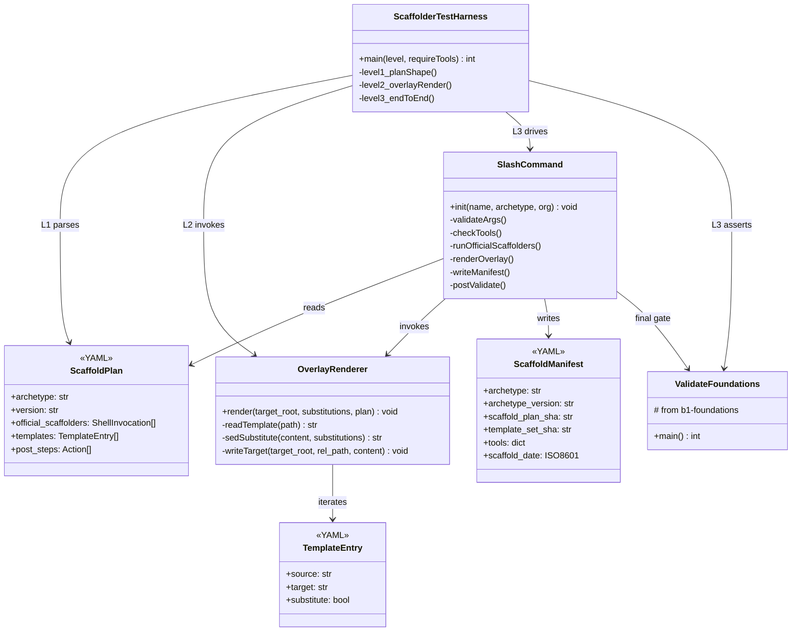
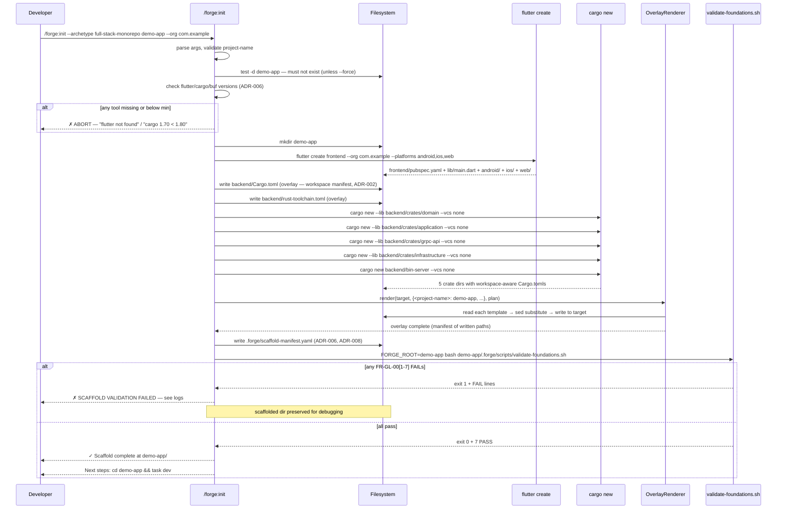
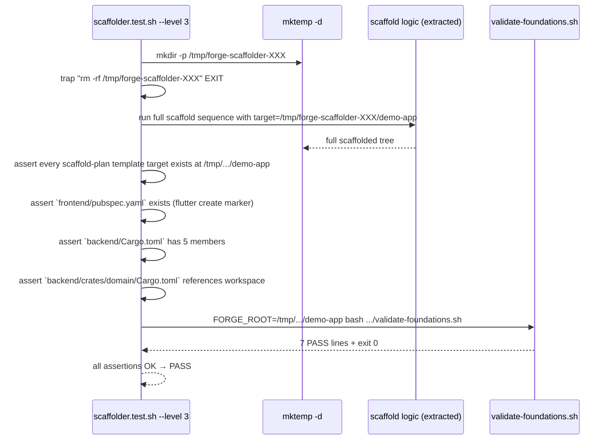

# Design: b1-scaffolder
<!-- Audit: B.1.2 + B.1.3 + B.1.4 + B.1.13 -->
<!-- Agents invoked: Atlas (scaffolding + infra lead), Athena (Flutter overlay), Ferris (Rust workspace), Hermes-API (proto contract), Eris (test strategy), Calliope (template editorial) -->
<!-- Depends on: b1-foundations (archived) -->

## Architecture Decisions

### ADR-001: Scaffold plan is a declarative YAML manifest; slash command is the driver

- **Context** — FR-GL-010 demands a machine-readable plan as the single
  source of truth for "what gets generated". The slash command
  `/forge:init` should not embed 25+ template filenames inline.

- **Options Considered** —
    - Option A : hardcode the overlay list in the Markdown slash command.
      Simplest, but any template addition means editing a huge prose
      file. Not maintainable.
    - Option B : one YAML manifest (`scaffold-plan.yaml`) + a concise
      slash-command Markdown that reads it. Contributors add a template
      by editing two files (the template + the manifest entry). Matches
      the pattern of `scaffold.ts` domain logic in the CLI.
    - Option C : a full-blown Python scaffolder binary. Over-engineered
      for 25 files. New dependency surface (click/argparse, jinja2).
      Deferred to a future CLI change if actually needed.

- **Decision** — **Option B**. The manifest lives at
  `.forge/templates/archetypes/full-stack-monorepo/scaffold-plan.yaml`.
  The slash command orchestrates via bash invocations, reading the plan
  via `python3 + PyYAML` (consistent with ADR-002 of `b1-foundations`).

- **Consequences** —
    - ✅ Additive workflow : new template = new manifest entry.
    - ✅ Testable in isolation (level-1 test in ADR-010 parses and
      validates the plan without any external tool).
    - ✅ A future `@sdd-forge/cli` extension can consume the same plan.
    - ⚠️ Slash command remains long (needs to document the sequence) but
      its BODY is scripted logic rather than data. Fine.

- **Constitution Compliance** — Article III.2 (specs-as-code), Article V
  (deterministic gates).

---

### ADR-002: Cargo workspace members are listed explicitly upfront

- **Context** — FR-BE-001 requires 5 crates (`domain`, `application`,
  `grpc-api`, `infrastructure`, `bin-server`). One of the proposal's
  open questions : should `cargo new --lib` auto-append to `members`,
  or do we write the `members` list upfront?

- **Options Considered** —
    - Option A : create `backend/` empty → run `cargo new --lib
      crates/<name>` for each crate → let Cargo auto-detect and
      auto-append to a non-existing parent workspace. This FAILS
      because Cargo does not create a workspace manifest
      retroactively ; without a pre-existing `[workspace]` block,
      each `cargo new` creates an independent package.
    - Option B : write `backend/Cargo.toml` FIRST with an explicit
      `members = ["crates/domain", "crates/application", "crates/grpc-api",
      "crates/infrastructure", "bin-server"]` list → then run
      `cargo new --lib crates/<name>` for each crate. Cargo detects
      the parent workspace, skips the root manifest generation, and
      creates each crate's `Cargo.toml` with the workspace inheritance
      (`[package] workspace = ".."`).
    - Option C : run `cargo new` on each crate first (independent
      packages) → then rewrite `backend/Cargo.toml` to hoist them into
      a workspace. Three-phase dance. Fragile.

- **Decision** — **Option B**. Scaffolder sequence for the backend :
    1. `mkdir -p backend/crates`.
    2. Render `backend/Cargo.toml` template with the explicit `members`
       list substituted.
    3. Render `backend/rust-toolchain.toml` (edition 2021 — stable since
       Rust 1.56, universally supported ; upgrade to 2024 documented
       in the scaffolded README as an adopter choice).
    4. `cd backend && cargo new --lib crates/domain --vcs none` (and
       the other four crates). Because `Cargo.toml` already declares
       a workspace at `backend/`, each invocation creates a crate that
       inherits the workspace.

- **Consequences** —
    - ✅ Deterministic : one sequence, no Cargo-version-dependent
      auto-append heuristics.
    - ✅ Validator-checkable : the integration test asserts the 5
      crate directories exist AND that `backend/Cargo.toml` has all 5
      in `members`.
    - ⚠️ The scaffolded `backend/Cargo.toml` is a Forge overlay, not
      something produced by `cargo new`. **BUT** this does NOT violate
      B.5.6 (official scaffolder first) because the overlay path is
      the workspace root which `cargo new` never produces on its own —
      it only produces crate-level `Cargo.toml`, not workspace-level.
      The template header carries `<!-- Overlay: workspace manifest,
      not generated by cargo new -->` for traceability (per ADR-005).

- **Constitution Compliance** — Article VII.3 (hexagonal Rust), audit
  rule B.5.6 (scaffolder-first, overlay-second ; documented overrides
  allowed).

---

### ADR-003: Scaffolder test harness is an independent top-level script

- **Context** — Open question from the proposal : should
  `scaffolder.test.sh` be wired into the existing
  `foundations.test.sh`, or live independently?

- **Options Considered** —
    - Option A : append scaffolder tests to `foundations.test.sh` as
      additional `run_test` entries. Coherent with the existing
      harness. BUT : external-tool dependencies (flutter, cargo, buf)
      leak into a harness that today has zero external deps.
    - Option B : standalone `.forge/scripts/tests/scaffolder.test.sh`
      invoked by `verify.sh` section 6 only when the archetype template
      directory is present AND `--include-scaffolder` is passed (or an
      env var is set). Keeps foundations harness clean.
    - Option C : a single top-level runner
      `.forge/scripts/tests/run-all.sh` that dispatches to the
      appropriate harnesses. Over-engineered for 2 harnesses.

- **Decision** — **Option B**. Standalone harness with three levels of
  coverage (ADR-010). Level 1 + 2 run without external tools ; level 3
  is gated by `--require-external-tools` flag and is the only level
  that invokes `flutter create` / `cargo new` / `buf`.

- **Consequences** —
    - ✅ `foundations.test.sh` remains always-green on any machine.
    - ✅ Scaffolder tests are opt-in for CI matrices that have the
      tools installed ; portable dev machines can still run level 1+2.
    - ⚠️ Two harnesses to maintain. Mitigated by shared helper
      library : the reusable bits from `foundations.test.sh`
      (`assert_eq`, `assert_contains`, `run_test` pattern) are extracted
      into a new `.forge/scripts/tests/_helpers.sh` sourced by both
      harnesses — deferred refactor, first-pass just copies.

- **Constitution Compliance** — Article I (TDD applies regardless of
  harness count), Article V (deterministic gates per harness).

---

### ADR-004: Proto skeleton is project-agnostic (`example.v1.ExampleService`)

- **Context** — Open question : package naming for the seed proto.

- **Options Considered** —
    - Option A : `<project_name>.example.v1`. Couples the seed to the
      project identity. When the adopter builds real services, they'd
      have to rename the package. Unnecessary churn.
    - Option B : `example.v1`. Project-agnostic. Clearly a seed ("delete
      me or replace me"). The adopter's real services go in
      `<project>.<service>.v1` packages next to it.

- **Decision** — **Option B**. `example.v1.ExampleService` with a
  single `Ping(PingRequest) returns (PingResponse)` RPC. Each message
  has one field (`message string payload = 1` for the request,
  `string reply = 1` for the response). Enough to exercise `buf lint`,
  `buf breaking`, and both codegen toolchains.

- **Consequences** —
    - ✅ Immediately obvious that this is a sample.
    - ✅ Rename is trivial when the adopter adds real services.
    - ✅ Minimum proto surface keeps `buf lint` fast.

- **Constitution Compliance** — Article IV (delta spec pattern applies
  to protos just as to markdown — new service = ADDED entry, rename =
  MODIFIED).

---

### ADR-005: Template substitution uses pure bash `sed` with `|` delimiter

- **Context** — Templates carry `<project-name>`, `<reverse-domain>`,
  `<root-module>` placeholders. The scaffolder must replace them
  faithfully without introducing a templating DSL dependency.

- **Options Considered** —
    - Option A : Python + `string.Template` or `jinja2`. Rich, but
      adds a new dep or widens Python usage. `jinja2` is not stdlib.
    - Option B : Pure `sed` with `|` as delimiter (so `/` characters
      in paths don't need escaping). Placeholders use the `<name>`
      convention which `sed` handles literally.
    - Option C : `envsubst`. Requires the placeholders to be shaped
      like `${VAR}`. Breaks if the template legitimately contains
      `${...}` (e.g. bash examples, Taskfile variable interpolation).

- **Decision** — **Option B**. `sed -e 's|<project-name>|<actual>|g' -e
  's|<reverse-domain>|<actual>|g' -e 's|<root-module>|<actual>|g'`.
  Run once per template file during overlay. `|` as delimiter prevents
  the common `/` collision.

- **Consequences** —
    - ✅ Zero new dep.
    - ✅ Templates are Markdown / YAML / Dart / Rust files that happen
      to contain `<name>` placeholders — no special syntax to learn.
    - ⚠️ No conditional blocks, no loops. If the archetype ever needs
      those, upgrade to Option A. For now YAGNI.

- **Constitution Compliance** — Article V.4 (prefer minimal tooling).

---

### ADR-006: External tool version policy — check early, record for audit

- **Context** — FR-GL-011 requires checking `flutter`, `cargo`, `buf`
  are on PATH. NFR-008 requires recording tool versions in a scaffold
  manifest.

- **Options Considered** —
    - Option A : soft-check (warn if missing, continue). Unacceptable —
      a missing `flutter` leads to a half-scaffolded mess.
    - Option B : hard-check BEFORE creating any file ; abort with a
      clear message if any tool is missing or below minimum version.
      Record exact versions in `.forge/scaffold-manifest.yaml` inside
      the generated project.
    - Option C : install-on-demand (download flutter SDK if missing).
      Way too invasive for a scaffolder. No.

- **Decision** — **Option B**. Minimums :
    - `flutter` ≥ 3.24 (channel `stable`).
    - `cargo` ≥ 1.80 (stable workspace semantics, edition 2024
      parseable though we default to 2021).
    - `buf` ≥ 1.30 (stable lint rules, breaking-change detection).

  Version comparison via a tiny awk helper :
  ```bash
  version_ge() { awk -v v="$1" -v min="$2" 'BEGIN {
    split(v,  a, "."); split(min, b, ".");
    for (i=1;i<=3;i++) if ((a[i]+0) != (b[i]+0)) exit !((a[i]+0) > (b[i]+0));
    exit 0;
  }'; }
  ```
  Record in `<target>/.forge/scaffold-manifest.yaml` :
  ```yaml
  archetype: full-stack-monorepo
  archetype_version: "0.1.0"
  scaffold_plan_sha: <sha256-of-scaffold-plan.yaml>
  template_set_sha: <sha256-of-concat-of-all-templates>
  tools:
    flutter: "3.27.1"
    cargo:   "1.82.0"
    buf:     "1.46.0"
  scaffold_date: "2026-04-21T15:30:00Z"
  ```

- **Consequences** —
    - ✅ Adopter can grep `scaffold-manifest.yaml` to learn exactly
      which tool versions produced the tree. Useful for debugging
      flaky scaffolds (e.g. Flutter changed a default).
    - ✅ `b1-workflow` can later add a "manifest drift" check that
      warns the adopter if their local tools are now far ahead.
    - ⚠️ One more file to render consistently. Added to scaffold-plan
      as a `post_steps` action, not a template.

- **Constitution Compliance** — Article V (deterministic, reproducible
  gates), Article X (auditability).

---

### ADR-007: Post-scaffold validation is the last non-negotiable step

- **Context** — FR-GL-011 mandates that
  `validate-foundations.sh` runs against the freshly-scaffolded target
  and any FAIL aborts the command.

- **Decision** — after overlay + manifest write, the slash command
  runs `FORGE_ROOT=<target> bash <target>/.forge/scripts/validate-foundations.sh`
  (not the repo's copy — the copy that landed in the scaffolded
  target, because that's what the adopter will use going forward).
  Non-zero exit code → the slash command prints `[SCAFFOLD VALIDATION
  FAILED]` and surfaces every FAIL line ; the scaffolded directory is
  **preserved** (not deleted) so the developer can inspect.

- **Consequences** —
    - ✅ Any scaffolded project is guaranteed to pass the contract
      at least once — at scaffold time.
    - ✅ Divergence between template evolution and contract is caught
      on the first test run in CI.
    - ⚠️ Requires the scaffolded copy of `.forge/` to include the
      validator. The scaffold plan lists `validate-foundations.sh`,
      `tests/foundations.test.sh`, `verify.sh`, and
      `constitution-linter.sh` as templates copied verbatim (no
      substitution).

- **Constitution Compliance** — Article I.3 (the scaffolded tree
  starts in GREEN), Article V.

---

### ADR-008: Scaffold manifest locks the archetype version at gen time

- **Context** — Over time, the archetype template tree evolves
  (bug fixes, new templates). An adopter who scaffolded at archetype
  `0.1.0` should be able to inspect, later on, which version they're
  based on — and `b1-delivery`'s `forge upgrade` needs this to compute
  a safe diff.

- **Decision** — `.forge/scaffold-manifest.yaml` (per ADR-006) records
  `archetype_version` exactly equal to the `version` field from
  `scaffold-plan.yaml` at scaffold time. `forge upgrade` compares this
  to the current archetype's version and plans the migration.

- **Consequences** —
    - ✅ Non-destructive upgrade becomes mechanically computable.
    - ⚠️ The scaffold-plan.yaml's `version` must bump with every
      template change. Governance rule added to the archetype docs
      and enforced by a future CI check in `b1-delivery`.

- **Constitution Compliance** — Article X (quality, reproducibility).

---

### ADR-009: Nested `CLAUDE.md` templates are authoritative — they gate standards loading

- **Context** — FR-GL-010 from `b1-foundations` mandates nested
  `CLAUDE.md` that scope which standards Claude Code loads when
  navigating a subtree. b1-scaffolder ships the three templates.

- **Decision** — Each nested `CLAUDE.md` declares :
    - The layer's scope (`frontend`, `backend`, `infra`).
    - The canonical standards to load (via their `id` in `index.yml`).
    - The canonical agent(s) for work in this subtree (`Hera` for
      frontend, `Vulcan` for backend, `Atlas` for infra).
    - Explicit exclusion of standards from other scopes (negative
      declaration — "do NOT load `rust/architecture` here" when inside
      `frontend/`).
    - Cross-reference to the root `CLAUDE.md` for cross-cutting
      policies.

- **Consequences** —
    - ✅ LLM context stays tight when Claude Code works in a single
      layer.
    - ✅ The nested CLAUDE.md become the de facto routing policy,
      matching the orchestrator pattern in `forge-master.md`.
    - ⚠️ Requires keeping the nested templates in sync with
      `index.yml` as standards evolve. `b1-workflow` will add a CI
      check that each nested CLAUDE.md references only standards that
      exist in `index.yml`.

- **Constitution Compliance** — Article V (JIT loading), Article X
  (quality).

---

### ADR-010: Three-level test strategy (plan → overlay → end-to-end)

- **Context** — FR-GL-014 demands a scaffolder integration test. External
  tools are expensive (`flutter create` takes ~20s, downloads SDK on
  first run) and unavailable on minimalist CI runners.

- **Options Considered** —
    - Option A : only end-to-end tests ; skip the whole harness if any
      tool is missing. Simple but loses coverage on CI.
    - Option B : three levels :
        - **L1 : plan validation** — parse `scaffold-plan.yaml`, assert
          YAML shape, assert every `source:` file exists in the
          archetype tree. Zero external deps.
        - **L2 : overlay rendering** — in a tmpdir, render the overlay
          without running `flutter create` or `cargo new` (just create
          the expected directory skeleton and overlay the templates).
          Assert target files exist and contain expected substitutions.
          Zero external deps.
        - **L3 : full end-to-end** — requires `flutter` + `cargo` +
          `buf`. Runs the complete scaffold sequence. Gated by
          `--require-external-tools` flag, WARN-skip otherwise.

- **Decision** — **Option B**. `scaffolder.test.sh` accepts
  `--level 1|2|3` (default : auto-detect, L3 if tools present else
  L2) and `--require-external-tools`.

- **Consequences** —
    - ✅ Always-green on any machine with L1 + L2.
    - ✅ CI matrix can have a "full tools" runner that executes L3 on
      every PR.
    - ✅ Tight TDD loop : L1 + L2 run in ~1s.
    - ⚠️ Three code paths to maintain. Shared helpers mitigate.

- **Constitution Compliance** — Article I (TDD : tests written first
  for each level).

---

### ADR-011: BDD feature file mirrors AC blocks, not scenarios fabricated anew

- **Context** — Article II requires `.feature` files for user-facing
  features. The 7 AC blocks in `specs.md` are already Gherkin.

- **Decision** — create `.forge/changes/b1-scaffolder/features/b1-scaffolder.feature`
  with one `Scenario:` per AC block (AC-001..007). No invented
  scenarios. Background clause declares shared preconditions
  (tools on PATH, tmpdir ready). Step runner : `scaffolder.test.sh`
  (level 3) acts as the Gherkin executor for the E2E scenarios ; L1
  + L2 cover the plan-parsing and overlay scenarios directly.

- **Consequences** —
    - ✅ Single source of truth : the AC blocks in `specs.md` and the
      `.feature` file are synchronized by convention (Calliope review
      checks this during `/forge:review`).
    - ✅ Article II check in `constitution-linter.sh` is satisfied.

- **Constitution Compliance** — Article II.

---

## Component Design

### Artifact tree created or modified

```text
.forge/
├── templates/
│   └── archetypes/
│       └── full-stack-monorepo/        # NEW
│           ├── scaffold-plan.yaml      # NEW — single source of truth
│           ├── CLAUDE.md.tmpl          # NEW — root routing-only
│           ├── Taskfile.yml.tmpl       # NEW
│           ├── docker-compose.dev.yml.tmpl  # NEW
│           ├── .env.example.tmpl       # NEW
│           ├── .gitignore.tmpl         # NEW
│           ├── .forge.yaml.tmpl        # NEW — declares schema
│           ├── README.md.tmpl          # NEW
│           ├── frontend/
│           │   └── CLAUDE.md.tmpl      # NEW — nested Flutter scope
│           ├── backend/
│           │   ├── CLAUDE.md.tmpl      # NEW — nested Rust scope
│           │   ├── Cargo.toml.tmpl     # NEW — workspace manifest
│           │   └── rust-toolchain.toml.tmpl  # NEW
│           ├── infra/
│           │   ├── CLAUDE.md.tmpl      # NEW — nested Atlas scope
│           │   ├── kong/kong.yml.example.tmpl
│           │   ├── docker/Dockerfile.backend.example.tmpl
│           │   ├── k8s/base/.gitkeep
│           │   └── k8s/overlays/.gitkeep
│           ├── shared/protos/
│           │   ├── buf.yaml.tmpl       # NEW
│           │   ├── buf.gen.yaml.tmpl   # NEW
│           │   └── v1/example/example.proto.tmpl  # NEW
│           └── .github/workflows/.gitkeep
├── scripts/
│   ├── tests/
│   │   ├── _helpers.sh                 # NEW — shared between harnesses
│   │   └── scaffolder.test.sh          # NEW — 3-level harness
│   └── verify.sh                       # MODIFIED — section 6 for scaffolder test
└── changes/b1-scaffolder/
    ├── .forge.yaml                     # existing (status → designed)
    ├── proposal.md                     # existing
    ├── specs.md                        # existing
    ├── design.md                       # this file
    ├── tasks.md                        # next phase
    └── features/
        └── b1-scaffolder.feature       # NEW (ADR-011)
.claude/commands/forge/
└── init.md                             # MODIFIED — archetype branch documented
```

### Component diagram



---

## Data Flow

### Scaffold sequence (happy path)



### Test harness flow (level 3 end-to-end)



---

## Testing Strategy

### Three levels (ADR-010)

| Level | Deps | Tests | Duration |
|---|---|---|---|
| **L1 : plan** | None | YAML parse, `templates[].source` existence, `official_scaffolders[].cmd` syntax, version format, schema conformance | ~100 ms |
| **L2 : overlay** | None | Render the overlay on a tmpdir pre-seeded with fake `flutter create` / `cargo new` output (mock files). Assert substitutions applied, target paths correct, `scaffold-manifest.yaml` written, `--force` semantics | ~500 ms |
| **L3 : E2E** | flutter, cargo, buf | Full scaffold in tmpdir, assert every `AC-001..007` scenario | ~30 s (first run), ~10 s (warm) |

### Test ↔ FR matrix

| FR / AC | L1 | L2 | L3 | Other |
|---|---|---|---|---|
| FR-GL-009 (template tree) | ✓ file existence | ✓ overlay produces every target | ✓ E2E |  |
| FR-GL-010 (scaffold plan) | ✓ YAML parse + schema | ✓ plan drives overlay | ✓ |  |
| FR-GL-011 (slash command) |  | ✓ substitution logic | ✓ tool check, sequence, validation gate | Manual dry-run |
| FR-BE-001 (Cargo workspace) |  | ✓ backend/Cargo.toml content | ✓ cargo check succeeds on scaffolded tree |  |
| FR-FE-001 (flutter create) |  |  | ✓ files from flutter create are byte-identical post-overlay | |
| FR-IN-001 (infra stubs) |  | ✓ `.example` suffix + `.gitkeep` | ✓ E2E |  |
| FR-GL-012 (Taskfile) | ✓ Taskfile.yml.tmpl has required targets | ✓ after substitution | ✓ `task --list` on scaffolded tree |  |
| FR-GL-013 (proto skeleton) | ✓ proto file present | ✓ substitution | ✓ `buf lint` + `buf breaking` |  |
| FR-GL-014 (integration harness) |  |  |  | self-test : L1 + L2 + L3 run against fixtures |
| NFR-005 (idempotence `--force`) |  | ✓ twice-run diff | ✓ |  |
| NFR-006 (perf < 30s) |  |  | ✓ time budget |  |
| NFR-007 (test isolation) |  | ✓ mktemp + trap |  |  |
| NFR-008 (manifest) |  | ✓ manifest written | ✓ tool versions present |  |

### BDD scenarios (ADR-011)

7 `.feature` scenarios in `features/b1-scaffolder.feature` map 1-to-1
with AC-001..007 in specs.md. L3 test harness executes the E2E-flavored
scenarios (AC-001, AC-002, AC-003, AC-004, AC-005, AC-006). AC-007
(scaffold plan parseability) is executed by L1.

---

## Standards Applied

| Standard | How Applied |
|---|---|
| `global/tdd-rules` | Each level of the scaffolder harness follows RED → GREEN → REFACTOR. L1 tests written before `scaffold-plan.yaml` ; L2 before the OverlayRenderer logic ; L3 before the full slash-command branch. |
| `global/bdd-rules` | `.feature` file mirrors AC blocks. L3 harness acts as step runner for E2E scenarios. |
| `global/clean-architecture` | Scaffolder is a thin orchestrator (slash command) over a plan (data), a renderer (logic), and the validator (gate). Pure-logic pieces are testable in isolation (L1, L2). |
| `global/monorepo-layout` | **Consumed** — the scaffolded tree materializes the layout prescribed by this standard. |
| `global/proto-contracts` | **Consumed** — proto starter conforms to `v1/` namespacing, `buf lint` / `buf breaking` gates prescribed by the standard. |
| `infra/docker-compose` | **Consumed** — `docker-compose.dev.yml.tmpl` uses `fsm-` prefix, `fsm-dev` network, healthchecks. |
| `global/git-workflow` | Commit messages in this change use `feat(forge):` scope (Forge is in `schema: default` ; the closed-list scoped commits only apply when `.forge.yaml` schema is `full-stack-monorepo`). |
| `global/naming` | Template filenames use `.tmpl` suffix consistently ; placeholders use `<kebab-case>` form. |

---

## Security Considerations (Aegis)

- **External command execution** — `flutter create`, `cargo new`, `buf`
  are invoked via `bash -c` indirectly through the slash command. All
  arguments are validated (`--org` pattern, `--project-name` pattern)
  via regex BEFORE interpolation into shell. Injection vector :
  `<reverse-domain>` is regex-constrained to `^[a-zA-Z][a-zA-Z0-9]*(\.[a-zA-Z][a-zA-Z0-9]*)+$`,
  `<project-name>` to `^[a-z][a-z0-9_-]{0,39}$`. No user input reaches
  bash unquoted.
- **Target-path traversal** — `<project-name>` is used both as a
  directory name and substituted into templates ; the regex above
  prevents `..` and `/`. Scaffolder aborts if the sanitized name
  differs from the input.
- **PyYAML loader** — ADR-002 of `b1-foundations` extends here :
  `yaml.safe_load` only, never `yaml.load`, when reading
  `scaffold-plan.yaml`.
- **Shell hardening** — slash command orchestration uses `set -euo
  pipefail`, `trap 'rm -rf "$TMPDIR"' EXIT` in tests, no `eval`.
- **Generated secrets** — `.env.example.tmpl` contains no real
  credentials. `.env` is in `.gitignore`. `scaffold-manifest.yaml`
  contains only versions and SHAs, no secrets.
- **Downloaded artifacts** — `flutter create` may download SDK
  components ; `buf` may download plugin binaries. Both are via the
  adopter's own tool installation ; the scaffolder does not download
  anything directly. Documented in README template.

**Aegis verdict : PASS** (same posture as `b1-foundations`, extended to
cover external process invocations).

---

## Observability Plan

N/A for the scaffolder itself (one-shot command, no runtime service).
The scaffold manifest records tool versions for post-hoc debugging,
which IS the observability signal for "why did this scaffold behave
differently on a different machine". `b1-delivery` will add telemetry
for `forge upgrade` (planned, out of scope here).

---

## Constitutional Compliance Gate

| Article | Status | Note |
|---|---|---|
| I — TDD | ✅ | Per-level RED → GREEN → REFACTOR (ADR-010) |
| II — BDD | ✅ | 7-scenario .feature file (ADR-011) |
| III — Specs Before Code | ✅ | proposal → specs → design → tasks |
| IV — Delta Specs | ✅ | specs.md is ADDED-only, consistent with b1-foundations full-stack-monorepo.md |
| V — Gates | ✅ | Deterministic validator called at scaffold end (ADR-007) |
| VI — Flutter arch | ✅ | Overlay on `flutter create`, FSD + Clean Architecture preserved (FR-FE-001) |
| VII — Rust arch | ✅ | 5-crate hexagonal workspace (ADR-002, FR-BE-001) |
| VIII — Infra | ✅ | docker-compose.dev.yml conforms to `infra/docker-compose.md` |
| IX — Observability / Security | ✅ | Aegis pass above |
| X — Quality | ✅ | Template headers carry Audit IDs, manifest tracks tool versions, scaffold plan is single source of truth |
| XI — AI-First | ✅ N/A | No AI feature |

**Zero violation.** Passage authorized to `/forge:plan b1-scaffolder`.

---

*Design complete. Review `design.md`. Next: `/forge:plan b1-scaffolder`*
