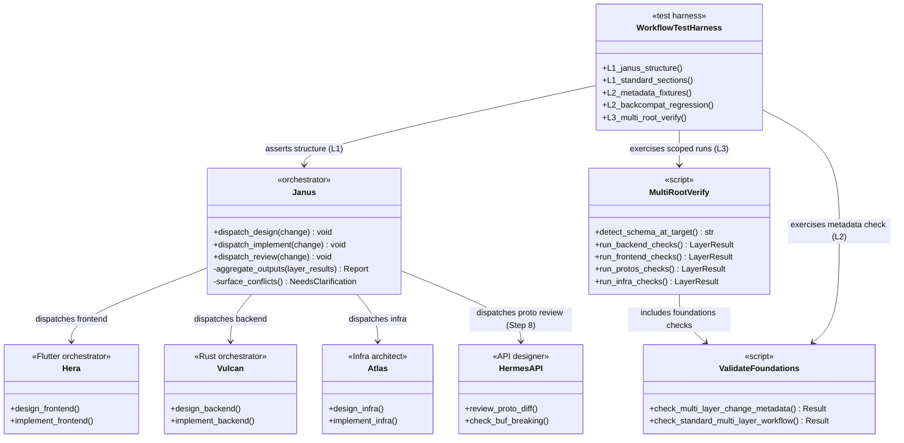
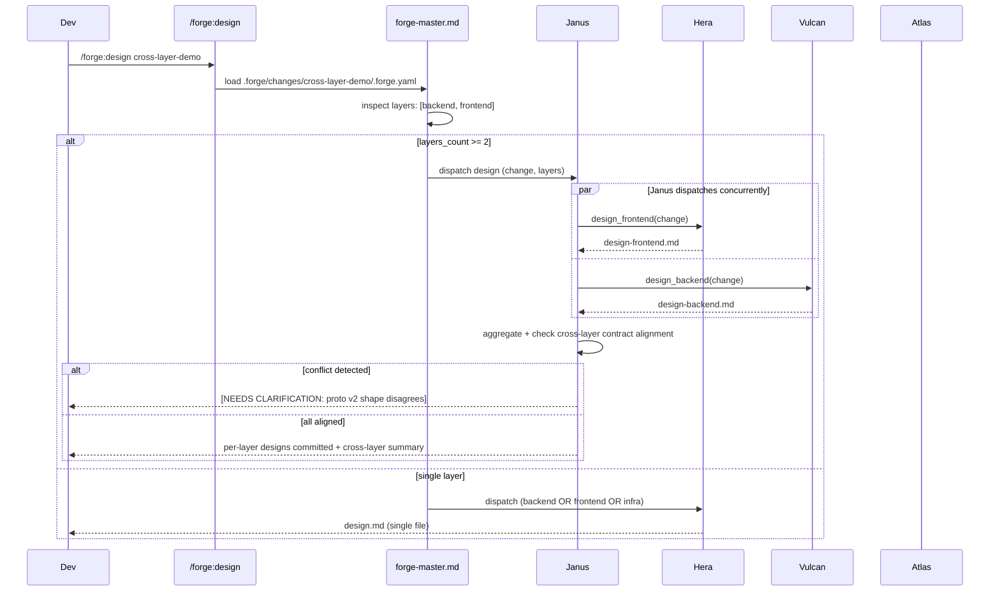
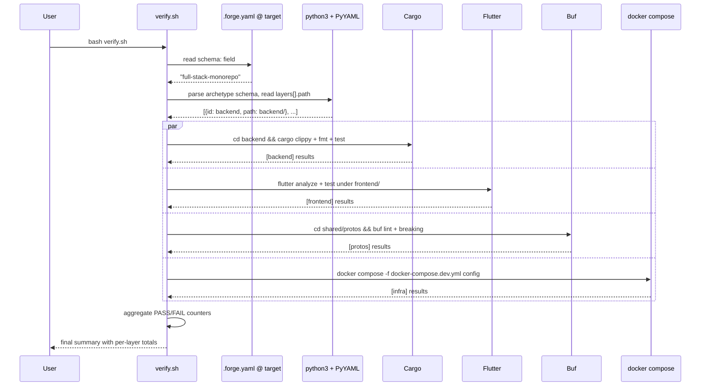

# Design: b1-workflow
<!-- Audit: B.1.6 + B.1.7 + B.1.8 -->
<!-- Agents invoked: Atlas (multi-root scripts), Eris (test strategy), Aegis (security pass on Janus dispatch), Calliope (Janus agent editorial + standard tone) -->
<!-- Depends on: b1-foundations + b1-scaffolder (both archived) -->

## Architecture Decisions

### ADR-001: Janus is a pure orchestrator — never writes application code

- **Context** — FR-GL-015 demands an orchestrator for cross-layer
  changes. The existing pattern in Forge (Hera, Vulcan, Atlas,
  forge-master) distinguishes *orchestrators* (delegate + aggregate,
  never write code) from *specialists* (write code in their layer).

- **Options Considered** —
    - Option A : Janus delegates AND writes "glue" code at the
      protos boundary. Problematic : blurs the orchestrator /
      specialist split, makes review harder (Janus + Hermes-API both
      touch `shared/protos/`), creates accountability drift.
    - Option B : Janus is a pure orchestrator. Every output it
      produces is either (a) a routing decision, (b) an aggregation
      of specialist outputs, or (c) a `[NEEDS CLARIFICATION: ...]`
      marker. It NEVER edits `frontend/`, `backend/`, `infra/`,
      `shared/protos/`.

- **Decision** — **Option B**. Janus's agent file (FR-GL-015)
  declares the invariant in its Persona section : *"Janus never
  writes application code. If a code change is needed, Janus
  dispatches."*

- **Consequences** —
    - ✅ Single responsibility. Review is per-layer with a top-level
      cross-layer summary from Janus.
    - ✅ Testability : AC-007 "Janus never writes code" is a
      mechanical check (scan for file-write tool calls in Janus's
      transcript).
    - ⚠️ Janus has no "quick fix" shortcut — even a one-line
      contract-alignment fix goes through Hermes-API. Friction cost
      accepted ; keeps the boundary clean.

- **Constitution Compliance** — Article V (gates), Article X
  (quality : orchestrators do not code).

---

### ADR-002: Multi-layer metadata uses a map keyed by layer id

- **Context** — Open question from proposal : `designs_per_layer:`
  shape, map vs list.

- **Options Considered** —
    - Option A : list with `layer:` + `file:` per entry. Uniform
      with `official_scaffolders:` pattern from `scaffold-plan.yaml`.
      But iteration-heavy in shell / python ("find the entry where
      layer == 'backend'").
    - Option B : map keyed by layer id (`backend:
      design-backend.md`). Direct `data['designs_per_layer']['backend']`
      lookup. Mirrors the `layers:` list semantically (same keys).

- **Decision** — **Option B**. Map with explicit keys, where keys
  are a subset of the archetype schema's `layers[].id`.

- **Consequences** —
    - ✅ O(1) lookup in the validator check.
    - ✅ Prevents duplicate entries (map keys are unique by
      construction).
    - ✅ Validator rejects unknown layer ids by comparing keys
      against `schema.yaml layers[].id`.
    - ⚠️ YAML map syntax is slightly less self-documenting than a
      list of records ; mitigated by a rich template comment block
      in `change.yaml`.

- **Constitution Compliance** — Article III.2.

---

### ADR-003: Proto-contract steps delegate to Hermes-API, not Janus

- **Context** — Open question : when a cross-layer change touches
  `shared/protos/`, should Janus own the contract review or
  dispatch to Hermes-API ?

- **Decision** — **Dispatch to Hermes-API**. Janus's 12-step workflow
  includes a step 8 "Contract Alignment" whose *only action* is to
  invoke Hermes-API with the proto diff and collect its verdict.
  Janus never inspects proto semantics itself.

- **Consequences** —
    - ✅ Single-responsibility preserved : Hermes-API owns the proto
      contract standard, Janus owns the cross-layer choreography.
    - ✅ `buf breaking` remains Hermes-API's gate (`global/proto-contracts.md`).
    - ⚠️ Two round-trips on proto-touching changes (Janus → Hermes-API
      → back to Janus). Acceptable — protos change slowly.

- **Constitution Compliance** — Article IX.4 (contracts as security
  surface — Hermes-API remains the authority).

---

### ADR-004: Layer paths are read dynamically from `schema.yaml layers[].path`

- **Context** — Open question : hardcode `frontend/` / `backend/`
  / `infra/` in the multi-root scripts, or read paths from the
  archetype schema ?

- **Options Considered** —
    - Option A : hardcode. Simpler. Breaks if an adopter renames
      `backend/` to `server/` (legitimate for projects with an
      existing layout).
    - Option B : read `layers[].path` from
      `<FORGE_ROOT>/.forge/schemas/full-stack-monorepo/schema.yaml`.
      Adopters who customize paths get the scripts to follow.

- **Decision** — **Option B**. `verify.sh` + `constitution-linter.sh`
  + the workflow validator parse the target's schema (via python3 +
  PyYAML — ADR-002 of b1-foundations) and use `layers[].path`. If
  the schema is absent or malformed, single-root mode is preserved
  (ADR-006).

- **Consequences** —
    - ✅ Respects adopters who change the layout.
    - ✅ Canonical source of truth : the schema.
    - ⚠️ Schema parse cost on every `verify.sh` run. Mitigated : the
      parse is ~10 ms on the current schema, amortized by the 30s
      overall budget (NFR-009).

- **Constitution Compliance** — Article III.2 (specs-as-code), V.

---

### ADR-005: Schema detection happens at the **target root**, not the Forge repo root

- **Context** — The multi-root mode must activate for monorepo
  **adopters** but NOT for the Forge repo itself (which uses
  `schema: default`). The schema could be detected two ways :
  (a) reading `<FORGE_ROOT>/.forge.yaml`, (b) reading the schema
  declaration's stage/version in the archetype schema file.

- **Decision** — read `<FORGE_ROOT>/.forge.yaml` for its `schema:`
  field. If it equals `full-stack-monorepo`, activate multi-root
  mode. Otherwise preserve single-root behavior byte-for-byte
  (NFR-010).

- **Consequences** —
    - ✅ Forge repo itself is unaffected (`.forge.yaml` has `schema:
      default`).
    - ✅ Scaffolded monorepos get the new behavior immediately (their
      `.forge.yaml.tmpl` declares `schema: full-stack-monorepo`).
    - ✅ Backwards compat verified by a regression fixture that
      diffs pre- vs post-b1-workflow verify.sh output on a
      non-monorepo fixture.
    - ⚠️ Adopters who copy the archetype schema into a non-monorepo
      project (rare) would accidentally activate multi-root mode.
      Mitigated by documenting that `schema: full-stack-monorepo`
      in `.forge.yaml` is the canonical trigger.

- **Constitution Compliance** — V (deterministic gates).

---

### ADR-006: Layer sections in `verify.sh` prefix every line with `[<layer>] ...`

- **Context** — A cross-layer run emits dozens of PASS/FAIL lines.
  Without a prefix, attributing a failure to the correct layer
  requires context from surrounding lines.

- **Decision** — every PASS/FAIL/WARN/N-A line produced by the
  layer-scoped sections is prefixed `[backend] ...` / `[frontend] ...`
  / `[protos] ...` / `[infra] ...`. The prefix is emitted by the
  helper functions (`pass_scoped`, `fail_scoped`) and is consistent
  with `warn`/`pass`/`fail` elsewhere.

- **Consequences** —
    - ✅ Layer attribution is trivial at a glance.
    - ✅ CI consumers (b1-delivery) can filter by prefix to route
      annotations to the right layer's ownership.

---

### ADR-007: `constitution-linter.sh` layer-scoping is additive, not replacing

- **Context** — The existing Article VI/VII checks currently scan
  the repo root and report `N/A` (since the Forge repo has neither
  `frontend/` nor `backend/`). In a scaffolded monorepo, they
  should scan the subtrees.

- **Decision** — the existing checks are RETAINED as-is (byte-for-byte
  same logic). A new conditional branch runs the SAME checks with
  the root argument overridden to the layer path when schema is
  `full-stack-monorepo`. The section header gains a `[scoped:
  frontend]` / `[scoped: backend]` suffix to signal the activation.

- **Consequences** —
    - ✅ No behavioral change for non-monorepo projects.
    - ✅ Adopters see the Article VI/VII checks actually run.
    - ⚠️ Code duplication (single-root function + scoped wrapper).
      Mitigated : the scoped wrapper is a 3-line function that sets
      an override variable then calls the original.

---

### ADR-008: Workflow test harness follows the 3-level pattern from b1-scaffolder

- **Context** — `scaffolder.test.sh` established a robust 3-level
  pattern (L1 hermetic / L2 fixture-based / L3 external-tools).
  `workflow.test.sh` should follow the same convention for
  consistency.

- **Decision** —
    - **L1** : Janus agent file structural invariants (sections,
      dispatch table, 12-step workflow) + multi-layer-workflow
      standard sections.
    - **L2** : fixture-based multi-layer metadata check (4 scenarios
      : valid single / valid multi / invalid missing-per-layer /
      invalid unknown-layer) + backwards-compatibility regression
      (NFR-010).
    - **L3** : scaffold a project (reuses scaffolder L3 infrastructure)
      and runs multi-root `verify.sh` on it ; asserts `[<layer>] ...`
      lines. Opt-in via `--require-external-tools`.
    - Shared helpers from `_helpers.sh` (extracted in b1-scaffolder).

- **Consequences** — uniform developer experience across harnesses.

---

### ADR-009: `verify.sh` gets a Section 7 for Workflow alongside Section 6 Scaffolder

- **Context** — `verify.sh` has Section 1 (change artefact completeness),
  Section 2-3 (Flutter / Rust checks at root), Section 4 (Constitution),
  Section 5 (Monorepo Foundations — b1-foundations conditional),
  Section 6 (Scaffolder — b1-scaffolder conditional). Section 7 is
  the natural slot for Workflow.

- **Decision** — new Section 7 titled `## 7. Workflow (conditional)`.
  Activates when the archetype template tree exists (same gate as
  Section 6). Dispatches `bash workflow.test.sh --level 2` and
  aggregates PASS/FAIL into verify.sh totals, swallowing the
  harness banner.

- **Consequences** — uniform layout. The order is : foundations
  validator (Section 5) → scaffolder validator (Section 6) →
  workflow validator (Section 7) — which mirrors the change
  chronology.

---

### ADR-010: Per-layer tasks files use layer-prefixed phase numbering

- **Context** — When a cross-layer change has `tasks-backend.md` +
  `tasks-frontend.md`, both files have their own Phase 1 / Phase 2.
  Without a prefix, discussion is ambiguous ("Phase 2 is failing"
  — which one ?).

- **Decision** — each per-layer tasks file uses `Backend Phase N`
  / `Frontend Phase N` / `Infra Phase N` as phase headings. The
  per-layer design references its tasks file via
  `tasks_per_layer[<layer>]` in `.forge.yaml`.

- **Consequences** — readable reviews, unambiguous task-completion
  reporting.

---

### ADR-011: Multi-layer metadata check lives in `validate-foundations.sh`

- **Context** — Where should `check_multi_layer_change_metadata`
  live ? Options : `validate-foundations.sh` (existing validator),
  a new `validate-workflow.sh` script, or inline in
  `constitution-linter.sh`.

- **Decision** — extend `validate-foundations.sh`. Rationale : the
  check validates the archetype contract applied at the **change
  metadata level** (layers must match `schema.yaml layers[].id` ;
  files must exist). This is semantically "foundations validation
  extended to per-change metadata" — not a separate concern.

- **Consequences** —
    - ✅ One script, one command to run, one PASS/FAIL output format.
    - ✅ `verify.sh` Section 5 invocation naturally covers it.
    - ⚠️ `validate-foundations.sh` grows — MUST remain under 500
      lines to stay readable. Current size post-b1-foundations :
      ~250 lines ; post-this-change will be ~320 lines. Acceptable.

---

## Component Design

### Arborescence créée ou modifiée par ce change

```text
.claude/agents/
└── cross-layer-orchestrator.md                 # NEW — cross-layer orchestrator (Janus persona)

.forge/standards/
├── global/
│   └── multi-layer-workflow.md                 # NEW — routing + metadata policy
└── index.yml                                   # MODIFIED — +1 entry

.forge/templates/
├── change.yaml                                 # MODIFIED — optional layers/designs_per_layer/tasks_per_layer
├── design-per-layer.md                         # NEW
└── tasks-per-layer.md                          # NEW

.forge/scripts/
├── validate-foundations.sh                     # MODIFIED — +check_multi_layer_change_metadata, +check_standard_multi_layer_workflow
├── verify.sh                                   # MODIFIED — multi-root mode + Section 7 dispatch
├── constitution-linter.sh                      # MODIFIED — layer-scoped Articles VI + VII
└── tests/
    └── workflow.test.sh                        # NEW — 3-level harness

.forge/templates/archetypes/full-stack-monorepo/
├── frontend/CLAUDE.md.tmpl                     # MODIFIED — Janus routing reference
├── backend/CLAUDE.md.tmpl                      # MODIFIED — Janus routing reference
└── infra/CLAUDE.md.tmpl                        # MODIFIED — Janus routing reference

.forge/changes/b1-workflow/
├── .forge.yaml
├── proposal.md
├── specs.md
├── design.md                                   # this file
├── tasks.md
└── features/
    └── b1-workflow.feature                     # 7 Gherkin scenarios
```

### Component diagram



## Data Flow

### Cross-layer change — `/forge:design` routing



### Multi-root `verify.sh` execution on a scaffolded monorepo



## Testing Strategy

Mirror of the 3-level convention from b1-scaffolder :

| Level | External deps | Scenarios | Est. runtime |
|---|---|---|---|
| **L1** | None | Janus agent structure (Persona, Dispatch Table, 12-Step Workflow, routing to Hera/Vulcan/Atlas/Hermes-API) ; standard sections (`multi-layer-workflow.md` required headings) ; index entry presence | ~50 ms |
| **L2** | None | Metadata fixture tests : valid single-layer, valid multi-layer, missing-per-layer FAIL, unknown-layer FAIL ; NFR-010 backwards-compat regression (non-monorepo fixture diff) | ~500 ms |
| **L3** | flutter + cargo + buf | Scaffold a demo project (reuse init.sh) ; run multi-root `verify.sh` ; assert `[backend] ...` / `[frontend] ...` / `[protos] ...` / `[infra] ...` lines present ; assert SKIPPED sections on non-monorepo fixture | ~5 s (warm) |

### Test ↔ FR matrix

| FR / NFR | L1 | L2 | L3 |
|---|---|---|---|
| FR-GL-015 (Janus agent) | ✓ sections + dispatch | — | — |
| FR-GL-016 (metadata fields) | ✓ template comment | ✓ validator fixtures | — |
| FR-GL-017 (metadata check) | — | ✓ 4 fixture scenarios | — |
| FR-GL-018 (standard sections) | ✓ section presence | — | — |
| FR-GL-019 (index entry) | ✓ grep | — | — |
| FR-GL-020 (per-layer templates) | ✓ section presence | — | — |
| FR-BE-002 (Rust scoped) | — | — | ✓ `[backend]` lines |
| FR-FE-002 (Flutter scoped) | — | — | ✓ `[frontend]` lines |
| FR-GL-021 (protos+infra scoped) | — | — | ✓ `[protos]` + `[infra]` lines |
| FR-GL-022 (linter scoping) | — | ✓ backcompat diff | ✓ `[scoped: ...]` suffix |
| FR-GL-023 (harness) | ✓ self-test | ✓ self-test | ✓ self-test |
| NFR-009 (perf < 30s) | — | — | ✓ time budget |
| NFR-010 (backcompat byte-identical) | — | ✓ diff regression | — |
| NFR-011 (Janus pattern consistency) | ✓ compare sections vs forge-master | — | — |
| NFR-012 (doc coverage) | ✓ section presence | — | — |

## Standards Applied

| Standard | How Applied |
|---|---|
| `global/tdd-rules` | RED → GREEN cycles for each FR. L1 structural tests written before Janus agent ; L2 metadata tests written before validator check ; L3 multi-root tests written before scoped sections land in verify.sh. |
| `global/bdd-rules` | `features/b1-workflow.feature` mirrors AC-001..007 blocks. Executed by `workflow.test.sh` at the appropriate level. |
| `global/clean-architecture` | Janus as orchestrator (no side effects outside dispatch) = pure-function-like boundary between coordination and per-layer work. |
| `global/monorepo-layout` | **Consumed** — layer paths + FR-ID prefixes come from this standard. |
| `global/proto-contracts` | **Consumed** — Janus delegates to Hermes-API per this standard's gate expectations. |
| `global/multi-layer-workflow` | **Authored by this change** — documents the routing + metadata + per-layer convention it introduces. |
| `global/git-workflow` | Scoped commits with `scope: forge` for this change (it modifies framework assets, not application code). |

## Security Considerations (Aegis)

- **Janus dispatch** — routes to sub-specialists by name via Claude
  Code's built-in tool (TeamCreate / SendMessage). No shell
  interpolation. Layer ids in `.forge.yaml` are validated against
  the archetype schema's `layers[].id` enum BEFORE Janus consumes
  them.
- **Multi-root scripts** — schema detection reads
  `<FORGE_ROOT>/.forge.yaml` via `python3 + yaml.safe_load`. Layer
  paths read from the schema are validated as relative paths under
  `<FORGE_ROOT>` (no `..`, no absolute paths). A malicious schema
  with `path: ../etc/passwd` is rejected by a pre-flight regex.
- **`cargo clippy` / `flutter analyze` / `buf lint`** — invoked with
  explicit `--manifest-path` / target-directory arguments ; no
  unquoted variable expansion in any shell command.
- **Fixture-based tests** — use `mktemp -d` + `trap` per the pattern
  established in b1-foundations / b1-scaffolder. Never touch the
  real repo.
- **Backwards compatibility** — NFR-010 regression fixture ensures
  non-monorepo adopters see the exact same `verify.sh` output as
  before. Any byte-level drift in that fixture FAILs the harness.

**Aegis verdict : PASS** (same posture as the two previous B.1
changes, extended to cross-layer dispatch).

## Observability Plan

N/A for this change. `b1-delivery` will add telemetry for the
multi-root verify runs (per-layer duration, failure rates) as part
of its CI wiring.

## Constitutional Compliance Gate

| Article | Status | Note |
|---|---|---|
| I — TDD | ✅ | Per-level RED → GREEN (ADR-008) |
| II — BDD | ✅ | `features/b1-workflow.feature`, 7 scenarios |
| III — Specs Before Code | ✅ | proposal → specs → design → tasks |
| IV — Delta Specs | ✅ | specs.md ADDED (9 FRs + 4 NFRs) + 1 MODIFIED (FR-GL-008) |
| V — Gates | ✅ | Deterministic multi-root checks, layer-prefixed output |
| VI — Flutter arch | ✅ | Layer-scoped Article VI.2 check (FR-FE-002) now activates |
| VII — Rust arch | ✅ | Layer-scoped Article VII.3 check (FR-BE-002) now activates |
| VIII — Infra | ✅ | Infra syntax checks scoped to `infra/` + `docker-compose.dev.yml` |
| IX — Observability / Security | ✅ | Aegis pass above, Hermes-API retains proto-contract authority |
| X — Quality | ✅ | Audit-ID headers, standard consistency, markdownlint |
| XI — AI-First | ✅ N/A | No AI feature |

**Zero violation.** Passage authorized to `/forge:plan b1-workflow`.

---

*Design complete. Review `design.md`. Next: `/forge:plan b1-workflow`*
