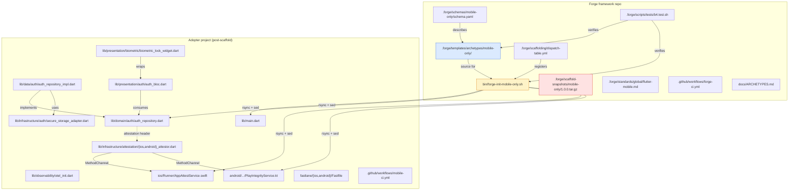
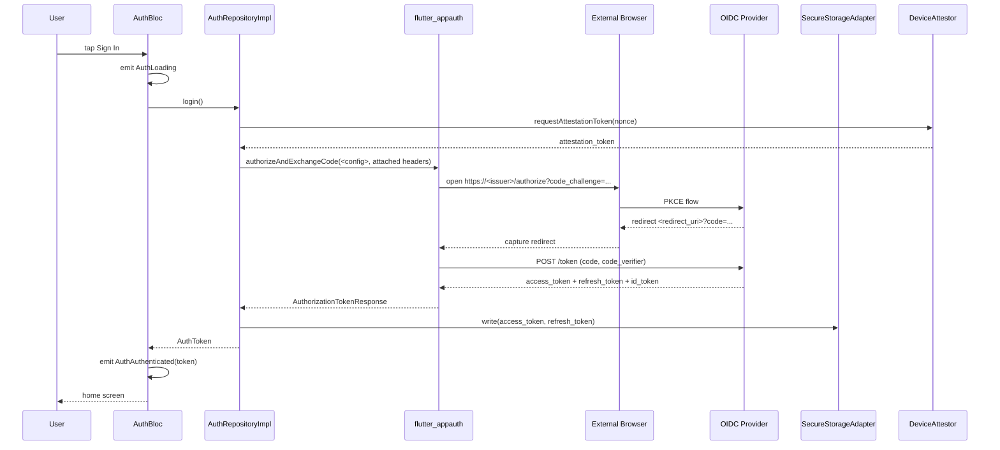
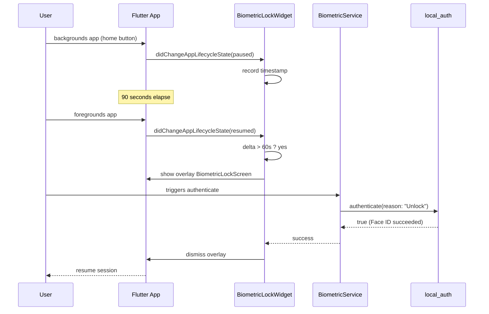
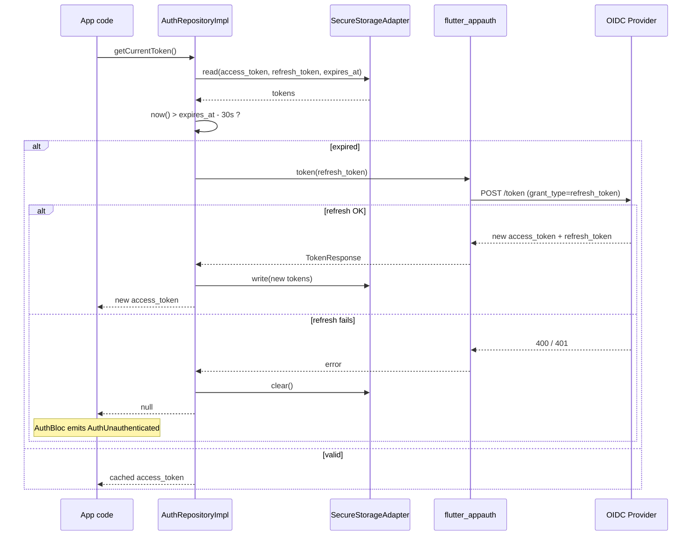

# Design: b4-mobile-only

**Agents pertinents** : Athena (Flutter architecture) + Eris (test strategy). Pas d'Atlas (no infra), pas de Ferris (no Rust), pas de Hermes-API (no API contract authored — l'archétype CONSOMME un OIDC externe, ne le définit pas).

**Périmètre** : nouvel archétype Flutter iOS+Android **single-layer** (`app`), templates + scaffolder bash + harness shell. Zéro édition TS (preuve par construction du contrat ABI B.5.1).

**Effort** : XL, prévu en 3 phases (A : structure, B : runtime + standards, C : Fastlane/CI/archive).

---

## Architecture Decisions

### ADR-001 : Single-layer schema (`app` uniquement)

**Context** : `full-stack-monorepo` déclare 3 layers (`backend`, `frontend`, `infra`). Le b1-workflow change rend le multi-layer activable seulement quand `layers:` du change ≥ 2 entrées. Mobile-only n'a pas cette contrainte — c'est UN projet Flutter monolithique.

**Decision** :
- `.forge/schemas/mobile-only/schema.yaml` déclare `layers: [{id: app, path: .}]` (single-layer, racine du projet).
- Les changes dans un projet `mobile-only` ne déclareront jamais `layers:` (ou alors 1 seule entrée), donc `/forge:design` reste en mode single-file `design.md` / `tasks.md` (pas d'orchestration Janus).
- Les CLAUDE.md imbriqués (FSM en a 3 — backend, frontend, infra) sont remplacés par **un seul** `CLAUDE.md` à la racine post-scaffold, scopé Flutter mobile.

**Consequences** :
- (+) Conceptuellement simple, conforme à la réalité projet mobile.
- (+) Aucun branchement Janus à tester pour B.4 — on réutilise la trajectoire single-file 100 % éprouvée.
- (-) Si dans le futur un adopter veut faire cohabiter `mobile-only` + un dossier `tests/` cross-layer, il devrait passer à un autre archétype (probablement custom).

**Constitution Compliance** : ✅ Article VI.6 (clean arch) — la séparation interne (`lib/domain/`, `lib/data/`, `lib/presentation/`, `lib/infrastructure/`) reste intacte ; c'est l'organisation **dans** le layer `app`, pas une multi-layer Forge.

---

### ADR-002 : Mécanisme de substitution — rsync + sed, pas de moteur de templates

**Context** : il faut substituer `{{project_name}}` et `{{reverse_domain}}` dans ~80 fichiers `.tmpl`. Mason (Flutter ecosystem) et Yeoman (Node) sont des choix possibles mais introduiraient une dépendance lourde et un nouveau langage de templating.

**Decision** :
- `bin/forge-init-mobile-only.sh` est un script bash pur :
  1. `rsync -a` de l'arborescence `.forge/templates/archetypes/mobile-only/` vers `$target`.
  2. Pour chaque fichier `*.tmpl`, lecture, substitution `sed s/\{\{project_name\}\}/<value>/g`, écriture sans le suffixe `.tmpl`.
  3. Retrait du fichier source `.tmpl` (rsync a déjà copié le `.tmpl` ; après substitution + rename, supprimer l'original).
  4. Ajustement spécifique : reverse_domain → path slash-separated pour le code Kotlin sous `android/app/src/main/kotlin/<reverse_domain_path>/`.
- Aucune dépendance npm, aucune dépendance externe. Cohérent avec NFR-MO-006 (zéro édition `cli/`).

**Consequences** :
- (+) Reproductible cross-machine (bash + sed disponibles partout, BSD-compatible avec syntaxe `-i ''`).
- (+) Auditable visuellement (un humain lit le `forge-init-mobile-only.sh` et comprend tout).
- (-) Pas de support de templating riche (conditions, boucles). Acceptable car le scaffold est statique.

**Constitution Compliance** : ✅. Cohérent avec ADR équivalent dans `b1-scaffolder` et `b5-1-init-wizard`.

---

### ADR-003 : OIDC neutralité — pas de provider câblé

**Context** : décision utilisateur (proposal Q2). Câbler un provider spécifique (Auth0, Keycloak, Okta, Cognito) ferait de Forge un endorseur, et orienterait les adopters vers une stack qu'ils n'ont pas choisie.

**Decision** :
- `lib/infrastructure/auth/oidc_config.dart.tmpl` livre :
  ```dart
  class OidcConfig {
    final String issuer;
    final String clientId;
    final String redirectUri;
    final List<String> scopes;
    const OidcConfig({...});
  }
  const defaultConfig = OidcConfig(
    issuer: 'TODO_REPLACE_ISSUER_URL',  // e.g. https://your-tenant.auth0.com/
    clientId: 'TODO_REPLACE_CLIENT_ID',
    redirectUri: 'TODO_REPLACE_REDIRECT_URI',
    scopes: ['openid', 'profile', 'email', 'offline_access'],
  );
  ```
- En tête du fichier, un commentaire pointe vers les 4 providers principaux (avec liens documentation).
- Le scaffold post-init **ne compile pas** tant que l'adopter n'a pas remplacé les `TODO_REPLACE_*` (volontaire — `flutter analyze` détectera les valeurs invalides au runtime, pas au build, mais le commentaire en tête est explicite).

**Consequences** :
- (+) Zéro endorsement.
- (+) L'adopter prend conscience qu'il doit configurer son provider.
- (-) Le scaffold ne fonctionne pas "out of the box" sans config — friction perçue comme positive (sécurité).

**Constitution Compliance** : ✅ — neutralité technologique, pas de package-lock-in.

---

### ADR-004 : AppAuth + secure_storage = canonical auth stack

**Context** : alternatives possibles (`oauth2_client`, `openid_client` Dart pur). `flutter_appauth` est porté de l'AppAuth officiel iOS+Android, gère PKCE nativement, support refresh, et est largement adopté.

**Decision** :
- `flutter_appauth` (`^7.x` au moment de l'archive) pour le flow PKCE.
- `flutter_secure_storage` (`^9.x`) pour persistance Keychain (iOS) / EncryptedSharedPreferences + StrongBox (Android).
- Repository pattern : `AuthRepository` (interface domain) → `AuthRepositoryImpl` (data, dépend de FlutterAppAuth + SecureStorageAdapter).

**Consequences** :
- (+) Standard de l'industrie, audit-friendly.
- (+) PKCE forcé (pas de client_secret en mobile).
- (-) Dépendance native iOS/Android (Podfile + Gradle), donc nécessite un build natif — pas un projet Flutter web-only.

**Constitution Compliance** : ✅ Article VI.6 (clean arch, repo interface en domain).

---

### ADR-005 : Biometric lock = WidgetsBindingObserver + timeout

**Context** : pattern UX standard mais pas de directive Flutter officielle. Plusieurs approches possibles (overlay full-screen, route guard, observer global).

**Decision** :
- `lib/presentation/biometric/biometric_lock_widget.dart.tmpl` est un widget root qui :
  - Implémente `WidgetsBindingObserver`
  - Sur `didChangeAppLifecycleState`, détecte `paused` → timestamp ; sur `resumed` → si delta > timeout (60s défaut, configurable), affiche un overlay `BiometricLockScreen` qui invoque `BiometricService.authenticate()`.
  - Sur succès, retire l'overlay ; sur échec, propose fallback PIN (UI placeholder pour l'adopter).
- Le widget enveloppe `MaterialApp` dans `lib/app.dart.tmpl`.

**Consequences** :
- (+) Pattern auto-applicable à toute l'app sans toucher chaque route.
- (+) Configurable (timeout) sans toucher le code.
- (-) Si l'app a des routes "publiques" (login screen lui-même), il faut un mécanisme d'opt-out — documenté dans `flutter-mobile.md`.

**Constitution Compliance** : ✅ Article VI.6 (clean arch — biometric_service en infrastructure, widget en presentation).

---

### ADR-006 : Attestation = cross-cutting concern via DeviceAttestor abstraction

**Context** : App Attest (iOS) et Play Integrity (Android) ont des APIs différentes, des cycles de vie différents, et un seul des deux tourne sur un device donné. Mais le code Dart appelant doit être uniforme.

**Decision** :
- Interface `DeviceAttestor` en `lib/domain/attestation/`.
- 2 impls en `lib/infrastructure/attestation/` (iOS + Android), sélectionnées au runtime via `Platform.isIOS` / `Platform.isAndroid`.
- Une fake impl `lib/infrastructure/attestation/fake_attestor.dart.tmpl` retourne un token déterministe pour les tests unitaires + e2e (DI : injecter FakeAttestor au test, vraie impl au runtime).
- MethodChannels nommés sous le namespace `forge.attestation/<plateforme>`.

**Consequences** :
- (+) Code applicatif test-friendly (DI).
- (+) Adopter peut désactiver attestation simplement en injectant FakeAttestor en prod (warn explicite).
- (-) Surface 3 fichiers Dart + 1 Swift + 1 Kotlin pour ce qui pourrait être un seul plugin tiers. Acceptable car App Attest et Play Integrity sont relativement rares dans les plugins Flutter et qu'il est sain de garder le contrôle.

**Constitution Compliance** : ✅ Article VI.6 + Article X (testabilité).

---

### ADR-007 : iOS bridge — Swift MethodChannel sous `ios/Runner/`

**Context** : il faut connecter Dart à `DCAppAttestService` (iOS DeviceCheck framework). Pattern Flutter standard = MethodChannel.

**Decision** :
- `ios/Runner/AppAttestService.swift.tmpl` :
  - Une classe `AppAttestService` qui s'enregistre comme MethodChannel `forge.attestation/app_attest` dans `AppDelegate.application(_:didFinishLaunchingWithOptions:)`.
  - Méthodes exposées : `generateKey`, `attestKey`, `assert`.
- `ios/Runner/AppDelegate.swift.tmpl` est étendu pour appeler `AppAttestService.register(controller: flutterViewController)`.

**Consequences** :
- (+) Pattern Flutter idiomatique, transparent pour le dev Flutter.
- (-) iOS-only, pas testable hors device/simulator iOS — d'où la fake impl Dart pour les tests.

**Constitution Compliance** : ✅.

---

### ADR-008 : Android bridge — Kotlin MethodChannel + FlutterFragmentActivity

**Context** : Play Integrity API requires Google Play Services + IntegrityManager. Local_auth requires `FlutterFragmentActivity` (pas `FlutterActivity`) pour l'hébergement de fragment biometric.

**Decision** :
- `MainActivity.kt.tmpl` étend `FlutterFragmentActivity` (REQUIS par local_auth).
- `PlayIntegrityService.kt.tmpl` enregistre MethodChannel `forge.attestation/play_integrity`.
- `AndroidManifest.xml.tmpl` pointe l'activity correctement.
- `app/build.gradle.kts.tmpl` ajoute la dépendance Play Integrity (`com.google.android.play:integrity:1.x`).

**Consequences** :
- (+) Conformité local_auth + Play Integrity.
- (-) Augmente la taille AAB (~3-5 MB pour Play Services + Integrity). Acceptable, ce sont des SDKs OS standard.

**Constitution Compliance** : ✅.

---

### ADR-009 : Fastlane — per-platform Fastfile, secrets via ENV exclusivement

**Context** : Fastlane peut tourner depuis la racine projet OU depuis `ios/` et `android/`. La convention recommandée par Fastlane elle-même est par-plateforme (`ios/fastlane/Fastfile`, `android/fastlane/Fastfile`).

**Decision** :
- `ios/fastlane/Fastfile.tmpl`, `android/fastlane/Fastfile.tmpl`.
- Chaque Fastfile définit ses lanes localement.
- Tous les secrets (`APP_STORE_CONNECT_API_KEY_PATH`, `MATCH_PASSWORD`, `PLAY_STORE_JSON_KEY`, `KEYSTORE_PASSWORD`, `KEY_ALIAS`, `KEY_PASSWORD`) référencent `ENV[...]`.
- Un fichier `.envrc.example` à la racine documente les variables requises.

**Consequences** :
- (+) Exécution locale et CI symétrique.
- (+) Zéro secret committable.
- (-) Onboarding adopter implique configurer ~10 ENV vars — documenté dans `flutter-mobile.md`.

**Constitution Compliance** : ✅ Article X (no secrets in code).

---

### ADR-010 : CI workflow — jobs parallèles iOS + Android, e2e opt-in

**Context** : iOS build = `macos-latest` (cher en minutes). Android build = `ubuntu-latest` (cheap). E2e émulateur = lent (~5 min) et flaky.

**Decision** :
- `mobile-ci.yml.tmpl` :
  - `ios` : macos-latest, no codesign, ne tourne **que** quand fichiers `ios/` ou `lib/` ou `pubspec.yaml` changent (paths-filter).
  - `android` : ubuntu-latest, debug APK + coverage, mêmes paths-filter.
  - `summary` : required status, dépend de ios + android.
  - `e2e-android` (optionnel) : opt-in via `workflow_dispatch` ou label PR `[ci-e2e]`. Jamais sur PR de routine.
- Cache `~/.pub-cache` clé `pubspec.lock` hash.

**Consequences** :
- (+) Parallélisation maximale (iOS et Android indépendants).
- (+) Coût mac runners contrôlé (pas de tour à chaque commit doc).
- (-) Adopter doit savoir activer `[ci-e2e]` quand il touche aux flows critiques. Documenté.

**Constitution Compliance** : ✅ Article V (gates sur CI).

---

### ADR-011 : Snapshot tarball — gzip seulement, pas de --mtime

**Context** : leçon du change `a7-forge-upgrade` — BSD tar (macOS) ne supporte pas `--mtime` ; viser la reproductibilité bit-à-bit du tarball est inutile car la sameness est mesurée par-fichier (SHA-256), pas par-tarball.

**Decision** :
- `.forge/scaffold-snapshots/mobile-only/1.0.0.tar.gz` est créé via `tar -czf` standard (sans --mtime).
- Le mainteneur lance `bin/forge-snapshot.sh build mobile-only 1.0.0` à l'archive.
- Le tarball est committé dans Git (binary, ~1-2 MB gzipped attendu).

**Consequences** : cohérent avec FSM snapshot. Pas de surprise.

**Constitution Compliance** : ✅.

---

### ADR-012 : Test harness — L1 hermétique + L2 fixture-based

**Context** : tester un archétype = tester (a) la **structure** des templates statiques (L1 grep/présence) ET (b) le **comportement** du scaffolder (L2 : appeler le wrapper sur un tmpdir, vérifier la sortie).

**Decision** :
- `b4.test.sh` accepte un flag `--level 1,2` (cohérent avec scaffolder.test.sh, workflow.test.sh).
- **L1** (par défaut, hermétique) : ≥ 35 tests grep/présence sur les templates.
- **L2** (fixture-based, ~5 tests) : pour chaque test, créer un tmpdir, exécuter `bin/forge-init-mobile-only.sh --target $TMPDIR --project-name myapp --reverse-domain com.example.myapp`, vérifier la structure produite.
- **L3 opt-in** (`--require-flutter`) : si Flutter SDK détecté, lancer `flutter pub get && flutter analyze && flutter test` dans le projet scaffoldé. Skipped en CI runner par défaut (Flutter pas toujours installé).

**Consequences** :
- (+) L1 tourne partout, rapide.
- (+) L2 vérifie le scaffolder réellement.
- (+) L3 valide la qualité du scaffold mais ne bloque pas la CI Forge core.

**Constitution Compliance** : ✅ Article I.

---

### ADR-013 : Découpage en 3 phases d'implémentation

**Context** : XL effort, single-session pas réaliste ; risque de commit géant illisible.

**Decision** :
- **Phase A** (core scaffold structure) — schéma + templates Flutter + iOS + Android + dispatch entry + wrapper bash + snapshot tarball. Tests L1 + L2 PASS sur la structure pure (sans logique runtime).
- **Phase B** (runtime + standards) — modules OIDC + secure storage + biometric + attestation + observability + standard `flutter-mobile.md` + ARCHETYPES.md row + harness L1 étendu.
- **Phase C** (Fastlane + CI + archive) — Fastfile templates + mobile-ci.yml.tmpl + harness L1 final + spec consolidée + roadmap + CHANGELOG + flip status à `archived`.

**Commits** : 1 par phase (3 commits sur `optim`). Push après chaque phase pour CI.

**Consequences** :
- (+) Revue par étapes, chaque commit < 3000 LOC.
- (+) Si la session est interrompue, un état stable est commit à chaque phase.
- (-) 3 commits au lieu de 1 — acceptable, c'est cohérent avec le pattern b1.* (4 commits).

**Constitution Compliance** : ✅ Article V (gates franchies à chaque phase).

---

### ADR-014 : `framework-owned-paths` — template archétype, pas modif framework-side

**Context** : A.7 a livré `.forge/framework-owned-paths.yml` côté framework. Faut-il ajouter les paths mobile-only à ce fichier global, ou les livrer via un template archétype ?

**Decision** :
- Le fichier framework-side reste **agnostique** (paths Forge généraux : `.forge/`, `.claude/`, etc.).
- L'archétype mobile-only livre `.forge/templates/archetypes/mobile-only/.forge/framework-owned-paths.yml.tmpl` qui sera copié à la racine du projet adopter au scaffold.
- Au moment du `forge upgrade`, le script `bin/forge-upgrade.sh` lit le fichier **côté projet adopter**, qui contient désormais à la fois les paths généraux (hérités du copy initial) et les paths mobile-only (ajoutés au scaffold via le template).

**Consequences** :
- (+) Pas de divergence framework-side selon archétype.
- (+) Auto-suffisant côté adopter.
- (-) Si l'archétype mobile-only évolue (nouveaux paths owned), un upgrade A.7 doit fusionner correctement le `framework-owned-paths.yml` adopter — déjà couvert par le 3-way merge A.7.

**Constitution Compliance** : ✅.

---

## Component Design



---

## Data Flow

### Flow 1 — OIDC login (PKCE)



### Flow 2 — Biometric unlock après backgrounding



### Flow 3 — Token refresh transparent



---

## Testing Strategy

### Niveau L1 — tests structurels hermétiques

**Harnais** : `.forge/scripts/tests/b4.test.sh --level 1` (par défaut)
**Volume** : ≥ 35 tests
**Pattern** : manifest (cf. ADR-012)
**Couverture FR** : 1+ test par FR-MO-NNN.

### Niveau L2 — fixture-based scaffolder

**Harnais** : `b4.test.sh --level 1,2`
**Volume** : ≥ 5 tests
**Approche** : pour chaque test, scaffolder un projet dans un tmpdir et vérifier la sortie.
- L2-001 : structure produite contient pubspec.yaml + lib/ + ios/ + android/
- L2-002 : substitutions effectuées (`{{project_name}}` absent post-scaffold, valeur substituée présente)
- L2-003 : reverse_domain propagé dans Info.plist + build.gradle.kts + AndroidManifest
- L2-004 : idempotence — deux runs avec `--force` produisent une arborescence identique (diff vide)
- L2-005 : conflit — un run sans `--force` sur un dir non-vide exit code ≠ 0

### Niveau L3 — opt-in Flutter SDK

**Harnais** : `b4.test.sh --level 1,2 --require-flutter`
**Skipped** sauf flag explicite + Flutter détecté.
- L3-001 : `flutter pub get` exit 0
- L3-002 : `flutter analyze` exit 0 (zéro erreur sur le scaffold)
- L3-003 : `flutter test` exit 0 (les tests scaffoldés passent)

### BDD scenarios

7 scénarios documentés dans `specs.md`. Implémentés en Gherkin sous `integration_test/features/` du scaffold (au moins 1 — `login.feature`). Les autres scénarios sont **documentaires** côté Forge, **implémentables** par l'adopter quand il câble son provider.

### CI integration

`.github/workflows/forge-ci.yml` job `harness` ajoute :
```yaml
- name: b4.test.sh
  run: bash .forge/scripts/tests/b4.test.sh --level 1,2
```

L3 NON ajouté en CI (Flutter SDK pas dispo sur runner par défaut).

---

## Standards Applied

- **Article I (TDD)** : harness `b4.test.sh` RED→GREEN par phase. Templates Flutter livrent un état GREEN initial (les tests scaffoldés tournent vert post-scaffold).
- **Article II (BDD)** : 7 scénarios Gherkin documentés ; ≥ 1 `.feature` cucumber-flutter scaffoldé sous `integration_test/features/`.
- **Article III (Specs Before Code)** : ce design suit les specs.
- **Article III.4 (Anti-hallucination)** : 3 décisions tranchées, zéro deviné.
- **Article IV (Delta-based)** : ADDED-only namespace.
- **Article V (Process Gates)** : pipeline complet + 3 commits par phase (gates franchies à chaque commit).
- **Article VI (Flutter)** : flutter_bloc obligatoire, clean arch 4 couches, cucumber-flutter pour BDD intégration. ✅
- **Article IX (Observability)** : OTel SDK Flutter (`opentelemetry_api` + `opentelemetry_sdk`), span sur auth flows.
- **Article X (Quality)** : analysis_options strict, coverage 70 %, secrets via ENV exclusivement, no token logging.
- **Article XII (Governance)** : `constitution_version: "1.1.0"` dans le `.forge.yaml` du change.

---

## Risks & Mitigations

| Risque | Probabilité | Impact | Mitigation |
|---|---|---|---|
| Versions des packages Flutter (flutter_appauth, etc.) drift entre design et implémentation | Moyenne | Faible | Pinning au moment de la Phase B + Context7 query lors de l'implémentation |
| Substitution sed casse un fichier binaire (ex. asset PNG) | Faible | Moyen | sed appliqué **uniquement** sur les fichiers `*.tmpl` ; les assets binaires ne sont pas suffixés `.tmpl` donc rsync seul |
| Conflits entre App Attest & Play Integrity sur device dual-boot ou émulateur sans Play Services | Faible | Faible | FakeAttestor injectable + warn log si plateforme non supportée |
| Snapshot tarball > budget 2 MB | Moyenne | Faible | Mesure à la Phase A ; si dépassement, retirer assets binaires non-essentiels |
| Adopter copie-colle un secret en dur dans un Fastfile | Moyenne | Critique | Test L1 grep secrets ; documentation explicite ; lint pre-commit possible en T3 |
| `flutter analyze` en post-scaffold échoue à cause des `TODO_REPLACE_*` dans oidc_config | Faible | Faible | Marquer le fichier en commentaire `// ignore_for_file: prefer_const_constructors` ou utiliser des chaînes vides traitables ; documenté |
| Régression sur a7.test.sh à cause de framework-owned-paths.yml manquant côté archétype | Moyenne | Moyen | NFR-MO-007 : a7.test.sh doit rester vert ; vérification CI obligatoire |
| Test L2 flaky en CI (rsync ou tar diff inter-run) | Faible | Moyen | Utiliser `find ... -print0 | sort -z` pour normaliser ; assertion sur fichiers présents, pas hash global |

---

## Implementation Order (preview pour `/forge:plan`)

### Phase A — Core scaffold structure (~6-9 fichiers Forge + ~50-80 templates)

1. Créer `.forge/schemas/mobile-only/schema.yaml`.
2. Créer `bin/forge-init-mobile-only.sh` (wrapper bash, ABI B.5.1 stable).
3. Créer la structure `.forge/templates/archetypes/mobile-only/` :
   - Flutter project skeleton (`pubspec.yaml.tmpl`, `analysis_options.yaml`, `lib/`, `test/`, `integration_test/`, `.gitignore`, `README.md.tmpl`, `CLAUDE.md.tmpl`, `.forge.yaml.tmpl`)
   - iOS native (`ios/Runner/Info.plist.tmpl`, `Podfile.tmpl`, `AppDelegate.swift.tmpl`)
   - Android native (`android/app/build.gradle.kts.tmpl`, `AndroidManifest.xml.tmpl`, `MainActivity.kt.tmpl`, root `build.gradle.kts.tmpl` + `settings.gradle.kts.tmpl`)
4. Ajouter l'entrée `mobile-only` dans `.forge/scaffolding/dispatch-table.yml`.
5. Créer `b4.test.sh` Phase A (RED) avec ~20 tests structurels.
6. Construire le snapshot tarball : `bin/forge-snapshot.sh build mobile-only 1.0.0`.
7. Vérifier RED → GREEN (Phase A passe localement).
8. **Commit Phase A** + push.

### Phase B — Runtime + standards (~30-50 fichiers Dart + Swift + Kotlin + 1 standard)

1. Module OIDC (`lib/domain/auth/`, `lib/data/auth/`, `lib/infrastructure/auth/`, `lib/presentation/auth/`).
2. Secure storage adapter (`lib/infrastructure/storage/secure_storage_adapter.dart.tmpl`).
3. Biometric (`lib/infrastructure/biometric/biometric_service.dart.tmpl` + `lib/presentation/biometric/biometric_lock_widget.dart.tmpl`).
4. Attestation (`lib/domain/attestation/`, `lib/infrastructure/attestation/` x3 — iOS, Android, fake).
5. Observability (`lib/observability/otel_init.dart.tmpl`).
6. Bridges natifs (`AppAttestService.swift.tmpl`, `PlayIntegrityService.kt.tmpl`).
7. `lib/main.dart.tmpl` + `lib/app.dart.tmpl` cohérents.
8. Tests Dart scaffoldés (≥ 3 fichiers `test/`).
9. `integration_test/features/login.feature` Gherkin.
10. Standard `.forge/standards/global/flutter-mobile.md` (7 H2 + 3 Interdictions).
11. Update `.forge/standards/index.yml` (trigger flutter-mobile.md).
12. Étendre `b4.test.sh` Phase B (~15 tests supplémentaires, total ~35).
13. Mettre à jour le snapshot tarball : rebuild via `bin/forge-snapshot.sh build mobile-only 1.0.0`.
14. **Commit Phase B** + push.

### Phase C — Fastlane + CI + archive

1. Fastlane templates (`ios/fastlane/{Fastfile,Appfile,Matchfile}.tmpl`, `android/fastlane/{Fastfile,Appfile}.tmpl`, `.envrc.example`).
2. CI workflow `.github/workflows/mobile-ci.yml.tmpl` (jobs ios + android + summary + e2e-android opt-in).
3. Update `.github/workflows/forge-ci.yml` (job `harness` enregistre `b4.test.sh --level 1,2`).
4. Update `docs/ARCHETYPES.md` (matrice de décision +1 ligne mobile-only).
5. `framework-owned-paths.yml.tmpl` côté archétype.
6. Étendre `b4.test.sh` Phase C (~5 tests supplémentaires Fastlane + CI).
7. Rebuild snapshot tarball final.
8. Lancement final `verify.sh` + 10 harnais (foundations à b4) — cible ≥ 220 tests.
9. Consolidation spec : `.forge/specs/mobile-only.md` (FR-MO-001..040 + NFR + BDD).
10. Update `.forge/product/roadmap.md` (B.4 ✅ Done, T2 P2 closed).
11. Update `il-s-agit-l-d-un-noble-gem.md` (B.4 livré, bascule).
12. Update `CHANGELOG.md` `[Unreleased]` (b4-mobile-only entry).
13. Flip `.forge.yaml` status: `archived`, timeline complete.
14. **Commit Phase C** (release) + push.

---

**Status** : `designed`. Next : `/forge:plan b4-mobile-only`.
