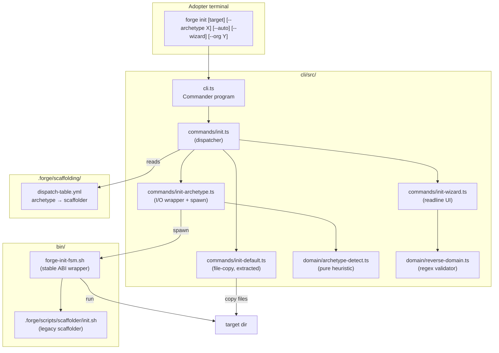
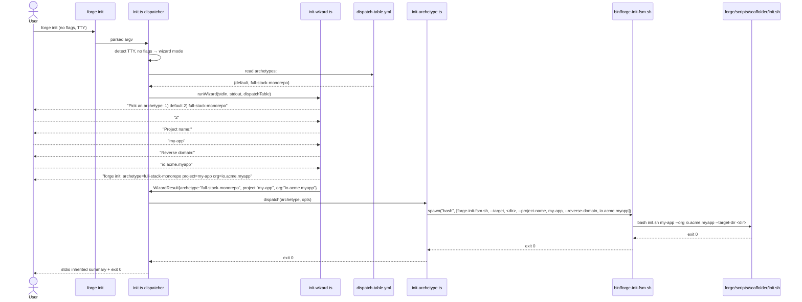

# Design: b5-1-init-wizard

<!-- Audit: Module B.5.1 — `/forge:init` wizard with archetype auto-detection. -->
<!-- Depends on: b1-scaffolder + b1-delivery + c1-reference-project           -->
<!--             + a7-forge-upgrade (all archived).                           -->

This design transforms the `FR-IW-*` namespace from `specs.md`
into concrete technical decisions. The change ships :

1. A refactored `cli/src/commands/init.ts` (thin dispatcher).
2. Two new TS modules : `init-default.ts` (extracted current
   file-copy) and `init-archetype.ts` (per-archetype delegation).
3. A new `init-wizard.ts` using Node's `readline` (zero deps).
4. Two new pure domain functions :
   `archetype-detect.ts` (heuristic) and `reverse-domain.ts`
   (regex validator).
5. The dispatch-table at `.forge/scaffolding/dispatch-table.yml`.
6. A new shell wrapper `bin/forge-init-fsm.sh` (stable ABI for
   the `full-stack-monorepo` archetype).
7. The new standard `global/scaffolding.md` and the public
   `docs/ARCHETYPES.md` decision matrix.
8. Test harness `b5.test.sh` (L1 hermetic + L2 fixture + L3
   opt-in).

The 12 ADRs below cover the strategic decisions.

---

## Architecture Decisions

### ADR-001: Dispatcher topology — thin TS dispatcher + thick per-archetype scripts

**Context.** The CLI must support multiple archetypes today
(only `default` and `full-stack-monorepo`) plus future
archetypes (B.2 / B.3 / B.4). Two extreme designs :
1. **Monolithic** : one TS file handling every archetype's
   scaffold logic inline. Rejected — TS becomes a scaffolder
   for each new stack, ballooning the CLI.
2. **Per-archetype shell scripts via dispatch table**. Picked.

**Decision.**

- `cli/src/commands/init.ts` becomes a **dispatcher** : parses
  argv, resolves the archetype (via `--archetype` flag, `--auto`
  detection, or `--wizard` prompts), then delegates :
  - `default` → `init-default.ts` (the existing file-copy logic
    extracted as a pure module).
  - `full-stack-monorepo` (and future archetypes) → shell-out
    to `bin/forge-init-<archetype>.sh` via `node:child_process.spawn`.
- Each per-archetype shell script is a **thin wrapper** around
  the actual scaffolder (`init.sh` for `full-stack-monorepo`).
  The wrapper translates the CLI's stable ABI to the
  scaffolder's legacy flag shape.
- The dispatch table (ADR-002) is the single source of truth
  mapping archetype → scaffolder script.

**Consequences.**

- ✅ Adding a new archetype = registering one row in the
  dispatch table + writing one wrapper. Zero TS edits.
- ✅ Each scaffolder remains in its native language (shell for
  `init.sh`, future ones could be Rust binaries, etc.).
- ⚠️ Two languages to maintain (TS + Bash). Acceptable —
  already the case post-`a7-forge-upgrade`.

**Constitution Compliance:** Articles V (gates), X (CLI
ergonomics).

---

### ADR-002: `dispatch-table.yml` is the canonical archetype registry

**Context.** Both the dispatcher AND the standalone CLI flag
validator (`--archetype <name>` accepts only registered names)
need to agree on the list of archetypes. Hard-coding the list
in TS would force a recompile + republish on every new
archetype.

**Decision.**

- File path : `.forge/scaffolding/dispatch-table.yml`. Lives
  inside `.forge/` so it is bundled into the CLI naturally
  (per the bundle-assets.mjs walk pattern proven by
  `a7-forge-upgrade` ADR-005).
- Schema (per FR-IW-002) : top-level `archetypes:` map. Each
  value : `{name, scaffolder, description, signals, since}`.
- The `scaffolder` value is either `"<built-in>"` (TS path —
  today only `default`) or a relative shell-script path (today
  only `bin/forge-init-fsm.sh`).
- An L1 audit test asserts every `scaffolder` resolves to an
  existing file (or equals `"<built-in>"`).
- The dispatch table is read at runtime by both the dispatcher
  and the wizard. No code-gen step.

**Consequences.**

- ✅ Adding an archetype = 1 YAML row + 1 wrapper script. CLI
  source unchanged.
- ✅ Tests catch typos at L1 (no missing scaffolder script).
- ⚠️ YAML at runtime adds a parse step. Trivial cost (single
  file, ~30 lines).

**Constitution Compliance:** Article V (deterministic gate).

---

### ADR-003: Auto-detection — pure function + I/O wrapper split

**Context.** The auto-detect heuristic (FR-IW-005) decides
based on signals (file presence). To unit-test it
exhaustively without tmpdir setup, the heuristic must be a
pure function over a `Record<string, boolean>` (signal → present).
The I/O — actually probing the file system — lives in a
separate wrapper.

**Decision.**

- `cli/src/domain/archetype-detect.ts` exposes the pure function
  `detectArchetype(signalsByPath: Record<string, boolean>):
  DetectionResult` where DetectionResult is a discriminated
  union (`match` / `ambiguous` / `none`).
- `cli/src/commands/init-archetype.ts` exposes the I/O wrapper
  `probeSignalsAndDispatch(targetDir: string, dispatchTable):
  Promise<...>` that reads the file system + the dispatch
  table's `signals` lists, builds the record, and calls
  `detectArchetype()`.
- This split mirrors the established `cli/src/domain/` vs
  `cli/src/commands/` separation (see `verify.ts` /
  `verify-domain.ts` pattern in prior changes).

**Consequences.**

- ✅ The heuristic is unit-testable with hardcoded signal
  records — no tmpdir per test, fast Vitest.
- ✅ Future heuristic extension (when B.2/B.3/B.4 land) edits
  the pure function only ; the I/O wrapper is unchanged.

**Constitution Compliance:** Article V.

---

### ADR-004: Wizard uses Node's `readline` exclusively (zero new deps)

**Context.** Q2 of the proposal asked between `readline` (zero
deps) and `prompts`/`inquirer`. Resolved at spec time per
NFR-IW-002 : Node's `readline`.

**Decision.**

- `cli/src/commands/init-wizard.ts` uses `node:readline`
  directly. No `inquirer`, `prompts`, `enquirer`, or similar.
- The wizard exposes `runWizard(deps): Promise<WizardResult>`
  where `deps` injects input/output streams + a runner. This
  enables Vitest to drive the wizard with a mock `Readable`
  stream that scripts the user's "typing".
- The numbered-menu prompt is rendered as a plain table :
  ```
  Pick an archetype :
    1) default              — minimal Forge install
    2) full-stack-monorepo  — Flutter + Rust + Infra
  > _
  ```
- Re-prompt × 3 on invalid input ; exit 2 after 3 failures.
- Empty input → exit 2 with message.
- Ctrl-D / EOF on stdin → exit 2 with `forge init: stdin
  closed before wizard completed`.
- TTY check uses `process.stdin.isTTY` ; non-TTY routes to
  the silent-default path (FR-IW-003 / NFR-IW-003).

**Consequences.**

- ✅ Zero new third-party deps. Aligns with the framework's
  minimal-dependency stance.
- ✅ Vitest tests inject scripted stdin via Node's
  `Readable.from()` helper.
- ⚠️ Less rich UX than `inquirer` (no colours, no autocomplete).
  Adopters wanting that polish wait for a follow-up that adds
  it as opt-in.

**Constitution Compliance:** Articles V, X. **NFR-IW-002**
explicitly enforced.

---

### ADR-005: Per-archetype scaffolder ABI

**Context.** Each archetype's scaffolder script (today only
`init.sh` for `full-stack-monorepo`) was written before the
dispatcher existed and uses ad-hoc flags. To insulate the CLI
from these legacy flag shapes, every scaffolder is invoked
through a thin wrapper at `bin/forge-init-<archetype>.sh` that
exposes a **stable ABI**.

**Decision.**

- ABI :
  `bin/forge-init-<archetype>.sh \
       --target <dir> \
       --project-name <slug> \
       --reverse-domain <fqdn> \
       [--force]`.
- The wrapper translates the ABI to the scaffolder's native
  flags. For `full-stack-monorepo` :
  - `--target <dir>` → `--target-dir <dir>` (init.sh's flag).
  - `--project-name <slug>` → positional first arg.
  - `--reverse-domain <fqdn>` → `--org <fqdn>`.
  - `--force` → `--force`.
- The wrapper propagates the scaffolder's exit code unchanged.
- The wrapper is itself in `owned:` of `framework-owned-paths.yml`
  (so `forge upgrade` keeps adopters' wrapper in sync).

**Consequences.**

- ✅ The CLI's argv shape is decoupled from each scaffolder's
  legacy flags. Future archetypes register a new wrapper but
  keep the same ABI.
- ✅ A wrapper is at most ~40 lines of bash — minimal cost
  per archetype.
- ⚠️ Adds one indirection layer. Acceptable trade-off for
  decoupling.

**Constitution Compliance:** Articles V, X.

---

### ADR-006: `default` archetype path is the legacy file-copy, extracted

**Context.** The current `cli/src/commands/init.ts` does the
file-copy for `default` schema projects. The dispatcher
preserves this behavior byte-equivalently (NFR-IW-004) but
moves the implementation to a dedicated module.

**Decision.**

- Extract the existing `initCommand` body into
  `cli/src/commands/init-default.ts` exposing
  `runDefaultInit(opts): Promise<InitResult>`. The function
  signature matches the existing `InitOptions` /
  `InitResult` interfaces declared in the same file.
- The new `init.ts` (the dispatcher) imports `runDefaultInit`
  and calls it when the resolved archetype is `default`.
- The existing `cli/test/commands/init.test.ts` is updated to
  test the dispatcher's path selection ; the file-copy behavior
  is now tested in a new `init-default.test.ts` (split for
  clarity).
- Existing e2e tests (`cli/test/e2e/cli.test.ts`) are NOT
  modified — they test the user-facing `forge init` invocation,
  which behaves identically post-refactor (no flags + non-TTY
  → file-copy via dispatcher's silent-default path).

**Consequences.**

- ✅ Strict NFR-IW-004 compliance — the e2e tests pin the
  legacy behavior and they must keep passing.
- ✅ Cleaner separation : `init.ts` is purely dispatch logic ;
  archetype-specific code lives in dedicated modules.

**Constitution Compliance:** Article V (no breaking change),
Article X.

---

### ADR-007: Mutually-exclusive selection flags + clear precedence

**Context.** The CLI has three selection mechanisms :
`--archetype <name>`, `--auto`, `--wizard`. Combinations like
`--archetype foo --auto` are nonsensical and must be rejected.

**Decision.**

- Selection flags are **mutually exclusive**. Any combination
  of two or more → exit 2 with a clear message listing the
  conflicting flags.
- When **none** of the three is set, precedence follows :
  1. If `process.stdin.isTTY` is `true` → wizard mode
     (FR-IW-006).
  2. Otherwise → silent `default` archetype (FR-IW-003 /
     NFR-IW-003).
- This precedence preserves NFR-IW-004 backwards compat for
  CI scripts (no TTY → silent default → byte-equivalent legacy
  behavior).

**Consequences.**

- ✅ Adopters always know which mode is active : the explicit
  flag wins ; absence of any flag is disambiguated by TTY
  detection.
- ✅ Existing CI scripts keep working without changes.
- ⚠️ One subtle case : a developer running the CLI in a
  non-TTY shell (e.g. piped output) gets the silent default
  path even when they meant to pick an archetype. Mitigated by
  always being able to pass `--archetype` explicitly.

**Constitution Compliance:** Articles V, X.

---

### ADR-008: Strict ambiguity abort with `[NEEDS DECISION:]`

**Context.** Q3 resolved at spec time : `--auto` MUST surface
ambiguity rather than guess. Today only `full-stack-monorepo`
is recognized ; `pubspec.yaml`-only or `Cargo.toml`-only is
ambiguous (no Flutter-only or Rust-only archetype shipped).

**Decision.**

- When `detectArchetype()` returns `ambiguous` (signal
  matches but not enough archetypes registered to disambiguate)
  OR `none` (no signals, but `--auto` was explicitly invoked
  meaning the adopter expected a match) → exit 2 with :

  ```
  forge init: cannot disambiguate archetype from signals.
    Detected signals: pubspec.yaml
    Candidate archetypes: <none registered yet>
  [NEEDS DECISION: pubspec.yaml present but no Flutter-only
   archetype registered (flutter-firebase / mobile-only TBD).
   Re-run with --archetype default for a minimal install,
   or wait for B.2 / B.4 to ship.]
  ```

- The message MUST cite the present signals + the candidate
  archetype names (or "<none registered yet>") + a concrete
  workaround.
- This is Article III.4 anti-hallucination compliance — abort
  rather than silent fallback.

**Consequences.**

- ✅ Adopters never end up with an unintended archetype.
- ✅ The message guides them to the correct workaround.
- ⚠️ For a Flutter-only project, the only path today is
  `--archetype default`. When B.2 / B.4 ship, the abort
  message updates automatically (the candidates come from the
  dispatch table).

**Constitution Compliance:** Article III.4 confirmed.

---

### ADR-009: Test harness `b5.test.sh` follows the manifest pattern

**Context.** Eight harnesses already exist (foundations,
scaffolder, workflow, delivery, g1, c1, a7, plus the one we
add here). All share the manifest pattern.

**Decision.**

- Manifest comment block declares each `test_*` with its
  `FR-IW-NNN` mapping.
- Meta self-check `test_b5_manifest_self_consistency` enforces
  parity.
- L1 (hermetic) — yml shape, dispatch-table scaffolder paths
  resolve, standard sections, index entry, decision matrix,
  feature file shape, CLI source code grep.
- L2 (fixture-based) — auto-detection on synthetic project
  trees (3 fixtures), wizard with scripted stdin (3 happy +
  2 re-prompt), wrapper ABI translation, reverse-domain regex.
- L3 (opt-in via `--require-external-tools`) — full e2e :
  `forge init --archetype full-stack-monorepo` against a
  tmpdir, asserts the scaffolded tree matches the
  `b1-scaffolder` L3 expectations.
- Wired into `forge-ci.yml` `harness` job at L1 alongside the
  existing 7 harnesses (foundations + scaffolder L1+L2 +
  workflow L1+L2 + delivery + g1 + c1 + a7).

**Consequences.**

- ✅ Same test discipline as prior harnesses.
- ✅ Vitest + b5.test.sh together cover both TS unit and
  shell-level behavior.

**Constitution Compliance:** Article I.

---

### ADR-010: CLI subcommand wiring in `cli.ts`

**Context.** The dispatcher needs the new flags plumbed through
the Commander program in `cli/src/cli.ts`. The existing `init`
subcommand options `--target / --source / --force` are
preserved ; the new flags `--archetype / --auto / --wizard /
--org` are added.

**Decision.**

- `cli/src/cli.ts`'s `program.command("init")` block grows :
  `.option("--archetype <name>", "...")` (no default — empty
  is meaningful for "use auto / wizard / silent"),
  `.option("--auto", "...", false)`,
  `.option("--wizard", "...", false)`,
  `.option("--org <reverse-domain>", "...")` (no default).
- The action callback constructs an `InitOptions` shape and
  calls the dispatcher (the new `init.ts`'s entry point).
- The Commander program already has `showHelpAfterError()`
  (see `cli.ts` line 47) — usage on error is automatic.

**Consequences.**

- ✅ The CLI surface is consistent with `forge init`'s existing
  options.
- ✅ Help output documents every flag with one-liner descriptions.

**Constitution Compliance:** Article X.

---

### ADR-011: `reverse-domain.ts` is a pure validator with explicit regex

**Context.** Reverse-domain validation (FR-IW-007) is shared
between the wizard prompt and the `--org` flag. It needs to be
unit-testable in isolation and the regex must be documented.

**Decision.**

- `cli/src/domain/reverse-domain.ts` exports a function
  `validateReverseDomain(value: string): { valid: boolean,
  reason?: string }`.
- The regex is the documented `^[a-z][a-z0-9.-]+\.[a-z][a-z0-9.-]+$`
  (must start with a lowercase letter, must contain at least
  one dot separator, only lowercase + digits + `-` + `.`).
- Vitest exercises the boundary cases : valid (`io.acme.app`,
  `co.uk.example`), invalid (empty, `Acme.io`, `123.acme.io`,
  `acme`, `.acme.io`).

**Consequences.**

- ✅ Single source of truth for reverse-domain semantics.
- ✅ Reusable by future archetypes that need the same validation.

**Constitution Compliance:** Article V.

---

### ADR-012: Forward-compatible dispatch-table extension

**Context.** Future archetypes (B.2 / B.3 / B.4) will register
in the dispatch table. The schema (ADR-002) must accommodate
extensions without breaking existing rows.

**Decision.**

- The schema is **conservatively typed** : every key is
  optional except `name` and `scaffolder`. New optional keys
  in the future (e.g. `min_tools`, `migration_paths`,
  `default_org`) can be added without breaking existing
  parsers.
- Audit tests assert presence of required keys but ignore
  unknown keys (forward-compatibility).
- The `since` field is **informational** : it documents which
  framework version first introduced the archetype. Useful for
  release notes ; not enforced.

**Consequences.**

- ✅ B.2 / B.3 / B.4 add their rows without touching the
  dispatcher.
- ✅ Tests don't break when a future change extends the schema.

**Constitution Compliance:** Article IV (delta-friendly).

---

## Component Design



---

## Data Flow

### Wizard happy path — adopter picks `full-stack-monorepo` interactively



### Auto-detection ambiguity → strict abort

```mermaid
sequenceDiagram
    actor User
    participant Disp as init.ts dispatcher
    participant InitArch as init-archetype.ts
    participant Detect as detectArchetype()
    participant Table as dispatch-table.yml

    User->>Disp: forge init --auto --target <dir>
    Disp->>InitArch: probeSignalsAndDispatch(<dir>, table)
    InitArch->>Table: read archetypes[].signals
    InitArch->>InitArch: probe filesystem for each signal
    Note over InitArch: Found pubspec.yaml ; not Cargo.toml
    InitArch->>Detect: detectArchetype({pubspec.yaml: true})
    Detect-->>InitArch: {kind: "ambiguous", candidates: []}
    InitArch->>Disp: AmbiguityError{detected: ["pubspec.yaml"], candidates: []}
    Disp-->>User: stderr: "forge init: cannot disambiguate ...\n[NEEDS DECISION: ...]"
    Disp-->>User: exit 2
```

---

## Testing Strategy

### Coverage of FRs

| FR | Test | Level |
|---|---|---|
| FR-IW-001 | `test_init_cli_flags_parse` (b5) + Vitest dispatcher tests | L1 + unit |
| FR-IW-002 | `test_dispatch_table_shape` + `test_dispatch_scaffolders_exist` | L1 |
| FR-IW-003 | Vitest `init-default.test.ts` + e2e `cli.test.ts` (preserved) + `test_default_path_byte_equivalent` | unit + L2 |
| FR-IW-004 | `test_forge_init_fsm_sh_exists_executable` + `test_forge_init_fsm_sh_translates_abi` | L1 + L2 |
| FR-IW-005 | Vitest `archetype-detect.test.ts` (every cell of the heuristic) + `test_auto_detection_*` (L2) | unit + L2 |
| FR-IW-006 | Vitest `init-wizard.test.ts` (scripted stdin) + `test_wizard_skips_when_non_tty` | unit + L2 |
| FR-IW-007 | Vitest `reverse-domain.test.ts` + `test_reverse_domain_regex` | unit + L1 |
| FR-IW-008 | `test_standard_scaffolding_has_required_sections` | L1 |
| FR-IW-009 | `test_archetypes_decision_matrix_present` | L1 |
| FR-IW-010 | `test_index_has_scaffolding_entry` | L1 |
| FR-IW-011 | `test_b5_manifest_self_consistency` (the meta-check) | L1 |
| FR-IW-012 | `test_init_wizard_spec_present_post_archive` (gated) | L1 |
| MODIFIED FR-GL-011 | extension of `scaffolder.test.sh` L3 fixture (CLI flow → wrapper → init.sh) | L3 |

### Coverage of NFRs

| NFR | Test | Level |
|---|---|---|
| NFR-IW-001 | `test_default_dispatcher_idempotent` | L2 |
| NFR-IW-002 | `test_no_new_third_party_deps` (greps `cli/package.json` diff) | L1 |
| NFR-IW-003 | `test_wizard_skips_when_non_tty` | L2 |
| NFR-IW-004 | existing e2e `cli.test.ts` (preserved + extended) | e2e |
| NFR-IW-005 | manifest meta-check + Aegis review | L1 |
| NFR-IW-006 | not directly tested (effective ceiling — measured ad hoc) | n/a |

### Test ordering during implementation

1. **Phase 0** — bootstrap `b5.test.sh` skeleton with manifest +
   meta-test only.
2. **Phase 1 RED** — write L1 tests for FR-IW-002 / FR-IW-004 /
   FR-IW-008..010 / FR-IW-007 (regex). Run → all FAIL.
3. **Phase 1 GREEN** — write `dispatch-table.yml`,
   `bin/forge-init-fsm.sh`, `global/scaffolding.md`, index
   entry, `docs/ARCHETYPES.md`, `domain/reverse-domain.ts`,
   `features/init-wizard.feature`. Run → all PASS.
4. **Phase 2 RED** — write Vitest unit tests for
   `archetype-detect.ts` + dispatcher path selection +
   `init-wizard.ts` (scripted stdin). Add L2 fixture tests in
   `b5.test.sh` for auto-detection + wizard + wrapper ABI.
5. **Phase 2 GREEN** — implement
   `cli/src/domain/archetype-detect.ts`,
   `cli/src/commands/init-default.ts` (extracted),
   `cli/src/commands/init-archetype.ts`,
   `cli/src/commands/init-wizard.ts`. Refactor
   `cli/src/commands/init.ts` to dispatcher. Wire into
   `cli/src/cli.ts`.
6. **Phase 3** — L3 opt-in fixture exercising the full CLI →
   wrapper → init.sh flow. Refactor pass + commit.

---

## Standards Applied

| Standard | How |
|---|---|
| `global/tdd-rules` | RED→GREEN→REFACTOR per phase ; manifest pattern enforced. |
| `global/git-workflow` | Scoped Conventional Commits per phase (`feat(cli):` / `feat(forge):`). |
| `global/forge-self-ci` | New `b5.test.sh` runs in CI's `harness` job alongside the existing 7 harnesses. |
| `global/scaffolding` *(new — this change)* | The standard is itself the design output. |
| `global/api-design` | The `forge init` CLI subcommand follows the established `init` / `verify` / `upgrade` patterns (Commander program, dependency-injected runner / writer). |
| `global/test-strategy` | L1 / L2 / L3 layered approach mirrors `c1.test.sh`, `a7.test.sh`. |

---

## Constitutional compliance gate

| Article | Gate-blocked? | Justification |
|---|---|---|
| I — TDD | NO | RED→GREEN per phase ; manifest pattern enforced. |
| II — BDD | NO | `features/init-wizard.feature` ships ≥ 5 scenarios (AC-IW-001..005). |
| III — Specs Before Code | NO | This design follows specs.md ; tasks.md follows. |
| III.4 — Anti-Hallucination | NO | Auto-detection ambiguity aborts with `[NEEDS DECISION:]` (FR-IW-005 / ADR-008). |
| IV — Delta-Based Change Management | NO | All modifications in delta format. Dispatch table is purely additive. |
| V — Conformance Gate | NO | The dispatcher itself is a gate ; invalid `--archetype` aborts. |
| VI / VII / VIII / IX / XI | NO | Out of scope — `forge init` is a framework-internal CLI command. |
| X — Quality | NO | TS passes ESLint + Vitest. Shell wrapper passes shellcheck. Standard passes pymarkdown. NFR-IW-002 forbids new third-party deps. |

✅ **No constitutional violation. Proceeding to /forge:plan.**
