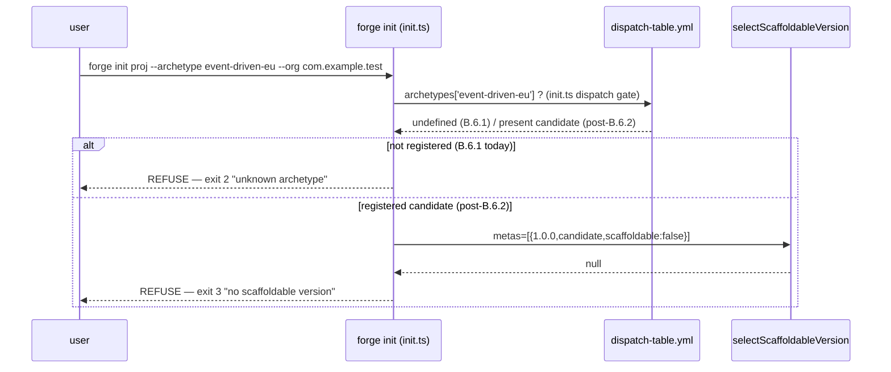

# Design: b6-1-schema

<!-- Status: designed -->
<!-- Schema: default -->
<!-- Audit: B.6.1 (docs/new-archetypes-plan.md §6.1 — event-driven-eu/1.0.0 archetype scaffold schema) -->

Resolves the proposal/specs open questions Q-001..Q-004 into ADRs. No library is
pinned here (FR-B6-1-032; `async-nats`/`temporalio-sdk`/`sqlx` verify-then-pin is
B.6.2's job), so no Context7 lookup is required for this change. This is a
**propose+specify+design+plan** artifact; the schema file + harness are authored at
the implementation phase.

## Architecture Decisions

### ADR-B6-1-001 — tdd-rust phases are INLINED, not inherited via `extends`
**Context**: §6.1 says the schema "étend `tdd-rust`". But `tdd-rust/schema.yaml` is
a *workflow* schema; the file lives at the *archetype scaffold* path. **No
scaffold-schema loader resolves `extends`** (`parseSchemaMeta` reads only
`version`/`stage`/`scaffoldable`; `check_versioned_schema_siblings` reads `phases`
from the file itself). An `extends: tdd-rust` would leave `phases` empty → validator
KO `phases missing or empty`. Identical to the B.7.1 finding for `ai-first`.
**Decision**: materialise the `tdd-rust` phase list **inline** into `1.0.0.yaml`,
extended with the two B.6.1 phases (`event-design`, `saga-orchestration`). Retain
`extends: tdd-rust` as a **documentary provenance key only** (commented
non-load-bearing). Building an `extends` resolver is rejected for B.6.1 (cross-cutting
CLI + validator change, out of an effort-S brick; a future G.* tooling brick).
**Consequences**: self-contained, validates on landing, zero loader change. Drift
risk vs `tdd-rust/schema.yaml` mitigated by `b6-1.test.sh` asserting the phase set.
**Compliance**: Article IV (additive) + III.4 (the §6.1 conflation recorded).

### ADR-B6-1-002 — `candidate` + `scaffoldable: false`; promotion deferred to B.6.7
**Context**: B.6.1 ships no templates; the archetype must not be scaffoldable yet.
b8-3b enforces `candidate ⇒ scaffoldable: false`. `selectScaffoldableVersion`
returns null when no version is stable+scaffoldable. `forge init` refuses (exit 2
unknown-archetype today; exit 3 once B.6.2 registers it).
**Decision**: `stage: candidate`, `scaffoldable: false`. Promotion to `stable` +
`scaffoldable: true` happens in the **B.6.7 snapshot/harness brick**, gated on a
green `b6.test.sh` (≥35 tests) proving a real scaffold (the B.7.6 / B.8.14-C2
pattern).
**Consequences**: `forge init --archetype event-driven-eu` refuses cleanly until the
archetype actually produces a working tree; no broken scaffold can ship.
**Compliance**: Article V (no premature advertise of an unproven archetype).

### ADR-B6-1-003 — components reference-only; nats/event/asyncapi standards deferred to B.6.3
**Context**: orchestration/persistence/transport/identity/observability standards
exist; `nats-jetstream`/`event-driven`/`asyncapi-contracts` do not (they are B.6.3).
Mirrors the B.7.1 llm-gateway/MCP/rag gap.
**Decision**: declare the component SET by name; reference the **existing** standards
by filename; mark the **three missing** ones `delivered_by: B.6.3` with no inline pin
and no fabricated filename presented as existing. No verify-then-pin candidate
(`async-nats`, `temporalio-sdk`, `sqlx`) is committed in the schema.
**Consequences**: single source of truth for pins stays in the standards / (for the
deferred set) the consuming `Cargo.toml.tmpl` B.6.2 will ship; no drift; no fabrication.
**Compliance**: Article III.4 (no fabrication) + Article IV.

### ADR-B6-1-004 — layers = backend/frontend/infra; frontend hosts a deferred ops surface
**Context**: the validator requires the backend/frontend/infra triple. But
`event-driven-eu` is a backend event stack — its user-facing value is NATS + Temporal
+ the event store, not a web app.
**Decision**: model the required triple. `backend` → **Vulcan** (Rust: NATS
producers/consumers, Postgres event store, Temporal saga activities). `infra` →
**Atlas** (NATS JetStream cluster, Temporal, Postgres, observability). `frontend` →
**Hera**, carrying a single **deferred** `ops-console` surface under
`frontend.surfaces` (mirroring `ai-native-rag`'s `frontend.surfaces.web-public`
shape) — documented as optional/out-of-first-cut so the required-triple invariant
holds without pretending a full web app ships. A real ops UI, if wanted, is a later
change.
**Consequences**: keeps the validator contract intact; reuses the proven surface
shape; Janus arbitrates cross-layer changes via `cross_layer`. The B.6.2 scaffolder
need not render a frontend for the first cut (recorded as a known narrowing).
**Compliance**: Article IV + FR-B6-1-010/012 shape.

## Component Design

The deliverable is one declarative file. Target skeleton (design blueprint — values
final at impl):

```yaml
# Forge Schema — event-driven-eu 1.0.0 (CANDIDATE)
# <!-- Audit: B.6.1 (b6-1-schema) — event-driven EU archetype scaffold schema -->
# Stage: candidate, scaffoldable:false — no templates yet (B.6.2). Promotes to
# stable+scaffoldable in the B.6.7 harness brick, gated on a green b6.test.sh
# (ADR-B6-1-002, B.7.6/B.8.14-C2 pattern). Additive: no existing archetype
# affected. `extends: tdd-rust` is DOCUMENTARY PROVENANCE ONLY — no loader
# resolves it; the tdd-rust phases are materialised inline (ADR-B6-1-001).
name: event-driven-eu
version: "1.0.0"
stage: candidate
scaffoldable: false
extends: tdd-rust            # documentary provenance only (non-load-bearing)
description: >
  EU-sovereign event-driven archetype: Rust backend (NATS JetStream producers/
  consumers + Postgres event store + Temporal activity-only saga workers) + Connect
  transport + AsyncAPI 3.1 event contracts + Zitadel + SigNoz/OBI/Coroot. TDD+BDD
  enforced; event versioning + idempotency keys + saga compensation; no ad-hoc saga
  in application code (Article VIII.2). Not scaffoldable until B.6.2.
tdd_enforced: true
bdd_required_for_user_facing: true
coverage_threshold: 80

components:                  # reference-only (ADR-B6-1-003) — NO inline pins
  - {name: nats-jetstream, role: event-backbone, delivered_by: B.6.3}   # infra/nats-jetstream.md NOT YET
  - {name: temporal,       role: orchestration,  standard: orchestration.yaml}  # §VIII.2 (rust default)
  - {name: postgres,       role: event-store,    standard: persistence.yaml}
  - {name: connect-rpc,    role: transport,      standard: transport.yaml}       # derived_outputs: asyncapi-3.1
  - {name: asyncapi,       role: event-contracts, delivered_by: B.6.3}  # global/asyncapi-contracts.md NOT YET
  - {name: event-patterns, role: saga-outbox-inbox, delivered_by: B.6.3}  # global/event-driven.md NOT YET
  - {name: zitadel,        role: identity,       standard: identity.yaml}
  - {name: observability,  role: observability,  standard: observability.yaml}

layers:                      # required triple (ADR-B6-1-004)
  - id: backend
    path: backend/
    fr_id_prefix: FR-BE-
    primary_agent: Vulcan
    standards_scope: [rust, all]
  - id: frontend
    path: frontend/
    fr_id_prefix: FR-FE-
    primary_agent: Hera
    standards_scope: [flutter, all]
    surfaces:
      - {id: ops-console, path: ops-console/, stack: qwik, status: deferred, note: "optional ops UI — not in the B.6.2 first cut"}
  - id: infra
    path: infra/
    fr_id_prefix: FR-IN-
    primary_agent: Atlas
    standards_scope: [infra, all]

fr_id_prefix_cross_layer: FR-GL-
cross_layer:
  agent: Janus
  triggers: [{layers_count_ge: 2}]

phases:                      # INLINED (ADR-B6-1-001) — tdd-rust materialised + 2 B.6.1 additions
  - {id: proposal, artifact: proposal.md, gate: constitution_compliance, next: specs}
  - {id: specs, artifact: specs.md, agent: Clio, gate: anti_hallucination_check, next: event-design}
  - {id: event-design, artifact: "shared/asyncapi/*.yaml", gate: asyncapi_contracts_defined, next: features}  # B.6.1 addition (§6.1)
  - {id: features, artifact: "features/*.feature", agent: Centurion, gate: scenarios_cover_all_fr, next: design}
  - {id: design, artifact: design.md, agent: Ferris, gate: constitution_compliance_rust, next: saga-orchestration}
  - {id: saga-orchestration, artifact: saga-design.md, gate: temporal_saga_design_reviewed, next: tasks}  # B.6.1 addition (§6.1), wires VIII.2
  - {id: tasks, artifact: tasks.md, tdd_order_enforced: true, next: implementation}
  - {id: implementation, protocol: tdd_cycle, agent: Vulcan, team: [Centurion, Ferris, Sentinel], next: review}
  - {id: review, agents: [Tribune, Aegis], checks: [cargo_test, coverage_rust, clippy_clean, cargo_audit, event_versioning_verified, saga_compensation_verified], next: archive}
  - {id: archive, merges: specs.md into .forge/specs/}

event_specifics:            # event-driven patterns (VIII.2, B.6.3 standards materialise these)
  event_versioning: required
  idempotency_keys: required
  saga_compensation: required
  outbox_inbox_pattern: recommended
  exactly_once: via_temporal_and_idempotency_keys
  eu_sovereignty:
    no_kafka_saas_us: true          # Confluent Cloud forbidden (B.6.10 builds the rule list)
    acceptable: [nats-jetstream, redpanda]

rust_specifics:             # carried from tdd-rust
  architecture: hexagonal
  async_runtime: tokio
  grpc: tonic + prost
  transport: connect-rpc
  error_handling: thiserror + anyhow
  temporal_sdk: {crate_family: temporalio-sdk, stability: public-preview, worker_bias: activity-only}
```

## Data Flow

`forge init <name> --archetype event-driven-eu --org <rd>` while only a candidate
schema exists. Today (before B.6.2 registers the archetype in `dispatch-table.yml`)
the refusal is **exit 2** ("unknown archetype"); once B.6.2 registers it while the
schema stays candidate/scaffoldable:false, the `selectScaffoldableVersion`-null →
**exit 3** guard is the active gate. Both are clean refusals with no scaffold.



## Testing Strategy

TDD order (Article I — RED before GREEN), at the implementation phase:
1. **RED**: author `.forge/scripts/tests/b6-1.test.sh` asserting the schema's
   event-specific content (inlined phases incl. `event-design`/`saga-orchestration`;
   `event_specifics`; reference-only components; the three `delivered_by: B.6.3`
   gaps). Run → **fails** (no schema file yet). Verify RED.
2. **GREEN**: author `.forge/schemas/event-driven-eu/1.0.0.yaml` per the skeleton.
   Run `b6-1.test.sh` → PASS; run `validate-foundations.sh` →
   `FR-GL-001-versioned:event-driven-eu/1.0.0.yaml` PASS. Verify GREEN.
3. **REFACTOR**: tidy comments/anchors; re-run; confirm `verify.sh` +
   `constitution-linter.sh` no regression; `forge init` refuses cleanly.
- **Unit-level**: grep/structural assertions in `b6-1.test.sh` (L1, hermetic).
- **Integration**: `validate-foundations.sh` versioned-sibling PASS (L1).
- **BDD**: not applicable — this change ships a config schema, not a user-facing
  feature. (BDD for the scaffolder arrives with B.6.2 via `features/`.)
- Register `b6-1.test.sh` in `.github/workflows/forge-ci.yml`.

## Standards Applied

- **Component standards** (referenced, not edited): `orchestration.yaml` (v1.2.0,
  rust→temporal), `persistence.yaml` (postgres-17), `transport.yaml` (v1.3.0,
  connect-rpc, derived_outputs asyncapi-3.1), `identity.yaml`, `observability.yaml`.
- **Deferred (B.6.3)**: `infra/nats-jetstream.md`, `global/event-driven.md`,
  `global/asyncapi-contracts.md` — referenced `delivered_by: B.6.3`, gap recorded.
- **Articles I/II/X**: TDD + (n/a BDD) + 80% coverage flags carried in the schema.
- **Article VIII.2**: the `saga-orchestration` phase + `event_specifics.saga_compensation`
  materialise "no ad-hoc saga implementations; Temporal for multi-step workflows".

## Constitutional Compliance Gate

- Article I (TDD): impl is test-first (`b6-1.test.sh` RED→GREEN). ✓
- Article VI/VII: no Flutter/Rust code in this change. ✓ N/A.
- Article VIII: Envoy/Connect (§VIII.1) + Temporal (§VIII.2) referenced as-is. ✓
- Article IV (delta): additive — no existing schema/standard/CLI edited. ✓
- Article III.4: no fabrication; deferred standards + verify-then-pin candidates
  explicitly not committed. ✓
**Gate result: PASS — no article violated.**
