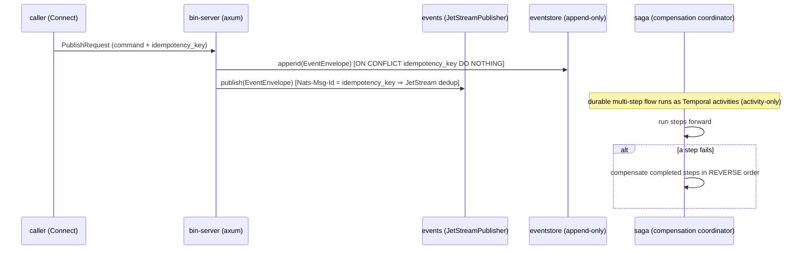

# Design: b6-2-scaffolder

<!-- Designed: 2026-07-10 -->
<!-- Routing: Ferris (Rust architect, lead) + Atlas (infra) + Eris (test strategy) -->
<!-- API grounding: async-nats 0.49.1 + sqlx 0.9 verified by compile-probe; -->
<!--                 temporalio-sdk/-client 0.5.0 verified to build; AsyncAPI 3.1.0 -->
<!--                 spec existence verified live (official schema HTTP 200). -->

**Constitution** : v2.0.0 — no bump (additive). Gate at end: no Article violation.

## Grounding (LIVE — Article III.4; verify-then-pin at impl, FR-B6-2-040)

- **async-nats 0.49.1**: `jetstream::new(client)` → `Context::publish_with_headers(subject,
  HeaderMap, payload).await?` → `ack.await?`; `HeaderMap::insert("Nats-Msg-Id", key)`
  drives JetStream server-side dedup. Confirmed by compile-probe (not memory).
- **sqlx 0.9.0**: runtime `sqlx::query(...).bind(...).fetch_all/execute(&pool)` +
  `Row::try_get` (NO `query!` macro ⇒ no DATABASE_URL to build). Features
  `runtime-tokio` + `tls-rustls-ring` (0.9 split the old `runtime-tokio-rustls`) +
  `postgres`+`chrono`+`uuid`+`json`. Confirmed by compile-probe.
- **temporalio-sdk / temporalio-client 0.5.0**: Public Preview / pre-alpha
  (`infra/temporal.md`). Proven to build standalone (`cargo check` exit 0). The plan
  §6.1 `0.4.0` note is superseded by LIVE `0.5.0`.
- **AsyncAPI 3.1.0**: the latest released 3.x spec — verified live (official
  spec-json-schemas `3.1.0.json` HTTP 200, title "AsyncAPI 3.1.0 schema."). The
  rendered contract validates against it (jsonschema PASS).

---

## Architecture Decisions

### ADR-B6-2-001 — Promotion deferred to B.6.7 (ratified)
**Context**: `candidate ⇒ scaffoldable:false` is a hard b8-3b invariant; B.6.1
gates the stage flip on a green B.6.7 harness.
**Decision**: keep the schema `candidate`/`scaffoldable:false`. Templates + plan +
gated wrapper land and are validated by a fixture driving `overlay.sh` directly
(the `FORGE_EDE_FORCE_SCAFFOLD=1` override); the CLI keeps refusing (exit 3). The
stage flip + `cli/assets` scaffoldable promotion ride B.6.7.
**Consequences**: `forge init --archetype event-driven-eu` is inert end-to-end
after this brick; the backbone is nonetheless fully reviewable/testable.

### ADR-B6-2-002 — Connect/tonic consumed by reference (ratified)
**Context**: transport.yaml governs Connect-RPC (ADR-003/009); the flagship + ai-native-rag
ship protos + buf codegen and consume Connect by reference (no inline tonic pin).
**Decision**: ship `shared/protos/` (buf.yaml + buf.gen.yaml with neoeinstein-tonic/
-prost + Connect-ES/Go plugins + a seed `events.proto`) and a `derived_outputs`
path to AsyncAPI. Backend crates carry NO `tonic`/`prost` pin — the gRPC/Connect
stubs are generated by `buf generate` at the adopter/codegen step (deferred). This
keeps the rendered `cargo check` hermetic (no protoc at build time), mirroring
ai-native-rag B.7.2.
**Consequences**: transport pins stay single-sourced in transport.yaml; the rendered
backend builds without buf/protoc.

### ADR-B6-2-003 — No frontend in the first cut (ratified)
**Context**: the schema declares a backend/frontend/infra triple (validator
contract), but event-driven-eu is a backend event stack; the frontend layer's
ops-console surface is `status: deferred` (ADR-B6-1-004).
**Decision**: render NO frontend in B.6.2. The tree ships backend + infra + shared;
the frontend is a documented later change. **Consequences**: smaller, honest first
cut; recorded as a known narrowing (README + tasks.md).

### ADR-B6-2-004 — Temporal activity-only + feature-gated re-export (ratified; Q-1)
**Context**: the native `temporalio-sdk` workflow API is Public Preview / pre-alpha
("will continue to evolve"). Compiling it into every build is fragile, and calling
its unstable workflow macros risks fabrication.
**Decision**: the `saga` crate ships, ALWAYS-compiled:
  1. `Activity` marker traits + `registered_activity_names()` (activity-only worker
     surface — the Temporal worker registers these);
  2. a deterministic, unit-tested `Saga`/`SagaStep` compensation coordinator
     (forward + reverse-order undo) — the core a Temporal activity chain drives.
The pinned SDK crates are behind an OFF-by-default `temporal-sdk` feature that only
**re-exports** `temporalio_sdk` / `temporalio_client` (documented wiring seam; NO
API call, so no fabricated method surface). Default `cargo build`/`test` never
compiles the unstable API; `--features temporal-sdk` compiles it (proven to build).
**Consequences**: honours Article VIII.2 (no ad-hoc saga; Temporal for durable
workflows) + the pre-alpha caveat; a real, proven pin travels with the template.

### ADR-B6-2-005 — Pins only in backend/Cargo.toml.tmpl (ratified)
Every version pin lives in the rendered `backend/Cargo.toml.tmpl`; no standard
gains a version. **Consequences**: standards stay pin-free; pins travel with the
consumer (b8-6 / ai-native-rag precedent).

## Component Design

```mermaid
graph TD
  subgraph backend [backend/ — Rust axum (Vulcan/Ferris)]
    EV[events/<br/>EventEnvelope (versioned, idempotent)<br/>EventPublisher port + JetStreamPublisher<br/>Nats-Msg-Id dedup · InboxDedup]
    ES[eventstore/<br/>EventStore port · PgEventStore (sqlx)<br/>InMemoryEventStore · Projection]
    SG[saga/<br/>Activity marker traits<br/>Saga/SagaStep compensation coordinator<br/>temporal-sdk feature OFF by default]
    BS[bin-server/<br/>axum entrypoint + DI wiring only]
    BS --> EV
    BS --> ES
    BS --> SG
  end
  subgraph shared [shared/]
    API[asyncapi/asyncapi.yaml<br/>AsyncAPI 3.1.0 — event SSoT]
    PB[protos/ — Connect SSoT + buf codegen]
  end
  subgraph infra [infra/ — (Atlas), dev overlays]
    NATS[(NATS JetStream · jetstream.conf)]
    PG[(Postgres 17 · init-eventstore.sql)]
    TMP[Temporal dev overlay · OPTIONAL]
  end
  EV --> NATS
  ES --> PG
  SG -.activity-only.-> TMP
  BS -.Connect by reference.-> PB
```

## Data Flow — command → event → saga (happy path + compensation)



## Testing Strategy (Eris)

- **Unit (Rust)**: envelope subject/idempotency/serde; publisher port (in-memory
  fake); inbox dedup; in-memory event-store append+read+idempotence; projection
  fold; saga forward-success + reverse-order compensation; activity name
  namespacing; bin-server health + wiring smoke. 16 tests, RED→GREEN per module.
- **L1 harness `b6-2.test.sh`** (hermetic, grep/structure): tree shape, plan↔tree
  coverage (no orphan/dangling), verify-then-pin recorded, pins-only-in-Cargo,
  wrapper exists + refuses exit 3, standards-conformance markers, asyncapi 3.1.0,
  schema-still-candidate, dispatch-registered.
- **L2 harness** (toolchain-gated): `overlay.sh` render → no `.tmpl`/no
  `<placeholder>` + byte-stable; `cargo check` on the rendered backend; gated
  wrapper render path.
- **BDD**: the 4 `specs.md` scenarios → `features/*.feature` (render-clean,
  backend-builds, CLI-refuses, saga-compensates).
- **CLI e2e**: help snapshot regenerated; `archetypes-smoke` candidate partition
  (exit 3 + no dir) — activated for the first time by this brick.

## Standards Applied

- `orchestration.yaml` (Temporal, VIII.2), `persistence.yaml` (postgres-17),
  `transport.yaml` (Connect, derived_outputs asyncapi-3.1), `identity.yaml`,
  `observability.yaml` — reused by reference.
- Deferred (B.6.3): `infra/nats-jetstream.md`, `global/event-driven.md`,
  `global/asyncapi-contracts.md` — the templates conform to these patterns; the
  standards themselves are B.6.3.

## Constitutional Compliance Gate

- Article I (TDD): modules ship tests; harness drives RED→GREEN. ✅
- Article II (BDD): 4 scenarios authored. ✅
- Article III (Specs/anti-hal): verify-then-pin LIVE; compile-probed API; AsyncAPI
  3.1.0 existence verified; no fabricated symbols. ✅
- Article VII (Rust arch): hexagonal; typed errors; bin-server DI-only; no
  unwrap/expect/panic in src. ✅
- Article VIII (§VIII.1/§VIII.2): Connect + Temporal (activity-only) consumed as-is. ✅
- Article IX.4 (tracing): request-path spans. ✅
- **No violation → gate PASS.**

---

**Gate**: Design complete. Next: `/forge:plan b6-2-scaffolder`.
