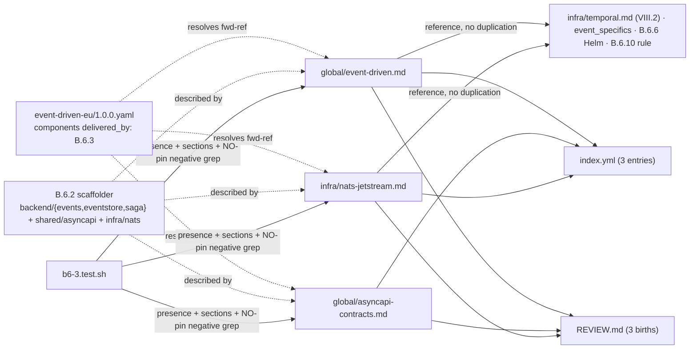

# Design: b6-3-standards

<!-- Status: designed -->
<!-- Schema: default -->
<!-- Audit: B.6.3 (docs/new-archetypes-plan.md §6.1 — event-driven-eu standards) -->

Resolves the proposal/specs ADRs + Q-001/Q-002. Ships three `{global,infra}/*.md`
pattern standards (no crate pins) describing the already-merged B.6.2 scaffolder.

## Architecture Decisions

### ADR-B6-STD-001 — `.md` pattern docs, zero version pins
**Context**: the schema's `nats-jetstream`/`asyncapi`/`event-patterns` components
point at standards `delivered_by: B.6.3`. Plan §6.1 names them `{global,infra}/*.md`.
The b6-2 verify-then-pin research already resolved `async-nats 0.49.1` / `sqlx 0.9.0`
/ `temporalio-sdk 0.5.0` LIVE and shipped them in B.6.2's `Cargo.toml.tmpl`.
**Decision**: ship pattern `.md` only; **no crate version pin** in any of the three.
Pins already ride with B.6.2's consuming templates — exactly the `transport.yaml`/
b8-6 precedent. A negative-grep harness test (FR-B6-STD-032) guards against an
accidental inline pin.
**Consequences**: no orphan pins under the j7 yaml gate + 12-month review.
**Constitution**: III.4 (no premature pin) + IV (additive) confirmed.

### ADR-B6-STD-002 — describe the scaffolder, flag gaps; don't invent (III.4)
**Context**: the standards must DESCRIBE what B.6.2 built. Three things the schema
mentions are NOT in the first cut: a transactional outbox, a process manager, and an
`asyncapi diff` Taskfile/CI wiring.
**Decision**: each standard references the real scaffolded file paths
(`backend/events/src/envelope.rs`, `.../publisher.rs`, `.../consumer.rs`,
`backend/eventstore/src/{store,projection}.rs`, `backend/saga/src/*`,
`shared/asyncapi/asyncapi.yaml`, `infra/nats/jetstream.conf`,
`infra/postgres/init-eventstore.sql`) and marks the outbox / process-manager /
`asyncapi diff`-wiring gaps as follow-ups (B.6.4/B.6.5/B.6.6), never as shipped.
Resolves Q-001 → pure guidance now (enforcement of forbidden Kafka SaaS is B.6.10).
**Consequences**: standards stay truthful; downstream bricks know exactly what to add.

### ADR-B6-STD-003 — reference existing machinery, don't duplicate
**Decision**: `event-driven.md` REFERENCES `infra/temporal.md` (Article VIII.2) for
the Temporal workflow/worker/activity API rather than restating it, and references
`event_specifics.eu_sovereignty` + the B.6.10 forbidden-Kafka-SaaS rule for
EU-sovereignty. `nats-jetstream.md` references the B.6.6 Helm chart as the delivery
vehicle for the production cluster it describes.
**Consequences**: single source of truth; no pre-emption of B.6.6/B.6.10.

### ADR-B6-STD-004 — filenames + documented component mapping (Q-002)
**Decision**: keep the plan's filenames (`event-driven.md`, `asyncapi-contracts.md`,
`nats-jetstream.md`); document the schema component → standard mapping in each
header (`event-patterns` ↔ `event-driven.md`; `asyncapi` ↔ `asyncapi-contracts.md`;
`nats-jetstream` ↔ `nats-jetstream.md`). Does NOT edit the b6-1 schema (additive).

### ADR-B6-STD-005 — AsyncAPI breaking-change tool verified LIVE (III.4)
**Context**: plan §6.1 says "validation buf breaking equivalent (TBD:
`asyncapi-cli` validate)". The task requires investigating LIVE, not assuming.
**Decision**: verified LIVE on npm (2026-07-10): `@asyncapi/cli` **6.0.2** exposes
`asyncapi validate` AND `asyncapi diff OLD NEW -t breaking|non-breaking|
unclassified|all --no-error -o overrides`, backed by `@asyncapi/diff` **0.5.0**
(breaking-change library) + `@asyncapi/parser` **3.6.0**. `asyncapi diff` (not a
mythical `asyncapi-cli breaking`) IS the `buf breaking` analogue. Recorded as fact,
no tool version pinned in the standard.

## Component Design

## Standards content blueprint (authored at impl)

- **event-driven.md** — H2: Schema mapping & scope; Event envelope & versioning
  (`EventEnvelope`, `events.v<n>.<Type>`); Idempotency keys (`Nats-Msg-Id` / append
  `ON CONFLICT` / inbox); Saga & compensation (reverse-order coordinator; Temporal
  activity-only, VIII.2, refs `infra/temporal.md`); Process manager (documented
  variant, not scaffolded); Outbox & inbox (inbox shipped; outbox recommended but
  NOT in first cut); Projections & read models; EU sovereignty; Constitutional
  Compliance; Out-of-scope.
- **asyncapi-contracts.md** — H2: Schema mapping & scope; AsyncAPI 3.1 single source
  of truth; Versioning discipline (`info.version` vs `event_version` vs schema
  evolution); Contract validation (`asyncapi validate`); Breaking-change detection
  (`asyncapi diff`, buf-breaking equivalent; Taskfile wires validate only — follow-up
  to wire diff); Constitutional Compliance; Out-of-scope.
- **nats-jetstream.md** — H2: Schema mapping & scope; Clustering & RAFT consensus
  (≥3 nodes, quorum; Helm B.6.6); Persistence (file store, retention, replicas;
  dev `jetstream.conf` counterpart); Consumer groups (durable, pull/push, queue
  groups, ack/redelivery → inbox); EU sovereignty (no Kafka SaaS US; Redpanda OK;
  B.6.10); Constitutional Compliance; Out-of-scope.

## Testing Strategy (TDD — Article I)

1. **RED**: `b6-3.test.sh` asserts the three files exist, each has its required H2
   set + Constitutional-Compliance + Out-of-scope + schema-mapping, index.yml has 3
   entries, REVIEW.md has 3 births, AND a negative grep finds NO inline crate pin
   (`async-nats = "<digit>`, `sqlx = "<digit>`, `temporalio-sdk = "<digit>`). Run →
   fails (no files). Verify RED.
2. **GREEN**: author the three `.md` + index/REVIEW entries. Run → PASS.
3. **REFACTOR**: tidy; re-run; verify.sh + constitution-linter.sh +
   validate-standards-yaml.sh (no-op, no new yaml) no regression.
- **BDD**: N/A (documentation standards, not a user-facing feature).
- Register `b6-3.test.sh` in `forge-ci.yml` (B.6 chain, after `b6-2.test.sh`).

## Standards Applied

- `standards-lifecycle.md` — REVIEW.md birth entries; `.md` standards are not the
  Article-XII structural-exception yaml class (narrative frontmatter, not j7-gated).
- III.4 — AsyncAPI CLI verified LIVE (npm 2026-07-10); scaffolder file paths cited;
  outbox / process-manager / diff-wiring gaps recorded, not glossed; no crate pin.

## Constitutional Compliance Gate

- Article I (TDD): harness RED before docs. ✓
- Article IV (delta): additive; no existing standard/schema/constitution edited. ✓
- Article III.4: LIVE-verified + scaffold-grounded; gaps recorded; no pin fabricated. ✓
- Article VIII.2: `event-driven.md` encodes Temporal activity-only, refs `infra/temporal.md`. ✓
- No Article-XII amendment (`.md` standards). ✓
**Gate: PASS.**
