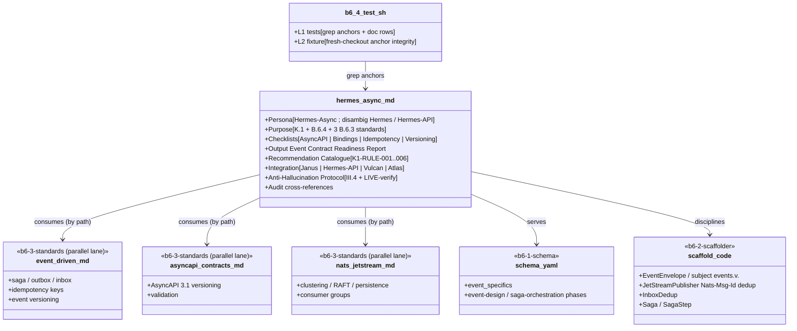

# Design: b6-4-hermes-async

<!-- Status: designed -->
<!-- Schema: default -->

> Read alongside `specs.md` (FR-B6-HA-* / NFR-B6-HA-*) and `open-questions.md`
> (Q-001 + Q-002 + Q-003, all non-blocking). This document locks the implementation
> strategy for the K.1 Hermes-Async event-driven specialist agent and resolves the
> three open questions via ADR-K1-001..003.

## Architecture Decisions

### ADR-K1-001 — Persona name & disambiguation (resolves Q-001)

**Context** : the roadmap (§9 line 2668, §6.1 line 2556, ARCHITECTURE-TARGET §9.2
line 731) names the K.1 agent **Hermes-Async** verbatim. Two other roster entries
share the "Hermes" root: **Hermes** (Flutter performance sub-agent, `CLAUDE.md`
line 76 / `docs/GUIDE.md` line 193) and **Hermes-API** (Connect/gRPC + OpenAPI
codegen, plan §9.1 line 2682).

**Decision** : keep the roadmap-mandated name **Hermes-Async** as-is. Unlike the
b7-pythia Q-001 (two agents contending for the *same* literal name "Pythia"), there
is **no collision** here — "Hermes-Async", "Hermes-API", and "Hermes" are three
distinct dispatch names. Name-based dispatch (`SendMessage to: "Hermes-Async"`, the
CLAUDE.md trigger table) disambiguates cleanly. The persona embeds a one-paragraph
disambiguation note so a reader never confuses the three.

**Consequences** :
- ✅ Zero churn ; no existing persona renamed.
- ✅ The roadmap name is preserved (documentary link intact).
- ✅ Q-001 is non-blocking — it is a *confirmation*, not a contested decision.

**Constitution Compliance** : Article III.4 (the adjacency is surfaced explicitly,
not guessed). No violation.

---

### ADR-K1-002 — K1-RULE namespace : 6 seed rules, incremental growth (resolves Q-002)

**Context** : Q-002 weighed pre-allocation vs incremental growth for the
`K1-RULE-NNN` catalogue. ADR-J8-004 locked the `<MODULE>-RULE-NNN` format ;
b7-pythia ADR-K2-002 chose incremental (6 seed rules).

**Decision** : **incremental growth, 6 seed rules**, mirroring ADR-K2-002. Seed
catalogue (one per checklist area + the VIII.2 idempotency gate) :

- **K1-RULE-001** — AsyncAPI contract drift (`Concern`, FR-B6-HA-120).
- **K1-RULE-002** — Breaking change without version bump (`Concern`, FR-B6-HA-121).
- **K1-RULE-003** — Publish path not deduplicated (`Concern`, FR-B6-HA-122).
- **K1-RULE-004** — Consumer lacks inbox dedup (`Concern`, FR-B6-HA-123).
- **K1-RULE-005** — Forbidden broker / Kafka SaaS US (`Advisory`, FR-B6-HA-124 ;
  cross-links the B.6.10 blocking scaffold-time rule).
- **K1-RULE-006** — Idempotency/exactly-once not enforced (`Blocking` — the single
  Blocking rule, FR-B6-HA-125, Article VIII.2).

**Severity vocabulary** (advisory agent — softer than J8/K3 policy-refusal) :
`Advisory` < `Concern` < `Blocking` (VIII.2 idempotency gate only ; maps the report
status to `BLOCKED`). **Numbering invariant** (ADR-J8-004 inheritance) : IDs NEVER
reused ; future K.1 extensions append `K1-RULE-007..` ; decommissioned rules marked
`DEPRECATED`, slot not recycled. `K1-RULE-*` is syntactically disjoint from
`J8-RULE-*` / `K2-RULE-*` / `K3-RULE-*` (FR-B6-HA-086).

**Constitution Compliance** : Article V (audit trail). No violation.

---

### ADR-K1-003 — Advisory agent, NO scanner (resolves Q-003)

**Context** : the b7-pythia precedent is advisory (no scanner) ; the earlier
k3-demeter precedent ships a deterministic scanner. Q-003 asks which shape K.1 takes.

**Decision** : **NO scanner. Hermes-Async is a pure advisory / review-time
specialist**, in the Sibyl / Panoptes mould — persona checklists + an `Event Contract
Readiness Report` template + a `K1-RULE-*` recommendation catalogue, and **nothing
executable**.

**Rationale** :
1. The plan §9 K.1 verbs are advisory : *maintain*, *generate*, *enforce* at
   design/review time.
2. Contract-sync / binding / idempotency review is design-judgement, not a
   deterministic deny-list lookup (contrast Demeter's CLOUD Act jurisdiction, which
   IS a deterministic lookup). Idempotency of a handler cannot be proven by grep.
3. The B.6.10 forbidden-broker rule (the one deterministic enforcement in the
   event-driven domain) is a **Janus scaffold-time rule** owned by a sibling brick,
   not a Hermes-Async scanner.

**What this removes vs the k3-demeter precedent** : `bin/forge-hermes-scan.sh`, any
Python engine, `.forge/data/*.yml`, the exit-code contract. The harness's single L2
fixture asserts persona-anchor integrity across a fresh checkout instead
(NFR-B6-HA-007).

**Constitution Compliance** : Article VIII (no service / no daemon — trivially
satisfied), XI.1 (agent-native persona). No violation.

---

## Component Design

## Test Harness Design

`.forge/scripts/tests/b6-4.test.sh` mirrors the `b7-pythia.test.sh` layout (bash
header, `_helpers.sh` source, PASS/FAIL counters, `--level 1,2` parsing,
`print_summary`) **minus the scanner machinery** (ADR-K1-003). It resolves the agent
path from a single `HERMES_AGENT` variable (NFR-B6-HA-007).

### L1 — anchor-level (18 grep tests)

| Test ID                                | FR covered                | Anchor asserted                                                                     |
|----------------------------------------|---------------------------|-------------------------------------------------------------------------------------|
| `_test_b64_001_persona_exists`         | FR-B6-HA-001              | `$HERMES_AGENT` file exists                                                          |
| `_test_b64_002_audit_comment`          | FR-B6-HA-010              | `<!-- Audit: K.1 (b6-4-hermes-async) -->` + `<!-- Audit: B.6.4 (b6-4-hermes-async) -->` in first 6 lines |
| `_test_b64_003_persona_h2`             | FR-B6-HA-002 / 003        | `## Persona` + `## Purpose` H2 anchors                                               |
| `_test_b64_004_checklists_h2`          | FR-B6-HA-004              | `## Checklists` H2 + 4 H3 (AsyncAPI Contract Maintenance / NATS/Kafka Binding Generation / Idempotency-Key Enforcement / Event Versioning & Compatibility) |
| `_test_b64_005_checklists_items`       | FR-B6-HA-004              | each of the 4 H3 has ≥ 5 `[ ]` items                                                |
| `_test_b64_006_output_h2`              | FR-B6-HA-005              | `## Output: Event Contract Readiness Report` H2 + `\| Severity \|` table            |
| `_test_b64_007_rule_catalogue`         | FR-B6-HA-006 / 120..125   | `## Recommendation Catalogue` H2 + K1-RULE-001..006 anchors                         |
| `_test_b64_008_idempotency_blocking`   | FR-B6-HA-125 / VIII.2     | K1-RULE-006 present + `Blocking` severity + `VIII.2` reference                       |
| `_test_b64_009_integration`            | FR-B6-HA-007              | `## Integration` H2 + `cross-layer-orchestrator` + `Vulcan` + `Hermes-API` mentions |
| `_test_b64_010_anti_halluc`            | FR-B6-HA-008              | `## Anti-Hallucination Protocol` H2 + `[NEEDS CLARIFICATION:` + `Context7` mention   |
| `_test_b64_011_standards_consumed`     | FR-B6-HA-003 / 020..027   | persona references all three by path: `event-driven.md` + `asyncapi-contracts.md` + `nats-jetstream.md` |
| `_test_b64_012_claude_md_trigger`      | FR-B6-HA-080              | repo `CLAUDE.md` contains the Hermes-Async row                                       |
| `_test_b64_013_guide_md_row`           | FR-B6-HA-081              | `docs/GUIDE.md` agent table contains a Hermes-Async row                             |
| `_test_b64_014_no_new_standard`        | FR-B6-HA-082              | no new `standards/**` file authored by this change (guard against re-authoring b6-3) |
| `_test_b64_015_no_janus_index_edit`    | FR-B6-HA-083              | this change adds no `Hermes-Async` row to `cross-layer-orchestrator.md` and no `hermes` trigger to `index.yml` (task-boundary guard) |
| `_test_b64_016_no_scanner`             | FR-B6-HA-084 / NFR-002    | no `bin/forge-hermes*.sh` and no `.forge/data/hermes*.yml` exist                     |
| `_test_b64_017_real_code_shapes`       | FR-B6-HA-085              | persona names `EventEnvelope` + `Nats-Msg-Id` + `idempotency_key` + `events.v` subject namespacing |
| `_test_b64_018_no_namespace_collision` | FR-B6-HA-086              | `K1-RULE` absent from Janus/Demeter/Sibyl surfaces ; J8/K2/K3-RULE ≤ 2 in the persona |

**18 L1 tests** — matches the b7-pythia baseline, adapted to the narrower scope
(GUIDE.md row + no-Janus-edit guards replace b7-pythia's Janus-dispatch-row +
Step-3-note tests).

### L2 — fixture-level (1 test)

| Fixture                          | Coverage                                                                     | Expected                                                              |
|----------------------------------|------------------------------------------------------------------------------|-----------------------------------------------------------------------|
| `_test_b64_l2_anchor_integrity`  | copy `$HERMES_AGENT` into a tmpdir, re-run the L1 anchor greps against the copy | all H2/H3 + K1-RULE anchors present on the isolated copy (self-contained) |

### Performance

L1 ≤ 3 s (pure grep) ; full `--level 1,2` ≤ 5 s. No Python, no cargo, no network.

### CI registration

`b6-4.test.sh --level 1,2` registered in `.github/workflows/forge-ci.yml`
`harnesses=(...)` array, inserted in the B.6 block **immediately after**
`"b6-2.test.sh --level 1"` so the B.6 chain stays contiguous.

## Shared-file collision with sibling B.6 bricks (NFR-B6-HA-006)

Four files are co-edited by the five concurrent B.6 lanes (B.6.3, B.6.5, B.6.6,
B.6.9, B.6.10):

| File | `b6-4-hermes-async` edits | Disjoint? |
|------|---------------------------|-----------|
| `CLAUDE.md` | +1 agent-delegation row (`Event-driven / AsyncAPI \| Hermes-Async`) | ✅ single additive row |
| `docs/GUIDE.md` | +1 "Agents Transversaux" row | ✅ single additive row |
| `CHANGELOG.md` | +1 `## [Unreleased]` bullet | ✅ single additive bullet |
| `.github/workflows/forge-ci.yml` | +1 harness-array line (`b6-4.test.sh`) | ✅ single additive line |

**Merge protocol** : each edit is a single additive row/line ; whichever brick lands
second rebases its surgical delta. Conflicts are trivially resolvable and resolved
centrally after the 6 PRs land (expected per the task's parallel-lane note).

## Standards Applied

- **`global/event-driven.md`** (B.6.3) — consumed by reference ; Idempotency-Key
  Enforcement + Event Versioning checklists operationalise it.
- **`global/asyncapi-contracts.md`** (B.6.3) — consumed by reference ; AsyncAPI
  Contract Maintenance + versioning checklists operationalise it.
- **`infra/nats-jetstream.md`** (B.6.3) — consumed by reference ; NATS/Kafka Binding
  Generation checklist operationalises it.
- **`.claude/agents/sibyl.md`** (b7-pythia) — structural precedent for the advisory
  specialist (Persona / Purpose / Checklists / Output / Rule Catalogue / Integration
  / Anti-Hallucination / Audit cross-references) + the `<MODULE>-RULE-NNN` convention.
- **`.forge/schemas/event-driven-eu/1.0.0.yaml`** (B.6.1) — the schema Hermes-Async
  serves ; its `event_specifics` block defines the mandates Hermes-Async enforces.

## Constitutional Compliance Gate

- **Article I (TDD)** : ✅ `b6-4.test.sh` real assertions run RED before the persona
  exists → GREEN after.
- **Article II (BDD)** : ✅ 3 Gherkin scenarios in specs.md.
- **Article III + III.4** : ✅ specs precede code ; Q-001/002/003 non-blocking,
  answered by ADR-K1-001..003.
- **Article IV (Delta)** : ✅ ADDED requirements predominate ; the only MODIFIED
  entries are single additive rows (`CLAUDE.md`, `GUIDE.md`, `CHANGELOG.md`,
  `forge-ci.yml`).
- **Article V (Audit Trail)** : ✅ FR-B6-HA-* tags + `K1-RULE-NNN` IDs + structured
  report shape.
- **Article VII (Rust)** : N/A (Hermes-Async advises Vulcan's Rust backend ; writes
  no Rust).
- **Article VIII (Infra)** : ✅ trivially (no executable) ; VIII.2 idempotency is the
  Blocking gate Hermes-Async enforces (K1-RULE-006).
- **Article XI.1 (Agent-Native)** : ✅ Hermes-Async is a first-class persona ; the
  idempotency posture it enforces is XI.1's "idempotent actions enabling safe retry".
- **Article XII (Governance)** : ✅ enforces the event-driven + EU-sovereignty posture ;
  authors no new standard ; amends no article.

**No constitutional violation detected. No blocking open question. Design proceeds to
`/forge:plan`.**

## Open Questions remaining post-design

- Q-001 (name-adjacency) → **answered by ADR-K1-001** (keep "Hermes-Async" ; no
  collision ; disambiguated in the persona).
- Q-002 (K1-RULE seed size) → **answered by ADR-K1-002** (6 seed rules, incremental).
- Q-003 (advisory vs scanner) → **answered by ADR-K1-003** (advisory only, no scanner).

All three flip to `Status: answered` in `open-questions.md` ; none is blocking.
