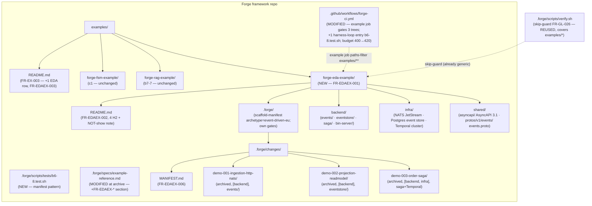
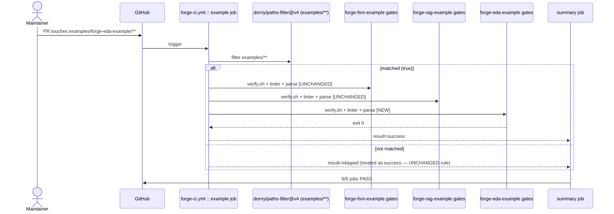
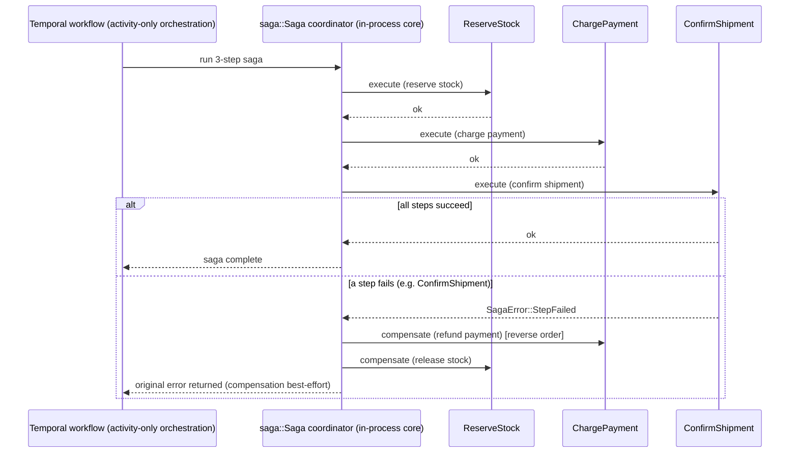

# Design: b6-8-example

<!-- Audit: B.6.8 (docs/new-archetypes-plan.md §6.1 / §0.13 T7 brick #10). -->
<!-- Depends on: b6-1-schema + b6-2-scaffolder + b6-3-standards + -->
<!--             b6-7-harness (promotion) + c1-reference-project (all archived). -->
<!-- Constitution: v2.0.0 — no bump (additive). -->

This design transforms `specs.md` into concrete technical decisions.
Like `c1-reference-project` and `b7-7-example`, the change is
**meta-organizational**: the architectural patterns for the demos (Rust
`events`/`eventstore`/`saga` layering, NATS JetStream, Postgres event
store, Temporal activity-only saga, AsyncAPI-as-SSoT) are already
governed by archived bricks (`b6-1-schema`, `b6-2-scaffolder`,
`b6-3-standards`). What this design must decide is:

1. **How** the example is rendered now that the archetype is
   `stable`/`scaffoldable` (real `forge init` CLI vs `overlay.sh`).
2. **Which** demos, **what shape**, **what order**, demonstrating the
   event-driven discipline rather than a product — and **which one is
   multi-layer**, given the archetype's `frontend` layer is deferred.
3. **How** the existing `example` CI job is extended to gate a third
   tree without regressing the FSM + RAG blocks, and how the
   `forge-ci.yml` line budget is bumped in lockstep.
4. **How** the test harness `b6-8.test.sh` validates the artefacts.

The 4 ADRs below cover these decisions. The example-tree **machinery**
(skip-guards FR-GL-026/027, `.gitignore` FR-GL-028, the
`examples/README.md` file, the `example` CI job FR-CI-012) is reused
from c1 — b6-8 does not re-decide it.

---

## Architecture Decisions

### ADR-B6-8-001: Render through the real `forge init` CLI (diverging from b7-7's overlay.sh workaround)

**Context.** `b7-7-example` had to render `forge-rag-example/` via
`overlay.sh` directly, because `ai-native-rag` was still
`stage: candidate` / `scaffoldable: false` at b7-7's creation time — its
`forge init --archetype ai-native-rag` refused with exit 3
(ADR-B7-7-001). **b6-8's situation is materially different:**
`event-driven-eu/1.0.0` is ALREADY `stage: stable` / `scaffoldable:
true` — promoted by `b6-7-harness` (candidate→stable flip, gated on the
green ≥35-test suite + the live `harness-rust` codegen/build gate). The
CLI's `selectScaffoldableVersion` now returns `1.0.0`, so
`forge init --archetype event-driven-eu` renders the tree for real.

**Decision.** Render the example **through the real public CLI**:

```bash
node cli/dist/index.js init forge-eda-example \
  --target examples/forge-eda-example \
  --archetype event-driven-eu \
  --org io.forge.example --force
```

(equivalently `forge init forge-eda-example --archetype event-driven-eu
--org io.forge.example`, once the CLI is on `PATH`). The CLI dispatches
to `bin/forge-init-event-driven-eu.sh`, whose scaffoldability gate is now
OPEN (schema is stable/scaffoldable), so it renders the 48 templates via
`overlay.sh` and writes `scaffold-manifest.yaml`, then runs best-effort
`buf generate` + `cargo fetch` (skipped gracefully when BSR/network is
absent — the render's success contract is the tree, not codegen).

**Consequences.**
- ✅ **Stronger demonstration than b7-7 could give.** The example proves
  the *public adopter flow* end-to-end — `forge init` really scaffolds a
  promoted archetype — not just that the internal renderer works. This
  is the whole point of shipping the example AFTER the promotion.
- ✅ The committed tree is provably `forge init`'s output; its
  `scaffold-manifest.yaml` records the plan/template SHAs +
  `archetype_version: 1.0.0`.
- ✅ Mirrors how c1 rendered `forge-fsm-example/` through the flagship
  scaffolder of its day.
- ⚠️ The rendered `README.md` template still carries a stale
  "candidate" caveat (an archetype-template artefact from b6-2, out of
  b6-8's scope — b6-8 must not edit archetype templates, NFR-EDAEX-001).
  The example's top-level `README.md` is REPLACED by the authored
  navigation README (FR-EDAEX-002), so the stale text is never
  committed under `examples/forge-eda-example/README.md`.

**Constitution Compliance:** Article III.4 (verify-then-act on the real
promoted CLI behaviour), Article V.

### ADR-B6-8-002: demo-003 is the multi-layer (Janus) SAGA demo spanning `[backend, infra]`; demo-001/002 single-layer backend

**Context.** NFR-EDAEX-005 requires distinct layer + event-surface
combinations, and the c1 + b7-7 precedents each shipped ≥ 1 multi-layer
demo to exercise Janus (≥ 2 layers → FR-GL-015). b7-7's multi-layer demo
was `[backend, frontend]` (its Qwik streaming UI). **b6-8 diverges here
by necessity:** the `event-driven-eu` archetype's `frontend` layer is a
single DEFERRED `ops-console` surface (ADR-B6-1-004) — there is no web
UI to demonstrate. The archetype's live layers are `backend` + `infra`.

**Decision.** Three demos, chronological:

| Demo | Layers | Event surface | What it demonstrates | Status |
|---|---|---|---|---|
| `demo-001-ingestion-http-nats` | `[backend]` | `events/` | axum HTTP ingestion → idempotent, versioned `EventEnvelope` → NATS JetStream publish (`Nats-Msg-Id` dedup); event versioning + idempotency keys; cucumber-rs BDD | archived |
| `demo-002-projection-readmodel` | `[backend]` | `eventstore/` + `events/` | fold the persisted event stream (Postgres event store) into a deterministic, replayable read-model projection; inbox dedup (outbox/inbox pattern); cucumber-rs BDD | archived |
| `demo-003-order-saga` | `[backend, infra]` | `saga/` + Temporal cluster | Janus-orchestrated multi-layer; a Temporal **activity-only** 3-step saga (reserve stock → charge payment → confirm shipment) with reverse-order compensation (Article VIII.2); the backend `saga` crate + the infra Temporal cluster substrate; per-layer designs/tasks | archived |

- The multi-layer demo is `demo-003-order-saga` (`[backend, infra]`) —
  the saga naturally spans the `saga` crate (backend) AND the Temporal
  cluster it runs on (infra: `infra/temporal/`, `infra/k8s/temporal-
  cluster/`). ≥ 2 layers → Janus (FR-GL-015) → per-layer designs/tasks
  (FR-GL-016).
- Demos are numbered `demo-NNN-<slug>` (3-digit, chronological — same
  convention as c1 / b7-7).
- Each demo's `.forge.yaml` declares `parent_audit_items: [B.6.8]`.

**Consequences.**
- ✅ Distinct layer combinations (NFR-EDAEX-005) + distinct event
  surfaces (ingestion / projection / saga).
- ✅ demo-003 (≥ 2 layers) triggers Janus, demonstrating per-layer delta
  + per-layer designs/tasks (FR-GL-016) — the `[backend, infra]` variant
  the archetype actually supports.
- ✅ The saga demo is the archetype's flagship discipline (Article
  VIII.2 — Temporal, no ad-hoc saga), so it is the natural multi-layer
  showcase.
- ⚠️ No `[backend, frontend]` demo (the frontend layer is deferred).
  Documented: the multi-layer axis for this archetype is backend+infra.

**Constitution Compliance:** Articles III.2, IV.4, VII, VIII.2.

### ADR-B6-8-003: Three archived demos (no 4th `specified`-only demo)

**Context.** §6.1 / §0.13 says "3 demos". c1 shipped 3 archived + 1
`specified` (demo-004) to illustrate the in-flight `[NEEDS
CLARIFICATION]` state; b7-7 shipped exactly 3 archived (ADR-B7-7-003).
Q-3 weighed honouring the brick count vs mirroring c1 verbatim.

**Decision.** Ship **exactly 3 archived demos** (mirroring b7-7). The
in-flight `specified` state is already demonstrated for adopters by
`forge-fsm-example`'s demo-004 (the example-tree machinery is shared).
`[NEEDS CLARIFICATION]` markers still appear inside the 3 archived demos'
historical specs where a genuine ambiguity was resolved. A future
`b6-8-followup` may add an event-driven-specific `specified` demo if
requested.

**Consequences.**
- ✅ Honours the brick spec count literally.
- ✅ Smaller diff than 4 demos.
- ⚠️ No event-driven-specific in-flight demo. Recorded as a deferred
  option.

**Constitution Compliance:** Article III.2, III.4.

### ADR-B6-8-004: `example` CI job is parse-only / own-gates-only for all three trees; line-budget bump 400→420

**Context.** Building the EDA backend (`cargo build` — async-nats, sqlx,
temporalio-sdk) + `buf generate` in the Forge repo's `example` job would
need Rust + buf + network, which the existing parse-only `example` job
(c1 ADR-006, b7-7 ADR-B7-7-004) deliberately avoids. Separately, adding
a third gate block + a harness-loop entry pushes `forge-ci.yml` past its
current ≤ 400-line budget (NFR-CI-002).

**Decision.** Mirror c1 / b7-7 ADR. The `example` job runs, **per tree**:
(1) `cd examples/<tree> && bash .forge/scripts/verify.sh`,
(2) `bash .forge/scripts/constitution-linter.sh`, (3) a structural
YAML parse where applicable — **no `cargo build`, no `buf generate`, no
network**. The toolchain-gated build/test is exercised by
`b6-2-scaffolder`'s L2 harness (already `cargo check`s the rendered
workspace) and `b6-7-harness`'s promotion suite + the `harness-rust` CI
job (live `buf build` + `cargo test --workspace`). `b6-8.test.sh` keeps
an opt-in L2 (`--require-example-tools`) running the EDA tree's own gates.

The `forge-ci.yml` line budget is bumped **400 → 420** to accommodate the
third gate block + the `b6-8.test.sh` loop entry. The bump is applied in
lockstep in the SAME commit across the four asserting harnesses (`c1`,
`g1`, `t5-1`, `t5-otel-live-run`) + the `forge-self-ci.md` standard
(NFR-CI-002 documents "the budget is asserted in four harnesses … bump
them in lock-step").

**Consequences.**
- ✅ `example` job runtime stays ≤ 4 min (NFR-EDAEX-003) — no build.
- ✅ Forge CI dependencies stay minimal (Python + Bash).
- ✅ The budget stays a single coherent number across all assertions.
- ⚠️ Runtime regressions in the EDA product code are caught by b6-2 L2 /
  b6-7 + harness-rust, not the `example` job. Accepted trade-off (same
  as c1 / b7-7).

**Constitution Compliance:** Articles V, X.

---

## CI job extension — exact shape (MODIFIED FR-CI-012)

The existing `example` job (`.github/workflows/forge-ci.yml`) is
structured: a `dorny/paths-filter@v4` step keyed on `examples/**`, then
conditional steps running the FSM tree's gates + parse, then the RAG
tree's gates + parse (b7-7). b6-8 inserts, **after the RAG steps and
before the summary job**, a mirror block for the EDA tree:

```yaml
      # ── EDA example gate (b6-8, MODIFIED FR-CI-012) — third tree under the
      #    same examples/** filter; parse-only / own-gates-only (ADR-B6-8-004).
      - name: eda-example gates
        if: steps.examples-filter.outputs.examples == 'true'
        run: |
          cd examples/forge-eda-example
          bash .forge/scripts/verify.sh
          bash .forge/scripts/constitution-linter.sh
      - name: parse eda example yaml (yaml.safe_load)
        if: steps.examples-filter.outputs.examples == 'true'
        run: |
          python3 - <<'PY'
          import glob, sys, yaml
          paths = (glob.glob('examples/forge-eda-example/shared/asyncapi/*.yaml')
                   + glob.glob('examples/forge-eda-example/infra/**/*.yaml', recursive=True))
          if not paths:
              print('no eda example YAML found', file=sys.stderr); sys.exit(1)
          for p in paths:
              try:
                  yaml.safe_load(open(p).read())
              except Exception as e:
                  print(f'parse failed: {p}: {e}', file=sys.stderr); sys.exit(1)
              print(f'parsed: {p}')
          PY
```

- The paths-filter (`examples/**`) already covers
  `examples/forge-eda-example/**` — **no filter edit**.
- The FSM + RAG steps + the `summary` job's `needs: [...example]` + the
  skip-as-success rule are **byte-preserved** (only EDA steps inserted).
- The harness loop in the `harness` job gains one entry:
  `"b6-8.test.sh"`, placed adjacent to the other example-tree harnesses
  (`c1.test.sh`, `b7-7.test.sh`) — the example-tree harnesses cluster.
- The line budget is bumped 400→420 in `c1.test.sh`, `g1.test.sh`,
  `t5-1.test.sh`, `t5-otel-live-run.test.sh`, and `forge-self-ci.md`.

---

## Component Design



---

## Data Flow

### `example` CI job — three-tree gating



### demo-003 order saga (multi-layer, Janus) — illustrative



---

## Testing Strategy

### Coverage of FRs

| FR | Test (in `b6-8.test.sh`) | Level |
|---|---|---|
| FR-EDAEX-001 | `test_eda_example_tree_canonical_structure`<br/>`test_eda_example_scaffold_manifest_complete` | L1 |
| FR-EDAEX-002 | `test_eda_example_readme_has_required_sections` | L1 |
| FR-EDAEX-003 | `test_examples_meta_readme_lists_eda_example` | L1 |
| FR-EDAEX-004 | `test_eda_demos_count_and_status`<br/>`test_each_eda_demo_has_five_artefacts`<br/>`test_eda_demo_003_is_multi_layer` | L1 |
| FR-EDAEX-005 | `test_eda_demos_cover_event_surfaces` | L1 |
| FR-EDAEX-006 | `test_eda_demos_manifest_present_and_lists_three_demos` | L1 |
| FR-EDAEX-007 | `test_eda_example_tree_verify_exits_zero`<br/>`test_eda_example_tree_constitution_linter_exits_zero` | L2 (`--require-example-tools`) |
| FR-EDAEX-008 | `test_b6_8_manifest_self_consistency` (harness meta-test) | L1 |
| FR-EDAEX-009 | `test_eda_archetype_still_stable_scaffoldable`<br/>`test_cli_scaffolds_eda_init` | L1 / L2 |
| FR-EDAEX-010 | `test_example_reference_spec_has_edaex_section_post_archive` (archive-gated) | L1 |
| MODIFIED FR-CI-012 | `test_forge_ci_example_job_gates_eda_tree`<br/>`test_forge_ci_example_job_fsm_rag_blocks_preserved`<br/>`test_forge_ci_harness_loop_has_b6_8`<br/>`test_forge_ci_line_budget_holds` | L1 |

### Coverage of NFRs

| NFR | Test | Level |
|---|---|---|
| NFR-EDAEX-001 | `test_b6_8_no_archetype_or_schema_edit` | L1 |
| NFR-EDAEX-002 | `test_eda_example_tree_byte_budget` | L1 |
| NFR-EDAEX-003 | measured at first archive cycle | n/a |
| NFR-EDAEX-004 | `test_each_eda_demo_proposal_under_size_budget` | L1 |
| NFR-EDAEX-005 | `test_eda_demos_cover_distinct_combinations` | L1 |

### BDD scenarios

The four ACs in `specs.md` (`AC-EDAEX-001..004`) map to the L1 tests
above. Like c1 / b7-7, the b6-8 change itself is meta-organizational and
ships NO top-level `.feature`; each **demo** ships its own `.feature`
(FR-EDAEX-004).

### Test ordering during implementation (Article I)

1. **RED** — write `b6-8.test.sh` with the L1 manifest + the FR-EDAEX-*
   tests against an empty `examples/forge-eda-example/`. Run → all FAIL.
2. **GREEN (tree)** — render the archetype via the real
   `forge init --archetype event-driven-eu` CLI into
   `examples/forge-eda-example/`, add the example's own `.forge/` +
   `.claude/` framework assets, write its navigation README, append the
   `examples/README.md` row, extend the `example` CI job + harness loop
   + bump the budget. Run → tree/README/CI tests PASS.
3. **GREEN (demos)** — author demo-001 → demo-002 → demo-003 in
   chronological order (each a full proposal→specs→design→tasks→feature
   lifecycle). Run → demo tests PASS.
4. **REFACTOR** — run all harnesses (incl. `c1.test.sh`, `b7-7.test.sh`)
   → confirm zero cross-regression; run `b6-8.test.sh
   --require-example-tools` (L2).

---

## Planned physical deliverables (described, NOT created by this plan)

```
examples/forge-eda-example/                      # rendered via `forge init`, committed verbatim
├── README.md                                    # FR-EDAEX-002 (4 H2 + NOT-show note) — REPLACES the archetype README
├── CLAUDE.md  Taskfile.yml  docker-compose.dev.yml  .env.example  .gitignore  .forge.yaml(schema: event-driven-eu)
├── .claude/  .forge/(scaffold-manifest.yaml: archetype event-driven-eu 1.0.0)
├── backend/   events/ eventstore/ saga/ bin-server/ Cargo.toml rust-toolchain.toml CLAUDE.md
├── infra/     nats/  postgres/init-eventstore.sql  temporal/  k8s/{temporal-cluster,nats-jetstream}/
├── shared/    asyncapi/asyncapi.yaml  protos/v1/events/events.proto (EventService.Publish + ReadStream)
├── .github/workflows/ forge-events.yml forge-workflows.yml forge-infra.yml
└── .forge/changes/
    ├── MANIFEST.md                              # FR-EDAEX-006 (3 rows)
    ├── demo-001-ingestion-http-nats/            # archived, [backend]
    │   proposal.md specs.md design.md tasks.md features/ingestion_http_nats.feature .forge.yaml
    ├── demo-002-projection-readmodel/           # archived, [backend]
    │   proposal.md specs.md design.md tasks.md features/projection_readmodel.feature .forge.yaml
    └── demo-003-order-saga/                      # archived, [backend, infra]
        proposal.md specs.md
        designs/design-backend.md designs/design-infra.md
        tasks/tasks-backend.md tasks/tasks-infra.md
        features/order_saga.feature .forge.yaml

.forge/scripts/tests/b6-8.test.sh                # NEW harness (manifest pattern)
.github/workflows/forge-ci.yml                   # MODIFIED (example job +EDA block; +loop entry; budget 400→420)
.forge/scripts/tests/{c1,g1,t5-1,t5-otel-live-run}.test.sh  # MODIFIED (budget 400→420, lockstep)
.forge/standards/global/forge-self-ci.md         # MODIFIED (budget doc 400→420)
examples/README.md                               # MODIFIED (+1 table row)
docs/new-archetypes-plan.md                      # MODIFIED (mark B.6.8 done)
.forge/specs/example-reference.md                # MODIFIED at archive (+FR-EDAEX-* section)
.forge/specs/forge-ci.md                         # MODIFIED at archive (FR-CI-012 delta)
```

---

## Standards Applied

| Standard | How |
|---|---|
| `global/event-driven` | demo-001 (idempotency keys, event versioning), demo-002 (outbox/inbox, projection replay), demo-003 (saga/process-manager, reverse-order compensation). |
| `global/asyncapi-contracts` | the rendered `shared/asyncapi/asyncapi.yaml` is the event single source of truth the demos reference. |
| `infra/nats-jetstream` | demo-001 publishes with `Nats-Msg-Id` dedup; the JetStream substrate is consumed by reference. |
| `global/proto-contracts` | the rendered `shared/protos/v1/events/events.proto` (`EventService.Publish` + `ReadStream`) is the demos' synchronous contract. |
| `infra/temporal` | demo-003's activity-only saga (Article VIII.2 — no ad-hoc saga; native SDK behind the OFF-by-default `temporal-sdk` feature). |
| `global/multi-layer-workflow` | demo-003 declares `[backend, infra]` ≥ 2 → Janus (FR-GL-015), per-layer designs/tasks (FR-GL-016). |
| `global/forge-self-ci` | the `example` job extension + the line-budget lockstep bump follow the branch-protection + size-budget guidance. |
| example-tree machinery (c1: FR-GL-026/027/028, FR-EX-003, FR-CI-012; b7-7: FR-RAGEX-*) | REUSED unchanged; b6-8 adds a third tree under it. |

---

## Constitutional compliance gate

| Article | Gate-blocked? | Justification |
|---|---|---|
| I — TDD | NO | `b6-8.test.sh` RED→GREEN→REFACTOR; each demo archives its own cycle; the rendered backbone ships inline `#[cfg(test)]` tests. |
| II — BDD | NO | Each demo ships a `.feature`; ACs as Gherkin in specs.md. |
| III — Specs Before Code | NO | This design is the gate; specs precede it. `[NEEDS CLARIFICATION]` in `open-questions.md` (resolved). |
| IV — Delta-Based | NO | ADDED/MODIFIED deltas in specs.md; demo-003 per-layer delta. |
| V — Conformance Gate | NO | Reused skip-guards + extended `example` job preserve gate behaviour. |
| VII — Rust Architecture | NO | demos follow the archetype's hexagonal layering; `unwrap()`/`panic!()` barred in prod paths. |
| VIII.2 — Temporal | NO | demo-003 is Temporal activity-only; the in-process coordinator is the testable core; no ad-hoc saga in application code. |
| X — Simplicity/Budget | NO | example ≤ 5 MB; `example` job parse-only ≤ 4 min; `forge-ci.yml` budget bumped 400→420 in lockstep. |

✅ **No constitutional violation. Proceeding to /forge:plan.**

---

**Gate**: Design complete. Review `design.md`. Next: `/forge:plan b6-8-example`.
