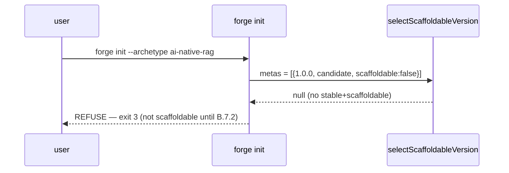

# Design: b7-1-schema

<!-- Status: designed -->
<!-- Schema: default -->
<!-- Audit: B.7.1 (docs/new-archetypes-plan.md §6.2 — ai-native-rag/1.0.0 archetype scaffold schema) -->

Resolves `open-questions.md` Q-001..Q-004 into ADRs. No library is pinned here
(FR-B7-1-032; `rmcp`/pgvector-crate verify-then-pin deferred to B.7.2/B.7.3), so
no Context7 lookup is required for this change — the grounding was done in the
ratified exploration. This is a **propose+specify+design** artifact; the schema
file + harness are authored at the implementation phase (after `/forge:plan`).

## Architecture Decisions

### ADR-B7-1-001 — AI-First phases are INLINED, not inherited via `extends`
**Context**: §6.2 says the schema "extends `ai-first`". But `ai-first/schema.yaml`
is a *workflow* schema; the file lives at the *archetype scaffold* path. **No
scaffold-schema loader resolves `extends`**: `parseSchemaMeta`
(schema-version.ts:30) reads only `version`/`stage`/`scaffoldable`;
`check_versioned_schema_siblings` (validate-foundations.sh:455-457) reads `phases`
**from the file itself**; `grep -rn extends cli/src .forge/scripts` returns only
Dart-widget matches. An `extends: ai-first` would leave `phases` empty → validator
KO `phases missing or empty`.
**Decision**: materialise the `ai-first` phase list **inline** into `1.0.0.yaml`,
extended with the two B.7.1 phases. Retain `extends: ai-first` as a **documentary
provenance key only** (commented as non-load-bearing). Option (b) — building an
`extends` resolver for scaffold schemas — is **rejected for B.7.1** (cross-cutting
CLI + bash-validator change, far beyond an effort-S brick; candidate for a future
G.* tooling brick).
**Consequences**: self-contained, validates on landing, zero loader change. Cost =
phase duplication vs `ai-first/schema.yaml` (drift risk) → mitigated by
`b7-1.test.sh` asserting the AI-First phase set is present (NFR-B7-1-004).
**Constitution Compliance**: Article IV (additive, no loader edit) + III.4 (the
§6.2 conflation is recorded, not normalised) confirmed.

### ADR-B7-1-002 — `candidate` + `scaffoldable: false`; promotion deferred to the B.7 scaffolder-flip
**Context**: B.7.1 ships no templates; the archetype must not be scaffoldable yet.
b8-3b enforces `candidate ⇒ scaffoldable: false`. `selectScaffoldableVersion`
returns null when no version is stable+scaffoldable → `forge init` refuses (exit 3).
**Decision**: `stage: candidate`, `scaffoldable: false`. Promotion to `stable` +
`scaffoldable: true` happens in the **B.7 scaffolder-completion brick**, gated on a
green `b7-6` harness proving a real scaffold (the B.8.14-C2 pattern). Tentative
owner: the brick that ships `scaffold-plan-ai-native-rag.yaml` + the example +
harness; its exact id is fixed when the B.7 chain is sequenced (recorded, not
guessed).
**Consequences**: `forge init --archetype ai-native-rag` refuses cleanly until the
archetype actually produces a working tree; no broken scaffold can ship.
**Constitution Compliance**: Article V (no premature advertise of an unproven
archetype) confirmed.

### ADR-B7-1-003 — components reference-only; LLM-gateway/MCP/RAG standards deferred to B.7.3
**Context**: pgvector/Temporal/Zitadel/Connect/Qwik/observability standards exist;
`llm-gateway`/`mcp-servers`/`rag-patterns` do not (they are B.7.3). Mirrors the
B.8.3 Envoy-pin gap.
**Decision**: declare the component SET by name; reference the **existing**
standards by filename; mark the **three missing** ones `delivered_by: B.7.3` with
no inline pin and no fabricated filename presented as existing. No verify-then-pin
candidate (`rmcp`, pgvector crate) is committed in the schema.
**Consequences**: single source of truth for pins stays in the standards; no drift;
no fabrication.
**Constitution Compliance**: Article III.4 (no fabrication) + Article IV confirmed.

### ADR-B7-1-004 — layers = backend/frontend/infra; Qwik streaming under `frontend.surfaces`
**Context**: the validator requires the backend/frontend/infra triple. The Qwik
streaming UI is a public-web surface, not a Flutter app.
**Decision**: model the triple with the Qwik streaming UI as a `frontend.surfaces`
entry (mirroring `full-stack-monorepo/2.0.0.yaml` `frontend.surfaces.web-public`),
**not** a new top-level layer. `primary_agent`: backend → **Vulcan**, infra →
**Atlas**, frontend → **Hera** (consistent with the flagship 2.0.0, whose
Qwik web-public surface sits under the Hera-owned frontend layer). A dedicated
web/Qwik agent is out of scope (none exists in the roster; revisit if K.4 Iris-Web
later owns web surfaces).
**Consequences**: keeps the required-triple invariant intact; reuses the proven
flagship surface shape; Janus arbitrates cross-surface changes via `cross_layer`.
**Constitution Compliance**: Article IV + FR-B7-1-010/012 shape confirmed.

## Component Design

The deliverable is one declarative file. Its relationships:

```mermaid
graph TD
  ENUM["archetype.schema.json enum<br/>(already lists ai-native-rag)"]
  SCHEMA["ai-native-rag/1.0.0.yaml<br/>(THIS — candidate, scaffoldable:false)"]
  VAL["validate-foundations.sh<br/>check_versioned_schema_siblings (b8-3b)"]
  CLI["schema-version.ts<br/>selectScaffoldableVersion"]
  STD_EXIST["persistence / orchestration / identity /<br/>transport / web-frontend / observability .yaml"]
  STD_DEFER["llm-gateway / mcp-servers / rag-patterns<br/>(NOT YET — B.7.3)"]
  HARNESS["b7-1.test.sh (impl)"]

  SCHEMA -->|name==dir, version==file, layers⊇{be,fe,infra},<br/>candidate⇒scaffoldable:false, phases| VAL
  SCHEMA -->|candidate/false ⇒ null ⇒ exit 3| CLI
  SCHEMA -->|reference-only, no inline pin| STD_EXIST
  SCHEMA -.->|delivered_by: B.7.3, gap recorded| STD_DEFER
  SCHEMA -->|AI-First phase set asserted| HARNESS
  ENUM -.->|taxonomy, untouched| SCHEMA
```

Target file skeleton (design blueprint — built at impl, values final at impl):

```yaml
# Forge Schema — ai-native-rag 1.0.0 (CANDIDATE)
# <!-- Audit: B.7.1 (b7-1-schema) — AI-native RAG archetype scaffold schema -->
# Stage: candidate, scaffoldable:false — no templates yet (B.7.2). Promotes to
# stable+scaffoldable in the B.7 scaffolder-completion brick, gated on b7-6
# harness (ADR-B7-1-002, B.8.14-C2 pattern). Additive: no existing archetype
# affected. `extends: ai-first` below is DOCUMENTARY PROVENANCE ONLY — no loader
# resolves it; the AI-First phases are materialised inline (ADR-B7-1-001).
name: ai-native-rag
version: "1.0.0"
stage: candidate
scaffoldable: false
extends: ai-first            # documentary provenance only (non-load-bearing)
description: >
  AI-first RAG archetype: Rust backend (RAG pipeline + in-repo LLM gateway proxy +
  MCP servers) + Qwik streaming UI + Postgres/pgvector + Temporal + Zitadel +
  SigNoz/OBI/Coroot. TDD+BDD enforced; mandatory AI fallback (XI.5); PII-guarded
  (XI.6); prompt-audit + token budget traced (IX.6). Not scaffoldable until B.7.2.
tdd_enforced: true
bdd_required_for_user_facing: true
coverage_threshold: 80
ai_fallback_required: true   # Article XI.5

components:                  # reference-only (ADR-B7-1-003) — NO inline pins
  - {name: pgvector,        role: persistence,    standard: persistence.yaml}
  - {name: temporal,        role: orchestration,  standard: orchestration.yaml}  # §VIII.2 (rust default)
  - {name: zitadel,         role: identity,       standard: identity.yaml}
  - {name: connect-rpc,     role: transport,      standard: transport.yaml}
  - {name: qwik-streaming,  role: web-public,     standard: web-frontend.yaml}
  - {name: observability,   role: observability,  standard: observability.yaml}
  - {name: llm-gateway,     role: ai-inference,   delivered_by: B.7.3}  # in-repo proxy; standard NOT YET
  - {name: mcp-servers,     role: tooling,        delivered_by: B.7.3}  # rmcp; standard NOT YET
  - {name: rag-pipeline,    role: retrieval,      delivered_by: B.7.3}  # rag-patterns; standard NOT YET

layers:                      # required triple (ADR-B7-1-004)
  - id: backend
    path: backend/
    fr_id_prefix: FR-BE-
    primary_agent: Vulcan
    standards_scope: [rust, all]
  - id: frontend
    path: frontend/
    fr_id_prefix: FR-FE-
    primary_agent: Hera
    standards_scope: [flutter, all]
    surfaces:
      - {id: web-public, path: web-public/, stack: qwik, note: "Qwik streaming UI (SSE/WebTransport) — B.7.10"}
  - id: infra
    path: infra/
    fr_id_prefix: FR-IN-
    primary_agent: Atlas
    standards_scope: [infra, all]

fr_id_prefix_cross_layer: FR-GL-
cross_layer:
  agent: Janus
  triggers: [{layers_count_ge: 2}]

phases:                      # INLINED (ADR-B7-1-001) — ai-first materialised + 2 B.7.1 additions
  - {id: ai_brainstorm, agent: Oracle, artifact: [ai-capability-map.md, agent-architecture.md, risk-matrix.md], gate: fallback_strategy_defined, next: proposal}
  - {id: proposal, artifact: proposal.md, gate: constitution_compliance, next: specs}
  - {id: specs, artifact: specs.md, agent: Clio, gate: anti_hallucination_check, next: embeddings-pipeline}
  - {id: embeddings-pipeline, artifact: embeddings-pipeline.md, gate: pipeline_specified, next: features}   # B.7.1 addition (§6.2)
  - {id: features, artifact: "features/*.feature", includes: [happy_path_with_ai, fallback_scenarios, error_scenarios], next: design}
  - {id: design, artifact: design.md, agent: [Athena, Prometheus], gate: constitution_compliance, next: prompt-audit}
  - {id: prompt-audit, artifact: prompt-audit.md, gate: prompt_audit_logging_defined, next: tasks}           # B.7.1 addition (§6.2), wires IX.6
  - {id: tasks, artifact: tasks.md, gate: per_task_constitution_check, next: implementation}
  - {id: implementation, protocol: tdd_cycle, agent: [Hera, Vulcan, Prometheus], next: review}
  - {id: review, agent: [Nemesis, Tribune, Aegis, Prometheus], checks: [coverage, fallback_verified, pii_audit, token_budget], next: archive}
  - {id: archive}

ai_specifics:                # carried from ai-first (XI.5/XI.6, IX.6)
  fallback_mandatory: true
  pii_handling: explicit_consent_required
  token_budget_documented: true
  non_determinism_testing: {strategy: snapshot + property_based, acceptable_variance: defined_per_feature}
```

## Data Flow

`forge init --archetype ai-native-rag` while only a candidate schema exists:



## Testing Strategy

TDD order (Article I — RED before GREEN), at the implementation phase:
1. **RED**: author `.forge/scripts/tests/b7-1.test.sh` asserting the schema's
   AI-specific content (inlined phases incl. `ai_brainstorm`/`embeddings-pipeline`/
   `prompt-audit`; `ai_specifics`; reference-only components; the three
   `delivered_by: B.7.3` gaps). Run → **fails** (no schema file yet). Verify RED.
2. **GREEN**: author `.forge/schemas/ai-native-rag/1.0.0.yaml` per the skeleton.
   Run `b7-1.test.sh` → PASS; run `validate-foundations.sh` →
   `FR-GL-001-versioned:ai-native-rag/1.0.0.yaml` PASS. Verify GREEN.
3. **REFACTOR**: tidy comments/anchors; re-run; confirm `verify.sh` +
   `constitution-linter.sh` no regression; `forge init --archetype ai-native-rag`
   → exit 3.
- **Unit-level**: grep/structural assertions in `b7-1.test.sh` (L1, hermetic).
- **Integration**: `validate-foundations.sh` versioned-sibling PASS (L1);
  optional L2 `forge init` refusal exit-3 fixture.
- **BDD**: not applicable — this change ships a config schema, not a user-facing
  feature. (BDD for AI features arrives with B.7.2+ via the schema's own
  `features` phase.)
- Register `b7-1.test.sh` in `.github/workflows/forge-ci.yml`.

## Standards Applied

- **`global/open-questions.md`**: Q-001..Q-004 mechanised, resolved here.
- **`global/source-document-pinning.md`** / Article III.4: §6.2 conflation +
  missing standards recorded, not normalised; no library pin in this change.
- **Component standards** (referenced, not edited): `persistence.yaml`,
  `orchestration.yaml` (v1.2.0, rust→temporal), `identity.yaml`, `transport.yaml`,
  `web-frontend.yaml` (B.8.9), `observability.yaml` (v2.1.0).
- **Articles I/II/X**: TDD + (n/a BDD) + 80% coverage flags carried in the schema.
- **Article XI.5/XI.6 + IX.6**: materialised by `ai_specifics` + the `prompt-audit`
  phase + review checks (fallback_verified, pii_audit, token_budget).

## Constitutional Compliance Gate

- Article I (TDD): impl is test-first (`b7-1.test.sh` RED→GREEN). ✓ no violation.
- Article VI (Flutter) / VII (Rust): no Flutter/Rust code in this change. ✓ N/A.
- Article VIII (Infra): Envoy (§VIII.1) + Temporal (§VIII.2) referenced as-is, no
  amendment. ✓
- Article IV (delta): additive — no existing schema/standard/CLI edited. ✓
- Article XI (AI-First): schema materialises XI.5/XI.6 + IX.6 into the archetype
  process. ✓
- Article III.4: no fabrication; deferred standards + verify-then-pin candidates
  explicitly not committed. ✓
**Gate result: PASS — no article violated.**
