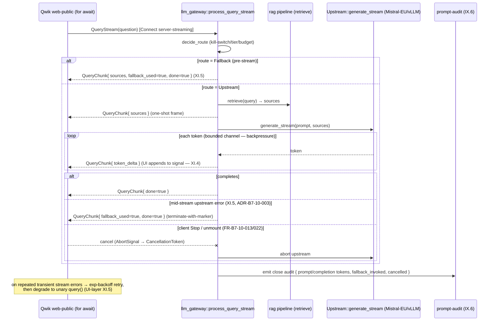

# Design: b7-10-streaming

<!-- Designed: 2026-06-22 -->
<!-- Routing: Ferris (Rust streaming pipeline, lead) + Hera/Apollo (Qwik streaming UI) + Eris (test strategy) -->
<!-- Context7 consulted 2026-06-22: connect-es (/connectrpc/connect-es) — server-streaming for-await client -->

**Constitution** : v2.0.0 — no bump (additive). Gate at end: no Article violation.

## Context7 grounding (API shapes — frontend pins owned by transport.yaml/web-frontend.yaml; backend new-crate pins verify-then-pin LIVE at impl, NFR-B7-10-005)

- **Connect-ES v2** (`/connectrpc/connect-es`, confirmed 2026-06-22): a
  server-streaming method is consumed in the browser with
  `for await (const res of client.method(req)) { … }` over a transport from
  `@connectrpc/connect-web` (`createConnectTransport` / `createGrpcWebTransport`).
  The client factory is `createClient(Service, transport)` (same as the b7-2 unary
  client). The Connect protocol's HTTP framing is the SSE-class wire. **Connect-ES
  does not transport over WebTransport** — it is fetch/HTTP-based (→ ADR-B7-10-005).
  Pins (`@connectrpc/connect` / `@connectrpc/connect-web` `^2.0.0`) are owned by
  `transport.yaml`; NOT re-pinned here.
- **Qwik** (`@builder.io/qwik` `^1.20.0`, `web-frontend.yaml`): progressive render
  via a `useSignal` mutated inside a `for await` loop; `useVisibleTask$` /
  component cleanup for cancel-on-unmount. Pins owned by `web-frontend.yaml`.
- **Backend `Stream`**: `tokio` async + `futures::Stream` / `tokio_stream`. The
  b7-2 `backend/Cargo.toml.tmpl` ledger already carries `tokio` + `async-openai`
  (which exposes a streaming chat-completions API). Whether a *new* crate
  (`tokio-stream` / `async-stream`) is required is a **verify-then-pin LIVE** item
  at IMPLEMENT (Q-3 / ADR-B7-10-004) — NOT pinned at planning.

---

## Architecture Decisions

### ADR-B7-10-001 — Add server-streaming `QueryStream`; keep unary `Query` (ratified)
**Context**: b7-2 shipped unary `Query` and explicitly deferred streaming here. The
unary path is also the UI-layer XI.5 degradation target.
**Decision**: add `rpc QueryStream(QueryRequest) returns (stream QueryChunk)`
alongside the retained unary `Query`. `QueryChunk` reuses the b7-2 `SourceChunk`
type and carries `token_delta` / one-shot `sources` / `done` / `fallback_used`.
**Consequences**: additive + backward-compatible (no `buf breaking`); one revertable
proto delta; both RPCs coexist.
**Compliance**: Article III (spec-first), XI.5 (unary = fallback target).

### ADR-B7-10-002 — Default streaming transport = Connect server-streaming (SSE-class) (ratified)
**Context**: the audit item names "SSE, WebTransport". Connect-ES v2 supports
server-streaming over `@connectrpc/connect-web` and reuses the existing transport +
Envoy ingress (no second gateway, §VIII.1). WebTransport is not a Connect-ES
transport.
**Decision**: the default streaming path is Connect server-streaming consumed with
`for await`. It rides the same `createConnectTransport` the b7-2 unary client uses.
**Consequences**: zero new ingress/transport decision; consistent with
`transport.yaml`; WebTransport handled separately (ADR-B7-10-005).

### ADR-B7-10-003 — Mid-stream failure = terminate-with-fallback-marker (proposed; Q-2)
**Context**: if the upstream errors *after* partial tokens, the partial answer is
already on screen. Article XI.5 mandates a defined, tested fallback.
**Decision**: pre-stream failure degrades exactly as the unary path (full non-AI
fallback, `fallback_used=true`, `done=true`). Mid-stream failure terminates the
stream with a final `fallback_used=true`, `done=true` chunk (a degradation marker;
partial tokens already delivered are kept) and a fallback-marked close audit. Both
branches are unit-tested with a failing / mid-stream-failing upstream.
**Consequences**: simple, observable, testable; UI shows partial answer + a
degradation notice. Maintainer to confirm vs restart-as-fallback (Q-2).
**Compliance**: XI.5 (tested fallback, both timings), IX.6 (audit fidelity).

### ADR-B7-10-004 — Streaming pins only in Cargo.toml.tmpl; frontend pins stay owned upstream (ratified)
**Context**: b7-2 ADR-B7-2-003 + the b7-3 T-007 no-inline-pin guard.
**Decision**: any *new* backend streaming crate is verify-then-pinned LIVE
(`cargo add`) at IMPLEMENT and pinned only in `backend/Cargo.toml.tmpl`; the
frontend uses the Connect-ES/Qwik/Vite pins already owned by
`transport.yaml`/`web-frontend.yaml`; no `global/*.md` standard gains a pin.
**Consequences**: pin discipline preserved (NFR-B7-10-005); b7-3 T-007 stays GREEN.

### ADR-B7-10-005 — WebTransport = documented forward alternative, not default-wired (proposed; Q-1)
**Context**: Q-1 — Connect-ES is fetch/HTTP, not WebTransport. A native
WebTransport channel would be a parallel, non-Connect transport.
**Decision**: document WebTransport in `frontend/web-public/README.md.tmpl` as the
forward alternative (when/why; that it is NOT a Connect-ES drop-in) plus a clearly
marked, **non-default** scaffold note. Do NOT wire a native-WebTransport client in
this brick. A fuller native stub, if wanted, is a separate change.
**Consequences**: keeps the brick's surface honest and small; the audit item's
"WebTransport" is addressed as a documented path, not a half-built channel.
`[NEEDS CLARIFICATION]` logged for maintainer to confirm depth.

### ADR-B7-10-006 — Promotion deferred to b7-6; validate via direct render fixture (ratified)
**Context**: `candidate ⇒ scaffoldable:false` (b8-3b) + ADR-B7-1-002 gate the stage
flip on a green `b7-6`. `buf generate` + Connect handler registration + `cargo
fetch` are already `b7-6` TODOs (b7-2).
**Decision**: keep the schema `candidate`; the CLI keeps refusing (exit 3). The
streaming surface is validated by `b7-10.test.sh` rendering the templates directly
via `overlay.sh` (b7-2 harness convention), NOT through the CLI scaffoldable gate.
The one expected un-generated `rag_pb` import error is inherited from b7-2.
**Consequences**: end-to-end streaming stays inert until `b7-6`; the surface is
nonetheless fully reviewable/testable now.

## Component Design

```mermaid
graph TD
  subgraph proto [shared/protos/v1/rag/rag.proto]
    Q[rpc Query → QueryResponse  (unary, b7-2, retained)]
    QS[rpc QueryStream → stream QueryChunk  (server-streaming, NEW)]
    QC[QueryChunk: token_delta · sources? · done · fallback_used]
    QS --> QC
  end
  subgraph backend [backend/ — Rust axum (Vulcan/Ferris)]
    PSU[llm_gateway::process_query  (unary, retained)]
    PSS[llm_gateway::process_query_stream  (NEW)<br/>bounded channel · backpressure · cancel<br/>pre-stream + mid-stream fallback XI.5<br/>close-time prompt-audit IX.6/XI.6]
    UP[Upstream::generate  (unary, retained)]
    UPS[Upstream::generate_stream  (NEW trait method)<br/>Stream&lt;Result&lt;token,_&gt;&gt;]
    PSS --> UPS
  end
  subgraph frontend [frontend/web-public/ — Qwik (Hera/Apollo)]
    CC[connect-client.ts: query() retained + queryStream() NEW (for await)]
    RT[routes/index.tsx: progressive render signal · Stop/cancel · cancel-on-unmount · exp-retry → unary degrade]
    WT[README: WebTransport = documented forward alternative, NOT default]
    CC --> RT
  end
  RT -->|Connect server-streaming| PSS
  RT -. retries exhausted .-> PSU
  PSS -. pre-stream/mid-stream .-> FB[non-AI fallback: ranked sources]
```

## Data Flow — streaming RAG query (happy path + fallback + cancel)



## Testing Strategy (Eris)

- **Unit (Rust)**: streaming fallback branch with a `FailingUpstream` (pre-stream:
  full fallback chunk) AND a `MidStreamFailingUpstream` (emit N tokens then error →
  terminate-with-marker, ADR-B7-10-003); kill-switch/tier/budget route → streamed
  fallback before any upstream call; bounded-channel backpressure (producer blocks
  on a full bounded channel); cancellation aborts upstream + emits close audit;
  close-audit token counts + fallback flag (IX.6). TDD RED→GREEN per module
  (Article I); modules ship `#[cfg(test)]` scaffolding (NFR-B7-10-003). Mirrors the
  b7-2 `handler.rs` `upstream_down_degrades_to_non_ai_fallback` style.
- **L1 harness `b7-10.test.sh`** (hermetic, grep/structure): proto has
  `QueryStream`/`stream QueryChunk` + unary `Query` retained (FR-B7-10-001/002);
  backend markers (`process_query_stream`, bounded-channel constant, cancel token,
  mid-stream fallback, close audit); Qwik markers (`queryStream`, `for await`,
  `AbortController`/cancel, cleanup/unmount, exponential retry, unary degrade);
  WebTransport documented-not-default (FR-B7-10-030); b7-2 unary baseline still
  present (NFR-B7-10-002); no inline pin in the new templates (NFR-B7-10-005).
- **L2 harness** (toolchain-gated, skip when absent): `overlay.sh` render →
  no `.tmpl`/no `{{placeholder}}` + byte-stable double render (NFR-B7-10-004);
  `buf lint` + `buf breaking` clean on the rendered proto vs baseline (FR-B7-10-003,
  if `buf` present); Qwik `tsc --noEmit` clean bar the inherited un-generated
  `rag_pb` import (b7-2 parity); `cargo check` on the rendered backend (if `cargo`).
- **BDD**: the 5 `specs.md` scenarios → `features/*.feature` (Article II) —
  streaming-RPC-present, progressive-render+cancel, pre-stream-fallback,
  unary-degradation, CLI-refuses.
- The comprehensive ≥35-test promotion suite + live `buf generate`/`cargo fetch`
  end-to-end streaming stay in `b7-6`.

## Standards Applied

- `global/rag-patterns.md` → streaming preserves the hybrid-retrieval pipeline
  (sources retrieved once, streamed as a one-shot frame before tokens).
- `global/llm-gateway.md` → streaming gateway keeps the proxy guards (kill-switch /
  tier-refusal / budget), prompt-audit (IX.6), PII redaction (XI.6), and the
  mandatory non-AI fallback (XI.5) — now over a streamed channel.
- `global/mcp-servers.md` → cross-reference only: rmcp `StreamableHttpService` SSE
  is already scaffolded by b7-2 (`mcp/transport/http.rs`); NOT re-touched here.
- `web-frontend.yaml` (Qwik) + `transport.yaml` (Connect-ES ^2.0.0) → frontend
  streaming surface; pins reused by reference (NOT re-pinned, NFR-B7-10-005).
- `observability.yaml` (OTel) → close-time streaming spans reuse the b7-2 app SDK.

## Constitutional Compliance Gate

- Article I (TDD): streaming modules ship test scaffolding; harness drives RED→GREEN. ✅
- Article II (BDD): 5 scenarios authored. ✅
- Article III (Specs/anti-hal): Connect-ES streaming Context7-grounded; WebTransport
  non-applicability stated, depth deferred `[NEEDS CLARIFICATION]`; no new pin
  fabricated. ✅
- Article VII (Rust): `tokio` async + `Stream`; typed stream errors; no `unwrap`
  in production paths. ✅
- Article VIII (§VIII.1): Connect server-streaming rides the existing Envoy ingress;
  no second gateway. ✅
- Article IX.6 (prompt audit at stream close) + XI.4 (event-driven UI, no blocking
  AI call) + XI.5 (pre-stream + mid-stream + UI-layer fallback, all tested). ✅
- **No violation → gate PASS.**

---

**Gate**: Design complete. Review `design.md`. Next: `/forge:plan b7-10-streaming`.
