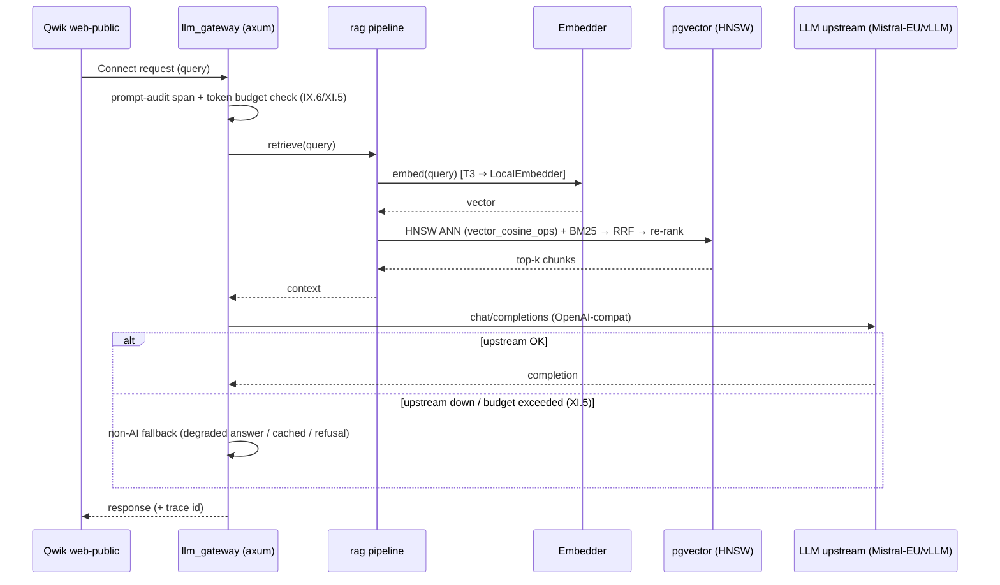

# Design: b7-2-scaffolder

<!-- Designed: 2026-06-21 -->
<!-- Routing: Ferris (Rust architect, lead) + Atlas (infra) + Eris (test strategy) -->
<!-- Context7 consulted 2026-06-21: rmcp (/websites/rs_rmcp_rmcp), fastembed (/anush008/fastembed-rs) -->

**Constitution** : v2.0.0 — no bump (additive). Gate at end: no Article violation.

## Context7 grounding (API shapes — pins are verify-then-pin LIVE at impl, FR-B7-2-040)

- **rmcp** (official Rust MCP SDK, `/websites/rs_rmcp_rmcp`): `#[tool_router(server_handler)]`
  + `#[tool(name, description)]` macros; pluggable `Transport` trait with built-in
  **stdio server** and **`StreamableHttpService`** (HTTP) pairs; Cargo features
  `server` / `macros` / `schemars` / **`auth`** (OAuth 2.0) / `elicitation`. Resolves
  the 0.16.0/0.5.0/1.7.0 drift (ADR-B7-3-003) → `cargo add rmcp` LIVE at impl.
- **fastembed** (`/anush008/fastembed-rs`, crate `fastembed = "5"`): in-process ONNX
  embeddings — `TextEmbedding::try_new(InitOptions::new(EmbeddingModel::…))` →
  `.embed(docs, None)` (e.g. AllMiniLML6V2 → dim 384). Backs `LocalEmbedder`.
- **async-openai** (OpenAI-compatible client) backs `MistralEmbedder` + the gateway
  proxy upstream — `with_api_base(...)` → Mistral-Scaleway/vLLM. Verify-then-pin LIVE.
- **pgvector** (Rust crate, `sqlx` feature) — HNSW `vector_cosine_ops`. Reuses the
  `pgvector:0.8.2-pg17` extension already shipped by B.8.5. Verify-then-pin LIVE.

---

## Architecture Decisions

### ADR-B7-2-001 — Promotion deferred to b7-6 (ratified)
**Context**: `candidate ⇒ scaffoldable:false` is a hard invariant (b8-3b
`check_versioned_schema_siblings`); ADR-B7-1-002 gates the stage flip on a green
`b7-6` harness.
**Decision**: this brick keeps the schema `candidate`/`scaffoldable:false`. Templates +
plan + wrapper body land and are validated by a fixture invoking
`.forge/scripts/scaffolder/init.sh --plan` directly. The CLI keeps refusing
(exit 3). The stage flip + `cli/assets` scaffoldable promotion ride `b7-6`.
**Consequences**: `forge init --archetype ai-native-rag` is still inert end-to-end
after this brick; the backbone is nonetheless fully reviewable/testable.
**Compliance**: Article III (spec-first), no schema edit (NFR-B7-2-001).

### ADR-B7-2-002 — Single change, full backbone (ratified)
**Context**: brick is XL; maintainer decision B forbids monoliths but treats
`b7-2-scaffolder` as one of the 9 atomic bricks.
**Decision**: ship backend+frontend+infra in one change; if review judges it too
large, carve `b7-2c` (frontend+infra) as a follow-up (recorded, not pre-committed).
**Consequences**: one revertable unit; large diff mitigated by per-layer commits.

### ADR-B7-2-003 — Pins only in rendered Cargo.toml.tmpl (ratified)
**Context**: B.7.3 standards are deliberately pin-free (`b7-3.test.sh` T-007 guard).
**Decision**: every version pin lives in `backend/.../Cargo.toml.tmpl`; no standard
gains a version. **Consequences**: standards stay stable; pins travel with the
consumer (transport.yaml/b8-6 precedent).

### ADR-B7-2-004 — Embeddings via `Embedder` trait, dual impl (Q-3 resolved)
**Context**: Q-3 — Mistral-EU API vs local; T3 needs zero-egress; Article XI.5
mandates a non-AI/degraded fallback.
**Decision**: scaffold a `rag::embeddings::Embedder` trait with two impls —
`MistralEmbedder` (async-openai → Mistral-Scaleway, **default**) and `LocalEmbedder`
(fastembed, in-process). Selection by `FORGE_EU_TIER` + env: T1/T2 default Mistral
with `LocalEmbedder` as the XI.5 fallback; **T3 forces `LocalEmbedder`** (zero
egress) — the tier-aware refusal of cloud providers is wired as a hook here and
enforced at runtime by `b7-9-janus-ai` + Demeter (K.3) + I.3.
**Consequences**: satisfies XI.5 natively; two crates to pin; model download for
`LocalEmbedder` documented as a build/first-run step.
**Compliance**: Article XI.5 (fallback), XI.6 (PII — local path keeps text in-process),
compliance-tiers (T3 sovereignty).

### ADR-B7-2-005 — MCP dual transport, feature-gated (Q-4 resolved)
**Context**: Q-4 — stdio (local-dev) vs HTTP/OIDC (prod).
**Decision**: scaffold one rmcp server exposing **both** transports behind Cargo
features: `mcp/transport/stdio.rs` (default, local-dev) and `mcp/transport/http.rs`
(`StreamableHttpService` on the existing axum router, gated `auth` → OAuth 2.1
PKCE/RFC8707 → Zitadel/Envoy-OIDC). Tools defined once via `#[tool_router(server_handler)]`;
at least one stub tool server among `db`/`file`/`search`.
**Consequences**: max conformance to `mcp-servers.md`; feature matrix to test (L2).

### ADR-B7-2-006 — Frontend is web-public (Qwik) only (Q-5 resolved)
**Context**: Q-5 — `1.0.0.yaml` `frontend.standards_scope:[flutter,all]` but the only
surface is Qwik `web-public`.
**Decision**: scaffold **no Flutter mobile app**; the frontend layer hosts the Qwik
`web-public` surface only (RAG is a service + streaming web UI). The `[flutter,all]`
scope is inherited layer-template boilerplate; documented as an accepted known-gap
(no schema edit — NFR-B7-2-001). A future Flutter surface, if ever wanted, is a
separate change. **Consequences**: smaller frontend surface; note added to the
archetype README so adopters aren't surprised.

### ADR-B7-2-007 — Wrapper renders via overlay.sh, not init.sh (amends FR-B7-2-050; maintainer-approved 2026-06-21)
**Context**: Phase 1 ground-truth — `init.sh` is hardcoded to `full-stack-monorepo`
(`ARCHETYPE_DIR=...full-stack-monorepo`, `flutter create`, 5 named `cargo new`,
`buf lint`). It cannot render a second archetype's plan. FR-B7-2-050 as originally
written (forward to `init.sh --plan`, mirror `forge-init-fsm-2.0.0.sh`) is therefore
infeasible for ai-native-rag.
**Decision**: the real wrapper body renders **directly via `overlay.sh`** (the
pure-renderer `init.sh` itself delegates to, and the L2 harness already uses). The
ai-native-rag templates are self-contained (full `Cargo.toml`s — no `cargo new`;
Qwik — no `flutter create`), so overlay alone produces a complete tree. Post-render
codegen (`buf generate`) + `cargo fetch` are documented TODOs deferred to b7-6
(network/buf). `init.sh` stays **untouched**.
**Consequences**: zero flagship-regression risk (shared `init.sh` not modified);
wrapper validated by a direct fixture (CLI still refuses exit 3 at candidate,
FR-B7-2-051). Rejected alternative: parameterising `init.sh` (archetype-aware) —
shared-infra risk to the flagship scaffold path, out of scope for this brick.
**Compliance**: Article III.4 (verify-then-act on real `init.sh` behaviour), III
(spec amended, not silently diverged).

## Component Design

```mermaid
graph TD
  subgraph backend [backend/ — Rust axum (Vulcan/Ferris)]
    GW[llm_gateway/<br/>thin axum proxy<br/>OpenAI-compat + tier-aware hooks<br/>prompt-audit span IX.6 · budget/kill-switch XI.5]
    MCP[mcp/<br/>rmcp tool_router<br/>transport/stdio.rs + transport/http.rs<br/>auth→Zitadel/Envoy OIDC]
    RAG[rag/<br/>chunking · embeddings(Embedder) · hybrid retrieval<br/>vector+BM25+RRF · re-rank · pgvector HNSW<br/>Temporal activity workers]
    EMB[rag::embeddings::Embedder<br/>├ MistralEmbedder default<br/>└ LocalEmbedder fastembed]
    RAG --> EMB
  end
  subgraph frontend [frontend/web-public/ — Qwik (Hera)]
    UI[Qwik shell · Connect-ES v2<br/>non-streaming baseline<br/>SSE/WebTransport → b7-10]
  end
  subgraph infra [infra/ — (Atlas), reused B.8 substrate]
    PG[(Postgres + pgvector 0.8.2 HNSW · B.8.5)]
    TMP[Temporal · B8O]
    ZIT[Zitadel OIDC · B.8.7]
    OBS[SigNoz/OBI/Coroot · B.8.8]
  end
  UI -->|Connect| GW
  GW --> RAG
  MCP -.OIDC.-> ZIT
  RAG --> PG
  RAG --> TMP
  GW -.spans.-> OBS
```

## Data Flow — RAG query (happy path + fallback)



## Testing Strategy (Eris)

- **Unit (Rust)**: `Embedder` trait selection by tier (T3⇒Local); RRF merge;
  re-rank ordering; gateway budget/kill-switch + fallback branch; MCP tool schema.
  TDD RED→GREEN per module (Article I) — modules ship with `#[cfg(test)]` scaffolding,
  not bare stubs (NFR-B7-2-003).
- **L1 harness `b7-2.test.sh`** (hermetic, grep/structure): tree shape (FR-B7-2-001),
  scaffold-plan ↔ tree coverage no-dangling (FR-B7-2-002), rendered tree has no
  `.tmpl`/no `{{placeholder}}` (FR-B7-2-003), standards-conformance greps
  (llm-gateway/mcp/rag markers), no-inline-pin guard stays green (FR-B7-2-041),
  CLI still refuses exit 3 (FR-B7-2-051).
- **L2 harness** (toolchain-gated, skip when absent): `init.sh --plan` render into a
  temp dir → `cargo check` on the rendered workspace (FR-B7-2-010/052), MCP feature
  matrix builds (stdio / http). `cd cli && npm test` green (FR-B7-2-052).
- **BDD**: the 4 `specs.md` scenarios → `features/*.feature` (Article II) — render-clean,
  backend-builds, CLI-refuses, gateway-fallback.
- **Determinism**: render twice, byte-diff identical (NFR-B7-2-004).
- The comprehensive ≥35-test promotion suite + snapshot tarball stay in `b7-6`.

## Standards Applied

- `global/rag-patterns.md` → `rag/` module (chunking/hybrid retrieval/RRF/re-rank/HNSW).
- `global/llm-gateway.md` → `llm_gateway/` (in-repo axum proxy, tier-aware, prompt-audit,
  budgets, PII+fallback).
- `global/mcp-servers.md` → `mcp/` (rmcp, dual transport, least-priv, OAuth→Zitadel).
- `persistence.yaml` (pgvector), `orchestration.yaml` (Temporal), `identity.yaml`
  (Zitadel), `transport.yaml` (Connect), `web-frontend.yaml` (Qwik),
  `observability.yaml` (SigNoz/OBI/Coroot) → reused by reference (memo §3).
- `compliance-tiers.md` + `forbidden-components-rules.md` (I.3) → tier-aware hooks.

## Constitutional Compliance Gate

- Article I (TDD): modules ship test scaffolding; harness drives RED→GREEN. ✅
- Article II (BDD): 4 scenarios authored. ✅
- Article III (Specs/anti-hal): verify-then-pin LIVE; Context7-grounded API; no
  fabricated symbols. ✅
- Article VII (Rust arch): axum + Connect + Temporal layering per flagship 2.0.0. ✅
- Article VIII (§VIII.1/§VIII.2): Envoy + Temporal consumed as-is. ✅
- Article IX.6 (prompt audit) + XI.5 (fallback) + XI.6 (PII): materialised in
  gateway + Embedder. ✅
- **No violation → gate PASS.**

---

**Gate**: Design complete. Review `design.md`. Next: `/forge:plan b7-2-scaffolder`.
