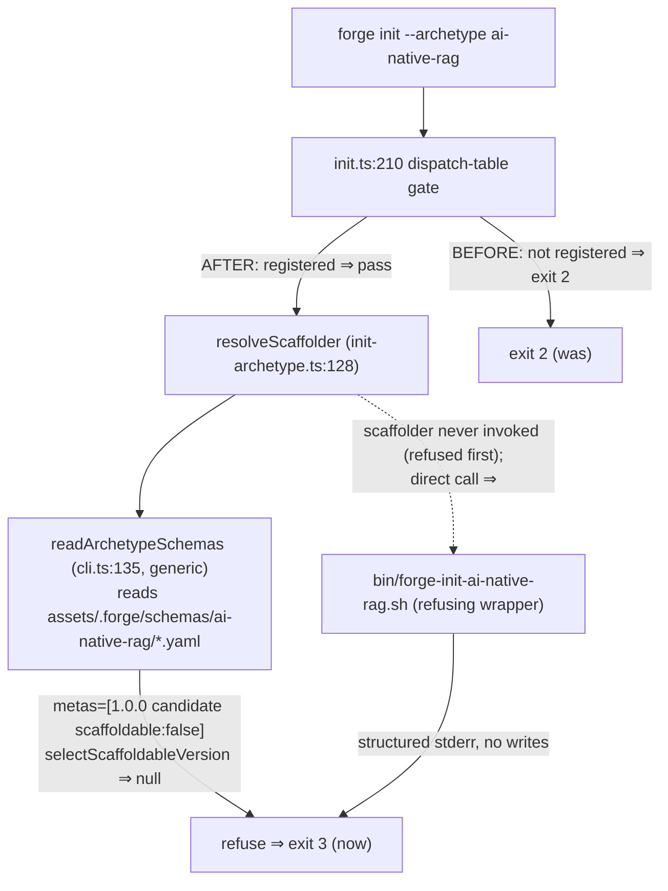

# Design: b7-2a-dispatch-register

<!-- Status: designed -->
<!-- Schema: default -->
<!-- Audit: B.7.2 (docs/new-archetypes-plan.md §6.2 — ai-native-rag dispatch registration slice) -->

Resolves the proposal/specs ADRs + open questions. Additive slice of B.7.2 that
flips the `forge init --archetype ai-native-rag` refusal from exit 2 (unknown
archetype) to exit 3 (registered, no scaffoldable schema version) — Q-005.

## Architecture Decisions

### ADR-B7-2A-001 — refusing wrapper, not a `<pending>` sentinel
**Context**: `b5.test.sh::test_dispatch_scaffolders_exist` requires every entry's
`scaffolder` to be a real file (or `<built-in>`/`<removed>`/`status:
removed_from_roadmap`). The dispatch-table ABI mandates a
`bin/forge-init-<archetype>.sh` wrapper per entry.
**Decision**: ship `bin/forge-init-ai-native-rag.sh` as a **refusing wrapper**
(exit 3, no writes). It satisfies the scaffolder-exists gate with a real file,
follows the documented entry+wrapper ABI, and is the wrapper-side defense-in-depth
layer (mirroring `_refuse_if_forbidden`, J.8). B.7.2-full replaces its body with
the real scaffold logic. The alternative — a `scaffolder: "<pending>"` sentinel +
teaching `b5.test.sh` to skip it — is rejected: it edits an existing test and
diverges from the ABI.
**Consequences**: one new bash file; no b5.test.sh edit. The CLI's own
`resolveScaffolder` refusal fires first, so the wrapper is belt-and-suspenders
today (exercised only on direct invocation or CLI bypass).
**Constitution**: Article IV (additive) + III.4 (the b5 gate re-read, not guessed).

### ADR-B7-2A-002 — refusal exit code = 3
**Context**: two refusal layers (CLI `resolveScaffolder`, wrapper). 
**Decision**: both exit **3** — the B.8.3.b no-scaffoldable-version semantics and
the J.8 policy-refusal convention (ADR-J8-003). Consistent regardless of which
layer fires.
**Consequences**: `forge init --archetype ai-native-rag` and a direct
`bin/forge-init-ai-native-rag.sh` invocation both exit 3.

### ADR-B7-2A-003 — wrapper: structured stderr, exit 3, zero writes
**Decision**: the wrapper prints a `[REFUSAL: ai-native-rag: not-yet-scaffoldable:
...]` line to stderr and exits 3, performing **no** filesystem writes (never a
partial scaffold). The shipped message (`bin/forge-init-ai-native-rag.sh`) is:
`[REFUSAL: ai-native-rag: not-yet-scaffoldable: the ai-native-rag schema is a
candidate (scaffoldable:false) — templates ship in B.7.2 ; alternative: use
--archetype full-stack-monorepo, or 'default' then add RAG components manually]`.
The wrapper ignores all args (no parse loop, so `set -e` has no shift hazard);
the harness greps `\[REFUSAL` only.
**Constitution**: XI fallback semantics N/A (no AI here); III.4 honest "not yet".

### ADR-B7-2A-004 — `since: "0.5.0"` (Q-001 resolved)
**Context**: `docs/VERSIONING.md:31` — "New archetypes are introduced" ⇒ **MINOR**
bump on the 0.y track. b7-1-schema already moved `[Unreleased]` toward the next
minor.
**Decision**: `since: "0.5.0"`. Rejected: 0.4.1 (patch) — a user-visible new
archetype is a minor, not a patch.

### ADR-B7-2A-005 — documentary `status: candidate` (Q-002 resolved)
**Decision**: the entry carries `status: candidate` (parser-tolerated;
human signal that it is registered-but-not-scaffoldable). **No `b5.test.sh`
change** — the wrapper file exists, so the scaffolder-exists gate passes on the
path, independent of status. A b7-2a L1 test asserts the marker.

## Component Design

## Data Flow

After this change, `forge init testproj --archetype ai-native-rag --org com.example.test`:
dispatch gate passes (registered) → `resolveScaffolder` → `readArchetypeSchemas`
returns `[candidate/scaffoldable:false]` → `selectScaffoldableVersion` null →
`{kind:"refuse"}` → **exit 3**. The wrapper is not invoked (refused upstream); a
direct `bin/forge-init-ai-native-rag.sh` call independently exits 3.

## Testing Strategy (TDD — Article I)

1. **RED**: author `b7-2a.test.sh` (entry present/well-formed; wrapper
   exists/executable/refuses exit 3 + no writes; opt-in L2 CLI exit-3). Run →
   fails (no entry, no wrapper). Verify RED.
2. **GREEN**: add the dispatch entry + the wrapper. Run b7-2a.test.sh → PASS.
   Flip b7-1.test.sh L2 to exit 3; confirm `b5.test.sh` GREEN
   (scaffolder-exists), `forge init` live → exit 3.
3. **REFACTOR**: tidy; re-run; verify.sh + constitution-linter.sh no regression.
- **Unit/L1**: hermetic grep + direct-wrapper-invocation asserts (no network).
- **Integration/L2**: opt-in `FORGE_B7_2A_LIVE` + built CLI (bundles the schema +
  dispatch entry into assets) → CLI exit 3; skip-pass otherwise.
- **BDD**: N/A (tooling/config change, not a user-facing feature).
- Register `b7-2a.test.sh` in `forge-ci.yml`.

## Standards Applied

- `global/scaffolding.md` — the wrapper ABI shape.
- FR-IW-002 (b5-1-init-wizard) — dispatch entry schema + scaffolder-exists gate.
- `docs/VERSIONING.md` — `since:` = MINOR (new archetype) ⇒ 0.5.0.
- Article III.4 — refusal precedence, generic readArchetypeSchemas, and the b5
  gate all re-read from live code.

## Constitutional Compliance Gate

- Article I (TDD): harness RED before entry/wrapper. ✓
- Article IV (delta): additive; existing-file edits = dispatch append + b7-1 L2
  flip (verified behaviour) + CI matrix. ✓
- Article III.4: no fabrication; `since:` resolved via VERSIONING, not guessed. ✓
- No Flutter/Rust arch articles engaged; no amendment (XII). ✓
**Gate: PASS.**
