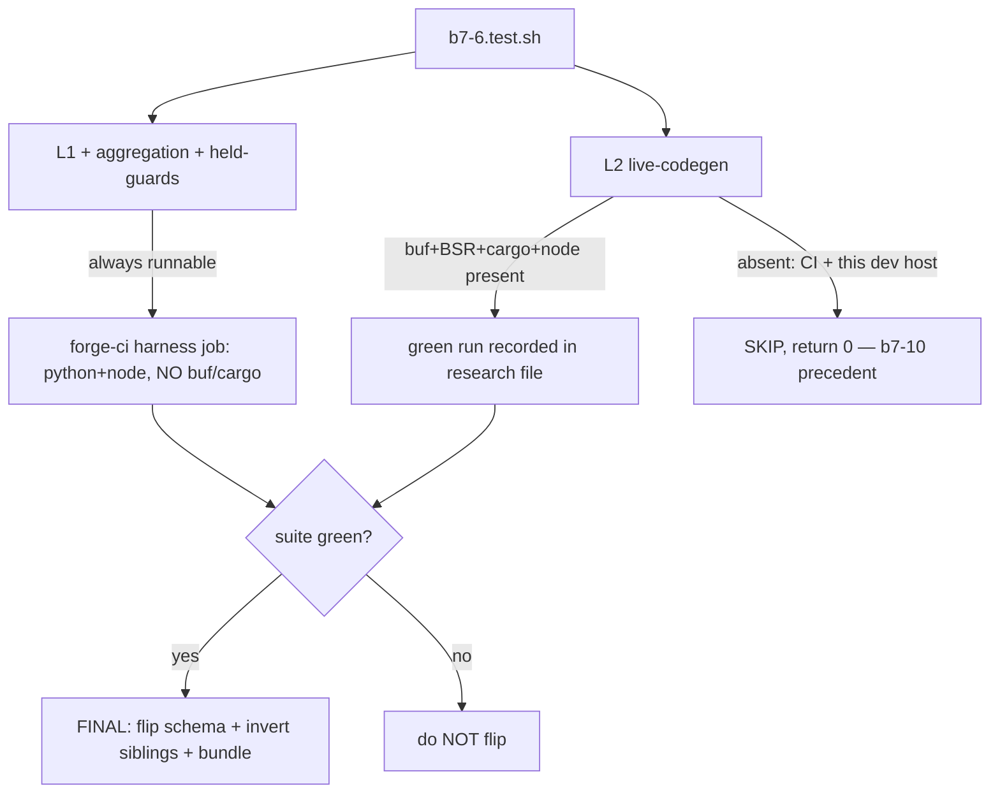

# Design: b7-6-harness

<!-- Designed: 2026-06-23 -->
<!-- Routing: Centurion (Rust TDD/codegen wiring) + Eris (promotion-suite strategy) + Vulcan (workspace build) + Hera (Qwik tsc) ; gate review Tribune -->
<!-- Precedent re-read 2026-06-23: b8-14-promotion-{prep,flip} (the flip), b7-2.test.sh + b7-10.test.sh (the L2 render convention), forge-init-ai-native-rag.sh (the gated body) -->

**Constitution** : v2.0.0 — no bump (this brick amends NO article, NO standard,
NO other archetype). Gate at end: no Article violation.

## Grounding (mechanics re-read 2026-06-23 — every seam cited)

- **The flip is one schema edit + one bundle regen.** The scaffolder body
  (`bin/forge-init-ai-native-rag.sh`) auto-opens on the flip with NO edit to that
  file (lines 17-19, 77-80: "The gate auto-opens when b7-6 promotes the schema …;
  no edit to this wrapper is needed at promotion"). The render path is already
  proven via `FORGE_AINR_FORCE_SCAFFOLD=1` (b7-2 T-L2-003).
- **The deferred live path** is `task proto` (`Taskfile.yml.tmpl:97-100` →
  `cd shared/protos && buf generate`) which drives `buf.gen.yaml.tmpl:18-41`
  (remote BSR plugins: tonic v0.4.0, prost v0.4.0, connect-go v1.20.0, bufbuild/es
  v2.2.0) → Rust stubs into `backend/crates/grpc-api/src/generated` + TS into
  `frontend/web-public/src/lib/generated/connect`. The Connect handler is wired in
  `bin-server/src/main.rs.tmpl` (seam at lines 38-39: "mount additional substrate
  routes (Connect under /connect) at the adopter's wiring step"; line 11-13 names
  `grpc-api`'s `transport_connect` adapter + the `rag.v1.RagService` handler
  "registered there once codegen runs").
- **buf is remote-BSR + absent in CI + absent locally.** `buf.gen.yaml.tmpl:20,27,31,37`
  are `remote: buf.build/...` plugins → `buf generate` needs buf + BSR network.
  `forge-ci.yml` six jobs (harness/gates/cli/lint/example/summary) install
  python+node only, no buf/cargo. `which buf` =
  absent on this dev host. cargo IS present locally; tsc lives in node_modules.
- **Validator** (`validate-foundations.sh:445-454`): stable needs version ≥ 1.0.0
  no-prerelease (1.0.0 ✓); `candidate ⇒ scaffoldable:false` (clause stops applying
  once stable). No `stable ⇒ scaffoldable:true` clause — the CLI gate
  (`is_scaffoldable` needs both) is what stops the refusal.
- **Bundle**: `npm run bundle` = build + `bundle-assets.mjs` (`cli/package.json:28`)
  → mirrors `.forge/` into the gitignored `cli/assets/` (`cli/.gitignore:3`);
  CI runs it fresh (`forge-ci.yml:52-56`).

---

## Architecture Decisions

### ADR-B7-6-001 — Single change, not a prep/flip split (ratified)
**Context**: B.8.14 split into `b8-14-promotion-prep` + `b8-14-promotion-flip`
*because* §VIII.1 Kong→Envoy was a Constitution amendment requiring a ≥7-day
Article XII / GOVERNANCE public window (`b8-14-promotion-prep/proposal.md:9-33`;
"a single-session ratify+apply would violate the very process the constitution
requires", `design.md:11-15`). **This promotion amends nothing in the
constitution** — it edits `ai-native-rag/1.0.0.yaml` (stage/scaffoldable) and
regenerates a gitignored bundle. No window, no amendment, no forcing function for
a split.
**Decision**: ONE change. The flip is the suite-gated FINAL task (ADR-B7-6-006),
preserving the b8-14 "suite-gates-the-flip" ordering without the two-brick
overhead.
**Consequences**: simpler; the only safety the split bought (preventing an
out-of-process amendment) is irrelevant here. `[NEEDS CLARIFICATION]` Q-A for
maintainer confirm.
**Compliance**: Article XII not engaged (no amendment); III (spec-first).

### ADR-B7-6-002 — Suite = aggregate the 8 siblings + net-new e2e (ratified)
**Context**: the 8 landed B.7 harnesses already total **102 `run_test`s**
(b7-1 18, b7-2 10, b7-2a 3, b7-3 7, b7-5 19, b7-9 15, b7-10 11, b7-pythia 19 —
live-counted 2026-06-23). Each proves one brick in isolation; none proves the
*assembled* archetype builds end-to-end.
**Decision**: `b7-6.test.sh` has three tiers: (1) **aggregation** — re-run each
sibling at its CI level, assert exit 0 (superset gate; absent sibling = clean
SKIP); (2) **net-new L1 e2e** — the cross-brick coherence the siblings don't
check (unary+streaming proto coexistence, codegen-manifest targets, Connect-handler
seam, scaffold-plan↔tree full coverage, snapshot artifact); (3) **L2 live-codegen**
(ADR-B7-6-005). Net-new ≈ 15-20 tests → total ≫ 35.
**Consequences**: the ≥35 figure is justified, not invented; the suite genuinely
gates the whole archetype.
**Compliance**: III.4 (test count grounded in the live `run_test` census).

### ADR-B7-6-003 — Bundle regen = `npm run bundle` (gitignored, CI-fresh) (ratified)
**Context**: `cli/assets/` is gitignored (`cli/.gitignore:3`); the CLI reads
schemas from that mirror; `npm run bundle` rebuilds it (`cli/package.json:28`);
CI runs it every run (`forge-ci.yml:52-56`).
**Decision**: the source-of-truth promotion edit is the schema flip (FR-B7-6-020);
the bundle is regenerated (not committed) so the local CLI stops refusing; CI
re-mirrors automatically. Mirrors b8-14-flip FR-FLIP-025.
**Consequences**: no large binary diff; the flip propagates deterministically.
**Compliance**: III (no committed build artifact masquerading as source).

### ADR-B7-6-004 — Snapshot tarball: deterministic, necessity deferred (proposed; Q-D)
**Context**: `forge upgrade` recovers BASE from a committed per-archetype snapshot
tarball (roadmap line 100; flagship 1.0.0 = 422 KB gzipped). A scaffoldable
archetype conventionally ships one; it is NOT required by the validator or the CLI
gate.
**Decision**: propose a `SOURCE_DATE_EPOCH`-deterministic `.tgz` of the rendered
tree (the `forge-sbom.sh`/compliance-bundle determinism pattern), with its
generation+determinism asserted at L2. Defer the *necessity now* to the maintainer
(Q-D): if "not now", drop FR-B7-6-010 and record that upgrade-from-ai-native-rag
isn't supported until the snapshot ships.
**Consequences**: keeps the brick honest about an optional artifact.
**Compliance**: III.4 (don't fabricate a tarball requirement).

### ADR-B7-6-005 — Live legs SKIP in CI; flip justified by a recorded green run (proposed; Q-B — THE decision)
**Context**: `buf generate` needs buf + BSR network (remote plugins,
`buf.gen.yaml.tmpl:20-41`); buf is absent in CI (no buf/cargo in any of
`forge-ci.yml`'s six jobs, lines 33,150,170,193,214,261) AND on
this dev host; cargo is absent in CI. The live codegen/build path has never run.
**Decision (proposed, option a)**: the L2 live-codegen legs SKIP in the buf-less
CI matrix job (the b7-10 `T-L2-003`/`T-L2-004` "rides b7-6" SKIP precedent), and
the flip is justified by a **recorded green run on a host where buf + BSR + cargo +
node are present** (locally: cargo ✓ + node ✓, but buf must be installed + BSR
reachable), captured honestly in `.forge/research/b7-6-live-codegen.md` (real
command + output + tool versions, NFR-B7-6-006). The CI-registered level is L1 +
aggregation + held/post-flip guards (NFR-B7-6-003).
**Alternative (option b)**: add a dedicated `harness-rust` CI job that installs
buf (`bufbuild/buf-setup-action`) + a Rust toolchain (`dtolnay/rust-toolchain`) +
node and runs `b7-6.test.sh --level 1,2` — making the live path a permanent CI
gate. Heavier (BSR network in CI, longer job) but durable.
**Consequences**: option a unblocks the flip without a CI overhaul but leans on a
one-time human-run gate; option b is the rigorous long-term posture. **This is the
genuine maintainer decision** — do NOT flip on un-exercised live legs.
`[NEEDS CLARIFICATION]` Q-B.
**Compliance**: I (the live legs ARE the e2e test — they must actually run
somewhere before the flip); III.4 (honest run record, no fabricated CI-green).

### ADR-B7-6-006 — Flip is the LAST task, only if green (ratified)
**Context**: ADR-B7-1-002 gates promotion on a green b7-6; the b8-14 ordering
ratify-then-enable (`b8-14-promotion-flip/design.md:8-13`) puts the breaking edit
last.
**Decision**: FR-B7-6-020 (schema flip) + FR-B7-6-021 (lockstep sibling inversions)
+ FR-B7-6-022 (bundle) are the final phase, performed only after FR-B7-6-001..005
are green. A pre-flip held-guard (schema still candidate + CLI still refuses) is
present and inverted by the flip task (b8-14-prep negative-guard + b8-15
"fails-loud once promotes" pattern).
**Consequences**: an out-of-order flip fails the held-guard → can't merge green.
**Compliance**: I (tests guard the edit); ADR-B7-1-002 honored.

### ADR-B7-6-007 — The forge-ci size budget lives in 4 places; bump all in lock-step (ratified)
**Context**: registering `b7-6.test.sh` in the harness array (and, under Q-B
option b, a new `harness-rust` job) grows `forge-ci.yml`, which is **300 lines
today** (live-counted 2026-06-23) — already at its size ceiling. The budget is
asserted in **four** places: `g1.test.sh::test_forge_ci_under_size_budget`
(`:343`), `c1.test.sh::test_forge_ci_under_size_budget` (`:738`),
`forge-ci.md` FR-CI-013 (`:298`), and `forge-self-ci.md` (`:43`). A teammate
reported "now 340"; on this branch all four read **300** and no `340` exists in
them (the 340 bump is presumably on the unmerged b7-7 branch).
**Decision**: bump all four in the SAME commit that grows the workflow, **from the
LIVE number re-read at implement** (300 or 340 — do NOT hard-code), to b7-6's final
line count; re-run `g1`+`c1` to confirm GREEN. Additionally refresh
`forge-self-ci.md`'s stale narrative: "five jobs" → "six"
(harness/gates/cli/lint/example/summary). forge-self-ci.md has no SemVer
frontmatter and no harness pins its content → narrative refresh, no version bump.
**Consequences**: avoids the b7-7 footgun (one assertion bumped, a sibling missed →
red CI on the next push). The 4-places-in-lock-step rule is recorded so it doesn't
recur.
**Compliance**: I (the asserting harnesses stay green); III.4 (the reconciliation —
300 vs the reported 340 — is recorded, not papered over).

---

## Component / seam design

```
.forge/changes/b7-6-harness/                 # this plan (no production code)
.forge/scripts/tests/b7-6.test.sh            # NEW — the ≥35-test promotion suite (3 tiers)
.forge/research/b7-6-live-codegen.md         # NEW — honest record of the live buf/cargo/tsc run + pin verification
.forge/schemas/ai-native-rag/1.0.0.yaml      # MODIFIED (FINAL) — stage/scaffoldable flip + header reword
.forge/templates/archetypes/ai-native-rag/1.0.0/
  backend/bin-server/src/main.rs.tmpl        # MODIFIED — Connect rag.v1.RagService handler registration (seam :38-39)
  Taskfile.yml.tmpl / shared/protos/buf.gen.yaml.tmpl  # verified (already drive task proto / buf generate)
bin/forge-init-ai-native-rag.sh              # OPTIONALLY MODIFIED — implement the :170-180 post-render TODOs (Q-B/design)
.forge/scripts/tests/b7-1.test.sh            # MODIFIED (lockstep) — T-005/006/L2 inverted to stable/scaffoldable
.forge/scripts/tests/b7-2.test.sh            # MODIFIED (lockstep) — T-006 inverted (wrapper no longer refuses)
.forge/scripts/tests/b7-2a.test.sh           # MODIFIED (lockstep) — L2 no longer exit 3
.github/workflows/forge-ci.yml               # MODIFIED — register b7-6.test.sh (+ option-b rust job, Q-B); grows past the 300-line budget
.forge/scripts/tests/g1.test.sh              # MODIFIED (lock-step) — size budget :343 (300→b7-6 final)
.forge/scripts/tests/c1.test.sh              # MODIFIED (lock-step) — size budget :738 (300→b7-6 final)
.forge/specs/forge-ci.md                     # MODIFIED (lock-step) — FR-CI-013 :298 ("≤ 300"→b7-6 final)
.forge/standards/global/forge-self-ci.md     # MODIFIED — :43 budget (lock-step) + :16 "five jobs"→"six" (staleness refresh, narrative)
cli/assets/                                   # REGENERATED (gitignored) via npm run bundle
```

## The ≥35-test suite composition (the heart of b7-6)

**Tier A — aggregation (8 tests):** one `run_test` per sibling harness
(b7-1/b7-2/b7-2a/b7-3/b7-5/b7-9/b7-10/b7-pythia) invoking it at its CI level and
asserting exit 0; absent sibling → clean SKIP (FR-B7-6-003).

**Tier B — net-new L1 e2e structural (≈ 18-22 tests, hermetic, CI-safe):**
- proto: unary `Query` AND streaming `QueryStream`/`QueryChunk` coexist; `SourceChunk`
  single definition (carry b7-10 T-002 into the assembled view).
- codegen manifest: `buf.gen.yaml.tmpl` declares the tonic + prost (Rust) outputs
  to `backend/crates/grpc-api/src/generated` and the bufbuild/es (TS) output to
  `frontend/web-public/src/lib/generated/connect` (FR-B7-6-002).
- Connect-handler seam: `bin-server/src/main.rs.tmpl` registers (or is wired to
  register) `rag.v1.RagService` via the `grpc-api` `transport_connect` adapter
  under `/connect` (FR-B7-6-005).
- scaffold-plan ↔ tree: every plan `source:` resolves to an existing `.tmpl`; no
  orphan `.tmpl` unlisted (full coverage, b7-2 T-002 widened).
- standards conformance: RRF/rerank/HNSW + prompt-audit/redact_pii/non-AI-fallback
  + tool_router/schemars/StreamableHttp markers (b7-2 T-007 carried).
- pin discipline: pins only in `Cargo.toml.tmpl`; LIVE pins present
  (rmcp/pgvector/async-openai/fastembed/sqlx/tokio-stream).
- gated wrapper + dispatch entry exist + executable.
- AI-First markers: XI.5 fallback + IX.6 prompt-audit + XI.6 PII present across
  the assembled backend (carry b7-2/b7-9 into the assembled view).

**Tier C — L2 live-codegen (≈ 5-7 tests, toolchain-gated, SKIP-when-absent):**
- render via `overlay.sh` (absolutize-temp-plan, b7-2/b7-10 `_render_plan`).
- `buf generate` (`task proto`) → assert Rust `grpc-api` stubs + TS `rag_pb`
  materialised. SKIP if buf/BSR absent.
- `cargo build` + `cargo test --workspace` on the rendered+generated tree
  (Connect handler compiles against the stubs). SKIP if cargo absent / registry
  offline (b7-10 T-L2-002 offline-detect precedent).
- Qwik `tsc --noEmit` clean (rag_pb now resolves). SKIP if tsc/node_modules absent.
- snapshot tarball generation + byte-stable re-tar (FR-B7-6-010, if Q-D=yes).

**Tier D — promotion held / post-flip guard (≈ 2-3 tests):**
- pre-flip: schema is candidate + CLI refuses (negative held-guard, b8-14-prep).
- the flip task INVERTS this: schema stable/scaffoldable:true + CLI renders +
  validator green (b8-15 "fails-loud once promotes").

Total: 8 + ~20 + ~6 + ~3 ≈ **37+** (≥35, ADR-B7-6-002).

## Where the live codegen runs (Q-B mechanics)



Option a (proposed): CI runs L1+aggregation (green there); the L2 live legs are
run once on a buf-equipped host and recorded; the flip cites that record.
Option b: a new `harness-rust` CI job installs buf+rust+node and makes L2 a
permanent gate. Maintainer decides (Q-B).

## Testing strategy (Eris)

- **RED-first**: author `b7-6.test.sh` Tier B/C/D before wiring the Connect
  handler + before the flip; confirm the held-guard + the codegen-seam tests fail
  on the pre-flip tree, then wire to GREEN (Article I).
- **Aggregation** re-runs siblings live — keeps b7-6 honest as a superset gate.
- **No-regression sweep** before the flip: full suite + `verify.sh` +
  `constitution-linter.sh` + `validate-foundations.sh` green (b8-14 full-suite-
  before-flip discipline).
- **Independent review** (Tribune / separate context) re-executes the live legs +
  re-verifies the flip is last + the honest run record (no fabricated CI-green).

## Standards Applied

- `global/{rag-patterns,llm-gateway,mcp-servers}.md` → the L1 conformance tier
  asserts the assembled tree still satisfies them under codegen (no standard
  edit; pin-free invariant preserved).
- `global/proto-contracts.md` → buf lint/breaking config (`buf.yaml.tmpl`,
  `breaking: use: [FILE]`) governs the L2 buf legs.
- `global/upgrade-policy.md` → the snapshot tarball convention (Q-D).

## Constitutional Compliance Gate

- Article I (TDD): suite RED-first; live legs ARE the e2e test. ✅
- Article III (Specs/anti-hal): every mechanic cited to a file read 2026-06-23;
  Q-A/Q-B/Q-D surfaced as `[NEEDS CLARIFICATION]`; no fabricated pin/count/CI-green. ✅
- Article XI (AI-First): conformance tier asserts XI.5/IX.6/XI.6 survive codegen. ✅
- Article XII: NOT engaged (no constitution amendment — the key difference from B.8.14). ✅
- ADR-B7-1-002 promotion gate: suite gates the flip; flip is last. ✅
- **No violation → gate PASS** (pending Q-B, the genuine decision).

---

**Gate**: Design complete. Review `design.md` (esp. ADR-B7-6-005 / Q-B — where the
live codegen runs + how the flip is justified). Next: `/forge:plan b7-6-harness`.
