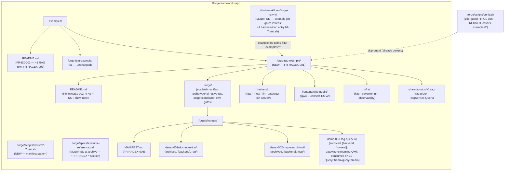
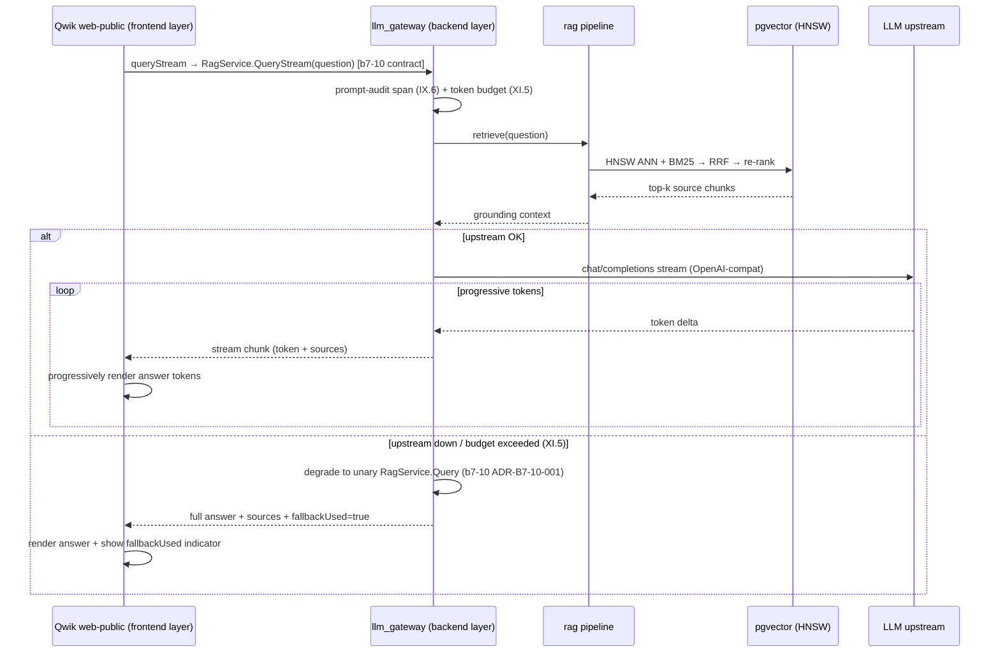

# Design: b7-7-example

<!-- Audit: B.7.7 (docs/new-archetypes-plan.md §0.12 T7 brick #8). -->
<!-- Depends on: b7-1-schema + b7-2a-dispatch-register + b7-standards + -->
<!--             b7-2-scaffolder + c1-reference-project (all archived). -->
<!-- Constitution: v2.0.0 — no bump (additive). -->

This design transforms `specs.md` into concrete technical decisions.
Like `c1-reference-project`, the change is **meta-organizational**: the
architectural patterns for the demos (Rust `rag`/`mcp`/`llm_gateway`
layering, Qwik web-public, pgvector HNSW, the AI-First pipeline) are
already governed by archived bricks (`b7-1-schema`, `b7-standards`,
`b7-2-scaffolder`). What this design must decide is:

1. **How** the example is rendered while the archetype is `candidate`
   (overlay.sh vs CLI; build-now vs sequence-after-b7-6).
2. **Which** demos, **what shape**, **what order**, demonstrating the
   RAG discipline rather than a product.
3. **How** the existing `example` CI job is extended to gate a second
   tree without regressing the FSM block.
4. **How** the test harness `b7-7.test.sh` validates the artefacts.

The 4 ADRs below cover these decisions. The example-tree **machinery**
(skip-guards FR-GL-026/027, `.gitignore` FR-GL-028, the
`examples/README.md` file, the `example` CI job FR-CI-012) is reused
from c1 — b7-7 does not re-decide it.

---

## Architecture Decisions

### ADR-B7-7-001: Render now via `overlay.sh` (do NOT sequence after b7-6)

**Context.** `ai-native-rag` is `stage: candidate` / `scaffoldable:
false` (`b7-1-schema`, ADR-B7-1-002); `forge init --archetype
ai-native-rag` refuses cleanly with exit 3 (`b7-2a-dispatch-register`).
Promotion to `stable` rides `b7-6-harness`. So the example cannot be
generated through the public `forge init` CLI until b7-6 lands. Q-1 in
`open-questions.md` weighed (A) render now via `overlay.sh` vs
(B) sequence b7-7 after b7-6.

**Decision.** Render the example **now via `overlay.sh`** (Option A).
`b7-2-scaffolder` established `overlay.sh` as the renderer of record for
this archetype (ADR-B7-2-007: the wrapper renders via `overlay.sh`, not
`init.sh`; the b7-2 L2 harness renders the plan via `overlay.sh` into a
tmpdir). The templates are self-contained (full `Cargo.toml`s — no
`cargo new`; Qwik — no `flutter create`), so `overlay.sh` alone produces
a complete tree. The committed example's `scaffold-manifest.yaml`
records `archetype_version: "1.0.0"` + `stage: candidate` so adopters
know precisely what they inspect; `b7-6` promotion does not invalidate
the committed tree.

**Consequences.**
- ✅ b7-7 is not blocked behind **b7-6** (promotion) — overlay.sh renders
  the candidate archetype directly. (Note: b7-7 IS sequenced after
  **b7-10** for the streaming demo — a separate dependency, ADR-B7-7-002;
  b7-6 promotion and b7-10 streaming are distinct bricks.)
- ✅ The rendered tree is provably the templates' output (same renderer
  b7-2 validated with).
- ✅ Mirrors c1's precedent (c1 rendered through the flagship renderer
  of its day; b7-7 renders through the RAG renderer of record).
- ⚠️ The example demonstrates a not-yet-`stable` archetype. The
  README's "What this example does NOT show" note states the caveat;
  FR-RAGEX-009 + `test_rag_archetype_still_candidate` enforce that
  committing the example does NOT flip the stage.

**Constitution Compliance:** Article III.4 (verify-then-act on the real
candidate/CLI behaviour; the example does not pretend the CLI works),
Article V.

### ADR-B7-7-002: demo-003 is the multi-layer (Janus) STREAMING demo, consuming b7-10's `QueryStream`/`queryStream`; demo-001/002 single-layer backend; b7-7 lands AFTER b7-10

**Context.** NFR-RAGEX-005 requires distinct layer + RAG-surface
combinations, and the c1 precedent shipped ≥ 1 multi-layer demo to
exercise Janus (≥ 2 layers → FR-GL-015). The archetype's layers are
`{backend, frontend, infra}`; `infra` is reused-by-reference (B.8
substrate), so no demo is infra-primary. Q-3 resolved which demo is
multi-layer. **Q-4 / option (b)** (maintainer-ratified 2026-06-22)
further resolved that demo-003 is the **streaming** rag-query-UI demo,
consuming `b7-10-streaming`'s `RagService.QueryStream` server-stream +
the `queryStream` Qwik client helper for progressive token render.

**Decision.** Three demos, chronological:

| Demo | Layers | RAG surface | What it demonstrates | Status |
|---|---|---|---|---|
| `demo-001-doc-ingestion` | `[backend]` | `rag/` pipeline | chunking → `Embedder` → pgvector HNSW upsert → hybrid retrieval (vector+BM25+RRF) → re-rank; `embeddings-pipeline` phase; XI.5 embedder fallback; cucumber-rs BDD | archived |
| `demo-002-mcp-search-tool` | `[backend]` | `mcp/` server | rmcp `#[tool_router]` `search` tool over the retriever; stdio + streamable-HTTP; schema-validated input; OAuth→Zitadel hook | archived |
| `demo-003-rag-query-ui` | `[backend, frontend]` | `llm_gateway/` + Qwik web-public | Janus-orchestrated multi-layer; **streaming** Qwik query UI consuming b7-10's **`RagService.QueryStream`** via the gateway + progressive token render via **`queryStream`**; prompt-audit span (IX.6) across the stream; XI.5 `fallbackUsed` (stream **degrades to unary `Query`**, b7-10 ADR-B7-10-001); per-layer designs/tasks | archived |

- Demos are numbered `demo-NNN-<slug>` (3-digit, chronological — same
  convention as c1 ADR-004).
- Each demo's `.forge.yaml` declares `parent_audit_items: [B.7.7]`.
- **Hard sequencing: b7-7 lands AFTER `b7-10-streaming`.** demo-003's
  streaming UI consumes the `QueryStream`/`queryStream` contract b7-10
  ships, and the example tree MUST be rendered from the
  **b7-10-extended `ai-native-rag/1.0.0` templates** (b7-10 adds the
  streaming surface to the archetype templates) — so the overlay.sh
  render (ADR-B7-7-001) happens only once b7-10's template edits have
  landed. `.forge.yaml depends_on` lists `B.7.10`.

**Consequences.**
- ✅ Distinct layer combinations (NFR-RAGEX-005) + distinct RAG surfaces.
- ✅ demo-003 (≥ 2 layers) triggers Janus, demonstrating per-layer delta
  + per-layer designs/tasks (FR-GL-016).
- ✅ demo-003 showcases the more compelling streaming RAG experience, not
  just a unary request/response — the example demonstrates the
  archetype's flagship UX.
- ⚠️ **b7-7 cannot be built or rendered until b7-10 has landed** (hard
  dependency). The overlay render must use the b7-10-extended templates.
- ⚠️ No infra-primary demo. Documented: infra is consumed by reference
  (memo §3), not re-decided per-demo.

**Constitution Compliance:** Articles III.2, III.4 (the streaming demo
consumes the real b7-10 contract; no fabricated streaming API), IV.4,
IX.6, XI.

### ADR-B7-7-003: Three archived demos (no 4th `specified`-only demo)

**Context.** §0.12 says "3 demos". c1 shipped 3 archived + 1 `specified`
(demo-004) to illustrate the in-flight `[NEEDS CLARIFICATION]` state.
Q-2 weighed honouring the brick count vs mirroring c1 verbatim.

**Decision.** Ship **exactly 3 archived demos**. The in-flight
`specified` state is already demonstrated for adopters by
`forge-fsm-example`'s demo-004 (the example-tree machinery is shared).
`[NEEDS CLARIFICATION]` markers still appear inside the 3 archived
demos' historical specs where a genuine ambiguity was resolved. A future
`b7-7-followup` may add a RAG-specific `specified` demo if requested.

**Consequences.**
- ✅ Honours the brick spec count literally.
- ✅ Smaller diff than 4 demos.
- ⚠️ No RAG-specific in-flight demo. Recorded as a deferred option.

**Constitution Compliance:** Article III.2, III.4 (markers in archived
demo specs preserve the anti-hallucination demonstration).

### ADR-B7-7-004: `example` CI job is parse-only / own-gates-only for both trees

**Context.** Building the RAG backend (`cargo build` — heavy ONNX local
embedder, rmcp, async-openai) + the Qwik UI (`npm` + `buf generate`) in
the Forge repo's `example` job would need Rust + Node + buf + network,
which the existing parse-only `example` job (c1 ADR-006) deliberately
avoids. Q-5 resolved the CI depth.

**Decision.** Mirror c1 ADR-006. The `example` job runs, **per tree**:
(1) `cd examples/<tree> && bash .forge/scripts/verify.sh`,
(2) `bash .forge/scripts/constitution-linter.sh`, (3) a structural
YAML/template parse where applicable — **no `cargo build`, no `npm`, no
`buf generate`, no network**. The toolchain-gated build/test is
exercised by `b7-2-scaffolder`'s L2 harness (already `cargo check`s the
rendered workspace) and `b7-6-harness`'s ≥35-test promotion suite.
`b7-7.test.sh` keeps an opt-in L2 (`--require-example-tools`) running
the RAG tree's own gates, matching `c1.test.sh`'s L2.

**Consequences.**
- ✅ `example` job runtime stays ≤ 4 min (NFR-RAGEX-003) — no build.
- ✅ Forge CI dependencies stay minimal (Python + Bash).
- ⚠️ Runtime regressions in the RAG product code are caught by b7-2 L2
  / b7-6, not the `example` job. Accepted trade-off (same as c1).

**Constitution Compliance:** Articles V, X.

---

## CI job extension — exact shape (MODIFIED FR-CI-012)

The existing `example` job (`.github/workflows/forge-ci.yml`, added by
c1) is structured: a `dorny/paths-filter@v4` step keyed on `examples/**`,
then conditional steps (`if: steps.examples-filter.outputs.examples ==
'true'`) running the FSM tree's gates + an FSM template parse. b7-7
inserts, **after the FSM steps and before the summary job**, a mirror
block for the RAG tree:

```yaml
      - name: rag-example verify.sh
        if: steps.examples-filter.outputs.examples == 'true'
        run: |
          cd examples/forge-rag-example
          bash .forge/scripts/verify.sh
      - name: rag-example constitution-linter.sh
        if: steps.examples-filter.outputs.examples == 'true'
        run: |
          cd examples/forge-rag-example
          bash .forge/scripts/constitution-linter.sh
      - name: parse rag archetype templates (yaml.safe_load)
        if: steps.examples-filter.outputs.examples == 'true'
        run: |
          python3 - <<'PY'
          import glob, sys, yaml
          # Parse any committed YAML the RAG example tree ships
          # (k8s manifests, buf.gen, docker-compose) for structural validity.
          paths = glob.glob('examples/forge-rag-example/infra/**/*.yaml', recursive=True)
          for p in paths:
              try:
                  yaml.safe_load(open(p).read())
              except Exception as e:
                  print(f'parse failed: {p}: {e}', file=sys.stderr); sys.exit(1)
              print(f'parsed: {p}')
          PY
```

- The paths-filter (`examples/**`) already covers
  `examples/forge-rag-example/**` — **no filter edit**.
- The FSM steps + the `summary` job's `needs: [...example]` + the
  skip-as-success rule are **byte-preserved** (only RAG steps inserted).
- The harness loop in the `harness` job gains one entry:
  `"b7-7.test.sh"`, placed after `"c1.test.sh"` (sibling-adjacency
  convention — the example-tree harnesses cluster).

> **Collision note (Q-4, resolved — option b).** This edit touches the
> same `example` job and harness loop `b7-10-streaming` may edit. Because
> b7-7 now has a **hard dependency on b7-10** (demo-003 consumes the
> streaming contract), **b7-10 merges first** and b7-7 rebases its CI
> edit onto b7-10's. b7-7's edit is kept minimal + additive (one RAG gate
> block + one loop entry); the orchestrator owns the rebase. The exact
> RAG-template glob (`infra/**/*.yaml`) is conservative — it parses only
> YAML the rendered tree actually ships (k8s + docker-compose), avoiding
> a brittle dependency on a specific template path.

---

## Component Design



---

## Data Flow

### `example` CI job — two-tree gating

```mermaid
sequenceDiagram
    actor Maintainer
    participant GH as GitHub
    participant ForgeCi as forge-ci.yml :: example job
    participant PF as dorny/paths-filter@v4 (examples/**)
    participant FSM as forge-fsm-example gates
    participant RAG as forge-rag-example gates
    participant Summary as summary job

    Maintainer->>GH: PR touches examples/forge-rag-example/**
    GH->>ForgeCi: trigger
    ForgeCi->>PF: filter examples/**
    alt matched (true)
        ForgeCi->>FSM: cd forge-fsm-example; verify.sh + linter + parse  [UNCHANGED]
        FSM-->>ForgeCi: exit 0
        ForgeCi->>RAG: cd forge-rag-example; verify.sh + linter + parse  [NEW]
        RAG-->>ForgeCi: exit 0
        ForgeCi-->>Summary: result=success
    else not matched
        ForgeCi-->>Summary: result=skipped (treated as success — UNCHANGED rule)
    end
    Summary->>GH: 5/5 jobs PASS
```

### demo-003 STREAMING RAG query (multi-layer, Janus) — illustrative



---

## Testing Strategy

### Coverage of FRs

| FR | Test (in `b7-7.test.sh`) | Level |
|---|---|---|
| FR-RAGEX-001 | `test_rag_example_tree_canonical_structure`<br/>`test_rag_example_scaffold_manifest_complete` | L1 |
| FR-RAGEX-002 | `test_rag_example_readme_has_required_sections` | L1 |
| FR-RAGEX-003 | `test_examples_meta_readme_lists_rag_example` | L1 |
| FR-RAGEX-004 | `test_rag_demos_count_and_status`<br/>`test_each_rag_demo_has_five_artefacts`<br/>`test_rag_demo_003_is_multi_layer` | L1 |
| FR-RAGEX-005 | `test_rag_demos_cover_ai_first_surfaces` | L1 |
| FR-RAGEX-006 | `test_rag_demos_manifest_present_and_lists_three_demos` | L1 |
| FR-RAGEX-007 | `test_rag_example_tree_verify_exits_zero`<br/>`test_rag_example_tree_constitution_linter_exits_zero` | L2 (`--require-example-tools`) |
| FR-RAGEX-008 | `test_b7_7_manifest_self_consistency` (harness meta-test) | L1 |
| FR-RAGEX-009 | `test_rag_archetype_still_candidate`<br/>`test_cli_still_refuses_rag_init` | L1 / L2 |
| FR-RAGEX-010 | `test_example_reference_spec_has_ragex_section_post_archive` (archive-gated) | L1 |
| MODIFIED FR-CI-012 | `test_forge_ci_example_job_gates_rag_tree`<br/>`test_forge_ci_example_job_fsm_block_preserved`<br/>`test_forge_ci_harness_loop_has_b7_7` | L1 |

### Coverage of NFRs

| NFR | Test | Level |
|---|---|---|
| NFR-RAGEX-001 | `test_b7_7_no_archetype_or_schema_edit` | L1 |
| NFR-RAGEX-002 | `test_rag_example_tree_byte_budget` | L1 |
| NFR-RAGEX-003 | measured at first archive cycle | n/a |
| NFR-RAGEX-004 | `test_each_rag_demo_proposal_under_size_budget` | L1 |
| NFR-RAGEX-005 | `test_rag_demos_cover_distinct_combinations` | L1 |

### BDD scenarios

The four ACs in `specs.md` (`AC-RAGEX-001..004`) map to the L1 tests
above. Like c1, the b7-7 change itself is meta-organizational and ships
NO top-level `.feature`; each **demo** ships its own `.feature`
(FR-RAGEX-004).

### Test ordering during implementation (Article I)

1. **RED** — write `b7-7.test.sh` with the L1 manifest + the FR-RAGEX-*
   tests against an empty `examples/forge-rag-example/`. Run → all FAIL.
2. **GREEN (tree)** — render the archetype via `overlay.sh` into
   `examples/forge-rag-example/`, write its README, append the
   `examples/README.md` row, extend the `example` CI job + harness loop.
   Run → tree/README/CI tests PASS.
3. **GREEN (demos)** — author demo-001 → demo-002 → demo-003 in
   chronological order (each a full proposal→specs→design→tasks→feature
   lifecycle, with its product code TDD-conformant). Run → demo tests PASS.
4. **REFACTOR** — run all harnesses (incl. `c1.test.sh`) → confirm zero
   cross-regression; run `b7-7.test.sh --require-example-tools` (L2).

---

## Planned physical deliverables (described, NOT created by this plan)

```
examples/forge-rag-example/                      # rendered via overlay.sh, committed verbatim
├── README.md                                    # FR-RAGEX-002 (4 H2 + NOT-show note)
├── CLAUDE.md  Taskfile.yml  docker-compose.dev.yml  .gitignore  .forge.yaml(schema: ai-native-rag)
├── .claude/  .forge/(scaffold-manifest.yaml: archetype ai-native-rag 1.0.0 candidate)
├── backend/   rag/ mcp/ llm_gateway/ bin-server/ Cargo.toml rust-toolchain.toml CLAUDE.md
├── frontend/web-public/                         # Qwik (Connect-ES v2, STREAMING RAG query UI — b7-10 queryStream)
├── infra/     k8s/llm-gateway/  postgres/init-pgvector.sql  README.md
├── shared/protos/v1/rag/rag.proto               # RagService.Query + QueryStream (b7-10-extended)
└── .forge/changes/
    ├── MANIFEST.md                              # FR-RAGEX-006 (3 rows)
    ├── demo-001-doc-ingestion/                  # archived, [backend]
    │   proposal.md specs.md design.md tasks.md features/doc_ingestion.feature .forge.yaml
    ├── demo-002-mcp-search-tool/                # archived, [backend]
    │   proposal.md specs.md design.md tasks.md features/mcp_search.feature .forge.yaml
    └── demo-003-rag-query-ui/                   # archived, [backend, frontend]
        proposal.md specs.md
        designs/design-backend.md designs/design-frontend.md
        tasks/tasks-backend.md tasks/tasks-frontend.md
        features/rag_query_ui.feature .forge.yaml

.forge/scripts/tests/b7-7.test.sh                # NEW harness (manifest pattern)
.github/workflows/forge-ci.yml                   # MODIFIED (example job +RAG block; +loop entry)
examples/README.md                               # MODIFIED (+1 table row)
.forge/specs/example-reference.md                # MODIFIED at archive (+FR-RAGEX-* section)
.forge/specs/forge-ci.md                         # MODIFIED at archive (FR-CI-012 delta)
```

---

## Standards Applied

| Standard | How |
|---|---|
| `global/rag-patterns` | demo-001 ships the `rag/` pipeline (chunking/embeddings/hybrid retrieval/RRF/re-rank/pgvector HNSW). |
| `global/mcp-servers` | demo-002 ships the rmcp `search` tool (dual transport, least-priv, OAuth→Zitadel). |
| `global/llm-gateway` | demo-003 exercises the gateway proxy over the streaming path (prompt-audit IX.6, budget/kill-switch, XI.5 fallback degrading to unary). |
| `global/proto-contracts` | the rendered `shared/protos/v1/rag/rag.proto` (`RagService.Query` + b7-10's `RagService.QueryStream`) is the demos' contract. |
| `global/multi-layer-workflow` | demo-003 declares `[backend, frontend]` ≥ 2 → Janus (FR-GL-015), per-layer designs/tasks (FR-GL-016). |
| `b7-10-streaming` contract (`QueryStream`/`queryStream`) | demo-003 CONSUMES it (hard dep — b7-7 lands after b7-10; the example tree is rendered from the b7-10-extended templates). |
| `global/forge-self-ci` | the `example` job extension follows the branch-protection + size-budget guidance. |
| `compliance-tiers` | demo-001's design references tier-aware `Embedder` selection (T3 ⇒ local, zero egress). |
| example-tree machinery (c1: FR-GL-026/027/028, FR-EX-003, FR-CI-012) | REUSED unchanged; b7-7 adds a tree under it. |

---

## Constitutional compliance gate

| Article | Gate-blocked? | Justification |
|---|---|---|
| I — TDD | NO | `b7-7.test.sh` RED→GREEN→REFACTOR; each demo archives its own cycle. |
| II — BDD | NO | Each demo ships a `.feature`; ACs as Gherkin in specs.md. |
| III — Specs Before Code | NO | This design is the gate; specs precede it. `[NEEDS CLARIFICATION]` in `open-questions.md`. |
| IV — Delta-Based | NO | ADDED/MODIFIED deltas in specs.md; demo-003 per-layer delta. |
| V — Conformance Gate | NO | Reused skip-guards + extended `example` job preserve gate behaviour. |
| VII — Rust Architecture | NO | demo-001/002 follow the archetype's Rust layering; `unwrap()`/`panic!()` barred in prod paths. |
| VIII — Infrastructure | NO | infra reused-by-reference (B.8 substrate); no re-decision. |
| IX.6 — Prompt Audit | NO | demo-003 exercises the gateway audit span across the streaming `QueryStream` path. |
| XI — AI-First | NO | First example to materialise XI: XI.5 fallback (demo-001 embedder; demo-003 stream degrades to unary `Query`), XI.6 (demo-001 local path), embeddings-pipeline + prompt-audit phases. |

✅ **No constitutional violation. Proceeding to /forge:plan.**

---

**Gate**: Design complete. Review `design.md`. Next: `/forge:plan b7-7-example`.
