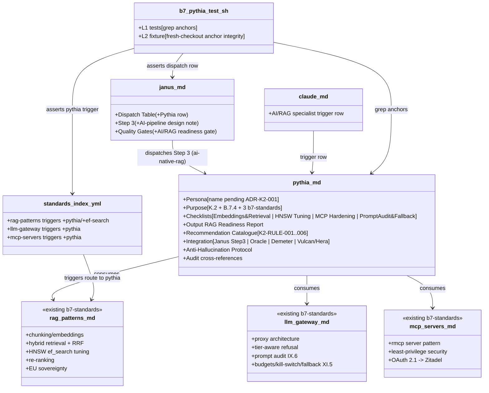
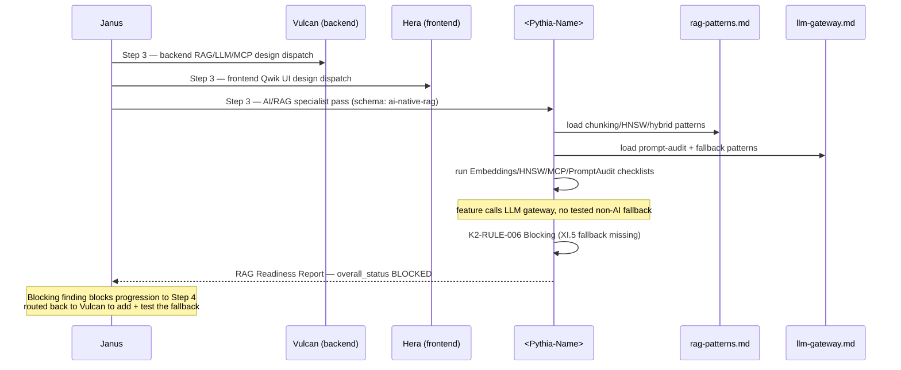

# Design: b7-pythia

<!-- Status: designed -->
<!-- Schema: default -->

> Read alongside `specs.md` (FR-K2-PYT-* / NFR-K2-PYT-*) and `open-questions.md`
> (Q-001 BLOCKING + Q-002 + Q-003). This document locks the implementation
> strategy for the K.2 Pythia AI/RAG specialist agent and resolves Q-002 + Q-003
> via ADR-K2-002 + ADR-K2-003. **Q-001 (name collision) is recorded as
> ADR-K2-001 with a recommended default but requires maintainer ratification
> before the change may flip to `implemented`** (Article III.4).

## Architecture Decisions

### ADR-K2-001 — Persona name & file path (records Q-001 ; maintainer-gated)

**Context** : the roadmap (§9 line 2665, §6.2 line 2585) names the K.2 AI/RAG
agent **Pythia**, but `.claude/agents/product-analyst.md` already declares
`# Agent: Product Analyst (Pythia)` and four files bind that name to the Product
Analyst (`forge-master.md` lines 39/143, `product-analyst.md`,
`commands/forge/onboard.md` line 54, `commands/forge/propose.md` line 31).
Name-based dispatch cannot disambiguate two "Pythia" agents.

**Decision** : the persona name is **parameterised** (`<pythia-name>`) through
specs + tasks until the maintainer ratifies one of the Q-001 options. The
**recommended default** (encoded here, not yet locked) is **Option B**: keep
"Pythia" for the already-shipped Product Analyst; name the new K.2 AI/RAG
specialist **Delphi** (the oracle's seat — thematically a retrieval site).

- Persona file (recommended) : `.claude/agents/delphi.md`.
- H1 (recommended) : `# Agent: AI/RAG Specialist (Delphi)`.
- The brick / change name stays **`b7-pythia`** regardless (it documents the
  roadmap K.2 "Pythia" row ; the persona's final name is independent).

> **RATIFIED 2026-06-22 (Q-001 Resolution, `open-questions.md`)** : the
> maintainer chose **Option B** and selected the name **Sibyl** (a Greek
> prophetess/seer) over this ADR's recommended "Delphi". The ratified binding —
> which **supersedes the "Delphi" recommendation above** — is :
> - Persona file : `.claude/agents/sibyl.md`.
> - H1 : `# Agent: AI/RAG Specialist (Sibyl)`.
> - The shipped Product-Analyst-Pythia (`.claude/agents/product-analyst.md`) and
>   its 4 references are **not** modified (zero churn).
> - The brick / change name stays `b7-pythia`.

**Why Option B over A** : renaming a shipped, 4-file-referenced persona (Option
A) is higher churn + higher regression risk than naming a brand-new agent. The
roadmap "Pythia (AI/RAG)" is a label, not a contract ; the documentary link to
the roadmap row is preserved by the brick name.

**Rejected** : Option C (placeholder name on disk) — leaves an unnamed agent,
violates the spirit of a "first-class agent persona" (XI.1).

**Consequences** :
- ✅ Zero churn on the shipped Product Analyst (Option B).
- ✅ Harness is name-agnostic (NFR-K2-PYT-007) — it resolves the agent path from
  a single `PYTHIA_AGENT` variable, so the suite passes the moment the ADR locks
  the value, with no per-test edit.
- ⚠️ **BLOCKING** : the literal name is NOT locked by this design ; it is a
  maintainer call (touches a shipped persona's identity + the roadmap's stated
  name). The change MUST NOT flip to `implemented` until the maintainer ratifies
  ADR-K2-001's name. Recorded in `open-questions.md` Q-001 ; the `verify` /
  archival gate checks Q-001 status is `answered`.

**Constitution Compliance** : Article III.4 (never guess a contested name),
XI.1 (agent-native — the agent IS named, just pending ratification). No
violation.

---

### ADR-K2-002 — K2-RULE namespace : 6 seed rules, incremental growth (resolves Q-002)

**Context** : Q-002 weighed pre-allocation vs incremental growth for the
`K2-RULE-NNN` catalogue. ADR-J8-004 locked the `<MODULE>-RULE-NNN` format ;
ADR-K3-005 chose incremental growth for K3-RULE.

**Decision** : **incremental growth, 6 seed rules**, mirroring ADR-K3-005. Seed
catalogue (one per checklist area + the XI.5 fallback gate) :

- **K2-RULE-001** — Embedding model not tier-gated (`Concern`, FR-K2-PYT-120).
- **K2-RULE-002** — HNSW `ef_search` untuned / no eval set (`Advisory`,
  FR-K2-PYT-121 ; emits `[NEEDS CLARIFICATION:]` not a fabricated number).
- **K2-RULE-003** — Pure-vector retrieval, no hybrid (`Advisory`, FR-K2-PYT-122).
- **K2-RULE-004** — MCP tool over-privileged (`Concern`, FR-K2-PYT-123).
- **K2-RULE-005** — Prompt-audit span missing / IX.6 (`Concern`, FR-K2-PYT-124).
- **K2-RULE-006** — Mandatory fallback missing / untested / XI.5 (`Blocking` —
  the single Blocking rule, FR-K2-PYT-125).

**Severity vocabulary** (advisory agent — softer than J8/K3 policy-refusal) :
`Advisory` (tuning suggestion) < `Concern` (should-fix before production) <
`Blocking` (XI.5 fallback gate only ; the one case that maps the report status
to `BLOCKED`). This differs deliberately from Demeter's
Critical/High/Medium/Low/Informational ladder because Pythia recommends, it does
not refuse.

**Numbering invariant** (per ADR-J8-004 inheritance) : IDs NEVER reused ; future
K.2 extensions append `K2-RULE-007..` ; decommissioned rules marked
`DEPRECATED`, slot not recycled.

**Consequences** :
- ✅ Spec discipline preserved ; 6 rules cover the 3 BDD scenarios + the four
  checklist areas.
- ✅ `K2-RULE-*` is syntactically disjoint from `J8-RULE-*` / `K3-RULE-*`
  (FR-K2-PYT-086).

**Constitution Compliance** : Article V (audit trail). No violation.

---

### ADR-K2-003 — Advisory agent, NO scanner (resolves Q-003 ; principal divergence from k3-demeter)

**Context** : the brick's stated patron `k3-demeter` ships a deterministic
scanner (`bin/forge-demeter-scan.sh` + `cloud-act-publishers.yml` deny-list +
JSON-report exit-code contract). Q-003 asks whether Pythia mirrors that.

**Decision** : **NO scanner. Pythia is a pure advisory / tuning specialist**, in
the `observability-specialist.md` (Panoptes) mould — persona checklists + a
`RAG Readiness Report` template + a `K2-RULE-*` recommendation catalogue, and
**nothing executable**.

**Rationale** :
1. The plan §9 K.2 verbs are advisory : *"tune pgvector (HNSW `ef_search`), MCP
   servers, prompt audit"*.
2. HNSW / embeddings tuning is **inherently workload-specific and
   non-deterministic** — `ef_search` is tuned against the adopter's labelled eval
   set, which a generic scanner cannot synthesise. A scanner that guessed a
   number would violate Article III.4 (FR-K2-PYT-008 / K2-RULE-002 emit
   `[NEEDS CLARIFICATION:]` precisely because there is no deterministic answer).
3. The prompt-audit + fallback checks are design/review-time gates Janus already
   dispatches (FR-K2-PYT-083) — not a standalone CLI surface.
4. Demeter's scanner is justified because CLOUD Act jurisdiction is a
   *deterministic deny-list lookup* ; Pythia's domain has no analogous
   deterministic oracle.

**What this removes vs the k3-demeter precedent** (all explicitly out of scope) :
`bin/forge-pythia-scan.sh`, the Python engine, `.forge/data/*.yml`, the
exit-code 0/1/2/3 contract, the `SOURCE_DATE_EPOCH` reproducibility NFR, the
deny-list-hit L2 fixture. The harness's single L2 fixture instead asserts
persona-anchor integrity across a fresh checkout (FR-K2-PYT / NFR-K2-PYT-007).

**Consequences** :
- ✅ Smaller, honest surface — no false-confidence scanner.
- ✅ NFR-K2-PYT-002 (no executable) is a first-class guard.
- ⚠️ Reviewers expecting a 1:1 k3-demeter mirror must read this ADR ; the
  divergence is deliberate and the plan's K.2 verbs justify it. Flagged at the
  top of `tasks.md` and in the proposal Scope Out.

**Constitution Compliance** : Article VIII (no service / no daemon — trivially
satisfied, there is no executable), XI.1 (agent-native persona). No violation.

---

### ADR-K2-004 — Janus integration : Dispatch-Table row + Step 3 design-pass note (delta-based, Article IV.1)

**Context** : FR-K2-PYT-082 + FR-K2-PYT-083 require a Janus Dispatch-Table row +
a workflow-pass integration. Article IV.1 requires delta-based modifications.
`cross-layer-orchestrator.md` is **co-edited by `b7-9-janus-ai`** — the deltas
must be disjoint (see § "Shared-file collision" below).

**Decision** : two surgical edits to
`.claude/agents/cross-layer-orchestrator.md`, both in sections **disjoint** from
`b7-9-janus-ai`'s J8-RULE forbidden-catalogue edits :

1. **Dispatch Table row** — inserted **after** the Demeter row (the current last
   row of the table at line 32) and **before** the closing `---` (line 34) :
   ```markdown
   | AI/RAG specialist work on `ai-native-rag` — embeddings/retrieval tuning, pgvector HNSW `ef_search`, MCP server hardening, prompt-audit + mandatory-fallback gates | **<Pythia-Name>** (AI/RAG Specialist) | <Pythia-Name> drives AI-pipeline tuning + prompt-audit/fallback review for `ai-native-rag` cross-layer changes ; advisory, complementary to Demeter's data-stewardship and Aegis's vulnerability passes. |
   ```

2. **Step 3 design-pass note** (NOT Step 9) — append a single paragraph to the
   `### Step 3 — Parallel Design Dispatch` H3 stating : *for projects whose root
   `.forge.yaml` declares `schema: ai-native-rag`, Janus additionally briefs
   `<Pythia-Name>` to advise the per-layer RAG / LLM-gateway / MCP design (the
   AI-pipeline specialist pass), and collects a `RAG Readiness Report` whose
   `Blocking` findings (K2-RULE-006 XI.5 fallback gate) block progression to
   Step 4 — analogous to a `[NEEDS CLARIFICATION]` on a missing per-layer
   design.* Plus a one-bullet entry in the **Quality Gates** H2 : *"AI/RAG
   readiness gate — dispatched to **<Pythia-Name>** for `ai-native-rag` projects ;
   a `Blocking` (XI.5 fallback) finding blocks the change."*

**Why Step 3 (design dispatch), not Step 9 (security/data-stewardship)** : Step 9
is the Aegis+Demeter security/data-stewardship pass (already extended by K.3).
Pythia's work is **AI-pipeline design tuning**, which belongs with the per-layer
design dispatch (Step 3), not the security pass. Keeping Pythia out of Step 9
also keeps the K.3 Step 9 narrative untouched (no regression to the Demeter
delta) and keeps a clean disjoint boundary from `b7-9-janus-ai`.

**Constitution compliance** H2 of `cross-layer-orchestrator.md` MAY gain a
one-bullet AI-First entry (Article XI — `<Pythia-Name>` has reviewed the
AI-pipeline tuning + mandatory fallback). Article reference (XI.5 + IX.6) locked
at impl.

**Consequences** :
- ✅ Article IV.1 delta-based modification respected ; the 12-step shape
  preserved (only Step 3 gains a conditional AI-pipeline note).
- ✅ Disjoint from K.3 Step 9 and from `b7-9-janus-ai`'s Forbidden-catalogue.
- ⚠️ Whichever brick lands second (b7-pythia or b7-9-janus-ai) rebases its
  surgical delta. The deltas touch different H2/H3 sections so a textual merge is
  clean. See § collision.

**Constitution Compliance** : Articles IV.1, V (audit trail via Dispatch Table +
Step 3 note + Quality Gates bullet). No violation.

---

### ADR-K2-005 — Standards-index : additive triggers, NO new entry (resolves FR-K2-PYT-080)

**Context** : K.3 authored a brand-new standard (`data-stewardship-rules.md`) +
a new `index.yml` entry. Pythia owns three **pre-existing** standards
(`b7-standards`). It must be discoverable without re-authoring them.

**Decision** : **additive `triggers:` edit only** to the three existing B.7.3
`index.yml` entries (lines ~439-455). Add the keyword `pythia` (and the recommended
final name, e.g. `delphi`, once ADR-K2-001 locks it) to each of
`global/rag-patterns`, `global/llm-gateway`, `global/mcp-servers`; add
`ef-search` / `embeddings-tuning` to `rag-patterns` specifically. **No new
`index.yml` entry**, **no new standard file** (FR-K2-PYT-081).

Example (post-edit `rag-patterns` triggers) :
```yaml
triggers: [rag, retrieval, embeddings, pgvector, hnsw, ef-search, embeddings-tuning, re-ranking, hybrid-search, vector-search, ai-native-rag, chunking, context-window, pythia]
```

**Why additive, not a new entry** : the standards already exist and already map
1:1 to the schema components. Pythia "owns" them by being the named specialist
the triggers route to — a new index entry pointing at the same files would
duplicate. Additivity keeps `validate-standards-yaml.sh` / `j7` GREEN
(NFR-K2-PYT-005) because the entry shape is unchanged (only an array grows).

**Consequences** :
- ✅ Minimal, non-duplicating ; no standard content edited (NFR-K2-PYT-004).
- ✅ J.7 validation unaffected (array extension, not schema change).
- ✅ Diverges cleanly from K.3 (which DID need a new standard) — divergence
  justified because the standards pre-exist.

**Constitution Compliance** : Article XII (governance — consumes standards, does
not amend), III.4 (no fabricated standard filename). No violation.

---

## Component Design



## Data Flow — Janus dispatches Pythia at Step 3 (ai-native-rag, fallback untested)



## Test Harness Design

`.forge/scripts/tests/b7-pythia.test.sh` mirrors the `k3.test.sh` layout (bash
header, `_helpers.sh` source, PASS/FAIL counters, `--level 1,2` parsing,
`print_summary`) **minus the scanner machinery** (ADR-K2-003). It resolves the
agent path from a single `PYTHIA_AGENT` variable (NFR-K2-PYT-007) so it is
name-agnostic until ADR-K2-001 locks the value.

### L1 — anchor-level (≥ 14 grep tests)

| Test ID                                  | FR covered                | Anchor asserted                                                                          |
|------------------------------------------|---------------------------|------------------------------------------------------------------------------------------|
| `_test_b7p_001_persona_exists`           | FR-K2-PYT-001             | `$PYTHIA_AGENT` file exists                                                               |
| `_test_b7p_002_audit_comment`            | FR-K2-PYT-010             | `<!-- Audit: K.2 (b7-pythia) -->` + `<!-- Audit: B.7.4 (b7-pythia) -->` in first 6 lines |
| `_test_b7p_003_persona_h2`               | FR-K2-PYT-002 / 003       | `## Persona` + `## Purpose` H2 anchors                                                    |
| `_test_b7p_004_checklists_h2`            | FR-K2-PYT-004             | `## Checklists` H2 + 4 H3 (Embeddings & Retrieval / pgvector HNSW Tuning / MCP Server Hardening / Prompt Audit & Fallback) |
| `_test_b7p_005_checklists_items`         | FR-K2-PYT-004             | each of the 4 H3 has ≥ 5 `[ ]` items                                                     |
| `_test_b7p_006_output_h2`                | FR-K2-PYT-005             | `## Output: RAG Readiness Report` H2 + Summary table (`\| Severity \|`)                   |
| `_test_b7p_007_rule_catalogue`           | FR-K2-PYT-006 / 120..125  | `## Recommendation Catalogue` H2 + K2-RULE-001..006 anchors                              |
| `_test_b7p_008_fallback_blocking`        | FR-K2-PYT-125 / XI.5      | K2-RULE-006 present + `Blocking` severity + `XI.5` reference                              |
| `_test_b7p_009_integration`              | FR-K2-PYT-007             | `## Integration` H2 + `cross-layer-orchestrator` ref + Oracle + Demeter mentions          |
| `_test_b7p_010_anti_halluc`              | FR-K2-PYT-008             | `## Anti-Hallucination Protocol` H2 + `[NEEDS CLARIFICATION:` mention                     |
| `_test_b7p_011_standards_consumed`       | FR-K2-PYT-003 / 020..027  | persona references all three : `rag-patterns` + `llm-gateway` + `mcp-servers`             |
| `_test_b7p_012_index_triggers`           | FR-K2-PYT-080             | `index.yml` rag-patterns/llm-gateway/mcp-servers entries each contain the `pythia` trigger keyword |
| `_test_b7p_013_no_new_standard`          | FR-K2-PYT-081             | no new `global/*.md` standard authored by this change (guard : only the 3 b7-standards exist for RAG) |
| `_test_b7p_014_janus_dispatch_row`       | FR-K2-PYT-082             | `cross-layer-orchestrator.md` Dispatch Table contains the `<Pythia-Name>` AI/RAG row     |
| `_test_b7p_015_janus_step3_note`         | FR-K2-PYT-083 / ADR-K2-004| `cross-layer-orchestrator.md` Step 3 H3 contains an `ai-native-rag` Pythia note (and Step 9 Demeter narrative UNCHANGED — guard) |
| `_test_b7p_016_claude_md_trigger`        | FR-K2-PYT-084             | repo `CLAUDE.md` agent table contains the AI/RAG specialist row                          |
| `_test_b7p_017_no_namespace_collision`   | FR-K2-PYT-086             | grep `K2-RULE` returns empty in J8-RULE / K3-RULE surfaces and vice-versa                |
| `_test_b7p_018_no_scanner`               | NFR-K2-PYT-002 / ADR-K2-003| no `bin/forge-pythia*.sh` and no `.forge/data/pythia*.yml` exist (advisory-only guard)   |

**18 L1 tests** — exceeds the precedent's ≥ 18 baseline despite the smaller
surface (more guards because the divergences from k3-demeter — no scanner, no new
standard, name-agnostic — each need an explicit negative test).

### L2 — fixture-level (1 test)

| Fixture                          | Coverage                                                                                  | Expected                                                                 |
|----------------------------------|-------------------------------------------------------------------------------------------|--------------------------------------------------------------------------|
| `_test_b7p_l2_anchor_integrity`  | copy `$PYTHIA_AGENT` into a tmpdir, run the L1 anchor greps against the copy (fresh-checkout simulation) | all H2/H3 + K2-RULE anchors present on the isolated copy ; proves the persona is self-contained, not dependent on repo-relative state |

No scanner-exit-code L2 fixture (ADR-K2-003 — Pythia ships no executable). The
single L2 fixture proves anchor integrity in isolation, the closest analogue to
the precedent's "clean tree" reproducibility intent without an executable to run.

### Performance

L1 ≤ 3 s (pure grep) ; full `--level 1,2` ≤ 5 s. No Python, no cargo, no network.

### CI registration

`b7-pythia.test.sh --level 1,2` registered in `.github/workflows/forge-ci.yml`
`harnesses=(...)` array, inserted **immediately after** `"b7-2.test.sh --level 1"`
(line 126) so the B.7 chain stays contiguous and adjacency-presence assertions in
sibling harnesses (the `grep -F '<name>.test.sh'` convention noted in the
workflow header) hold.

## Shared-file collision with sibling bricks (NFR-K2-PYT-006)

Two files are co-edited by sibling brick **`b7-9-janus-ai`** (B.7.9 + J.8.c —
runtime AI refusal rules : Vertex/Bedrock refusal, T3 ⇒ Mistral-EU/vLLM).

| File | `b7-pythia` edits | `b7-9-janus-ai` edits (anticipated) | Disjoint? |
|------|-------------------|--------------------------------------|-----------|
| `.claude/agents/cross-layer-orchestrator.md` | **Dispatch Table** (+1 row after Demeter) ; **Step 3** H3 (+1 AI-pipeline design note) ; **Quality Gates** H2 (+1 bullet) | **Forbidden archetypes & combinations** H2 (J8-RULE-004+ AI refusal rules : Vertex/Bedrock, T3⇒Mistral-EU) ; refusal-semantics block | ✅ Yes — different H2/H3 sections. Pythia never touches the J8-RULE forbidden catalogue ; b7-9 never touches the Dispatch Table / Step 3 / Quality Gates. |
| `CLAUDE.md` | +1 row in the agent-delegation table (AI/RAG specialist) | possible Janus-compatibility note / forbidden-archetype mention | ✅ Yes — Pythia's edit is a single delegation-table row ; b7-9's is prose elsewhere. If both touch the table, the rows are distinct and adjacent. |

**Merge protocol** : whichever brick lands second rebases its surgical delta onto
the first. Because the edits live in different sections, a textual 3-way merge is
clean (no overlapping hunks). Both bricks MUST re-run the full harness suite
post-merge to confirm no regression. The `b7-pythia.test.sh` guard
`_test_b7p_015_janus_step3_note` explicitly asserts the **Step 9 Demeter
narrative is unchanged** and does not assert anything about the Forbidden
catalogue, so a later `b7-9-janus-ai` edit cannot break the Pythia harness (and
vice-versa : b7-9's harness should assert the Forbidden catalogue, not the
Dispatch Table rows).

**Recommendation for the maintainer** : land `b7-pythia` and `b7-9-janus-ai` in
either order, but NOT concurrently on the same base without rebasing the second.
If concurrency is required, the disjoint-section design makes the conflict
trivially resolvable.

## Standards Applied

- **`global/rag-patterns.md`** (B.7.3) — consumed verbatim ; Pythia's Embeddings
  & Retrieval + pgvector HNSW Tuning + Re-ranking checklists operationalise it.
- **`global/llm-gateway.md`** (B.7.3) — consumed verbatim ; Prompt Audit &
  Fallback checklist operationalises it (IX.6 + XI.5 + XI.6).
- **`global/mcp-servers.md`** (B.7.3) — consumed verbatim ; MCP Server Hardening
  checklist operationalises it.
- **`global/compliance-tiers.md`** (I.2) + **`global/forbidden-components-rules.md`**
  (I.3) — REFERENCED for the tier-aware posture (K2-RULE-001) ; not restated, not
  edited.
- **`.claude/agents/observability-specialist.md`** (Panoptes) — structural
  precedent for an advisory specialist with checklists + deliverables and NO
  scanner.
- **`.claude/agents/demeter.md`** (K.3) — structural precedent for the persona
  layout (Persona / Purpose / Checklists / Output / Rule Catalogue / Integration
  / Anti-Hallucination / Audit cross-references) + the `<MODULE>-RULE-NNN`
  convention.
- **`global/forge-self-ci.md`** (G.1) — `b7-pythia.test.sh` registers in
  `forge-ci.yml` `harnesses=(...)` per the existing convention.

## Constitutional Compliance Gate

- **Article I (TDD)** : ✅ enforced via `b7-pythia.test.sh` RED → GREEN ;
  tasks.md Phase 1 writes all L1+L2 stubs FAIL.
- **Article II (BDD)** : ✅ 3 Gherkin scenarios in specs.md cover dispatch +
  fallback gate + ef_search clarification.
- **Article III (Specs Before Code)** : ✅ specs.md + design.md precede any
  implementation ; spec-only change.
- **Article III.4** : ✅ Q-001 (BLOCKING name collision) + Q-002 + Q-003 captured ;
  Q-002/Q-003 answered via ADR-K2-002/003 ; **Q-001 requires maintainer
  ratification and BLOCKS `implemented`** — never guessed.
- **Article IV (Delta-Based Changes)** : ✅ ADDED Requirements predominate ; the
  only MODIFIED entries are the Janus Dispatch Table + Step 3 note + Quality
  Gates bullet (ADR-K2-004, surgical) and the additive `index.yml` triggers
  (ADR-K2-005). Disjoint from sibling `b7-9-janus-ai` (collision § above).
- **Article V (Audit Trail)** : ✅ FR-K2-PYT-* tags + `K2-RULE-NNN` IDs +
  structured report shape.
- **Article VI (Flutter)** : N/A (no Flutter ; Pythia advises Hera's Qwik UI by
  reference but writes none).
- **Article VII (Rust)** : N/A (Pythia advises Vulcan's RAG/LLM/MCP backend ;
  writes no Rust).
- **Article VIII (Infra)** : ✅ trivially — Pythia ships no executable, no
  service, no daemon (ADR-K2-003).
- **Article IX.6 (AI Feature Observability)** : ✅ Pythia ENFORCES prompt-audit
  span coverage (FR-K2-PYT-026 / K2-RULE-005) at design/review time ; emits no
  OTel itself (review-time agent).
- **Article X (Code Quality)** : ✅ NFR-K2-PYT-002 (no TS / no executable) ; the
  Markdown persona + bash harness pass shellcheck per existing CI gates.
- **Article XI (AI-First Design)** :
  - **XI.1 (Agent-Native)** : ✅ Pythia is a first-class agent persona (name
    pending ADR-K2-001 ratification).
  - **XI.3 (Schema-Driven)** : ✅ Pythia's RAG Readiness Report is structured ;
    it consumes schema-driven RAG/MCP patterns.
  - **XI.5 (Mandatory Fallback)** : ✅ K2-RULE-006 is the Blocking gate enforcing
    a tested non-AI fallback — the single most important check Pythia owns.
  - **XI.6 (Privacy / Data Minimisation)** : ✅ Embeddings + Prompt Audit
    checklists assert PII minimisation before chunks reach a provider.
- **Article XII (Governance)** : ✅ Pythia ENFORCES the AI-First + EU-sovereignty
  posture ; authors no new standard (consumes `b7-standards`) ; amends no
  constitutional article.

**No constitutional violation detected. One BLOCKING open question (Q-001 name
collision) requires maintainer ratification before `/forge:implement`. Design
proceeds to `/forge:plan`.**

## Open Questions remaining post-design

- Q-001 (name collision) → **recorded in ADR-K2-001 with recommended Option B
  (rename K.2 agent to Delphi, keep Product-Analyst-Pythia)** ; **NOT
  auto-resolved** — requires maintainer ratification (touches a shipped persona's
  identity + the roadmap's stated name). Remains `Status: open` and BLOCKING
  until ratified.
- Q-002 (K2-RULE seed size) → **answered by ADR-K2-002** (6 seed rules,
  incremental, mirroring ADR-K3-005).
- Q-003 (advisory vs scanner) → **answered by ADR-K2-003** (advisory only, no
  scanner ; justified by the plan §9 K.2 verbs + non-determinism of tuning).

`open-questions.md` will flip Q-002 + Q-003 to `Status: answered` during
`/forge:plan` ; **Q-001 stays `open` (BLOCKING)** pending maintainer ratification.
