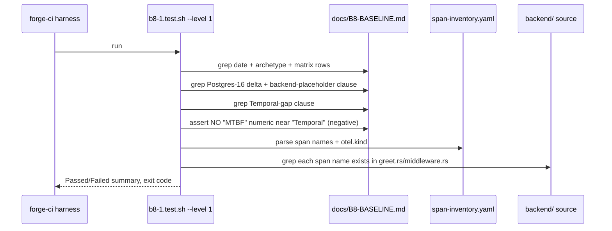

# Design: b8-1-audit-baseline

<!-- Status: archived -->
<!-- Schema: default -->
<!-- Audit: B.8.1 (docs/new-archetypes-plan.md §4.2) -->

**Agents**: Atlas (infra audit framing) + Eris (test strategy). No Flutter
(Athena) / Rust (Ferris) / API (Hermes-API) authoring — this change writes
no runtime code. **Context7**: not invoked — no external library API is
consumed; deliverables are Markdown + a YAML inventory + a Bash harness.
forge-docs skill correctly not triggered.

## Architecture Decisions

### ADR-B8-1-001 — Baseline doc is adopter-facing at `docs/B8-BASELINE.md`
**Context**: Q-001. Internal (`.forge/_memory/`) vs adopter-facing (`docs/`).
**Decision**: Adopter-facing `docs/B8-BASELINE.md`.
**Consequences**: The B.8.13 rollback runbook and the B.8 migration guide
cite a single published anchor; adopters mid-migration can read the 1.0.0
reference. Cost: it joins the doc surface the `Article X.3` doc-ratio linter
ignores (Markdown, not API), so no linter impact. Internal exploration notes,
if any, still go to `.forge/_memory/`.
**Constitution Compliance**: Article IX (Observability — baseline is the
trace-coverage reference) confirmed; no article violated.

### ADR-B8-1-002 — Latency baseline is methodology + one sample, never committed live numbers
**Context**: Q-002. `fsm-backend` is `image: scratch` (FR-B8-1-012), so live
p50/p95/p99 cannot be captured from the dev compose unmodified.
**Decision**: The deterministic artifact is the **re-measurement procedure**
(FR-B8-1-030). One illustrative sample capture MAY be attached with explicit
hardware/context caveats, clearly marked non-normative. No live percentile
numbers are committed as baseline truth.
**Consequences**: B.8.12 re-runs the *procedure* against 2.0.0 (which will
have a real backend image) and compares like-for-like; the 1.0.0 side of the
latency comparison is established at that time, not faked now. Honest and
reproducible. Trade-off: no numeric latency anchor exists until a real
backend ships — acceptable because the rollback thresholds (B.8.13) are
*relative deltas* measured during the migration window, not against a frozen
1.0.0 number.
**Constitution Compliance**: Article III.4 — refuses to fabricate
unmeasurable data. Confirmed.

### ADR-B8-1-003 — Temporal gap is recorded with a forward-pointer to B.8.5
**Context**: Proposal ADR-3 / FR-B8-1-013. No Temporal worker is deployed.
**Decision**: Record the gap in the baseline doc and emit an explicit
forward-pointer: "Temporal → DBOS (B.8.5) replaces a documented intent, not a
running system." The harness enforces a negative assertion (FR-B8-1-033) so a
future edit cannot fabricate an MTBF.
**Consequences**: B.8.5's risk profile is corrected at the source — the DBOS
leg is lower-risk than the plan assumed. No MTBF data structure is invented.
**Constitution Compliance**: Article III.4 confirmed.

### ADR-B8-1-004 — Flagship-only scope
**Context**: Q-003. Also pre-capture `mobile-only / 1.0.0`?
**Decision**: Flagship-only, matching plan §4.2. The mobile baseline is B.9
(T8) territory and reuses this change's harness frame when it lands.
**Consequences**: No scope creep; the harness is written generically enough
(parameterized archetype/version in the inventory path) that B.9 adds a
second inventory file, not a second harness from scratch.
**Constitution Compliance**: no article affected.

### ADR-B8-1-005 — Span inventory is a durable machine-readable YAML under `.forge/baselines/`
**Context**: FR-B8-1-031/032. The static span inventory must survive archive
(B.8.12 consumes it) and be machine-parseable for the harness cross-check.
**Decision**: Commit `.forge/baselines/full-stack-monorepo-1.0.0.span-inventory.yaml`
(new forward-stable dir). Human narrative + component matrix live in
`docs/B8-BASELINE.md`; the YAML is the parseable source of truth for spans.
**Consequences**: Forward-stable: B.9/B.6/B.7 baselines add
`<archetype>-<version>.span-inventory.yaml` siblings. The harness reads the
YAML, not the prose, so doc rewording never breaks the assertion.
**Constitution Compliance**: Article IX confirmed; NFR-B8-1-002 (no
template/standard/schema mutation) preserved — `.forge/baselines/` is a new
data dir, not a standard or schema.

### ADR-B8-1-006 — CI registration via 3-comment compression
**Context**: FR-B8-1-080. `forge-ci.yml` is at 300/300 (NFR-CI-002 ceiling).
**Decision**: Add `b8-1.test.sh` to the harness matrix and reclaim lines via
the 3-comment compression precedent (ADR-T533-002), keeping ≤ 300.
**Consequences**: No ceiling breach. Verified by line count at implement.
**Constitution Compliance**: NFR-CI-002 confirmed.

## Component Design

```mermaid
graph TD
    subgraph Deliverables
        DOC[docs/B8-BASELINE.md<br/>component matrix + span tree<br/>+ Temporal gap + methodology]
        INV[.forge/baselines/<br/>full-stack-monorepo-1.0.0.span-inventory.yaml]
        H[.forge/scripts/tests/b8-1.test.sh<br/>L1 grep + L2 docker opt-in]
        CL[CHANGELOG.md Unreleased]
        SP[.forge/specs/b8-baseline.md]
    end
    subgraph Observed sources (read-only)
        DC[docker-compose.dev.yml]
        GREET[backend/.../greet.rs<br/>greeter.greet span]
        MW[backend/.../middleware.rs<br/>server span]
        K8S[infra/k8s/base/*]
    end
    DC -.audit.-> DOC
    K8S -.audit.-> DOC
    GREET -.static extract.-> INV
    MW -.static extract.-> INV
    H -->|asserts| DOC
    H -->|asserts + cross-checks| INV
    H -->|grep whole file| CL
    DOWN[B.8.12 regression / B.8.13 rollback / B.8.5 DBOS] -.consumes.-> DOC
    DOWN -.consumes.-> INV
```

## Data Flow — harness assertion (L1 hermetic)



## Testing Strategy (Eris)

- **TDD order (Article I)**: write `b8-1.test.sh` RED first. Each L1 test
  targets a not-yet-written clause of `docs/B8-BASELINE.md` / the inventory;
  authoring the doc + YAML drives them GREEN. The negative MTBF test
  (FR-B8-1-033) is verified RED by temporarily inserting a fake MTBF line,
  confirming the guard fires, then removing it.
- **L1 (hermetic, ≤5s, NFR-B8-1-001)**: 7 positive assertions (FR-B8-1-051) +
  1 negative (FR-B8-1-033) + inventory↔source cross-check (FR-B8-1-032).
- **L2 (opt-in `FORGE_B8_1_DOCKER=1`, skip-pass absent)**: dev-stack-up →
  drive demo-005 → SigNoz non-empty trace, span superset of inventory; honors
  placeholder-backend truncation per BDD scenario (FR-B8-1-060).
- **BDD**: the single Gherkin scenario in specs.md maps to the L2 test body
  (Article II — documented even though infra-only, mirroring b8-coroot precedent).
- **Regression guard**: `a7.test.sh` re-run GREEN (NFR-B8-1-004); `git diff
  --name-only` confirms zero `.forge/templates|standards|schemas` touch
  (NFR-B8-1-002).
- **Determinism (NFR-B8-1-003)**: inventory YAML has no timestamps; any
  sample capture is fenced + marked non-normative.

## Standards Applied

- `global/open-questions.md` — Q-001/002/003 resolved here as ADRs;
  open-questions.md updated to `answered`.
- `global/standards-lifecycle.md` — **not** triggered: no standard bumped
  (NFR-B8-1-002). No REVIEW.md entry.
- `global/forge-self-ci.md` — harness registration + ≤300-line budget
  (ADR-B8-1-006).
- Article IX (Observability) — the span inventory is the canonical
  trace-coverage reference for the flagship.

## Constitutional Compliance Gate

- Article I (TDD): RED-first harness — confirmed, not violated.
- Article II (BDD): L2 scenario documented — confirmed.
- Article III.4 (Anti-Hallucination): Temporal gap + placeholder + Postgres-16
  recorded honestly, fabricated-MTBF guard — confirmed.
- Article VI / VII (Flutter/Rust arch): no runtime code authored — N/A.
- Article IX (Observability): baseline references existing spans without
  mutating instrumentation — confirmed.
- Article XII (Governance): additive, no amendment — confirmed.

**No violations. Gate PASS.**
