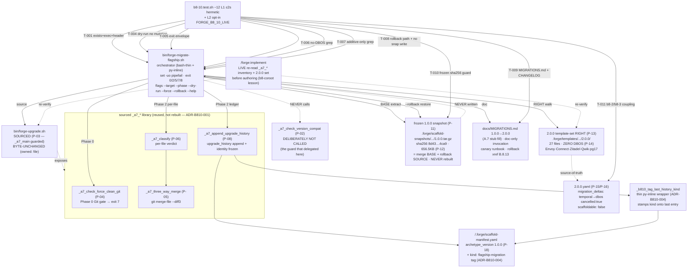

# Design: b8-10-migrate-flagship

<!-- Status: designed -->
<!-- Schema: default -->
<!-- Audit: B.8.10 (b8-10-migrate-flagship) — flagship 1.0.0→2.0.0 migration
     orchestrator. PURE TOOLING: no external version pins. The verify-then-pin
     equivalent is the LIVE on-disk re-read of bin/forge-upgrade.sh internals,
     the 2.0.0 template-set, and the frozen snapshot (evidence.md P-01..P-27,
     read 2026-06-03). GROUND-TRUTH (Article III.4): (1) the exit-7 [NEEDS
     MIGRATION:] abort is ALREADY BUILT (_a7_check_version_compat, P-02) — this
     brick fills the OTHER side (the script + MIGRATIONS.md); (2) NO DBOS leg —
     the 2.0.0 set has zero DBOS files (P-13/P-14), the delta is cancelled:true
     (P-15); (3) ADDITIVE-ONLY — never removes Kong/Temporal/REST (B.8.14); (4)
     rollback target is the byte-frozen B.8.2 snapshot, never rebuilt (P-11);
     (5) pure tooling — no standard bump (T5.1 precedent). -->

**Agent**: Atlas (Infra Architect — owns `bin/` tooling + migration orchestration).
**Live evidence**: on-disk re-read 2026-06-03; full provenance in `evidence.md`
(P-01..P-27). The `_a7_*` inventory and the 2.0.0 template-set list are **re-read
LIVE at `/forge:implement`** before any line of the script is authored (b8-coroot
lesson — verify-then-pin runs live at implement, not trusted from this transcript).
**Scope reminder**: this is the DESIGN phase. It ships **no script file, no
MIGRATIONS.md section, no harness, and no `forge-upgrade.sh` edit**. It is the
normative blueprint the impl phase realizes. The five decisions below
(ADR-B810-001..005) are encoded; the matching Q entries are flipped to answered in
`open-questions.md`. **No self-approval** — independent review follows before
`/forge:plan`.

**CENTRAL FINDING (exit-envelope correction, Article III.4)**: live re-read of the
`forge-upgrade.sh` docblock (P-01) shows A.7 uses `0/2/5/7/8` and **never uses `1`**.
The specs.md lean was `0/1/2/7`. ADR-B810-002 ALIGNS to A.7's exact envelope so a
delegated `_a7_three_way_merge` conflict surfaces as the same exit-8 the merge engine
already returns, rather than an invented exit-1. This is a design refinement of the
spec lean, recorded in `open-questions.md` Q-002 — not a contradiction.

---

## Architecture Decisions

### ADR-B810-001 — Overlay engine: SOURCE forge-upgrade.sh, reuse the `_a7_*` library (resolves Q-004)

**Context**: Q-004 — delegate the per-file 3-way merge to `forge-upgrade.sh`'s engine
vs build a dedicated render path; and how the 2.0.0 template-set is located as the
merge RIGHT. Resolved at `/forge:design` from a full live re-read of the file
(evidence.md P-02..P-10).

**Findings**:
1. `_a7_main` runs **only on direct invocation** (`[[ "${BASH_SOURCE[0]}" == "${0}" ]]`,
   P-03). Sourcing the file exposes the `_a7_*` library with **no side effects** — the
   file is safely sourcable.
2. The engine is already complete: `_a7_check_force_clean_git` (P-04, Git gate),
   `_a7_resolve_owned_paths` (P-07, merge surface), `_a7_classify` (P-06, per-file
   verdict), `_a7_three_way_merge` (P-05, `git merge-file --diff3`), `_a7_record_conflict`
   (conflict ledger), `_a7_append_upgrade_history` (P-08, manifest ledger).
3. `_a7_main` itself recovers BASE from `1.0.0.tar.gz` and sets RIGHT = `$FORGE_REPO_ROOT/<rel>`
   (P-10). The migration only needs to **redirect RIGHT** to the 2.0.0 template-set.

**Decision**: `bin/forge-migrate-flagship.sh` **`source`s `bin/forge-upgrade.sh`** (safe —
P-03) and orchestrates the existing `_a7_*` functions. It is an **orchestration layer, not a
new merge implementation**. Concretely:
- **Merge BASE** = the frozen `1.0.0.tar.gz` extracted into a `mktemp -d` (same recovery
  shape as `_a7_main`, P-10) — the byte-frozen B.8.2 snapshot (P-11).
- **Merge RIGHT** = the rendered **2.0.0 template-set**, rooted at
  `$FORGE_REPO_ROOT/.forge/templates/archetypes/full-stack-monorepo/2.0.0/` (P-13, the 27-file
  set). The script computes the overlay relpaths by walking that 2.0.0 root (NOT
  `_a7_resolve_owned_paths` against `framework-owned-paths.yml` — see Consequence below) and
  classifies each via `_a7_classify` (LEFT = `<target>/<mapped-rel>`, BASE = `<base>/<mapped-rel>`,
  RIGHT = `<2.0.0-root>/<rel>`).
- **Merge LEFT** = the adopter's target tree (the 1.0.0 project).
- **DELIBERATELY NOT** calling `_a7_check_version_compat` (P-02) — that guard is exactly what
  delegated control here; re-calling it would re-abort with exit-7.

**Path-mapping note (the RIGHT-selection sub-problem of Q-004)**: the 2.0.0 template tree is a
framework-internal authoring layout (`2.0.0/frontend/web-public/…`, `2.0.0/infra/…`). The
adopter target uses the scaffolded project layout (`frontend/web-public/…`, `infra/…`). The
script maps each 2.0.0 relpath to its target relpath by **stripping the `2.0.0/` prefix and
applying the schema layer paths** (P-16 layers: `backend/`, `frontend/`, `infra/`, `shared/`).
`_a7_resolve_owned_paths` is **NOT** reused for RIGHT selection because it resolves the
framework's OWN `.forge/templates/**` mirror (P-21), not the rendered overlay surface — using it
would mis-target. `_a7_classify` + `_a7_three_way_merge` ARE reused per-file (the actual merge),
which is where the "no second merge engine" guarantee holds.

**Consequences**: one merge engine, zero duplication of `git merge-file` logic
(FR-B810-033 satisfied). The script body contains no `git merge-file` call of its own — only
the sourced `_a7_three_way_merge`. Harness FR-B810-074/075 (no-DBOS / additive-only static
greps) operate on the orchestration body, which has no destructive ops.

**Compliance**: Article III.4 (engine reused, not fabricated — P-02..P-10); FR-B810-033;
NFR-B810-001 (zero new dep — `git merge-file` is already an A.7 dependency).

---

### ADR-B810-002 — Exit-code envelope + flag set: ALIGN to A.7 (0/2/5/7/8) (resolves Q-002)

**Context**: Q-002 — final exit-code values + `--rollback`/`--phase` interaction. Resolved at
`/forge:design` from the live docblock (evidence.md P-01) and the `_a7_main` arg loop (P-09).

**Lean-falsification (Article III.4)**: the specs.md lean was `0/1/2/7`. P-01 shows A.7 uses
`0/2/5/7/8` and **never uses `1`**. Because Phase 2 delegates the merge to `_a7_three_way_merge`
(which surfaces conflicts as `_a7_main`'s exit-8) and depends on the same tools (`git`/`python3`/
`tar`, exit-5), aligning to A.7 keeps the two scripts' exit semantics identical for an adopter
who runs `forge upgrade` then `forge-migrate-flagship`.

**Decision — exit envelope (ALIGNED to A.7)**:
- `0` — success (migration applied, dry-run complete, rollback complete, or `--help`).
- `2` — usage/argument error (missing `--target`, unknown flag, target dir absent).
- `5` — missing required tool (`git` / `python3` / `tar` / `shasum`).
- `7` — precondition not met (target not a 1.0.0 full-stack-monorepo; dirty Git tree without
  `--force`; frozen-snapshot sha256 mismatch).
- `8` — overlay produced merge conflicts without `--force` (the `_a7_three_way_merge` conflict
  path, mirroring `_a7_main:380-382`).

**Decision — flags** (mirrors P-09 shape, minus `--to-version`, plus `--phase`/`--rollback`):
- `--target <dir>` (required).
- `--phase <0|1|2|all>` (default `all`).
- `--dry-run` (default-safe: prints the plan, mutates nothing — NFR-B810-010).
- `--force` (override the Git-clean gate; also accept conflicts as overwrite, mirroring A.7).
- `--rollback` (restore from the frozen 1.0.0 snapshot).
- `--help` / `-h` (usage + exit 0).

**Decision — `--rollback`/`--phase` interaction (Q-002 sub-2)**: **mutually exclusive**.
`--rollback` restores the FULL frozen snapshot and ignores `--phase` (emits a warning on stderr
if both are passed: `forge-migrate-flagship: --phase ignored with --rollback (full-snapshot
restore only)`). Phase-scoped rollback is deferred to B.8.13's runbook. `--rollback --dry-run`
is always safe (prints the restore plan, exit 0 — FR-B810-043).

**Consequences**: harness FR-B810-073 asserts `no --target → 2`, `--help → 0`, `non-1.0.0
target → 7`, `--phase 3 → 0`. The script's `--help` exit-code table documents `0/2/5/7/8`
(FR-B810-008). The conflict path returns 8 (not the spec-lean 1).

**Compliance**: Article III.4 (envelope from P-01, not fabricated); FR-B810-004/005/008;
ADR alignment recorded in open-questions Q-002.

---

### ADR-B810-003 — CLI surface: doc-only invocation; TS subcommand deferred (resolves Q-001)

**Context**: Q-001 — doc-only `bash bin/forge-migrate-flagship.sh` vs a `forge migrate-flagship`
TS commander subcommand. Resolved at `/forge:design`.

**Decision: doc-only for B.8.10** (lean confirmed). `docs/MIGRATIONS.md` documents
`bash bin/forge-migrate-flagship.sh --target . --dry-run` as the canonical invocation. **No
`cli/src/commands/migrate-flagship.ts` is created**, no commander registration. A
`forge migrate-flagship` TS subcommand is **DEFERRED to B.8.15** (the `forge upgrade` matrix
brick), where the CLI surface is stabilised alongside the `forge upgrade` subcommand it sits next
to. Rationale: the migration is an opt-in power-user tool, not a day-to-day command; doc-only is
the smallest viable change and avoids CLI churn before the 2.0.0 archetype is scaffoldable
(P-16); it mirrors the doc-only `bin/` posture of `bin/forge-sbom.sh` and `bundle.sh` (P-20).

**Consequences**: FR-B810-053/051 — MIGRATIONS.md carries the `bash bin/forge-migrate-flagship.sh`
invocation form; the exit-7 `[NEEDS MIGRATION:]` message (already pointing at `docs/MIGRATIONS.md`,
P-02) is the discovery path. **No fabricated TS commander code** (Article III.4).

**Compliance**: FR-B810-051/053; Article III.4 (no fabricated TS surface); IV (additive — one
doc section, no CLI mutation).

---

### ADR-B810-004 — Ledger: reuse `_a7_append_upgrade_history`, wrap with a `kind` tag (resolves Q-003)

**Context**: Q-003 — reuse `upgrade_history` with a `kind` marker vs a parallel
`migration_history` block. Resolved at `/forge:design` from the helper's observed shape
(evidence.md P-08).

**Decision: reuse `upgrade_history` with `kind: flagship-migration`** (lean confirmed), via the
**least-invasive wrap** — do NOT edit the A.7 helper (it is an `owned:` framework file, P-21, and
must stay byte-unchanged). The script:
1. Calls the sourced `_a7_append_upgrade_history "$manifest" "1.0.0" "2.0.0" "$from_sha" "$to_sha"
   "$C_UNC" "$C_UPG" "$C_PRS" "$C_CNF" "$C_SKP" "$cli_version"` (P-08 signature) — appends the
   standard entry and freezes identity fields.
2. Immediately runs a **thin post-append Python-inline wrapper** (`_b810_tag_last_history_kind
   <manifest>`) that re-opens the manifest, stamps `kind: flagship-migration` onto the LAST
   `upgrade_history` entry, and `yaml.safe_dump`s it back (same dump shape as P-08:
   `default_flow_style=False, sort_keys=True`).

This adds the marker without touching `forge-upgrade.sh` and without a parallel ledger key
(which `a7.test.sh` does not expect). Only on a real Phase 2 apply (NOT `--dry-run`). The
`date` field inherits `_a7_append_upgrade_history`'s UTC ISO; when `SOURCE_DATE_EPOCH` is set,
the wrapper overrides `date` deterministically (FR-B810-007 / NFR-B810-005) using
`os.environ.get("SOURCE_DATE_EPOCH")` (P-19 pattern).

**Consequences**: FR-B810-060 (one new `upgrade_history` entry with `kind: flagship-migration`);
FR-B810-061 (identity fields frozen — `_a7_append_upgrade_history` already does this, P-08, and
the wrapper touches only `kind`/`date`); FR-B810-062 (append-only — re-running Phase 2 yields a
second entry). `forge-upgrade.sh` is byte-unchanged (an `owned:` file).

**Compliance**: Article III.4 (helper signature quoted from P-08, wrapper additive); IV (no edit
to the A.7 helper); FR-B810-060/061/062; NFR-B810-005.

---

### ADR-B810-005 — Phase 2 canary: document-only, no auto-wiring (resolves Q-005)

**Context**: Q-005 — emit per-route Kong→Envoy canary config vs document it. Resolved at
`/forge:design`.

**Decision: document-only** (lean confirmed). Phase 2 applies the Envoy Gateway overlay
templates (the 6 `2.0.0/infra/k8s/envoy-gateway/` files, P-13) but **generates no per-route
canary traffic weights**. The script prints canary-by-route Kong→Envoy guidance in its Phase 2
stdout (a "canary cutover" note block) and `docs/MIGRATIONS.md` carries the manual runbook with
example `HTTPRoute` weight snippets. Rationale: a complete canary needs Envoy SecurityPolicy/JWT
OIDC wiring, which is **B.8.12**; auto-wiring a partial canary without OIDC would emit an invalid
intermediate config. No auto-wiring.

**Consequences**: FR-B810-034 — Phase 2 produces no canary weight/route-split config; MIGRATIONS.md
contains a "canary" section referencing the manual process + the B.8.12 wiring deferral.

**Compliance**: FR-B810-034; Article IV (additive doc); VIII.1 (Kong preserved — canary is
adopter-driven, never auto-removes Kong).

---

## Script Phase-by-Phase Pseudo-Structure (impl deliverable, NOT created here)

`bin/forge-migrate-flagship.sh` — bash-thin + Python-inline, `set -uo pipefail`, mirrors
`bundle.sh`/`forge-sbom.sh` (P-19/P-20). The source-and-orchestrate flow:

```
#!/usr/bin/env bash
# Forge — `forge-migrate-flagship` 1.0.0 → 2.0.0 flagship migration orchestrator
# <!-- Audit: B.8.10 (b8-10-migrate-flagship) -->
#   Usage / Exit-codes (0/2/5/7/8, ADR-B810-002) / Determinism (SOURCE_DATE_EPOCH) /
#   Pattern (bash-thin + Python 3 inline; mirrors bin/forge-sbom.sh / bundle.sh)
set -uo pipefail                                            # FR-B810-003

SCRIPT_DIR="$(cd "$(dirname "${BASH_SOURCE[0]}")" && pwd)"
FORGE_REPO_ROOT="${FORGE_REPO_ROOT:-$(cd "$SCRIPT_DIR/.." && pwd)}"
TPL_20="$FORGE_REPO_ROOT/.forge/templates/archetypes/full-stack-monorepo/2.0.0"   # RIGHT root (P-13)
SNAP="$FORGE_REPO_ROOT/.forge/scaffold-snapshots/full-stack-monorepo/1.0.0.tar.gz"  # BASE+rollback (P-11)
SNAP_SHA="$FORGE_REPO_ROOT/.forge/scaffold-snapshots/full-stack-monorepo/1.0.0.sha256"

# Source the A.7 engine — SAFE (_a7_main guarded to direct-invocation only, P-03).
# shellcheck source=bin/forge-upgrade.sh
source "$SCRIPT_DIR/forge-upgrade.sh"                       # ADR-B810-001

err()   { echo "forge-migrate-flagship: $*" >&2; }
usage() { cat <<EOF ... EOF }                              # FR-B810-008 (exit-code table 0/2/5/7/8)

# ── arg parse (while/case; bundle.sh shape, P-19) ──        # FR-B810-004
#   --target <dir> (req) / --phase <0|1|2|all> / --dry-run / --force / --rollback / --help|-h
#   missing --target or absent dir → err + exit 2
#   unknown flag → err + exit 2
#   --rollback + --phase both → warn "--phase ignored with --rollback"  (ADR-B810-002)

# ── tool preflight ──                                        # exit 5 (P-01 alignment)
command -v git python3 tar >/dev/null  || { err "git/python3/tar required"; exit 5; }

# ── _b810_phase0_preflight <target> ──                      # FR-B810-010..014
#   read <target>/.forge/scaffold-manifest.yaml (python3 inline, P-18):
#     archetype == full-stack-monorepo  AND  archetype_version == 1.0.0  else exit 7
#   _a7_check_force_clean_git "$target"  (sourced, P-04) unless --force → exit 7 on dirty
#   verify sha256(SNAP) == content(SNAP_SHA)  (shasum/sha256sum)  else exit 7   (FR-B810-012)
#   --dry-run: print plan {target, from 1.0.0, to 2.0.0, phases, 5 deltas} and RETURN (no mutation)

# ── _b810_phase1_obs_contracts <target> ──                  # FR-B810-020..022
#   assert-or-apply: obs trio (B.8.8, P-27 already closed) + Connect codegen present
#   present → no-op (idempotent); absent → overlay the missing file via _a7_classify path
#   --dry-run: print present/missing, no mutation

# ── _b810_phase2_overlay <target> ──                        # FR-B810-030..035
#   base_dir=$(mktemp -d); tar -xzf "$SNAP" -C "$base_dir"   # BASE = frozen 1.0.0 (P-10/P-11)
#   for rel in $(find "$TPL_20" -type f | sed "s#$TPL_20/##"):     # RIGHT walk (P-13)
#       tgt_rel=$(_b810_map_2_0_0_relpath "$rel")            # strip 2.0.0/, schema layer map (P-16)
#       cls=$(_a7_classify "$target/$tgt_rel" "$base_dir/$tgt_rel" "$TPL_20/$rel")   # P-06
#       case cls in
#         unchanged) C_UNC++ ;;
#         upgraded)  dry? plan : cp "$TPL_20/$rel" "$target/$tgt_rel"; C_UPG++ ;;
#         preserved) C_PRS++ ;;
#         merge_candidate) dry? plan : (_a7_three_way_merge ... && C_UPG++ || { _a7_record_conflict; C_CNF++; }) ;;  # P-05
#         conflict_2way)   dry? plan : (force? cp:C_UPG++ : _a7_record_conflict:C_CNF++) ;;
#   # NO rm/rmdir/destructive-mv of Kong/Temporal/REST anywhere   (FR-B810-031, additive invariant)
#   # NO dbos overlay step — the 2.0.0 set has none (P-13/P-14)   (FR-B810-032, no-DBOS guard)
#   print canary-by-route Kong→Envoy guidance block (document-only, ADR-B810-005)   # FR-B810-034
#   not dry-run: _a7_append_upgrade_history(...) ; _b810_tag_last_history_kind "$manifest"   # ADR-B810-004
#   C_CNF>0 && !force → exit 8                                # FR-B810-005 (A.7 alignment)

# ── _b810_phase34_stub <n> ──                               # FR-B810-036
#   print "Phase <n> — T7 new archetypes / T8 deprecation — forward reference; see MIGRATIONS.md"
#   exit 0 informational; NO overlay, NO mutation

# ── _b810_rollback <target> ──                              # FR-B810-040..043
#   verify sha256(SNAP)==content(SNAP_SHA) else exit 7
#   --dry-run: print {SNAP path, sha256, files to restore}; exit 0   (FR-B810-043)
#   else: tar -xzf "$SNAP" -C "$target"  (restore; never writes SNAP/.sha256 — FR-B810-041)
#   exit 0

# ── dispatch ──
#   --rollback → _b810_rollback ; else per --phase: 0/1/2/all (Phase 0 always runs first as gate)
rc=$?; exit $rc                                              # P-19 envelope tail
```

**Key invariants encoded in the structure**: the script body has **no `git merge-file`** (only the
sourced `_a7_three_way_merge`, ADR-B810-001); **no `dbos` token** in any apply path (FR-B810-032);
**no `rm`/`rmdir`/destructive `mv`** on Kong/Temporal/REST paths (FR-B810-031); **no write** to
`scaffold-snapshots/` (FR-B810-041); `--dry-run` returns before any mutation in every phase
(NFR-B810-010).

---

## Component Diagram



---

## Sequence Diagram — adopter migration flow + rollback

```mermaid
sequenceDiagram
    participant Adopter
    participant Upgrade as forge upgrade<br/>(forge-upgrade.sh)
    participant CompatGuard as _a7_check_version_compat (P-02)
    participant Migrate as forge-migrate-flagship.sh
    participant A7 as sourced _a7_* lib
    participant Target as 1.0.0 project tree
    participant Snap as frozen 1.0.0.tar.gz (P-11)

    Adopter->>Upgrade: forge upgrade --target . --to-version 2.0.0
    Upgrade->>CompatGuard: _a7_check_version_compat 1.0.0 2.0.0
    CompatGuard-->>Adopter: stderr [NEEDS MIGRATION: from 1.0.0 to 2.0.0] + exit 7<br/>"see docs/MIGRATIONS.md"
    Note over Adopter: reads MIGRATIONS.md 1.0.0→2.0.0 (ADR-B810-003 doc-only)

    Adopter->>Migrate: bash bin/forge-migrate-flagship.sh --target . --dry-run
    Migrate->>A7: source forge-upgrade.sh (P-03 safe; _a7_main NOT run)
    Migrate->>Migrate: Phase 0 — manifest 1.0.0? (P-18) + git-clean + snapshot sha256
    Note over Migrate: --dry-run → print plan (5 deltas, phases), NO mutation
    Migrate-->>Adopter: exit 0 + structured plan

    Adopter->>Migrate: bash bin/forge-migrate-flagship.sh --target . --phase 2
    Migrate->>Snap: tar -xzf 1.0.0.tar.gz → mktemp BASE (P-10/P-11)
    loop each 2.0.0 RIGHT file (27, P-13 — ZERO DBOS)
        Migrate->>A7: _a7_classify(LEFT,BASE,RIGHT) (P-06)
        A7->>Target: upgraded→cp · merge_candidate→_a7_three_way_merge (P-05)
    end
    Note over Migrate,Target: additive-only — Kong/Temporal/REST untouched (FR-B810-031)<br/>print canary Kong→Envoy guidance (doc-only, ADR-B810-005)
    Migrate->>A7: _a7_append_upgrade_history (P-08) + _b810_tag_last_history_kind
    A7->>Target: upgrade_history += {kind: flagship-migration} · identity frozen
    Migrate-->>Adopter: exit 0 (or 8 if conflicts && !--force)

    opt rollback
        Adopter->>Migrate: bash bin/forge-migrate-flagship.sh --target . --rollback
        Migrate->>Snap: verify sha256 == .sha256 (P-11) else exit 7
        Note over Migrate,Snap: --rollback --dry-run → print restore plan, exit 0 (FR-B810-043)
        Migrate->>Target: tar -xzf 1.0.0.tar.gz → restore (NEVER writes snapshot, FR-B810-041)
        Migrate-->>Adopter: exit 0 — target == frozen 1.0.0
    end
```

---

## Testing Strategy

**Harness**: `.forge/scripts/tests/b8-10.test.sh`
**Level**: L1 (hermetic, ≤ 2 s, zero net/Docker/live-`forge init`) + L2 opt-in
(`FORGE_B8_10_LIVE=1`), mirroring b8-9 structure (P-22) + the b8-1 env-gate (P-23):
`--level` flag, `source _helpers.sh` (P-24), `run_test`/`print_summary`.
**Registration**: one line `"b8-10.test.sh --level 1"` appended to the `harnesses=()` loop in
`.github/workflows/forge-ci.yml` after the `b8-9.test.sh` line (P-26).

### L1 Assertion List (~12 L1 tests; ephemeral `mktemp -d` fixtures)

| # | FR / NFR | Assertion | Implementation |
|---|----------|-----------|----------------|
| T-001 | FR-B810-001/071 | script exists + executable + `Audit: B.8.10 (b8-10-migrate-flagship)` sentinel + `set -uo pipefail` | `[ -f ] && [ -x ]` + `grep -qF 'Audit: B.8.10 (b8-10-migrate-flagship)'` + `grep -qF 'set -uo pipefail'` |
| T-002 | FR-B810-002/008 | `--help` prints `--target` + exit-code table + exits 0 | `out=$(bash $SCRIPT --help); rc=$?; [ $rc -eq 0 ] && grep -qF '--target' <<<"$out"` |
| T-003 | FR-B810-006/NFR-B810-001 | zero new dep — script invokes only `git`/`python3`/`tar`/`shasum`/`sha256sum` (no `npm`/`cargo`/`pub`/3rd-party binary) | `grep -nE 'command -v|^[[:space:]]*(npm|cargo|pub|docker)\b'` on body → only allowed binaries |
| T-004 | FR-B810-014/072/NFR-B810-010 | `--dry-run` on a 1.0.0 fixture mutates nothing | fixture `mktemp -d` w/ valid `scaffold-manifest.yaml` (1.0.0) + `git init`; run `--dry-run`; `git -C fixture status --porcelain` empty |
| T-005 | FR-B810-005/073 | exit envelope: no `--target`→2, `--help`→0, non-1.0.0 target→7, `--phase 3`→0 | four invocations, assert `$?` per row (ephemeral fixtures) |
| T-006 | FR-B810-032/074/NFR-B810-008 | no-DBOS guard: body has no active `dbos`/`dbos-embedded`/`dbos_embedded` reference | `grep -vE '^[[:space:]]*#' $SCRIPT \| grep -iE 'dbos'` → zero matches |
| T-007 | FR-B810-031/075/NFR-B810-007 | additive-only guard: Phase 2 path has no `rm`/`rmdir`/destructive `mv` on Kong/Temporal/REST | `grep -nE '\b(rm|rmdir)\b\|mv .* /dev/null' $SCRIPT` against protected-path tokens → zero matches |
| T-008 | FR-B810-040/041/076 | rollback path references `scaffold-snapshots/full-stack-monorepo/1.0.0.tar.gz` AND body never WRITES `scaffold-snapshots/` | `grep -qF 'scaffold-snapshots/full-stack-monorepo/1.0.0.tar.gz'` + `! grep -nE '>[[:space:]]*.*scaffold-snapshots\|tar -c.*scaffold-snapshots'` |
| T-009 | FR-B810-050/051/077 | `docs/MIGRATIONS.md` has `1.0.0.*2.0.0` heading + `forge-migrate-flagship` + `scaffoldable.*false` + `B.8.13` xref + no `dbos` in rollback-criteria; `CHANGELOG.md` has `b8-10-migrate-flagship` (whole-file grep) | grep battery on MIGRATIONS.md + `grep -qF 'b8-10-migrate-flagship' CHANGELOG.md` |
| T-010 | FR-B810-012/077/NFR-B810-004 | frozen snapshot sha256 file present + contains `8d43…4ca9`; `1.0.0.tar.gz` present | `[ -f 1.0.0.sha256 ]` + `grep -qF '8d439b942bf81dbcc103e010d946504035dd410f613b31f673d7d691c3224ca9'` |
| T-011 | FR-B810-078/NFR-B810-003 | coupling guards: `b8-2.test.sh --level 1` exit 0 + `b8-3.test.sh --level 1` exit 0 | `bash b8-2.test.sh --level 1 >/dev/null 2>&1; [ $? -eq 0 ]` + same for b8-3 |
| T-012 | FR-B810-007/078/NFR-B810-005 | `SOURCE_DATE_EPOCH` determinism (static): body reads `os.environ.get("SOURCE_DATE_EPOCH")`; **L2 opt-in** (`FORGE_B8_10_LIVE=1`) live dry-run on a real `forge init` 1.0.0 tree, else skip-pass | `grep -qF 'SOURCE_DATE_EPOCH'` (L1) + L2 env-gate (P-23): unset → `echo "SKIP: FORGE_B8_10_LIVE not set"`, return 0 |

**~12 L1 tests.** All file-existence / grep / stat / exit-code on ephemeral fixtures or static
script-body greps. No network, no Docker, no live `forge init` at L1. **Budget ≤ 2 s**
(two sub-harness exit-code calls for T-011 — consistent with b8-9 strategy, P-22).

### FR Traceability Table (all 44 FRs + 10 NFRs)

| FR / NFR | Design element | Harness |
|----------|----------------|---------|
| FR-B810-001 | script created + executable (script structure) | T-001 |
| FR-B810-002 | bash-thin header + `Audit: B.8.10` sentinel (P-19/P-20 pattern) | T-001, T-002 |
| FR-B810-003 | `set -uo pipefail` first executable stmt (P-19) | T-001 |
| FR-B810-004 | `while/case` arg parse (P-19); flags per ADR-B810-002 | T-005 |
| FR-B810-005 | exit envelope `0/2/5/7/8` (ADR-B810-002; P-01) | T-005 |
| FR-B810-006 | zero new dep (P-20/P-24) | T-003 |
| FR-B810-007 | `SOURCE_DATE_EPOCH`-deterministic ledger date (ADR-B810-004; P-19) | T-012 |
| FR-B810-008 | `--help`/`-h` usage + exit-code table + exit 0 | T-002 |
| FR-B810-010 | Phase 0 manifest `archetype`+`archetype_version==1.0.0` (P-18) | T-005 |
| FR-B810-011 | Git-clean gate via `_a7_check_force_clean_git` (ADR-B810-001; P-04) | T-005 (exit 7) |
| FR-B810-012 | Phase 0 snapshot sha256 verify (P-11) | T-010 |
| FR-B810-013 | structured `forge-migrate-flagship: <cat>: <msg>` exit-7 failures | T-005 |
| FR-B810-014 | `--dry-run` Phase 0 plan, no mutation (NFR-B810-010) | T-004 |
| FR-B810-020 | Phase 1 assert-or-apply obs trio + Connect (P-27 obs closed) | T-004 (dry-run present) |
| FR-B810-021 | Phase 1 idempotent no-op when present | T-004 |
| FR-B810-022 | Phase 1 `--dry-run` safe | T-004 |
| FR-B810-030 | Phase 2 applies 5 additive deltas from 2.0.0 RIGHT (P-13/P-15) | T-004 (plan), L2 |
| FR-B810-031 | additive invariant — no Kong/Temporal/REST removal (P-17) | T-007 |
| FR-B810-032 | no-DBOS guard — no `dbos` apply term (P-13/P-14/P-15) | T-006 |
| FR-B810-033 | merge delegates to `_a7_*` — no 2nd engine (ADR-B810-001; P-05) | T-006/T-007 (no own merge-file) |
| FR-B810-034 | canary document-only, no auto-wire (ADR-B810-005) | T-009 (MIGRATIONS canary) |
| FR-B810-035 | Phase 2 `--dry-run` safe | T-004 |
| FR-B810-036 | Phase 3/4 forward-ref stubs, exit 0 | T-005 (`--phase 3 → 0`) |
| FR-B810-040 | `--rollback` restores from frozen snapshot (P-11) | T-008 |
| FR-B810-041 | never rebuilds/overwrites snapshot or `.sha256` (P-11) | T-008 |
| FR-B810-042 | rollback help + MIGRATIONS xref B.8.13; no `dbos` criterion | T-009 |
| FR-B810-043 | `--rollback --dry-run` safe, exit 0 | T-004/T-008 |
| FR-B810-050 | MIGRATIONS.md 1.0.0→2.0.0 section (A.7 stub fill) | T-009 |
| FR-B810-051 | exit-7 message → MIGRATIONS.md; `forge-migrate-flagship` present (P-02) | T-009 |
| FR-B810-052 | Phase 3/4 stubs in MIGRATIONS.md (T7/T8) | T-009 |
| FR-B810-053 | doc-only invocation `bash bin/forge-migrate-flagship.sh` (ADR-B810-003) | T-009 |
| FR-B810-054 | `scaffoldable: false`-until-B.8.14 caveat in MIGRATIONS.md (P-16) | T-009 |
| FR-B810-060 | `upgrade_history` += entry with `kind: flagship-migration` (ADR-B810-004; P-08) | L2 (live apply) |
| FR-B810-061 | identity fields frozen (P-08/P-18) | L2 |
| FR-B810-062 | append-only (P-08) | L2 |
| FR-B810-070 | harness hermetic ≤ 2 s + CI registration (P-22/P-26) | testing strategy |
| FR-B810-071 | harness asserts exists+exec+audit header+`set -uo pipefail` | T-001 |
| FR-B810-072 | harness asserts `--dry-run` no mutation on fixture | T-004 |
| FR-B810-073 | harness asserts phase selection + exit envelope | T-005 |
| FR-B810-074 | harness no-DBOS static grep | T-006 |
| FR-B810-075 | harness additive-only static grep | T-007 |
| FR-B810-076 | harness rollback-path + no-snapshot-write grep | T-008 |
| FR-B810-077 | harness MIGRATIONS.md + CHANGELOG + frozen-1.0.0 guard | T-009, T-010 |
| FR-B810-078 | harness b8-2/b8-3 coupling + L2 opt-in (P-23) | T-011, T-012 |
| NFR-B810-001 | zero new external dep (P-20/P-24) | T-003 |
| NFR-B810-002 | L1 ≤ 2 s hermetic | testing strategy |
| NFR-B810-003 | full ~49-harness suite GREEN pre-push (full_harness_suite lesson) | implementation note |
| NFR-B810-004 | frozen 1.0.0 byte-identity (b8-2 guard) | T-010, T-011 |
| NFR-B810-005 | `SOURCE_DATE_EPOCH` determinism | T-012 |
| NFR-B810-006 | no standard bump (T5.1 precedent) | implementation note (diff `.forge/standards/`) |
| NFR-B810-007 | VIII.1 Kong preserved (additive) | T-007 |
| NFR-B810-008 | VIII.2 Temporal preserved (no DBOS) | T-006 |
| NFR-B810-009 | independent review before /forge:plan + pre-archive | not self-approved here |
| NFR-B810-010 | `--dry-run` default-safe across all phases + rollback | T-004 |

### TDD Order (Article I RED → GREEN)

1. **RED**: commit `b8-10.test.sh` with all ~12 assertions before the script/MIGRATIONS.md exist.
   T-001..T-012 fail immediately (no script, no doc, no CHANGELOG entry).
2. **GREEN — script skeleton + arg parse + exit envelope**: author `bin/forge-migrate-flagship.sh`
   header + `set -uo pipefail` + `while/case` + `--help`. T-001/T-002/T-003/T-005 green.
3. **GREEN — source-and-orchestrate + Phase 0/1/2**: source `forge-upgrade.sh`; wire the phase
   functions per ADR-B810-001. **LIVE re-read** the `_a7_*` inventory + 2.0.0 set first
   (b8-coroot). T-004/T-006/T-007 green.
4. **GREEN — rollback + ledger wrapper**: `_b810_rollback` + `_b810_tag_last_history_kind`. T-008 green.
5. **GREEN — MIGRATIONS.md + CHANGELOG**: author the 1.0.0→2.0.0 section + `[Unreleased]` entry
   anchored `b8-10-migrate-flagship`. T-009/T-010 green.
6. **GREEN — CI registration**: append `"b8-10.test.sh --level 1"` to `forge-ci.yml`. T-011 green.
7. **POST-flip re-run** (NFR-B810-003): after status flips, re-run the full ~49-harness suite
   (mirror forge-ci loop) + b8-2/b8-3 coupling (shared_standard_sibling_harness lesson).

---

## Standards Applied

| Standard | Role in this change |
|----------|---------------------|
| `global/open-questions.md` | Q-001..Q-005 resolved → ADR-B810-003/002/004/001/005 (independent reviewer ratifies before `/forge:plan`) |
| `global/source-document-pinning.md` | Provenance table in `evidence.md` (P-01..P-27, file:line + read date + what it proves — internal-file evidence, not URLs) |
| `scaffolding.md` | `N.N.N/` subtree skip convention — the 2.0.0 RIGHT walk reads the versioned subtree; repo-wide scanners exempt it |
| `global/forge-self-ci.md` | Harness registration (declarative loop, ≤ 300-line CI budget; P-26) |

**No standard is created or bumped.** This brick is **pure tooling** — no `.forge/standards/*.yaml`
edit; `constitution_version: 1.1.0` unchanged. **The T5.1 no-standard-bump precedent applies
explicitly**: like T5.1 (and unlike B.8.4/5/6/7/9 which each created or bumped a standard),
B.8.10 ships a `bin/` script + a doc section + a harness only, consuming existing standards and
templates as inputs. NFR-B810-006 verifies this by diffing `.forge/standards/` before and after.

**Files authored at impl**: `bin/forge-migrate-flagship.sh` (new), `docs/MIGRATIONS.md`
(1.0.0→2.0.0 section — A.7 stub fill), `.forge/scripts/tests/b8-10.test.sh` (new),
`.github/workflows/forge-ci.yml` (+1 harness line), `CHANGELOG.md` (+1 `[Unreleased]` entry).
**Files NOT touched**: `bin/forge-upgrade.sh` (sourced, byte-unchanged — `owned:` file, P-21),
`.forge/scaffold-snapshots/**` (frozen, read-only — P-11), the 2.0.0 template-set (read-only
RIGHT — P-13), `.forge/schemas/**`, `.forge/standards/**`, the Constitution.

---

## Constitutional Compliance Gate

- **Article I (TDD RED-first)**: `b8-10.test.sh` is committed with all ~12 assertions BEFORE the
  script/MIGRATIONS.md exist (TDD Order step 1). T-001..T-012 fail RED, then turn GREEN per the
  order. No production line precedes its test.

- **Article III.1/III.2 (Specs before code)**: design follows specs (both in
  `.forge/changes/b8-10-migrate-flagship/`); the script, MIGRATIONS.md section, and harness are
  authored only after this design.

- **Article III.4 (Anti-Hallucination) — CENTRAL**: every `forge-upgrade.sh` internal cited in
  the ADRs traces to a quoted `file:line` provenance row (evidence.md P-01..P-10). No `_a7_*`
  function name is invented beyond the inventory. The exit envelope `0/2/5/7/8` is read from the
  docblock (P-01), correcting the spec-lean `0/1/2/7` (the unused `1`). The no-DBOS constraint is
  a `grep -ril 'dbos'` rc=1 fact (P-14) + a `cancelled: true` schema fact (P-15), not an
  assumption. The frozen sha256 (P-11) and snapshot size 656.5 KB (P-12, drift vs 422 KB) are
  on-disk reads. The 2.0.0 set is 27 files (P-13, drift vs the brief's "26"). The
  source-not-reimplement decision (ADR-B810-001) is grounded in the sourcing guard P-03 — the
  script does NOT fabricate a second merge engine.

- **Article IV (Delta-based)**: the script + MIGRATIONS.md section + harness + CHANGELOG entry +
  CI line are all ADDITIVE. `forge-upgrade.sh` is sourced byte-unchanged. The frozen snapshot and
  the 2.0.0 template-set are read-only inputs. The `upgrade_history` ledger append is append-only
  with identity fields frozen (P-08). No spec rewrite, no schema mutation.

- **Article V (Compliance gate)**: ADR-B810-001..005 encode all five resolved open questions; no
  work proceeds around an unresolved question. The full ~49-harness suite + b8-2/b8-3 coupling
  re-run is mandated POST-flip (NFR-B810-003; full_harness_suite + shared_standard_sibling
  lessons).

- **Article VIII.1 (Kong SHALL — IN FORCE, PRESERVED)**: Phase 2 adds Envoy in parallel and
  **never removes Kong** (FR-B810-031 additive invariant; T-007 static guard). The scaffolded
  default stays Kong; 2.0.0 stays `scaffoldable: false` until B.8.14 (P-16). Canary is
  document-only and adopter-driven (ADR-B810-005). No violation.

- **Article VIII.2 (Temporal SHALL — IN FORCE, PRESERVED)**: **no DBOS leg** — the 2.0.0
  template-set has zero DBOS files (P-13/P-14), the `temporal→dbos` delta is `cancelled: true`
  (P-15, B8O/ADR-B8O-001), Temporal remains the Rust orchestrator. FR-B810-032 + T-006 enforce
  the negative guard. No violation.

- **Article VIII.5 (IaC)**: the overlays Phase 2 applies are declarative templates already under
  version control (the 2.0.0 set, P-13). No imperative deploy is committed.

- **Article XII (Governance)**: no Constitution amendment in B.8.10; `constitution_version: 1.1.0`
  unchanged. The breaking removal + VIII.1/VIII.2 amendment is explicitly B.8.14. No standard bump
  (T5.1 precedent; NFR-B810-006). No governance change.

**No violations. Gate PASS** (subject to independent review — NOT self-approved here).

---

## Anti-Hallucination Pass (Design Phase)

- **`forge-upgrade.sh` internals are quoted, not assumed** (central): every `_a7_*` function in
  ADR-B810-001/002/004 cites a `file:line` row in evidence.md (P-02..P-10). The sourcing guard
  P-03 is the basis for the source-and-orchestrate decision. **No `_a7_*` function name is
  fabricated** beyond the inventory listed in evidence.md's anti-hallucination pass.

- **Exit envelope corrected from live evidence, not spec lean** (critical): the spec leaned
  `0/1/2/7`; P-01 shows A.7 uses `0/2/5/7/8` and never `1`. ADR-B810-002 aligns to the live fact.
  This is a deliberate refinement, recorded in open-questions Q-002, not a silent contradiction.

- **No-DBOS / additive-only / frozen-snapshot are HARD constraints, not design-open**:
  FR-B810-032 (no DBOS) is grounded in the empty `grep -ril 'dbos'` over the 2.0.0 tree (P-14) +
  `cancelled: true` (P-15); FR-B810-031 (no removal) in the constitutional prohibition header
  (P-17); FR-B810-041 (no snapshot overwrite) in the B.8.2 freeze (P-11). These are unconditional
  invariants, not ADR-open.

- **The RIGHT-selection path-mapping is explicit, not hand-waved**: ADR-B810-001 records that the
  2.0.0 internal authoring layout (`2.0.0/<layer>/…`) maps to the scaffolded target layout via the
  schema layer paths (P-16), and that `_a7_resolve_owned_paths` is NOT used for RIGHT selection
  (it resolves the framework's own `.forge/templates/**` mirror, P-21, which would mis-target).

- **The ledger wrapper does not edit the A.7 helper**: ADR-B810-004 stamps `kind` via a separate
  post-append python-inline (`_b810_tag_last_history_kind`), leaving `_a7_append_upgrade_history`
  (P-08) and `forge-upgrade.sh` byte-unchanged (an `owned:` file).

- **No fabricated TS commander surface**: ADR-B810-003 is doc-only; no `cli/src/commands/
  migrate-flagship.ts` path or commander registration is asserted (deferred to B.8.15).

- **Doc-drift surfaced, not propagated**: snapshot size 656.5 KB live vs 422 KB in NFR-UP-003
  (P-12); 27 template files live vs "26" in the brief (P-13). Both flagged; live figures
  authoritative.

- **Independent review required (NFR-B810-009)**: this design is NOT self-approved. The
  Constitutional Compliance Gate PASS above is the author's assessment; an independent reviewer
  ratifies before `/forge:plan`. The LIVE re-read of the `_a7_*` inventory + 2.0.0 set runs at
  `/forge:implement` (b8-coroot lesson) before any script line is authored.

---

## Open Items / [NEEDS CLARIFICATION]

- **None blocking design.** All five maintainer-resolved decisions are encoded
  (ADR-B810-001..005). Carried items are deliberate live-verify steps at `/forge:implement`:

  1. **LIVE re-read of `forge-upgrade.sh` `_a7_*` inventory** (ADR-B810-001): re-confirm the
     sourcing guard (P-03) and the `_a7_*` signatures (P-02..P-10) before sourcing; if A.7 was
     refactored, re-validate the source-and-orchestrate contract.
  2. **LIVE re-read of the 2.0.0 template-set** (ADR-B810-001): re-confirm the file list (P-13)
     and the zero-DBOS fact (P-14) before authoring the Phase 2 RIGHT walk.
  3. **The `_b810_map_2_0_0_relpath` mapping** (ADR-B810-001): the exact 2.0.0→target relpath map
     (strip `2.0.0/` + schema layer paths, P-16) is verified against a real `forge init` 1.0.0 tree
     at the L2 opt-in (`FORGE_B8_10_LIVE=1`) before the apply path is trusted.

- **Independent review follows** — this design is NOT self-approved. The note "maintainer decision
  pending INDEPENDENT reviewer ratification before /forge:plan" is recorded in `open-questions.md`.
