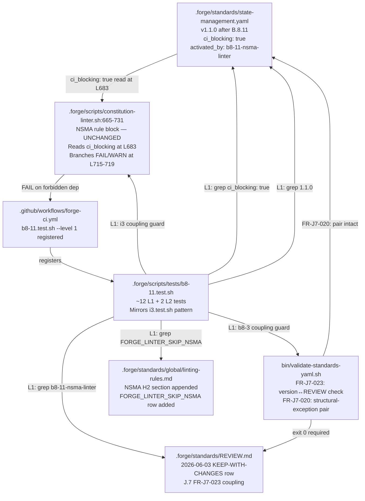
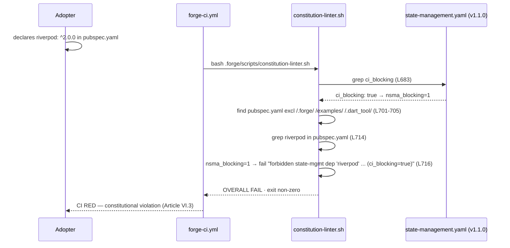

# Design: b8-11-nsma-linter

<!-- Status: designed -->
<!-- Schema: default -->
<!-- Audit: B.8.11 (b8-11-nsma-linter) — PURE GOVERNANCE/DATA change.
     No external version pins. The verify-then-pin equivalent is the LIVE
     on-disk re-read of constitution-linter.sh:665-731, state-management.yaml,
     and the governance standards (evidence.md P-01..P-25, read 2026-06-03).
     GROUND-TRUTH (Article III.4): (1) the NSMA rule ALREADY EXISTS and runs —
     the FAIL/WARN branch at L715-719 is keyed entirely on `ci_blocking:`; B.8.11
     is a DATA FLIP (ci_blocking: false → true), not a code change; (2) enforces
     an existing constitutional SHALL (VI.3 + ADR-006); (3) backward-compat by
     construction — zero scannable pubspec.yaml in live tree (P-21); (4) no
     pre-commit runner ships (Q-002 → keep false); (5) J.7 version↔REVIEW coupling
     active; (6) I.3 interlock must stay intact. -->

**Agent**: Hera (Flutter Team Orchestrator — quality gate lane).
**Live evidence**: on-disk re-read 2026-06-03; full provenance in `evidence.md`
(P-01..P-25). Live re-reads are performed again at `/forge:implement` before any
file is edited (b8-coroot lesson).
**Scope reminder**: this is the DESIGN phase. It ships **no edited file, no
harness, no CHANGELOG entry**. It is the normative blueprint the impl phase
realizes. The four decisions below (ADR-B811-001..004) are encoded; the matching
Q entries are updated in `open-questions.md`. **No self-approval** — independent
review follows before `/forge:plan`.

**CENTRAL FINDING**: flipping `state-management.yaml::enforcement.ci_blocking`
from `false` to `true` is the only code-equivalent action. The linter branch at
L715-719 (evidence.md P-03) reads this flag and routes to `fail` vs `warn`. The
WARN message even names the scheduled activation: "ci_blocking flips at B.8/T6".
B.8.11 is that flip. Git diff on `constitution-linter.sh` is expected to be empty
(FR-B811-043) or contain only an optional comment update.

---

## Architecture Decisions

### ADR-B811-001 — F.4 §1 amendment necessity (resolves Q-001)

**STATUS: RATIFICATION-PENDING (independent reviewer adjudicates — NOT self-ruled)**

**Context**: `global/linting-rules.md` §"Adding a new rule" (L173-190, evidence.md
P-13) states: "A rule MUST NOT be tightened (lower threshold, stricter heuristic)
without going through the same process." The §1-4 process requires: (1) Constitution
amendment (Article XII), (2) F.x change, (3) backward-compat audit, (4) update of
this standard. A warn→fail flip is literally a tightening of the NSMA rule.

**Analysis**:

The key question is whether the §1 "Constitution amendment" precondition is:
- **(a) Already satisfied**: Article VI.3 (evidence.md P-11) already mandates
  `flutter_bloc` exclusively and forbids alternatives "without explicit constitutional
  amendment." ADR-006 (P-12) prescribes `ci_blocking: true` as the target. The
  `activation_planned: "B.8 (T6)"` deferral was a temporary Q-001 Option A at
  v0.4.0-rc.1 — a deliberate scheduling decision, not a permission grant. The
  amendment that authorised the blocking gate ALREADY HAPPENED when VI.3 was
  ratified and when ADR-006 was ratified. B.8.11 is the F.x change (§2) that
  executes the scheduled activation, accompanied by §3 (backward-compat audit,
  P-21 and FR-B811-030..032) and §4 (linting-rules.md NSMA section, FR-B811-020..023).
  No fresh Article XII amendment is required because no NEW constitutional prohibition
  is being created — only the enforcement of an existing one is being machine-activated.
- **(b) Fresh amendment still required**: even though VI.3 mandates blocking, the
  linting-rules.md §1 protocol is a procedural gate that re-runs on every tightening
  event, regardless of underlying constitutional mandate. An Article XII amendment
  (7-day public discussion + BDFL ratification) must be filed before the flip. B.8.11
  would become a follow-on change to that amendment.

**Recommendation (author — NOT a decision)**: **(a) no new amendment**. The
grounds: VI.3 + ADR-006 constitute the pre-existing constitutional mandate; the
`activation_planned` field was an explicit scheduling marker, not a new prohibition
waiting for a future amendment; the blocked alternatives (Provider, Riverpod, GetX,
MobX, etc.) were already unconstitutional under VI.3 before the WARN-only state was
established; B.8.11 executes F.4 §2-4 against a §1 that was already satisfied at
the time `state-management.yaml` was first authored with its `linter_rule:
no-state-management-alternatives` field.

**Consequence of (a)**: design proceeds; implementation executes the data flip +
governance-doc updates; no Article XII process is initiated.
**Consequence of (b)**: B.8.11 STOPS immediately. The change routes to the Article
XII amendment process (GOVERNANCE.md § "Amendment Process", 7-day window + BDFL
ratification) before any file is edited. B.8.11 becomes a follow-on implementation
change to that amendment.

**REVIEWER OBLIGATION**: the independent reviewer MUST adjudicate (a) vs (b) as
their first act before ratifying this design. Self-approval of this question by the
author is prohibited (t5-2 self-validation lesson). The reviewer's ruling is recorded
in `open-questions.md` Q-001 Resolution Log.

**Compliance**: Article III.4 (Q-001 surfaced, not papered over); Article XII
(amendment process respected — reviewer determines applicability); ADR-006 (P-12).

---

### ADR-B811-002 — `pre_commit_hook` stays `false` (resolves Q-002)

**Context**: `state-management.yaml::enforcement.pre_commit_hook` is currently `false`
(evidence.md P-07 L13). Q-002 asks whether to flip it to `true` as part of the
B.8.11 activation alongside `ci_blocking`.

**Findings**:
1. The only pre-commit hook in the Forge repo is G.2's commit-msg scope hook
   (`git-workflow.md` — commit message format validation). No dep-linting pre-commit
   runner artifact exists: no `pre-commit`, `.hooks/`, or `git_hooks/dep-lint*` file.
2. Flipping `pre_commit_hook: true` without a shipped runner declares a contract that
   cannot be fulfilled — a documented gate that has no executor. Article III.4 (Anti-
   Hallucination) prohibits claiming a gate that has no runner.
3. The new-archetypes-plan.md B.8.11 description mentions "Pre-commit hook" but the
   ground-truth re-read (P-07) confirms no runner exists. Plan descriptions are
   aspirational; ground truth governs (Article III.4).

**Decision**: `pre_commit_hook` REMAINS `false`. A comment is added to the
`pre_commit_hook: false` line documenting that the dep-linting pre-commit runner is
G.2 territory and `pre_commit_hook: true` will be set when a runner artifact ships.
Only `ci_blocking` flips.

**Consequences**: FR-B811-005 satisfied (no phantom gate). `linting-rules.md` NSMA
section (FR-B811-020) notes that the CI gate (`constitution-linter.sh` via `forge-ci.yml`)
is the active enforcement mechanism; the pre-commit runner is deferred.

**Compliance**: Article III.4 (no hallucinated gate); FR-B811-005.

---

### ADR-B811-003 — Version bump `1.0.0 → 1.1.0` (resolves Q-003)

**Context**: `state-management.yaml` is at `version: "1.0.0"` (evidence.md P-22).
Q-003 asks the magnitude of the bump.

**Findings**:
1. B.8.11 changes: `enforcement.ci_blocking` (false→true), `enforcement.activation_planned`
   (remove), `enforcement.activated_by` (add), `last_reviewed` (date update), `version`
   (bump), in-file version-history comment (add). The `forbidden:` list, `flutter:`
   block, `linter_rule:`, `rationale:`, and structural-exception pair (`expires_at:
   never`, `exception_constitutional: true`) are byte-unchanged (P-08, P-09, P-10).
2. Forge standards SemVer convention: additive or enforcement changes take a minor bump;
   breaking structural changes take a major bump.
3. Precedent: `transport.yaml` (t5-connect-codegen) used a 1.0.0 → 1.1.0 minor bump
   (REVIEW.md:51-58, P-18 format evidence). NOTE (LOW-2 carry-fix): the precedent is
   transport.yaml, NOT identity.yaml — identity.yaml is still at v1.0.0; transport.yaml
   is the real KEEP-WITH-CHANGES v1.1.0 row.
4. The structural-exception pair (P-09) must survive intact; FR-J7-020 bidirectional
   guard applies.

**Decision**: `version: "1.0.0" → "1.1.0"` (minor bump). REVIEW.md entry:
`KEEP-WITH-CHANGES`, `Next review due: never (structural)`. An in-file version-history
comment block is added immediately below the `version:` line (FR-B811-011):

```yaml
# Version history:
#   1.0.0 (T.4, 2026-05-04) — initial ratification; enforcement deferred (ci_blocking: false)
#   1.1.0 (b8-11-nsma-linter, 2026-06-03) — ci_blocking activated; enforcement now CI-blocking
```

**Consequences**: J.7 FR-J7-023 coupling is satisfied (bumped version appears as a
REVIEW.md table row, FR-B811-012); `bin/validate-standards-yaml.sh` exits 0
(FR-B811-013). The structural-exception pair survives.

**Compliance**: FR-B811-010, FR-B811-011, FR-B811-012, FR-B811-013; J.7 FR-J7-023;
FR-J7-020.

---

### ADR-B811-004 — `activation_planned` resolution form (resolves Q-004)

**Context**: `state-management.yaml` has `activation_planned: "B.8 (T6)"` (evidence.md
P-07 L14). Q-004 asks the exact resolution form: `activated_by:` field, comment-only,
or silent delete.

**Findings**:
1. The `enforcement` object has `additionalProperties: true` in the schema (evidence.md
   P-19). An `activated_by:` sibling field is schema-legal alongside `ci_blocking` and
   `pre_commit_hook`.
2. Silent delete loses the audit trail (only preserved in git history). A comment-on-
   ci_blocking-line provides a human-readable trail but no machine-readable key.
3. An `activated_by:` field is symmetric with `activation_planned:` — the planned
   marker is replaced with the completed-activation marker; the enforcement block
   remains self-documenting.

**Decision**: `activation_planned: "B.8 (T6)"` is replaced with `activated_by:
"b8-11-nsma-linter (B.8.11, 2026-06-03)"`. The enforcement block after the edit:

```yaml
enforcement:
  ci_blocking: true   # activated B.8.11 (b8-11-nsma-linter, 2026-06-03) — formerly warn-only
  pre_commit_hook: false  # runner is G.2 territory; flip to true when dep-linting hook ships
  activated_by: "b8-11-nsma-linter (B.8.11, 2026-06-03)"
```

`grep "activation_planned" .forge/standards/state-management.yaml` → zero matches
(FR-B811-002 testable invariant).
`grep "b8-11\|B.8.11" .forge/standards/state-management.yaml` → at least one match
(FR-B811-002 audit trail invariant).

**Consequences**: clean YAML with a machine-readable audit field. `activation_planned`
is gone. The enforcement block is self-documenting without relying on git history.

**Compliance**: FR-B811-002; evidence.md P-19 (schema-legal); Article III.4 (no silent
delete of audit trail).

---

## Change Surface (per-file diff intent)

| File | Action | Intent |
|------|--------|--------|
| `.forge/standards/state-management.yaml` | EDIT | Flip `ci_blocking: false → true`; replace `activation_planned` with `activated_by`; add comment on `pre_commit_hook: false`; bump `version: "1.0.0" → "1.1.0"`; update `last_reviewed: 2026-06-03`; add in-file version-history comment block |
| `.forge/standards/REVIEW.md` | APPEND | New H2 section `2026-06-03 — Updated state-management.yaml to v1.1.0 (b8-11-nsma-linter)` with `KEEP-WITH-CHANGES` table row, `Next review due: never (structural)`, J.7 coupling note |
| `.forge/standards/global/linting-rules.md` | APPEND | New H2 section documenting NSMA rule: rule name, constitutional basis (VI.3 + ADR-006), warn→fail activation, FAIL message verbatim, backward-compat exclusions, opt-out; append `FORGE_LINTER_SKIP_NSMA=1` row to opt-out matrix |
| `.forge/scripts/tests/b8-11.test.sh` | CREATE | New harness (~12 L1 + 2 L2 tests); mirrors i3.test.sh structure |
| `.github/workflows/forge-ci.yml` | APPEND | One line `"b8-11.test.sh --level 1"` after the `b8-10.test.sh` entry |
| `CHANGELOG.md` | APPEND | `[Unreleased]` entry anchored `b8-11-nsma-linter` |
| `.forge/scripts/constitution-linter.sh` | NO CHANGE (or comment-only) | The NSMA rule block (L665-731) already honours `ci_blocking`; only the comment at L667-669 may be updated to reflect activated state; no new bash |

---

## Component Diagram



---

## Sequence Diagram — Adopter Declares Forbidden Dep



---

## Testing Strategy

**Harness**: `.forge/scripts/tests/b8-11.test.sh`
**Pattern**: mirrors `i3.test.sh` (evidence.md P-17): `--level` flag, `source _helpers.sh`,
`PASS/FAIL` counters, named test functions, `run_test`/`print_summary` in `main()`.
**Registration**: `"b8-11.test.sh --level 1"` in `forge-ci.yml` after `b8-10.test.sh`.

### L1 Assertion List (~12 tests; grep/stat/exit-code only; ≤ 2 s wall-clock)

| # | FR / NFR | Assertion | Implementation |
|---|----------|-----------|----------------|
| T-001 | FR-B811-001 | `state-management.yaml` has `ci_blocking: true` | `grep -E '^[[:space:]]+ci_blocking:[[:space:]]+true'` → exit 0 |
| T-002 | FR-B811-010 | `state-management.yaml` has `version: "1.1.0"` | `grep 'version: "1.1.0"'` → exit 0; `grep 'version: "1.0.0"'` → exit 1 |
| T-003 | FR-B811-002 | `activation_planned` absent | `grep "activation_planned"` → exit 1 |
| T-004 | FR-B811-002 | `b8-11` audit trail present | `grep -E "b8-11\|B\.8\.11"` → exit 0 |
| T-005 | FR-B811-004 | Structural-exception pair intact | `grep "expires_at: never"` → exit 0; `grep "exception_constitutional: true"` → exit 0 |
| T-006 | FR-B811-005 | `pre_commit_hook: false` | `grep "pre_commit_hook: true"` → exit 1 |
| T-007 | FR-B811-012 | REVIEW.md has `state-management.yaml` + `1.1.0` + `b8-11-nsma-linter` | three greps on `.forge/standards/REVIEW.md` → all exit 0 |
| T-008 | FR-B811-020/023 | `linting-rules.md` has `no-state-management-alternatives` + `ADR-006` + `VI.3` | three greps → all exit 0 |
| T-009 | FR-B811-021 | `linting-rules.md` has `FORGE_LINTER_SKIP_NSMA` opt-out row | `grep "FORGE_LINTER_SKIP_NSMA"` → exit 0 |
| T-010 | FR-B811-056 | `CHANGELOG.md` has `b8-11-nsma-linter` (whole-file grep) | `grep "b8-11-nsma-linter" CHANGELOG.md` → exit 0 |
| T-011 | FR-B811-055 | `forge-ci.yml` has `b8-11.test.sh` | `grep "b8-11.test.sh"` → exit 0 |
| T-012 | FR-B811-043 | `constitution-linter.sh` has no non-comment additions | `git diff .forge/scripts/constitution-linter.sh \| grep "^+" \| grep -v "^+++" \| grep -v "^+[[:space:]]*#"` → zero matches |
| T-013 | FR-B811-053 | Coupling guard: `b8-3.test.sh --level 1` exits 0 (J.7 validator schema GREEN) | `bash b8-3.test.sh --level 1 >/dev/null 2>&1; [ $? -eq 0 ]` |
| T-014 | FR-B811-053/042 | Coupling guard: `i3.test.sh --level 1` exits 0 (I.3 interlock intact) | `bash i3.test.sh --level 1 >/dev/null 2>&1; [ $? -eq 0 ]` |

**Note**: T-012 (live backward-compat, FR-B811-057) is folded into the construction of
T-001/T-005 since the live tree has zero scannable pubspec.yaml files (P-21); the
`not_applicable` path is confirmed via a static `find` assertion with zero expected output.

### L2 Fixture Block (opt-in; gated on `FORGE_LINTER_FIXTURE_ROOT`)

| # | FR | Fixture | Assertion |
|---|----|---------|-----------|
| L2-01 | FR-B811-040 | `pubspec.yaml` with `riverpod: ^2.0.0` | NSMA section emits FAIL line containing `riverpod` and `ci_blocking=true`; linter exits non-zero |
| L2-02 | FR-B811-041 | `pubspec.yaml` with only `flutter_bloc: ^9.0.0` | NSMA section emits PASS line; no FAIL |

When `FORGE_LINTER_FIXTURE_ROOT` is unset: emit `SKIP: FORGE_LINTER_FIXTURE_ROOT not set`;
contribute 0 failures (skip is not a FAIL). Mirrors i3.test.sh L2 gate (P-17, P-20).

### FR Traceability Table (all 29 FRs + 8 NFRs)

| FR / NFR | Design element | Harness |
|----------|----------------|---------|
| FR-B811-001 | ADR-B811-001: ci_blocking flip; state-management.yaml edit | T-001 |
| FR-B811-002 | ADR-B811-004: activated_by field replaces activation_planned | T-003, T-004 |
| FR-B811-003 | ADR-B811-003: forbidden/flutter/linter_rule byte-unchanged | T-012 (git diff check) |
| FR-B811-004 | ADR-B811-003: structural-exception pair preserved | T-005 |
| FR-B811-005 | ADR-B811-002: pre_commit_hook stays false | T-006 |
| FR-B811-006 | state-management.yaml last_reviewed updated | T-001 context (date grep) |
| FR-B811-010 | ADR-B811-003: version 1.1.0 | T-002 |
| FR-B811-011 | ADR-B811-003: in-file version-history comment | T-004 (`b8-11-nsma-linter` grep) |
| FR-B811-012 | ADR-B811-003: REVIEW.md KEEP-WITH-CHANGES row | T-007 |
| FR-B811-013 | ADR-B811-003: validate-standards-yaml.sh exit 0 | T-013 (b8-3 coupling guard) |
| FR-B811-020 | linting-rules.md NSMA H2 section | T-008 |
| FR-B811-021 | linting-rules.md FORGE_LINTER_SKIP_NSMA opt-out row | T-009 |
| FR-B811-022 | linting-rules.md backward-compat note (exclusions) | T-008 (grep in NSMA section) |
| FR-B811-023 | linting-rules.md ADR-006 + VI.3 citations | T-008 |
| FR-B811-030 | Live-tree linter OVERALL PASS preserved | T-001 + P-21 (zero pubspec.yaml) |
| FR-B811-031 | Archived changes not retroactively failed (.forge/ excluded) | P-05 (structural exclusion) |
| FR-B811-032 | Backward-compat assertion in harness | T-001 / P-21 static find |
| FR-B811-040 | Forbidden-dep pubspec → NSMA FAIL | L2-01 |
| FR-B811-041 | Clean pubspec → NSMA PASS | L2-02 |
| FR-B811-042 | I.3 interlock (state-management.yaml excluded from T3 walk) | T-014 (i3 coupling guard) |
| FR-B811-043 | No new bash in constitution-linter.sh | T-012 |
| FR-B811-050 | Harness file created + executable + audit header | harness structure |
| FR-B811-051 | Harness structure: --level, source _helpers.sh, run_test/print_summary | harness structure |
| FR-B811-052 | L1 hermetic assertions (~10-12 tests, ≤ 2 s) | T-001..T-014 |
| FR-B811-053 | Coupling guards: b8-3 + i3 | T-013, T-014 |
| FR-B811-054 | L2 fixture block gated on FORGE_LINTER_FIXTURE_ROOT | L2-01, L2-02 |
| FR-B811-055 | forge-ci.yml registration | T-011 |
| FR-B811-056 | CHANGELOG entry anchored b8-11-nsma-linter | T-010 |
| FR-B811-057 | Live-tree backward-compat in harness | T-001 / P-21 |
| NFR-B811-001 | L1 ≤ 2 s wall-clock | testing strategy note |
| NFR-B811-002 | Full ~50-harness suite GREEN pre-push | implementation note |
| NFR-B811-003 | No new scan logic in constitution-linter.sh | T-012 |
| NFR-B811-004 | J.7 validator exit 0 | T-013 |
| NFR-B811-005 | Structural-exception pair preserved | T-005 |
| NFR-B811-006 | Live-tree linter OVERALL PASS | T-001 + P-21 |
| NFR-B811-007 | Independent review required | not self-approved here |
| NFR-B811-008 | I.3 interlock preserved | T-014 |

### TDD Order (Article I RED → GREEN)

1. **RED**: commit `b8-11.test.sh` with all ~14 L1 assertions before any file is edited.
   T-001..T-014 fail immediately (ci_blocking still false, version still 1.0.0,
   REVIEW.md has no 1.1.0 row, linting-rules.md has no NSMA section, CHANGELOG has no
   b8-11-nsma-linter entry, forge-ci.yml has no b8-11.test.sh line).
2. **GREEN — state-management.yaml flip**: edit `state-management.yaml` per ADR-B811-002/003/004.
   T-001/T-002/T-003/T-004/T-005/T-006 green.
3. **GREEN — REVIEW.md**: append H2 section. T-007 green.
4. **GREEN — linting-rules.md**: append NSMA H2 section + opt-out row. T-008/T-009 green.
5. **GREEN — CHANGELOG + forge-ci.yml**: append entry + CI registration line. T-010/T-011 green.
6. **GREEN — coupling guards**: run `b8-3.test.sh --level 1` + `i3.test.sh --level 1`. T-013/T-014 green.
7. **POST-flip re-run**: full ~50-harness suite (mirror forge-ci loop); gates re-run post-flip;
   `bin/validate-standards-yaml.sh .forge/standards/` exit 0 confirmed.

---

## Standards Applied

| Standard | Role in this change |
|----------|---------------------|
| `state-management.yaml` v1.0.0 → v1.1.0 | Primary artifact: `ci_blocking` flip, `activated_by` field, version bump |
| `global/linting-rules.md` F.4 §4 | Update governance doc: NSMA section + opt-out row (satisfies §4 of the add/tighten-a-rule protocol) |
| `global/source-document-pinning.md` | Provenance table in `evidence.md` (P-01..P-25, file:line + read date + what it proves) |
| `global/open-questions.md` | Q-001 (RATIFICATION-PENDING) + Q-002/003/004 (answered) |
| `global/forge-self-ci.md` | Harness registration in forge-ci.yml declarative loop |

**`constitution-linter.sh` is NOT modified** (or comment-only): the rule + branch already
exist (evidence.md P-01..P-03). The only code artifact is the new harness `b8-11.test.sh`.

**Files authored at impl**:
- `.forge/standards/state-management.yaml` (EDITED)
- `.forge/standards/REVIEW.md` (APPENDED)
- `.forge/standards/global/linting-rules.md` (APPENDED)
- `.forge/scripts/tests/b8-11.test.sh` (CREATED)
- `.github/workflows/forge-ci.yml` (APPENDED — one harness line)
- `CHANGELOG.md` (APPENDED — one [Unreleased] entry)

**Files NOT touched**: `constitution-linter.sh` (functional bash unchanged), `.forge/schemas/**`,
the Constitution (no amendment — pending reviewer Q-001 ruling), `.forge/changes/**` (other changes).

---

## Constitutional Compliance Gate

- **Article I (TDD RED-first)**: `b8-11.test.sh` is committed with all ~14 assertions BEFORE any
  file is edited (TDD Order step 1). T-001..T-014 fail RED, then turn GREEN per the order. No
  production-equivalent edit precedes its test.

- **Article III.1/III.2 (Specs before code)**: design follows specs (both in `.forge/changes/
  b8-11-nsma-linter/`); no file is edited before this design is ratified.

- **Article III.4 (Anti-Hallucination) — CENTRAL**: the rule-already-exists fact (evidence.md
  P-01..P-06) grounds every ADR. No new `constitution-linter.sh` function is invented. The
  fail/warn branch at L715-719 is quoted verbatim (P-03). The backward-compat finding (P-21 —
  zero scannable pubspec.yaml) is a live `find` result, not an assumption. The `activated_by`
  field's schema-legality is read from `standard.schema.json:39` (`additionalProperties: true`,
  P-19). The Q-001 amendment question is surfaced and reserved for the reviewer — not self-ruled.
  No fabricated package is added to the forbidden list.

- **Article IV (Delta-based)**: the state-management.yaml edit is additive to enforcement fields
  only. REVIEW.md, linting-rules.md, CHANGELOG, and forge-ci.yml are append-only. The harness
  is a new file. No spec rewrite, no schema mutation, no constitution-linter.sh functional change.

- **Article V (Compliance gate)**: ADR-B811-001..004 encode all four resolved (or pending)
  open questions. The coupling guards (b8-3 + i3) re-run at TDD step 6. Full ~50-harness suite
  + `bin/validate-standards-yaml.sh` re-run POST-flip (NFR-B811-002).

- **Article VI.3 (flutter_bloc SHALL — ENFORCED, NOT VIOLATED)**: B.8.11 is the machine
  activation of Article VI.3's mandate. The forbidden alternatives (Provider, Riverpod, GetX,
  MobX, etc.) were already unconstitutional; B.8.11 makes the CI gate enforce what the
  Constitution has always required.

- **Article XII (Governance — Q-001 PENDING)**: Q-001 determines whether a fresh Article XII
  amendment is required. The author's recommendation is no-amendment (VI.3 + ADR-006 already
  mandate blocking; B.8.11 is the scheduled activation). The independent reviewer adjudicates.
  If the reviewer rules (b), B.8.11 halts and routes to the Article XII amendment process.
  No violation is committed — the question is surface-and-adjudicate, not ignore-and-proceed.

**No violations (subject to Q-001 reviewer ruling). Gate PASS — pending independent review.**

---

## Anti-Hallucination Pass (Design Phase)

- **"Rule already exists, no new bash" is a HARD FACT** (evidence.md P-01..P-06): the FAIL/WARN
  branch at L715-719 is quoted verbatim. The `nsma_blocking=1` flag read at L683 is the sole
  control input. Git diff on `constitution-linter.sh` is expected empty (or comment-only, T-012).
  Any design element implying new bash would contradict this hard fact.

- **"Backward-compat by construction" is a HARD FACT** (evidence.md P-21): `find . -name pubspec.yaml
  | grep -v "/.forge/" | grep -v "/examples/" | grep -v "/.dart_tool/"` returns zero results on the
  live working tree. The NSMA scan produces no findings; OVERALL PASS is preserved with certainty,
  not assumption.

- **"`activated_by` is schema-legal" is a HARD FACT** (evidence.md P-19): `enforcement.additionalProperties:
  true` in `standard.schema.json:39`. The schema comment names `activation_planned` as an example
  of the accommodated extension; `activated_by` is a sibling with identical structural status.

- **Q-001 is NOT self-ruled** (t5-2 self-validation lesson). The recommendation is stated and
  grounded. The decision belongs to the independent reviewer. The RATIFICATION-PENDING label in
  ADR-B811-001 is not a placeholder — it is a hard blocker on proceeding to `/forge:plan` if the
  reviewer rules (b).

- **Q-002/003/004 are answered** (ADR-B811-002/003/004): these are maintainer decisions grounded
  in live evidence (no runner artifact for Q-002; b8-7 precedent for Q-003; schema legality for
  Q-004). They do not require independent adjudication — they are conventional design choices.

- **No forbidden package is fabricated**: the 8-package list (evidence.md P-08) is read verbatim
  from `state-management.yaml::forbidden:`. No new package is introduced in this design.

- **Independent review required (NFR-B811-007)**: this design is NOT self-approved. The
  Constitutional Compliance Gate PASS above is the author's assessment. An independent reviewer
  ratifies (including the Q-001 ruling) before `/forge:plan`.

---

## Open Items / Carry Items for `/forge:implement`

- **Q-001 reviewer ruling** (BLOCKING): the independent reviewer MUST adjudicate ADR-B811-001
  (a) vs (b) before implementation begins. If (b): route to Article XII; B.8.11 halts.

- **LIVE re-read at implement** (b8-coroot lesson): before editing any file, re-read:
  1. `constitution-linter.sh:665-731` — confirm the fail/warn branch is still keyed on
     `ci_blocking:` with no refactor in the interim.
  2. `state-management.yaml` — confirm version is still `1.0.0` and `ci_blocking: false`.
  3. `REVIEW.md` — confirm no concurrent b8-11 entry has been added.
  4. `forge-ci.yml` — confirm the `b8-10.test.sh` line is still the insertion point.

- **Full harness suite pre-push** (NFR-B811-002; full_harness_suite_before_push memory lesson):
  run all ~50 harnesses + `bin/validate-standards-yaml.sh .forge/standards/` + gates POST-flip
  before push. Harnesses with repo-wide scans of `linting-rules.md` or `state-management.yaml`
  must be confirmed GREEN after the appends.
