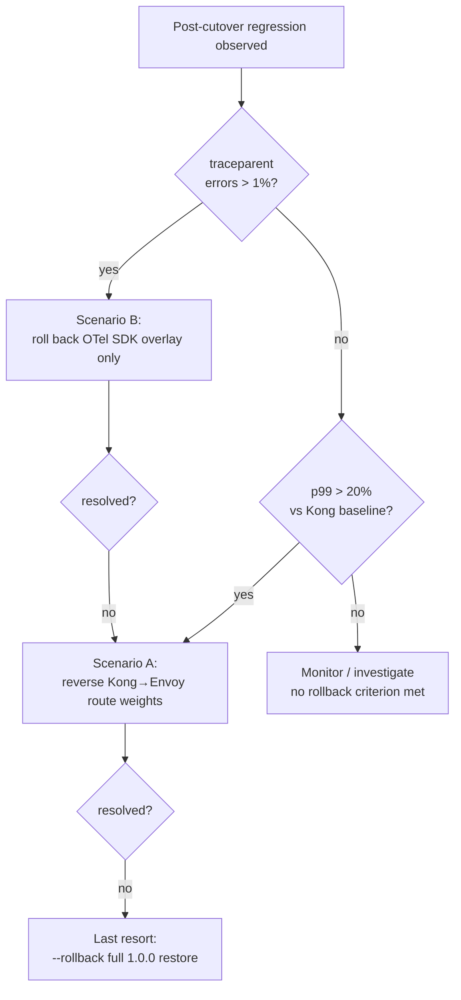

# Design: b8-13-rollback-runbook

**Status**: designed → 2026-06-04 · **Constitution**: 1.1.0
**Architects**: Atlas (infra/runbook), Eris (test strategy) — doc + L1 harness brick
**Revision**: design round 2 — incorporates the independent-review BLOCKER
(ARCHITECTURE-TARGET.md is sha256-pinned by `t4.test.sh::_test_t4_023`) →
switched from in-place §11 edit to **record-only supersession**.

---

## Architecture Decisions

### ADR-B813-001: Dedicated `docs/ROLLBACK.md`, not an inline MIGRATIONS.md expansion
**Context**: The full runbook is forward-referenced from `MIGRATIONS.md:144/172/182`
and `ARCHITECTURE-TARGET.md §11.3`. It could live inside `MIGRATIONS.md` or as
its own file.
**Decision**: Ship a dedicated `docs/ROLLBACK.md`. `MIGRATIONS.md` documents the
**forward** path (Phase 0–4 walkthrough); a rollback runbook is an **operational
incident** document — different audience (on-call SRE under a regression),
different structure (decision tree + per-scenario steps), different read trigger.
Separation avoids bloating MIGRATIONS.md and gives the forward-references a
single stable anchor. MIGRATIONS.md keeps its short criteria summary + links out.
**Consequences**: One new file; forward-references re-pointed. No code.
**Constitution**: Article III.1 (Specs Before Code — doc-of-record).

### ADR-B813-002: Record-only supersession — do NOT edit the sha-pinned arch doc
**Context**: `ARCHITECTURE-TARGET.md §11` (+ §12.1) carries seven B8O-stale DBOS
references. The naïve plan was to edit §11 in place. **Independent review found
this is a BLOCKER**: `docs/ARCHITECTURE-TARGET.md` is **sha256-pinned** by
`t4.test.sh::_test_t4_023` (`:278-294`) against the hash in
`t4-adr-ratification/specs.md`; the live hash currently matches, so any byte edit
flips the pin **RED on `main` CI** (the shared-harness silent-break failure mode
in project memory). The `bin/forge-rehash-architecture-doc.sh` escape hatch
exists, but its REHASH-LOG mandates: *"Material edits MUST be ratified by a fresh
Forge change that supersedes parts of t4-adr-ratification."* Removing a rollback
criterion + realigning the migration strategy **is** material.
**Decision**: **Record-only supersession**, mirroring exactly what B8O did for the
identical DBOS→Temporal decision (`b8-orchestration-temporal-realign/design.md:18`
deliberately did not edit the pinned doc). Concretely:
- `ARCHITECTURE-TARGET.md` is **left byte-frozen** (FR-B813-040; harness asserts
  its sha256 == the pinned value → t4 stays green).
- `docs/ROLLBACK.md` is the **authoritative** rollback doc, with no DBOS
  criterion, and carries a **Supersession note** enumerating all seven stale
  arch-doc references as *obsolete per B8O*, pointing at `orchestration.yaml`
  v1.2.0 + the B8O change as the record of correction (FR-B813-041).
- `MIGRATIONS.md` (not pinned) re-points its forward-reference to ROLLBACK.md.
**Consequences**: No t4 break, no t4 re-ratification, no B.8.14 lane-crossing.
Trade-off (accepted, precedent-aligned): the pinned narrative stays stale-in-place
but is *superseded by record*, not silently wrong. A later non-B.8 cleanup (or
B.8.14's broader doc pass) may re-pin via the rehash hatch.
**Constitution**: III.4 Ambiguity Protocol is N/A (no ambiguity); the anti-
fabrication discipline (CLAUDE.md ANTI-HALLUCINATION PROTOCOL) is satisfied by
recording the staleness rather than papering over it.

### ADR-B813-003: Relative thresholds only — no committed latency
**Context**: A runbook is tempting to "make concrete" with example numbers.
**Decision**: Document **only** relative deltas — p99 regression `> 20 %` and
traceparent error rate `> 1 %`. No absolute p50/p95/p99 figure (ms/µs/s)
anywhere. The measurement *procedure* is referenced (B.8.12 methodology /
`B8-BASELINE.md §6`); the operator measures their own baseline at run-time.
**Consequences**: Harness greps the runbook for any committed latency unit and
fails on a hit (FR-B813-060, mirrors `_test_b812_017`).
**Constitution**: CLAUDE.md ANTI-HALLUCINATION PROTOCOL + ADR-B8-1-002
(`fsm-backend` is `image: scratch` → no real number capturable → none committed).

### ADR-B813-004: Graduated reversal — narrowest action first
**Context**: "Rollback" spans three blast radii: SDK-only, route-weights, full-tree.
**Decision**: Prescribe the **narrowest** reversal per failure mode:
- Scenario B (traceparent `> 1 %`) → **OTel SDK overlay only**.
- Scenario A (p99 `> 20 %`) → **reverse the Kong → Envoy route weights** (Envoy
  ∥ Kong both remain present pre-2.0.0-stable; additive cutover reversible by
  config, not code removal).
- **Last resort** → `forge-migrate-flagship.sh --target . --rollback`
  (full byte-frozen 1.0.0 restore; B.8.10 mechanism, B.8.2 snapshot).
The runbook criteria must stay byte-consistent with the criteria text already
embedded in the migrate script (`:394-396`) — FR-B813-032.
**Consequences**: Maps onto existing additive overlays — no new tooling. Documents
`--rollback`/`--phase` mutual-exclusion (MIGRATIONS.md:141).
**Constitution**: Article VIII.1 (Kong remains scaffolded default until B.8.14, so
"roll back to Kong" is a config reversal, fully supported now).

### ADR-B813-005: L1 harness assertion design (hermetic grep/diff/shasum)
**Context**: CI ships Python + Node + shellcheck only; harness must be hermetic L1.
**Decision**: `b8-13.test.sh` asserts each FR by grep/diff/stat/shasum:
- runbook present + titled + audit comment (001); two scenarios (002); five steps
  each (003).
- thresholds as relative deltas `20 %` / `1 %` (010/020); detection cites B.8.12
  methodology (011); Scenario execution anchors "route weights"/Kong (012),
  "OTel SDK overlay" (021); `--rollback` + snapshot + `--phase` exclusion (030).
- runbook ↔ migrate-script criteria agreement (032 — grep both `:394-396` and the
  runbook, assert same two criteria + the B8O no-CPU note).
- **no-DBOS-criterion** in the runbook (031): assert no active DBOS/CPU
  rollback/fallback criterion in `docs/ROLLBACK.md` (the Supersession note's
  *historical* mentions are allowed — scope the "active criterion" grep to the
  scenario sections, or assert the explicit "no DBOS/CPU criterion" sentence is
  present).
- **Supersession note** present + enumerates the stale refs (041).
- **arch-doc frozen** (040): `shasum -a 256 docs/ARCHITECTURE-TARGET.md` ==
  pinned hash in `t4-adr-ratification/specs.md` (positively guards we did not
  break t4).
- **no committed latency** (060): grep runbook for `[0-9]+ *(ms|µs|us|s)\b` → absent.
- frozen 1.0.0 byte-identity (061); no standards/schema/constitution/t4-spec diff
  (062); `constitution_version` still 1.1.0.
- CHANGELOG anchor whole-file (067); forge-ci registration (066); coupling guards
  re-run b8-12 + b8-10 + **t4** by exit code (068).
**Consequences**: ~18–20 L1 tests; no L2 leg (nothing toolchain-dependent ships;
the live measurement flow is covered by `b8-12.test.sh` L2).
**Constitution**: Article I (tests precede docs — RED first).

---

## Rollback decision tree (runbook core)

There is **no** DBOS/CPU branch (B8O — Temporal is the orchestrator).

## Testing strategy
- **Unit/L1 (hermetic)**: every FR → one grep/diff/shasum assertion (ADR-005).
  RED first: write `b8-13.test.sh` against the not-yet-written docs, confirm
  failure, then author docs to GREEN.
- **No L2**: nothing toolchain-dependent ships; live measurement is covered by
  `b8-12.test.sh` L2 (`FORGE_B8_12_LIVE`).
- **Coupling**: re-run b8-12 + b8-10 + **t4** by exit code (t4 guards the arch-doc
  pin this brick must not break).
- **Full suite**: run all ~51 harnesses + verify.sh + constitution-linter before
  flip (full-suite-before-push lesson) — in particular confirm `t4.test.sh` green.

## Standards applied
- None bumped. Documents existing `orchestration.yaml` v1.2.0 (B8O),
  `gateway.yaml` (B.8.4), B.8.12 methodology. (FR-B813-062 asserts no bump.)

## Known-deferred (out of scope, recorded for honesty)
- `ARCHITECTURE-TARGET.md` §11/§12.1 stay stale-in-place (superseded by record).
  An in-place rehash-hatch correction is a separate non-B.8 doc cleanup (or part
  of B.8.14's broader pass), requiring t4 re-ratification per the REHASH-LOG.

---

## Constitutional Compliance Gate
- **Article I (TDD)**: ✓ RED-first harness before docs.
- **Article III (Specs Before Code) / III.4 Ambiguity Protocol**: ✓ no
  `[NEEDS CLARIFICATION]` open; doc-of-record resolves dangling references.
- **CLAUDE.md ANTI-HALLUCINATION PROTOCOL**: ✓ stale refs recorded not fabricated;
  no committed latency (ADR-003); citations verified live (round-2 fix:
  III.4 is "Ambiguity Protocol", not a "Ground-Truth" article — the prior label
  was corrected after independent review).
- **Article VIII.1/VIII.2 (Kong/Temporal SHALL)**: ✓ NOT amended — Kong remains
  scaffolded default; "roll back to Kong" is config-reversible now. Amendment
  stays B.8.14.
- **t4 pin integrity**: ✓ arch doc byte-frozen; harness positively asserts the
  pin is intact (FR-040) — no silent `main` CI break.
- **Additive / frozen-1.0.0 / no sibling-spec mutation**: ✓ (FR-061/062).
- **No BLOCK conditions.** Design APPROVED for planning pending re-review.
