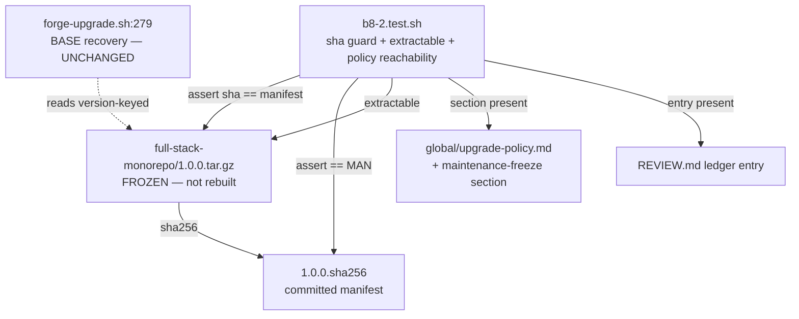
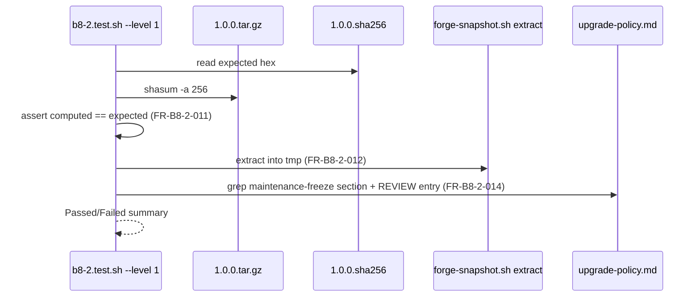

# Design: b8-2-legacy-snapshot

<!-- Status: designed -->
<!-- Schema: default -->
<!-- Audit: B.8.2 (docs/new-archetypes-plan.md §4.2) -->

**Agents**: Atlas (infra/upgrade framing) + Eris (test strategy). No runtime
code. **Context7**: not invoked — deliverables are a sha256 manifest, a Bash
harness, and a Markdown standard section.

## Architecture Decisions

### ADR-B8-2-001 — Keep the version-keyed snapshot path; no `legacy/` dir
**Context**: Q-001. Plan says `legacy/`; `forge-upgrade.sh:279` reads
`<archetype>/<from_version>.tar.gz`.
**Decision**: Keep `full-stack-monorepo/1.0.0.tar.gz`. Do not introduce
`legacy/`.
**Consequences**: Zero `forge-upgrade.sh` change; the A.7 BASE-recovery
contract is preserved; the 1.0.0→2.0.0 upgrade finds BASE automatically. The
plan's `legacy/` wording is reconciled in the upgrade-policy section.
**Compliance**: Article III.4 (grounded in live code), no article violated.

### ADR-B8-2-002 — Manifest is a sibling `1.0.0.sha256` in `shasum -c` format
**Context**: Q-002.
**Decision**: Commit `.forge/scaffold-snapshots/full-stack-monorepo/1.0.0.sha256`
as `<hex>  1.0.0.tar.gz`, re-checkable with `shasum -a 256 -c`.
**Consequences**: Stock-tooling verifiable, greppable, minimal surface. A
richer YAML manifest is deferred (YAGNI). Forward-stable: B.9 adds a sibling
`mobile-only/1.0.0.sha256`.
**Compliance**: NFR-B8-2-003 (byte-identity) — manifest records, never mutates
the tarball.

### ADR-B8-2-003 — Freeze policy in `global/upgrade-policy.md` + REVIEW ledger
**Context**: Q-003 (maintainer-answered: bump the standard, not doc-only).
**Decision**: Append a "1.0.0 maintenance-freeze" section to
`global/upgrade-policy.md` and an append-only `REVIEW.md` ledger entry. The
standard has no `version:` frontmatter (stage: stable) → section addition
only, no semver increment.
**Consequences**: The freeze becomes normative for `forge upgrade`, not merely
documented. One standard-surface touch (NFR-B8-2-002 acknowledges it).
**Compliance**: Article XII (additive standard amendment, ledgered); no
constitutional amendment.

### ADR-B8-2-004 — Flagship-only freeze
**Context**: Q-004.
**Decision**: Freeze `full-stack-monorepo/1.0.0` only. `mobile-only/1.0.0`
freeze is B.9.
**Consequences**: No scope creep. The harness keys the manifest path by
`<archetype>/<version>` so B.9 adds a sibling manifest + one harness line, not
a new harness.
**Compliance**: matches plan §4.2.

### ADR-B8-2-005 — Freeze the existing bytes; do NOT rebuild
**Context**: FR-B8-2-003. `forge-snapshot.sh build` uses SOURCE_DATE_EPOCH =
HEAD timestamp, so a rebuild at the b8-2 commit would change bytes with no
semantic gain and would invalidate the very immutability claim being made.
**Decision**: Compute the manifest from the **already-committed** tarball;
never rebuild it.
**Consequences**: The frozen artifact is exactly the rc.6 1.0.0-final that
`a7.test.sh` already exercises. The guard proves *this* artifact is preserved.
**Compliance**: Article III.4, NFR-B8-2-003.

## Component Design

## Data Flow — guard (L1 hermetic)

## Testing Strategy (Eris)

- **TDD (Article I)**: write `b8-2.test.sh` RED first — sha guard fails before
  the manifest exists; extractable + policy-reachability fail before the
  standard section is added. Author manifest + standard section → GREEN.
- **Negative proof (FR-B8-2-013)**: copy the tarball to tmp, flip a byte,
  point a check at the copy → confirm the sha guard FAILS; restore.
- **L1 hermetic ≤ 5 s** (NFR-B8-2-001): shasum + extract + greps only, no net.
- **Regression**: `a7.test.sh` GREEN (NFR-B8-2-004) — same frozen artifact.
- **Scope**: `git diff --name-only` confirms no `.forge/templates/**` or
  `.forge/schemas/**`; the only standard touch is `upgrade-policy.md` +
  `REVIEW.md` (NFR-B8-2-002, ADR-3).
- **Byte-identity (NFR-B8-2-003)**: `1.0.0.tar.gz` sha256 unchanged
  (`1d0b05cd…cd45`) — asserted by the guard itself.

## Standards Applied

- `global/upgrade-policy.md` — freeze section (ADR-3). REVIEW.md ledger entry.
- `global/standards-lifecycle.md` — markdown-standard amendment is additive;
  REVIEW.md append-only per FR-T4-LC-005.
- `global/open-questions.md` — Q-001..004 resolved (Q-003 maintainer-answered).
- `global/forge-self-ci.md` — harness registration ≤ 300 lines (ADR-T533-002).

## Constitutional Compliance Gate

- Article I (TDD RED-first): confirmed.
- Article III.4 (anti-hallucination): sha from live, legacy/ reconciled,
  no fabricated standard version: confirmed.
- Article IV/V (audit trail + gate): additive freeze record: confirmed.
- Article VI/VII (Flutter/Rust): no runtime code: N/A.
- Article XII (governance): additive standard amendment, ledgered, no
  constitutional amendment: confirmed.

**No violations. Gate PASS.**
