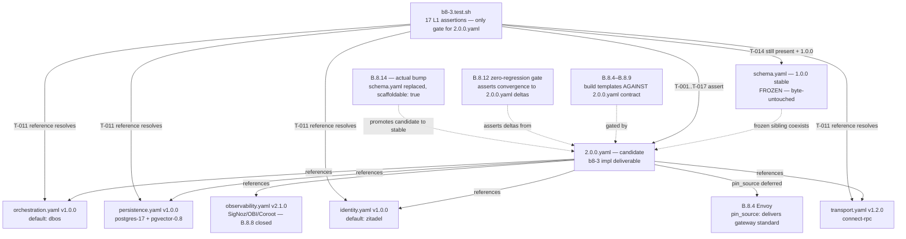

# Design: b8-3-schema-candidate

<!-- Status: designed -->
<!-- Schema: default -->
<!-- Audit: B.8.3 (docs/new-archetypes-plan.md §4.2 — flagship 1.0.0 → 2.0.0, 2.0.0 candidate schema) -->

**Agents**: Atlas (schema topology framing) + Eris (test strategy). No runtime
code; no templates. **Context7**: not invoked — deliverables are a YAML schema
file and a Bash harness.

---

## Architecture Decisions

### ADR-B8-3-001 — On-disk path: versioned sibling `2.0.0.yaml`; no `schema.yaml` edit
**Context**: Q-001 (resolved maintainer 2026-05-30, option a). Plan §4.2 B.8.3
names the artifact `2.0.0.yaml`; live validators hard-code `schema.yaml` by
literal filename (`validate-foundations.sh:92`, `verify.sh:83`,
`constitution-linter.sh:69`).
**Decision**: Author the candidate at
`.forge/schemas/full-stack-monorepo/2.0.0.yaml`. The frozen `schema.yaml`
(1.0.0 stable, B.8.2 maintenance-freeze) is byte-untouched. The candidate is
**intentionally invisible** to the three existing gates; B.8.3 validates it via
its own dedicated harness `b8-3.test.sh`. Rewiring the shared validators to
discover versioned filenames is a **proposed follow-on sub-brick B.8.3.b (not
yet ratified in plan §4.2 — pending maintainer addition to roadmap)**, out of
B.8.3 scope.
**Consequences**: Zero touch to frozen 1.0.0 surface; the B.8.2 sha256 guard
stays GREEN; FR-GL-001 stays GREEN (reads `schema.yaml`, which is unchanged).
The `2.0.0.yaml` is protected by `b8-3.test.sh` alone until B.8.3.b (proposed)
lands.
**Compliance**: Article III.4 (only freeze-safe option, no validator path guessed).

### ADR-B8-3-002 — Component representation: reference-only, no inline pins
**Context**: Q-002 (resolved maintainer 2026-05-30, reference-only). DBOS /
Postgres + pgvector / Zitadel / Connect-RPC pins are owned by
`orchestration.yaml` / `persistence.yaml` / `identity.yaml` /
`transport.yaml`. No `*.yaml` standard owns a gateway pin today (only
`infra/kong.md` markdown); the Envoy pin arrives with B.8.4.
**Decision**: The `components:` block in `2.0.0.yaml` declares each component
by name + role + standard reference (`standard: <filename>`). It inlines NO
version numbers. The Envoy entry declares `pin_source: B.8.4` to make the gap
explicit. Each standard reference MUST point to an existing file under
`.forge/standards/` (asserted by `b8-3.test.sh`).
**Consequences**: Single source of truth; no drift between `2.0.0.yaml` and the
owning standards; Article III.4 satisfied (Envoy pin not fabricated); B.8.4–B.8.7
deliver their pins into their respective standards, the schema automatically
inherits them by reference.
**Compliance**: Article III.4, NFR-B8-3-001 (anti-hallucination).

### ADR-B8-3-003 — `candidate` semantics: non-scaffoldable; `scaffoldable: false` field; promote at B.8.14
**Context**: Q-003 (resolved maintainer 2026-05-30, option a). No scaffoldability
gate keyed on stage exists in the validator today.
**Decision**: The `2.0.0.yaml` carries an explicit top-level field
`scaffoldable: false`. This signals intent in the file itself, readable by any
future tool. B.8.3 asserts this field exists and is `false` via `b8-3.test.sh`.
**Enforcing** non-scaffoldability in the scaffolder/validator is deferred to
B.8.3.b (proposed — not yet ratified in plan §4.2; couples to ADR-B8-3-001
validator rewiring; out of B.8.3 scope).
The header block of `2.0.0.yaml` documents the promotion trigger:
`candidate → stable` at B.8.14, after B.8.12 proves zero regression on the 4
demos. The header block also carries an explicit prohibition note: Articles
VIII.1 (Kong) and VIII.2 (Temporal) remain IN FORCE; scaffolding or deploying
this candidate before the B.8.14 GOVERNANCE.md Amendment Process completes
would violate them (see Fix C1 / constitutional compliance gate below).
**Consequences**: The field is machine-readable now; B.8.3.b (proposed) wires
the scaffolder to respect it. The `forge init --archetype full-stack-monorepo`
command continues scaffolding 1.0.0 until B.8.14 flips the stage to `stable`.
**Compliance**: FR-B8-3-005, FR-B8-3-041, FR-B8-3-042.

### ADR-B8-3-004 — Web-layer modeling: `surfaces:` sub-map under `frontend` layer
**Context**: Q-004 (resolved maintainer 2026-05-30, option a). Plan §4.2 B.8.9
adds Qwik `web-public/` while Flutter Web stays in `web-backoffice/`; Janus
arbitrates both.
**Decision**: The `frontend` layer entry gains a `surfaces:` sub-map with two
named entries: `web-public` (Qwik, path `web-public/`, primary stack `qwik`)
and `web-backoffice` (Flutter Web, path `web-backoffice/`, primary stack
`flutter-web`). The `frontend` layer retains its top-level
`id / path / fr_id_prefix / primary_agent` (Hera) — the validator's required
triple is trivially satisfied (FR-GL-001 checks for `backend`, `frontend`,
`infra` by `id`, which are all present). No new `fr_id_prefix` per surface;
cross-surface FRs use `FR-FE-` (frontend prefix) or `FR-GL-` for cross-layer.
**Consequences**: No new top-level `layers[]` entries; FR-GL-001 stays GREEN
without any follow-on validator work; Janus `layers_count_ge: 2` trigger is
unaffected (still triggers on multi-layer changes, not intra-frontend surfaces).
B.8.9 populates `web-public/` templates; this schema records the topology
contract.
**Compliance**: FR-B8-3-020, FR-B8-3-021, FR-B8-3-022.

### ADR-B8-3-005 — `scaffoldable` field representation: boolean top-level key
**Context**: New design-level ADR. Options: (a) boolean `scaffoldable: false`,
(b) embed in `stage_semantics:` block, (c) validator-only (no yaml field).
**Decision**: Top-level boolean `scaffoldable: false`. Simplest, greppable, no
nested block needed, directly parseable by future validator or scaffolder with a
single `data.get('scaffoldable', True)` lookup. `b8-3.test.sh` asserts it via
`yaml.safe_load`.
**Consequences**: The field is forward-stable: B.8.14 flips it to `true` (or
removes it, defaulting to `true`) when promoting to stable. No ambiguity.
**Compliance**: ADR-B8-3-003, FR-B8-3-041.

---

## Exact `2.0.0.yaml` Field-by-Field Structure

The file lives at `.forge/schemas/full-stack-monorepo/2.0.0.yaml`.
The shape below is the normative design — it evolves `schema.yaml` (1.0.0)
field-for-field per FR-B8-3-001, with new fields noted.

```yaml
# Forge Schema — full-stack-monorepo 2.0.0 CANDIDATE
# <!-- Audit: B.8.3 (b8-3-schema-candidate) -->
#
# 2.0.0 candidate — the ratified TARGET for the flagship B.8 migration.
# This file is the shared contract gating B.8.4 (Envoy), B.8.5 (DBOS),
# B.8.6 (Connect-RPC), B.8.7 (Zitadel), B.8.9 (Qwik web-public),
# B.8.12 (zero-regression gate), B.8.14 (actual version bump).
#
# Stage semantics for THIS FILE (ADR-B8-3-003):
#   - candidate : ratified 2.0.0 target. NOT scaffoldable by default
#                 (see `scaffoldable: false`). Coexists with frozen
#                 1.0.0 schema.yaml (B.8.2 maintenance-freeze).
#                 Promoted to stable at B.8.14 after B.8.12 proves
#                 zero regression on the 4 demos.
#
# CONSTITUTIONAL PROHIBITION (Articles VIII.1 + VIII.2 — IN FORCE):
#   Constitution v1.1.0 §VIII.1 mandates Kong as API gateway.
#   Constitution v1.1.0 §VIII.2 mandates Temporal for workflow orchestration.
#   Both SHALL clauses remain binding until B.8.14 completes the
#   GOVERNANCE.md § "Amendment Process" (7-day window, ## Amendments table).
#   Scaffolding or deploying this candidate before that amendment would
#   constitute a constitutional violation. This candidate declares the
#   TARGET only; it does not authorise removing Kong or Temporal from
#   any live stack before B.8.14.
#
# Migration strategy (plan §4.1): additive-first, breaking-second.
#   New components (Envoy/DBOS/Connect/Zitadel/Qwik) added in parallel
#   with 1.0.0 components; removal of Kong/Temporal/REST-bridge happens
#   at B.8.14. This candidate declares the TARGET state only.
#
# On-disk coexistence (ADR-B8-3-001):
#   schema.yaml          → frozen 1.0.0 stable (B.8.2, byte-untouched)
#   2.0.0.yaml (this)    → 2.0.0 candidate, invisible to the three
#                          existing gates until B.8.3.b (proposed)
#                          rewires them. Validated by b8-3.test.sh
#                          exclusively.
#
# Component references (ADR-B8-3-002): no inline version pins.
#   Each component cites its owning standard yaml. The Envoy gateway
#   pin has no standard source today; it arrives with B.8.4.

name: full-stack-monorepo
version: "2.0.0"
stage: candidate
scaffoldable: false   # ADR-B8-3-003/005 — opt-in only; B.8.14 promotes to stable

description: >
  Full-stack monorepo archetype 2.0.0 (candidate): Flutter backoffice +
  Qwik public web + Rust backend + Envoy Gateway + DBOS embedded +
  Connect-RPC + Zitadel auth + Postgres 17 + pgvector + SigNoz/OBI/Coroot.
  Protos remain single source of truth. TDD + BDD enforced per layer;
  multi-layer changes routed by Janus. Additive-first migration from 1.0.0;
  breaking removal of Kong/Temporal/REST-bridge at B.8.14.

tdd_enforced: true
bdd_required_for_user_facing: true
coverage_threshold: 80

# ─── 2.0.0 Component SET (reference-only, ADR-B8-3-002) ────────────
#
# Each entry: component name + role + owning standard (no inline pins).
# The standard yaml is the single source of truth for version pins.
# Envoy: no standard yaml source yet; pin arrives with B.8.4.
components:
  - name: envoy-gateway
    role: api-gateway
    replaces: kong  # 1.0.0 baseline: kong:3.6 (docs/B8-BASELINE.md §1)
    delivered_by: B.8.4
    pin_source: B.8.4  # no *.yaml standard pins a gateway today (ADR-B8-3-002)

  - name: dbos-embedded
    role: workflow-orchestration
    replaces: temporal-intent  # 1.0.0 baseline: doc-only, not deployed (B8-BASELINE §4)
    delivered_by: B.8.5
    standard: orchestration.yaml  # default: dbos (v1.0.0)

  - name: connect-rpc
    role: transport
    replaces: rest-bridge
    delivered_by: B.8.6
    standard: transport.yaml  # protocol: connect-rpc (v1.2.0)

  - name: zitadel
    role: identity
    replaces: implicit-auth
    delivered_by: B.8.7
    standard: identity.yaml  # default: zitadel (v1.0.0)

  - name: postgres-17-pgvector
    role: persistence
    replaces: postgres-16  # 1.0.0 baseline: postgres:16-alpine, no pgvector (B8-BASELINE §2)
    delivered_by: B.8.5  # DBOS state tables + B.7 RAG depend on this delta
    standard: persistence.yaml  # default: postgres-17, extensions: [pgvector-0.8] (v1.0.0)
    migration_note: >
      CROSSING DELTA (B8-BASELINE §2): 1.0.0 ships postgres:16-alpine without
      pgvector. This bump MUST NOT be silent; it crosses during B.8.5 migration.

  - name: signoz-obi-coroot
    role: observability
    note: already closed at B.8.8 — observability.yaml v2.1.0
    standard: observability.yaml  # v2.1.0: SigNoz unified + OBI/Beyla + Coroot (B.8.8 closed)

# ─── 1.0.0 → 2.0.0 Breaking Deltas ────────────────────────────────
#
# Canonical target-of-record for B.8.12 (zero-regression gate) and
# B.8.14 (version bump contract). Each delta cites the B.8 brick.
migration_deltas:
  - from: kong-gateway
    to: envoy-gateway
    brick: B.8.4
    strategy: additive-first  # Envoy added in parallel, Kong removed at B.8.14

  - from: temporal-intent     # doc-only, no running system (B8-BASELINE §4)
    to: dbos-embedded
    brick: B.8.5
    note: replaces documented intent, not a live workflow system

  - from: rest-bridge
    to: connect-rpc
    brick: B.8.6
    strategy: additive-first

  - from: implicit-auth
    to: zitadel
    brick: B.8.7
    strategy: additive-first

  - from: postgres-16-no-pgvector
    to: postgres-17-pgvector
    brick: B.8.5
    note: crossing delta; pgvector also required by B.7 (ai-native-rag archetype)

  - from: no-web-public-layer
    to: qwik-web-public
    brick: B.8.9
    strategy: additive-first  # new web-public/ surface added alongside web-backoffice/

bump_at: B.8.14  # actual 1.0.0 → 2.0.0 version bump + breaking-component removal

# ─── Layers ─────────────────────────────────────────────────────────
#
# Minimum triple (backend/frontend/infra) preserved — FR-GL-001.
# Frontend gains `surfaces:` sub-map for Qwik/Flutter-Web split (ADR-B8-3-004).
# No new top-level layer entries; FR-GL-001 validator check unaffected.
layers:
  - id: backend
    path: backend/
    fr_id_prefix: FR-BE-
    primary_agent: Vulcan
    standards_scope: [rust, all]

  - id: frontend
    path: frontend/
    fr_id_prefix: FR-FE-
    primary_agent: Hera
    standards_scope: [flutter, all]
    # Web surface split (ADR-B8-3-004, plan §4.2 B.8.9).
    # These are sub-paths under frontend/, not new top-level layers.
    # Janus arbitrates both surfaces when a cross-layer change spans them.
    surfaces:
      - id: web-backoffice
        path: web-backoffice/
        stack: flutter-web
        note: Flutter Web — backoffice / admin UI; was frontend/ in 1.0.0

      - id: web-public
        path: web-public/
        stack: qwik
        note: Qwik PWA — public-facing web; new in 2.0.0 (B.8.9)

  - id: infra
    path: infra/
    fr_id_prefix: FR-IN-
    primary_agent: Atlas
    standards_scope: [infra, all]

fr_id_prefix_cross_layer: FR-GL-

# ─── Cross-layer orchestration ───────────────────────────────────────
cross_layer:
  agent: Janus
  triggers:
    - layers_count_ge: 2
  delivered_by: b1-workflow  # unchanged from 1.0.0

# ─── Phases ──────────────────────────────────────────────────────────
phases:
  - id: proposal
    artifact: proposal.md
    template: templates/proposal.md
    gate: constitution_compliance
    next: specs

  - id: specs
    artifact: specs.md
    template: templates/spec.md
    agent: Clio
    gate: anti_hallucination_check
    next: design

  - id: design
    artifact: design.md
    template: templates/design.md
    agent: auto_route
    gate: constitution_compliance
    next: tasks

  - id: tasks
    artifact: tasks.md
    template: templates/tasks.md
    gate: per_task_constitution_check
    next: implementation

  - id: implementation
    artifact: source_code
    protocol: tdd_cycle
    agent: auto_route
    next: review

  - id: review
    agent: quality_guardians
    gate: quality_gate
    next: archive

  - id: archive
    merges: specs.md into .forge/specs/
    updates: .forge.yaml status to archived
```

---

## `b8-3.test.sh` Harness Test Strategy (Eris)

**File**: `.forge/scripts/tests/b8-3.test.sh`
**Level**: L1 only (hermetic, ≤ 5 s, zero net/Docker, mirrors b8-2.test.sh
structure with `--level` flag + `_helpers.sh` conventions).
**Role**: the **only gate** aware of `2.0.0.yaml` (ADR-B8-3-001). The three
shared validators (`validate-foundations.sh`, `verify.sh`,
`constitution-linter.sh`) remain unaware until B.8.3.b (proposed — not yet
ratified in plan §4.2).

### L1 Assertion List

| # | FR / NFR | Assertion | Implementation |
|---|----------|-----------|----------------|
| T-001 | FR-B8-3-001/002 | `2.0.0.yaml` exists at `.forge/schemas/full-stack-monorepo/2.0.0.yaml` | `[ -f "$SCHEMA_20" ]` |
| T-002 | FR-B8-3-001/002 | File parses as valid YAML with a mapping root | `python3 -c "import yaml,sys; d=yaml.safe_load(open(sys.argv[1])); assert isinstance(d,dict)" "$SCHEMA_20"` |
| T-003 | FR-B8-3-002 | `name: full-stack-monorepo` | `python3` dict check `d['name'] == 'full-stack-monorepo'` |
| T-004 | FR-B8-3-002 | `version: "2.0.0"` | `d['version'] == '2.0.0'` |
| T-005 | FR-B8-3-002 | `stage: candidate` | `d['stage'] == 'candidate'` |
| T-006 | FR-B8-3-041 / ADR-B8-3-003/005 | `scaffoldable: false` present | `d.get('scaffoldable') is False` |
| T-007 | FR-B8-3-003 | `tdd_enforced: true`, `bdd_required_for_user_facing: true`, `coverage_threshold: 80` | three key-value asserts |
| T-008 | FR-B8-3-020 | `layers[]` contains entries with `id` ∈ {backend, frontend, infra} | set check on extracted ids |
| T-009 | FR-B8-3-021 / ADR-B8-3-004 | `frontend` layer has `surfaces:` with ids `web-public` and `web-backoffice` | nested key traversal |
| T-010 | FR-B8-3-010/011 | Each `components[]` entry has a `name` field | loop assert |
| T-011 | FR-B8-3-011 / ADR-B8-3-002 | Every component that carries a `standard:` field names an **existing** file under `.forge/standards/` | `[ -f "$FORGE_ROOT/.forge/standards/$ref" ]` for each |
| T-012 | FR-B8-3-012 / ADR-B8-3-002 | No component entry carries an inline version pin — specifically no key named exactly `version`, `pin`, or `image` at the top level of any component dict (exact key-set check; `pin_source` is permitted) | `python3` dict key-set guard: `assert not (set(c.keys()) & {'version', 'pin', 'image'})` for each component |
| T-013 | FR-B8-3-030 | `migration_deltas[]` is present and non-empty | `len(d.get('migration_deltas', [])) > 0` |
| T-014 | FR-B8-3-004 / NFR-B8-3-003 | Frozen `schema.yaml` (1.0.0) still present and its `version` field is still `"1.0.0"` | `[ -f "$SCHEMA_10" ]` + version check |
| T-015 | NFR-B8-3-001 | No YAML scalar **value** at the `components[]` level contains a bare version string `\d+\.\d+` — implemented as a `yaml.safe_load` value-walk over each component dict (not a textual grep, which would false-positive on YAML comments embedding `kong:3.6`, `v1.2.0`, etc.) | `python3` recursive value walk: for each scalar value in each component dict, `assert not re.search(r'^\d+\.\d+', str(v))` |
| T-016 | FR-B8-3-013 | The `postgres-17-pgvector` component carries a `migration_note` field AND `migration_deltas[]` contains an entry whose `from` value matches `postgres-16*` | `python3`: locate component by name; assert `'migration_note' in component`; assert `any(d['from'].startswith('postgres-16') for d in deltas)` |
| T-017 | FR-B8-3-031 | `bump_at` field equals `"B.8.14"` | `d.get('bump_at') == 'B.8.14'` |

### TDD Order (Article I RED → GREEN)

1. **RED**: commit `b8-3.test.sh` with all 17 assertions. Run — every assertion
   from T-001 onward fails immediately (no `2.0.0.yaml` exists yet).
2. **GREEN**: author `.forge/schemas/full-stack-monorepo/2.0.0.yaml` per the
   field-by-field structure above. Re-run — all 17 pass.
3. **REFACTOR**: tighten error messages, confirm ≤ 5 s wall-clock.

### Performance Budget

All assertions are `python3 yaml.safe_load` + file-existence checks — no
network, no Docker, no subprocess chains beyond a single Python invocation.
Target: ≤ 3 s on a laptop (well within NFR-B8-3 ≤ 5 s budget from NFR-B8-2-001
precedent).

---

## Component Design



---

## Standards Applied

| Standard | Role in this change |
|----------|---------------------|
| `orchestration.yaml` v1.0.0 | DBOS component reference (`default: dbos`) |
| `persistence.yaml` v1.0.0 | Postgres-17 + pgvector-0.8 reference |
| `identity.yaml` v1.0.0 | Zitadel reference |
| `transport.yaml` v1.2.0 | Connect-RPC reference |
| `observability.yaml` v2.1.0 | SigNoz/OBI/Coroot reference (B.8.8 closed) |
| `global/open-questions.md` | Q-003/Q-004 resolved here |
| `global/forge-self-ci.md` | harness registration ≤ 300 lines (NFR-CI-002) |

**Standards NOT touched**: no `*.yaml` standard is edited by B.8.3. No new
standard is introduced. No `REVIEW.md` ledger entry required (no standard
bump). `git diff --name-only` MUST show only the change dir + the schema dir
(new `2.0.0.yaml`) + the harness dir (new `b8-3.test.sh`) + CI registration.

---

## FR-B8-3-* → Design Element Traceability

| FR / NFR | Design element |
|----------|----------------|
| FR-B8-3-001 | `2.0.0.yaml` reuses all top-level keys from `schema.yaml`; no divergent structure |
| FR-B8-3-002 | `name/version/stage` fields; T-003/T-004/T-005 |
| FR-B8-3-003 | `tdd_enforced/bdd_required_for_user_facing/coverage_threshold` carried; T-007 |
| FR-B8-3-004 | `schema.yaml` byte-untouched; T-014; `git diff --name-only` guard |
| FR-B8-3-005 | Header block in `2.0.0.yaml` (stage semantics, promotion trigger, scaffoldable note) |
| FR-B8-3-010 | `components:` block lists all 6 components by name + role |
| FR-B8-3-011 | `standard:` field per component (reference-only); T-011/T-012/T-015 |
| FR-B8-3-012 | `pin_source: B.8.4` on envoy-gateway; no standard yaml cited; T-012 |
| FR-B8-3-013 | `migration_note: CROSSING DELTA` on postgres component; `migration_deltas` postgres-16 entry; T-016 |
| FR-B8-3-020 | `layers[]` with backend/frontend/infra; T-008 |
| FR-B8-3-021 | `frontend.surfaces: [web-backoffice, web-public]`; T-009; ADR-B8-3-004 |
| FR-B8-3-022 | `cross_layer.agent: Janus` / `layers_count_ge: 2` preserved |
| FR-B8-3-030 | `migration_deltas:` block (6 deltas, each citing B.8 brick); T-013 |
| FR-B8-3-031 | `bump_at: B.8.14` field; header block additive-first note; T-017 |
| FR-B8-3-032 | `replaces: temporal-intent` + `note: replaces documented intent, not a live workflow system` |
| FR-B8-3-040 | `schema.yaml` and `2.0.0.yaml` coexist; T-014 asserts both present |
| FR-B8-3-041 | `scaffoldable: false`; T-006; scaffolder enforcement deferred to B.8.3.b (proposed) |
| FR-B8-3-042 | Header block + `bump_at: B.8.14` document promotion trigger |
| NFR-B8-3-001 | All component references re-read from live standards; no pin fabricated |
| NFR-B8-3-002 | No `.forge/standards/**`, `.forge/templates/**`, `.forge/schemas/full-stack-monorepo/schema.yaml` edit |
| NFR-B8-3-003 | T-014 asserts `schema.yaml` version still `"1.0.0"` |
| NFR-B8-3-004 | Existing validators read `schema.yaml` (literal); adding `2.0.0.yaml` doesn't break them |
| NFR-B8-3-005 | `migration_deltas:` is the machine-readable contract for B.8.4–B.8.9 and B.8.12 |

---

## Constitutional Compliance Gate

- **Article I (TDD RED-first)**: `b8-3.test.sh` is committed with all 17
  assertions BEFORE `2.0.0.yaml` exists. Every assertion fails RED at that
  commit. `2.0.0.yaml` is then authored; all 17 turn GREEN. The RED witness is
  the gap between the two commits. No production YAML precedes its test.
- **Article II (BDD)**: no new user-facing runtime feature — BDD scenario is
  recorded in `specs.md` for traceability; no `.feature` file required.
- **Article III.1/III.2 (Specs before code)**: design follows specs; `2.0.0.yaml`
  is authored only after this design is complete.
- **Article III.4 (Anti-Hallucination)**: every field in the `2.0.0.yaml`
  structure is grounded: component names from `docs/B8-BASELINE.md` §7 delta
  table + live standards; no Envoy version invented; no Temporal MTBF fabricated.
  The `surfaces:` sub-path names (`web-public/`, `web-backoffice/`) are
  confirmed from plan §4.2 B.8.9 text.
- **Article IV (Delta-based)**: `2.0.0.yaml` evolves `schema.yaml` shape
  field-for-field; `schema.yaml` is not rewritten or deprecated (B.8.14 does
  that). Additive fields (`components:`, `migration_deltas:`, `scaffoldable:`,
  `surfaces:`) are clearly new additions, not replacements.
- **Article VIII.1 (Kong as API gateway)**: §VIII.1 mandates Kong. The
  candidate schema records Kong→Envoy as a breaking delta; B.8.3 only declares
  the migration target — it does not remove Kong from the live stack. The
  `2.0.0.yaml` header block explicitly prohibits scaffolding/deploying this
  candidate before the B.8.14 amendment (Fix C1).
- **Article VIII.2 (Temporal for workflow orchestration)**: §VIII.2
  (`constitution.md:312`) mandates Temporal via an equally-binding SHALL clause.
  The candidate records Temporal-intent→DBOS as a breaking delta (FR-B8-3-032
  reflects that Temporal was doc-only, not deployed — B8-BASELINE §4). B.8.3
  does not replace Temporal in any live stack. The `2.0.0.yaml` header
  prohibition (Fix C1) covers VIII.2 as well. The B.8.14 amendment obligation
  covers **both** VIII.1 (Kong→Envoy) and VIII.2 (Temporal→DBOS), following
  `GOVERNANCE.md § "Amendment Process"` (7-day window, `## Amendments` table)
  per plan §4.2 B.8.14 (line 2298) and the post-stable rule in
  `schema.yaml:19` ("breaking change ⇒ major bump AND Constitution amendment if
  invoked articles change").
- **Article X (Quality)**: `b8-3.test.sh` covers the schema contract with 17
  L1 assertions. No coverage threshold applicable to YAML + shell (no Dart/Rust
  production code).
- **Article XII (Governance)**: Article XII (`constitution.md:435-465`) is
  *Governance* and delegates the amendment process to `GOVERNANCE.md §
  "Amendment Process"` — XII does not itself define the amendment mechanics.
  No Constitution amendment in B.8.3. The VIII.1 (Kong) **and** VIII.2
  (Temporal) amendments follow `GOVERNANCE.md § "Amendment Process"` at B.8.14,
  per plan §4.2 B.8.14 (line 2298) and the post-stable rule in
  `schema.yaml:19`.

**No violations. Gate PASS.**

---

## Anti-Hallucination Pass (Design Phase)

- **`web-public/` and `web-backoffice/` paths**: confirmed from plan §4.2 B.8.9
  text: "Templates Qwik public web sous `templates/full-stack-monorepo/2.0.0/web-public/`
  … Flutter Web reste en `web-backoffice/`." Sub-path names used verbatim.
- **Standard filenames cited in `components:`**: `orchestration.yaml`,
  `persistence.yaml`, `identity.yaml`, `transport.yaml`, `observability.yaml`
  — all confirmed present in `.forge/standards/` (ls output, this session).
- **`observability.yaml` version**: re-read from live file — `version: "2.1.0"`
  at `.forge/standards/observability.yaml:82`. All three occurrences corrected
  from the erroneous v2.0.0 (yaml component block, mermaid node, Standards
  Applied table). `transport.yaml` v1.2.0 verified correct (line 15), unchanged.
- **No Envoy version pin**: Envoy has no `*.yaml` standard source (confirmed:
  only `infra/kong.md` markdown). `pin_source: B.8.4` records the deferral
  without inventing a version.
- **`scaffoldable` field**: design-level addition (ADR-B8-3-005). Not present
  in any existing schema; introduced here as a first-class field.
- **Articles VIII.1 + VIII.2 tension**: both identified and recorded honestly.
  VIII.1 (`constitution.md:308`) mandates Kong; VIII.2 (`constitution.md:312`)
  mandates Temporal. Both SHALL clauses remain in force until B.8.14 completes
  the `GOVERNANCE.md § "Amendment Process"`. The `2.0.0.yaml` header block
  carries an explicit prohibition (Fix C1). Neither article suppressed.
- **T-012 `pin_source` safe**: T-012 uses exact key-set intersection
  `{'version', 'pin', 'image'}` — not substring matching — so `pin_source` on
  the envoy component does not trigger a false positive.
- **T-015 value-walk not grep**: T-015 walks `yaml.safe_load` parsed values,
  not raw text, so YAML comments embedding `kong:3.6` or `v1.2.0` do not
  false-positive.
- **B.8.3.b status**: coined in this design as a proposed follow-on; not
  present in `docs/new-archetypes-plan.md` §4.2 (plan goes B.8.3 → B.8.4).
  All occurrences labelled "(proposed — not yet ratified in plan §4.2)" on
  first mention.
