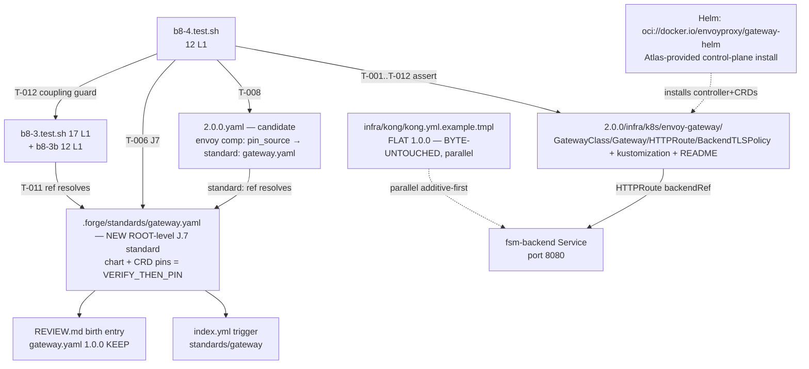

# Design: b8-4-envoy-gateway

<!-- Status: designed -->
<!-- Schema: default -->
<!-- Audit: B.8.4 (docs/new-archetypes-plan.md §4.2 — flagship 1.0.0 → 2.0.0, first real 2.0.0 template brick: Envoy Gateway templates) -->

**Agents**: Atlas (gateway / k8s topology framing) + Eris (test strategy).
**Context7**: invoked during specify (`/envoyproxy/gateway`, `/kubernetes-sigs/gateway-api`); evidence frozen in `specs.md` § "Context7 Evidence". NOT re-invoked here — design records API *shapes* only; concrete pins are **verify-then-pin at `/forge:implement`** (NFR-B84-005).
**Scope reminder**: this is the DESIGN phase. It ships **no template, no `gateway.yaml` standard file, no harness file, and no `2.0.0.yaml` edit**. It is the normative blueprint the impl phase realizes. The five maintainer-resolved decisions below are encoded; the matching Q-001..Q-005 are flipped to answered in `open-questions.md` (independent reviewer + maintainer log).

---

## Architecture Decisions

### ADR-B84-001 — Versioned 2.0.0 template subtree; flat 1.0.0 tree byte-untouched

**Context**: Q-001 (resolved maintainer 2026-05-31, option a). Plan §4.2 B.8.4
names the artifact path `templates/full-stack-monorepo/2.0.0/infra/k8s/
envoy-gateway/` — a **versioned** subdir. The live 1.0.0 templates are FLAT
under `.forge/templates/archetypes/full-stack-monorepo/` with no version
subdir (`infra/k8s/base/`, `infra/kong/`, `infra/k8s/overlays/{dev,staging,prod}/`).
This is the template-tree analogue of the B.8.3 schema decision (`2.0.0.yaml`
versioned sibling beside the flat `schema.yaml`, ADR-B8-3-001).

**Decision**: The Envoy Gateway templates are authored (at impl) under a NEW
versioned subtree rooted at
`.forge/templates/archetypes/full-stack-monorepo/2.0.0/`, with the Envoy
resources under `.../2.0.0/infra/k8s/envoy-gateway/`. The flat 1.0.0 tree —
including `infra/kong/kong.yml.example.tmpl`, `infra/k8s/base/`, and the
`overlays/{dev,staging,prod}/` — is **byte-untouched**. The `2.0.0/` subtree
coexists with the flat 1.0.0 tree exactly as `2.0.0.yaml` coexists with the
frozen `schema.yaml`.

**Consequences**: Zero touch to the frozen 1.0.0 surface; the B.8.2 sha256
guard (`b8-2.test.sh`) and `1.0.0.tar.gz` byte-identity (NFR-B84-003) stay
GREEN; `git diff --name-only` shows only NEW paths under `.../2.0.0/...`
plus the change dir, the new standard, REVIEW.md, index.yml, the new
harness, and the CI registration line. Teaching the scaffolder/snapshot
tooling to *discover* the versioned template root is a **separate downstream
concern** (parallels the ratified B.8.3.b validator rewiring for versioned
*schema* siblings) — NOT done in B.8.4. The 2.0.0 candidate is
`scaffoldable: false`, so `forge init` continues to scaffold the flat 1.0.0
(Kong) tree by default; the Envoy tree is an additive on-disk asset gating
B.8.10 / B.8.12 / B.8.14.

**Compliance**: Article IV (delta-based — additive sibling, no rewrite of the
frozen surface); FR-B84-001/002/004; NFR-B84-003.

### ADR-B84-002 — New ROOT-level `gateway.yaml` J.7 standard + candidate `standard:` ref (replaces `pin_source: B.8.4`)

**Context**: Q-002 (resolved maintainer 2026-05-31, new standard). The
`2.0.0.yaml` `envoy-gateway` component carries `pin_source: B.8.4` and **no
`standard:` ref** (B.8.3 ADR-B8-3-002 deferred the gateway pin source to B.8.4).
No `*.yaml` standard pins a gateway today — only the markdown `infra/kong.md`.

**Decision**: B.8.4 (at impl) creates a NEW J.7-compliant standard at the
standards ROOT — `.forge/standards/gateway.yaml` (NOT a subdir) — holding (a) the
Envoy Gateway Helm chart version and (b) the Gateway API CRD bundle version, both
as **verify-then-pin PLACEHOLDERS** (not hard pins — see ADR-B84-005). The
standard is registered in `.forge/standards/index.yml` (trigger entry) and
birth-entried in `.forge/standards/REVIEW.md`. The `2.0.0.yaml` `envoy-gateway`
component then gains `standard: gateway.yaml` **replacing** its `pin_source:
B.8.4` marker. Editing `2.0.0.yaml` is **explicitly permitted** here because it
is the 2.0.0 **candidate** (not the frozen 1.0.0 `schema.yaml`); the frozen
`schema.yaml` stays byte-untouched (T-014, b8-3b T-012).

**Why ROOT placement (`gateway.yaml`) is REQUIRED, NOT `infra/gateway.yaml`**:
the standing J.7 standards gate is **non-recursive** and only sees the standards
ROOT. `verify.sh:650` runs `for std_yaml in "$STD_DIR_VFY"/*.yaml` (a top-level
glob, root only) and `bin/validate-standards-yaml.sh:67` dir-mode globs
`"$target"/*.yaml` (also non-recursive). A standard placed under a subdir
(`.forge/standards/infra/gateway.yaml`) would be **invisible to both** — it would
NEVER be validated by the standing CI standards gate, a silent false-green. All
SIX existing `*.yaml` standards
(`identity.yaml`, `observability.yaml`, `orchestration.yaml`, `persistence.yaml`,
`state-management.yaml`, `transport.yaml`) live at the standards root; there is
**zero subdir precedent**. The `infra/` prefix is therefore actively harmful, not
helpful — it escapes the gate. The standard MUST live at the ROOT:
`.forge/standards/gateway.yaml`.

b8-3 T-011 stays GREEN with the root path: it resolves a component's `standard:`
value as `os.path.join(STANDARDS_DIR, ref)` and asserts `os.path.isfile`. With
the file at `.forge/standards/gateway.yaml`, the ref is the bare basename
`gateway.yaml`, so `os.path.join(.forge/standards, gateway.yaml)` resolves to the
existing file — T-011 GREEN. The existing component refs (`orchestration.yaml`,
`transport.yaml`, etc.) are likewise bare root-level basenames; `gateway.yaml`
follows the same convention.

**Consequences**: Single J.7-governed source of truth for the gateway pin with
a `pin_review_cadence` for verify-then-pin freshness; the `2.0.0.yaml`
`pin_source: B.8.4` gap is closed; Article III.4 satisfied (pin not fabricated —
placeholder until live verification). **Critical ordering coupling** with b8-3 /
b8-3b harnesses — see "Implementation Ordering" below.

**Compliance**: `standards-lifecycle.md` (J.7 standard contract); Article XII (Governance); FR-B84-030/031/032; b8-3
T-011 (ref resolves) + T-012 (`standard:`/`pin_source` are not forbidden keys).

### ADR-B84-003 — Hybrid delivery: Helm for the control-plane install, kustomize-native manifests for the data-plane

**Context**: Q-003 (resolved maintainer 2026-05-31, hybrid). Plan §4.2 says
"Helm chart Atlas-fourni" AND "Gateway API natifs". The live 1.0.0 infra is
kustomize-based and controller-agnostic (`infra/k8s/base/kustomization.yaml.tmpl`
lists deployment/service/serviceaccount/ingress; overlays patch
namespace/image/replicas).

**Decision**: Two-plane split.
- **Control-plane install (Envoy Gateway controller + its required Gateway API
  CRDs)** = the upstream **Helm chart distributed as an OCI artifact** at
  `oci://docker.io/envoyproxy/gateway-helm`, installed Atlas-side:
  `helm install eg oci://docker.io/envoyproxy/gateway-helm --version <CHART_VER>
  -n envoy-gateway-system --create-namespace`. This is documented as an
  **Atlas-provided install** (values + namespace), NOT vendored as templates in
  the tree (the chart already ships its own CRDs + controller manifests).
- **Data-plane intent (`GatewayClass` / `Gateway` / `HTTPRoute` /
  `BackendTLSPolicy`)** = **Gateway-API-native kustomize manifests** under
  `.../2.0.0/infra/k8s/envoy-gateway/`, with a `kustomization.yaml.tmpl` listing
  them — matching the 1.0.0 `k8s/base/` + overlays convention (same
  `<project-name>` placeholder, same `.tmpl` extension, same audit-comment
  header).

**Consequences**: Honors "Helm chart Atlas-fourni" for the controller+CRDs while
keeping the route-level intent as Gateway-API-native kustomize manifests
consistent with the existing overlay convention; the data-plane tree is
`kustomize build`-able (the b8-4 harness L2 asserts this when `kustomize` is
present, skip-pass otherwise). The Helm install is a documentation block (a
`README.md.tmpl` / install note) in the tree, not a vendored chart copy.

**Compliance**: FR-B84-020/021/022; ADR-B84-001 (kustomize-native consistent
with 1.0.0 convention).

### ADR-B84-004 — Additive-first wiring: Envoy ∥ Kong, both → `fsm-backend`

**Context**: Q (ADR seed) — plan §4.1 additive-first ("Ajouter Envoy Gateway en
parallèle de Kong, canary par route"). Article VIII.1 (Kong SHALL) is IN FORCE.

**Decision**: The Envoy `HTTPRoute`(s) `backendRef` the same backend Service
the Kong example targets — `fsm-backend` (the `<project-name>-backend` Service,
`http` port 8080 per the 1.0.0 `service.yaml.tmpl`). Envoy is added **in
parallel** with Kong; B.8.4 removes nothing, deprecates nothing, and does NOT
touch `infra/kong/kong.yml.example.tmpl`. This enables canary-by-route (§4.1).
The route-cutover/canary mechanism is B.8.10 (migration script); Kong removal +
the actual 1.0.0→2.0.0 bump is B.8.14. The coexistence contract (both gateways
→ `fsm-backend`, neither removes the other) is documented so B.8.12's
zero-regression gate has a canonical convergence target.

**Consequences**: VIII.1 is NOT violated and NOT amended (Envoy is additive,
inside the `scaffoldable: false` candidate tree — see Constitutional Compliance
Gate); the 1.0.0 gateway stays Kong; B.8.12 has an unambiguous coexistence
contract.

**Compliance**: Article VIII.1 (Kong SHALL — preserved); FR-B84-003/040;
NFR-B84-006.

### ADR-B84-005 — Verify-then-pin at implement: chart version, CRD-bundle version, `BackendTLSPolicy` apiVersion

**Context**: Q-005 (verify-then-pin item, not multiple-choice). Context7 shows
the Envoy Gateway chart version rendered as a `` doc
placeholder (v1.8 release line), and `BackendTLSPolicy` historically moved
`v1beta1` → `v1alpha3` → `v1` (GA as of Gateway API v1.5.1). The kong /
b8-coroot / b8-signoz lesson: pins are verified LIVE on the registry/CRD, never
fabricated upstream of `/forge:implement`.

**Decision**: The design fixes the **API shape** (resource kinds + key spec
fields) of every manifest but leaves the following as clearly-marked
verify-then-pin PLACEHOLDERS, resolved live at `/forge:implement`:
1. Envoy Gateway Helm chart concrete version (`--version <CHART_VER>`) — via
   `helm show chart oci://docker.io/envoyproxy/gateway-helm` / OCI registry
   inspect.
2. Gateway API CRD bundle version that the pinned chart vendors + its
   `gateway.networking.k8s.io/bundle-version` + `channel` annotations.
3. The exact `apiVersion` of `BackendTLSPolicy` (`v1beta1` / `v1alpha3` / `v1`)
   in that bundle + whether it is in the **Standard** or **Experimental**
   channel — via `kubectl explain backendtlspolicy` / CRD annotation. **This
   remains an explicit implement-time resolution item.** If the shipped bundle
   does NOT GA `BackendTLSPolicy` in the Standard channel, the impl MUST surface
   `[NEEDS CLARIFICATION]` rather than guess the channel/version.
4. The Envoy Gateway `GatewayClass.spec.controllerName` string for the pinned
   release.

In design + the authored templates these appear as placeholder tokens
(`<CHART_VER>`, `<GATEWAY_API_VERSION>`, `<BACKENDTLSPOLICY_APIVERSION>`,
`<ENVOY_CONTROLLER_NAME>`) keyed to the `gateway.yaml` standard's `versions:`
block, never as concrete literals.

**Consequences**: No premature pin = no Article III.4 anti-hallucination
failure; the b8-4 harness includes an anti-hallucination grep-guard asserting NO
concrete Envoy/Gateway-API version is hard-coded in the tree without the
standard as its source (see Test Strategy T-009).

**Compliance**: Article III.4 (Anti-Hallucination); NFR-B84-001/005;
FR-B84-013/033.

---

## Exact `2.0.0/infra/k8s/envoy-gateway/` Template Tree (impl deliverable, NOT created here)

All files use the 1.0.0 conventions: `.tmpl` extension, `<project-name>`
angle-bracket placeholder, and a leading `# <!-- Audit: B.8.4 (b8-4-envoy-gateway,
FR-B84-NNN) -->` comment. Version/apiVersion tokens are verify-then-pin
PLACEHOLDERS per ADR-B84-005.

```
.forge/templates/archetypes/full-stack-monorepo/2.0.0/
└── infra/
    └── k8s/
        └── envoy-gateway/
            ├── kustomization.yaml.tmpl       # lists the 4 data-plane manifests
            ├── gatewayclass.yaml.tmpl        # GatewayClass → Envoy controller
            ├── gateway.yaml.tmpl             # Gateway + listener(s)
            ├── httproute.yaml.tmpl           # HTTPRoute(s) → fsm-backend
            ├── backendtlspolicy.yaml.tmpl    # upstream TLS validation
            └── README.md.tmpl                # Helm-install doc (Atlas-provided)
```

### `kustomization.yaml.tmpl` (FR-B84-021)
Mirrors `infra/k8s/base/kustomization.yaml.tmpl` shape: `apiVersion:
kustomize.config.k8s.io/v1beta1`, `kind: Kustomization`, `resources:` listing
the four data-plane manifests, and `commonLabels` (`app.kubernetes.io/name:
<project-name>`, `app.kubernetes.io/component: api-gateway`,
`app.kubernetes.io/part-of: <project-name>`). This is the `kustomize build`
entrypoint the b8-4 harness exercises (L2 skip-pass).

### `gatewayclass.yaml.tmpl` (FR-B84-010)
```yaml
apiVersion: gateway.networking.k8s.io/<GATEWAY_API_VERSION>   # verify-then-pin (ADR-B84-005)
kind: GatewayClass
metadata:
  name: <project-name>-envoy
spec:
  controllerName: <ENVOY_CONTROLLER_NAME>   # verify-then-pin — Envoy Gateway controller id
```
`<GATEWAY_API_VERSION>` resolves to the GA `v1` channel for
`GatewayClass`/`Gateway`/`HTTPRoute` (GA since Gateway API v1.0); the concrete
token is keyed to the bundle the pinned chart vendors.

### `gateway.yaml.tmpl` (FR-B84-011)
```yaml
apiVersion: gateway.networking.k8s.io/<GATEWAY_API_VERSION>
kind: Gateway
metadata:
  name: <project-name>-gateway
spec:
  gatewayClassName: <project-name>-envoy   # → the GatewayClass above
  listeners:
    - name: http
      protocol: HTTP
      port: 80
      allowedRoutes:
        namespaces:
          from: Same
    # HTTPS/TLS listener templated for per-environment override (overlay-style,
    # ADR-B84-003); cert/secret refs left as overlay-patchable placeholders.
```
Listener protocol/port/TLS are templated for per-environment override
consistent with the 1.0.0 overlay convention.

### `httproute.yaml.tmpl` (FR-B84-012, FR-B84-040)
```yaml
apiVersion: gateway.networking.k8s.io/<GATEWAY_API_VERSION>
kind: HTTPRoute
metadata:
  name: <project-name>-backend-route
spec:
  parentRefs:
    - name: <project-name>-gateway          # → the Gateway above
  hostnames:
    - <project-name>.example.invalid        # templated; mirrors 1.0.0 ingress host placeholder
  rules:
    - matches:
        - path:
            type: PathPrefix
            value: /
      backendRefs:
        - name: <project-name>-backend       # SAME fsm-backend Service Kong targets (ADR-B84-004)
          port: 8080                          # http port per 1.0.0 service.yaml.tmpl
```
This is the route-level surface enabling canary-by-route additive migration
(§4.1). **No REST↔gRPC transcoding config** is present (ADR-B84-006 / Q-004):
the gateway routes; the backend speaks Connect/gRPC-Web natively.

### `backendtlspolicy.yaml.tmpl` (FR-B84-013)
```yaml
apiVersion: gateway.networking.k8s.io/<BACKENDTLSPOLICY_APIVERSION>   # verify-then-pin — v1beta1/v1alpha3/v1 DRIFT (ADR-B84-005, Q-005)
kind: BackendTLSPolicy
metadata:
  name: <project-name>-backend-tls
spec:
  targetRefs:                                 # v1/v1alpha3 shape; v1beta1 uses singular targetRef
    - group: ""
      kind: Service
      name: <project-name>-backend
  validation:
    wellKnownCACertificates: System           # v1 GA shape (newer guide)
    hostname: <project-name>-backend
```
`<BACKENDTLSPOLICY_APIVERSION>` is the load-bearing uncertainty: the impl
resolves it against the concrete CRD bundle and reconciles the
`targetRefs`-vs-`targetRef` / `validation`-vs-`tls` field shape to the shipped
apiVersion. The Standard channel + GA `v1` is the target; if the bundle GAs it
in Experimental only, the impl surfaces `[NEEDS CLARIFICATION]`.

### `README.md.tmpl` — Helm install doc (FR-B84-020, ADR-B84-003)
Documents the Atlas-provided control-plane install:
`helm install eg oci://docker.io/envoyproxy/gateway-helm --version <CHART_VER>
-n envoy-gateway-system --create-namespace`, the values surface, and the
namespace. `<CHART_VER>` is the verify-then-pin token keyed to `gateway.yaml`
`versions.envoy_gateway_chart`. States that the chart installs the controller
**and** its required Gateway API CRDs (so the tree vendors no CRD copies).

**Gateway-API-native only (FR-B84-014)**: the tree uses purely
`gateway.networking.k8s.io` types; it does NOT use `networking.k8s.io/v1
Ingress` (the 1.0.0 `ingress.yaml.tmpl` stays in the flat 1.0.0 tree) and
introduces NO Kong CRDs.

### ADR-B84-006 — Connect/gRPC-Web pass-through; no gateway-side transcoding (Q-004)

**Context**: Q-004 (resolved maintainer 2026-05-31, defer to B.8.6). Kong
(VIII.1) carries REST↔gRPC transcoding via the `grpc-gateway` plugin. Under
2.0.0 the transport target is Connect-RPC (`transport.yaml` v1.2.0, delivered by
B.8.6); §13 caveat 2 names gRPC-Web via Envoy Gateway as a fallback.

**Decision**: At the gateway, default to **Connect/gRPC-Web pass-through** — the
`HTTPRoute`s route to `fsm-backend` which speaks Connect natively; B.8.4
configures **no** REST↔gRPC transcoding. The transcoding-vs-pass-through
ownership belongs to **B.8.6** (Connect codegen). B.8.4 records the coupling and
does NOT design transcoding here.

**Consequences**: The route surface is transport-agnostic at the HTTP layer;
B.8.6 decides whether any transcoding shim is needed. No Envoy `grpc-gateway`
equivalent is introduced in B.8.4.

**Compliance**: FR-B84-041; couples to B.8.6 (transport.yaml).

---

## `gateway.yaml` Standard (impl deliverable, NOT created here)

A NEW J.7-compliant standard at the standards ROOT —
`.forge/standards/gateway.yaml` (NOT a subdir; see ADR-B84-002 for why root
placement is required by the non-recursive J.7 gate). The
frontmatter keys below are exactly the `required` set enforced by
`bin/validate-standards-yaml.sh` Phase 1 (`.forge/schemas/standard.schema.json`
`required`: `version`, `last_reviewed`, `expires_at`, `exception_constitutional`,
`linter_rule`, `enforcement`, `forbidden`, `rationale`) plus the Phase-2
lifecycle invariants. `versions:` + `pin_review_cadence:` are additive body
fields (root `additionalProperties: true`, ADR-J7-004 precedent — same as
`observability.yaml`).

```yaml
# Forge Standard — API Gateway (Envoy Gateway + Gateway API)
# Audit: B.8.4 (b8-4-envoy-gateway) — first *.yaml gateway pin source (pin_source: B.8.4 born here)
#
# Envoy Gateway control-plane chart + Gateway API CRD bundle pins.
# VERIFY-THEN-PIN: the concrete chart version + CRD bundle version +
# BackendTLSPolicy apiVersion are resolved LIVE at /forge:implement
# (helm show chart / OCI registry inspect + kubectl explain / CRD
# bundle-version annotation), NOT fabricated. Placeholders below.

version: "1.0.0"
last_reviewed: 2026-05-31
expires_at: 2027-05-31            # 12-month cycle (NOT structural — gateway pins drift)
exception_constitutional: false   # dated expiry ⇒ exc:false (FR-J7-020 coupling)
linter_rule: null                 # advisory standard; no constitution-linter.sh anchor
enforcement:
  ci_blocking: false
  pre_commit_hook: false
forbidden: []                     # no forbidden gateway today (additive-first; Kong NOT forbidden — VIII.1 in force)
rationale: |
  B.8.4 first-real-template brick of the flagship 1.0.0 → 2.0.0 migration
  (plan §4.2). Envoy Gateway replaces Kong (additive-first §4.1; Kong removed
  at B.8.14). Gateway API native (GatewayClass/Gateway/HTTPRoute/
  BackendTLSPolicy). Control-plane via the upstream OCI Helm chart
  oci://docker.io/envoyproxy/gateway-helm (Atlas-provided install). The
  concrete chart version, the Gateway API CRD bundle version, and the
  BackendTLSPolicy apiVersion (v1beta1/v1alpha3/v1 drift; GA at Gateway API
  v1.5.1) are VERIFY-THEN-PIN at /forge:implement — never fabricated
  (Article III.4; kong/b8-coroot/b8-signoz lesson).

# ── Pins (verify-then-pin PLACEHOLDERS — resolved LIVE at /forge:implement) ──
versions:
  envoy_gateway_chart: "VERIFY_THEN_PIN"   # oci://docker.io/envoyproxy/gateway-helm --version <X>
  gateway_api_bundle: "VERIFY_THEN_PIN"    # CRD bundle gateway.networking.k8s.io/bundle-version
  # BackendTLSPolicy apiVersion is recorded as a verify-then-pin NOTE in the
  # rationale + design, NOT a versions: scalar (it is an apiVersion string, not
  # a semver pin) — resolved live to v1beta1/v1alpha3/v1 against the bundle.

pin_review_cadence:               # ISO 8601 durations (observability.yaml precedent)
  envoy_gateway_chart: "P30D"     # Envoy Gateway upstream dev velocity
  gateway_api_bundle: "P12M"      # Gateway API project cadence
```

**Frontmatter keys settled** (J.7 `required`, validator-enforced): `version`,
`last_reviewed`, `expires_at`, `exception_constitutional`, `linter_rule`,
`enforcement` (with `ci_blocking` + `pre_commit_hook`), `forbidden`,
`rationale`. **Validator invariants honored**: `expires_at` is a dated ISO value
> `last_reviewed` (FR-J7-021: `2027-05-31 > 2026-05-31`); dated `expires_at` ⇒
`exception_constitutional: false` (FR-J7-020 — not `never`, so no Article XII
coupling); `linter_rule: null` (no `constitution-linter.sh` cross-reference
needed — FR-J7-030 only fires when `linter_rule` is a string); `forbidden: []`
(empty list, FR-J7-040/041 shape ok); the declared `version: "1.0.0"` MUST
appear in a REVIEW.md table row `| gateway.yaml | 1.0.0 | …` (FR-J7-023 — see
birth entry below).

**`versions:` placeholders are J.7-safe**: the `VERIFY_THEN_PIN` sentinel is NOT
a semver, so it neither matches the `^[0-9]+\.[0-9]+\.[0-9]+$` `version`-field
pattern (that pattern only applies to the top-level `version` field) nor any
b8-3 component-level guard (the standard file is not a schema component). The
sentinel is unmistakably non-fabricated, satisfying ADR-B84-005.

### REVIEW.md birth-ledger entry (FR-J7-023, FR-B84-031)
Append-only H2 section (mirrors the i2/i5/i6 "Initial ratification" precedent),
carrying a table row whose `| gateway.yaml | 1.0.0 |` cells satisfy the FR-J7-023
full-ledger drift scan:

```markdown
## 2026-05-31 — Initial ratification (b8-4-envoy-gateway)

- **Reviewer**: @bfontaine
- **Reviewed standards**:

  | Standard     | Version | Decision | Next review due | Notes |
  |--------------|---------|----------|-----------------|-------|
  | gateway.yaml | 1.0.0   | KEEP     | 2027-05-31      | First *.yaml gateway pin source (pin_source: B.8.4 born here). Envoy Gateway chart + Gateway API CRD bundle pins are VERIFY_THEN_PIN placeholders — resolved live at /forge:implement. BackendTLSPolicy apiVersion (v1beta1/v1alpha3/v1) verify-then-pin. |

- **Decision**: KEEP
- **Next review due**: 2027-05-31
- **Notes**: New standard `.forge/standards/gateway.yaml`. Realised by the
  2.0.0/infra/k8s/envoy-gateway/ template tree (additive-first, Envoy ∥ Kong).
  No constitutional amendment (VIII.1 Kong SHALL preserved; amendment deferred
  to B.8.14). Concrete pins verify-then-pin at implement (Article III.4).
```
**Note on `basename` in the FR-J7-023 scan — CATEGORICAL RULE**: the validator
keys the ledger drift regex on `os.path.basename(path)`
(`bin/validate-standards-yaml.sh:321-324`), building the needle
`r"\|\s*" + re.escape(base) + r"\s*\|\s*" + re.escape(version) + r"\s*\|"`. With
the root-level file `.forge/standards/gateway.yaml`, `base = gateway.yaml`, so the
needle is `\|\s*gateway\.yaml\s*\|\s*1\.0\.0\s*\|`. That anchor requires a table
pipe **immediately** before `gateway.yaml`; a prefixed cell
`| infra/gateway.yaml | 1.0.0 |` would FAIL the scan (the `infra/` text sits
between the pipe and `gateway.yaml`, breaking the `\|\s*gateway\.yaml` anchor).
Therefore: **the REVIEW.md cell MUST be exactly the basename `gateway.yaml`,
never a prefixed path.** The b8-4 harness asserts the
`validate-standards-yaml.sh` run on the new file PASSes, which transitively
proves the REVIEW.md row matches.

### index.yml trigger entry (FR-J7-050, FR-B84-031)
Added alongside the existing root-level `*.yaml` standard entries (`id:
standards/transport`, `standards/orchestration`, etc. — the convention for
root-level yaml standards), matching their `id: standards/<name>` /
`path: standards/<name>.yaml` shape:

```yaml
  - id: standards/gateway
    path: standards/gateway.yaml
    triggers: [envoy gateway, gateway api, gatewayclass, httproute, backendtlspolicy, envoy, api gateway, gateway-helm, listener]
    scope: infra
    priority: high
```
`path: standards/gateway.yaml` is `.forge/`-relative (resolves to
`.forge/standards/gateway.yaml`), satisfying the FR-J7-050 dangling-path
check. This also clears the FR-J7-051 orphan INFO for the new standard.

---

## `2.0.0.yaml` envoy-component edit (candidate edit — permitted, ADR-B84-002)

The ONLY change to `2.0.0.yaml` (impl phase, NOT here): the `envoy-gateway`
component's `pin_source: B.8.4` line is replaced by `standard: gateway.yaml`
(the bare basename of the root-level standard).

**Before** (current):
```yaml
  - name: envoy-gateway
    role: api-gateway
    replaces: kong
    delivered_by: B.8.4
    pin_source: B.8.4  # no *.yaml standard pins a gateway today (ADR-B8-3-002)
```
**After** (B.8.4):
```yaml
  - name: envoy-gateway
    role: api-gateway
    replaces: kong
    delivered_by: B.8.4
    standard: gateway.yaml  # B.8.4 — gateway pin source created (was pin_source: B.8.4)
```

**Why this keeps b8-3 + b8-3b GREEN** (the critical coupling):
- **b8-3 T-011** (every `standard:` ref resolves to an existing file): GREEN iff
  `.forge/standards/gateway.yaml` exists when `2.0.0.yaml` is parsed
  (`os.path.join(.forge/standards, gateway.yaml)` → the root-level file). ⇒
  the standard file MUST be created BEFORE (or atomically with) the `2.0.0.yaml`
  edit. See Implementation Ordering.
- **b8-3 T-012** (no forbidden inline pin key `{version, pin, image}`): GREEN —
  `standard` is not in the forbidden set, and removing `pin_source` removes
  nothing forbidden (`pin_source` was already permitted; it is simply replaced
  by another permitted key).
- **b8-3 T-015** (no component scalar value matches `^\d+\.\d+`): GREEN — the new
  value `gateway.yaml` does not start with `\d+\.\d+`; no version literal
  is introduced.
- **b8-3 T-010** (every component has `name`): unaffected.
- **b8-3 T-013/T-016/T-017** (migration_deltas / postgres / bump_at): unaffected
  — only the envoy component's pin-source line changes.
- **b8-3b T-003/T-004** (live `validate-foundations.sh` exits 0 + PASS line for
  `full-stack-monorepo/2.0.0.yaml`): GREEN — the versioned-schema discovery
  checks `filename ⇔ version` (`2.0.0.yaml` still declares `version: "2.0.0"`)
  and `candidate ⇒ scaffoldable: false` (both unchanged). The `standard:` edit
  touches neither invariant.
- **b8-3b T-012** (frozen `schema.yaml` byte-identity, still `version: "1.0.0"`):
  GREEN — `schema.yaml` is NOT touched (only the candidate `2.0.0.yaml`).

## Implementation Ordering (protects b8-3 + b8-3b — 17 L1 + 12 L1 GREEN)

The b8-3 T-011 coupling makes ORDER load-bearing. The impl MUST sequence:

1. **Author the new standard file FIRST**: create
   `.forge/standards/gateway.yaml` (ROOT-level; J.7 frontmatter + `versions:`
   placeholders). At this point b8-3 is still GREEN (the `2.0.0.yaml` still
   carries `pin_source: B.8.4`, no dangling `standard:` ref).
2. **Register the standard**: append the REVIEW.md birth entry (so
   `validate-standards-yaml.sh` FR-J7-023 PASSes) + add the index.yml trigger
   entry (FR-J7-050).
3. **Validate the standard in DIRECTORY mode**: `bash
   bin/validate-standards-yaml.sh .forge/standards/` → `[STD-PASS]`. Directory
   mode is required (NOT single-file mode): the FR-J7-023 REVIEW.md ledger drift
   scan + FR-J7-050/051 index.yml reachability/orphan checks are the Phase-2
   cross-cutting block that only runs in directory context (the single-file
   invocation skips them). Because the new file is at the ROOT
   (`.forge/standards/gateway.yaml`), the directory glob `"$target"/*.yaml`
   (validate-standards-yaml.sh:67) actually picks it up — and the same
   non-recursive glob is what the standing `verify.sh:650` J.7 loop runs, so this
   step exercises exactly the standing gate's coverage of the new file.
4. **THEN edit `2.0.0.yaml`**: replace `pin_source: B.8.4` →
   `standard: gateway.yaml`. Now b8-3 T-011 resolves (file exists from
   step 1). Re-run `b8-3.test.sh --level 1` (17/17) + `b8-3b.test.sh --level 1`
   (12/12) → GREEN.
5. **Author the template tree** under `2.0.0/infra/k8s/envoy-gateway/` (no harness
   coupling; additive).
6. **Author `b8-4.test.sh`** (RED-first per TDD: commit the harness, watch it
   fail before steps 1-5 land, then GREEN after) + register one line in
   `forge-ci.yml`.

If steps were reversed (edit `2.0.0.yaml` before the standard file exists),
`b8-3.test.sh` T-011 + `b8-3b.test.sh` `check_versioned_schema_siblings` would go
RED on `main`. The atomic-commit alternative (standard + REVIEW.md + index.yml +
`2.0.0.yaml` edit in one commit) is equivalent and also safe.

---

## `b8-4.test.sh` Harness Test Strategy (Eris)

**File**: `.forge/scripts/tests/b8-4.test.sh`
**Level**: L1 only (hermetic, ≤ 5 s, zero net/Docker), mirroring `b8-3.test.sh` /
`delivery.test.sh` structure (`--level` flag + `_helpers.sh` `run_test` /
`print_summary`). L2 kustomize build is a skip-pass augmentation (like
`delivery.test.sh:358` `have_kustomize` guard), NOT a hard L1 dep.
**Registration**: one line `"b8-4.test.sh --level 1"` appended to the
`harnesses=( … )` loop in `forge-ci.yml` (after `b8-3b.test.sh --level 1`),
preserving the NFR-CI-002 ≤ 300-line budget (currently 276).

### L1 Assertion List

| # | FR / NFR | Assertion | Implementation |
|---|----------|-----------|----------------|
| T-001 | FR-B84-001 / ADR-B84-001 | The `2.0.0/infra/k8s/envoy-gateway/` tree exists with the 6 expected `.tmpl` files (kustomization, gatewayclass, gateway, httproute, backendtlspolicy, README) | `[ -f "$EG_DIR/<name>.tmpl" ]` per file |
| T-002 | FR-B84-014 | Resources are Gateway-API-native: each manifest declares `gateway.networking.k8s.io/...` apiVersion + the expected `kind` (GatewayClass/Gateway/HTTPRoute/BackendTLSPolicy); NO `networking.k8s.io/v1` + `kind: Ingress` anywhere in the tree; NO Kong CRD kinds | grep kinds present + `grep -L` Ingress/Kong absent |
| T-003 | FR-B84-012 / FR-B84-040 / ADR-B84-004 | The `HTTPRoute` `backendRefs` the `<project-name>-backend` Service (additive parity with the Kong upstream) | grep `name: <project-name>-backend` in httproute.tmpl |
| T-004 | FR-B84-021 / ADR-B84-003 | `kustomization.yaml.tmpl` exists and lists all four data-plane manifests in `resources:` | grep each filename under `resources:` |
| T-005 | FR-B84-021 / ADR-B84-003 | L2 skip-pass: when `kustomize` is present AND a substituted `kustomization.yaml` exists, `kustomize build` of the envoy-gateway dir succeeds; else **skip-pass** (framework repo has only `.tmpl`, no substituted files — like `delivery.test.sh:358`) | `have_kustomize && [ -f "$EG_DIR/kustomization.yaml" ]` guard, else PASS |
| T-006 | FR-B84-030/031 | Root-level `gateway.yaml` standard exists and passes J.7 in **DIRECTORY mode**: `bash bin/validate-standards-yaml.sh .forge/standards/` exits 0 with `[STD-PASS]`. Directory mode is mandatory (NOT single-file) so the FR-J7-023 REVIEW.md ledger drift + FR-J7-050/051 index.yml reachability/orphan cross-ref checks (Phase-2 cross-cutting, dir-context only) actually exercise the new file's ledger row + index entry — matching what the standing `verify.sh:650` J.7 loop does. Add an explicit assertion that the new root-level `.forge/standards/gateway.yaml` is picked up by the non-recursive `"$target"/*.yaml` glob (it is root-level, so it is), i.e. the standing directory gate covers it | run validator in dir mode, assert exit 0 + PASS line; assert `gateway.yaml` appears in the validated-file set (e.g. grep the validator's per-file output or assert presence at the standards root that the glob enumerates) |
| T-007 | FR-B84-031 | The new standard is registered: index.yml has a `path: standards/gateway.yaml` trigger entry AND REVIEW.md has a `\| gateway.yaml \| 1.0.0 \|` ledger row (the cell is the bare basename, never a prefixed path — FR-J7-023 anchor) | grep both |
| T-008 | FR-B84-032 / ADR-B84-002 | `2.0.0.yaml` `envoy-gateway` component carries `standard: gateway.yaml` and NO longer carries `pin_source` (the ref resolves to the existing root-level file — re-asserts b8-3 T-011 locally) | yaml parse: envoy comp `standard` == `gateway.yaml`, `pin_source` absent, file exists at `.forge/standards/gateway.yaml` |
| T-009 | NFR-B84-001/005 / ADR-B84-005 | Anti-hallucination grep-guard: NO concrete Envoy Gateway chart version or Gateway API version literal is hard-coded in the tree — every version/apiVersion token is a verify-then-pin PLACEHOLDER (`<…>` or `VERIFY_THEN_PIN`); specifically no `gateway.networking.k8s.io/v1[a-z0-9]*` concrete apiVersion and no semver next to `gateway-helm` outside the placeholder form | grep-guard: assert placeholder tokens present, assert no concrete-pin pattern |
| T-010 | FR-B84-002 / NFR-B84-003 | Additive — the flat 1.0.0 Kong tree is byte-untouched: `infra/kong/kong.yml.example.tmpl` exists and is unmodified (its `_format_version` + `fsm-backend`/upstream content intact), and the envoy tree adds only NEW paths under `2.0.0/` | `[ -f kong.yml.example.tmpl ]` + grep sentinel content |
| T-011 | NFR-B84-003 / b8-3 T-014 | Frozen `schema.yaml` (1.0.0) still present + `version: "1.0.0"` (the candidate edit did not bleed into the frozen schema) | `grep -qx 'version: "1.0.0"' schema.yaml` — the stricter **anchored** form used by b8-3b T-012 (`b8-3b.test.sh:189`), NOT a loose substring grep (a loose grep would also match e.g. `version: "1.0.0-rc"`) |
| T-012 | NFR-B84-004 | b8-3 + b8-3b stay GREEN under the B.8.4 edit: re-invoke `b8-3.test.sh --level 1` and `b8-3b.test.sh --level 1` and assert **exit code only** for both (coupling regression guard). **Budget decision (settled here)**: assert exit-code only — do NOT parse the full 17/17 + 12/12 output; exit-code assertion is sufficient as a regression guard and keeps T-012 within the ≤ 5 s L1 budget | `bash b8-3.test.sh --level 1 >/dev/null 2>&1; [ $? -eq 0 ]` + same for `b8-3b.test.sh --level 1` (exit-code only, no output parse) |

**12 L1 tests.** All file-existence + grep + one `python3 yaml.safe_load`
(T-008) + two sub-harness invocations (T-012) + one validator invocation
(T-006, directory mode). No network, no Docker. T-005 kustomize build is the only
optional external tool, guarded skip-pass. **Budget ≤ 5 s — SETTLED**: T-012
asserts the two sub-harness **exit codes only** (`>/dev/null 2>&1; [ $? -eq 0 ]`),
NOT a full-output parse. The two python-only sub-harnesses are ≤ 5 s each but
running both back-to-back risks the ~6-8 s tail if their output is parsed; the
exit-code-only strategy avoids the parse cost and keeps T-012 the load-bearing
coupling guard per the shared-standard sibling-harness lesson while staying within
the ≤ 5 s L1 budget. This is the decided strategy, not an option.

### TDD Order (Article I RED → GREEN)
1. **RED**: commit `b8-4.test.sh` with all 12 assertions before any impl
   artifact exists. T-001/T-004/T-006/T-007/T-008 fail immediately (no tree, no
   standard, no `2.0.0.yaml` edit).
2. **GREEN**: execute the Implementation Ordering (standard → register →
   validate → `2.0.0.yaml` edit → tree). Re-run — 12/12 PASS, and `b8-3` (17/17)
   + `b8-3b` (12/12) stay GREEN (T-012).
3. **REFACTOR**: tighten messages; confirm ≤ 5 s; confirm CI line ≤ 300.

### Performance Budget
File/grep/yaml checks ~1-2 s; validator ~1 s; two sub-harnesses ~2-4 s combined.
Within the ≤ 5 s L1 budget (NFR-B84 inherits the b8-3 ≤ 5 s precedent). Zero
net/Docker; T-005 kustomize is skip-pass.

---

## Component Design



---

## Standards Applied

| Standard | Role in this change |
|----------|---------------------|
| `infra/kong.md` | 1.0.0 gateway baseline (Kong, declarative) — read-only reference; untouched (additive-first) |
| `infra/k8s-overlays.md` | kustomize base + overlay convention the data-plane tree mirrors |
| `transport.yaml` v1.2.0 | Connect-RPC transport target (B.8.6) — couples to ADR-B84-006 (pass-through) |
| `global/standards-lifecycle.md` | J.7 frontmatter + REVIEW.md ledger + index.yml registration for the new `gateway.yaml` |
| `global/forge-self-ci.md` | harness registration (≤ 300-line CI budget, NFR-CI-002) |
| `global/open-questions.md` | Q-001..Q-005 resolved (independent reviewer + maintainer) |

**Standards created (at impl, NOT here)**: `.forge/standards/gateway.yaml`
(new, ROOT-level — required by the non-recursive J.7 gate, ADR-B84-002).
**Standards edited (at impl)**: `index.yml` (+1 trigger), `REVIEW.md`
(+1 birth entry). **Frozen surfaces NOT touched**: `schema.yaml`, the flat 1.0.0
template tree (incl. `infra/kong/`, `infra/k8s/base/`, overlays),
`1.0.0.tar.gz`, the Constitution.

---

## FR-B84-* → Design Element Traceability

| FR / NFR | Design element |
|----------|----------------|
| FR-B84-001 | `2.0.0/infra/k8s/envoy-gateway/` versioned subtree (ADR-B84-001); T-001 |
| FR-B84-002 | flat 1.0.0 tree byte-untouched; T-010; `git diff --name-only` guard |
| FR-B84-003 | additive-first, Kong NOT removed (ADR-B84-004); T-010 |
| FR-B84-004 | candidate `scaffoldable: false` posture inherited (ADR-B84-001); scaffolder rewiring = separate concern |
| FR-B84-010 | `gatewayclass.yaml.tmpl` (controllerName placeholder); T-002 |
| FR-B84-011 | `gateway.yaml.tmpl` (gatewayClassName + listeners); T-002 |
| FR-B84-012 | `httproute.yaml.tmpl` (parentRefs + backendRefs → fsm-backend); T-003 |
| FR-B84-013 | `backendtlspolicy.yaml.tmpl` (apiVersion verify-then-pin, ADR-B84-005); T-002/T-009 |
| FR-B84-014 | Gateway-API-native only, no Ingress/Kong CRD; T-002 |
| FR-B84-020 | README.md.tmpl Helm-install doc (`gateway-helm` OCI, Atlas-provided); ADR-B84-003 |
| FR-B84-021 | hybrid delivery: Helm control-plane + kustomize data-plane (ADR-B84-003); T-004/T-005 |
| FR-B84-022 | pins sourced from `gateway.yaml` `versions:` (ADR-B84-002/005); T-009 |
| FR-B84-030 | root-level `gateway.yaml` created — gateway pin source born (ADR-B84-002); T-006 |
| FR-B84-031 | J.7 frontmatter + `versions:` + `pin_review_cadence:` + REVIEW.md + index.yml; T-006/T-007 |
| FR-B84-032 | `2.0.0.yaml` envoy comp `standard: gateway.yaml` (candidate edit); T-008 |
| FR-B84-033 | concrete pins = verify-then-pin PLACEHOLDERS (ADR-B84-005); T-009 |
| FR-B84-040 | coexistence contract (Envoy ∥ Kong → fsm-backend) for B.8.12; ADR-B84-004 |
| FR-B84-041 | transcoding decision recorded — Connect/gRPC-Web pass-through (ADR-B84-006, Q-004) |
| NFR-B84-001 | anti-hallucination: API shapes only, no fabricated pin; T-009 |
| NFR-B84-002 | (propose/specify zero-mutation — satisfied by prior phases; design adds no impl) |
| NFR-B84-003 | frozen 1.0.0 byte-identity (schema.yaml, flat tree, 1.0.0.tar.gz); T-010/T-011 |
| NFR-B84-004 | existing gates GREEN; new standard J.7-valid; b8-3 + b8-3b GREEN; T-006/T-012 |
| NFR-B84-005 | verify-then-pin at implement (no premature pins); ADR-B84-005; T-009 |
| NFR-B84-006 | brick gates B.8.10/B.8.12/B.8.14; coexistence contract documented |

---

## Constitutional Compliance Gate

- **Article I (TDD RED-first)**: `b8-4.test.sh` is committed with all 12
  assertions BEFORE any impl artifact exists; the tree-presence / standard /
  `2.0.0.yaml`-edit assertions fail RED, then turn GREEN once the Implementation
  Ordering lands. No production template precedes its test.
- **Article II (BDD)**: no new user-facing runtime feature in design; the BDD
  scenario is recorded in `specs.md` for traceability (no `.feature` required —
  templates + a standard, not app behavior).
- **Article III.1/III.2 (Specs before code)**: design follows specs; the
  template tree + `gateway.yaml` are authored only after this design.
- **Article III.4 (Anti-Hallucination)**: every API shape is grounded in the
  Context7 evidence frozen in `specs.md` (Envoy Gateway OCI chart coordinates,
  Gateway API resource kinds/fields). The concrete chart version, CRD bundle
  version, and `BackendTLSPolicy` apiVersion are **explicit verify-then-pin
  PLACEHOLDERS** resolved live at `/forge:implement` (ADR-B84-005) — none is
  asserted as registry-verified here. The plan-vs-live path contradiction
  (versioned 2.0.0 tree vs flat 1.0.0) is resolved by ADR-B84-001, recording the
  precedent (B.8.3 sibling), not inventing it.
- **Article IV (Delta-based)**: the `2.0.0/` tree + root-level `gateway.yaml` are
  NEW additive siblings; they do not rewrite or delete the flat 1.0.0 tree,
  `infra/kong/`, or `schema.yaml`. The `2.0.0.yaml` `pin_source → standard:` edit
  is an additive change to the *candidate* (permitted, ADR-B84-002), not the
  frozen 1.0.0 surface.
- **Article V (Compliance gate)**: ADR-B84-001..006 each map a resolved open
  question (Q-001..Q-005) to a design decision; no work proceeds around an
  unresolved question. Q-005 additionally carries a verify-then-pin step at
  `/forge:implement`.
- **Article VIII.1 (Kong SHALL — IN FORCE)**: §VIII.1 mandates Kong as the API
  gateway and remains binding until B.8.14 completes the GOVERNANCE.md amendment
  process. **B.8.4 does NOT violate VIII.1 and does NOT need the amendment yet**:
  (1) it ships Envoy Gateway templates **additively, in parallel** with Kong
  (§4.1 additive-first, ADR-B84-004) — Kong is not removed and the 1.0.0 gateway
  stays Kong; (2) the Envoy templates live in the 2.0.0 **candidate** tree, which
  is `scaffoldable: false` and therefore not deployed by any default scaffold.
  Authoring non-scaffoldable additive templates describing the future target is
  not "using a non-Kong gateway" in any live stack. The VIII.1 amendment, if any,
  lands with the actual Kong removal + bump at **B.8.14** (ADR-B84-004,
  reaffirmed; mirrors the b8-3 VIII.1+VIII.2 framing).
- **Article VIII.5 (IaC) / X (quality)**: the Envoy templates are
  version-controlled IaC; the gateway pin lands under the J.7-validated standard
  contract (`bin/validate-standards-yaml.sh` PASS — T-006) with a
  `pin_review_cadence`. No relaxation of TDD/BDD/coverage.
- **Article XII (Governance)**: no Constitution amendment in B.8.4. The new
  `gateway.yaml` is a dated-expiry (non-structural) standard
  (`exception_constitutional: false`), so it is NOT subject to the Article XII
  structural-exception process; it follows the ordinary 12-month review cycle.
  The VIII.1 amendment, if any, follows GOVERNANCE.md § "Amendment Process" at
  B.8.14.

**No violations. Gate PASS** (subject to independent review — NOT self-approved
here).

---

## Anti-Hallucination Pass (Design Phase)

- **Versioned template-tree path** (`2.0.0/infra/k8s/envoy-gateway/`): confirmed
  from plan §4.2 B.8.4 text + the live FLAT 1.0.0 layout (re-read this session:
  `infra/k8s/base/{deployment,service,serviceaccount,ingress,kustomization}.yaml.tmpl`
  + `obi-daemonset` + `coroot-deployment` + `overlays/{dev,staging,prod}/`, and
  `infra/kong/kong.yml.example.tmpl`; NO `2.0.0/` dir on disk today). The
  contradiction is resolved (ADR-B84-001), mirroring B.8.3 ADR-B8-3-001.
- **Templating var convention**: re-read from live `.tmpl` files — the
  angle-bracket `<project-name>` placeholder (NOT `{{…}}`) + leading
  `# <!-- Audit: … -->` comment; the design's manifests use it verbatim.
- **J.7 frontmatter keys**: read from `.forge/schemas/standard.schema.json`
  `required` array (`version`, `last_reviewed`, `expires_at`,
  `exception_constitutional`, `linter_rule`, `enforcement`, `forbidden`,
  `rationale`) + `bin/validate-standards-yaml.sh` Phase-2 invariants (FR-J7-005
  `expires_at` date/never, FR-J7-007 `linter_rule` kebab/null, FR-J7-020
  XII-coupling, FR-J7-021 ordering, FR-J7-023 REVIEW.md drift, FR-J7-030
  linter cross-ref, FR-J7-040/041 forbidden shape, FR-J7-050 index path). The
  `observability.yaml` v2.1.0 + `transport.yaml` v1.2.0 precedents for additive
  `versions:` + `pin_review_cadence:` (root `additionalProperties:true`,
  ADR-J7-004) confirmed.
- **b8-3 T-011 `standard:` resolution mechanic**: re-read from
  `b8-3.test.sh:111-120` — `os.path.join(STANDARDS_DIR, ref)` + `os.path.isfile`.
  With the standard at the ROOT (`.forge/standards/gateway.yaml`), the ref is the
  bare basename `gateway.yaml`, so `os.path.join(.forge/standards, gateway.yaml)`
  resolves; the standard file MUST exist before the `2.0.0.yaml` edit
  (Implementation Ordering). Not guessed — read from the harness source.
- **J.7 gate non-recursiveness**: re-read from `verify.sh:650`
  (`for std_yaml in "$STD_DIR_VFY"/*.yaml`) + `bin/validate-standards-yaml.sh:67`
  (dir-mode `"$target"/*.yaml`) — both globs are non-recursive, root-only. This is
  why the new standard MUST be at the standards ROOT, not a subdir: a subdir
  standard escapes both globs and is never validated by the standing CI gate
  (silent false-green). Confirmed: all 6 existing `*.yaml` standards are
  root-level; zero subdir precedent. Read from gate source, not assumed.
- **Envoy Gateway / Gateway API versions**: sourced from the Context7 evidence
  frozen in `specs.md` (NOT re-derived, NOT from training data). The concrete
  chart version + `BackendTLSPolicy` apiVersion are **verify-then-pin
  PLACEHOLDERS**; the `BackendTLSPolicy` v1beta1/v1alpha3/v1 drift is the
  load-bearing uncertainty kept explicit as an implement-time resolution item
  (kong/b8-coroot/b8-signoz lesson: verify-then-pin runs LIVE at
  `/forge:implement`).
- **Article VIII.1 framing**: Kong SHALL is IN FORCE; B.8.4 ships Envoy
  ADDITIVELY inside the `scaffoldable: false` candidate tree, so it neither
  violates VIII.1 nor requires the amendment yet — the amendment is B.8.14.
  Stated explicitly, not assumed away (mirrors b8-3 design).

### Four LOW review nits from specify — addressed
1. **Gateway API v1.5.1 = project release line, NOT a CRD bundle pin.** The
   `v1.5.1` figure in `specs.md` is the *Gateway API project release* that GAs
   `v1.BackendTLSPolicy`; it is NOT the CRD bundle version that the pinned Envoy
   Gateway chart vendors. The two are decoupled — the impl verifies the bundle
   version the chart actually ships (`gateway.networking.k8s.io/bundle-version`
   annotation), which may differ from `v1.5.1`. Annotated as such in ADR-B84-005
   + the `gateway.yaml` `versions.gateway_api_bundle` placeholder comment.
2. **`ListenerSet` is out of scope.** Context7 lists `v1.ListenerSet` among GA
   resources, but B.8.4 ships only `GatewayClass`/`Gateway`/`HTTPRoute`/
   `BackendTLSPolicy` (FR-B84-010..013). `ListenerSet` (multi-listener
   delegation) is NOT in the brick's scope; not designed here.
3. **This design review pass recorded in the Q log.** The resolution of
   Q-001..Q-005 (independent reviewer + maintainer) is logged in
   `open-questions.md`'s Resolution log at the top + each Q's Resolution block,
   per the b8-3 precedent. (Author flips the Qs to answered; the independent
   review that follows ratifies.)
4. **The `v1.8` Envoy Gateway docs-line marker may be stale by implement.** The
   `specs.md` Context7 evidence cites the v1.8 docs release line as of
   2026-05-31; by `/forge:implement` the current line may have advanced. The
   verify-then-pin step resolves the *concrete* chart version live regardless of
   the doc-line marker — the marker is informational, not a pin. Noted in
   ADR-B84-005.

---

## Open Items / [NEEDS CLARIFICATION]

- **None blocking design.** All five maintainer-resolved decisions are encoded
  (ADR-B84-001..005 + the Q-004-derived ADR-B84-006). The single carried
  uncertainty — the `BackendTLSPolicy` apiVersion (`v1beta1`/`v1alpha3`/`v1`) +
  channel, plus the concrete chart + CRD-bundle versions — is a deliberate
  **verify-then-pin at `/forge:implement`** item (ADR-B84-005, Q-005), NOT a
  design ambiguity. If the shipped bundle does not GA `BackendTLSPolicy` in the
  Standard channel, the impl surfaces `[NEEDS CLARIFICATION]` at that point.
- **Independent review follows** — this design is NOT self-approved. The
  Constitutional Compliance Gate PASS above is the author's assessment; an
  independent reviewer ratifies before `/forge:plan`.
