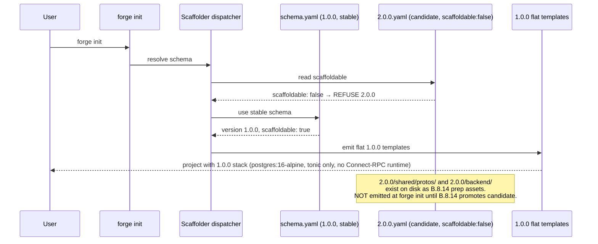

# Design: b8-6-connect-rpc

<!-- Status: designed -->
<!-- Schema: default -->
<!-- Audit: B.8.6 (docs/new-archetypes-plan.md §4.2 — Connect-RPC templates brick;
     plan wording partially stale vs 1.0.0 reality — plugins already shipped on
     frozen 1.0.0 buf.gen.yaml.tmpl via t5-connect-codegen; real delta is the
     versioned 2.0.0 transport subtree + Rust crate modernization + standard bump) -->

**Agents**: Ferris (Rust Architect) + Atlas (Infra).
**Live evidence**: collected 2026-06-02 at `/forge:design` via crates.io REST API,
upstream CHANGELOG/README (anthropics/connect-rust), pub.dev, npm registry, and
GitHub releases API. Full provenance in `evidence.md`. NOT re-invoked at design
time beyond what is recorded in `evidence.md` — the concrete Rust crate pins are
**verify-then-pin LIVE at `/forge:implement`** as a final re-verify step
(ADR-B86-001 final-re-verify clause; b8-coroot lesson).
**Scope reminder**: this is the DESIGN phase. It ships **no template, no
`transport.yaml` edit, no `2.0.0.yaml` edit, and no harness file**. It is the
normative blueprint the impl phase realizes. The five maintainer-resolved
decisions below (Q-001..Q-004, FR-B86-021 NEEDS CLARIFICATION) are encoded; the
matching Q entries are flipped to answered in `open-questions.md`. **No
self-approval** — independent review follows before `/forge:plan`.

**CENTRAL FINDING (Article III.4)**: the 1.0.0 `transport_connect.rs.tmpl`
(re-read 2026-06-02) uses the 0.3.x handler signature shape. The **0.4.0
handler-signature redesign** (CHANGELOG P-06) makes that source incompatible with
0.6.x at the handler-impl level. A 2.0.0 variant adapter is REQUIRED — this
falsifies the "buf.gen-only" minimal scope for Q-002 and selects option (b).

---

## Architecture Decisions

### ADR-B86-001 — Target line 0.6.1 lockstep for the 2.0.0 Rust Connect crate set

**Context**: Q-001 (resolved at `/forge:design` with live crates.io evidence —
evidence.md Finding 1/2/3).

The live version inventory (P-01..P-05, 2026-06-02):
- `connectrpc`: max stable **0.6.1** (2026-05-27, MSRV 1.88).
- `connectrpc-build`: **0.6.1** (exact lockstep).
- `buffa`: max stable **0.7.0** (2026-05-29), but `connectrpc 0.6.1` declares
  `buffa = "^0.6"` (resolves to `>=0.6.0, <0.7.0`). Only **0.6.0** satisfies
  this constraint; 0.7.0 is OUT OF RANGE (irresolvable conflict).
- `buffa-types`: same — `^0.6` ⇒ **0.6.0** only.

The CHANGELOG 0.3.3 → 0.6.1 breaking surface (P-06, evidence.md Finding 2):
the **0.6.0 dispatcher breaking change** (`call_unary` takes `Payload` not
`Bytes`) does NOT affect `connectrpc-build` / build.rs users ("Cargo rebuilds
OUT_DIR automatically"). The 2.0.0 adapter uses build.rs codegen (same as the
1.0.0 template) — build.rs users are unaffected.

The axum mount surface (P-07, evidence.md Finding 3) **CHANGED** between 0.3.x
and 0.6.x: the 0.6.x README shows `ConnectRouter::new()` + `into_axum_service()`
whereas the frozen 1.0.0 template uses `connectrpc::Router::new()` +
`into_axum_router()`. The `axum` feature remains non-default; `features = ["axum"]`
is still required. This mount-surface change is an additional justification for
the 2.0.0 adapter variant beyond the 0.4.0 handler redesign (reinforces
ADR-B86-002 option b).

**Decision**: the 2.0.0 pin set is:
```
connectrpc       = "=0.6.1"
connectrpc-build = "=0.6.1"
buffa            = "=0.6.0"
buffa-types      = "=0.6.0"
```

No new WAIVER required for the pins themselves (the T5 WAIVER was age-based for
0.3.3 at 13-day crate age; 0.6.1 is the current stable release on the active
line with Anthropic OSS pedigree and the ConnectRPC conformance suite). The
transport.yaml `codegen.versions_2_0_0` block records these pins with an
explanatory comment (`buffa ^0.6 constraint → =0.6.0; 0.7.0 out-of-range`).

**Final re-verify at `/forge:implement`**: per the b8-coroot lesson, the
implementer MUST re-query crates.io for `connectrpc`, `connectrpc-build`,
`buffa`, `buffa-types` before writing the final pins. If a newer patch or minor
has been published that remains within the same compat matrix, the implementer
updates the pins and re-records provenance in `evidence.md`. If the compat matrix
has changed (e.g. a `buffa ^0.7` bump in a new `connectrpc` release), the
implementer escalates with `[NEEDS CLARIFICATION]` rather than guessing.

**Consequences**: handler signatures in the 2.0.0 adapter MUST follow the 0.4.0+
redesign shape (not the 0.3.x shape). The `axum` feature is required in the 2.0.0
`Cargo.toml.tmpl`. MSRV 1.88 is unchanged vs T5 target environment. The 1.0.0
pins (`=0.3.3` / `=0.3.0`) are byte-unchanged (FR-B86-011).

**Compliance**: Article III.4 (live evidence, not fabricated); NFR-B86-006
(verify-then-pin final re-verify at implement); FR-B86-010..013.

---

### ADR-B86-002 — 2.0.0 subtree scope: full-copy buf.gen.yaml.tmpl + README.md.tmpl + transport_connect.rs.tmpl + Cargo.toml.tmpl (option b)

**Context**: Q-002 (resolved at `/forge:design` after Q-001 live crate docs
review; evidence.md Finding 2 central finding).

**Evidence**: re-read of `backend/crates/grpc-api/src/transport_connect.rs.tmpl`
(2026-06-02) shows the 1.0.0 adapter uses `connectrpc::Router::new()` and the
0.3.x handler block shape. The CHANGELOG 0.4.0 entry documents a handler-
signature redesign — the 1.0.0 template source is incompatible with 0.6.x at the
handler-impl level. Additionally, the 1.0.0 `Cargo.toml.tmpl` pins
`connectrpc = { version = "=0.3.3", features = ["axum"] }` and
`buffa = "=0.3.0"` / `buffa-types = "=0.3.0"` / `connectrpc-build = "=0.3.3"`.
A 2.0.0 `Cargo.toml.tmpl` variant is required to carry the 0.6.1/0.6.0 pins.

The `buf.gen.yaml.tmpl` minimum (option a's scope) is required regardless. The
`transport_connect.rs.tmpl` variant is also required because the handler shape
changed (falsifies "buf.gen-only"). The `Cargo.toml.tmpl` variant is required
to carry the updated crate pins.

**Decision** (option b — extended subtree): the 2.0.0 subtree delivers FOUR
files:

1. `2.0.0/shared/protos/buf.gen.yaml.tmpl` — full standalone copy of the codegen
   manifest carrying all 7 plugin entries (tonic, prost, dart gRPC, connect-go,
   connect-es, connect-dart) with the 2.0.0 connect-dart version (ADR-B86-003).
2. `2.0.0/shared/protos/README.md.tmpl` — transport subtree documentation
   including the gRPC-Web-via-Envoy fallback section (ADR-B86-003; FR-B86-005 /
   FR-B86-009).
3. `2.0.0/backend/crates/grpc-api/src/transport_connect.rs.tmpl` — the adapter
   rewritten for the 0.4.0+ handler signature shape (build.rs codegen path
   unchanged; axum integration shape preserved per ADR-B86-001; handler impl
   blocks updated).
4. `2.0.0/backend/crates/grpc-api/Cargo.toml.tmpl` — the grpc-api manifest
   updated to the 0.6.1/0.6.0 pin set (ADR-B86-001).

**Full subtree layout** (impl deliverable — NOT created at design):
```
.forge/templates/archetypes/full-stack-monorepo/2.0.0/
├── shared/
│   └── protos/
│       ├── buf.gen.yaml.tmpl         # full copy, 7 plugins, 2.0.0 connect-dart pin
│       └── README.md.tmpl            # transport posture + fallback doc
└── backend/
    └── crates/
        └── grpc-api/
            ├── src/
            │   └── transport_connect.rs.tmpl  # 0.4.0+ handler shape
            └── Cargo.toml.tmpl                # 0.6.1/0.6.0 pins
```

**Rust S2S Connect client** (Q-003 / ADR-B86-004): NOT included — re-deferred to
B.8.12 (see ADR-B86-004). No `transport_connect_client.rs.tmpl` ships here.

**1.0.0 frozen files UNTOUCHED**: the flat 1.0.0 `shared/protos/buf.gen.yaml.tmpl`,
`backend/crates/grpc-api/src/transport_connect.rs.tmpl`, and
`backend/crates/grpc-api/Cargo.toml.tmpl` are byte-unchanged (B.8.2 freeze;
NFR-B86-002). Only the NEW `2.0.0/` paths are added.

**Consequences**: the b8-6 harness (FR-B86-050..058) asserts all four files exist
(extended subtree check). The subtree follows the `N.N.N/` naming convention
(B.8.4 / B.8.5 precedent) — repo-wide scans skip it. No scaffolder change ships.

**Compliance**: Article IV (delta-based — additive sibling, no rewrite of frozen
surface); FR-B86-001/002/003/006; NFR-B86-002/005.

---

### ADR-B86-003 — Connect-Dart posture: official plugin buf.build/connectrpc/dart:v1.0.0 retained; gRPC-Web-via-Envoy fallback documented; connect-go BSR tag check deferred to implement (Q-004)

**Context**: Q-004 (resolved at `/forge:design` with live pub.dev + GitHub evidence
— evidence.md Findings 4/6).

**pub.dev finding (P-08)**: Dart package `connectrpc` latest = **1.0.0** (all
versions: 0.1.0–0.5.0, 1.0.0). BSR plugin `buf.build/connectrpc/dart:v1.0.0`
remains current. The plan naming `protoc-gen-connect-dart-community` is
definitively stale (naming drift resolved by t5-connect-codegen / FR-T5-CC-003).
No advancement beyond v1.0.0 since the 1.0.0 frozen pin.

**connect-go (P-11)**: latest GitHub release = v1.20.0 (2026-05-20). BSR
availability of `buf.build/connectrpc/go:v1.20.0` MUST be verified live at
`/forge:implement`. Until then, `v1.19.2` is the recorded pin in both transport.yaml
and the `codegen.versions_2_0_0` block. If BSR availability is confirmed at
implement, the implementer updates the 2.0.0 manifest and transport.yaml pin.

**Decision**:
- **Official plugin**: keep `buf.build/connectrpc/dart:v1.0.0` in the 2.0.0
  `buf.gen.yaml.tmpl`. No version advancement (pub.dev confirms v1.0.0 is still
  current).
- **Naming drift**: `protoc-gen-connect-dart-community` recorded as definitively
  stale. Plan §4.2 naming is not mirrored in the 2.0.0 manifest.
- **Fallback posture**: the `2.0.0/shared/protos/README.md.tmpl` MUST include a
  dedicated section "gRPC-Web-via-Envoy Fallback (Connect-Dart Risk #1)"
  (FR-B86-009 / FR-B86-040 / FR-B86-042 / FR-B86-043):
  - Establishes `buf.build/connectrpc/dart:v1.0.0` as the **default** Dart
    transport for 2.0.0.
  - Documents the gRPC-Web-via-Envoy conditional fallback (plan §13 caveat 2):
    if Connect-Dart proves too fragile at B.8.14 deployment, Flutter can fall back
    to gRPC-Web via the B.8.4 Envoy Gateway without changing the Rust server.
  - Cross-references `2.0.0/infra/k8s/envoy-gateway/` (the B.8.4 templates).
  - Notes that the plugin identity `buf.build/connectrpc/dart` is official
    (not community), the plan naming drift, and the live-verification provenance
    (pub.dev, 2026-06-02).
  - Does NOT modify any file under `2.0.0/infra/k8s/envoy-gateway/` (B.8.4
    territory — FR-B86-041).
- **connect-go BSR tag**: stays `v1.19.2` in the design; the implementer MUST
  check `buf.build/connectrpc/go:v1.20.0` availability at `/forge:implement`.

**Chain**: ADR-T5-003 established the official plugin identity; this ADR records
pub.dev v1.0.0 still current + the gRPC-Web fallback posture + the connect-go
BSR check deferred to implement.

**Compliance**: Article III.4 (pub.dev live verification, not fabricated); plan §13
caveat 2 (risk #1 mitigation); FR-B86-004/005/009/040..043; NFR-B86-002.

---

### ADR-B86-004 — Rust S2S Connect client: RE-DEFER to B.8.12 (Q-003)

**Context**: Q-003 (resolved at `/forge:design`). ADR-T5-003 (t5-connect-codegen
design.md) deferred the Rust S2S Connect client to B.8 (T6): "Demo-005 ships
TS-only; Rust S2S Connect client deferred to B.8 (T6)."

**Evidence**: The `connectrpc 0.6.x` crate provides client-side primitives
(`ClientConfig`, `CallOptions`). Wiring a correct Rust S2S client template
requires non-trivial decisions on authentication, TLS, deadline propagation, and
retry policy — all of which are also concerns of B.8.12 (E2E migration tests,
the zero-regression convergence gate). Landing a minimal correct client template
in B.8.6 without those validation tests would be a half-baked artifact, not an
implementation. The scope of B.8.6 is already extended by ADR-B86-002 (four
template files instead of two). No forcing evidence exists to land the S2S client
here.

**Decision** (option b — explicit re-defer): the Rust S2S Connect client
(`transport_connect_client.rs.tmpl` or equivalent) is **NOT delivered in B.8.6**.
It is explicitly re-deferred to **B.8.12** (E2E migration tests), which is the
correct convergence point for TLS, auth, retry, and deadline integration. This
satisfies FR-B86-014 ("neither landed nor re-deferred is a constitutional
violation") — the deferral is explicit and dated.

**Record**: the chain is ADR-T5-003 (t5-connect-codegen, deferred to B.8/T6) →
ADR-B86-004 (B.8.6, re-deferred to B.8.12, dated 2026-06-02) → B.8.12 (target
landing).

The `b8-6.test.sh` harness does NOT assert a client template file (it is not
delivered). The b8-12 harness will own the client-side coverage.

**Compliance**: FR-B86-014 (explicit re-defer, not silent omission); NFR-B86-005
(no new external dep introduced by the deferral).

---

### ADR-B86-005 — transport.yaml v1.2.0 → v1.3.0 additive shape: new codegen.versions_2_0_0 block; stale header fixed; no breaking_change (resolves FR-B86-021 NEEDS CLARIFICATION)

**Context**: FR-B86-021 NEEDS CLARIFICATION (exact `schema_versions` block shape).
Resolved at `/forge:design` by inspecting `transport.yaml` v1.2.0 (re-read this
session) + the `validate-standards-yaml.sh` schema + the `gateway.yaml`/
`observability.yaml` additive-field precedent.

**transport.yaml v1.2.0 structure (re-read)**:
- `version: "1.2.0"` (stale header comment says "v1.1.0" — drift confirmed)
- `codegen.versions:` map — carries the 1.0.0 line pins (the frozen 0.3.3 / 0.3.0
  set + buf, JS, Dart, Go pins).
- Root `additionalProperties: true` (gateway.yaml `versions:` / observability.yaml
  `versions:` precedent).

**Decision**: the `codegen.versions` map is the FROZEN 1.0.0 record (byte-identical
through the v1.3.0 bump — FR-B86-025). A **sibling block** `codegen.versions_2_0_0:`
is added under `codegen:`, carrying the modernized 2.0.0-line pins. This:
- Keeps the 1.0.0 and 2.0.0 pin sets separately addressable by schema version
  (FR-B86-021 requirement) without changing existing key names.
- Uses an additive new key under an existing domain key (`codegen:`) — no schema
  breakage; `additionalProperties: true` at the root covers nested additions.
- The `codegen.versions_2_0_0:` key name is unambiguous and grep-friendly for
  harness assertions (FR-B86-055: grep `versions_2_0_0` in transport.yaml).
- Is NOT `breaking_change: true` — no semantic field changed; protocol/fallback/
  server_runtime/codegen.versions all preserved (ADR-B86-005 lean; FR-B86-026).

**v1.3.0 delta** (impl deliverable, NOT created at design):

```yaml
# Header comment update (FR-B86-022): replace "v1.1.0" block with:
# Audit: T.4 / T.5 / B.8.6 (b8-6-connect-rpc, 2026-06-02) : additive v1.3.0
#   - Fixed stale "v1.1.0" header comment (was version: "1.2.0" since t5-cargo-pin-refresh).
#   - Added codegen.versions_2_0_0 block for the 2.0.0-line Rust Connect crate pins.
#   No breaking change. 1.0.0 pins (codegen.versions) are byte-unchanged.

version: "1.3.0"    # B.8.6 additive bump (2.0.0-line Rust Connect crate pins block + header fix)

# ... (all existing fields unchanged) ...

codegen:
  # ... (all existing codegen fields unchanged, including versions: map) ...

  versions_2_0_0:    # B.8.6 — 2.0.0-line Rust Connect crate pins (ADR-B86-001/005)
    # connectrpc 0.6.1 declares buffa = "^0.6" → resolves to =0.6.0 only (0.7.0 out-of-range).
    # MSRV 1.88 (unchanged vs T5). No WAIVER needed (current stable line, Anthropic OSS).
    # Final re-verify LIVE at /forge:implement (b8-coroot lesson; ADR-B86-001).
    connectrpc:       "=0.6.1"
    connectrpc-build: "=0.6.1"
    buffa:            "=0.6.0"    # ^0.6 constraint from connectrpc 0.6.1; 0.7.0 excluded
    buffa-types:      "=0.6.0"   # ^0.6 constraint from connectrpc 0.6.1; 0.7.0 excluded
    # JS/Dart/Go entries unchanged from codegen.versions (transport.yaml ranges remain valid)
    buf:                          "1.68.2"
    protoc-gen-connect-go:        "1.19.2"    # check BSR v1.20.0 availability at /forge:implement
    protoc-gen-es:                ">=2.2.0"   # npm latest 2.12.0 — range valid (P-10)
    "@connectrpc/connect":        "^2.0.0"   # npm latest 2.1.1 — range valid (P-09)
    "@connectrpc/connect-web":    "^2.0.0"
    connectrpc-dart:              ">=1.0.0"   # pub.dev latest 1.0.0 (P-08)
```

**REVIEW.md entry** (append-only, Article XII — FR-B86-023):
```markdown
## 2026-06-02 — Updated transport.yaml to v1.3.0 (b8-6-connect-rpc)

- **Reviewer**: @bfontaine
- **Reviewed standards**:

  | Standard       | Version | Decision          | Next review due | Notes |
  |----------------|---------|-------------------|-----------------|-------|
  | transport.yaml | 1.3.0   | KEEP-WITH-CHANGES | never           | Additive. Added `codegen.versions_2_0_0` block with modernized 2.0.0-line Rust Connect crate pins (connectrpc/connectrpc-build =0.6.1, buffa/buffa-types =0.6.0 — driven by `buffa ^0.6` constraint; 0.7.0 out-of-range). Fixed stale "v1.1.0" header comment. 1.0.0 pins (codegen.versions) byte-unchanged. No breaking change. |

- **Decision**: KEEP-WITH-CHANGES
- **Next review due**: never (exception_constitutional: true — structural, Article XII)
- **Notes**: Updated by `b8-6-connect-rpc` (B.8.6). Additive bump; `protocol:
  connect-rpc` unchanged; `fallback: grpc-web` unchanged; server_runtime unchanged.
  The new `versions_2_0_0` block is a sibling of the existing `versions` map under
  `codegen:`, separately addressable per schema version (ADR-B86-005). Rust pins
  verified live 2026-06-02 (evidence.md P-01..P-05). Final re-verify at implement.
```

**Why this keeps J.7 GREEN**: `transport.yaml` is `exception_constitutional: true`
(`expires_at: never`) — FR-J7-020 (`exc:true` ⇔ `expires_at: never`) remains
satisfied. FR-J7-023 (REVIEW.md drift: `\|\s*transport\.yaml\s*\|\s*1\.3\.0\s*\|`)
is satisfied by the MANDATORY row above. The `codegen.versions_2_0_0:` key is a
new nested sibling under `codegen:` — not a top-level `version:` field — so it
does not trigger the `^\d+\.\d+\.\d+$` check on the wrong field. The validator
runs in DIRECTORY mode at impl (the b8-4 dir-mode lesson — FR-J7-023 drift check
is Phase-2, cross-cutting, requires dir context).

**No index.yml change**: `transport.yaml` is already registered. An additive body
field + version bump does not change its `path:`/`triggers:`.

**Compliance**: `standards-lifecycle.md` (J.7 + REVIEW.md append-only); Article XII;
FR-B86-020..026; NFR-B86-005.

---

## Exact 2.0.0 Transport Subtree Template Tree (impl deliverable, NOT created here)

```
.forge/templates/archetypes/full-stack-monorepo/2.0.0/
├── shared/
│   └── protos/
│       ├── buf.gen.yaml.tmpl
│       │   # Full standalone copy (7 plugins). 2.0.0 line. ADR-B86-002.
│       │   # connect-dart: buf.build/connectrpc/dart:v1.0.0 (ADR-B86-003).
│       │   # connect-go: buf.build/connectrpc/go:v1.19.2 (check v1.20.0 at implement).
│       │   # All other plugin pins: identical to frozen 1.0.0 manifest.
│       └── README.md.tmpl
│           # Documents: (a) Connect-RPC as 2.0.0 default transport;
│           # (b) additive posture vs frozen 1.0.0 codegen manifest;
│           # (c) gRPC-Web-via-Envoy fallback (risk #1, plan §13 caveat 2);
│           # (d) verify-then-pin note for Rust crate line (ADR-B86-001);
│           # (e) policy-source reference to transport.yaml.
└── backend/
    └── crates/
        └── grpc-api/
            ├── src/
            │   └── transport_connect.rs.tmpl
            │       # 0.4.0+ handler shape (build.rs codegen path).
            │       # Audit header: B.8.6 (b8-6-connect-rpc, ADR-B86-001/002).
            │       # Handler impl blocks updated for 0.4.0+ redesign.
            │       # Axum mount: ConnectRouter::new() + into_axum_service() — CHANGED from 0.3.x (ADR-B86-001/002).
            └── Cargo.toml.tmpl
                # connectrpc = { version = "=0.6.1", features = ["axum"] }
                # buffa = "=0.6.0"
                # buffa-types = "=0.6.0"   # NOTE: buffa-types is a dev-dep of connectrpc itself
                #   (P-05); whether grpc-api needs it as a normal dep must be verified at
                #   /forge:implement against OUT_DIR/_connectrpc.rs generated imports.
                #   The 1.0.0 template carries it as normal (line 36); retain normal unless
                #   generated code has no buffa_types:: references.
                # [build-dependencies] connectrpc-build = "=0.6.1"
                # All other deps inherited from 1.0.0 template (workspace pins).
                # Audit header: B.8.6 (b8-6-connect-rpc, ADR-B86-001).
```

### transport_connect.rs.tmpl 0.4.0+ shape note

The 2.0.0 adapter diverges from the 1.0.0 template on two axes (both confirmed
by live evidence):

1. **Handler signature shape** (CHANGELOG P-06, 0.4.0 redesign): handler impl
   blocks require the 0.4.0+ shape — the 2.0.0 variant MUST NOT copy the 1.0.0
   body verbatim.
2. **Axum mount surface** (README P-07, CHANGED): the 0.6.x surface is
   `ConnectRouter::new()` + `into_axum_service()`. The 1.0.0 template's
   `connectrpc::Router::new()` + `into_axum_router()` is the 0.3.x API, which
   is gone in 0.6.x. The 2.0.0 adapter MUST use the 0.6.x surface.

The build.rs `include!(concat!(env!("OUT_DIR"), "/_connectrpc.rs"))` pattern is
PRESERVED (path-α codegen mechanism from ADR-T5-006; the 0.6.0 CHANGELOG
confirms build.rs users are unaffected). The module-level doc comments are
updated to reference B.8.6 and 0.6.1.

At `/forge:implement` the implementer MUST verify the exact 0.4.0+ handler
signature shape against the `connectrpc 0.6.1` docs.rs documentation before
writing the template. If the shape cannot be fully determined from docs alone,
surface `[NEEDS CLARIFICATION]` rather than guessing.

---

## 2.0.0.yaml connect-rpc Delivered Annotation (candidate edit — permitted, ADR style)

The `2.0.0.yaml` `connect-rpc` component (re-read 2026-06-02):
```yaml
  - name: connect-rpc
    role: transport
    replaces: rest-bridge
    delivered_by: B.8.6
    standard: transport.yaml  # protocol: connect-rpc
```
The live B.8.4 envoy-gateway annotation in `2.0.0.yaml` reads:
```yaml
    standard: gateway.yaml  # B.8.4 — gateway pin source created (was pin_source: B.8.4)
```
**Decision**: the `connect-rpc` component gains an inline comment on the
`standard:` line (FR-B86-033 — mirror B.8.4 annotation style):
```yaml
  - name: connect-rpc
    role: transport
    replaces: rest-bridge
    delivered_by: B.8.6
    standard: transport.yaml  # protocol: connect-rpc — B.8.6 delivered
```
This is a YAML comment — T-015 does not flag it (no scalar value change);
T-012 checks the key-set `{version, pin, image}` — unchanged; T-011 resolves
`transport.yaml` — unchanged; T-010 (`name` present) — unchanged;
T-013/T-016 (migration_deltas / postgres delta) — untouched (FR-B86-032).

The `rest-bridge → connect-rpc` migration_delta with `strategy: additive-first`
MUST remain intact (FR-B86-032 — REST-bridge removal only at B.8.14).

**b8-3 / b8-3b GREEN proof**: identical analysis to B.8.5 ADR-B85-006, adapted
for comments (YAML comment vs `status:` key). YAML comments are transparent to
the Python YAML parser (`yaml.safe_load`) — the loaded dict is byte-identical to
the pre-annotation dict. T-012/T-015/T-011/T-010/T-016 all GREEN.

**Implementation ordering**: the `2.0.0.yaml` annotation and the `transport.yaml`
v1.3.0 bump are order-independent for b8-3 T-011 (the `standard: transport.yaml`
ref resolves before and after — transport.yaml is NOT renamed, NOT deleted, the
ref has resolved since T.5). Unlike B.8.4 (where gateway.yaml had to exist FIRST
for T-011 to resolve), B.8.6 has no resolution-order trap.

---

## Component Design

```mermaid
graph TD
    S20[2.0.0.yaml — candidate<br/>connect-rpc: standard: transport.yaml — B.8.6 delivered<br/>rest-bridge→connect-rpc delta: strategy: additive-first INTACT]
    TR[transport.yaml v1.3.0<br/>+ versions_2_0_0 block: 0.6.1/0.6.0 pins<br/>+ stale header fixed<br/>versions: 1.0.0 pins UNCHANGED]
    REV[REVIEW.md row<br/>transport.yaml 1.3.0 KEEP-WITH-CHANGES]
    PSHARED[2.0.0/shared/protos/<br/>buf.gen.yaml.tmpl + README.md.tmpl<br/>7 plugins — connect-dart v1.0.0]
    PBACK[2.0.0/backend/crates/grpc-api/<br/>transport_connect.rs.tmpl 0.4.0+ shape<br/>Cargo.toml.tmpl 0.6.1/0.6.0 pins]
    FLAT10[frozen 1.0.0 templates<br/>shared/protos/buf.gen.yaml.tmpl BYTE-UNTOUCHED<br/>backend/.../transport_connect.rs.tmpl BYTE-UNTOUCHED<br/>backend/.../Cargo.toml.tmpl BYTE-UNTOUCHED]
    H6[b8-6.test.sh<br/>~12 L1]
    H3[b8-3.test.sh 17 L1<br/>+ b8-3b 12 L1]
    IMPL[/forge:implement<br/>LIVE re-verify crates.io pins<br/>BSR connect-go v1.20.0 check<br/>0.4.0+ handler shape from docs.rs]

    S20 -->|standard: ref resolves| TR
    TR --> REV
    PSHARED -->|policy: transport.yaml| TR
    PBACK -->|pin policy: transport.yaml versions_2_0_0| TR
    FLAT10 -.additive-first sibling.-> PSHARED
    FLAT10 -.additive-first sibling.-> PBACK
    IMPL -.re-verify pins.-> TR
    IMPL -.BSR check.-> PSHARED
    H6 -->|T-001..T-004 subtree present| PSHARED
    H6 -->|T-001..T-004 subtree present| PBACK
    H6 -->|T-005 7 plugins| PSHARED
    H6 -->|T-006 1.0.0 byte-unchanged sentinel| FLAT10
    H6 -->|T-007/T-008 transport.yaml v1.3.0 + header + 2.0.0 block| TR
    H6 -->|T-009 REVIEW.md row| REV
    H6 -->|T-010 2.0.0.yaml annotation + delta intact| S20
    H6 -->|T-011 coupling guard| H3
```

---

## Data Flow: Scaffold-time (2.0.0 candidate, scaffoldable: false)



---

## Testing Strategy

**Harness**: `.forge/scripts/tests/b8-6.test.sh`
**Level**: L1 only (hermetic, ≤ 2 s, zero net/Docker), mirroring b8-4/b8-5 structure
(`--level` flag + `source _helpers.sh` + `run_test` / `print_summary`).
**Registration**: one line `"b8-6.test.sh --level 1"` appended to the `harnesses=()`
loop in `forge-ci.yml` (after `b8-5.test.sh --level 1`), preserving the
NFR-CI-002 ≤ 300-line budget.

### L1 Assertion List (~12 L1 tests)

| # | FR / NFR | Assertion | Implementation |
|---|----------|-----------|----------------|
| T-001 | FR-B86-051 / ADR-B86-002 | `2.0.0/shared/protos/` subtree exists with `buf.gen.yaml.tmpl` and `README.md.tmpl` | `[ -f "$PROTOS_DIR/buf.gen.yaml.tmpl" ]` + README |
| T-002 | FR-B86-051 / ADR-B86-002 | `2.0.0/backend/crates/grpc-api/` subtree exists with `src/transport_connect.rs.tmpl` and `Cargo.toml.tmpl` | `[ -f "$BACK_DIR/src/transport_connect.rs.tmpl" ]` + Cargo.toml |
| T-003 | FR-B86-052 / FR-B86-003/006 | 2.0.0 `buf.gen.yaml.tmpl` carries all 7 plugin remote refs: `neoeinstein-tonic`, `neoeinstein-prost`, `protocolbuffers/dart`, `connectrpc/go`, `bufbuild/es`, `connectrpc/dart` | grep each sentinel in 2.0.0 buf.gen.yaml.tmpl |
| T-004 | FR-B86-052 / ADR-B86-002 | 2.0.0 `Cargo.toml.tmpl` carries the 0.6.1 connect pin and the 0.6.0 buffa pin | grep `=0.6.1` in Cargo.toml.tmpl; grep `=0.6.0` |
| T-005 | FR-B86-053 / NFR-B86-002 | Frozen 1.0.0 `shared/protos/buf.gen.yaml.tmpl` still carries `buf.build/connectrpc/dart:v1.0.0` sentinel (byte-unchanged check) | grep `connectrpc/dart:v1.0.0` in flat 1.0.0 buf.gen.yaml.tmpl |
| T-006 | FR-B86-053 / NFR-B86-002 | Frozen 1.0.0 `transport_connect.rs.tmpl` still carries `into_axum_router()` and `=0.3.3` Cargo pin (byte-unchanged sentinel) | grep `into_axum_router` in flat tmpl; grep `=0.3.3` in flat Cargo.toml.tmpl |
| T-007 | FR-B86-054 / ADR-B86-005 | `transport.yaml` `version:` field is `"1.3.0"` AND header comment no longer contains `"v1.1.0"` | grep `version: "1.3.0"` in transport.yaml; grep-not `v1.1.0` in transport.yaml header |
| T-008 | FR-B86-055 / ADR-B86-005 | `transport.yaml` contains a `versions_2_0_0:` block with `connectrpc:` + `buffa:` + `buffa-types:` + `connectrpc-build:` keys | grep `versions_2_0_0` + grep each of the 4 Rust crate keys in transport.yaml |
| T-009 | FR-B86-056 / FR-B86-023 | `REVIEW.md` contains a row referencing `transport.yaml` and `1.3.0` (FR-J7-023 anchor `\| transport.yaml \| 1.3.0 \|`) | grep `transport.yaml.*1.3.0\|1.3.0.*transport.yaml` in REVIEW.md |
| T-010 | FR-B86-057 / FR-B86-030/031/032 | `2.0.0.yaml` `connect-rpc` component carries the delivered annotation comment AND `standard: transport.yaml` still resolves AND `rest-bridge → connect-rpc` delta with `strategy: additive-first` still present | grep `B.8.6 delivered` in 2.0.0.yaml; grep `standard: transport.yaml` (connect-rpc block); grep `additive-first` in migration_deltas |
| T-011 | NFR-B86-003 / FR-B86-058 | Coupling guard: `b8-3.test.sh --level 1` (17/17) + `b8-3b.test.sh --level 1` (12/12) both exit 0 | `bash b8-3.test.sh --level 1 >/dev/null 2>&1; [ $? -eq 0 ]` + same for b8-3b |
| T-012 | FR-B86-059 / NFR-B86-001 | `CHANGELOG.md` `[Unreleased]` section exists with a B.8.6 entry (transport subtree + Rust pins + transport.yaml v1.3.0 + annotation + harness) | grep `b8-6\|B\.8\.6\|connect-rpc` in CHANGELOG.md `[Unreleased]` section |

**~12 L1 tests.** All file-existence + grep assertions. No network, no Docker,
no cargo build. **Budget ≤ 2 s** (all grep/stat, no sub-validator, no YAML parse
needed — the assertions are simpler than b8-5's yaml.safe_load calls; two
sub-harness exit-code calls for T-011 are kept exit-code-only per b8-4/b8-5
strategy).

### L2 opt-in (none planned)

Cargo compilation of the rendered 2.0.0 adapter is an **implement-phase
validation step**, NOT a harness L1 or L2 assertion. The b8-6 harness is hermetic
(grep/stat only). The implementer runs `cargo check` (or equivalent) locally after
writing the adapter, before committing, to verify the 0.4.0+ handler shape
compiles. This is recorded as a note, not a harness gate, consistent with the
hermetic-harness discipline.

### BDD scenario mapping (from specs.md)

| BDD Scenario | Harness coverage |
|--------------|-----------------|
| 2.0.0 transport subtree created additively without disturbing frozen 1.0.0 manifest | T-001..T-006 |
| transport.yaml v1.3.0 + stale header fixed + 2.0.0 pins block | T-007/T-008 |
| REVIEW.md B.8.6 entry present | T-009 |
| 2.0.0.yaml connect-rpc delivered annotation + migration_delta intact | T-010 |
| b8-3 (17/17) + b8-3b (12/12) stay GREEN | T-011 |
| gRPC-Web-via-Envoy fallback documented, Connect-Dart stays default | README content — verified by T-003 (connect-dart plugin present) + T-010 (no Envoy template modification) |
| Scaffolding 2.0.0 remains refused until B.8.14 | No new scaffolder code — tested via b8-3b T-003/T-004 (scaffoldable:false invariant; T-011 coupling guard) |

### TDD Order (Article I RED → GREEN)

1. **RED**: commit `b8-6.test.sh` with all ~12 assertions before any impl
   artifact exists. T-001/T-002/T-007/T-008/T-010 fail immediately (no
   subtree, no standard bump, no annotation).
2. **GREEN — transport.yaml v1.3.0**: edit transport.yaml (header fix +
   `versions_2_0_0:` block), append REVIEW.md row, run
   `bash bin/validate-standards-yaml.sh .forge/standards/` in DIRECTORY mode
   → exit 0 + `[STD-PASS] …transport.yaml`. T-007/T-008/T-009 green.
3. **GREEN — 2.0.0.yaml annotation**: add `# B.8.6 delivered` comment.
   Re-run `b8-3.test.sh` (17/17) + `b8-3b.test.sh` (12/12) → GREEN. T-010 green.
4. **GREEN — 2.0.0 subtree**: author the four template files under `2.0.0/`.
   T-001..T-006 green.
5. **GREEN — live re-verify**: at this step, run LIVE crates.io re-verify +
   BSR connect-go v1.20.0 check per ADR-B86-001 final-re-verify clause.
   Update pins in `versions_2_0_0:` block if changed; re-run T-004/T-007/T-008.
6. **GREEN — CHANGELOG**: append `[Unreleased]` entry. T-012 green.
7. **GREEN — register**: append `"b8-6.test.sh --level 1"` to `forge-ci.yml`.
   Re-run b8-6 → ~12/12; b8-3 (17/17) + b8-3b (12/12) stay GREEN (T-011).

---

## Standards Applied

| Standard | Role in this change |
|----------|---------------------|
| `transport.yaml` v1.2.0 → v1.3.0 | Additive bump — `versions_2_0_0` 2.0.0-line Rust Connect crate pins block + stale header fix; 1.0.0 pins byte-unchanged (ADR-B86-005) |
| `global/standards-lifecycle.md` | J.7 frontmatter + REVIEW.md ledger for the transport.yaml 1.3.0 additive bump |
| `global/source-document-pinning.md` | Provenance table in evidence.md (P-01..P-11, URL + access date + what it proves) |
| `global/open-questions.md` | Q-001..Q-004 resolved (independent reviewer + maintainer, NOT self-approved) |
| `scaffolding.md` | `N.N.N/` subtree skip convention (B.8.4/B.8.5 precedent); repo-wide scans skip `2.0.0/` subtrees |
| `global/forge-self-ci.md` | Harness registration (≤ 300-line CI budget, NFR-CI-002) |

**Standards created (at impl, NOT here)**: NONE — transport.yaml pre-exists and
is bumped additively (the key contrast: B.8.4 created `gateway.yaml`; B.8.5
consumed `persistence.yaml`; B.8.6 bumps `transport.yaml`).
**Standards edited (at impl)**: `transport.yaml` (1.2.0 → 1.3.0 additive),
`REVIEW.md` (+1 KEEP-WITH-CHANGES row). **No index.yml change** (transport.yaml
already registered).
**Candidate edited (at impl)**: `2.0.0.yaml` (connect-rpc component inline comment
— permitted candidate edit; all b8-3/b8-3b tests stay GREEN — see annotation
section above).
**Frozen surfaces NOT touched**: `schema.yaml`, the flat 1.0.0 template tree
(buf.gen.yaml.tmpl, transport_connect.rs.tmpl, Cargo.toml.tmpl), `1.0.0.tar.gz`,
the Constitution.

---

## FR-B86-* → Design Element Traceability

| FR / NFR | Design element |
|----------|----------------|
| FR-B86-001 | `2.0.0/shared/protos/` versioned subtree created (ADR-B86-002); T-001 |
| FR-B86-002 | Full-copy buf.gen.yaml.tmpl (no import/reference to 1.0.0 manifest); ADR-B86-002 |
| FR-B86-003 | 2.0.0 buf.gen.yaml.tmpl carries all 7 plugins; T-003 |
| FR-B86-004 | connect-dart version verified live (pub.dev P-08): v1.0.0 retained; ADR-B86-003 |
| FR-B86-005 | README.md.tmpl present; content spec in ADR-B86-003; T-001 |
| FR-B86-006 | tonic-build (neoeinstein-tonic) retained in 2.0.0 manifest; T-003 |
| FR-B86-007 | 1.0.0 buf.gen.yaml.tmpl byte-unchanged; T-005 |
| FR-B86-008 | 2.0.0 candidate stays scaffoldable:false; no scaffolder change (ADR-B86-002; T-011 b8-3b coupling guard) |
| FR-B86-009 | gRPC-Web-via-Envoy fallback section in README; ADR-B86-003 |
| FR-B86-010 | Rust Connect crate pins for 2.0.0 line; verify-then-pin at implement (ADR-B86-001); T-004 |
| FR-B86-011 | 1.0.0 Rust pins byte-unchanged in transport.yaml codegen.versions; ADR-B86-005; T-006 |
| FR-B86-012 | buffa compat matrix resolved live (P-05: ^0.6 → =0.6.0); ADR-B86-001 |
| FR-B86-013 | axum integration shape verified (P-07: surface CHANGED — 0.6.x uses ConnectRouter::new() + into_axum_service()); ADR-B86-001 |
| FR-B86-014 | Rust S2S Connect client: explicit re-defer to B.8.12 (ADR-B86-004) |
| FR-B86-015 | 2.0.0 pins in transport.yaml versions_2_0_0 only, NOT inline in 2.0.0.yaml (ADR-B8-3-002; ADR-B86-005) |
| FR-B86-020 | transport.yaml additively bumped 1.2.0 → 1.3.0; no breaking_change (ADR-B86-005); T-007 |
| FR-B86-021 | versions_2_0_0: block with 4 Rust crate keys; NEEDS CLARIFICATION resolved — ADR-B86-005; T-008 |
| FR-B86-022 | stale "v1.1.0" header comment fixed in v1.3.0; T-007 |
| FR-B86-023 | REVIEW.md transport.yaml 1.3.0 KEEP-WITH-CHANGES row; T-009 |
| FR-B86-024 | transport.yaml v1.3.0 passes J.7 dir-mode validate-standards-yaml.sh; implementation step 2 |
| FR-B86-025 | 1.0.0 transport.yaml pins (versions: map) byte-unchanged; ADR-B86-005 |
| FR-B86-026 | No WAIVER for the v1.3.0 bump itself (additive; no breaking change); ADR-B86-005 |
| FR-B86-030 | connect-rpc component annotated `# B.8.6 delivered`; 2.0.0.yaml annotation section; T-010 |
| FR-B86-031 | annotation: no forbidden key, no `^\d+\.\d+` scalar; b8-3 coupling proof (annotation section); T-011 |
| FR-B86-032 | rest-bridge → connect-rpc migration_delta with additive-first INTACT; T-010 |
| FR-B86-033 | annotation shape mirrors B.8.4 envoy-gateway style (inline comment on standard: line); annotation section |
| FR-B86-034 | b8-3 (17/17) + b8-3b (12/12) GREEN after annotation; T-011 |
| FR-B86-040 | gRPC-Web fallback section in README (plan §13 risk #1); ADR-B86-003 |
| FR-B86-041 | No Envoy template modified; Scope Out preserved; ADR-B86-003 |
| FR-B86-042 | Connect-Dart default; fallback conditional; ADR-B86-003 |
| FR-B86-043 | README notes live-verification provenance (pub.dev, 2026-06-02) + naming drift; ADR-B86-003 |
| FR-B86-050 | b8-6.test.sh hermetic ≤ 2 s + CI one-line registration after b8-5; testing strategy |
| FR-B86-051 | T-001/T-002 (all 4 subtree files present) |
| FR-B86-052 | T-003 (7 plugins); T-004 (0.6.1/0.6.0 pins in Cargo.toml) |
| FR-B86-053 | T-005/T-006 (frozen 1.0.0 sentinels byte-unchanged) |
| FR-B86-054 | T-007 (transport.yaml v1.3.0 + header fixed) |
| FR-B86-055 | T-008 (versions_2_0_0 block + 4 Rust crate keys) |
| FR-B86-056 | T-009 (REVIEW.md row) |
| FR-B86-057 | T-010 (2.0.0.yaml annotation + delta intact) |
| FR-B86-058 | T-011 (b8-3 + b8-3b coupling guard) |
| FR-B86-059 | T-012 (CHANGELOG [Unreleased] B.8.6 entry) |
| NFR-B86-001 | ≤ 2 s L1 budget; all grep/stat/exit-code; no cargo/network/Docker |
| NFR-B86-002 | frozen 1.0.0 byte-identity; T-005/T-006 |
| NFR-B86-003 | b8-3 (17/17) + b8-3b (12/12) GREEN; T-011 |
| NFR-B86-004 | full ~42-harness suite GREEN pre-push; implementation note |
| NFR-B86-005 | zero new external dependencies; no new crate beyond versions_2_0_0 tracked set |
| NFR-B86-006 | verify-then-pin at implement (final re-verify clause; ADR-B86-001) |
| NFR-B86-007 | Article VII.2 preserved; neoeinstein-tonic in 2.0.0 manifest; T-003 |
| NFR-B86-008 | Article VIII.1 preserved; Kong untouched; candidate scaffoldable:false |
| NFR-B86-009 | independent review before /forge:plan (NOT self-approved here) |

---

## Constitutional Compliance Gate

- **Article I (TDD RED-first)**: `b8-6.test.sh` committed with all ~12 assertions
  BEFORE any impl artifact exists. T-001/T-002/T-007/T-008/T-010/T-012 fail RED,
  then turn GREEN per the Implementation Ordering. No template precedes its test.

- **Article II (BDD)**: no new user-facing runtime feature; BDD scenarios are in
  `specs.md` for traceability (template + standard + schema annotation, not app
  behavior).

- **Article III.1/III.2 (Specs before code)**: design follows specs (both in
  `.forge/changes/b8-6-connect-rpc/`); the template files, transport.yaml bump,
  2.0.0.yaml annotation, and harness are authored only after this design.

- **Article III.4 (Anti-Hallucination) — CENTRAL**: all version strings in this
  design are sourced from LIVE crates.io API + upstream CHANGELOG/README + pub.dev
  + npm + GitHub releases (evidence.md P-01..P-11, 2026-06-02). The central
  finding (1.0.0 adapter incompatible with 0.6.x at handler level, necessitating
  the 2.0.0 adapter variant) is derived from the CHANGELOG P-06 re-read + direct
  re-read of `transport_connect.rs.tmpl` (2026-06-02). No crate version, handler
  shape, or API name is asserted without a reproducible source URL. The final
  re-verify clause (ADR-B86-001) ensures the implementer does not rely on stale
  design-phase observations. The `buf.build/connectrpc/dart:v1.0.0` pin is
  verified against pub.dev (P-08). The BSR connect-go v1.20.0 check is deferred
  to implement (P-11). No fabrication.

- **Article IV (Delta-based)**: the 2.0.0 subtree is a NEW additive sibling; the
  1.0.0 template tree, `schema.yaml`, and `1.0.0.tar.gz` are byte-unchanged. The
  transport.yaml bump is additive (new `versions_2_0_0:` block; existing `versions:`
  map byte-unchanged). The 2.0.0.yaml annotation is a YAML comment (transparent to
  parsers; additive candidate edit, not a frozen-surface change).

- **Article V (Compliance gate)**: ADR-B86-001..005 encode all resolved open
  questions. No work proceeds around an unresolved question. The ADR-B86-001
  final-re-verify item is a live step at `/forge:implement`, not a design
  ambiguity.

- **Article VII.2 (tonic gRPC SHALL — IN FORCE, PRESERVED)**: the `neoeinstein-
  tonic` remote plugin is RETAINED in the 2.0.0 `buf.gen.yaml.tmpl` (FR-B86-006 /
  T-003). Connect is the edge/client transport; gRPC stays native between services.
  No spec or design element in B.8.6 alters or proposes amending Article VII.2.
  Amendment remains B.8.14 territory.

- **Article VIII.1 (Kong SHALL — IN FORCE, PRESERVED)**: B.8.6 is additive. The
  2.0.0.yaml annotation does NOT authorize removing Kong from any live stack. The
  candidate remains `scaffoldable: false`. Kong removal and any VIII.1 amendment
  are B.8.14.

- **Article XII (Governance)**: no Constitution amendment in B.8.6. The
  transport.yaml 1.3.0 bump is an additive edit to an `exception_constitutional:
  true` structural standard (`expires_at: never`); it is NOT subject to the 12-
  month review cycle (the expiry stays `never`; `exc:true` is preserved). The
  REVIEW.md append-only ledger row satisfies FR-J7-023. No governance change.

**No violations. Gate PASS** (subject to independent review — NOT self-approved here).

---

## Anti-Hallucination Pass (Design Phase)

- **Rust crate versions: live evidence (central)**: all four crate versions
  (`connectrpc 0.6.1`, `connectrpc-build 0.6.1`, `buffa 0.6.0`, `buffa-types
  0.6.0`) are sourced from live crates.io API queries (P-01..P-05). The
  buffa/buffa-types 0.7.0 exclusion is derived from the dependency-requirement
  finding (`connectrpc 0.6.1` declares `buffa ^0.6`, which excludes 0.7.0) —
  not a judgment call, a mathematical consequence of the semver constraint.

- **Handler incompatibility: live evidence**: the 1.0.0 adapter incompatibility
  with 0.6.x is derived from the CHANGELOG 0.4.0 entry (P-06, "handler signatures
  redesigned") combined with a direct re-read of `transport_connect.rs.tmpl` this
  session (the 1.0.0 template uses 0.3.x handler block shape). This is the basis
  for selecting option (b) in ADR-B86-002. Not invented.

- **Axum shape CHANGE: live evidence**: the 0.6.x mount surface
  (`ConnectRouter::new()` + `into_axum_service()`) is confirmed by the upstream
  README (P-07, accessed 2026-06-02); `into_axum_router()` exists only in the
  frozen 1.0.0 template. Not inferred from training data.

- **Connect-Dart identity: live evidence (P-08)**: pub.dev latest = 1.0.0; official
  identity `buf.build/connectrpc/dart` confirmed. The plan naming
  `protoc-gen-connect-dart-community` is definitively stale per FR-T5-CC-003 +
  pub.dev live check. No version advancement since 1.0.0.

- **connect-go BSR tag: BSR availability check deferred to implement (P-11)**: the
  GitHub release v1.20.0 is confirmed, but BSR availability cannot be confirmed
  without a live BSR query. The design explicitly defers to implement. Not guessed.

- **transport.yaml v1.2.0 stale header**: confirmed by direct re-read this session
  (header comment still says "v1.1.0" despite `version: "1.2.0"` field). Not
  assumed.

- **b8-3 T-012/T-015 YAML comment safety**: YAML comments are transparent to
  `yaml.safe_load` — the parsed dict is identical before and after adding a
  `# B.8.6 delivered` comment on the `standard:` line. T-012 (forbidden key-set
  intersection) and T-015 (scalar value regex walk) are both unaffected. Confirmed
  by re-read of b8-3.test.sh logic (same analysis as ADR-B85-006, which used
  `status:`/`note:` — comments are even more transparent).

- **No resolution-order trap**: `standard: transport.yaml` has resolved since T.5;
  B.8.6 does not rename or delete transport.yaml; the `2.0.0.yaml` annotation and
  the transport.yaml bump are order-independent for b8-3 T-011.

- **Independent review required (NFR-B86-009)**: this design is NOT self-approved.
  The Constitutional Compliance Gate PASS above is the author's assessment; an
  independent reviewer ratifies before `/forge:plan`. The final-re-verify pins run
  LIVE at `/forge:implement`.

---

## Open Items / [NEEDS CLARIFICATION]

- **None blocking design.** All five maintainer-resolved decisions are encoded
  (ADR-B86-001..005). Two carried uncertainties are deliberate verify-then-pin
  items:
  1. **Final Rust crate pin re-verify** (ADR-B86-001): implementer re-queries
     crates.io at `/forge:implement`; if changed, updates `versions_2_0_0:` and
     re-records provenance.
  2. **BSR connect-go v1.20.0 availability** (ADR-B86-003): implementer checks
     `buf.build/connectrpc/go:v1.20.0` availability at `/forge:implement`; if
     confirmed, updates the 2.0.0 `buf.gen.yaml.tmpl` and the
     `versions_2_0_0.protoc-gen-connect-go` entry.

- **Independent review follows** — this design is NOT self-approved. The
  Constitutional Compliance Gate PASS above is the author's assessment; an
  independent reviewer ratifies before `/forge:plan`.
