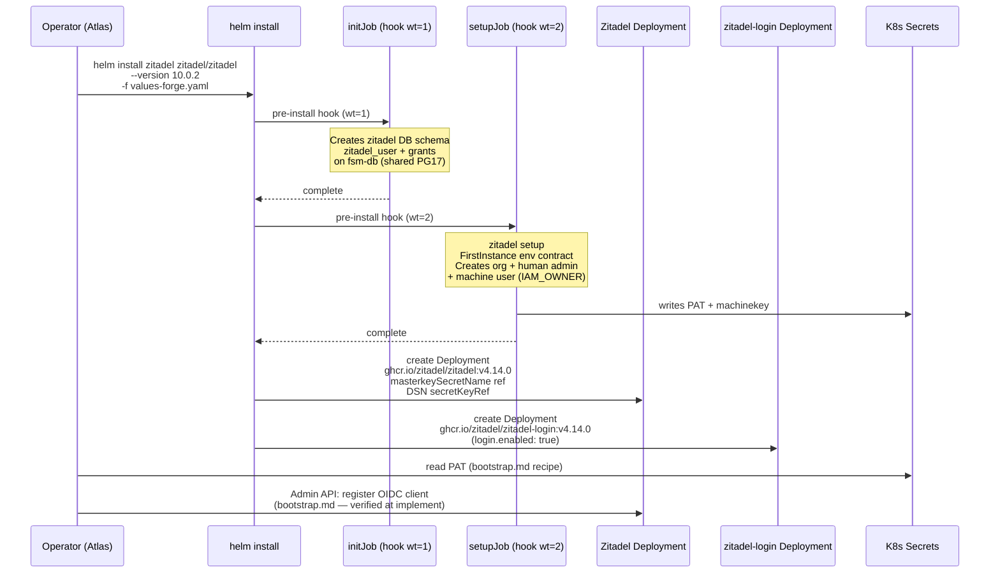
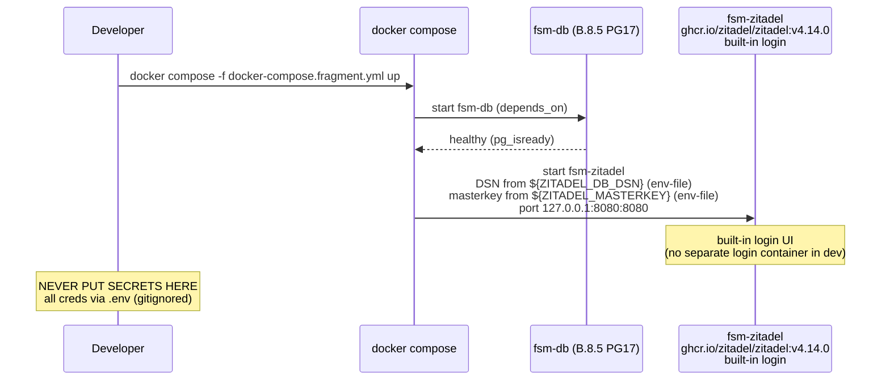

# Design: b8-7-zitadel

<!-- Status: designed -->
<!-- Schema: default -->
<!-- Audit: B.8.7 (docs/new-archetypes-plan.md §4.2 — Zitadel templates brick;
     ratified by ADR-007 ARCHITECTURE-TARGET.md — INTRODUCE identity (additive);
     GROUND-TRUTH NOTE (Article III.4): the 1.0.0 flagship ships NO identity at all;
     this brick INTRODUCES Zitadel IdP infrastructure, it migrates nothing) -->

**Agent**: Atlas (Infrastructure Architect).
**Live evidence**: collected 2026-06-02 at `/forge:design` via GitHub Releases
API, raw `zitadel/zitadel-charts` Chart.yaml + values.yaml, `zitadel/zitadel`
steps.yaml, and live `docker manifest inspect` calls. Full provenance in
`evidence.md` (P-01..P-14). NOT re-invoked beyond what is recorded in
`evidence.md` — concrete pins are **verify-then-pin LIVE at `/forge:implement`**
as a final re-verify step (ADR-B87-001 final-re-verify clause; b8-coroot lesson).
**Scope reminder**: this is the DESIGN phase. It ships **no template, no
`identity.yaml` edit, no `2.0.0.yaml` edit, and no harness file**. It is the
normative blueprint the impl phase realizes. The six maintainer-resolved
decisions below (Q-001..Q-005) are encoded; the matching Q entries are flipped
to answered in `open-questions.md`. **No self-approval** — independent review
follows before `/forge:plan`.

**CENTRAL FINDING (lean falsification, Article III.4)**: the proposal leaned
toward manifests-only delivery (Q-001 option a). Live evidence **FALSIFIES**
this lean: chart `10.0.2` carries operator-grade machinery (initJob + setupJob
Helm hooks, K8s Secret generation, login-UI wiring) that would require
significant re-implementation if vendoring raw manifests. The setupJob IS the
bootstrap mechanism. The correct posture mirrors B.8.4 ADR-B84-003 — the chart
is Atlas-installed; the brick vendors only the Forge values overlay + README +
compose fragment + bootstrap doc (option b, ADR-B87-001). This falsification is
recorded explicitly, mirroring the B.8.5 DBOS precedent.

---

## Architecture Decisions

### ADR-B87-001 — Install posture: chart-referenced hybrid (option b), NOT manifests-only; pin chart 10.0.2 / appVersion v4.14.0 (resolves Q-001 + Q-004)

**Context**: Q-001 (install source + pins) + Q-004 (login-UI topology), resolved
at `/forge:design` with live GitHub Releases API, Chart.yaml (P-02/P-03), values.yaml
(P-07/P-08), and image manifest probes (P-12/P-13/P-14, 2026-06-02).

**Lean falsification**: the proposal leaned manifests-only (option a). Evidence
falsifies this:
1. The chart carries initJob (DB schema/user init) + setupJob (first-org +
   machine-user + K8s Secret generation) — Helm hooks that would require
   re-implementation in raw-manifest form.
2. The login-UI split (`login.enabled: true` default, P-07) adds
   `ghcr.io/zitadel/zitadel-login:v4.14.0` as a separate Deployment — chart
   wires this automatically; manifests-only would duplicate that wiring.
3. A `kustomization.yaml.tmpl` over raw manifests provides no additional value
   when the chart already handles the full lifecycle. The `N.N.N/` subtree
   convention is satisfied by the values overlay + README.

**Pin rationale**: chart `10.0.2` / appVersion **`v4.14.0`** is the chart-tested
pair (Chart.yaml P-03: `appVersion: v4.14.0`). The latest Zitadel app release
`v4.15.0` (P-01) is NOT used: no published chart version declares `v4.15.0`
as its tested appVersion. Using `v4.15.0` would mean running an untested
image/chart combination. Evidence.md Finding 4 records this rationale.

**Registry identity** (b8-coroot lesson — verified live):
- Main image: `ghcr.io/zitadel/zitadel` (GitHub Container Registry; NOT docker.io)
- Login image: `ghcr.io/zitadel/zitadel-login` (same registry)
- v-prefix convention: `v4.14.0` (opposite of coroot's no-v-prefix — recorded)

**Deliverable subtree**:
```
.forge/templates/archetypes/full-stack-monorepo/2.0.0/infra/zitadel/
├── values-forge.yaml.tmpl          # Forge values overlay for helm install
├── README.md.tmpl                  # Atlas install block + compliance + bootstrap doc
├── docker-compose.fragment.yml.tmpl # Dev compose fragment (built-in login, single svc)
└── bootstrap.md.tmpl               # OIDC client + post-bootstrap Admin API recipe
```

Note: **no `kustomization.yaml.tmpl`** — the chart-referenced hybrid does not
vendor raw K8s manifests. FR-B87-002 (kustomization lists all resources) was
written for the manifests-only lean; at design it is superseded by this ADR.
The `values-forge.yaml.tmpl` is the equivalent vendor artifact for the
chart-referenced posture (consistent with B.8.4 which vendors no CRDs either).

**Login topology in K8s vs dev**:
- K8s (`values-forge.yaml.tmpl`): `login.enabled: true` (chart default, retained
  — two containers: main + login-UI). Documented in README.
- Dev (`docker-compose.fragment.yml.tmpl`): single `fsm-zitadel` service using
  the main image with built-in login (`login.enabled: false` equivalent for
  compose). Documented difference recorded in README (not an error).

**Final re-verify at `/forge:implement`**: re-query GitHub Releases API +
Chart.yaml + `docker manifest inspect` for all three image/chart pins before
writing the final overlay and identity.yaml bump. If a newer chart has published
with a different appVersion, update pins and record provenance (P-15+).

**Consequences**: no raw manifests are vendored; the subtree has 4 files instead
of the ~6-8 file estimate in the proposal. FR-B87-002 (kustomization) does not
apply in the chart-referenced posture — the harness asserts the 4 delivered
files instead. The b8-7 harness is adjusted accordingly (see Testing Strategy).

**Compliance**: Article III.4 (lean falsified explicitly, not silently); ADR-B84-003
pattern (chart reference + README install block); FR-B87-001/003/009; NFR-B87-007.

---

### ADR-B87-002 — Datastore: shared 2.0.0 fsm-db (dedicated zitadel database + role) (resolves Q-002)

**Context**: Q-002 (datastore topology), resolved at `/forge:design` with live
values.yaml Postgres compat check (P-04, 2026-06-02).

**Evidence**: values.yaml lines 26–27 (P-04): "ZITADEL requires **PostgreSQL 14+**
as its backing database." B.8.5 ships `pgvector/pgvector:0.8.2-pg17` (Postgres 17).
17 ≥ 14. Compatibility **confirmed**. Evidence.md Finding 1.

**Decision** (option a — shared fsm-db):
- Dev: Zitadel connects to the B.8.5 `fsm-db` Postgres 17 instance via a
  dedicated `zitadel` database and `zitadel_user` role.
- Dev compose fragment: `fsm-zitadel` service depends on `fsm-db`; DSN injected
  via `${ZITADEL_DB_DSN}` env-var (env-file sourced, never hardcoded).
- DB/role init: the compose fragment includes a one-time init note; K8s-side
  the chart's initJob (P-09) handles schema/user creation automatically.
- T2/T3 production: dedicated Postgres instance with network isolation — documented
  in README as the production posture recommendation (FR-B87-034).

**No Bitnami postgresql subchart** (`postgresql.enabled: false` in
`values-forge.yaml.tmpl` — we have B.8.5; no bundled Postgres in the chart).

**Consequences**: the compose fragment has a `depends_on: fsm-db` entry. The
README documents the shared-fsm-db dev posture explicitly and contrasts it with
the dedicated-instance T2/T3 recommendation. No second Postgres container.

**Compliance**: Article IV (additive, no 1.0.0 fsm-db change); FR-B87-030/031/033/034;
NFR-B87-007.

---

### ADR-B87-003 — Bootstrap: chart-native two-stage (setupJob + FirstInstance env contract) + Admin API recipe for OIDC client (resolves Q-003)

**Context**: Q-003 (bootstrap mechanism), resolved at `/forge:design` with live
values.yaml setupJob (P-10) and steps.yaml FirstInstance contract (P-11), 2026-06-02.

**Evidence**:
- The chart **setupJob** (P-10, Helm hook weight 2) runs `zitadel setup`, creates
  the first organisation, admin user, machine user, and generates credentials as
  K8s Secrets. This IS the bootstrap mechanism — no separate Job needs to be
  authored (lean falsified in that respect: the chart replaces a custom Job).
- The **FirstInstance** env-var contract (P-11, `cmd/setup/steps.yaml` lines 114–158)
  drives the setupJob via env mirrors. Verified env-var names (NOT fabricated):
  - `ZITADEL_FIRSTINSTANCE_INSTANCENAME`
  - `ZITADEL_FIRSTINSTANCE_TRUSTEDDOMAINS`
  - `ZITADEL_FIRSTINSTANCE_ORG_NAME`
  - `ZITADEL_FIRSTINSTANCE_ORG_HUMAN_USERNAME` / `_PASSWORD` / `_PASSWORDCHANGEREQUIRED`
  - `ZITADEL_FIRSTINSTANCE_ORG_MACHINE_MACHINE_USERNAME`
  - `ZITADEL_FIRSTINSTANCE_MACHINEKEYPATH` (top-level under FirstInstance:, steps.yaml L119–122)
  - `ZITADEL_FIRSTINSTANCE_PATPATH` (top-level under FirstInstance:, steps.yaml L119–122)
  - `ZITADEL_FIRSTINSTANCE_LOGINCLIENTPATPATH` (top-level under FirstInstance:, steps.yaml L119–122)
  **Note**: `MachineKeyPath`, `PatPath`, and `LoginClientPatPath` are top-level
  fields directly under `FirstInstance:` — NOT nested under `Org.Machine`. Only
  `Machine_Username` is org-nested. These three receive the machine user's
  key/PAT paths (written to K8s Secrets by setupJob) but their env-mirror prefix
  is `ZITADEL_FIRSTINSTANCE_` not `ZITADEL_FIRSTINSTANCE_ORG_MACHINE_`.
  (Corrected per independent review 2026-06-02; evidence.md Finding 6.)
  These are wired in `values-forge.yaml.tmpl` under the `zitadel.configmapConfig`
  block (or equivalent `extraEnv` / `firstInstance:` values path — exact mapping
  verified at `/forge:implement` against the chart values schema).
- The machine user section (P-11) creates a service account with IAM_OWNER role —
  its PAT (written to `PATPATH`-generated K8s Secret) is the credential for
  post-bootstrap Admin API calls.

**Bootstrap stages**:
1. **Stage 1 (initJob, Helm weight 1)**: chart creates DB schema, user, grants.
2. **Stage 2 (setupJob, Helm weight 2)**: chart runs `zitadel setup` with
   FirstInstance env → creates org, human admin, machine user, writes PAT to
   K8s Secret.
3. **Stage 3 (documented recipe in `bootstrap.md.tmpl`)**: operator uses the
   machine-user PAT to call the Zitadel Admin API and register the OIDC client
   application. This is a documented post-deploy recipe, NOT a shipped K8s Job
   (keeping the subtree minimal; the exact API endpoint is verified at implement,
   not fabricated here — Article III.4).

**Masterkey** (P-06): "Must be exactly 32 bytes". Generation:
`tr -dc A-Za-z0-9 </dev/urandom | head -c 32`. Pre-created K8s Secret with key
`"masterkey"` → referenced via `masterkeySecretName` in `values-forge.yaml.tmpl`.
NEVER committed as a value; only the Secret name is in the overlay.

**JWT signing-key rotation**: Zitadel manages JWT signing keys internally
(automatic rotation, Zitadel-managed). The default rotation cadence is
documented in the README citing the official Zitadel key management documentation
(verified at implement — URL not fabricated here). No operator rotation duty.

**Consequences**: `bootstrap.md.tmpl` ships as a fourth subtree file. The
`values-forge.yaml.tmpl` carries the `firstInstance:` block with env mirrors
and `masterkeySecretName`. No separate bootstrap K8s Job is authored (chart
setupJob handles it). FR-B87-026 (bootstrap Job Aegis annotations) does not apply
since no Job is authored — the chart's own Job is not modified.

**Compliance**: Article III.4 (env-var names from live P-11, not fabricated);
FR-B87-020/021/023/024/025/027; ADR-B87-004 (secrets posture); NFR-B87-007.

---

### ADR-B87-004 — Secrets posture: masterkey via masterkeySecretName; DSN via secretKeyRef; NEVER PUT SECRETS HERE warnings; Aegis annotations

**Context**: secrets posture (always-applicable; no Q number), confirmed at
`/forge:design` with live values.yaml (P-05/P-06), 2026-06-02.

**Decision**:
1. **Masterkey**: `masterkeySecretName: <project-name>-zitadel-masterkey` in
   `values-forge.yaml.tmpl`. The K8s Secret is pre-created by the operator with
   `kubectl create secret generic <project-name>-zitadel-masterkey --from-literal=masterkey="$(tr -dc A-Za-z0-9 </dev/urandom | head -c 32)"`.
   The Secret name is a template variable; the masterkey VALUE is never in any
   template file.
2. **DB DSN**: `ZITADEL_DATABASE_POSTGRES_DSN` via `valueFrom.secretKeyRef`
   pointing to a K8s Secret (DSN mode, P-05). The DSN value (containing password)
   is never committed; only the Secret name is referenced.
3. **`NEVER PUT SECRETS HERE` warning**: verbatim in `README.md.tmpl` and as a
   comment block at the top of `values-forge.yaml.tmpl` (FR-B87-022). The dev
   compose fragment carries an equivalent comment (FR-B87-031).
4. **Aegis annotations** on `values-forge.yaml.tmpl`'s pod-level annotations:
   ```yaml
   forge.dev/aegis-audit: "required"
   forge.dev/standard: "identity.yaml@1.1.0"
   ```
   Mirrors `obi-daemonset.yaml.tmpl` (`forge.dev/aegis-audit: "required"`,
   `forge.dev/standard: "observability.yaml@2.1.0"`).
5. **securityContext** in `values-forge.yaml.tmpl`'s container spec override:
   ```yaml
   allowPrivilegeEscalation: false
   capabilities:
     drop: [ALL]
   ```
   No `privileged: true`. Zitadel is a standard Go HTTP server; no additional
   capabilities required (verified via live chart values — no special capabilities
   in default values). FR-B87-007.

**Consequences**: the harness (T-004/T-005) asserts `NEVER PUT SECRETS HERE`
appears in the README and that `forge.dev/aegis-audit` appears in
`values-forge.yaml.tmpl`. The secrets grep-guard (T-006) asserts no plaintext
password pattern in any subtree file.

**Compliance**: Article XI.6 (no secret values in repo); FR-B87-021/022/025;
NFR-B87-004.

---

### ADR-B87-005 — identity.yaml v1.0.0 → v1.1.0 additive: first versions: map + pin_review_cadence:; default/alternatives/forbidden byte-stable (resolves FR-B87-040..047)

**Context**: identity.yaml v1.0.0 (T.4) carries no `versions:` map today
(unlike `gateway.yaml` which was the first pin source created at B.8.4). This
brick makes identity.yaml the second standard to carry a `versions:` map.

**Decision** (additive, no breaking_change):

```yaml
# Changes in v1.1.0 (B.8.7, 2026-06-02):
# - First versions: map (Zitadel chart + image pins — ADR-B87-001)
# - pin_review_cadence: (ISO 8601, mirrors gateway.yaml)
# - last_reviewed / expires_at updated
# - default/alternatives/forbidden/compliance_tier_aware BYTE-STABLE

version: "1.1.0"
last_reviewed: 2026-06-02
expires_at: 2027-06-02    # 12-month cycle; exception_constitutional: false preserved

versions:
  zitadel_chart: "10.0.2"           # helm install zitadel/zitadel --version 10.0.2
  zitadel: "v4.14.0"                # ghcr.io/zitadel/zitadel:v4.14.0  (chart-tested pair)
  zitadel_login: "v4.14.0"          # ghcr.io/zitadel/zitadel-login:v4.14.0 (login-UI image)
  # Registry: ghcr.io (GitHub Container Registry) — NOT docker.io (b8-coroot lesson)
  # v-prefix convention: v4.14.0 (opposite of coroot's no-v-prefix — recorded)
  # Pinned pair: chart 10.0.2 declares appVersion v4.14.0 (P-03, evidence.md)
  # v4.15.0 available but NOT chart-tested — use chart-tested pair only (ADR-B87-001)
  # Final re-verify LIVE at /forge:implement (b8-coroot lesson)

pin_review_cadence:
  zitadel_chart: "P30D"    # mirrors envoy_gateway_chart: "P30D" (active upstream dev velocity)
  zitadel: "P12M"           # app image: annual cycle (less volatile than chart)
  zitadel_login: "P12M"     # login image: same cadence as main image
```

**Byte-stable fields** (FR-B87-043 — NOT changed in v1.1.0):
- `default: zitadel` — PRESERVED
- `alternatives: [keycloak, authentik]` — PRESERVED
- `forbidden: [firebase-auth, auth0-saas-us]` — PRESERVED
- `compliance_tier_aware: true` — PRESERVED
- `enforcement.ci_blocking: false` — PRESERVED
- `linter_rule: null` — PRESERVED
- `rationale` — PRESERVED (ADR-007 text unchanged)

**No WAIVER**: additive bump (new `versions:` map + `pin_review_cadence:` + date
updates). No semantic field changed. `breaking_change` is NOT set.

**REVIEW.md entry** (append-only, Article XII):
```markdown
## 2026-06-02 — Updated identity.yaml to v1.1.0 (b8-7-zitadel)

- **Reviewer**: @bfontaine
- **Reviewed standards**:

  | Standard       | Version | Decision          | Next review due | Notes |
  |----------------|---------|-------------------|-----------------|-------|
  | identity.yaml  | 1.1.0   | KEEP-WITH-CHANGES | 2027-06-02      | Additive. First `versions:` map (Zitadel chart 10.0.2 / app v4.14.0 / login v4.14.0 — all ghcr.io; chart-tested pair per evidence.md P-03). Added `pin_review_cadence:` (zitadel_chart P30D, images P12M). `default`/`alternatives`/`forbidden` byte-unchanged. No breaking change. Machine enforcement stays off. |

- **Decision**: KEEP-WITH-CHANGES
- **Next review due**: 2027-06-02
- **Notes**: Updated by `b8-7-zitadel` (B.8.7). Additive bump; `default: zitadel`
  and `forbidden` list unchanged. First `versions:` map: Zitadel becomes a pin
  source like `gateway.yaml`. Pins verified live 2026-06-02 (evidence.md P-01..P-14).
  Final re-verify at implement.
```

**Why J.7 stays GREEN**: `identity.yaml` is `exception_constitutional: false`
(`expires_at: 2027-06-02`) — FR-J7-020 (`exc:false` ⇔ `expires_at` ≠ `never`)
is satisfied. FR-J7-023 (REVIEW.md drift check) is satisfied by the MANDATORY
row above (`\| identity.yaml \| 1.1.0 \|`). The `versions:` and
`pin_review_cadence:` keys are nested additions — the `version:` field at the
root still holds `"1.1.0"` (not confused with the versions: map).

**Compliance**: `standards-lifecycle.md` (J.7 + REVIEW.md append-only);
Article XII; FR-B87-040..047; NFR-B87-005 (zero new external deps).

---

### ADR-B87-006 — Envoy OIDC wiring: document-only; no SecurityPolicy manifest shipped (resolves Q-005)

**Context**: Q-005 (Envoy OIDC delegation scope), resolved at `/forge:design`.
The proposal leaned document-only (option a). This lean is **confirmed** — no
live evidence forces a SecurityPolicy example manifest.

**Decision** (option a — document-only):
- `README.md.tmpl` includes a dedicated section "Envoy → Zitadel OIDC Delegation"
  citing `AT C4: Rel(envoy, zitadel, "OIDC")` and cross-referencing
  `2.0.0/infra/k8s/envoy-gateway/`.
- The section states **verbatim** (FR-B87-064): "The Envoy SecurityPolicy,
  JWTAuthn filter, and backend JWT validation middleware are NOT shipped in this
  brick. They are deferred to B.8.10 (Envoy OIDC wiring) and B.8.12 (E2E
  migration tests)."
- **No** `SecurityPolicy.yaml.tmpl` or `.example.yaml.tmpl` is vendored.
  Shipping a minimal example would require fabricating Envoy Gateway API versions
  and Zitadel JWT issuer URL patterns that belong at B.8.10 design — Article III.4
  bars this (b8-coroot lesson: fabricated API versions drift).

**Consequences**: the harness (T-007) asserts the OIDC delegation section and
the explicit scope-out statement appear in `README.md.tmpl`. No additional
manifest file is present in the subtree for the Envoy wiring.

**Compliance**: Article III.4 (no fabricated API versions in B.8.7 scope);
FR-B87-063/064/066; NFR-B87-006 (no new external deps).

---

## Exact 2.0.0 Identity Subtree Template Tree (impl deliverable, NOT created here)

```
.forge/templates/archetypes/full-stack-monorepo/2.0.0/infra/zitadel/
├── values-forge.yaml.tmpl
│   # Forge values overlay for `helm install zitadel/zitadel --version 10.0.2`
│   # Carries: masterkeySecretName, DSN secretKeyRef wiring, login.enabled (true),
│   # firstInstance: block (org/human/machine env mirrors from P-11),
│   # pod-level Aegis annotations (forge.dev/aegis-audit + forge.dev/standard),
│   # minimal securityContext (drop: [ALL], allowPrivilegeEscalation: false),
│   # NEVER PUT SECRETS HERE comment block at top.
│   # Audit: B.8.7 (b8-7-zitadel, FR-B87-006/007/021/022/025)
│
├── README.md.tmpl
│   # Hybrid delivery model (ADR-B87-001), Atlas install block (helm install),
│   # IMPORTANT: helm install block MUST include --set postgresql.enabled=false
│   #   (or the values-forge.yaml.tmpl equivalent `postgresql: {enabled: false}`)
│   #   so adopters do not pull the bundled Bitnami postgresql subchart;
│   #   we supply the B.8.5 fsm-db instead (ADR-B87-002; FR-B87-034).
│   # Resources table (values-forge.yaml.tmpl, bootstrap.md.tmpl, compose fragment),
│   # Masterkey generation + K8s Secret pre-creation commands (FR-B87-023),
│   # Bootstrap stages (initJob → setupJob → Admin API recipe) (FR-B87-020),
│   # DB topology: shared fsm-db dev / dedicated-instance T2/T3 prod (FR-B87-034),
│   # T1/T2/T3 compliance posture table (FR-B87-060), J8-RULE-002 xref (FR-B87-061),
│   # AGPL licensing note (FR-B87-062), Envoy OIDC delegation section (FR-B87-063/064),
│   # Scope-out list (FR-B87-066), NEVER PUT SECRETS HERE warning (FR-B87-022),
│   # Dev vs K8s login topology difference note (ADR-B87-001/Q-004).
│   # Audit: B.8.7 (b8-7-zitadel, FR-B87-003)
│
├── docker-compose.fragment.yml.tmpl
│   # Dev compose fragment: single `fsm-zitadel` service, ghcr.io/zitadel/zitadel:v4.14.0
│   # Built-in login (no separate login container in dev — simpler dev stack).
│   # depends_on: fsm-db (the B.8.5 service).
│   # DSN via ${ZITADEL_DB_DSN} (env-file sourced, never hardcoded).
│   # Masterkey via ${ZITADEL_MASTERKEY} (env-file sourced, NEVER committed).
│   # Port: 127.0.0.1:8080:8080 (loopback bind — FR-B87-008 / Aegis dev posture).
│   # Self-validating: redeclares networks: + volumes: sections (B.8.5 pattern).
│   # NEVER PUT SECRETS HERE comment block (FR-B87-031).
│   # Audit: B.8.7 (b8-7-zitadel, FR-B87-031)
│
└── bootstrap.md.tmpl
    # Post-deploy OIDC client registration recipe using the machine-user PAT.
    # Covers: PAT retrieval from K8s Secret (PATPATH-generated by setupJob),
    # Admin API call to register the OIDC client application (endpoint verified
    # at /forge:implement — NOT fabricated here, Article III.4),
    # JWT signing-key rotation: Zitadel-managed, automatic (rotation cadence
    # pointer to official Zitadel key management docs — URL verified at implement),
    # Compliance note: OIDC client MUST use loopback/internal redirect URI in dev.
    # Audit: B.8.7 (b8-7-zitadel, FR-B87-020/024/027)
```

**Note on FR-B87-002 (kustomization)**: this FR was written for the manifests-only
lean (Q-001 option a). The chart-referenced hybrid (ADR-B87-001) does not vendor
raw K8s manifests; accordingly there is no `kustomization.yaml.tmpl`. This is the
design-time resolution of the `[NEEDS CLARIFICATION]` in FR-B87-002. The b8-7
harness asserts the 4 delivered files rather than a kustomization.

---

## Component Diagram

```mermaid
graph TD
    S20[2.0.0.yaml — candidate<br/>zitadel: standard: identity.yaml — B.8.7 delivered<br/>implicit-auth→zitadel delta: strategy: additive-first INTACT]
    ID[identity.yaml v1.1.0<br/>+ versions: block — zitadel_chart 10.0.2 / app v4.14.0 / login v4.14.0<br/>+ pin_review_cadence:<br/>default/alternatives/forbidden UNCHANGED]
    REV[REVIEW.md row<br/>identity.yaml 1.1.0 KEEP-WITH-CHANGES]
    VFY[values-forge.yaml.tmpl<br/>masterkeySecretName ref<br/>DSN secretKeyRef<br/>login.enabled: true<br/>firstInstance: block<br/>Aegis annotations + securityContext]
    README[README.md.tmpl<br/>helm install block<br/>T1/T2/T3 compliance<br/>AGPL note<br/>Envoy OIDC delegation doc<br/>NEVER PUT SECRETS HERE]
    COMP[docker-compose.fragment.yml.tmpl<br/>fsm-zitadel — ghcr.io v4.14.0<br/>depends_on: fsm-db<br/>127.0.0.1:8080:8080 loopback]
    BOOT[bootstrap.md.tmpl<br/>OIDC client Admin API recipe<br/>JWT key rotation doc]
    B85[B.8.5 fsm-db<br/>pgvector/pgvector:0.8.2-pg17<br/>Postgres 17 — satisfies PG14+]
    B84[B.8.4 envoy-gateway<br/>2.0.0/infra/k8s/envoy-gateway/<br/>OIDC delegation — documented only]
    HELM[Chart: zitadel/zitadel 10.0.2<br/>appVersion v4.14.0<br/>Atlas-installed via helm install<br/>initJob + setupJob hooks]
    H7[b8-7.test.sh<br/>~12 L1]
    IMPL[/forge:implement<br/>LIVE re-verify chart+images<br/>FirstInstance env-var path in chart<br/>Admin API OIDC endpoint<br/>JWT rotation cadence doc URL]

    S20 -->|standard: ref resolves| ID
    ID --> REV
    VFY -->|policy: identity.yaml@1.1.0| ID
    README -->|standard: identity.yaml| ID
    COMP -->|depends_on| B85
    README -.cross-ref.-> B84
    HELM -.initJob/setupJob.-> VFY
    IMPL -.re-verify pins.-> ID
    IMPL -.verify FirstInstance path.-> VFY
    IMPL -.verify Admin API endpoint.-> BOOT
    H7 -->|T-001 values-forge.yaml.tmpl present| VFY
    H7 -->|T-002 README.md.tmpl present| README
    H7 -->|T-003 docker-compose.fragment.yml.tmpl present| COMP
    H7 -->|T-004 bootstrap.md.tmpl present| BOOT
    H7 -->|T-005 Aegis annotations| VFY
    H7 -->|T-006 no secrets grep-guard| VFY
    H7 -->|T-007 OIDC delegation + scope-out| README
    H7 -->|T-008 identity.yaml v1.1.0 + versions: block| ID
    H7 -->|T-009 REVIEW.md row| REV
    H7 -->|T-010 2.0.0.yaml annotation + delta intact| S20
    H7 -->|T-011 b8-3+b8-3b coupling guard| S20
    H7 -->|T-012 CHANGELOG [Unreleased]| BOOT
```

---

## Data Flow

### Helm hook chain (K8s — 2.0.0 candidate)



### Dev compose (local development)



---

## Testing Strategy

**Harness**: `.forge/scripts/tests/b8-7.test.sh`
**Level**: L1 only (hermetic, ≤ 2 s, zero net/Docker), mirroring b8-4/b8-5/b8-6
structure (`--level` flag + `source _helpers.sh` + `run_test` / `print_summary`).
**Registration**: one line `"b8-7.test.sh --level 1"` appended to the `harnesses=()`
loop in `forge-ci.yml` (after `b8-6.test.sh --level 1`).

### L1 Assertion List (~12 L1 tests)

| # | FR / NFR | Assertion | Implementation |
|---|----------|-----------|----------------|
| T-001 | FR-B87-071 / ADR-B87-001 | `2.0.0/infra/zitadel/values-forge.yaml.tmpl` exists | `[ -f "$ZITADEL_DIR/values-forge.yaml.tmpl" ]` |
| T-002 | FR-B87-071 / FR-B87-003 | `2.0.0/infra/zitadel/README.md.tmpl` exists | `[ -f "$ZITADEL_DIR/README.md.tmpl" ]` |
| T-003 | FR-B87-071 / FR-B87-031 | `2.0.0/infra/zitadel/docker-compose.fragment.yml.tmpl` exists | `[ -f "$ZITADEL_DIR/docker-compose.fragment.yml.tmpl" ]` |
| T-004 | FR-B87-071 / ADR-B87-003 | `2.0.0/infra/zitadel/bootstrap.md.tmpl` exists | `[ -f "$ZITADEL_DIR/bootstrap.md.tmpl" ]` |
| T-005 | FR-B87-074 / FR-B87-006 | `values-forge.yaml.tmpl` carries both Aegis annotations (`forge.dev/aegis-audit: "required"` + `forge.dev/standard: "identity.yaml@1.1.0"`) | `grep` each sentinel in values-forge.yaml.tmpl |
| T-006 | FR-B87-073 / NFR-B87-004 | No plaintext secret in any file: grep for `password:` not followed by `${\|NEVER\|#` patterns across the subtree | `grep -rn 'password: [^$#{]' $ZITADEL_DIR \| grep -v '#'` → zero matches = PASS |
| T-007 | FR-B87-063/064 / ADR-B87-006 | `README.md.tmpl` contains OIDC delegation section + explicit scope-out statement (the "NOT shipped in this brick" phrase) + AGPL licensing note | `grep` for `OIDC\|Envoy` + `grep` for `NOT shipped` or `deferred to B.8.10` + `grep` for `AGPL` |
| T-008 | FR-B87-075 / ADR-B87-005 | `identity.yaml` `version:` field is `"1.1.0"` AND contains a `versions:` block with at least `zitadel_chart:` + `zitadel:` keys | `grep 'version: "1.1.0"'` in identity.yaml; `grep 'versions:'`; `grep 'zitadel_chart:'` |
| T-009 | FR-B87-076 / ADR-B87-005 | `REVIEW.md` contains a row referencing `identity.yaml` and `1.1.0` | `grep 'identity\.yaml.*1\.1\.0\|1\.1\.0.*identity\.yaml'` in REVIEW.md |
| T-010 | FR-B87-077 / FR-B87-050/052 | `2.0.0.yaml` `zitadel` component carries the delivered annotation AND `standard: identity.yaml` still resolves AND `implicit-auth → zitadel` delta with `strategy: additive-first` still present | `grep 'B\.8\.7.*delivered\|delivered.*B\.8\.7'` + `grep 'standard: identity.yaml'` + `grep 'additive-first'` in 2.0.0.yaml |
| T-011 | NFR-B87-003 / FR-B87-078 | Coupling guard: `b8-3.test.sh --level 1` (17/17) + `b8-3b.test.sh --level 1` (12/12) both exit 0 | `bash b8-3.test.sh --level 1 >/dev/null 2>&1; [ $? -eq 0 ]` + same for b8-3b |
| T-012 | FR-B87-079 / NFR-B87-001 | `CHANGELOG.md` `[Unreleased]` section contains a B.8.7 entry | `grep 'b8-7\|B\.8\.7\|zitadel' <(awk '/^\[Unreleased\]/{found=1} found{print}' CHANGELOG.md \| head -40)` |

**~12 L1 tests.** All file-existence + grep assertions. No network, no Docker, no
Helm. **Budget ≤ 2 s** (consistent with b8-5 12 L1 / b8-6 12 L1; all grep/stat
with two sub-harness exit-code calls for T-011).

### L2 opt-in (none planned)

A live `helm template` render of the values overlay is an **implement-phase
validation step**, NOT a harness L1 assertion. The b8-7 harness is hermetic.
The implementer runs `helm template` locally after writing the overlay to verify
it renders correctly, before committing.

### BDD scenario mapping (from specs.md)

| BDD Scenario | Harness coverage |
|--------------|-----------------|
| 2.0.0 identity subtree created additively, frozen 1.0.0 byte-unchanged | T-001..T-004 (subtree present); T-011 (b8-3/b8-3b coupling — frozen assets) |
| Secrets posture holds, no secret value in any committed template | T-005 (Aegis annotations); T-006 (secrets grep-guard) |
| Scaffolding 2.0.0 remains refused until B.8.14 | T-011 (b8-3b coupling guard: `scaffoldable: false` invariant) |

### TDD Order (Article I RED → GREEN)

1. **RED**: commit `b8-7.test.sh` with all ~12 assertions before any impl
   artifact exists. T-001..T-010/T-012 fail immediately (no subtree, no
   standard bump, no annotation).
2. **GREEN — identity.yaml v1.1.0**: edit identity.yaml (`versions:` block +
   `pin_review_cadence:` + date update), append REVIEW.md row, run
   `bash bin/validate-standards-yaml.sh .forge/standards/` → exit 0. T-008/T-009 green.
3. **GREEN — 2.0.0.yaml annotation**: add `# B.8.7 — delivered` comment.
   Re-run `b8-3.test.sh` (17/17) + `b8-3b.test.sh` (12/12) → GREEN. T-010 green.
4. **GREEN — 2.0.0 subtree**: author the four template files under `2.0.0/infra/zitadel/`.
   T-001..T-007 green.
5. **GREEN — live re-verify**: run LIVE chart/image pin re-verify per
   ADR-B87-001 final-re-verify clause. Update pins if changed; re-run T-008.
6. **GREEN — CHANGELOG**: append `[Unreleased]` entry. T-012 green.
7. **GREEN — register**: append `"b8-7.test.sh --level 1"` to `forge-ci.yml`.
   Re-run b8-7 → ~12/12; b8-3 (17/17) + b8-3b (12/12) stay GREEN (T-011).

---

## 2.0.0.yaml zitadel Delivered Annotation

The live B.8.4 envoy-gateway annotation reads:
```yaml
standard: gateway.yaml  # B.8.4 — gateway pin source created (was pin_source: B.8.4)
```
The B.8.6 connect-rpc annotation reads:
```yaml
standard: transport.yaml  # protocol: connect-rpc — B.8.6 delivered
```

**Decision**: the `zitadel` component gains an inline comment on the `standard:`
line mirroring the B.8.6 style (FR-B87-053):
```yaml
  - name: zitadel
    role: identity
    replaces: implicit-auth
    delivered_by: B.8.7
    standard: identity.yaml  # default: zitadel — B.8.7 delivered
```

This is a YAML comment — T-015 does not flag it (no scalar value change);
T-012 checks the key-set `{version, pin, image}` — unchanged; T-011 resolves
`identity.yaml` — resolves before and after (identity.yaml is NOT renamed or
deleted; the ref has resolved since T.4). T-010 (`name` present) — unchanged.

The `implicit-auth → zitadel` migration_delta with `strategy: additive-first`
MUST remain intact (FR-B87-052 — the delta is a historical record of the
introduction decision; it is not removed here).

**b8-3 / b8-3b GREEN proof**: YAML comments are transparent to Python
`yaml.safe_load` — the loaded dict is byte-identical to the pre-annotation dict.
T-012 (forbidden key-set) and T-015 (scalar value regex walk) are both unaffected.
Identical analysis to B.8.6 ADR-B86-005 annotation proof.

---

## Standards Applied

| Standard | Role in this change |
|----------|---------------------|
| `identity.yaml` v1.0.0 → v1.1.0 | Additive bump — first `versions:` map (Zitadel chart/image pins) + `pin_review_cadence:`; `default`/`alternatives`/`forbidden` byte-unchanged (ADR-B87-005) |
| `gateway.yaml` v1.0.0 | Frontmatter model: `versions:` map + `pin_review_cadence:` ISO 8601 + `expires_at:` dated expiry pattern |
| `global/standards-lifecycle.md` | J.7 frontmatter + REVIEW.md ledger for identity.yaml 1.1.0 additive bump |
| `global/source-document-pinning.md` | Provenance table in evidence.md (P-01..P-14, URL + access date + what it proves) |
| `global/open-questions.md` | Q-001..Q-005 resolved (NOT self-approved; independent reviewer ratifies before `/forge:plan`) |
| `scaffolding.md` | `N.N.N/` subtree skip convention; repo-wide scans skip `2.0.0/` subtrees |
| `global/forge-self-ci.md` | Harness registration (≤ 300-line CI budget) |

**Standards created (at impl, NOT here)**: NONE — identity.yaml pre-exists and
is bumped additively (contrast: B.8.4 created `gateway.yaml`).
**Standards edited (at impl)**: `identity.yaml` (1.0.0 → 1.1.0 additive),
`REVIEW.md` (+1 KEEP-WITH-CHANGES row). **No index.yml change** (identity.yaml
already registered).
**Candidate edited (at impl)**: `2.0.0.yaml` (zitadel component inline comment
— permitted candidate edit; all b8-3/b8-3b tests stay GREEN — see annotation
section above).
**Frozen surfaces NOT touched**: `schema.yaml`, the flat 1.0.0 template tree
(including `docker-compose.dev.yml.tmpl` fsm-db `postgres:16-alpine`),
`1.0.0.tar.gz`, the Constitution.

---

## FR-B87-* → Design Element Traceability

| FR / NFR | Design element |
|----------|----------------|
| FR-B87-001 | `2.0.0/infra/zitadel/` subtree created (ADR-B87-001); T-001..T-004 |
| FR-B87-002 | Superseded by ADR-B87-001 (chart-referenced hybrid — no kustomization.yaml.tmpl); 4-file subtree instead |
| FR-B87-003 | `README.md.tmpl` present; content spec in ADR-B87-001/003/006; T-002 |
| FR-B87-004 | Audit comments on all template files (header block); ADR-B87-001 |
| FR-B87-005 | `<variable-name>` angle-bracket form; `<project-name>`, `<namespace>` per sibling convention |
| FR-B87-006 | Aegis annotations on `values-forge.yaml.tmpl`; T-005 |
| FR-B87-007 | `securityContext.drop: [ALL]`, `allowPrivilegeEscalation: false` in `values-forge.yaml.tmpl`; ADR-B87-004 |
| FR-B87-008 | Loopback bind `127.0.0.1:8080:8080` in compose fragment (FR-B87-031); ADR-B87-001 |
| FR-B87-009 | `scaffoldable: false` preserved; no scaffolder change (ADR-B87-001; T-011 b8-3b coupling guard) |
| FR-B87-010 | 1.0.0 assets byte-unchanged; T-011 (b8-3 coupling guard) |
| FR-B87-020 | Bootstrap assets in subtree (`bootstrap.md.tmpl`); ADR-B87-003; T-004 |
| FR-B87-021 | No secret values committed; ADR-B87-004; T-006 |
| FR-B87-022 | `NEVER PUT SECRETS HERE` warning in README + values overlay; ADR-B87-004; T-006 |
| FR-B87-023 | Masterkey 32-byte constraint + generation command in README (P-06 live evidence); ADR-B87-003 |
| FR-B87-024 | Two-stage bootstrap (setupJob + Admin API recipe in bootstrap.md.tmpl); ADR-B87-003 |
| FR-B87-025 | K8s Secret references only (`masterkeySecretName`, `secretKeyRef` for DSN); ADR-B87-004 |
| FR-B87-026 | N/A — no authored bootstrap Job (chart setupJob handles it; ADR-B87-003 decision) |
| FR-B87-027 | JWT signing-key rotation (Zitadel-managed, automatic) documented in `bootstrap.md.tmpl`; ADR-B87-003 |
| FR-B87-030 | Datastore decision: shared fsm-db (ADR-B87-002) |
| FR-B87-031 | `docker-compose.fragment.yml.tmpl`: self-validating (networks: + volumes:), loopback bind, no secrets; T-003 |
| FR-B87-032 | No plaintext credentials in any template; ADR-B87-004; T-006 |
| FR-B87-033 | Postgres 14+ compat confirmed (P-04, Finding 1); README documents it; ADR-B87-002 |
| FR-B87-034 | Shared fsm-db dev / dedicated-instance T2/T3 prod documented in README; ADR-B87-002 |
| FR-B87-035 | Image pin `ghcr.io/zitadel/zitadel:v4.14.0` verified live (P-12); final re-verify at implement; ADR-B87-001 |
| FR-B87-036 | DB/role init: chart initJob handles K8s side; dev compose depends_on fsm-db (no separate init-SQL — chart initJob; ADR-B87-002) |
| FR-B87-037 | Compose fragment additive; 1.0.0 `postgres:16-alpine` byte-unchanged; ADR-B87-002 |
| FR-B87-040 | identity.yaml additively bumped 1.0.0 → 1.1.0; no breaking_change (ADR-B87-005); T-008 |
| FR-B87-041 | First `versions:` map: `zitadel_chart`, `zitadel`, `zitadel_login` keys (ADR-B87-005); T-008 |
| FR-B87-042 | `pin_review_cadence:` ISO 8601 (P30D chart / P12M images); ADR-B87-005 |
| FR-B87-043 | `default`/`alternatives`/`forbidden` byte-stable in v1.1.0; ADR-B87-005 |
| FR-B87-044 | REVIEW.md identity.yaml 1.1.0 KEEP-WITH-CHANGES row; T-009 |
| FR-B87-045 | identity.yaml v1.1.0 passes J.7 validate-standards-yaml.sh (dated expiry + REVIEW.md row); ADR-B87-005 |
| FR-B87-046 | `last_reviewed: 2026-06-02`, `expires_at: 2027-06-02`; ADR-B87-005 |
| FR-B87-047 | No WAIVER for v1.1.0 bump (additive; no breaking change); ADR-B87-005 |
| FR-B87-050 | `zitadel` annotated `# default: zitadel — B.8.7 delivered`; 2.0.0.yaml annotation section; T-010 |
| FR-B87-051 | annotation: no forbidden key, no `^\d+\.\d+` scalar; b8-3 coupling proof; T-011 |
| FR-B87-052 | implicit-auth → zitadel delta with additive-first INTACT; T-010 |
| FR-B87-053 | annotation shape mirrors B.8.6 inline-comment-on-standard-line style; annotation section |
| FR-B87-054 | b8-3 (17/17) + b8-3b (12/12) GREEN after annotation; T-011 |
| FR-B87-060 | T1/T2/T3 compliance posture section in README; T-007 |
| FR-B87-061 | J8-RULE-002 xref in README; T-007 |
| FR-B87-062 | AGPL licensing note in README; T-007 |
| FR-B87-063 | Envoy OIDC delegation section in README (AT C4 xref + B.8.4 path); T-007 |
| FR-B87-064 | "NOT shipped in this brick" scope-out statement verbatim; T-007 |
| FR-B87-065 | README consistent with compliance-tiers.md:121 Zitadel tier row |
| FR-B87-066 | "Scope out (this brick)" section in README; T-007 |
| FR-B87-070 | b8-7.test.sh hermetic ≤ 2 s + CI one-line registration after b8-6; testing strategy |
| FR-B87-071 | T-001..T-004 (all 4 subtree files present) |
| FR-B87-072 | Superseded by ADR-B87-001 (no kustomization.yaml.tmpl in chart-referenced hybrid) |
| FR-B87-073 | T-006 (secrets grep-guard across subtree) |
| FR-B87-074 | T-005 (Aegis annotations in values-forge.yaml.tmpl) |
| FR-B87-075 | T-008 (identity.yaml v1.1.0 + versions: block) |
| FR-B87-076 | T-009 (REVIEW.md row) |
| FR-B87-077 | T-010 (2.0.0.yaml annotation + delta intact) |
| FR-B87-078 | T-011 (b8-3 + b8-3b coupling guard) |
| FR-B87-079 | T-012 (CHANGELOG [Unreleased] B.8.7 entry) |
| NFR-B87-001 | ≤ 2 s L1 budget; all grep/stat/exit-code; no helm/network/Docker |
| NFR-B87-002 | frozen 1.0.0 byte-identity; T-011 (b8-3 coupling guard) |
| NFR-B87-003 | b8-3 (17/17) + b8-3b (12/12) GREEN; T-011 |
| NFR-B87-004 | no secret material; T-006 |
| NFR-B87-005 | full ~45-harness suite GREEN pre-push; implementation note |
| NFR-B87-006 | zero new external dependencies; no new crate/package/binary |
| NFR-B87-007 | verify-then-pin at implement (final re-verify clause; ADR-B87-001) |
| NFR-B87-008 | Article VIII.1 preserved; Kong untouched; candidate scaffoldable:false |
| NFR-B87-009 | independent review before /forge:plan (NOT self-approved here) |
| NFR-B87-010 | gates re-run POST-flip before status promotion |

---

## Constitutional Compliance Gate

- **Article I (TDD RED-first)**: `b8-7.test.sh` committed with all ~12 assertions
  BEFORE any impl artifact exists. T-001..T-010/T-012 fail RED, then turn GREEN
  per the Implementation Ordering. No template precedes its test.

- **Article II (BDD)**: no new user-facing runtime feature; BDD scenarios are in
  `specs.md` for traceability (template + standard + schema annotation, not app
  behaviour).

- **Article III.1/III.2 (Specs before code)**: design follows specs (both in
  `.forge/changes/b8-7-zitadel/`); the template files, identity.yaml bump,
  2.0.0.yaml annotation, and harness are authored only after this design.

- **Article III.4 (Anti-Hallucination) — CENTRAL**: all version strings in this
  design are sourced from LIVE GitHub Releases API + Chart.yaml + values.yaml +
  `docker manifest inspect` (evidence.md P-01..P-14, 2026-06-02). The lean
  falsification (manifests-only → chart-referenced hybrid) is derived from the
  live values.yaml initJob/setupJob findings (P-09/P-10), NOT from training data
  assumptions. All FirstInstance env-var names (ADR-B87-003) are from the live
  `cmd/setup/steps.yaml` (P-11) — not fabricated. The JWT signing-key rotation
  cadence URL is deferred to implement (not fabricated here). The masterkey
  32-byte constraint is quoted verbatim from values.yaml (P-06). No version, API
  name, or env-var name is asserted without a reproducible source URL.
  The final re-verify clause (ADR-B87-001) ensures the implementer does not rely
  on stale design-phase observations.

- **Article IV (Delta-based)**: the 2.0.0 subtree is a NEW additive sibling; the
  1.0.0 template tree, `schema.yaml`, and `1.0.0.tar.gz` are byte-unchanged.
  The identity.yaml bump is additive (new `versions:` map + `pin_review_cadence:`;
  existing fields byte-unchanged). The 2.0.0.yaml annotation is a YAML comment
  (transparent to parsers; additive candidate edit, not a frozen-surface change).

- **Article V (Compliance gate)**: ADR-B87-001..006 encode all resolved open
  questions. No work proceeds around an unresolved question. The ADR-B87-001
  final-re-verify item is a live step at `/forge:implement`, not a design ambiguity.

- **Article VIII.1 (Kong SHALL — IN FORCE, PRESERVED)**: B.8.7 is additive. The
  2.0.0.yaml annotation does NOT authorize removing Kong from any live stack.
  The candidate remains `scaffoldable: false`. Kong removal and any VIII.1
  amendment are B.8.14.

- **Article VIII.5 (IaC)**: all deliverables are declarative templates/fragments/
  overlays under version control. The values overlay and compose fragment are
  declarative; no imperative deploy scripts are committed.

- **Article XI.6 (Privacy)**: no PII flows introduced. Bootstrap secrets (masterkey,
  admin credentials, machine-user PAT) are NEVER committed — only K8s Secret
  name references and env-var placeholders. `NEVER PUT SECRETS HERE` warnings
  appear in README and values overlay (FR-B87-022). T-006 harness grep-guard
  enforces this machine-verifiably.

- **Article XII (Governance)**: no Constitution amendment in B.8.7. The identity.yaml
  1.1.0 bump is an additive edit to a `exception_constitutional: false` standard
  (`expires_at: 2027-06-02`); it is subject to the 12-month review cycle (expiry
  updated to 2027-06-02; `exc:false` preserved). The REVIEW.md append-only ledger
  row satisfies FR-J7-023. No governance change.

**No violations. Gate PASS** (subject to independent review — NOT self-approved here).

---

## Anti-Hallucination Pass (Design Phase)

- **Install posture lean falsified (central)**: the manifests-only lean (Q-001
  option a) is FALSIFIED by live values.yaml initJob/setupJob evidence (P-09/P-10).
  This is the most consequential design-phase finding. Recorded explicitly in
  ADR-B87-001 and evidence.md Finding 4. Not a judgment call — the chart machinery
  (initJob + setupJob with K8s Secret generation) is concrete evidence that
  manifests-only would require substantial re-implementation.

- **Chart-tested pair (central)**: `v4.14.0` (not `v4.15.0`). Chart.yaml (P-03)
  declares `appVersion: v4.14.0` for chart `10.0.2`. `v4.15.0` exists (P-01) but
  is not the chart-tested pair. Using `v4.15.0` would be a fabrication of a
  tested compatibility that has not been verified. Recorded in evidence.md Finding 4.

- **Registry identity verified**: `ghcr.io/zitadel/zitadel` and
  `ghcr.io/zitadel/zitadel-login` — NOT docker.io. Confirmed by values.yaml
  line 729 (P-08) and live `docker manifest inspect` (P-12/P-13). The b8-coroot
  lesson (registries move; never assume docker.io) is applied.

- **FirstInstance env-var names from live source**: all `ZITADEL_FIRSTINSTANCE_*`
  names in ADR-B87-003 are sourced verbatim from `cmd/setup/steps.yaml` (P-11),
  not from training data. Article III.4 bars fabricating env-var names; these are
  live-verified.

- **Masterkey 32-byte constraint from live source**: sourced verbatim from
  values.yaml lines 159–169 (P-06). Not a training-data assertion.

- **JWT signing-key rotation cadence URL deferred**: the URL for Zitadel's
  key management documentation is NOT fabricated at design. The `bootstrap.md.tmpl`
  documents the rotation posture as "Zitadel-managed, automatic" (per P-10
  setupJob narrative) with a pointer to official docs whose URL is verified at
  `/forge:implement`.

- **Admin API OIDC endpoint deferred**: the specific Zitadel Admin API path for
  OIDC client registration is NOT fabricated at design. `bootstrap.md.tmpl`
  carries a `[VERIFY AT IMPLEMENT: Zitadel Admin API endpoint for OIDC client
  registration]` placeholder.

- **Postgres 17 compat confirmed**: "PostgreSQL 14+" from values.yaml (P-04).
  17 ≥ 14. No assertion fabricated.

- **b8-3 T-012/T-015 YAML comment safety**: YAML comments are transparent to
  `yaml.safe_load` — the parsed dict is identical before and after adding
  `# default: zitadel — B.8.7 delivered` on the `standard:` line. T-012 and
  T-015 are both unaffected. Confirmed by re-read of b8-3.test.sh logic (same
  analysis as B.8.6 ADR-B86-005).

- **Independent review required (NFR-B87-009)**: this design is NOT self-approved.
  The Constitutional Compliance Gate PASS above is the author's assessment; an
  independent reviewer ratifies before `/forge:plan`. The final-re-verify pins
  run LIVE at `/forge:implement`.

---

## Open Items / [NEEDS CLARIFICATION]

- **None blocking design.** All six maintainer-resolved decisions are encoded
  (ADR-B87-001..006). Carried uncertainties are deliberate verify-then-pin items:

  1. **Final chart/image pin re-verify** (ADR-B87-001): implementer re-queries
     GitHub Releases API + Chart.yaml + `docker manifest inspect` at
     `/forge:implement`; if the chart-tested pair has changed, updates
     `identity.yaml versions:` and `values-forge.yaml.tmpl` and records
     provenance (evidence.md P-15+).
  2. **FirstInstance values path in chart** (ADR-B87-003): the exact `values.yaml`
     key path for FirstInstance env mirrors (e.g., `zitadel.configmapConfig`,
     `extraEnv`, or a dedicated `firstInstance:` block) MUST be verified at
     `/forge:implement` against the chart's values schema. The env-var names are
     confirmed (P-11); the chart wiring path is not fabricated here.
  3. **Admin API OIDC endpoint** (ADR-B87-003): `bootstrap.md.tmpl` carries a
     `[VERIFY AT IMPLEMENT]` placeholder for the Zitadel Admin API OIDC client
     registration endpoint. Verified at implement from official Zitadel docs.
  4. **JWT rotation cadence URL** (ADR-B87-003): official Zitadel key management
     docs URL for `bootstrap.md.tmpl` — verified at implement.

- **Independent review follows** — this design is NOT self-approved. The
  Constitutional Compliance Gate PASS above is the author's assessment; an
  independent reviewer ratifies before `/forge:plan`. The note
  "maintainer decision pending INDEPENDENT reviewer ratification before /forge:plan"
  is recorded in `open-questions.md`.
