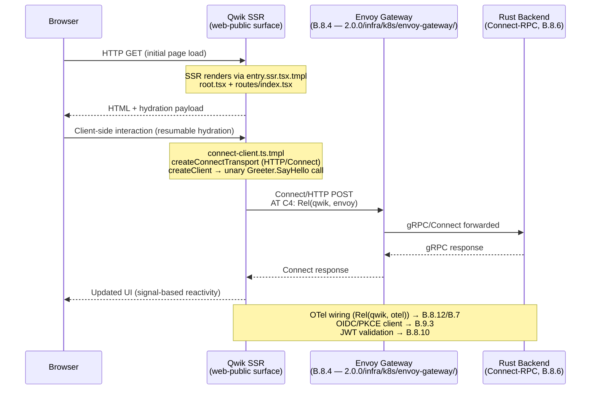
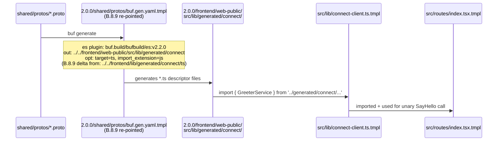

# Design: b8-9-qwik-web-public

<!-- Status: designed -->
<!-- Schema: default -->
<!-- Audit: B.8.9 (b8-9-qwik-web-public) — Qwik web-public templates brick;
     ratified by ADR-005 ARCHITECTURE-TARGET.md:365-374 — KEEP Flutter
     mobile+desktop, REPLACE Flutter Web public → Qwik City; SEO/LCP/TTI
     rationale. GROUND-TRUTH NOTE (Article III.4): NO Qwik version/package
     existed in any source document — the entire toolchain is verify-then-pin
     LIVE at /forge:design (evidence.md P-01..P-15, 2026-06-02T20:53Z). -->

**Agent**: Janus (web-frontend architect — Iris-Web/K.4 not yet shipped; Janus
arbitrates both surfaces until K.4).
**Live evidence**: collected 2026-06-02T20:53Z; full provenance in `evidence.md`
(P-01..P-15). Concrete pins are **re-verified LIVE at `/forge:implement`** before
any template file is written (ADR-B89-001 final-re-verify clause; b8-coroot lesson).
**Scope reminder**: this is the DESIGN phase. It ships **no template file, no
`web-frontend.yaml`, no `2.0.0.yaml` edit, and no harness file**. It is the
normative blueprint the impl phase realizes. The seven decisions below
(ADR-B89-001..007) are encoded; the matching Q entries are flipped to answered
in `open-questions.md`. **No self-approval** — independent review follows before
`/forge:plan`.

**CENTRAL FINDING (b8-6 coupling check, Article III.4)**: full read of
`b8-6.test.sh` (evidence.md P-14) confirms that **T-003 greps plugin name
sentinels only** (`bufbuild/es`, `connectrpc/go:v1.20.0`, etc.) and does **NOT**
grep the es plugin `out:` path value. No other b8-6 test pins the string
`../../frontend/lib/generated/connect/ts`. Re-pointing the 2.0.0 manifest
es out-path is **safe with respect to b8-6** — the b8-9 harness coupling guard
(T-011) still runs b8-6 exit-code for ongoing safety.

---

## Architecture Decisions

### ADR-B89-001 — Qwik line + package identities + Vite pin (resolves Q-001a/b/c/d)

**Context**: Q-001 (Qwik line 1.x vs 2.x; npm package identities; Vite coupling;
engines.node), resolved at `/forge:design` with live npm registry evidence
(evidence.md P-01..P-09, 2026-06-02T20:53Z).

**Findings**:
1. `@builder.io/qwik` dist-tags `latest = 1.20.0` (P-01). This is the current stable line.
2. `@builder.io/qwik-city` dist-tags `latest = 1.20.0` (P-02). Same stable release.
3. `@qwik.dev/core` dist-tags `latest = 2.0.0-beta.35` (P-03) — **beta-only, not GA**.
4. `@qwik.dev/router` dist-tags `latest = 2.0.0-beta.35` (P-04) — **same beta line**.
5. `@qwik.dev/city` **does NOT exist on npm** (P-05). The v2 router is `@qwik.dev/router`.
6. Qwik 1.20.0 `peerDependencies: { "vite": ">=5 <8" }` (P-06/P-07). vite latest = **8.0.16** (P-08) — **excluded**. Maximum stable vite satisfying the constraint: **7.3.5** (P-09).

**Decision**:
- Primary framework: `@builder.io/qwik ^1.20.0` + `@builder.io/qwik-city ^1.20.0`.
- Build tool: `vite =7.3.5` (exact pin to guard against inadvertent vite 8 resolution).
- **Vite-8 trap recorded explicitly** in `web-frontend.yaml` versions map and in README
  "pitfall" note — prevents adopters from installing the default vite 8 and getting
  an incompatible peer.
- **v2 watch-list** (`@qwik.dev/core` / `@qwik.dev/router`): recorded as
  `qwik_v2_watch: { status: future-option, requires: v2-ga, observed: "2.0.0-beta.35 (2026-06-02)" }`
  in `web-frontend.yaml`. Precedent: B.8.O DBOS watch-list (ADR-B8O-001) — never pin a
  beta when a stable line exists. The T5.3 Dartastic exception (beta SDK accepted because
  no stable alternative exists) does NOT apply — a stable Qwik line exists.
- **Final re-verify at `/forge:implement`**: re-query npm for `@builder.io/qwik`,
  `@builder.io/qwik-city`, `vite` dist-tags before writing any template pin. If 1.x is
  no longer the stable line, update and record provenance (P-16+).

**Consequences**: the `web-frontend.yaml` `versions:` map carries these entries;
`package.json.tmpl` uses these constraints; harness T-005 asserts package.json.tmpl
sentinels; harness T-008 asserts standard version and versions block.

**Compliance**: Article III.4 (all versions from live P-01..P-09, not fabricated);
NFR-B89-006 (re-verify at implement).

---

### ADR-B89-002 — Subtree location + skeleton scope (resolves Q-002a/b)

**Context**: Q-002 (disk path tension plan vs schema; skeleton file list), resolved at
`/forge:design` with schema re-read (evidence.md P-15, 2026-06-02).

**Path decision** (Q-002a):
- Schema confirmed: `layers.frontend.surfaces[web-public]` with `path: web-public/` under
  the `frontend` layer (P-15). ADR-B8-3-004 + FR-B8-3-021 mandate surfaces as sub-paths
  under `frontend/` — no new top-level layer.
- **Decision: `2.0.0/frontend/web-public/`** (schema-aligned).
- Plan §4.2 literal path `2.0.0/web-public/` is superseded by the schema. Recorded here
  as "plan lean superseded by schema (ADR-B8-3-004)" — no ADR conflict.
- FR-GL-001 triple (backend/frontend/infra) preserved — no new top-level layer introduced.
- `N.N.N/` subtree convention satisfied; versioned path is `2.0.0/` prefix.

**Skeleton file list** (Q-002b, drawing from official starter shape P-11 + minimal curation):

| # | File | Justification |
|---|------|---------------|
| 1 | `package.json.tmpl` | Entry point; declares Qwik, Connect-ES, vite deps |
| 2 | `.nvmrc.tmpl` | Node pin convention (ADR-B89-006) |
| 3 | `vite.config.ts.tmpl` | Required by Qwik City build; vite plugin wiring |
| 4 | `tsconfig.json.tmpl` | TypeScript config; required for Connect-ES import paths |
| 5 | `qwik.env.d.ts.tmpl` | Qwik env type declaration (official starter shape P-11) |
| 6 | `src/entry.ssr.tsx.tmpl` | SSR entry point (required for Qwik City SSR mode) |
| 7 | `src/root.tsx.tmpl` | Root component (Qwik City city-overlay starter shape) |
| 8 | `src/routes/index.tsx.tmpl` | Minimal landing route (demonstrates Qwik component + Connect call) |
| 9 | `src/lib/connect-client.ts.tmpl` | Connect-ES client wiring (FR-B89-020; ADR-B89-003) |
| 10 | `README.md.tmpl` | Delivery docs + Janus arbitration + scope-outs (FR-B89-009) |

**Total: 10 template files** (≤ 15 budget — NFR-B89-012 satisfied with 5 slots to spare).
Excluded: `eslint.config.js.tmpl` (adopter concern), `src/entry.dev.tsx.tmpl` and
`src/entry.preview.tsx.tmpl` (supplementary entry points, documented in README),
`public/` assets (adopter concern), `src/global.css.tmpl` (adopter concern). The 10-file
list is the minimum that demonstrates: SSR, routing, Connect-ES client, Node pin, and docs.

**Consequences**: harness T-002 asserts these 10 files exist; T-003 asserts file-count ≤ 15.
The exact import paths and API shapes in `src/lib/connect-client.ts.tmpl` and
`src/routes/index.tsx.tmpl` are verified at implement (ADR-B89-003).

**Compliance**: FR-B89-001/002/010; NFR-B89-012; ADR-B8-3-004; FR-B8-3-021.

---

### ADR-B89-003 — Connect-ES consumption + Zod deferral (resolves Q-003/Q-006)

**Context**: Q-003 (runtime deps; Connect-ES API shapes) + Q-006 (Zod include vs defer),
resolved at `/forge:design`.

**Decision — runtime dependencies**:
- `@connectrpc/connect ^2.0.0` (transport.yaml v1.3.0 `versions_2_0_0` — P-12, pinned fact).
- `@connectrpc/connect-web ^2.0.0` (transport.yaml v1.3.0 `versions_2_0_0` — P-12, pinned fact).
- The Qwik skeleton consumes the TS codegen output produced by
  `buf.build/bufbuild/es:v2.2.0` (P-13); the generated descriptors are imported from the
  re-pointed path (ADR-B89-004).
- **Stale naming `protoc-gen-connect-es` retired by Connect v2** (P-12, on-disk fact).
  The correct codegen tool is `buf.build/bufbuild/es:v2.2.0`. Both the README and template
  files must not reference the retired name (FR-B89-024).

**`src/lib/connect-client.ts.tmpl` shape caveat** (Article III.4 — anti-hallucination):
- The exact Connect-ES v2 TypeScript API symbols (`createClient`,
  `createConnectTransport`, import paths) are **NOT asserted in this design** —
  they are `[VERIFY AT IMPLEMENT: Connect-ES v2 TypeScript API — exact function names
  and import paths from @connectrpc/connect ^2.0.0 and @connectrpc/connect-web ^2.0.0;
  verify via Context7 / official connect-es docs before writing the template]`.
- The template demonstrates one unary Greeter call importing generated descriptors from
  the re-pointed buf.gen output path (ADR-B89-004 decision). The call shape is verified at
  implement, not fabricated here.

**Decision — Zod (Q-006): DEFERRED**:
- AT:612 references "Connect-ES client + Zod schemas" but does not mandate Zod as a B.8.9
  deliverable (aspirational AT citation, not a binding spec requirement at this brick).
- Protobuf-ES v2 generates TypeScript types directly — sufficient for a minimal skeleton
  demonstrating one unary call.
- Zod adds validation at the client boundary; useful for form data, env-var validation,
  etc. — but these patterns are not required to demonstrate the Connect-ES integration.
- **Decision: Zod DEFERRED** with `AT:612` note in README (FR-B89-075):
  "Connect-ES client + Zod schemas — deferred per ADR-B89-003 (protobuf-es types may
  suffice for the skeleton; revisit at B.9.2 or the next brick requiring client-side
  validation)."

**Consequences**: `package.json.tmpl` declares `@connectrpc/connect` and
`@connectrpc/connect-web` only (no zod); harness T-004 asserts these sentinels; harness
T-005 asserts `protoc-gen-connect-es` is absent as an active reference.

**Compliance**: FR-B89-020/021/022/023/024/025; Article III.4 (API shapes at implement).

---

### ADR-B89-004 — TS codegen out-path re-point (resolves Q-004)

**Context**: Q-004 (re-point 2.0.0 manifest es out-path vs document cross-surface import),
resolved at `/forge:design` with b8-6.test.sh coupling check (evidence.md P-14).

**b8-6 coupling finding** (CRITICAL — from full file read):
- b8-6 T-003 greps plugin NAME sentinels (`bufbuild/es`, `connectrpc/go:v1.20.0`, etc.)
  — does **NOT** grep the `out:` path string.
- No other test in b8-6.test.sh references `../../frontend/lib/generated/connect/ts`.
- **Re-pointing is safe with respect to b8-6** (P-14).

**Decision: re-point the 2.0.0 manifest es out-path** (option a — lean confirmed):
- Current out-path: `../../frontend/lib/generated/connect/ts` (the 1.0.0 single-app path).
- **New out-path: `../../frontend/web-public/src/lib/generated/connect`**
  (resolves from `2.0.0/shared/protos/` → `../../` = `2.0.0/` → `frontend/web-public/src/lib/generated/connect`).
  The `target=ts` opt generates `.ts` files into this directory; no trailing `/ts` subdirectory
  is needed since `target=ts` is explicit.
- The 2.0.0 `buf.gen.yaml.tmpl` is a B.8.6-owned standalone copy (NFR-B86-002 explicitly
  preserves the frozen 1.0.0 manifest; the 2.0.0 copy is designed to diverge — P-13).
- The 1.0.0 manifest is **byte-unchanged** (FR-B89-031; B.8.2 maintenance freeze).
- Bump-note added to the 2.0.0 manifest header (FR-B89-032):
  `# B.8.9 delta: es plugin out-path re-pointed to web-public surface (ADR-B89-004).`

**`src/lib/connect-client.ts.tmpl` import path** (depends on this ADR):
- The generated descriptors are imported from `../generated/connect/<ServiceName>_connect`
  (relative from `src/lib/`, the target=ts output lands in `src/lib/generated/connect/`).
- Exact import symbol names verified at implement (Article III.4).

**b8-9 harness coupling guard** (T-011): runs `b8-6.test.sh --level 1` exit-code — detects
any future b8-6 coupling additions that might break under the re-point.

**Consequences**: one line edit in `2.0.0/shared/protos/buf.gen.yaml.tmpl`; one header
comment added. Harness T-006 asserts the B.8.9 annotation comment in the 2.0.0 manifest;
harness T-011 runs b8-6 coupling guard.

**Compliance**: FR-B89-030/031/032/033; NFR-B89-002/003 (b8-6 stays GREEN).

---

### ADR-B89-005 — Standard name: `web-frontend.yaml` (resolves Q-003a)

**Context**: Q-003a (standard naming: role-named vs framework-named), resolved at
`/forge:design`.

**Decision: `web-frontend.yaml`** (lean confirmed):
- Role-named, framework-agnostic — mirrors `gateway.yaml` / `identity.yaml` /
  `persistence.yaml` convention.
- Survives a hypothetical Qwik→SvelteKit pivot without rename (contrast:
  `qwik.yaml` would require renaming the standard if the framework changes).
- ADR-005 (`ARCHITECTURE-TARGET.md:365-374`) ratifies Qwik City as default for the
  public-facing web surface with SvelteKit as the named alternative — the standard name
  must outlive the framework choice.

**Standard content shape** (J.7-valid frontmatter, gateway.yaml model):
```yaml
version: "1.0.0"
last_reviewed: 2026-06-02
expires_at: 2027-06-02      # 12-month cycle — web framework pins drift, NOT structural
exception_constitutional: false   # dated expiry → exc:false (FR-J7-020)
linter_rule: null           # advisory; no constitution-linter.sh anchor
enforcement:
  ci_blocking: false        # documentation-only at birth (Iris-Web/K.4 territory)
  pre_commit_hook: false

default: qwik-city          # ratifying ADR-005 ARCHITECTURE-TARGET.md:365-374
alternatives:
  - sveltekit               # per ADR-005 rationale (React et al. simply unlisted)
forbidden: []               # no web-framework bans ratified

rationale: |
  ADR-005 (ARCHITECTURE-TARGET.md:365-374): KEEP Flutter mobile+desktop+backoffice;
  REPLACE Flutter Web public → Qwik City. Rationale: SEO/resumability/LCP/TTI —
  cited in ARCHITECTURE-TARGET.md benchmarks section. SvelteKit is the named
  alternative per ADR-005. React et al. are not listed as alternatives or forbidden.
  Role-named standard survives a framework pivot without rename (gateway.yaml precedent).

versions:
  qwik: "^1.20.0"           # @builder.io/qwik — stable 1.x line (P-01, evidence.md)
  qwik_city: "^1.20.0"      # @builder.io/qwik-city — same release (P-02)
  vite: "7.3.5"             # EXACT pin — vite 8.x EXCLUDED by peer ">=5 <8" (P-06/P-09)
  # PITFALL: vite 8.0.x is the live npm latest but is EXCLUDED by Qwik 1.20.0
  # peerDependencies ">=5 <8". Pin to 7.3.5 exactly. See evidence.md Finding 2.
  # Cross-references (transport.yaml owns these; NOT re-pinned here):
  # @connectrpc/connect: "^2.0.0"      → transport.yaml v1.3.0 versions_2_0_0
  # @connectrpc/connect-web: "^2.0.0"  → transport.yaml v1.3.0 versions_2_0_0

qwik_v2_watch:              # B.8.O watch-list precedent (ADR-B8O-001)
  status: future-option
  requires: v2-ga           # @qwik.dev/core 2.0.0-beta.35 at 2026-06-02 — NOT GA
  packages: ["@qwik.dev/core", "@qwik.dev/router"]
  observed: "2.0.0-beta.35 (2026-06-02, P-03/P-04, evidence.md)"
  note: >
    @qwik.dev/city does not exist (P-05). Router package is @qwik.dev/router.
    Re-evaluate when v2 GA ships; until then, use stable @builder.io/qwik 1.x.

pin_review_cadence:         # ISO 8601 durations (gateway.yaml / identity.yaml precedent)
  qwik: "P30D"              # active upstream velocity; fast-moving web framework
  qwik_city: "P30D"         # same cadence as core (co-released)
  vite: "P30D"              # web toolchain moves fast; re-check for Vite 8 compat
```

**Cross-reference notation**: transport.yaml v1.3.0 owns `@connectrpc/connect` and
`@connectrpc/connect-web` pins. `web-frontend.yaml` notes these as cross-references
(comments), NOT re-pins — single source of truth is transport.yaml (ADR-B8-3-002 precedent
for reference-only annotations).

**`pin_review_cadence` rationale**: web ecosystems move fast (Qwik 1.x → 2.x GA could
ship within months); P30D for all three framework entries. Contrast identity.yaml's P12M
for image pins (less volatile infrastructure). ADR-005 names SvelteKit as an alternative —
P30D cadence also covers the Vite 8 compatibility watch.

**`expires_at: 2027-06-02`** (NOT `never`) — web-frontend pins are NOT structural
(contrast: transport.yaml `exception_constitutional: true`). The standard expires in 12
months and must be reviewed. J.7 `exception_constitutional: false` coupling satisfied.

**Consequences**: `web-frontend.yaml` created at `.forge/standards/web-frontend.yaml`;
`index.yml` entry added; REVIEW.md birth row appended; harness T-007/T-008 assert
version and versions block; `bin/validate-standards-yaml.sh` must pass (FR-B89-046).

**Compliance**: FR-B89-040..047; J.7; Article XII; gateway.yaml/identity.yaml frontmatter model.

---

### ADR-B89-006 — Node pin convention + package manager (resolves Q-005a/b)

**Context**: Q-005 (Node LTS version + package manager), resolved at `/forge:design`
with live Node schedule and official starter evidence (P-10, P-11, 2026-06-02T20:53Z).

**Decision — Node version** (Q-005a):
- Active LTS at 2026-06-02: **Node.js v24** (P-10; Active LTS since 2025-10-28,
  maintenance 2026-10-20, EOL 2028-04-30).
- Node v22 is in maintenance mode — below the "active LTS" bar.
- v24 satisfies Qwik 1.20.0 `engines.node: ">=16.8.0 <18.0.0 || >=18.11"` (24 ≥ 18.11).
- **`.nvmrc.tmpl` content: `24`** (literal, not templated — the version is the decision,
  not a scaffold variable).

**Decision — package manager** (Q-005b):
- Official Qwik base starter (P-11) includes `.npmrc` — indicating npm as the default.
- No `pnpm-lock.yaml` or `packageManager` field for pnpm/bun in the base starter.
- **npm** (zero-new-convention lean; matches the official starter's posture; consistent with
  other Forge tooling defaults; no pnpm complexity introduced).
- `.npmrc` is NOT included in the B.8.9 skeleton (adopter concern; the README documents
  that npm is the expected package manager).

**README setup guidance** (FR-B89-052):
- "Node toolchain setup" section mirrors the Flutter `flutter-version-file` pattern.
- Content: "This subtree ships `.nvmrc` (value: `24`, active LTS at 2026-06-02). Use
  `nvm use` / `fnm use` or `actions/setup-node` with `node-version-file: .nvmrc` in CI.
  Node 24 satisfies Qwik 1.20.0 `engines.node` (`>=18.11`). Re-verify the active LTS
  at each `pin_review_cadence` boundary (P30D; `web-frontend.yaml`)."

**Consequences**: `.nvmrc.tmpl` ships as file #2 in the skeleton; harness T-002 asserts
it is present; README section documents nvm/fnm/setup-node usage.

**Compliance**: FR-B89-050/051/052; NFR-B89-006 (Node LTS value from live P-10).

---

### ADR-B89-007 — 2.0.0.yaml annotation shape (resolves Q-003b)

**Context**: Q-003b (component-SET entry vs comment-only annotation), resolved at
`/forge:design` by inspection of live B.8.4/B.8.6/B.8.7 annotation patterns in
`2.0.0.yaml` and b8-3.test.sh constraint analysis.

**Lean falsification check**: the proposal leaned comment-only. Live inspection of
`2.0.0.yaml` shows:
- B.8.4 `envoy-gateway` component has a `standard: gateway.yaml` key with an inline
  comment `# B.8.4 — gateway pin source created`.
- B.8.6 `connect-rpc` component has `standard: transport.yaml` with inline comment
  `# protocol: connect-rpc — B.8.6 delivered`.
- B.8.7 `zitadel` component has `standard: identity.yaml` with inline comment
  `# default: zitadel — B.8.7 delivered`.

**Analysis**: the `web-public` surface is in `layers.frontend.surfaces[]`, NOT in the
`components:` top-level list. The `components:` SET contains stack-level deliverables
(gateway, transport, identity, persistence, observability). A Qwik web surface is NOT
a new component in the same architectural class — it is a surface-level split modeled
in `layers.frontend.surfaces`. Adding a component-SET entry for the Qwik surface would
be architecturally incorrect AND risks b8-3 T-012 (forbidden keys) if misconfigured.

**Decision: comment-only** on the `web-public` surface entry and on the migration delta
(lean confirmed by analysis):
```yaml
# In layers.frontend.surfaces:
- id: web-public
  path: web-public/
  stack: qwik
  note: Qwik PWA — public-facing web; new in 2.0.0 (B.8.9)
  # B.8.9 — delivered; standard: web-frontend.yaml v1.0.0

# In migration_deltas:
- from: no-web-public-layer
  to: qwik-web-public
  brick: B.8.9
  strategy: additive-first  # new web-public/ surface added alongside web-backoffice/
  # B.8.9 — delivered 2026-06-02
```

**b8-3 safety proof** (matching ADR-B87-007 / ADR-B86-005 analysis):
- YAML comments are transparent to `yaml.safe_load` — parsed dict is byte-identical
  before and after adding comments.
- T-012 (forbidden key-set `{version, pin, image}`) — unaffected; no new YAML keys.
- T-015 (`^\d+\.\d+` scalar walk) — unaffected; no new scalar values.
- T-011 (`standard:` ref resolution) — unaffected; no new `standard:` key added to
  a parsed structure.
- b8-3 (17/17) + b8-3b (12/12) stay GREEN.

**Harness annotation** (FR-B89-086): the harness greps for `B\.8\.9.*delivered\|delivered.*B\.8\.9`
in `2.0.0.yaml` to verify the comment is present.

**Consequences**: a comment-only edit to two locations in `2.0.0.yaml`; harness T-009/T-010
assert the annotation comment and the `no-web-public-layer` delta with `additive-first`
intact.

**Compliance**: FR-B89-060/061/062/063; NFR-B89-003 (b8-3/b8-3b GREEN); b8-3 T-012/T-015 proof.

---

## Exact 2.0.0 Web-Public Subtree Template Tree (impl deliverable, NOT created here)

```
.forge/templates/archetypes/full-stack-monorepo/2.0.0/frontend/web-public/
├── .nvmrc.tmpl
│   # Content: 24 (Node.js active LTS, ADR-B89-006, evidence.md P-10)
│   # Audit: B.8.9 (b8-9-qwik-web-public)
│   # Standard: .forge/standards/web-frontend.yaml
│
├── package.json.tmpl
│   # Declares: @builder.io/qwik ^1.20.0, @builder.io/qwik-city ^1.20.0,
│   #   vite =7.3.5 (EXACT — vite 8 excluded), @connectrpc/connect ^2.0.0,
│   #   @connectrpc/connect-web ^2.0.0.
│   # scripts: { start, dev, preview, build, qwik } matching official starter shape.
│   # Template vars: <project-name> (name field).
│   # Audit: B.8.9 (b8-9-qwik-web-public)
│   # Standard: .forge/standards/web-frontend.yaml
│
├── vite.config.ts.tmpl
│   # Qwik City vite plugin import + export default (shape verified at implement
│   #   via Context7 / official Qwik docs — NOT fabricated here; Article III.4).
│   # [VERIFY AT IMPLEMENT: exact vite.config.ts shape for qwik-city 1.20.0]
│   # Audit: B.8.9 (b8-9-qwik-web-public)
│   # Standard: .forge/standards/web-frontend.yaml
│
├── tsconfig.json.tmpl
│   # TypeScript config matching official base starter shape (P-11).
│   # Paths alias for generated Connect descriptors.
│   # Audit: B.8.9 (b8-9-qwik-web-public)
│   # Standard: .forge/standards/web-frontend.yaml
│
├── qwik.env.d.ts.tmpl
│   # Qwik environment type declarations (official starter shape P-11).
│   # Verbatim minimal content (no template vars needed).
│   # Audit: B.8.9 (b8-9-qwik-web-public)
│   # Standard: .forge/standards/web-frontend.yaml
│
├── src/
│   ├── entry.ssr.tsx.tmpl
│   │   # SSR entry point (required for Qwik City SSR mode).
│   │   # Exact shape verified at implement (official starter P-11).
│   │   # [VERIFY AT IMPLEMENT: entry.ssr.tsx shape for qwik-city 1.20.0]
│   │   # Audit: B.8.9 (b8-9-qwik-web-public)
│   │
│   ├── root.tsx.tmpl
│   │   # Root component (Qwik City overlay starter shape).
│   │   # Renders QwikCity + RouterHead + RouterOutlet pattern.
│   │   # [VERIFY AT IMPLEMENT: root.tsx shape for qwik-city 1.20.0]
│   │   # Audit: B.8.9 (b8-9-qwik-web-public)
│   │
│   ├── routes/
│   │   └── index.tsx.tmpl
│   │       # Minimal landing route. Imports and calls the Connect-ES client
│   │       #   (demonstrating one unary Greeter call, ADR-B89-003).
│   │       # Qwik component shape: component$(), useSignal(), useVisibleTask$()
│   │       #   or equivalent — [VERIFY AT IMPLEMENT: exact Qwik 1.20.0 hook names].
│   │       # Audit: B.8.9 (b8-9-qwik-web-public)
│   │
│   └── lib/
│       └── connect-client.ts.tmpl
│           # Connect-ES client module (FR-B89-020, ADR-B89-003).
│           # Imports generated descriptors from ../generated/connect/ (ADR-B89-004).
│           # Creates transport + client for the demo Greeter service.
│           # [VERIFY AT IMPLEMENT: createClient, createConnectTransport import paths
│           #   and signatures from @connectrpc/connect ^2.0.0 and
│           #   @connectrpc/connect-web ^2.0.0 — Context7 / official connect-es docs]
│           # Does NOT import zod (ADR-B89-003 deferral).
│           # Audit: B.8.9 (b8-9-qwik-web-public)
│
└── README.md.tmpl
    # <!-- Audit: B.8.9 (b8-9-qwik-web-public) -->
    # Sections:
    #   Status block: "candidate — scaffoldable: false until B.8.14"
    #   Delivery model + standard reference (web-frontend.yaml)
    #   Janus arbitration (plan:2321, AT:743) until Iris-Web/K.4
    #   Envoy Connect/HTTP path (AT C4: Rel(qwik, envoy))
    #   web-backoffice Flutter surface unchanged posture
    #   Node toolchain setup (.nvmrc + nvm/fnm/setup-node)
    #   Vite 8 pitfall note (vite >=5 <8 peer constraint; pin to 7.3.5)
    #   Connect-ES usage (stale protoc-gen-connect-es naming note)
    #   Zod deferral note (AT:612 citation, ADR-B89-003)
    #   Scope out (this brick) list → B.9.2/B.9.3/B.8.12/B.7.10/B.9.7/K.4/B.8.10
    #   Template variable reference (<project-name>, <namespace>)
    #   Standard: .forge/standards/web-frontend.yaml
```

**Note on `[VERIFY AT IMPLEMENT]` placeholders**: four template files carry explicit
placeholders for API shapes (vite.config.ts, entry.ssr.tsx, root.tsx, connect-client.ts,
routes/index.tsx). These are the Article III.4 anti-hallucination guardrails — the
implementer resolves these via Context7 + official docs before writing any symbol. The
skeleton structure and file layout are fixed by this design; only the exact API call
shapes within are deferred to implement.

---

## 2.0.0.yaml Annotation (delivery flip)

Based on ADR-B89-007, the two annotation sites in `2.0.0.yaml`:

**Site 1** — `layers.frontend.surfaces[web-public]`:
```yaml
      - id: web-public
        path: web-public/
        stack: qwik
        note: Qwik PWA — public-facing web; new in 2.0.0 (B.8.9)
        # B.8.9 — delivered; standard: web-frontend.yaml v1.0.0
```

**Site 2** — `migration_deltas[no-web-public-layer]`:
```yaml
  - from: no-web-public-layer
    to: qwik-web-public
    brick: B.8.9
    strategy: additive-first  # new web-public/ surface added alongside web-backoffice/
    # B.8.9 — delivered 2026-06-02
```

These are YAML comments — transparent to `yaml.safe_load`. b8-3 T-012/T-015 unaffected.

---

## Component Diagram

```mermaid
graph TD
    WF[web-frontend.yaml v1.0.0<br/>default: qwik-city<br/>alternatives: [sveltekit]<br/>versions: qwik ^1.20.0 / qwik_city ^1.20.0 / vite =7.3.5<br/>qwik_v2_watch: future-option<br/>pin_review_cadence: P30D<br/>expires_at: 2027-06-02]
    REV[REVIEW.md birth row<br/>web-frontend.yaml 1.0.0 KEEP]
    IDX[standards/index.yml<br/>web-frontend entry<br/>triggers: qwik, web-public, connect-es, vite, ssr, seo]
    PKG[package.json.tmpl<br/>@builder.io/qwik ^1.20.0<br/>@builder.io/qwik-city ^1.20.0<br/>vite =7.3.5 EXACT<br/>@connectrpc/connect ^2.0.0<br/>@connectrpc/connect-web ^2.0.0]
    NVMRC[.nvmrc.tmpl<br/>content: 24<br/>active LTS Node.js v24]
    SSR[src/entry.ssr.tsx.tmpl<br/>SSR entry point]
    ROOT[src/root.tsx.tmpl<br/>Root component]
    ROUTE[src/routes/index.tsx.tmpl<br/>Landing route + Connect call demo]
    CLIENT[src/lib/connect-client.ts.tmpl<br/>Connect-ES client wiring<br/>VERIFY AT IMPLEMENT: API shapes]
    README[README.md.tmpl<br/>Janus arbitration + scope-outs<br/>Vite 8 pitfall + Zod deferral<br/>Status: candidate scaffoldable:false]
    VITE[vite.config.ts.tmpl<br/>VERIFY AT IMPLEMENT]
    TSCONFIG[tsconfig.json.tmpl]
    ENV[qwik.env.d.ts.tmpl]
    BUF[2.0.0/shared/protos/buf.gen.yaml.tmpl<br/>es out: ../../frontend/web-public/src/lib/generated/connect<br/>B.8.9 bump-note header<br/>1.0.0 manifest FROZEN]
    S20[2.0.0.yaml<br/>surfaces[web-public]: B.8.9 delivered comment<br/>migration_delta no-web-public-layer: B.8.9 delivered comment<br/>b8-3 T-012/T-015 UNAFFECTED]
    ENV_GW[B.8.4 envoy-gateway<br/>AT C4: Rel(qwik, envoy)<br/>Qwik → Connect/HTTP → Envoy]
    B86[B.8.6 TS codegen<br/>buf.gen es:v2.2.0 target=ts<br/>→ web-public/src/lib/generated/connect]
    JANUS[Janus agent<br/>arbitrates web-public + web-backoffice<br/>until Iris-Web/K.4]
    H9[b8-9.test.sh ~12 L1<br/>≤ 2 s hermetic]
    IMPL[/forge:implement<br/>LIVE re-verify Qwik/Vite/Node pins<br/>VERIFY AT IMPLEMENT: Connect-ES API shapes<br/>VERIFY AT IMPLEMENT: Qwik 1.20.0 hook/component shapes<br/>Context7 / official docs]

    WF --> REV
    WF --> IDX
    PKG -->|pins from| WF
    S20 -->|comment annotation| WF
    CLIENT -->|imports from| B86
    B86 -->|re-pointed out-path| CLIENT
    ROUTE -->|calls| CLIENT
    PKG & NVMRC & VITE & TSCONFIG & ENV & SSR & ROOT & ROUTE & CLIENT & README --> JANUS
    JANUS -.arbitrates.-> ENV_GW
    IMPL -.re-verify.-> WF
    IMPL -.verify API shapes.-> CLIENT
    IMPL -.verify API shapes.-> VITE
    IMPL -.verify API shapes.-> SSR
    IMPL -.verify API shapes.-> ROOT
    H9 -->|T-001 subtree exists| PKG
    H9 -->|T-002 all 10 files present| README
    H9 -->|T-003 file count ≤ 15| PKG
    H9 -->|T-004 package.json sentinels| PKG
    H9 -->|T-005 no protoc-gen-connect-es| CLIENT
    H9 -->|T-006 .nvmrc.tmpl = 24| NVMRC
    H9 -->|T-007 web-frontend.yaml v1.0.0 + versions| WF
    H9 -->|T-008 index.yml + REVIEW.md| IDX
    H9 -->|T-009 2.0.0.yaml annotation + delta| S20
    H9 -->|T-010 buf.gen out-path + bump-note + frozen guard| BUF
    H9 -->|T-011 b8-3 + b8-3b + b8-6 coupling guards| S20
    H9 -->|T-012 CHANGELOG entry| README
```

---

## Data Flow

### Qwik → Envoy → Backend (K8s — 2.0.0 candidate)



### Codegen pipeline (buf.gen.yaml.tmpl re-point)



---

## Testing Strategy

**Harness**: `.forge/scripts/tests/b8-9.test.sh`
**Level**: L1 only (hermetic, ≤ 2 s, zero net/Docker/npm), mirroring b8-7 structure
(`--level` flag + `source _helpers.sh` + `run_test` / `print_summary`).
**Registration**: one line `"b8-9.test.sh --level 1"` appended to the `harnesses=()`
loop in `forge-ci.yml` after the `b8-7.test.sh --level 1` line (or the last existing line).

### L1 Assertion List (~12 L1 tests)

| # | FR / NFR | Assertion | Implementation |
|---|----------|-----------|----------------|
| T-001 | FR-B89-001/005 | `2.0.0/frontend/web-public/` directory exists | `[ -d "$WEB_PUBLIC_DIR" ]` |
| T-002 | FR-B89-002/081 | All 10 required files present: `package.json.tmpl`, `.nvmrc.tmpl`, `vite.config.ts.tmpl`, `tsconfig.json.tmpl`, `qwik.env.d.ts.tmpl`, `src/entry.ssr.tsx.tmpl`, `src/root.tsx.tmpl`, `src/routes/index.tsx.tmpl`, `src/lib/connect-client.ts.tmpl`, `README.md.tmpl` | `[ -f "$WEB_PUBLIC_DIR/$f" ]` loop for each file |
| T-003 | NFR-B89-012/081 | Template file count ≤ 15 | `find "$WEB_PUBLIC_DIR" -name "*.tmpl" \| wc -l` → `[ "$count" -le 15 ]` |
| T-004 | FR-B89-021/082 | `package.json.tmpl` contains `@connectrpc/connect` AND `@connectrpc/connect-web` sentinels | `grep -qF '@connectrpc/connect' "$PKG"` + `grep -qF '@connectrpc/connect-web' "$PKG"` |
| T-005 | FR-B89-024/083 | `protoc-gen-connect-es` does NOT appear as an active (non-comment) reference in any template file | `grep -rn 'protoc-gen-connect-es' "$WEB_PUBLIC_DIR" \| grep -v '#'` → zero matches |
| T-006 | FR-B89-050/051/ADR-B89-006 | `.nvmrc.tmpl` contains `24` (the active LTS value) | `grep -qF '24' "$WEB_PUBLIC_DIR/.nvmrc.tmpl"` |
| T-007 | FR-B89-040/041/084 | `web-frontend.yaml` `version:` = `"1.0.0"` AND contains `versions:` block AND `default:` present | `grep -qE '^version:[[:space:]]*"1\.0\.0"'` + `grep -qF 'versions:'` + `grep -qF 'default:'` in `web-frontend.yaml` |
| T-008 | FR-B89-045/047/085 | `standards/index.yml` contains `web-frontend.yaml` reference AND `standards/REVIEW.md` contains `web-frontend.yaml` + `1.0.0` row | `grep -qF 'web-frontend.yaml' "$INDEX"` + `grep -qE '\|[[:space:]]*web-frontend\.yaml[[:space:]]*\|[[:space:]]*1\.0\.0[[:space:]]*\|' "$REVIEW_MD"` |
| T-009 | FR-B89-060/086/ADR-B89-007 | `2.0.0.yaml` contains a B.8.9 delivery annotation comment | `grep -qE 'B\.8\.9.*delivered\|delivered.*B\.8\.9' "$SCHEMA_20"` |
| T-010 | FR-B89-030/032/086 | 2.0.0 `buf.gen.yaml.tmpl` es out-path re-pointed (contains `web-public/src/lib/generated/connect`) AND bump-note present AND frozen 1.0.0 manifest does NOT contain a B.8.9 annotation | `grep -qF 'web-public/src/lib/generated/connect' "$BUF_GEN_20"` + `grep -qF 'B.8.9 delta' "$BUF_GEN_20"` + `! grep -qF 'B.8.9' "$BUF_GEN_10"` |
| T-011 | NFR-B89-003/087 | Coupling guards: `b8-3.test.sh --level 1` exit 0 + `b8-3b.test.sh --level 1` exit 0 + `b8-6.test.sh --level 1` exit 0 | `bash b8-3.test.sh --level 1 >/dev/null 2>&1; [ $? -eq 0 ]` + same for b8-3b + b8-6 |
| T-012 | FR-B89-087/NFR-B89-001 | `CHANGELOG.md` contains `b8-9-qwik-web-public` (whole-file grep — changelog-test lesson) | `grep -qF 'b8-9-qwik-web-public' "$CHANGELOG"` |

**~12 L1 tests.** All file-existence + grep assertions. No network, no Docker, no npm.
**Budget ≤ 2 s** (three sub-harness exit-code calls for T-011 — consistent with b8-7 strategy).

### FR Traceability Table (all 49 FRs + 12 NFRs)

| FR / NFR | Design element | Harness |
|----------|----------------|---------|
| FR-B89-001 | `2.0.0/frontend/web-public/` subtree (ADR-B89-002); T-001 | T-001 |
| FR-B89-002 | 10-file skeleton (ADR-B89-002); ≤ 15 budget | T-002, T-003 |
| FR-B89-003 | Audit comments on all template files; header block | T-002 (file presence) |
| FR-B89-004 | `<variable-name>` angle-bracket convention; `<project-name>` in package.json | T-004 (sentinel) |
| FR-B89-005 | `scaffoldable: false` preserved (b8-3b coupling guard; ADR-B89-007) | T-011 |
| FR-B89-006 | 1.0.0 template assets byte-unchanged | T-011 (b8-3 coupling) |
| FR-B89-007 | web-backoffice unchanged; README states posture | T-002 (README present) |
| FR-B89-008 | No fabricated API symbols; [VERIFY AT IMPLEMENT] placeholders | Article III.4; anti-hallucination pass |
| FR-B89-009 | `README.md.tmpl` present + content spec (ADR-B89-002 file #10) | T-002 |
| FR-B89-010 | FR-GL-001 triple preserved (comment-only annotation; ADR-B89-007) | T-011 (b8-3 coupling) |
| FR-B89-020 | `src/lib/connect-client.ts.tmpl` present (ADR-B89-002 file #9) | T-002 |
| FR-B89-021 | `@connectrpc/connect` + `@connectrpc/connect-web` ^2.0.0 in package.json.tmpl | T-004 |
| FR-B89-022 | One unary Connect call in connect-client.ts.tmpl (VERIFY AT IMPLEMENT) | Article III.4 |
| FR-B89-023 | No fabricated API symbols (VERIFY AT IMPLEMENT placeholders) | Article III.4 |
| FR-B89-024 | `protoc-gen-connect-es` absent as active reference | T-005 |
| FR-B89-025 | Zod DEFERRED — README note (ADR-B89-003) | T-002 (README) |
| FR-B89-030 | 2.0.0 buf.gen manifest es out-path re-pointed (ADR-B89-004) | T-010 |
| FR-B89-031 | 1.0.0 buf.gen manifest byte-unchanged | T-010 (frozen guard) |
| FR-B89-032 | Bump-note in 2.0.0 manifest header | T-010 |
| FR-B89-033 | b8-6.test.sh stays GREEN after manifest edit | T-011 (b8-6 coupling guard) |
| FR-B89-040 | `web-frontend.yaml` created (ADR-B89-005) | T-007 |
| FR-B89-041 | J.7-valid frontmatter (version, last_reviewed, expires_at, exc:false, linter_rule:null) | T-007; `validate-standards-yaml.sh` |
| FR-B89-042 | `default: qwik-city`, `alternatives: [sveltekit]`, `rationale:` | T-007 |
| FR-B89-043 | `versions:` map with live-resolved pins (ADR-B89-001/005) | T-007 |
| FR-B89-044 | `pin_review_cadence:` ISO 8601 (P30D) | T-007 |
| FR-B89-045 | REVIEW.md birth row | T-008 |
| FR-B89-046 | `validate-standards-yaml.sh` passes | implementation step |
| FR-B89-047 | `index.yml` entry with triggers | T-008 |
| FR-B89-050 | `.nvmrc.tmpl` present (ADR-B89-006) | T-002, T-006 |
| FR-B89-051 | Node 24 value live-resolved (P-10) | T-006 |
| FR-B89-052 | README setup guidance section | T-002 (README present) |
| FR-B89-060 | `2.0.0.yaml` B.8.9 delivery annotation comment (ADR-B89-007) | T-009 |
| FR-B89-061 | Annotation doesn't break b8-3 T-012/T-015 | T-011 (b8-3 coupling) |
| FR-B89-062 | Comment-only — no `standard:` key added to YAML (ADR-B89-007) | T-011 (b8-3 coupling) |
| FR-B89-063 | `2.0.0.yaml` valid YAML after annotation | T-011 (b8-3 coupling — Python parse) |
| FR-B89-070 | Janus arbitration section in README | T-002 (README present) |
| FR-B89-071 | Envoy Connect/HTTP path documented | T-002 (README present) |
| FR-B89-072 | web-backoffice unchanged posture in README | T-002 (README present) |
| FR-B89-073 | Scope-outs section in README | T-002 (README present) |
| FR-B89-074 | Status block in README | T-002 (README present) |
| FR-B89-075 | Zod deferral note in README | T-002 (README present) |
| FR-B89-080 | `b8-9.test.sh` hermetic ≤ 2 s + CI registration | testing strategy |
| FR-B89-081 | Harness asserts required files | T-002 |
| FR-B89-082 | Harness asserts `@connectrpc/connect` + `@connectrpc/connect-web` sentinels | T-004 |
| FR-B89-083 | Harness asserts `protoc-gen-connect-es` absent | T-005 |
| FR-B89-084 | Harness asserts `web-frontend.yaml` v1.0.0 + versions + default | T-007 |
| FR-B89-085 | Harness asserts index.yml + REVIEW.md | T-008 |
| FR-B89-086 | Harness asserts 2.0.0.yaml annotation + frozen-1.0.0 guard | T-009, T-010 |
| FR-B89-087 | Harness coupling guards: b8-3/b8-3b + b8-6 + CHANGELOG | T-011, T-012 |
| NFR-B89-001 | ≤ 2 s L1 (all grep/stat/exit-code) | testing strategy |
| NFR-B89-002 | Frozen 1.0.0 byte-identity (b8-3 coupling guard) | T-011 |
| NFR-B89-003 | b8-3 (17/17) + b8-3b (12/12) + b8-6 GREEN | T-011 |
| NFR-B89-004 | Full ~47-harness suite GREEN pre-push | implementation note |
| NFR-B89-005 | Zero new external binary/package for harness | bash + grep + python3 only |
| NFR-B89-006 | Verify-then-pin LIVE at implement | ADR-B89-001 re-verify clause |
| NFR-B89-007 | No secret material | no creds in any template |
| NFR-B89-008 | Article VI Flutter mandate untouched | additive brick; Flutter files not touched |
| NFR-B89-009 | Article VIII.1 preserved (Kong untouched) | additive brick; `scaffoldable: false` |
| NFR-B89-010 | Independent review before /forge:plan | not self-approved here |
| NFR-B89-011 | Gates re-run POST-flip | implementation protocol |
| NFR-B89-012 | File-count ≤ 15 | T-003 |

### TDD Order (Article I RED → GREEN)

1. **RED**: commit `b8-9.test.sh` with all ~12 assertions before any impl artifact exists.
   T-001..T-012 fail immediately (no subtree, no standard, no annotation).
2. **GREEN — web-frontend.yaml + index.yml + REVIEW.md**: create the standard, append
   index.yml entry, append REVIEW.md birth row. Run `bin/validate-standards-yaml.sh` → exit 0.
   T-007 + T-008 green.
3. **GREEN — 2.0.0.yaml annotation**: add comment-only delivery annotation at two sites.
   Re-run `b8-3.test.sh` (17/17) + `b8-3b.test.sh` (12/12) → GREEN. T-009 green.
4. **GREEN — buf.gen.yaml.tmpl re-point**: edit 2.0.0 manifest es out-path + bump-note.
   Re-run `b8-6.test.sh` (12/12) → GREEN (coupling proof). T-010 green.
5. **GREEN — web-public subtree**: author the 10 template files under
   `2.0.0/frontend/web-public/`. Run `[VERIFY AT IMPLEMENT]` steps for Qwik/Connect API
   shapes. T-001..T-006 green.
6. **GREEN — CHANGELOG**: append `[Unreleased]` entry anchored on `b8-9-qwik-web-public`.
   T-012 green.
7. **GREEN — CI registration**: append `"b8-9.test.sh --level 1"` to `forge-ci.yml`.
   Re-run b8-9 → ~12/12; T-011 coupling guards GREEN.
8. **POST-flip re-run** (NFR-B89-011): after all status flips (2.0.0.yaml annotation,
   web-frontend.yaml creation), re-run the full b8-3/b8-3b/b8-6 coupling suite.

---

## Standards Applied

| Standard | Role in this change |
|----------|---------------------|
| `web-frontend.yaml` v1.0.0 | **NEW** — first web-frontend pin source; this brick creates it (ADR-B89-005) |
| `gateway.yaml` v1.0.0 | Frontmatter model: `versions:` map + `pin_review_cadence:` ISO 8601 + `expires_at:` dated expiry |
| `identity.yaml` v1.1.0 | Frontmatter model: REVIEW.md birth row format + `versions:` map pattern |
| `transport.yaml` v1.3.0 | Cross-reference: `@connectrpc/connect ^2.0.0` + `@connectrpc/connect-web ^2.0.0` (single source of truth; NOT re-pinned in web-frontend.yaml) |
| `global/standards-lifecycle.md` | J.7 frontmatter + REVIEW.md ledger for web-frontend.yaml 1.0.0 birth |
| `global/source-document-pinning.md` | Provenance table in evidence.md (P-01..P-15, URL + timestamp + what it proves) |
| `global/open-questions.md` | Q-001..Q-006 resolved (independent reviewer ratifies before `/forge:plan`) |
| `scaffolding.md` | `N.N.N/` subtree skip convention; versioned subtrees exempt from repo-wide scans |
| `global/forge-self-ci.md` | Harness registration (≤ 300-line CI budget) |

**Standards created (at impl)**: `web-frontend.yaml` v1.0.0 (this brick creates it; contrast
B.8.7 which bumped the pre-existing identity.yaml).
**Standards edited (at impl)**: `REVIEW.md` (+1 birth row), `index.yml` (+1 entry).
Transport.yaml, identity.yaml, gateway.yaml: **NOT touched**.
**Candidate edited (at impl)**: `2.0.0.yaml` (comment-only surface + delta annotations;
b8-3/b8-3b GREEN — see ADR-B89-007).
**2.0.0 template edited (at impl)**: `2.0.0/shared/protos/buf.gen.yaml.tmpl` (es out-path
re-point + bump-note; b8-6 GREEN — see ADR-B89-004).
**Frozen surfaces NOT touched**: `schema.yaml`, the flat 1.0.0 template tree (including
`shared/protos/buf.gen.yaml.tmpl`), `1.0.0.tar.gz`, the Constitution.

---

## Constitutional Compliance Gate

- **Article I (TDD RED-first)**: `b8-9.test.sh` committed with all ~12 assertions BEFORE
  any impl artifact exists. T-001..T-012 fail RED, then turn GREEN per TDD Order. No
  template precedes its test.

- **Article II (BDD)**: no new user-facing runtime feature; BDD scenarios in `specs.md`
  for traceability (template + standard + schema annotation, not app behaviour).

- **Article III.1/III.2 (Specs before code)**: design follows specs (both in
  `.forge/changes/b8-9-qwik-web-public/`); template files, `web-frontend.yaml`, the
  buf.gen edit, and the harness are authored only after this design.

- **Article III.4 (Anti-Hallucination) — CENTRAL**: ALL version strings in this design
  are sourced from LIVE npm registry + Node.js schedule queries (evidence.md P-01..P-15,
  2026-06-02T20:53Z). The Vite-8 excluded trap (Finding 2) is derived from the live
  peerDependencies field (P-06), not training data. The b8-6 coupling finding (Finding 5)
  is derived from a full read of `b8-6.test.sh` (P-14), not assumed. Connect-ES API shapes
  (import paths, function names) are NOT fabricated — deferred to implement with explicit
  `[VERIFY AT IMPLEMENT]` placeholders. Qwik 1.20.0 hook names (`component$`, `useSignal$`,
  etc.) are NOT asserted as stable in this design — verified at implement via Context7 /
  official Qwik docs. The v2 beta finding is a live registry fact (P-03/P-04). No API name,
  import path, or function signature is asserted without a reproducible source.
  The final-re-verify clause (ADR-B89-001) ensures the implementer does not rely on stale
  design-phase observations.

- **Article IV (Delta-based)**: the `2.0.0/frontend/web-public/` subtree is a NEW additive
  sibling; the 1.0.0 template tree, `schema.yaml`, and `1.0.0.tar.gz` are byte-unchanged.
  `web-frontend.yaml` is a NEW standard (no existing file modified). The `2.0.0.yaml`
  annotation is YAML comments (transparent to parsers). The buf.gen 2.0.0 manifest edit
  is additive on the 2.0.0 copy only (1.0.0 frozen). The REVIEW.md and index.yml edits
  are append-only.

- **Article V (Compliance gate)**: ADR-B89-001..007 encode all resolved open questions.
  No work proceeds around an unresolved question. The ADR-B89-001 final-re-verify item
  is a live step at `/forge:implement`.

- **Article VI (Flutter architecture mandate — PRESERVED)**: Flutter remains the
  mobile/desktop/backoffice stack (ADR-005 KEEP half). No Flutter file is touched.
  The Qwik surface is additive and explicitly outside Article VI's Flutter scope.

- **Article VIII.1 (Kong SHALL — IN FORCE, PRESERVED)**: B.8.9 is additive. The 2.0.0.yaml
  annotation does NOT authorize removing Kong. The candidate remains `scaffoldable: false`.
  Kong removal and any VIII.1 amendment are B.8.14.

- **Article VIII.5 (IaC)**: all deliverables are declarative template files under version
  control. No imperative deploy scripts are committed.

- **Article XI.6 (Privacy)**: no PII flows introduced. No credentials in any template.
  The Connect-ES client template uses placeholder URLs (`<api-url>` convention) only.

- **Article XII (Governance)**: no Constitution amendment in B.8.9. `web-frontend.yaml`
  v1.0.0 is `exception_constitutional: false` (dated `expires_at: 2027-06-02`); subject
  to 12-month review. REVIEW.md append-only ledger row satisfies FR-J7-023. The `index.yml`
  addition satisfies FR-B89-047.

**No violations. Gate PASS** (subject to independent review — NOT self-approved here).

---

## Anti-Hallucination Pass (Design Phase)

- **Qwik line and package identities from live registry** (central): `@builder.io/qwik
  ^1.20.0` + `@builder.io/qwik-city ^1.20.0` sourced from live npm dist-tags (P-01/P-02,
  2026-06-02T20:53Z). `@qwik.dev/core` 2.0.0-beta.35 = beta-only (P-03). `@qwik.dev/city`
  does not exist (P-05). None of these facts are from training data.

- **Vite-8 excluded trap from live peerDependencies** (critical): `"vite": ">=5 <8"`
  sourced from the live `@builder.io/qwik` 1.20.0 registry record (P-06). vite 8.0.16
  verified as live-latest (P-08). The exclusion is a fact, not an inference.

- **Node LTS from live schedule.json** (central): Node v24 sourced from the official
  Node.js release schedule (P-10, 2026-06-02T20:53Z). Not a training-data assertion.

- **b8-6.test.sh coupling from full file read** (critical): the finding that T-003 does
  NOT grep the `out:` path value is derived from reading every test function in the file
  (P-14). Not assumed. The re-point decision (ADR-B89-004) is grounded in this reading.

- **Connect-ES API shapes NOT asserted**: `createClient`, `createConnectTransport`, and
  all import paths in `connect-client.ts.tmpl` are explicitly `[VERIFY AT IMPLEMENT]`.
  These symbols could change between Connect-ES v2 patch releases; fabricating them here
  would violate Article III.4.

- **Qwik API shapes NOT asserted**: component hook names (`component$`, `useSignal$`,
  `useVisibleTask$`, etc.) are `[VERIFY AT IMPLEMENT]` — Qwik 1.20.0 exact stable API
  surface verified at implement via Context7 / official Qwik docs. Not fabricated here.

- **vite.config.ts / entry.ssr.tsx / root.tsx shapes NOT asserted**: marked
  `[VERIFY AT IMPLEMENT]` for the same reason — official starter shape (P-11) shows
  the file list but not the exact API imports; Qwik-City plugin import paths need live
  verification.

- **b8-3 T-012/T-015 YAML comment safety**: YAML comments are transparent to
  `yaml.safe_load`. The annotation decision (ADR-B89-007) is grounded in the same
  analysis applied in ADR-B87-007 / ADR-B86-005 (both of which delivered successfully).

- **No web-frontend.yaml in index.yml today**: confirmed by reading index.yml — no existing
  `web-frontend` entry. The new entry is genuinely NET-NEW (FR-B89-047).

- **Independent review required (NFR-B89-010)**: this design is NOT self-approved.
  The Constitutional Compliance Gate PASS above is the author's assessment; an
  independent reviewer ratifies before `/forge:plan`. The final-re-verify pins run
  LIVE at `/forge:implement`.

---

## Open Items / [NEEDS CLARIFICATION]

- **None blocking design.** All seven maintainer-resolved decisions are encoded
  (ADR-B89-001..007). Carried uncertainties are deliberate verify-then-pin items:

  1. **Final Qwik/Vite/Node pin re-verify** (ADR-B89-001): implementer re-queries npm
     for `@builder.io/qwik`, `@builder.io/qwik-city`, `vite` dist-tags at
     `/forge:implement`; if the stable line has changed, update pins and record provenance
     (P-16+).
  2. **Connect-ES v2 TypeScript API shapes** (ADR-B89-003): `createClient`,
     `createConnectTransport` exact import paths from `@connectrpc/connect` and
     `@connectrpc/connect-web` — verified at implement via Context7 / official connect-es
     docs before writing `src/lib/connect-client.ts.tmpl`.
  3. **Qwik 1.20.0 component + hook API shapes** (ADR-B89-002): exact shapes for
     `vite.config.ts`, `entry.ssr.tsx`, `root.tsx`, `routes/index.tsx` — verified at
     implement via Context7 / official Qwik City 1.20.0 docs.

- **Independent review follows** — this design is NOT self-approved. The Constitutional
  Compliance Gate PASS above is the author's assessment; an independent reviewer ratifies
  before `/forge:plan`. The note "maintainer decision pending INDEPENDENT reviewer
  ratification before /forge:plan" is recorded in `open-questions.md`.
