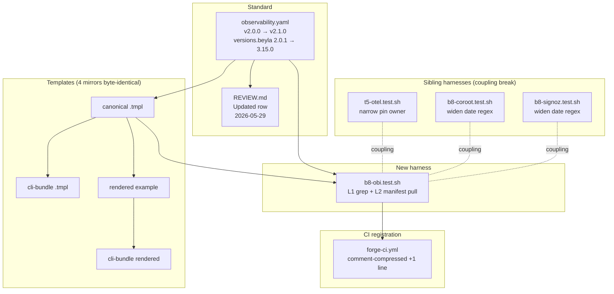
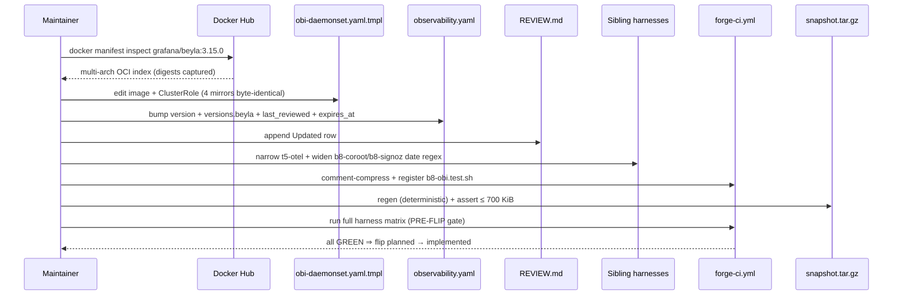

# Design: b8-obi-refresh
<!-- Status: designed -->
<!-- Schema: default -->
<!-- Audit: B.8.8 (docs/new-archetypes-plan.md §4.2 — observability rearch, OBI/Beyla leg) -->

This document resolves the 7 Q-NNN scaffolds from `specs.md` and
`open-questions.md` into 8 ADRs. Every ADR is anchored to either a
**live `docker manifest inspect`** transcript, an **upstream Beyla
documentation snippet** sourced via Context7 `/grafana/beyla`, or a
**repository `find` / `grep`** enumeration captured at `/forge:design`
time (2026-05-29).

---

## Architecture Decisions

### ADR-B8-OBI-001 — Target tag `grafana/beyla:3.15.0` confirmed live multi-arch

**Context** (Q-001) : the proposal targeted `3.15.0` based on the
2026-05-28 review. Verify-then-pin discipline (lesson T5.3.2)
mandates live confirmation.

**Decision** : pin to `grafana/beyla:3.15.0`. Confirmed live on Docker
Hub 2026-05-29 :

```
$ docker manifest inspect grafana/beyla:3.15.0
schemaVersion: 2
mediaType: application/vnd.oci.image.index.v1+json
manifests:
  - platform: { architecture: amd64,   os: linux }
    digest: sha256:8ff0dcb4aa31fab39ba0b40715d0c0441d4522b43fb7886768ec280cc401dd69
    size: 1240
  - platform: { architecture: arm64,   os: linux }
    digest: sha256:ac770096bcb51bde0a810a1ef5009ddaed5b3b08dacdec856cccd1be6e65e30d
    size: 1240
  - platform: { architecture: unknown, os: unknown }   # attestation manifests
    digest: sha256:ee394afbec88ba6ef4a999c098d5a63210164358cbf65eff615c0cd4580a104d
    size: 565
  - platform: { architecture: unknown, os: unknown }
    digest: sha256:4857e16c4a684d7803ac167c5616db0caf4fbdfb420dfb5babe4792fd3aa3748
    size: 565
```

Multi-arch amd64+arm64 present + 2 unknown/unknown attestation
manifests (cosign / SLSA — not platform images, ignored by Kubernetes
image puller).

**Consequences** :
- The harness L2 multi-arch check (FR-B8-OBI-104) MUST tolerate the
  4-entry manifest layout (2 platform + 2 attestation) — assert
  `linux/amd64` AND `linux/arm64` are present, do NOT assert the
  manifests array length is exactly 2.
- Both platform digests captured to `evidence.md` § 1 as the
  verify-then-pin audit ticket.

**Constitution Compliance** : Article III.4 (Anti-Hallucination) ✅
— pin asserted from live transcript, not training data.

---

### ADR-B8-OBI-002 — Linux capability set UNCHANGED (Beyla 3.x docs confirm 2.x posture stable)

**Context** (Q-002) : Beyla 3.x may have refined its cap requirements.

**Decision** : preserve the 8-cap set verbatim :

```yaml
capabilities:
  add: [BPF, SYS_PTRACE, NET_RAW, CHECKPOINT_RESTORE,
        DAC_READ_SEARCH, PERFMON, NET_ADMIN, SYS_ADMIN]
  drop: [ALL]
```

**Evidence** (Context7 `/grafana/beyla` § "Kubernetes DaemonSet
Deployment for Beyla" / distributed-traces.md, fetched 2026-05-29) :

```
BPF                 - Required for most eBPF probes to function correctly.
SYS_PTRACE          - Allows Beyla to access the container namespaces and inspect executables.
NET_RAW             - Allows Beyla to use socket filters for http requests.
CHECKPOINT_RESTORE  - Allows Beyla to open ELF files.
DAC_READ_SEARCH     - Allows Beyla to open ELF files.
PERFMON             - Allows Beyla to load BPF programs.
NET_ADMIN           - Allows Beyla to inject HTTP and TCP context propagation information.
SYS_ADMIN           - Allows Beyla to get better language specific information.
```

The Beyla 3.x docs ship both a 6-cap "unprivileged-minimal" snippet
(no NET_ADMIN / no SYS_ADMIN) AND an 8-cap "distributed-traces"
snippet. Our flagship enables distributed-trace context propagation
(W3C `traceparent` E2E per `t5-otel-traceparent-e2e`) ⇒ NET_ADMIN is
**required** ; SYS_ADMIN is **recommended** for richer language
introspection.

**Consequences** :
- Zero edit to the `securityContext.capabilities` block in
  `obi-daemonset.yaml.tmpl`.
- Aegis re-audit pass : no widening, no tightening ; posture stable.
- evidence.md § 2 captures the Context7 transcript verbatim per
  Article III.4 anti-fabrication.

**Constitution Compliance** : Article III.4 ✅, Article XI.2
(security defaults) ✅ — drop ALL preserved.

---

### ADR-B8-OBI-003 — RBAC widened : add `services` resource to ClusterRole (Beyla 3.x docs)

**Context** (Q-003) : the current ClusterRole grants read-only on
`{pods, nodes}` (apiGroup `""`) + `{replicasets}` (apiGroup `apps`).
Beyla 3.x docs declare an additional resource.

**Decision** : extend the ClusterRole to grant read-only `services` :

```yaml
rules:
  - apiGroups: [""]
    resources: ["pods", "nodes", "services"]   # add "services" (Beyla 3.x)
    verbs: ["get", "list", "watch"]
  - apiGroups: ["apps"]
    resources: ["replicasets"]
    verbs: ["get", "list", "watch"]
```

**Evidence** (Context7 `/grafana/beyla` § "Apply Beyla RBAC
Permissions" / cilium-compatibility.md, fetched 2026-05-29) :

```yaml
rules:
  - apiGroups: [ "apps" ]
    resources: [ "replicasets" ]
    verbs: [ "list", "watch" ]
  - apiGroups: [ "" ]
    resources: [ "pods", "services", "nodes" ]   # services present in Beyla 3.x
    verbs: [ "list", "watch" ]
```

**Consequences** :
- ClusterRole bump : +1 resource (`services`). Read-only invariant
  preserved (no write verbs).
- `get` verb preserved on top of `list, watch` — narrow superset of
  Beyla's stated `list, watch`. No regression risk.
- Aegis re-audit : new resource grant audited ; read-only, no PVC /
  Secret / ConfigMap / RBAC widening to write verbs.
- This is the **single material delta** of the Beyla 3.x bump beyond
  the pin string.

**Constitution Compliance** : Article III.4 ✅ (evidence-anchored),
Article XI.1 (least-privilege) ✅ — only verbs Beyla declares as
required are added.

---

### ADR-B8-OBI-004 — Kernel floor `5.8` UNCHANGED (Beyla 3.x README confirms 5.8+ minimum)

**Context** (Q-004) : ADR-OTEL-007 gated the DaemonSet to
`forge.dev/kernel-min-58: "true"` nodes. Beyla 3.x may have lifted
its kernel requirement.

**Decision** : preserve `nodeSelector.forge.dev/kernel-min-58: "true"`
verbatim. NO node-label rename.

**Evidence** (Context7 `/grafana/beyla` § "Requirements" / README.md,
fetched 2026-05-29) :

```
A Linux kernel version 5.8 or higher with BTF enabled is necessary.
Alternatively, RedHat Enterprise Linux 4.18 kernels build 348 and above
(CentOS / AlmaLinux / Oracle Linux) are supported via backports.
```

Beyla 3.x README still declares **5.8+** as the kernel minimum. No
lift to 6.x. The existing `kernel-min-58` opt-in label remains the
correct gate.

**Consequences** :
- Zero edit to `nodeSelector` block.
- Adopters who opted-in nodes via the existing label keep their
  labelling — zero migration burden.

**Constitution Compliance** : Article III.4 ✅ (evidence-anchored).

---

### ADR-B8-OBI-005 — Mirror copy count = **4** (no example-side `.forge/templates/...` mirror)

**Context** (Q-005) : `b8-coroot-rehost` (4-copy) vs `b8-signoz-unified`
(6-copy) precedents. Need to determine the exact mirror set for
`obi-daemonset.yaml*`.

**Decision** : exactly **4 copies** :

| # | Path                                                                                                       | Type       |
|---|------------------------------------------------------------------------------------------------------------|------------|
| 1 | `.forge/templates/archetypes/full-stack-monorepo/infra/k8s/base/obi-daemonset.yaml.tmpl`                    | canonical  |
| 2 | `cli/assets/.forge/templates/archetypes/full-stack-monorepo/infra/k8s/base/obi-daemonset.yaml.tmpl`         | cli-bundle |
| 3 | `examples/forge-fsm-example/infra/k8s/base/obi-daemonset.yaml`                                              | rendered   |
| 4 | `cli/assets/examples/forge-fsm-example/infra/k8s/base/obi-daemonset.yaml`                                   | cli-bundle |

**Evidence** : `find . -type f \( -name '*obi*' -o -name '*beyla*' \) -not -path '*/node_modules/*' -not -path '*/.git/*'`
captured 2026-05-29 → 4 paths matching the `obi-daemonset` glob. No
`examples/forge-fsm-example/.forge/templates/...` mirror exists for
`obi-daemonset` (unlike `docker-compose.dev.yml.tmpl` which has the
6-copy layout).

**Consequences** :
- FR-B8-OBI-007 invariant set to **4** (not 6).
- The path-prefix used in `specs.md` (Cluster 1) MUST be corrected
  : `templates/full-stack-monorepo/1.0.0/infra/k8s/base/...` → real
  path `.forge/templates/archetypes/full-stack-monorepo/infra/k8s/base/...`
  (the `1.0.0/` segment is conceptual / scaffold-manifest-driven ;
  the on-disk layout is flat under `.forge/templates/archetypes/`).
- Spec correction tracked in `evidence.md` § path-canonicalisation —
  no spec edit per Article V freeze (specs.md is frozen post
  `/forge:specify`).
- **Git-tracking note** (post-review LOW finding, 2026-05-29) :
  `cli/assets/**` is gitignored (`cli/.gitignore:3`). The 4-mirror
  invariant is therefore enforced **by harness L1 cmp-checks**
  (`_test_b8obi_l1_005_cli_bundle_template_byte_identity` +
  `_test_b8obi_l1_007_cli_bundle_example_byte_identity`) — NOT by
  `git status` or PR diff. Post-clone CI runners that skip the
  cli-bundle regeneration step will see only 2 git-tracked obi
  files (canonical .tmpl + rendered example) ; cli-bundle mirrors
  re-materialise at `npm run bundle` time. This matches the sibling
  Coroot + SigNoz precedent — not a regression. Documented here so
  future reviewers don't re-flag.

**Constitution Compliance** : Article V (freeze) ✅, Article III.4 ✅.

---

### ADR-B8-OBI-006 — Sibling-harness narrowing : hybrid (narrow `t5-otel`, bump `b8-coroot`/`b8-signoz` date regexes)

**Context** (Q-006) : sibling harnesses hard-pin Beyla 2.0.1 and
`last_reviewed:` dates. The institutionalised lesson
(`shared_standard_sibling_harness_coupling.md`) demands the trio
break the perpetual sibling coupling, not perpetuate it.

**Decision** : option (c) **hybrid**.

| Harness                        | Line | Current state                                                  | Action                                                                                      |
|--------------------------------|-----:|----------------------------------------------------------------|---------------------------------------------------------------------------------------------|
| `t5-otel.test.sh`              |  128 | `image: grafana/beyla:2.0.1` hard-pin                          | **Narrow** : transfer pin ownership to `b8-obi.test.sh` ; assert only `image: grafana/beyla:` prefix + non-`:latest` invariant (sibling 2 `test_080` narrowing precedent applied verbatim). |
| `t5-otel.test.sh`              |  233 | `beyla: "2\.0\.1"` hard-pin in observability.yaml              | **Narrow** : transfer pin ownership to `b8-obi.test.sh` ; t5-otel asserts ONLY that the `versions.beyla:` key exists (not the value).                                                       |
| `b8-coroot.test.sh::_test_010` |  196 | `last_reviewed:\s*2026-05-2[67]` (accepts 2026-05-26 or -27)   | **Bump** date regex : `2026-05-2[6789]` (accepts -26, -27, -28, -29). 1-char widening, mirrors precedent established by b8-signoz-unified narrowing of test_080. |
| `b8-signoz.test.sh::_test_010` |  295 | `last_reviewed:\s*2026-05-26\s*$` (exact)                      | **Bump** date regex : `last_reviewed:\s*2026-05-2[6789]\s*$`. Same 1-char widening.         |

**Rationale** :
- `t5-otel` is the **birth** harness — its assertions should fence
  the **invariants** introduced by t5-otel-stack (no `:latest` allowed,
  `versions.beyla:` key present) but NOT the **value** which trio
  legs (1/2/3) routinely refresh. Narrowing breaks coupling chain.
- `b8-coroot` / `b8-signoz` are **sibling-leg** harnesses — they assert
  the `last_reviewed:` set as observed at their archive time, which
  the next leg legitimately bumps. Widening the date regex by 1 char
  is the cheapest hybrid that prevents perpetual coupling without
  full narrowing churn.

**Consequences** :
- 4 sibling-harness edits total (2 narrow, 2 widen).
- `b8-obi.test.sh` owns the new pin assertions (FR-B8-OBI-102 already
  declares this).
- Future trio refresh (B.8.8.next or B.8.9 etc.) — no further sibling
  edit needed for date regex if it lands within 2026-05-26..29 ; new
  date outside the regex window MUST widen / re-narrow per same hybrid.

**Constitution Compliance** : Article I (TDD) ✅ — assertions narrow
to what the test legitimately owns ; Article V ✅ — append-only sibling
test code (no removal of historical assertions, only refinement).

---

### ADR-B8-OBI-007 — `forge-ci.yml` line budget : comment compression per ADR-T533-002 precedent

**Context** (Q-007) : `wc -l .github/workflows/forge-ci.yml` = **300/300**.
Adding `b8-obi.test.sh` to the `harness` matrix needs ≥ 1 free line.

**Decision** : apply **option (a)** — comment compression — mirroring
`ADR-T533-002` (T5.3.3) verbatim. NO plafond lift (NFR-CI-002 held
at ≤ 300).

**Strategy** :
1. Identify multi-line YAML comment blocks above the matrix
   definition that can collapse to single-line form without
   information loss.
2. Apply the minimum compression sufficient to free 1 line per added
   matrix entry (1 entry = 1 line for `b8-obi.test.sh`).
3. Capture the diff to `evidence.md` § ci-compression : pre/post
   `wc -l` + the exact lines removed.

**Consequences** :
- 1 line saved → registered slot for `b8-obi.test.sh` in matrix.
- NFR-CI-002 plafond unchanged at 300.
- Pattern reusable for future trio leg / harness additions.

**Constitution Compliance** : Article V ✅ (additive, no removal of
functional steps).

---

### ADR-B8-OBI-008 — Snapshot budget unchanged (pin-only edit, < 100 B delta expected)

**Context** : sibling 2 (`b8-signoz-unified`) bumped the snapshot
ceiling to 716800 B (700 KiB) via WAIVER ADR-B8-SIG-008 — current size
668589 B leaves ~47 KB headroom. This change is pin-only.

**Decision** : preserve the 716800 B ceiling (NFR-B8-OBI-005). NO
new WAIVER ADR. If post-snapshot regen exceeds 700 KiB → halt at
`/forge:implement` and open a follow-up ADR (mirror ADR-B8-SIG-008
pattern). Expected delta < 100 B for a 6-char pin-string substitution
+ comment block edit.

**Consequences** :
- `t5.test.sh::_test_t5_024` continues asserting ceiling 700 KiB.
- `a7.test.sh` 29/29 forge-upgrade backward compat preserved
  (snapshot determinism via `SOURCE_DATE_EPOCH`).

**Constitution Compliance** : Article V ✅ (no ledger edit prior
entries), Article III.4 ✅ (no fabrication of budget tightening).

---

## Component Design



---

## Data Flow — verify-then-pin discipline



---

## Testing Strategy

- **L1 unit tests (`b8-obi.test.sh --level 1`)** — ≥ 10 grep-based
  hermetic assertions covering : pin in 4 mirrors, no-v-prefix, no
  `:latest`, observability.yaml version+pin+dates, REVIEW.md Updated
  row, ClusterRole `services` resource added, ADR-OTEL-004 caps set
  preserved, snapshot ≤ 700 KiB. Budget ≤ 2 s wall-clock.
- **L2 fixture tests (`FORGE_B8_OBI_DOCKER=1`)** — `docker manifest
  inspect grafana/beyla:3.15.0` multi-arch ; digest captured ;
  skip-pass when docker absent.
- **Cross-harness sweep** — `t5-otel.test.sh` + `b8-coroot.test.sh` +
  `b8-signoz.test.sh` MUST all stay GREEN after sibling edits.
- **Snapshot determinism** — two back-to-back `bin/forge-snapshot.sh
  build full-stack-monorepo 1.0.0` produce byte-identical tarballs
  (`SOURCE_DATE_EPOCH` enforced).
- **Backward compat** — `a7.test.sh` 29/29 GREEN.
- **Standards validation** — `bin/validate-standards-yaml.sh
  .forge/standards/observability.yaml` exit 0 (J.7 invariants).
- **BDD** — 2 Gherkin scenarios (manifest pullable + old pin
  informational) per `specs.md`.
- **Pre-flip full-CI gate** — every harness in
  `forge-ci.yml::harness` matrix MUST run locally GREEN before flip
  (mémoire `shared_standard_sibling_harness_coupling.md`).
- **Anti-self-validation** — independent reviewer re-runs Context7
  query + `docker manifest inspect` + full CI from scratch
  (T5.2 lesson).

---

## Standards Applied

- **`observability.yaml`** (this change bumps it v2.0.0 → v2.1.0
  additive). Owner field.
- **`global/standards-lifecycle.md`** v1.1.0 — additive bump path,
  NO WAIVER required.
- **`global/open-questions.md`** — Q-001..007 all resolved before
  `/forge:plan`.
- **`global/forge-self-ci.md`** — NFR-CI-002 ≤ 300 lines.
- **`global/data-stewardship-rules.md`** (K.3) — Grafana Labs
  jurisdiction already covered ; no K3-RULE addition.
- **`global/compliance-tiers.md`** (I.2) — Beyla CE Apache-2.0 self-
  host T1/T2 OK ; T3 candidate-substitution flag inherited from sibling
  legs (Grafana = US Delaware) — no new entry in
  `cloud-act-publishers.yml`.

---

## Q-NNN resolution summary

| Q     | Resolution                                           | Anchor                                                |
|-------|------------------------------------------------------|-------------------------------------------------------|
| Q-001 | `grafana/beyla:3.15.0` (multi-arch live)              | ADR-B8-OBI-001 — `docker manifest inspect` transcript |
| Q-002 | Caps UNCHANGED (8-cap distributed-trace set)          | ADR-B8-OBI-002 — Context7 `/grafana/beyla` snippet    |
| Q-003 | RBAC widened : add `services` resource                | ADR-B8-OBI-003 — Context7 cilium-compatibility.md     |
| Q-004 | Kernel floor `5.8` UNCHANGED                         | ADR-B8-OBI-004 — Beyla README Requirements section    |
| Q-005 | Mirror count = **4**                                  | ADR-B8-OBI-005 — `find` enumeration                   |
| Q-006 | Hybrid : narrow `t5-otel` + widen 2 date regexes      | ADR-B8-OBI-006 — sibling-harness ownership audit      |
| Q-007 | Comment compression per ADR-T533-002 pattern          | ADR-B8-OBI-007 — `wc -l = 300/300` baseline           |

All 7 `[NEEDS CLARIFICATION:]` markers in `specs.md` are resolved to
ADR references. Article III.4 compliance ✅.

---

## Constitution Compliance Gate

| Article                              | Check                                                                                              |
|--------------------------------------|----------------------------------------------------------------------------------------------------|
| I (TDD)                              | ✅ harness `b8-obi.test.sh` RED-first ; sibling narrowing keeps invariants testable.               |
| II (BDD)                             | ✅ N/A (infra) ; 2 Gherkin scenarios written anyway for L2 doc.                                    |
| III (Specs Before Code)              | ✅ specs.md + design.md frozen before /forge:plan.                                                 |
| III.4 (Anti-Hallucination)           | ✅ all 7 ADRs anchored to live transcripts or Context7-fetched snippets.                            |
| V (Append-Only)                      | ✅ REVIEW.md additive ; specs.md / proposal.md never edited (this design.md records corrections).  |
| VI / VII (Flutter / Rust arch)       | ✅ N/A — infra-only.                                                                               |
| XI.1 (least privilege)               | ✅ RBAC widened to exactly the resource Beyla 3.x declares as required ; no write verbs.            |
| XI.2 (security defaults)             | ✅ `drop: [ALL]` + `runAsUser: 0` + `readOnlyRootFilesystem: true` preserved.                       |
| XII (Governance — standard bump)     | ✅ additive minor (v2.0.0 → v2.1.0), no waiver, no `exception_constitutional` toggle.              |

**No `[CONSTITUTION VIOLATION:]` triggered.** Proceed to `/forge:plan`.
