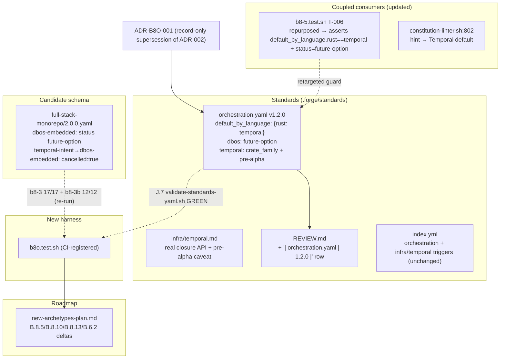
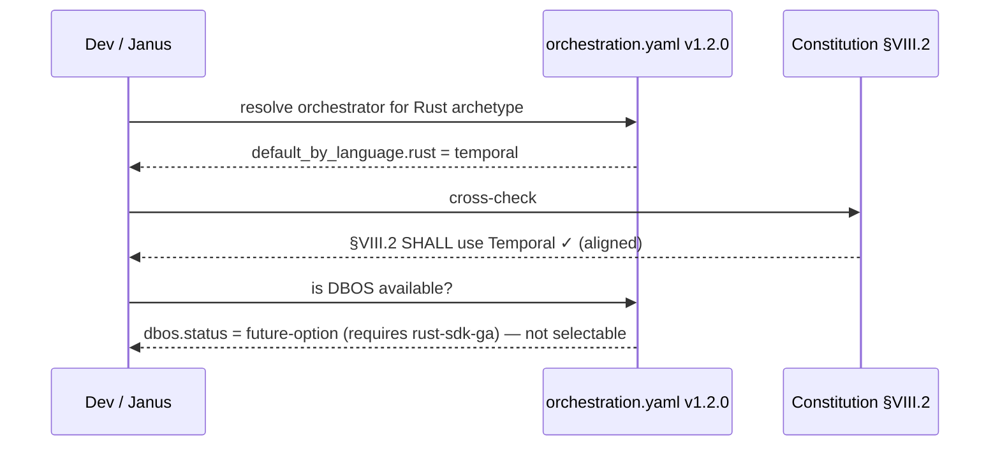

# Design: b8-orchestration-temporal-realign

<!-- Status: designed -->
<!-- Schema: default -->
<!-- Audit: B.8.5 follow-on — orchestration default reconciled with Constitution §VIII.2; ADR-002 Temporal→DBOS swap cancelled for Rust -->

**Authoring note (Article V / lesson `t5_2_self_validation_lesson`):** this design
is AUTHORED here. It is NOT self-approved. An **INDEPENDENT reviewer** (separate
agent, re-reading live files — not trusting this transcript) ratifies before
`/forge:plan`. The constitutional citation (VIII.2) + the superseded ADR (ADR-002)
make independent ratification non-negotiable.

All six open questions are resolved below against **live source re-read at design**
(not the proposal's assumptions):

| Q | Resolution | ADR |
|---|------------|-----|
| Q-001 | **record-only** supersession in this design.md + the specs MODIFIED entry; do NOT edit `ARCHITECTURE-TARGET.md` (it is sha256-pinned by `t4.test.sh::_test_t4_023` — editing it cascades a hash re-pin + re-ratification). Optional source-doc annotation deferred. | ADR-B8O-001 |
| Q-002 | `default_by_language: { rust: temporal }` replaces flat `default:`; `dbos:` future-option block; flat `default:`/`fallback:`/`fallback_trigger:` **dropped**; the two coupled consumers updated (FR-B8O-017/018). | ADR-B8O-002 |
| Q-003 | `dbos-embedded` → `status: future-option` + `note:`; the `temporal-intent → dbos-embedded` delta **reclassified in place** with `cancelled: true` + `note:` (NOT deleted) — keeps `migration_deltas` count unchanged (T-013) + auditable. | ADR-B8O-003 |
| Q-004 | `temporal.md` full code-sample rewrite to the real closure API; crate version pin home = template `Cargo.toml` (verify-then-pin at implement); orchestration.yaml records the crate FAMILY only. | ADR-B8O-004 |
| Q-005 | roadmap deltas land in **THIS** change (B.8.5/B.8.10/B.8.13/B.6.2). | ADR-B8O-005 |
| Q-006 | **(a)** prototype `temporalio-sdk` crate (maintainer decision 2026-06-01) — closure API, pinned + pre-alpha caveat, Rust-only. | ADR-B8O-004 |

---

## Architecture Decisions

### ADR-B8O-001: Reconcile orchestration default with Constitution §VIII.2; cancel ADR-002 for Rust; NO amendment

**Context.** `orchestration.yaml` v1.1.0 declares `default: dbos` (annotated
"language-conditional"). DBOS has **no Rust SDK** (crates.io 404; SDKs =
Python/TS/Go/Java/Kotlin) and Forge backends are Rust end-to-end, so the default
is unbuildable. Meanwhile Constitution §VIII.2 (v1.1.0) **already mandates**
Temporal: *"…SHALL use Temporal for orchestration."* ADR-002 (`ARCHITECTURE-
TARGET.md:328`, *Temporal→DBOS par défaut*) was a planning-doc KEEP-WITH-CHANGES
that would have required amending VIII.2 — an amendment never made.

**Decision.** Make Temporal the **default-by-language for Rust** in
`orchestration.yaml`, bringing the standard into **alignment** with §VIII.2.
ADR-002's Temporal→DBOS swap is **CANCELLED for Rust**; DBOS becomes a watch-list
future-option. **No Constitution amendment** (alignment, not replacement — contrast
B.8.4 VIII.1 Kong→Envoy, which *does* need a deferred amendment). ADR-002 is
recorded superseded **record-only** here (Q-001): `ARCHITECTURE-TARGET.md` is
sha256-pinned by `t4.test.sh::_test_t4_023`; editing it would cascade a hash
re-pin + re-ratification, disproportionate to a metadata annotation. The
supersession lives in this design.md + the specs MODIFIED entry + project memory.

**Consequences.** ✅ The standard stops advertising an unbuildable default. ✅ One
fewer breaking swap in B.8 (2.0.0 = Envoy + Connect + Zitadel + obs, no DBOS). ✅
B.7 (ai-native-rag, also Rust) inherits the corrected default before hitting the
same wall. ✅ No Constitution churn. ➖ `ARCHITECTURE-TARGET.md` ADR-002 stays
unannotated (mitigated by the change trail). ➖ Requires independent review (a
ratified ADR is superseded).
**Constitution Compliance:** §VIII.2 (ALIGNED), Article XII (no amendment),
Article IV (additive), Article V (independent review).

### ADR-B8O-002: `orchestration.yaml` 1.1.0 → 1.2.0 — `default_by_language` map + `dbos` future-option; legacy keys dropped + consumers updated

**Context.** Q-002. The flat `default: dbos` / `fallback: temporal` /
`fallback_trigger:` keys encode a single-default model that the
language-conditional reality has outgrown. Consumer grep (design-time, **completed
by INDEPENDENT review 2026-06-01** — initial enumeration was incomplete):
- `b8-5.test.sh:158` (T-006) hard-asserts `^default:\s*dbos$` **and** (`:170-178`)
  `2.0.0.yaml dbos-embedded status=deferred` → **breaks** on the flip (CRITICAL).
- `b8-5.test.sh:252-285` (**T-010**, MISSED in first pass) selects the
  `to: dbos-embedded` delta and requires its `note` to contain `*DEFERRED*`/`*no
  Rust SDK*` → **breaks** on the `cancelled:` reclassification (CRITICAL).
  Both T-006 + T-010 repurposed (FR-B8O-017).
- `constitution-linter.sh:802` — a remediation **hint string** referencing
  `orchestration.yaml::default` = DBOS → stale text (FR-B8O-018).
- `forbidden-components-rules.md:62` (**MISSED in first pass**) — T3-RULE-003
  Remediation cell `Replace with \`dbos\` (default) OR \`temporal\` (fallback)…` →
  stale (MAJOR, not CI-content-asserted). Updated (FR-B8O-018).
- `2.0.0.yaml:76` inline comment `# default: dbos (language-conditional…)` → stale
  (MINOR; FR-B8O-019).
- `t4.test.sh` (`:150,167`) — only checks parse + frontmatter keys → unaffected.
- `i3.test.sh:275-278` — copies the file for the T3-forbidden test; asserts on
  `forbidden: [inngest]`, not `default:` → unaffected (forbidden kept).
- `validate-standards-yaml.sh` — validates frontmatter + REVIEW.md + body via
  `additionalProperties: true`; does not hard-read `default:` → unaffected.

**Decision.** Additive bump **1.1.0 → 1.2.0**. Replace the flat `default:` with:

```yaml
# v1.2.0 — orchestration default is language-conditional, anchored on Constitution §VIII.2 (Temporal).
default_by_language:
  rust: temporal          # Constitution §VIII.2 — SHALL use Temporal. The only backend language Forge ships.
# fallback semantics fold into the map: Temporal is the DEFAULT for Rust, not a fallback.

dbos:
  status: future-option   # NOT a default. Re-evaluate if a production-grade Rust DBOS SDK ships.
  available: false        # DBOS has NO Rust SDK (folds the v1.1.0 rust_sdk_status fact; b8-5 T-006 reads this)
  requires: rust-sdk-ga   # crates.io `dbos` 404 as of 2026-06-01 (Python/TS/Go/Java/Kotlin only)
  revisit: 2027-05-31     # standard review cadence (= expires_at)
  note: >
    DBOS was ADR-002's proposed default but has no Rust SDK; Forge is Rust-backed
    end-to-end, so DBOS is unbuildable here. Retained as a watch-list option, not
    deleted. Superseded as default by ADR-B8O-001 (§VIII.2 alignment).

temporal:
  crate_family: temporalio-sdk   # prototype native Rust SDK (Q-006 path a); VERSION pinned in template Cargo.toml at implement
  stability: pre-alpha           # see temporal.md caveat (FR-B8O-021)
```

The flat `default:` / `fallback:` / `fallback_trigger:` keys are **dropped**
(single source of truth). The `rust_sdk_status.dbos` block from v1.1.0 is folded
into the new `dbos:` block (reconciled, not contradicted — FR-B8O-006).
`forbidden: [inngest]` and the J.7 frontmatter are **kept**; `last_reviewed`/
`expires_at` reset to `2026-06-01`/`2027-05-31`; a `| orchestration.yaml | 1.2.0 |`
REVIEW.md KEEP-WITH-CHANGES row is appended (the 1.1.0 row stays — append-only).
**Coupled consumers updated in THIS change:** `b8-5.test.sh` T-006 **and T-010**
repurposed (FR-B8O-017), `constitution-linter.sh:802` **and
`forbidden-components-rules.md:62`** hints updated (FR-B8O-018), `2.0.0.yaml:76`
comment corrected (FR-B8O-019).

**Consequences.** ✅ Single, honest, machine-readable default. ✅ J.7 stays GREEN.
✅ b8-5 regression guard retained (retargeted). ➖ Any external reader of the old
flat `default:` key must adapt (none found in-repo besides the two updated
consumers). **Constitution Compliance:** Article IV (additive bump), Article X
(J.7 contract), §VIII.2 (ALIGNED).

### ADR-B8O-003: `2.0.0.yaml` — `dbos-embedded` → future-option; delta reclassified-in-place (b8-3/b8-3b-safe)

**Context.** Q-003. b8-3.test.sh re-read at design (lines 122-160, 284-368):
- **T-012** (`:122-127`): forbidden key-set `{version,pin,image}` exact
  intersection on component keys — `status`/`note` are NOT forbidden.
- **T-013** (`:132-134,294`): `migration_deltas` MUST be **non-empty** (count > 0).
  It does **not** assert any specific delta.
- **T-015**: no component **direct scalar** matches `^\d+\.\d+` (free-text `note:`
  prose not starting with a version token is safe; mid-string dates safe).
- **T-016** (`:155-160,323`): a delta with `from` starting `postgres-16` + the
  postgres `migration_note` MUST exist — **untouched** by this edit.
- **No test asserts the `temporal-intent → dbos-embedded` delta exists.**

**Decision.**
- `dbos-embedded` component: `status: deferred` → **`status: future-option`** +
  `note:` (DBOS no Rust SDK; Temporal retained; superseded as default by
  ADR-B8O-001). Keys ∉ {version,pin,image}; no `^\d+\.\d+` scalar. `replaces:
  temporal-intent` is **removed** (Temporal is NOT being replaced) — `replaces`
  is not a forbidden key and removing it is safe; `name`/`standard:`/`role` kept.
- `temporal-intent → dbos-embedded` migration_delta: **reclassified in place**
  (NOT deleted) with `cancelled: true` + `note:`. Keeping the entry preserves
  `delta_count` (T-013 trivially safe — no risk of an empty array) and leaves a
  visible audit record that the swap was considered and cancelled. (Deletion
  would also pass T-013 via the other deltas, but reclassify-in-place is more
  auditable — chosen.)
- The header §VIII.2 note (line 19) is **strengthened**: `dbos-embedded` is a
  future-option, not a pending replacement.

**Coupling note (INDEPENDENT review).** `b8-5.test.sh` T-010 (`:252-285`) reads
this exact delta and requires its `note` to contain `*DEFERRED*`/`*no Rust SDK*`.
The `cancelled: true` reclassification flips that intent ⇒ T-010 MUST be
repurposed in lockstep (FR-B8O-017): its note-assertion retargets to the
cancelled-state invariant, its postgres-16-intact assertion stays.

**Consequences.** ✅ b8-3 (17/17) + b8-3b (12/12) stay GREEN (re-run as
FR-B8O-014 exit-code guard); b8-5 T-006 + T-010 repurposed GREEN. ✅ Auditable
cancellation. **Constitution Compliance:** Article IV (candidate edit; frozen
schema.yaml untouched).

### ADR-B8O-004: `temporal.md` realign to the real prototype API; pin in template Cargo.toml (verify-then-pin)

**Context.** Q-004 + Q-006(a). `temporal.md` uses the OLD symbols
`temporal_sdk::{WfContext, workflow}` / `temporal_client` + `#[activity]`
(singular). **LIVE-corrected at implement (evidence.md §2, docs.rs):** the real
published `temporalio-sdk` 0.4.0 API is **attribute-macro based** (NOT the closure
API the Context7 `sdk-core` master snippet showed — that correction is exactly what
verify-then-pin is for): `temporalio_sdk::workflows` + `temporalio_macros::workflow`
+ **`WorkflowContext`** + `WorkflowResult`; `temporalio_sdk::activities` +
`temporalio_macros::activities` + **`ActivityContext`** + `ActExitValue`; `Worker` /
`WorkerOptionsBuilder` (`.register_activities()`/`.build()`/`.run()`). So the
fabrication is the wrong crate/context names, NOT the use of macros. Stability
(docs.rs verbatim): *"alpha-stage … activity-only worker is the most stable …
running a workflow worker works, but the API is still very unstable"*; plus the
sdk-core README *"pre-alpha … no support guarantees … no firm plans to
productionize."* Core crates (`temporalio-sdk-core`, `temporalio-client`) are
production. Pinned crates: `temporalio-sdk = "0.4.0"`, `temporalio-client = "0.4.0"`.

**Decision (Q-006 = path a).** The flagship adopts the **prototype
`temporalio-sdk`** crate (ergonomic closure API). `temporal.md`:
- **Full code-sample rewrite** to the real macro API, sourced from the AUTHORITATIVE
  repo `github.com/temporalio/sdk-rust` `crates/sdk/README.md` (evidence.md §2b),
  **not fabricated**: activities `#[activities]`/`#[activity]` + `ActivityContext`;
  workflows `#[workflow]` struct + `#[workflow_methods]` + `#[run]` + `WorkflowContext<Self>`
  + `WorkflowResult` (a real, cited workflow example IS included — the round-1
  "no workflow sample" hedge is replaced now that an authoritative source exists);
  worker `WorkerOptions::new(q).register_activities(..).register_workflow::<T>()?.build()`
  + `Worker::new(&runtime, client, opts)?.run().await?` (NO `WorkerTaskTypes` — not in
  the authoritative README). Remove the OLD `temporal_sdk::`/`WfContext`/`ActContext`
  symbols. Stability = **Public Preview** (authoritative), not "pre-alpha". NO concrete
  version pin in the standard (b8o T-009 scans temporal.md too — review CRITICAL-2).
- A prominent **stability caveat** ("Stability" H2 near the top): native
  `temporalio-sdk` is pre-alpha, API may change without warning, no support
  guarantees; the Core crates (`temporalio-sdk-core`, `temporalio-client`) are
  production; the pin is exact + reviewed at cadence.
- **Pin home = template `Cargo.toml`** (the crate is a template dependency;
  markdown standards carry no `versions:` map). `orchestration.yaml` records the
  crate **family** (`temporalio-sdk`) + `stability: pre-alpha` only — **no
  version**. The concrete version + exact crate name (`temporalio-sdk` publish
  name vs `temporal_sdk` import) are **verify-then-pin at `/forge:implement`**
  (crates.io/docs.rs live; digest in `evidence.md`); if the registry contradicts
  the design shape, the impl surfaces `[NEEDS CLARIFICATION]` (b8-5 Q-004
  precedent).

**Consequences.** ✅ Standard reflects the real API. ✅ Stability risk explicit +
contained (scaffoldable:false candidate, pinned, review cadence). ➖ Pre-alpha
churn risk accepted for DX; mitigated by pin + caveat + cadence. **Constitution
Compliance:** Article III.4 (no fabrication), Article X (doc accuracy).

### ADR-B8O-005: roadmap deltas land in this change

**Context.** Q-005. The roadmap edits are the direct documentary consequence of
the same decision; splitting risks a dangling roadmap that still advertises DBOS.

**Decision.** `docs/new-archetypes-plan.md` edits in THIS change's impl:
B.8.5 DBOS-templates premise struck (note: re-scoped, DBOS has no Rust SDK);
B.8.10 Phase-2 DBOS leg dropped; B.8.13 "DBOS Postgres saturé → fallback Temporal"
rollback removed; §6.1 B.6.2 note that native `temporalio-sdk` supersedes the
planned "Temporal Go SDK via FFI ou client REST" (with the pre-alpha caveat).
**Consequences.** ✅ Roadmap coherent in one change. ➖ Slightly wider diff (doc
only, low risk).

---

## Component Design



## Data Flow — orchestrator resolution (post-change)



## Testing Strategy

- **L1 (new `b8o.test.sh`, grep/python, ≤5s, zero new dep):**
  - orchestration.yaml v1.2.0; `default_by_language.rust == temporal`;
    `dbos.status == future-option`; no flat `^default:` scalar remains;
    `forbidden: [inngest]` kept; `| orchestration.yaml | 1.2.0 |` REVIEW.md row.
  - 2.0.0.yaml `dbos-embedded.status == future-option`; the temporal→dbos delta
    carries `cancelled: true`; postgres component untouched.
  - temporal.md: zero `#[workflow]`/`#[activity]` matches; "pre-alpha" caveat
    string present; no concrete `temporalio-*` version string outside evidence.
  - **exit-code coupling guard:** re-run `b8-3.test.sh --level 1` (==17) +
    `b8-3b.test.sh --level 1` (==12) + `b8-5.test.sh --level 1` (repurposed T-006
    **+ T-010** GREEN); assert all exit 0. Also re-run `i3.test.sh` (T3-RULE-003
    anchor unchanged after the forbidden-components-rules.md remediation edit).
- **J.7 / verify / linter:** `validate-standards-yaml.sh` dir+file GREEN;
  `verify.sh` GREEN; `constitution-linter.sh` OVERALL PASS (hint string updated).
- **Full harness suite** (mirror forge-ci loop, ~42 harnesses; skip versioned
  `N.N.N/` subtrees) GREEN **before push** AND **re-run post `planned→implemented`
  flip** (lessons `full_harness_suite_before_push`, `b8_coroot_inversion_lessons`).
- **BDD:** the 4 specs.md scenarios (reader resolves Temporal; J.7 green; b8-3/b8-3b
  green; temporal.md real-API + caveat) are the acceptance gate.
- **No live worker / runtime test** (no orchestration worker deployed; B.8.1
  baseline). Verify-then-pin happens at implement; no toolchain build required for
  L1.

## Standards Applied

- **`global/standards-lifecycle.md` + J.7** (`validate-standards-yaml.sh`): the
  1.2.0 bump obeys the frontmatter contract + mandatory REVIEW.md row +
  `expires_at > last_reviewed`.
- **`global/source-document-pinning.md`**: ADR-002 supersession is record-only
  (no material edit to the sha256-pinned `ARCHITECTURE-TARGET.md`).
- **transport.yaml / observability.yaml additive-bump precedent**: body-field
  additions under root `additionalProperties: true`.
- **persistence.yaml**: unaffected (postgres delta is B.8.5, untouched here).

## Constitutional Compliance Gate

- **Article I/II (TDD/BDD):** `b8o.test.sh` authored RED-first against the target
  state; BDD scenarios in specs.md. ✓ no violation.
- **Article III.1/III.2 (specs before code):** design from specs; impl follows. ✓
- **Article III.4 (anti-hallucination):** DBOS-no-Rust-SDK + Temporal-pre-alpha +
  temporal.md API drift all verified from live sources; no version/API fabricated;
  verify-then-pin at implement. ✓
- **Article IV (delta-based):** additive standard bump + candidate edit; frozen
  1.0.0 surface untouched. ✓
- **Article V (compliance gate):** all 6 Qs resolved; **INDEPENDENT reviewer**
  ratifies before plan. ✓
- **Article VIII.2 (Temporal SHALL):** this change ALIGNS the standard with the
  mandate. ✓ **No amendment** (Article XII not invoked). ✓
- **Article X (quality/docs):** J.7 + standard accuracy preserved. ✓

No `[CONSTITUTION VIOLATION]`. Design does not block.

---

## Independent Review (pre-plan) — round 1 CHANGES REQUIRED → addressed

Per FR-B8O-032 + lesson `t5_2_self_validation_lesson`, an INDEPENDENT reviewer
(separate Opus agent, re-reading live files, not trusting the authoring transcript)
ratified this design on 2026-06-01.

**Round 1 verdict: CHANGES REQUIRED.** Confirmed: (1) §VIII.2 quote accurate +
"no amendment" logic holds (`constitution.md:312`); (2) b8-3 T-012/T-013/T-015/
T-016 analysis correct, b8-3 17/17 + b8-3b 12/12 pass live; (4) no fabricated
`temporalio-*`/`dbos` version; temporal.md fabricated-macro claim verified
(`infra/temporal.md:56,72,150,202,233,258,326`); (5) `ARCHITECTURE-TARGET.md`
sha256-pin confirmed (`t4.test.sh:278-294`) — record-only supersession justified.

**Findings (all addressed in this design + specs):**
- **CRITICAL** — missed `b8-5.test.sh` **T-010** (`:252-285`), a 2nd hard consumer
  of the `temporal-intent→dbos-embedded` delta (note must say `*DEFERRED*`/`*no
  Rust SDK*`). → FR-B8O-017 extended to repurpose T-010; ADR-B8O-003 coupling note.
- **MAJOR** — missed `forbidden-components-rules.md:62` stale "dbos (default)"
  remediation. → FR-B8O-018 extended (2nd site).
- **MINOR** — `2.0.0.yaml:76` stale inline comment. → FR-B8O-019.
- **Note** — preserve `available: false` through the rust_sdk_status fold (T-006a).
  → FR-B8O-006 + the `dbos.available: false` field in ADR-B8O-002.
- **Open** — removing `replaces: temporal-intent` is test-safe today; confirm no
  future B.8.12/B.8.14 zero-regression tooling expects it (flagged for those bricks).

**Round 2:** the same reviewer re-verified these closures and ratified the design.

## Independent Review (implementation) — round 1 CHANGES REQUIRED → round 3 APPROVE

After implementation (status `implemented`), the same INDEPENDENT reviewer re-read the
LIVE edited files and **re-executed** the harnesses (b8-coroot lesson — not trusting the
author transcript). It found two real defects in `temporal.md` that the pre-flip sweep
missed:
- **CRITICAL-1:** the realigned API was asserted from a non-reproducible docs.rs summary;
  the reviewer's `sdk-core` source showed a different (closure) API. **Resolved:** the
  published crate ships from `github.com/temporalio/sdk-rust` (≠ `sdk-core`); the
  authoritative `crates/sdk/README.md` (raw URL in evidence.md §2b) confirms the macro
  API — `temporal.md` corrected to match symbol-for-symbol (dropped the unverified
  `WorkerTaskTypes::activity_only()`; stability corrected to authoritative "Public
  Preview"; real cited `#[workflow]`/`#[run]` example).
- **CRITICAL-2:** concrete `temporalio-sdk = "0.4.0"` pins in `temporal.md` violated
  FR-B8O-023, and `b8o` T-009 scanned only `orchestration.yaml` (false-green).
  **Resolved:** pins removed (family-only); T-009 extended to scan `temporal.md`.

**Round 3 verdict: APPROVE — ready to archive.** Reviewer fetched the reproducible
citation itself, confirmed zero `temporalio-* = "x.y.z"` pins in both standards, re-ran
b8o (10/10) + b8-5 (12/12) + b8-3 (17/17) + b8-3b (12/12) + i3 (14/14) + j7 (17/17) +
verify (PASS) + linter (OVERALL PASS), and confirmed git hygiene (constitution.md /
frozen schema.yaml / flat compose untouched). All rounds 1–3 findings closed.
