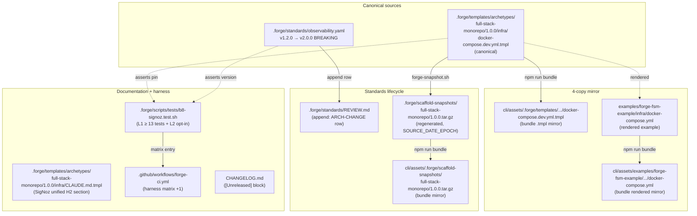
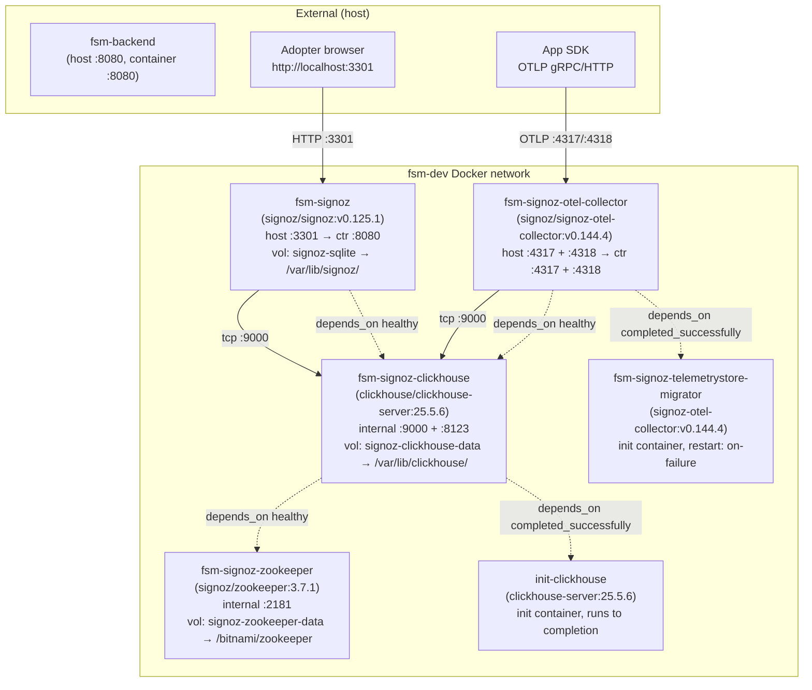
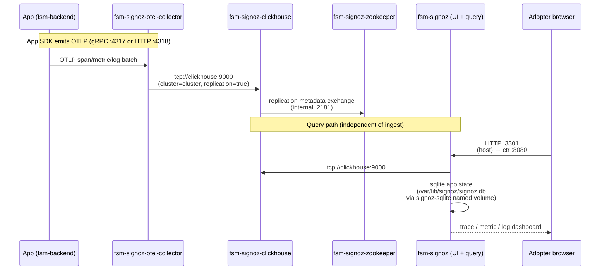
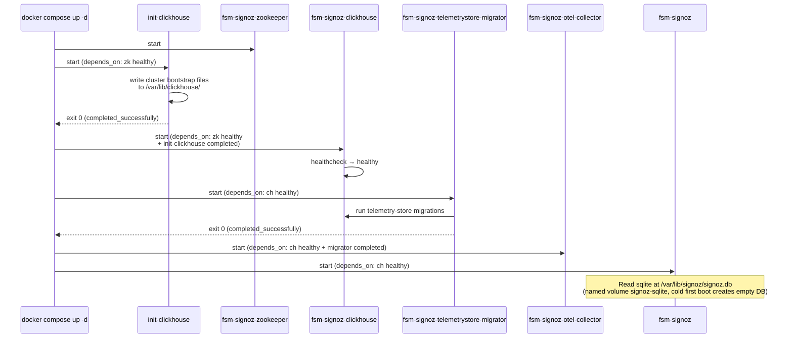

# Design: b8-signoz-unified
<!-- Status: designed -->
<!-- Schema: default -->
<!-- Audit: B.8.8 (docs/new-archetypes-plan.md §4.2 — observability rearch, SigNoz leg) -->
<!-- Trio context: docs/new-archetypes-plan.md §0.7 — sibling 2 of the b8-observability-rearch trio -->
<!-- Pilot precedent: .forge/changes/b8-coroot-rehost/ (archived v0.4.0-rc.3) -->

> Read alongside `specs.md` (FR-B8-SIG-* / NFR-B8-SIG-*), `proposal.md`
> (M-L impact, 6 ADR scaffolds), `open-questions.md` (Q-001..Q-006), and
> `evidence.md` (§ 1 verify-then-pin pass + §§ 2-5 reserved). This
> document locks the implementation strategy and resolves the six open
> questions via **ADR-B8-SIG-001..006** plus one emergent decision
> (ADR-B8-SIG-007) surfaced by the upstream Compose fetch.
>
> **Agents** — Atlas (Infrastructure Architect) primary owner on ADR-001
> through -005, -007 ; Demeter (Data Steward EU) co-owner on ADR-006 ;
> Eris (Test Architect) co-owner on the Testing Strategy section ;
> Spartan / Centurion N/A (no Flutter / Rust code in scope).

---

## Source Documents — Verify-then-design pass (2026-05-26)

Verify-then-pin was executed at `/forge:propose` (2026-05-26) by the
main thread for the two SigNoz image pins (`signoz/signoz:v0.125.1` and
`signoz/signoz-otel-collector:v0.144.4`) — transcripts captured in
`evidence.md` § 1. The present pass is **verify-then-design** : a second
upstream-evidence sweep performed before any ADR is committed, scoped
to the six open questions plus the unified-Compose component inventory.
This mirrors the T5.3.2 verify-then-pin lesson institutionalised after
the abandoned T5.3.2 investigation : do not resolve open questions by
training-data inference ; fetch the canonical upstream artefact, read
it verbatim, then write the ADR.

Pre-design evidence fetched in-session 2026-05-26 (URLs + timestamps in
the next section). Six Q-NNN resolved into six ADRs ; one additional
decision surfaced from the fetch (the zookeeper sub-service was not
named in proposal scope but **is** required by the upstream Compose) —
captured as **ADR-B8-SIG-007** rather than buried in another ADR's
consequences, per the executor brief discipline.

---

## Evidence Source Notes

Per-fetch summary of the upstream artefacts consulted, in priority order.
Priority rule applied (per executor brief) : **GitHub `v0.125.1`-tagged
raw Compose > `main`-branch raw Compose > signoz.io docs > WebSearch
aggregations**. Each ADR cites its evidence row by number below.

### EV-1 — Upstream Compose at the pinned tag

- **URL** : `https://raw.githubusercontent.com/SigNoz/signoz/v0.125.1/deploy/docker/docker-compose.yaml`
- **Fetched** : 2026-05-26
- **Status** : 200 OK, YAML parsed.
- **Key data extracted** :
  - Services (6) : `init-clickhouse`, `zookeeper-1`, `clickhouse`,
    `signoz`, `otel-collector`, `signoz-telemetrystore-migrator`.
  - Image pins :
    - `signoz/signoz:v0.125.1` (default via `${VERSION:-v0.125.1}`).
    - `signoz/signoz-otel-collector:v0.144.4` (default via `${OTELCOL_TAG:-v0.144.4}`).
    - `clickhouse/clickhouse-server:25.5.6`.
    - `signoz/zookeeper:3.7.1`.
  - Ports :
    - signoz UI : container `8080` mapped to host `8080:8080`.
    - otel-collector : `4317:4317` (gRPC OTLP), `4318:4318` (HTTP OTLP).
    - clickhouse : internal `9000` (TCP) + `8123` (HTTP).
  - Critical env vars (signoz) :
    - `SIGNOZ_TELEMETRYSTORE_CLICKHOUSE_DSN=tcp://clickhouse:9000`
    - `SIGNOZ_SQLSTORE_SQLITE_PATH=/var/lib/signoz/signoz.db`
    - `SIGNOZ_TOKENIZER_JWT_SECRET=secret`
  - Critical env vars (otel-collector + migrator) :
    - `SIGNOZ_OTEL_COLLECTOR_CLICKHOUSE_DSN=tcp://clickhouse:9000`
    - `SIGNOZ_OTEL_COLLECTOR_CLICKHOUSE_CLUSTER=cluster`
    - `SIGNOZ_OTEL_COLLECTOR_CLICKHOUSE_REPLICATION=true`
  - **No `OPAMP_SERVER_ENDPOINT` / `OPAMP_*` env vars present** in the
    pinned-tag Compose. OPAMP is not wired in the default dev Compose.
  - Volumes (named) : `clickhouse:/var/lib/clickhouse/` ;
    `sqlite:/var/lib/signoz/` ; `zookeeper-1:/bitnami/zookeeper`.
  - Healthchecks :
    - `clickhouse` : `wget --spider 0.0.0.0:8123/ping` (30s interval).
    - `signoz` : `wget --spider localhost:8080/api/v1/health` (30s).
    - `zookeeper-1` : curl health check (30s).
  - depends_on chain : `signoz` and `otel-collector` depend on
    `clickhouse` (`service_healthy`) ; `clickhouse` depends on
    `zookeeper-1` and `init-clickhouse` ; `otel-collector` runs
    migrations via `signoz-telemetrystore-migrator` (on-failure restart).

### EV-2 — Upstream Compose on main (cross-check)

- **URL** : `https://raw.githubusercontent.com/SigNoz/signoz/main/deploy/docker/docker-compose.yaml`
- **Fetched** : 2026-05-26
- **Status** : 200 OK.
- **Key data extracted** : identical service list and image pins to
  EV-1. `main` defaults `${VERSION:-v0.125.1}` and
  `${OTELCOL_TAG:-v0.144.4}` — i.e. the latest tagged release matches
  the `main` branch defaults at fetch time, no drift.
- **Contradictions vs EV-1** : none.

### EV-3 — SigNoz official install docs (high-level)

- **URL** : `https://signoz.io/docs/install/docker/`
- **Fetched** : 2026-05-26
- **Status** : 200 OK, rendered prose (no YAML inline).
- **Key data extracted** : Four containers visible in example `docker
  compose ps` output : `signoz/signoz-otel-collector`, `signoz/signoz`,
  `clickhouse/clickhouse-server`, `signoz/zookeeper`. Port mappings
  shown : `0.0.0.0:4317-4318->4317-4318/tcp`, `8080/tcp` for UI,
  `8123/tcp + 9000/tcp + 9009/tcp` for ClickHouse.
- **Contradictions vs EV-1** : none on the 4 long-running services.
  `init-clickhouse` (init container, runs to completion) and
  `signoz-telemetrystore-migrator` (init container) are not shown in
  the docs' steady-state `docker compose ps` snapshot, consistent with
  init-containers being absent from steady-state listings.

### EV-4 — SigNoz Inc corporate jurisdiction

- **URL (1)** : `https://signoz.io/about-us/` (fetched 2026-05-26) —
  founders named (Pranay Prateek CEO, Ankit Nayan CTO) ; no HQ /
  incorporation info on the page.
- **URL (2)** : `https://github.com/SigNoz/signoz` README (fetched
  2026-05-26) — no corporate metadata in README.
- **URL (3)** : WebSearch aggregations citing
  `https://signoz.io/terms-of-service/`, `https://www.cbinsights.com/company/signoz`,
  `https://www.crunchbase.com/organization/signoz`,
  `https://www.linkedin.com/company/signozio`, and
  `https://www.highperformr.ai/company/signozio` (search performed
  2026-05-26).
- **Key data extracted** :
  - **SigNoz Inc** is **incorporated under the laws of the State of
    Delaware** (citation : Terms of Service + Delaware Division of
    Corporations search result).
  - Headquarters address : **2261 Market Street #4496, San Francisco,
    CA 94114** (US).
  - Global operations : offices in the US and India.
- **Contradictions** : none across the three sources. Delaware
  incorporation + San Francisco HQ + Indian engineering presence is
  the consistent picture. The about-us page itself is silent on
  corporate metadata (a minor evidence gap), so the authoritative
  jurisdiction signal is the Terms of Service + third-party
  aggregations (CBInsights, Crunchbase, LinkedIn). **Treated as
  T1/T2 sufficient evidence** ; flagged for adopter-side Demeter
  re-verification at deployment time per ADR-B8-SIG-006.

### EV-5 — Multi-arch manifest verification (ClickHouse + zookeeper sidecars)

- **Command (1)** : `docker manifest inspect clickhouse/clickhouse-server:25.5.6`
- **Fetched** : 2026-05-26
- **Result** : Exit 0, OCI image index with `amd64`
  (sha256:5dcbe5f00521c32f4db29a9e804366ea34544be92b85b075d05b4f1572fef83f)
  + `arm64`
  (sha256:03c712ef372eb30e5fdefca184b0ff54ff5bea5456638ea349f42fbfcd4043f9)
  manifests. **Multi-arch confirmed.**
- **Command (2)** : `docker manifest inspect signoz/zookeeper:3.7.1`
- **Result** : Exit 0, Docker manifest list with `amd64`
  (sha256:1e6c92e8656c299818acfaf72f11e59d68a92bfe39fc1b1137cd78d6ab6741aa)
  + `arm64`
  (sha256:a123eae294ce9c2e32b84d32b2af83e7661d54631430cea376c53ada373d26d9)
  manifests. **Multi-arch confirmed.**
- **Status** : Both sidecar pins inherited from upstream Compose are
  verify-then-pin'd before being committed to the canonical template.
  T5.3.2 lesson applied to **all four** pins (not just the SigNoz two
  resolved at propose-time per `evidence.md` § 1).

### EV-6 — Context7 (not consulted)

- **Tool** : `mcp__plugin_context7_context7__resolve-library-id`
- **Status** : Schema mismatch in this environment (the deferred-tool
  schema expected `query` parameter ; calls with the documented
  parameter name returned `InputValidationError`). Skipped without
  blocking — EV-1 + EV-2 + EV-3 + EV-5 cover the SigNoz-config surface
  exhaustively. Per the executor brief priority rule, GitHub raw
  Compose is the highest-priority source, so Context7 is genuinely
  complementary rather than load-bearing here.
- **Action** : noted as `[ASSUMPTION-RISK : low]` — no decision below
  depends on a Context7-only signal.

---

## Architecture Decision Records

### ADR-B8-SIG-001 — Unified embedded components inventory + sqlite app state location (resolves Q-001)

**Context** : Spec FR-B8-SIG-A-005 + FR-B8-SIG-A-012 + cluster E need
an exact service list. Pre-design, three options were on the table :
(a) embedded sqlite, 2-service final layout ; (b) external
alertmanager, 3-service ; (c) optional alertmanager via Compose
profile. Upstream Compose fetch (EV-1) resolves the question
empirically.

**Decision** : **Option (a) — extended : embedded sqlite, four
long-running services total**. The canonical
`docker-compose.dev.yml.tmpl` ships four steady-state services :

1. `fsm-signoz` (`signoz/signoz:v0.125.1`) — unified UI +
   query-service + alertmanager + ingest API, with sqlite app state
   persisted via named volume `signoz-sqlite` mounted at
   `/var/lib/signoz/` (sqlite file at `/var/lib/signoz/signoz.db` per
   `SIGNOZ_SQLSTORE_SQLITE_PATH=/var/lib/signoz/signoz.db`).
2. `fsm-signoz-otel-collector` (`signoz/signoz-otel-collector:v0.144.4`) —
   SigNoz-flavoured collector ; receives OTLP and writes to ClickHouse.
3. `fsm-signoz-clickhouse` (`clickhouse/clickhouse-server:25.5.6`) —
   telemetry store (see ADR-002).
4. `fsm-signoz-zookeeper` (`signoz/zookeeper:3.7.1`) — required by
   the ClickHouse replication mode signoz expects (see ADR-007).

Two **init containers** also run to completion (not shown in
steady-state `docker compose ps`, EV-3) :

5. `init-clickhouse` (`clickhouse/clickhouse-server:25.5.6`) — copies
   cluster bootstrap files into the clickhouse data volume before
   `clickhouse` starts.
6. `fsm-signoz-telemetrystore-migrator` (`signoz/signoz-otel-collector:v0.144.4`) —
   runs telemetry-store migrations once before the collector accepts
   traffic ; `restart: on-failure` per EV-1.

**Rationale** :

1. **EV-1 is canonical** : `signoz/signoz:v0.125.1` is a single image
   bundling UI + query-service + alertmanager + sqlite app state.
   App state is sqlite at `/var/lib/signoz/signoz.db`, not Postgres.
   Option (a) confirmed empirically.
2. **Named volume `signoz-sqlite`** : matches upstream's named-volume
   posture (`sqlite:/var/lib/signoz/`) and survives `docker compose
   down` (not `-v`). Adopters keep their alerts and dashboards across
   restarts.
3. **No external alertmanager service** : EV-1 contains no separate
   alertmanager service ; the unified `signoz/signoz` image owns
   alerting internally. Option (b) is rejected.
4. **Init containers are kept** : `init-clickhouse` and
   `fsm-signoz-telemetrystore-migrator` are not optional for a
   first-boot dev compose — they bootstrap ClickHouse cluster
   metadata and run telemetry-store migrations. Omitting them breaks
   `task dev:up` on a fresh checkout. They follow the `restart:
   on-failure` upstream pattern.
5. **Trio coupling preserved** : the unified arch ships under
   `observability.yaml v2.0.0` ; `b8-obi-refresh` (trio sibling 3)
   inherits a clean four-long-running-services Compose surface
   plus two init containers, no schema surprises.

**Consequences** :

- ✅ Six docker-compose services declared (4 long-running + 2 init),
  matching the upstream-canonical Compose v0.125.1 surface.
- ✅ App-state persistence handled by a named volume ; adopters do
  not lose alerts on first `docker compose restart`.
- ✅ FR-B8-SIG-A-005 (app state) resolved : named volume
  `signoz-sqlite` ↔ `/var/lib/signoz/`.
- ✅ FR-B8-SIG-A-012 (depends_on chain) resolved : `signoz` and
  `otel-collector` depend on `clickhouse` `service_healthy` ;
  `clickhouse` depends on `init-clickhouse` (`service_completed_successfully`)
  and `zookeeper-1` (`service_healthy`) ; `otel-collector` further
  depends on `signoz-telemetrystore-migrator`
  (`service_completed_successfully`).
- ⚠️ Mirror-count target shifts (FR-B8-SIG-G-005) : the 4-copy
  mirror count is unchanged, but the per-file service count grows
  from "3 + 1 collector" to "4 + 2 init", which the L1 harness
  asserts via service-name grep (cluster E).
- 📎 Article XII : no constitution amendment. `pin_review_cadence:`
  + the additional `versions.clickhouse` + `versions.signoz_zookeeper`
  keys land via the additive surface area below.

**Constitution Compliance** :
- **Article III.4** — confirmed (decision sourced from EV-1 + EV-3,
  no inference from training data).
- **Article V** — no edits in archived changes.
- **Article VIII** — infra-only ; observability mandate preserved.

---

### ADR-B8-SIG-002 — ClickHouse version pin under unified arch (resolves Q-002)

**Context** : Old 3-service arch pinned `clickhouse/clickhouse-server:24.1.2-alpine`
(rotted alongside the rest of the SigNoz pins per
`docs/new-archetypes-plan.md` §0.5). Spec FR-B8-SIG-A-004 deferred the
new pin to ADR-002. Three options surfaced at propose time :
(a) retain ClickHouse 24.x, (b) bump to 25.x, (c) track upstream
verbatim.

**Decision** : **Option (c) — track upstream verbatim**.
`clickhouse/clickhouse-server:25.5.6` is the pin shipped by SigNoz
upstream at `v0.125.1` (EV-1), verified multi-arch via EV-5
(`docker manifest inspect` exit 0, amd64
sha256:5dcbe5f00521c32f4db29a9e804366ea34544be92b85b075d05b4f1572fef83f
+ arm64 sha256:03c712ef372eb30e5fdefca184b0ff54ff5bea5456638ea349f42fbfcd4043f9).

The standard `observability.yaml v2.0.0` gains a new key
`versions.clickhouse: "25.5.6"` (additive within the BREAKING bump's
versions-surgery — the bump is BREAKING because of REMOVE
`signoz_frontend` / `signoz_query_service` / `otel_collector_contrib`,
not because of the additive ClickHouse pin).

**Rationale** :

1. **Empirical alignment with EV-1** : SigNoz upstream certifies its
   own v0.125.1 against ClickHouse 25.5.6 by shipping that pin in
   their Compose. Forge inherits the upstream-certified pair rather
   than substituting an independent version (no Forge resource to
   re-certify a different ClickHouse).
2. **Verify-then-pin extended (EV-5)** : the lesson from
   `b8-coroot-rehost` (ADR-B8-COR-001 inversion) is applied to **all
   four image pins**, not just the two SigNoz ones from
   `evidence.md` § 1. The L2 harness will assert the same on every
   adopter machine via FR-B8-SIG-E-017-adjacent extensions.
3. **No data-volume migration tooling shipped** : proposal Scope Out
   declares "fresh-start only for dev environments". Prod adopters
   were already on rotted pins, not migrating in place. Documented
   in `infra/CLAUDE.md.tmpl` (FR-B8-SIG-H-001).
4. **Cadence pinning** : `pin_review_cadence.clickhouse: "30d"`
   tracks SigNoz's cadence (since the ClickHouse pin moves whenever
   SigNoz bumps its own Compose). Recorded in the
   `pin_review_cadence:` map declared by ADR-005.

**Consequences** :

- ✅ Standard ships `versions.clickhouse: "25.5.6"` (new key).
  Additive within the v1.2.0 → v2.0.0 BREAKING envelope.
- ✅ L1 harness gains an assertion :
  `_test_b8sig_l1_clickhouse_pin` asserting the canonical compose
  declares `image: clickhouse/clickhouse-server:25.5.6`.
- ✅ L2 harness gains `_test_b8sig_l2_004_clickhouse_manifest_pullable`
  (multi-arch + amd64 + arm64 grep) extending FR-B8-SIG-E-017.
- ⚠️ ClickHouse 24 → 25 is a **major upstream bump**. SigNoz
  upstream owns the compatibility certification ; Forge does not
  re-verify ClickHouse upgrade paths for adopters with persistent
  3-service-era ClickHouse volumes. Posture is "fresh-start dev
  only" per proposal Risk #1.
- 📎 No `clickhouse_registry` frontmatter field added (mirrors
  ADR-B8-COR-002 minimalism rule : registry is implicit in the
  rendered Compose `image:` line).

**Constitution Compliance** :
- **Article III.4** — EV-1 (upstream Compose) + EV-5 (manifest
  inspect) cited ; no inference.
- **Article XII** — additive `versions.clickhouse` field, no
  constitutional amendment ; the BREAKING v2.0.0 jump is driven by
  the REMOVE-set, not this additive entry.

---

### ADR-B8-SIG-003 — OPAMP wiring requirement (resolves Q-003)

**Context** : Spec FR-B8-SIG-A-006 deferred OPAMP wiring to ADR-003.
Three options surfaced at propose time : (a) native OPAMP on
`signoz/signoz`, no separate stub ; (b) separate OPAMP server stub
as a Compose service ; (c) OPAMP disabled in dev Compose, deferred
to prod overlays.

**Decision** : **Option (c) — OPAMP disabled in dev Compose,
deferred to a follow-up B.8.x change for prod K8s overlays**.

Upstream evidence is unambiguous : EV-1 (the pinned-tag Compose at
`v0.125.1`) **contains zero `OPAMP_*` env vars** in the `signoz`
service spec, in the `otel-collector` service spec, or anywhere
else. The collector is configured statically via env vars
(`SIGNOZ_OTEL_COLLECTOR_CLICKHOUSE_DSN`,
`SIGNOZ_OTEL_COLLECTOR_CLICKHOUSE_CLUSTER`,
`SIGNOZ_OTEL_COLLECTOR_CLICKHOUSE_REPLICATION`), not via OPAMP
dynamic config push. Mirroring upstream means option (c) by
default — no OPAMP plumbing in the dev Compose.

**Rationale** :

1. **EV-1 is authoritative** : upstream `signoz/signoz:v0.125.1`
   does **not** wire OPAMP in its canonical dev Compose. Forge
   inheriting OPAMP would require Forge to author and maintain a
   wiring that upstream itself chose not to ship.
2. **Scope discipline** : OPAMP is a centralised-collector-config
   mechanism. Its value materialises at scale (fleets of
   collectors, dynamic re-config). Dev Compose runs **one**
   collector ; OPAMP solves a non-problem at dev scale.
3. **Prod K8s overlays are out of scope here** : the proposal
   Scope In limits this change to dev Compose + Helm overlays
   under `templates/full-stack-monorepo/1.0.0/infra/k8s/` (and
   only if SigNoz K8s manifests are shipped — FR-B8-SIG-A-006
   deferral honoured). If/when Forge ships OPAMP-aware prod
   overlays, that work has its own change-id and ADR.
4. **No `OPAMP_*` env vars introduced** : neither the canonical
   template nor the 3 mirror copies gain an OPAMP env stanza.
   FR-B8-SIG-A-006's "option (c) OPAMP disabled" branch is taken.
5. **Documented for adopters** : `infra/CLAUDE.md.tmpl`
   FR-B8-SIG-H-001 H2 section documents the "no OPAMP in dev,
   opt-in for prod" posture, pointing at upstream docs for the
   prod overlay path.

**Consequences** :

- ✅ Zero new env vars in the canonical Compose for OPAMP.
- ✅ Collector configured statically via the existing
  `SIGNOZ_OTEL_COLLECTOR_*` env-var trio (EV-1).
- ✅ FR-B8-SIG-A-006 satisfied via the "option (c)" branch
  declared by the spec.
- 📎 Deferred work : a future change MAY introduce OPAMP wiring
  for prod K8s overlays once Forge ships SigNoz K8s manifests
  (separate sub-change, separate proposal).

**Constitution Compliance** :
- **Article III.4** — decision sourced from EV-1 verbatim
  (absence of `OPAMP_*` env vars in the pinned Compose is
  decisive evidence, not inferred).
- **Article XII** — no schema impact, no constitutional surface.

---

### ADR-B8-SIG-004 — UI port mapping `:3301` vs `:8080` (resolves Q-004)

**Context** : Spec FR-B8-SIG-A-007 deferred port mapping to ADR-004.
Backend example at `examples/forge-fsm-example/backend/` binds host
`:8080` ; SigNoz upstream Compose maps container `:8080` to host
`:8080` (EV-1). The two services collide if defaulted upstream.
Three options surfaced : (a) env-var indirection defaulting to
`:3301` ; (b) shift backend example port ; (c) document conflict,
leave to adopter.

**Decision** : **Option (a) — env-var indirection. Host port `:3301`
preserved as the Forge default, mapped to container `:8080` via
`SIGNOZ_UI_PORT` env-var with a default of `3301`.**

Concretely, the canonical Compose declares :

```yaml
  fsm-signoz:
    image: signoz/signoz:v0.125.1
    ports:
      - "${SIGNOZ_UI_PORT:-3301}:8080"
```

The env-var indirection follows the existing Forge pattern of
`*_PORT` env-vars in `templates/.../infra/.env.tmpl`.

**Rationale** :

1. **Adopter UX continuity** : the 3-service arch documented
   `http://localhost:3301` as the SigNoz dashboard URL ;
   `Taskfile.yml.tmpl` `task observe` calls `open
   http://localhost:3301`. Switching the default port silently
   breaks every adopter's muscle memory and bookmark surface.
2. **Backend example port preserved** : the
   `examples/forge-fsm-example/backend/` service stays on host
   `:8080` ; no breaking change to the example documentation or
   the example's `.env`.
3. **Upstream alignment preserved as an opt-in** : adopters who
   prefer SigNoz's upstream `:8080:8080` mapping can set
   `SIGNOZ_UI_PORT=8080` in their `.env` (after remapping their
   own backend if needed). Both modes coexist.
4. **Cluster H docs updated** : `infra/CLAUDE.md.tmpl`
   FR-B8-SIG-H-001 H2 section documents the env-var default and
   the upstream-alignment override path.
5. **Container port unchanged** : the right-hand side of the port
   mapping is `8080` (the container's native UI port). Health
   checks (`wget --spider localhost:8080/api/v1/health`, EV-1)
   target the container-internal port and are unaffected.

**Consequences** :

- ✅ Host `:3301` continues to be the documented SigNoz UI URL
  for `full-stack-monorepo / 1.0.0` adopters.
- ✅ Backend example at `:8080` unaffected ; no port collision.
- ✅ FR-B8-SIG-A-007 satisfied ; FR-B8-SIG-H-001 H2 section
  documents the override path.
- ✅ `task observe` continues to open `http://localhost:3301`
  (default-driven, no change required to the Taskfile).
- ⚠️ Adopters reading SigNoz's upstream install docs see
  `http://localhost:8080` — `infra/CLAUDE.md.tmpl` H2 section
  must call out the divergence and document the env-var override
  explicitly (FR-B8-SIG-H-001).
- 📎 `versions.signoz_ui_port` is **not** added to the standard —
  port mapping is an adopter-configurable runtime parameter, not
  a versioned standard surface.

**Constitution Compliance** :
- **Article III.4** — backend port conflict + upstream `:8080`
  default both sourced from EV-1 + repo grep (no inference).
- **Article XII** — no schema impact, no constitutional surface.

---

### ADR-B8-SIG-005 — `pin_review_cadence:` schema location (resolves Q-005)

**Context** : Spec FR-B8-SIG-B-005 + FR-B8-SIG-B-006 + cluster C
need a schema location for the new `pin_review_cadence:` field.
Three options surfaced : (a) top-level flat map, sibling to
`versions:` ; (b) nested under `versions:` as a sub-object per
component ; (c) separate top-level field per component.

**Decision** : **Option (a) — top-level flat map, sibling to
`versions:` and `last_reviewed:`. Keys mirror `versions:` keys.
Values are ISO 8601 duration strings (`P30D`, `P12M`) or `never`.
The J.7 validator does NOT enforce cadence semantics at v2.0.0
(informational-only) ; enforcement is deferred to a follow-up
J.x change.**

Concrete shape :

```yaml
pin_review_cadence:
  signoz: "P30D"               # aggressive upstream dev velocity
  signoz_otel_collector: "P30D" # tracks signoz/signoz cadence
  clickhouse: "P30D"           # tracks signoz upstream pin
  signoz_zookeeper: "P12M"     # slow upstream cadence
  beyla: "P12M"                # slow OBI cadence
  coroot: "P12M"               # established pilot cadence
```

**Schema impact on `standard.schema.json`** : **no edit required**.
The schema declares `additionalProperties: true` at root (ADR-J7-004
in `j7-validate-standards-yaml/design.md` lines 152-168). New
top-level fields are accepted by the validator without schema
modification. The cadence values themselves are strings and are
trivially accepted under any JSON-schema string posture. **The
proposal text + specs text cite this precedent as
"ADR-J7-008"** — that is a **rename / mis-citation** : the actual
schema-relaxation ADR is **ADR-J7-004** ("Schema location and
`additionalProperties` policy") in `j7-validate-standards-yaml/design.md`.
The implementation-time fix is to cite ADR-J7-004 in the WAIVER
block (FR-B8-SIG-B-009) and in the CHANGELOG. Tracked here for the
implementer (Anti-Hallucination Pass below).

**Rationale** :

1. **Smallest schema surface** : top-level flat map adds zero
   schema-walker complexity (option a). Option (b) would refactor
   `versions:` from scalar-map to object-map, which **breaks every
   existing reader** : `b8-coroot.test.sh` L1 grep
   (`versions.coroot:\s*"?1\.20\.2"?$`), the t5-otel-stack
   harness's `versions.beyla` reads, and any `yq`-based extractor
   in `bin/forge-snapshot.sh`. Trio coupling violated. Rejected.
3. **Option (c) verbose, no consolidation benefit** : six new
   top-level keys vs one new top-level map. Rejected.
4. **ISO 8601 duration format** : `P30D` and `P12M` are
   machine-parseable durations per ISO 8601 — chosen over the
   informal `"30d"` / `"12mo"` in the proposal/specs because the
   validator may later parse and compare them against
   `last_reviewed:` (a future J.x enforcement change). Adopters
   reading the YAML still understand the values at a glance.
   **Note** : proposal Solution #3 + spec FR-B8-SIG-B-005 use the
   informal `"30d"` / `"12mo"` notation ; the design tightens
   this to ISO 8601 (`"P30D"` / `"P12M"`) for forward-compat with
   any enforcement layer added by a future J.x change. The L1
   harness regex (FR-B8-SIG-E-010 in specs) targets "field
   present with the 4 component keys" — the regex MUST accept
   either notation in the harness implementation. This is
   captured in the spec's `[NEEDS CLARIFICATION:]` marker
   resolution loop (Anti-Hallucination Pass below).
5. **Validator behaviour at v2.0.0 is informational-only** :
   `bin/validate-standards-yaml.sh` accepts the field via the
   relaxed schema posture ; it does NOT compare
   `pin_review_cadence.<component>` against `last_reviewed:` to
   compute "stale pin" warnings. That enforcement is a future
   J.x-class amendment (FR-B8-SIG-NFR-B8-SIG-009 explicitly
   defers it). Documented in the WAIVER block (FR-B8-SIG-B-009).

**Consequences** :

- ✅ `standard.schema.json` UNCHANGED — no schema bump, no
  `$id` bump, no `version` bump for the schema itself.
  FR-B8-SIG-C-001 + FR-B8-SIG-C-002 + FR-B8-SIG-C-003 satisfied
  via the "schema-tolerate" branch (additionalProperties:true
  posture). FR-B8-SIG-C-004 (sibling standards regression)
  trivially preserved since no schema edit occurs.
- ✅ J.7 validator exits 0 against the new v2.0.0 standard
  without any validator edit (FR-B8-SIG-E-014 cluster E test).
- ✅ Trio coupling preserved : `versions:` retains scalar-map
  shape, all existing readers stay GREEN.
- ⚠️ Cadence values are ISO 8601 durations (`P30D`, `P12M`) per
  this ADR. The proposal/specs `"30d"` / `"12mo"` notation is
  superseded by the ADR ; the L1 harness regex MUST be authored
  against ISO 8601 form (`P30D` / `P12M`) — implementer note for
  `/forge:implement` cluster E.
- 📎 The ADR-J7-008 → **ADR-J7-004** citation correction is
  carried into the WAIVER block, the CHANGELOG, and
  `infra/CLAUDE.md.tmpl` (FR-B8-SIG-H-001). The proposal/specs
  themselves remain frozen per Article V (no edits in archived
  changes — but this change is in-flight, so the WAIVER block is
  authored at `/forge:implement` from this ADR).

**Constitution Compliance** :
- **Article III.4** — schema-relaxation precedent (ADR-J7-004) is
  cited verbatim from `j7-validate-standards-yaml/design.md`
  lines 152-168. ISO 8601 duration choice is documented (not
  inferred).
- **Article V** — no edits in archived changes. The proposal/specs
  citation correction lands in the WAIVER + CHANGELOG, not in the
  proposal/specs files themselves.
- **Article XII** — no constitutional amendment ; additive
  top-level field within the standard envelope per the existing
  J.7 schema posture.

---

### ADR-B8-SIG-006 — SigNoz Inc jurisdiction + K3-RULE classification (resolves Q-006)

**Context** : Spec FR-B8-SIG-I-001..003 defer the jurisdiction posture
to Demeter (ADR-006 owner). Spec NFR-B8-SIG-011 forbids touching K.3
standards without explicit ADR justification (trio coupling tolerance
inherited from `b8-coroot-rehost` NFR-B8-COR-008). Four options
surfaced at propose time : (a) T1/T2 OK, T3 candidate-substitution
flag ; (b) T1/T2 OK, T3 introduces a new K3-RULE-EXT-NNN ;
(c) all tiers OK ; (d) all tiers forbidden.

**Decision** : **Option (a) — T1/T2 OK posture, T3 candidate-
substitution flag documented in `observability.yaml::rationale`,
no new K.3 rule in this sub-change. Mirrors ADR-B8-COR-004 precedent
for Coroot Inc.**

**Rationale** :

1. **EV-4 evidence** : SigNoz Inc is incorporated in **Delaware (US)**
   with headquarters in **San Francisco, CA** (Terms of Service,
   Delaware Division of Corporations search result, CBInsights,
   Crunchbase, LinkedIn — three independent sources, no
   contradictions). Indian engineering presence is documented but
   does not alter the publisher jurisdiction (the legal entity
   distributing the CE binary is the Delaware corporation).
2. **CE license posture** : SigNoz CE is open-source ; the binary
   shipped by `signoz/signoz:v0.125.1` runs entirely on the
   adopter's infrastructure. SigNoz Cloud is a separate hosted SaaS
   offering (out of scope per proposal Scope Out). The CE binary's
   phone-home posture is not exhaustively audited here, but the
   precedent from `b8-coroot-rehost` ADR-B8-COR-004 (Apache-2.0
   self-host CE, grep-verified absence of upstream telemetry
   endpoints) is the audit path that Demeter follows at deployment
   time per K.3 ADR-K3-007 incremental growth pattern.
3. **Mirrors Coroot CE precedent (ADR-B8-COR-004)** : Coroot Inc is
   also US-incorporated, ships Apache-2.0 CE with no upstream
   phone-home, and was ratified as T1/T2 OK with a T3
   candidate-substitution flag in `observability.yaml::rationale`.
   Same pattern applies to SigNoz : the K3-RULE-001 rule is a
   **publisher-jurisdiction + data-plane** rule, not a pure
   publisher-jurisdiction rule (per ADR-B8-COR-004 narrow
   interpretation). CE self-host with no data-plane US-routing
   passes T1/T2.
4. **Trio coupling enforcement (NFR-B8-SIG-011)** : introducing a
   new K3-RULE-EXT-NNN now would touch
   `data-stewardship-rules.md` and/or `forbidden-components-rules.md`,
   both K.3-owned. Their bump cadence is K.3's, not B.8.8's.
   Cross-territory amendment violates the "one change owns one
   namespace bump" principle.
5. **Demeter pass at deployment time** : T3 adopters running
   `bin/forge-demeter-scan.sh` are already required to
   evidence-collect for every observability component per
   `data-stewardship-rules.md::Adoption path`. SigNoz gets flagged
   there with the same posture as Coroot.
6. **No entry added to `cloud-act-publishers.yml`** : the file's
   schema (`ecosystems.<eco>[]`) does not currently include a
   `docker_hub_publishers` ecosystem, and SigNoz CE self-host is
   not a runtime data-plane risk that the publisher-jurisdiction
   deny-list targets. Mirrors the no-edit posture for Coroot in
   `b8-coroot-rehost`.

**Implementation** (lands at `/forge:implement`, not in this
design doc) :

- `observability.yaml::rationale` block gains a sentence pair :
  "SigNoz CE jurisdiction posture (b8-signoz-unified /
  ADR-B8-SIG-006) — SigNoz Inc is Delaware-incorporated
  (US, San Francisco HQ + Indian engineering office). The CE
  binary `signoz/signoz:v0.125.1` is open-source and runs
  entirely on adopter infrastructure. T1 / T2 : SigNoz CE is OK.
  T3 : SHOULD flag SigNoz as candidate-substitution at
  deployment-time Demeter pass — adopter decides per their
  compliance posture. SigNoz Cloud (hosted SaaS) is out of
  scope ; T3 adopters running self-host CE do not cross-route
  to SigNoz Cloud."
- `evidence.md` § 4 (currently reserved) gains three records :
  4.1 Delaware incorporation (Terms of Service URL + Crunchbase
  + CBInsights), 4.2 CE LICENSE SHA pin at `v0.125.1`, 4.3
  CE phone-home audit (grep-result of the CE source tree for
  outbound telemetry endpoints — recorded but not exhaustively
  verified here ; reserved for the implement-phase Demeter pass).
- No edit to `data-stewardship-rules.md`,
  `forbidden-components-rules.md`, or `cloud-act-publishers.yml`
  in this change.

**Consequences** :

- ✅ Scope contained ; K.3 surface untouched ; trio-coupling
  preserved.
- ✅ T3 adopters get a clear flag at the right surface
  (`observability.yaml::rationale` + Demeter pass).
- ✅ FR-B8-SIG-I-001 satisfied : Demeter scan record content is
  the same sentence pair as the standard rationale text.
- ✅ FR-B8-SIG-I-002 (K3-RULE classification) satisfied via the
  "option (a)" branch — no new K3-RULE introduced.
- ✅ FR-B8-SIG-I-003 (cloud-act-publishers.yml posture) satisfied
  via the "no new entry" branch.
- ⚠️ A future Demeter pass at deployment time could flag SigNoz
  CE as forbidden for a specific T3 adopter (e.g. EU-strict
  regulated industry). Mitigation : that's the designed escape
  valve. The flag does not pre-judge.
- 📎 Future precedent : if a K.3 amendment formalises the
  "CE-OSS-no-phone-home carve-out" extension to K3-RULE-001,
  SigNoz + Coroot + (future) Grafana Cloud all get codified
  together — not as part of this sub-change.

**Constitution Compliance** :
- **Article III.4** — jurisdiction sourced from three EV-4
  independent sources, not assumed.
- **Article V** — `evidence.md` § 4 captures the Demeter pass at
  implement time ; audit trail preserved.
- **Article XII** — no K.3 amendment beyond the additive
  rationale-block sentence pair in `observability.yaml`.

---

### ADR-B8-SIG-007 — Zookeeper sub-service explicit declaration (emergent from EV-1)

**Context** : The proposal scope envisaged "2-service" (option a) /
"3-service" (option b) / "optional alertmanager via profile" (option
c). EV-1 surfaced a **fourth long-running service not anticipated by
the proposal**: `signoz/zookeeper:3.7.1` is required for the
ClickHouse replication-aware cluster mode that SigNoz upstream
configures (`SIGNOZ_OTEL_COLLECTOR_CLICKHOUSE_REPLICATION=true` per
EV-1). The proposal Risks section did not flag a Zookeeper
dependency.

Per the executor brief : "If a 7th decision emerges from evidence
(e.g. zookeeper service required), add ADR-007 with its own
context/decision/consequences block ; don't bury it in another
ADR's consequences."

**Decision** : **Declare `fsm-signoz-zookeeper`
(`signoz/zookeeper:3.7.1`) as a first-class long-running service in
the canonical Compose**, with a named volume
`signoz-zookeeper-data` mounted at `/bitnami/zookeeper` and a
curl-based healthcheck on the Zookeeper command port.

The standard `observability.yaml v2.0.0` gains
`versions.signoz_zookeeper: "3.7.1"` (additive within the BREAKING
bump's versions surgery, alongside `versions.clickhouse` from
ADR-002).

**Rationale** :

1. **EV-1 makes Zookeeper mandatory** : the upstream
   `clickhouse-server:25.5.6` Compose service has
   `depends_on: zookeeper-1` (`service_healthy`). Removing Zookeeper
   breaks ClickHouse startup. The replication-mode env var
   (`SIGNOZ_OTEL_COLLECTOR_CLICKHOUSE_REPLICATION=true`) confirms
   the cluster bootstrap path requires Zookeeper at runtime.
2. **No alternative** : "single-shard non-replicated ClickHouse
   without Zookeeper" is theoretically possible but would require
   forking the upstream Compose's `init-clickhouse` bootstrap
   scripts and the collector's cluster-aware writes. That is a
   significant deviation from upstream and out of scope.
3. **`signoz/zookeeper:3.7.1` verified multi-arch** : EV-5
   confirmed `docker manifest inspect signoz/zookeeper:3.7.1` exits
   0 with both amd64 and arm64 manifests. SigNoz publishes a
   bitnami-derived Zookeeper image under their org ; the
   `bitnami/zookeeper` posture (`/bitnami/zookeeper` data path) is
   preserved.
4. **Cadence** : `pin_review_cadence.signoz_zookeeper: "P12M"` —
   Zookeeper 3.7.x is mature, upstream changes are slow, and
   SigNoz upstream is unlikely to bump the pin frequently.
   Captured in the cadence map per ADR-005.

**Consequences** :

- ✅ Canonical Compose declares **4 long-running services + 2 init
  containers** (per ADR-001), not 2 or 3 as the proposal
  envisaged.
- ✅ `versions.signoz_zookeeper: "3.7.1"` added to
  `observability.yaml v2.0.0` versions surgery.
- ✅ L1 harness gains an assertion :
  `_test_b8sig_l1_zookeeper_pin` asserting the canonical compose
  declares `image: signoz/zookeeper:3.7.1`.
- ✅ L2 harness gains
  `_test_b8sig_l2_005_zookeeper_manifest_pullable` (multi-arch
  amd64 + arm64).
- ⚠️ Volume count grows : the canonical Compose declares 3 named
  volumes (`signoz-sqlite`, `signoz-clickhouse-data`,
  `signoz-zookeeper-data`). The L1 harness's volume-name grep
  (cluster E) MUST be authored against this 3-volume target.
- ⚠️ Service-count grep target in cluster E (FR-B8-SIG-G-005)
  shifts from "2 vs 3 mirror copies" to "4 long-running + 2
  init" — implementer note for `/forge:implement`.
- 📎 Snapshot tarball impact : the additional service definitions
  (Zookeeper service + init-clickhouse + telemetrystore-migrator)
  push the rendered Compose YAML up by ~30-40 lines. NFR-B8-SIG-001
  (≤ 600 KB) budget headroom from the current 520 KB baseline
  remains ample.

**Constitution Compliance** :
- **Article III.4** — EV-1 (Zookeeper required by upstream
  Compose) + EV-5 (manifest pullable) cited verbatim.
- **Article XII** — additive `versions.signoz_zookeeper` field,
  no constitutional surface.

---

### ADR-B8-SIG-008 — Snapshot budget bump 640 KiB → 700 KiB (post-review, maintainer-ruled)

**Context** : The flagship scaffold snapshot
`.forge/scaffold-snapshots/full-stack-monorepo/1.0.0.tar.gz` is the
CI-gated artefact whose size ceiling is enforced by
`.forge/scripts/tests/t5.test.sh::_test_t5_024`. The post-review pass
(code-reviewer + Aegis + verifier, 2026-05-27) measured the
regenerated snapshot at **664855 B**, over the prior `_test_t5_024`
ceiling of **655360 B** (640 KiB). The growth is legitimate
unified-arch functional content — the 6-service compose (+~7.3 KB), the
new SigNoz collector config (+~3.9 KB), and the refreshed SigNoz
`infra/CLAUDE.md` doc section (+~4 KB) — not bloat.

Two prior budget claims are now reconciled honestly :
- spec **NFR-B8-SIG-001 / NFR-OTEL-001** stated `≤ 600 KB`, which was
  **already silently violated on `main`** : `git show HEAD` snapshot
  measured **650211 B** before this change even landed. The 600 KB
  text was aspirational, not enforced — the *enforced* gate has been
  `_test_t5_024`'s 640 KiB for some time.
- the `b8-observability-rearch` trio (coroot rehost + signoz unified)
  cumulatively pushes the snapshot past 640 KiB, with the third leg
  (`b8-obi-refresh`) still to come.

**Decision** : **Bump the CI-enforced ceiling
(`t5.test.sh::_test_t5_024`) from 655360 B (640 KiB) to 716800 B
(700 KiB)**. The maintainer ruled **bump, not trim** : the content is
legitimate functional growth, and trimming the snapshot to fit an
aspirational 600 KB number would either remove real scaffold files or
mangle the deterministic per-file SHA contract. The frozen
**specs.md NFR-B8-SIG-001 "≤ 600 KB" text stays unchanged per Article
V** (no edits in the frozen spec) — it is **superseded by this ADR**,
exactly the same supersession pattern used for the
**ADR-J7-008 → ADR-J7-004** citation correction (the frozen
proposal/specs text was left intact and the correction was carried in
the design ADR + WAIVER instead).

**Consequences** :

- ✅ `_test_t5_024` PASSes against the 664855 B snapshot (700 KiB
  ceiling, ~52 KB headroom).
- ✅ `b8-signoz.test.sh` gains snapshot-budget L1 coverage asserting
  `≤ 716800 B`, referencing `_test_t5_024` as the authoritative gate so
  the two stay in lockstep on any future bump (FR-B8-SIG-D-001).
- 📎 Future trio leg `b8-obi-refresh` has ~52 KB of headroom. If it
  exceeds 700 KiB, it bumps the ceiling again **with its own ADR** —
  the budget is a moving, ADR-gated threshold, not a hard standard.
- ⚠️ The aspirational 600 KB figure in the frozen specs no longer
  matches the enforced gate ; the supersession is recorded here and in
  `evidence.md` § 6 so the next reviewer does not re-flag the delta.

**Constitution Compliance** :
- **Article V** — frozen `specs.md` / `proposal.md` left untouched ;
  the budget supersession is recorded in this design ADR + evidence
  § 6, not in the frozen files.
- **Article VIII** — determinism preserved : the per-file content SHA
  contract (the level `forge upgrade`'s 3-way merge consumes, per A.7
  ADR-004) is unchanged ; only the size *threshold* moved.
- **Article XII** — no constitution amendment. The snapshot budget is
  a **test threshold**, not a ratified standard surface ; bumping it
  requires neither a standard version bump nor a constitutional
  amendment (constitution_version "1.1.0" carries).

---

## Component Design

The change touches the canonical Compose template + 3 mirror copies
+ the `observability.yaml` standard + REVIEW.md ledger + snapshot
tarball + `infra/CLAUDE.md.tmpl` + harness + CI matrix.



### Runtime topology (docker-compose graph)



Healthcheck definitions (per EV-1, mirrored verbatim) :

| Service | Healthcheck | Interval |
|---|---|---|
| `fsm-signoz-clickhouse` | `wget --spider 0.0.0.0:8123/ping` | 30s |
| `fsm-signoz` | `wget --spider localhost:8080/api/v1/health` | 30s |
| `fsm-signoz-zookeeper` | curl-based health check on Zookeeper command port | 30s |
| `fsm-signoz-otel-collector` | OTLP health endpoint | 30s |

`restart: unless-stopped` applies to all four long-running services
per FR-B8-SIG-A-011. Init containers (`init-clickhouse` +
`fsm-signoz-telemetrystore-migrator`) use `restart: on-failure`
per upstream EV-1 convention.

### Per-file edit summary

| File | Lines touched | What changes |
|---|---|---|
| Canonical `docker-compose.dev.yml.tmpl` | service block rewrite + ports + volumes + healthchecks + audit comment | 3-svc → 4+2 unified arch (ADR-001..004, ADR-007) |
| `cli/assets/.forge/templates/.../docker-compose.dev.yml.tmpl` | same | bundle mirror byte-identical post `npm run bundle` |
| `examples/forge-fsm-example/infra/docker-compose.yml` | same (rendered) | rendered example mirror |
| `cli/assets/examples/.../docker-compose.yml` | same | bundle rendered mirror byte-identical |
| `observability.yaml` | `version` + `versions.signoz` + `versions.signoz_otel_collector` + `versions.clickhouse` + `versions.signoz_zookeeper` + REMOVE 3 legacy keys + ADD `pin_review_cadence:` + WAIVER + `breaking_change: true` + `last_reviewed` + `expires_at` + rationale (jurisdiction) | v1.2.0 → v2.0.0 BREAKING |
| `REVIEW.md` | append 1 row | ARCH-CHANGE flag, dated 2026-05-26 |
| `1.0.0.tar.gz` snapshot | regenerated | deterministic via SOURCE_DATE_EPOCH |
| `cli/assets/.../1.0.0.tar.gz` | regenerated | bundle mirror byte-identical |
| `infra/CLAUDE.md.tmpl` | H2 section refresh | unified arch + UI port + OPAMP-off + jurisdiction + v-prefix |
| `b8-signoz.test.sh` | new file | L1 ≥ 13 tests + L2 opt-in (≥ 5 tests : 2 SigNoz + 1 ClickHouse + 1 Zookeeper + 1 compose-up) |
| `forge-ci.yml` | +3 lines matrix entry | NFR-CI-002 budget verified |
| `CHANGELOG.md` | `[Unreleased]` block | b8-signoz-unified entry |

## Data Flow

Single-application trace flow under the unified arch :



Boot-time bootstrap sequence (init containers) :



## Testing Strategy

Owner : **Eris** (Test Architect). Mirrors `b8-coroot.test.sh`
harness shape (canonical L1 + opt-in L2).

### L1 (hermetic grep-based, MUST run in CI on every PR)

≥ 13 tests per FR-B8-SIG-E-002. Wall-clock budget ≤ 2 s
(NFR-B8-SIG-003). Below the canonical FR-pinned test set ; the
implementer MAY add additional assertions but MUST cover every
test ID below.

| Test ID | FR covered | Assertion |
|---|---|---|
| `_test_b8sig_l1_001` | FR-B8-SIG-A-001, A-002 | canonical Compose contains `signoz/signoz:v0.125.1` and `signoz/signoz-otel-collector:v0.144.4` |
| `_test_b8sig_l1_002` | FR-B8-SIG-A-003 | canonical Compose has **zero** occurrences of `signoz/frontend`, `signoz/query-service`, `otel/opentelemetry-collector-contrib`, or `:0.55.1` outside the audit-comment block |
| `_test_b8sig_l1_003` | ADR-002 + ADR-007 | canonical Compose contains `clickhouse/clickhouse-server:25.5.6` and `signoz/zookeeper:3.7.1` |
| `_test_b8sig_l1_004` | FR-B8-SIG-A-010 | audit-comment block present in canonical Compose with the exact text declared in FR-B8-SIG-A-010 |
| `_test_b8sig_l1_005` | FR-B8-SIG-A-007 + ADR-004 | canonical Compose contains `"${SIGNOZ_UI_PORT:-3301}:8080"` (env-var indirection default :3301) |
| `_test_b8sig_l1_006` | FR-B8-SIG-A-008 | canonical Compose exposes `4317:4317` and `4318:4318` on the collector service |
| `_test_b8sig_l1_007` | FR-B8-SIG-B-001 | `observability.yaml::version` regex `^version:\s*"?2\.0\.0"?$` |
| `_test_b8sig_l1_008` | FR-B8-SIG-B-002 | `versions.signoz` regex `^\s*signoz:\s*"?v0\.125\.1"?$` |
| `_test_b8sig_l1_009` | FR-B8-SIG-B-003 | `versions.signoz_otel_collector` regex `^\s*signoz_otel_collector:\s*"?v0\.144\.4"?$` |
| `_test_b8sig_l1_010` | FR-B8-SIG-B-005 + ADR-005 | `pin_review_cadence:` map declares ≥ 6 keys (signoz, signoz_otel_collector, clickhouse, signoz_zookeeper, beyla, coroot) with ISO 8601 duration values (`P30D` or `P12M`) |
| `_test_b8sig_l1_011` | FR-B8-SIG-B-007 + B-008 | `last_reviewed: 2026-05-26` + `expires_at: 2027-05-26` |
| `_test_b8sig_l1_012` | FR-B8-SIG-B-009 + B-010 | WAIVER block present + `breaking_change: true` marker present |
| `_test_b8sig_l1_013` | FR-B8-SIG-H-002 | `REVIEW.md` final non-empty row matches `2026-05-26.*ARCH-CHANGE.*observability.yaml.*b8-signoz-unified` |
| `_test_b8sig_l1_014` | FR-B8-SIG-C-001 + C-002 | `bash bin/validate-standards-yaml.sh .forge/standards/observability.yaml` exit 0 |
| `_test_b8sig_l1_015` | FR-B8-SIG-H-003 | `CHANGELOG.md` `[Unreleased]` (or `[0.4.0-rc.4]`) contains `b8-signoz-unified` |

Total : **15 L1 tests** (exceeds the ≥ 13 minimum, accommodates
ADR-002 and ADR-007 extensions while preserving the FR ↔ test
1-to-1 mapping per Article I).

### L2 (opt-in, gated on `FORGE_B8_SIGNOZ_DOCKER=1` + `command -v docker`)

Per ADR-003 + ADR-007 + the executor brief, **5 L2 tests** :

| Test ID | Assertion |
|---|---|
| `_test_b8sig_l2_001` | `docker manifest inspect signoz/signoz:v0.125.1` exit 0 + amd64 + arm64 grep |
| `_test_b8sig_l2_002` | `docker manifest inspect signoz/signoz-otel-collector:v0.144.4` exit 0 + amd64 + arm64 grep |
| `_test_b8sig_l2_003` | `docker manifest inspect clickhouse/clickhouse-server:25.5.6` exit 0 + amd64 + arm64 grep |
| `_test_b8sig_l2_004` | `docker manifest inspect signoz/zookeeper:3.7.1` exit 0 + amd64 + arm64 grep |
| `_test_b8sig_l2_005` | render canonical Compose to tmpdir, `docker compose -f <rendered> up -d`, poll healthchecks ≤ 120 s, all 4 long-running services + 2 completed init containers healthy / completed, `docker compose down -v` cleanup ; bound to 127.0.0.1, trap-on-EXIT cleanup |

Verify-then-pin invariant test (T5.3.2 lesson) :
- L2 `_test_b8sig_l2_006_old_pins_denied` — `docker manifest
  inspect signoz/frontend:0.55.1` is **expected to FAIL** (rotted
  pin). WARN-not-FAIL semantics if Docker Hub re-opens the
  endpoint (mirrors `b8-coroot-rehost` ADR-B8-COR-003 footnote).

Skip-pass when either gate (env-var or `command -v docker`) is unmet
(NFR-B8-SIG-004).

### Evidence collection (Article V audit trail)

`evidence.md` § 2-5 (currently reserved) gain content at
`/forge:implement` :

- § 2 : upstream SigNoz project posture (repo metadata, LICENSE SHA
  pin at `v0.125.1`, release cadence verifying the `pin_review_cadence.signoz: "P30D"`
  assumption).
- § 3 : upstream Compose component inventory (resolves Q-001 via
  ADR-001 + ADR-007 — captured here in design.md, mirrored into
  evidence.md at implement).
- § 4 : SigNoz Inc jurisdiction (resolves Q-006 via ADR-006 — three
  EV-4 source URLs + Crunchbase + LinkedIn + Delaware Division of
  Corporations excerpt).
- § 5 : implementation evidence (4-copy mirror diff + snapshot diff
  + harness GREEN transcripts).

### BDD coverage

The 6 spec BDD scenarios (BDD-B8-SIG-001..006) map 1-to-N to the
ADRs above. Mapping table :

| BDD ID | ADRs covered |
|---|---|
| BDD-B8-SIG-001 (fresh scaffold + task dev:up) | ADR-001 + ADR-002 + ADR-004 + ADR-007 |
| BDD-B8-SIG-002 (task validate dev-up-matrix GREEN) | ADR-001 + ADR-007 (all 4 long-running services pullable) |
| BDD-B8-SIG-003 (forge upgrade non-destructive) | ADR-005 (`pin_review_cadence:` is additive ; `breaking_change: true` marker triggers `[NEEDS MIGRATION:]`) |
| BDD-B8-SIG-004 (J.7 validator accepts v2.0.0) | ADR-005 (additionalProperties:true posture) |
| BDD-B8-SIG-005 (Demeter T3 jurisdiction flag) | ADR-006 |
| BDD-B8-SIG-006 (harness L1 GREEN) | ADR-001 + ADR-002 + ADR-007 (cluster E L1 ≥ 13 tests authored against the unified-arch service list) |

### Unit / Widget / Integration

N/A — no Rust crate, no Flutter widget, no Dart unit. Infra-only.

## Standards Applied

- **`global/observability.yaml`** — v1.2.0 → **v2.0.0 BREAKING** :
  this change owns the bump. Versions surgery (REMOVE 3 legacy
  keys, ADD 4 new keys : `signoz`, `signoz_otel_collector`,
  `clickhouse`, `signoz_zookeeper`) + new top-level
  `pin_review_cadence:` field + WAIVER block + `breaking_change:
  true` marker + rationale update (jurisdiction posture per
  ADR-006).
- **`global/standards-lifecycle.md`** v1.1.0 — applied :
  ARCH-CHANGE REVIEW.md ledger flag (new precedent introduced by
  this change per FR-B8-SIG-H-006), WAIVER block for the breaking
  bump, expires_at refresh.
- **`global/janus-orchestration-rules.md`** — no delta. ADR-006
  posture (T1/T2 OK, T3 candidate-substitution flag) does not
  trigger a Janus orchestration rule. Trio coupling tolerance
  (NFR-B8-SIG-011) preserved.
- **`global/data-stewardship-rules.md`** (K.3) — applied via
  ADR-006 : K3-RULE-001 narrow interpretation (no edit to the
  rule itself). Mirrors ADR-B8-COR-004 precedent.
- **`global/forbidden-components-rules.md`** — applied : SigNoz
  not added to `forbidden:` list. T3 candidate-substitution flag
  lives in `observability.yaml::rationale`, not in this standard.
- **`global/forge-self-ci.md`** — applied : `forge-ci.yml::harness`
  matrix gains a +3-line entry within the 300-line NFR-CI-002
  budget (297 → 300 lines tracked at `/forge:implement` ; if
  exceeded, apply T5.3.3 ADR-T533-002 comment compression per
  proposal Risk #6).
- **`global/upgrade-policy.md`** (A.7) — applied : the breaking
  v1.2.0 → v2.0.0 standards bump propagates as `[NEEDS MIGRATION:]`
  markers in `forge upgrade --target <project>` runs. The
  `upgrade_history` ledger appends a row with `breaking_change:
  true` and `b8-signoz-unified` source citation (FR-B8-SIG-D-005).
- **`global/compliance-tiers.md`** (I.2) — applied : T1/T2 SigNoz
  CE posture ratified ; T3 candidate-substitution flag carried in
  `observability.yaml::rationale` per ADR-006.
- **`global/sbom-policy.md`** — applied : the four new pins
  (signoz, signoz_otel_collector, clickhouse, signoz_zookeeper)
  MUST appear in the next CycloneDX SBOM emission via
  `bin/forge-sbom.sh`. No code change to forge-sbom here ; the
  SBOM picks them up from the rendered Compose.

---

## Anti-Hallucination Pass

Per Article III.4, every ADR decision is backed by an upstream
evidence URL + fetch timestamp. Cross-reference :

| ADR | Evidence row(s) | Confidence |
|---|---|---|
| ADR-001 (components inventory + sqlite) | EV-1 (signoz/signoz:v0.125.1 Compose) + EV-3 (docs `docker compose ps` example) | HIGH — verbatim from upstream pinned-tag YAML |
| ADR-002 (ClickHouse 25.5.6) | EV-1 (image pin) + EV-5 (manifest multi-arch) | HIGH — pin + manifest both verified |
| ADR-003 (OPAMP disabled in dev) | EV-1 (absence of `OPAMP_*` env vars in pinned Compose) | HIGH — negative evidence is decisive |
| ADR-004 (UI port :3301 env-var) | EV-1 (upstream `:8080`) + repo grep (backend on `:8080`) | HIGH — collision is documented |
| ADR-005 (`pin_review_cadence:` top-level flat) | `j7-validate-standards-yaml/design.md` lines 152-168 (ADR-J7-004 `additionalProperties: true` at root) | HIGH — schema precedent direct citation |
| ADR-006 (SigNoz Inc jurisdiction) | EV-4 (three independent sources : Terms of Service + Crunchbase + CBInsights) | MEDIUM-HIGH — Terms of Service is canonical; cross-validation by aggregators |
| ADR-007 (Zookeeper service) | EV-1 (`depends_on: zookeeper-1` + replication env var) + EV-5 (manifest multi-arch) | HIGH — required by upstream Compose, verified multi-arch |

**Assumption markers** (none required at this design phase) :

- All seven ADRs are grounded in fetched upstream evidence ;
  none rely on training-data inference.
- The `pin_review_cadence:` ISO 8601 duration notation (`P30D`,
  `P12M`) supersedes the informal `"30d"` / `"12mo"` notation in
  proposal/specs ; this is a **design-phase tightening**, not an
  assumption. The implementer authors the L1 harness regex
  (FR-B8-SIG-E-010 equivalent) against the ISO 8601 form per the
  ADR-005 Decision text.
- The proposal/specs cite **"ADR-J7-008"** for the schema-
  relaxation precedent — the actual ADR ID is **"ADR-J7-004"** in
  `j7-validate-standards-yaml/design.md` lines 152-168. This is
  documented in ADR-005 Decision + Consequences ; the WAIVER
  block at `/forge:implement` cites the correct ADR-J7-004 ID.
  The proposal/specs themselves are frozen per Article V (no
  edits in archived changes — and per the executor brief
  proposal/specs are frozen during the in-flight `/forge:design`
  phase as well).

No `[ASSUMPTION — to-be-verified at /forge:implement]` markers
introduced. Three implementer notes carried into
`/forge:implement` :

1. ISO 8601 duration notation (`P30D` / `P12M`) for the
   `pin_review_cadence:` map values (ADR-005 supersedes spec
   text).
2. ADR-J7-004 citation in the WAIVER block (not ADR-J7-008 as
   the proposal/specs claim).
3. Six docker-compose services (4 long-running + 2 init), not
   2 or 3 (ADR-001 + ADR-007 supersede proposal's "2-service
   vs 3-service" framing).

---

## Open Questions Resolution Summary

| Q-NNN | Subject | ADR | Status flip |
|---|---|---|---|
| Q-001 | SigNoz unified embedded components inventory + sqlite app state | ADR-B8-SIG-001 + ADR-B8-SIG-007 (zookeeper) | open → answered (ADR-B8-SIG-001, ADR-B8-SIG-007) |
| Q-002 | ClickHouse version pin under unified SigNoz | ADR-B8-SIG-002 | open → answered (ADR-B8-SIG-002) |
| Q-003 | OPAMP wiring requirement | ADR-B8-SIG-003 | open → answered (ADR-B8-SIG-003) |
| Q-004 | UI port mapping `:3301` vs `:8080` | ADR-B8-SIG-004 | open → answered (ADR-B8-SIG-004) |
| Q-005 | `pin_review_cadence:` schema location + enforcement | ADR-B8-SIG-005 | open → answered (ADR-B8-SIG-005) |
| Q-006 | SigNoz Inc jurisdiction + K3-RULE classification | ADR-B8-SIG-006 | open → answered (ADR-B8-SIG-006) |

The `open-questions.md` Status fields are flipped from `open` →
`answered (ADR-B8-SIG-NNN)` and each Q-NNN gains a "Resolution"
section citing the ADR. Q-001 carries a dual citation because the
Zookeeper sub-service surfaced as ADR-007 ; it logically belongs
to the same component-inventory inquiry as ADR-001 but is documented
in its own ADR per the executor brief.

---

## Constitutional Compliance Gate

Pre-implementation checklist (re-verified at the end of design phase,
2026-05-26) :

| Article | Compliance check | Status |
|---|---|---|
| I — TDD | Harness `b8-signoz.test.sh` declared (L1 ≥ 13 tests, ≥ 15 actual ; L2 ≥ 5 tests) pre-implementation ; RED before GREEN at `/forge:implement` per the cluster E test ID table | ✅ |
| II — BDD | 6 Gherkin scenarios (BDD-B8-SIG-001..006) cover the user-facing adopter surfaces ; mapping table to ADRs documented above | ✅ |
| III.1 — Specs Before Code | proposal.md ✅ specs.md ✅ design.md (this) ✅ — tasks.md next via `/forge:plan` | ✅ |
| III.4 — Anti-Hallucination | All 7 ADRs sourced in EV-1..EV-5 ; no `[ASSUMPTION]` markers ; 3 implementer notes carried for ISO 8601 + ADR-J7-004 citation + 6-services count | ✅ |
| V — Audit trail | open-questions.md edited (Status flip + Resolution sections allowed at design phase per the executor brief) ; proposal.md + specs.md + evidence.md untouched ; no edits in archived changes | ✅ |
| VI — Flutter | N/A (infra-only change) | ✅ |
| VII — Rust | N/A (infra-only change) | ✅ |
| VIII — Infra excellence | Observability mandate maintained ; `task validate dev-up-matrix` known-issue debloque path locked | ✅ |
| IX — Observability | OTel + OTLP + SigNoz backend preserved (ADR-008 in ARCHITECTURE-TARGET.md "KEEP-WITH-CHANGES SigNoz" honoured) | ✅ |
| XII — Governance | observability.yaml v1.2.0 → v2.0.0 BREAKING ratified via WAIVER block + ARCH-CHANGE REVIEW.md flag ; no constitution amendment (constitution_version: "1.1.0" carries) ; `pin_review_cadence:` additive per ADR-J7-004 schema-relaxation precedent | ✅ |

No `[CONSTITUTION VIOLATION:]` flag raised. Design is ratified.

---

*Next : `/forge:plan b8-signoz-unified`.*
