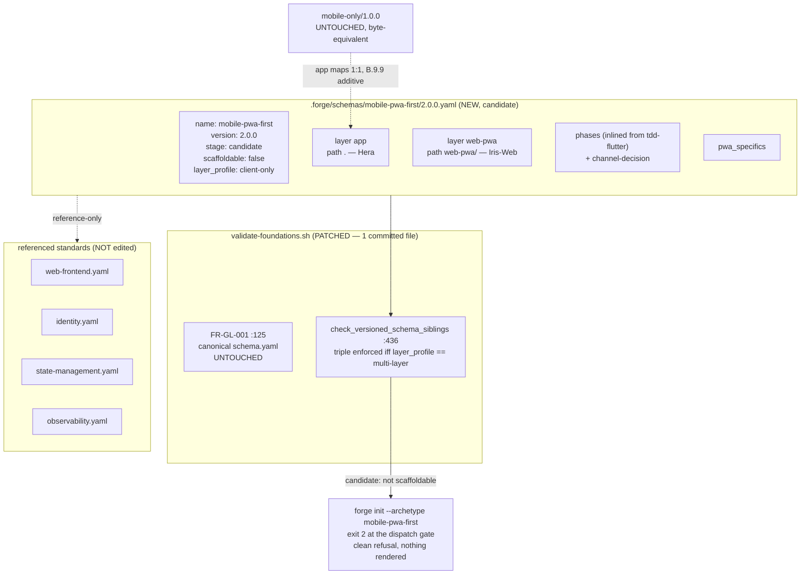

# Design: b9-1-schema

<!-- Status: designed -->
<!-- Schema: default -->
<!-- Audit: B.9.1 (docs/new-archetypes-plan.md §5.2) -->

**Namespace** : `ADR-B9-1-*`. **Constitution** : v2.0.0, no amendment.
**Agent routing** : Flutter surface → **Athena** (architecture) ; web-pwa surface →
**Iris-Web** (K.4) ; test strategy → per the b6-1/b7-1 harness convention.
**Context7** : not invoked — this change resolves **no external library version**.
Every component is declared by reference to its owning standard, and verify-then-pin
happens at B.9.2's `/forge:implement`, never here (Article III.4 ; T5.3.2 lesson).

---

## Architecture Decisions

### ADR-B9-1-001 — `layer_profile` discriminator; the required triple applies to `multi-layer` only

**Context.** `check_versioned_schema_siblings`
(`.forge/scripts/validate-foundations.sh:436-438`) hard-requires
`layers ⊇ {backend, frontend, infra}` for every versioned archetype schema.
`mobile-pwa-first` is client-only — its predecessor is described verbatim as *"No
backend, no infrastructure, no BaaS"*. Two of the three required ids would be
fiction, which FR-B9-1-012 forbids.

**Decision (maintainer-ratified 2026-07-27, Q-001).** Introduce an explicit
`layer_profile:` field on versioned archetype schemas:

- `multi-layer` — **the default when the field is absent**. Enforces the existing
  `{backend, frontend, infra}` requirement, unchanged.
- `client-only` — enforces `layers` non-empty and the full per-layer contract
  (`id` / `path` / `fr_id_prefix` / `primary_agent`), but not the triple.

Rejected: **(a) stub `backend`+`infra` layers** — violates FR-B9-1-012 and leaks two
dead layer ids into every downstream B.9 brick; **(c) stay out of the versioned
family** — forfeits `selectScaffoldableVersion` routing, which B.9.8 (snapshot) and
B.9.11 (promotion flip) depend on.

**Patch shape** (`validate-foundations.sh`, inside the versioned-sibling Python heredoc,
replacing lines 436-438):

```python
layer_ids = {l.get('id') for l in layers if isinstance(l, dict)}
# B.9.1 (ADR-B9-1-001) — the required-triple invariant is multi-layer-only.
# `layer_profile` defaults to 'multi-layer', so every schema authored before
# B.9.1 keeps its exact prior meaning with NO edit (NFR/FR-B9-1-014).
layer_profile = data.get('layer_profile', 'multi-layer')
if layer_profile not in ('multi-layer', 'client-only'):
    print(f"KO: layer_profile must be one of multi-layer/client-only (got {layer_profile!r})"); sys.exit(0)
if layer_profile == 'multi-layer':
    required = {'backend', 'frontend', 'infra'}
    if not required.issubset(layer_ids):
        print(f"KO: layers must include backend, frontend, infra (missing: {sorted(required - layer_ids)})"); sys.exit(0)
```

The per-layer field loop (`:439-445`) is **unchanged** and keeps applying to both
profiles. The OK line gains `profile={layer_profile}`.

**Consequences / blast radius** — established live, and narrower than the proposal
feared, because the script holds **two independent layer checks**:

| Site | Scope | Message | Impact |
|------|-------|---------|--------|
| `:125` — `FR-GL-001` | canonical `schema.yaml` (legacy family) | `layers must include at least backend, frontend, infra` | **Untouched.** `mobile-pwa-first/2.0.0.yaml` is a versioned file. `foundations.test.sh:140` stays green with no edit. |
| `:436-438` — `check_versioned_schema_siblings` | `X.Y.Z.yaml` siblings | `layers must include backend, frontend, infra` | **The only site patched.** No harness asserts this literal string (searched across all 76 suites). |

- `b6-1` / `b7-1` / `b8-3` `.test.sh` mention the triple only in **T-008 header
  comments** and assert it against their own 3-layer schemas ⇒ unaffected.
- `b6-8` / `b7-7` / `c1` `.test.sh` run **independent** Python layer checks on example
  projects, not the validator ⇒ unaffected.
- `b8-3b.test.sh` (12 L1) exercises this function and MUST be re-run.
  `_test_b83b_l1_004_versioned_pass_line` greps with `grep -qF` for the **prefix**
  `PASS: FR-GL-001-versioned:full-stack-monorepo/2.0.0.yaml`, so appending
  `profile=` to the OK-line tail is provably safe.
- **Mirror sync — CORRECTED at implementation (2026-07-27).** The design-phase claim
  of *"7 copies move in lock-step"* was **wrong**, and T-023 caught it before any file
  was synced. Ground truth:
  - **1 committed file** actually changes: `.forge/scripts/validate-foundations.sh`
    (492 lines).
  - `cli/assets/.forge/scripts/validate-foundations.sh` is **gitignored**
    (`cli/.gitignore:3 → assets/`) — a pure `npm run bundle` output, absent from a
    fresh checkout. It is regenerated, never hand-synced. T-023 therefore asserts its
    consistency **only when it exists**, otherwise CI would fail on a clean checkout.
  - The **5 copies** under `examples/` and `cli/assets/examples/` are **396-line
    scaffolded artefacts** frozen at the B.1 baseline. They **do not contain
    `check_versioned_schema_siblings` at all** (it was added later by B.8.3.b), so
    they are not mirrors and MUST NOT be synced — pushing framework-internal logic
    into example projects would corrupt them. T-023 asserts the inverse: that the
    function has **not** leaked into any of them.

**Constitution Compliance**: Article IV (delta-based) — the default preserves every
existing schema's meaning, so this is additive in effect. Article III.4 — the schema
declares only layers that really scaffold.

### ADR-B9-1-002 — `candidate` + `scaffoldable: false`; promotion at B.9.11

**Context.** B.8.3.b enforces `candidate ⇒ scaffoldable: false`. B.6 and B.7 both put
the flip in their harness brick.

**Decision.** Ship `stage: candidate`, `scaffoldable: false`. The
candidate→stable/scaffoldable flip belongs to **B.9.11** (harness), and **B.9.8**
(snapshot tarball) runs **before** it — the snapshot is an input to the promotion
gate, exactly as in B.6.7/B.7.6. Resolves Q-002.

**Consequences.** `forge init --archetype mobile-pwa-first` refuses at **exit 2**.
`init.ts:210-217` gates on the dispatch table and returns before the B.8.14 block at
`init.ts:219-240` is ever entered — that block is the exit-3 path **this ADR is about**
(it decides via `resolveScaffolder` (`init-archetype.ts:128`) →
`selectScaffoldableVersion` (`schema-version.ts:68`)), not the only one in the flow:
`init.ts:206` (invalid reverse domain, which fires *before* the dispatch gate) and
`init-archetype.ts:170` (forbidden-archetype refusal) also exit 3 for unrelated
reasons. T.4 registered `mobile-pwa-first` only as the `target:` of
the `mobile-only` alias, not as a key of its own, so the dispatch lookup misses. It
becomes exit 3 once a brick adds that key — the `b7-2a-dispatch-register` precedent,
created because B.7.1's independent review found this exact defect.
B.9.2…B.9.10 all land while the archetype stays unscaffoldable.
Every sibling brick that asserts `candidate` will need updating at the flip — the
`b7-6` cascade lesson applies verbatim.

**Constitution Compliance**: Article IV — no adopter-visible behaviour changes.

### ADR-B9-1-003 — `channel-decision` is a distinct phase, placed before `features`

**Context.** ARCH §6.3 prescribes PWA for Web|Android and a native iOS fallback when
push is critical. FR-B9-1-022 requires the schema to carry this gate.

**Decision.** Add **one** archetype-specific phase, `channel-decision`, **between
`specs` and `features`** — not a constraint bolted onto `design`.

**Rationale.** BDD scenarios differ by channel (a PWA install-prompt scenario has
nothing in common with a native push-permission scenario), so the channel must be
fixed *before* `features` authors them. Placing it at `design` would make the
`features` phase guess. Precedent: B.6.1 added two archetype-specific phases
(`event-design`, `saga-orchestration`) on the same reasoning. Resolves Q-003.

**Consequences.** Every change in this archetype records a channel — appropriate for
an archetype literally named *pwa-first*. The prose decision tree stays **B.9.4's**
deliverable in `docs/ARCHETYPES.md`; this phase only forces the choice to be recorded.

**Constitution Compliance**: Article II (BDD) — strengthens it; scenarios can no
longer be written against an undecided surface.

### ADR-B9-1-004 — layers `app` + `web-pwa`; `mobile-only`'s `app` maps 1:1

**Context.** Two real surfaces; FR-B9-1-042 requires the forward mapping to be
recorded for B.9.9.

**Decision.**

| id | path | `fr_id_prefix` | `primary_agent` | Origin |
|----|------|----------------|-----------------|--------|
| `app` | `.` | `FR-APP-` | `Hera` | inherited verbatim from `mobile-only` |
| `web-pwa` | `web-pwa/` | `FR-PWA-` | `Iris-Web` | new in B.9.2 |

**Forward mapping.** `mobile-only`'s single `- id: app / path: .` maps **1:1** onto
`app`, with identical id and path. Consequence for **B.9.9**
(`bin/forge-migrate-mobile-pwa.sh`): the migration is **purely additive** — it creates
`web-pwa/` and rewrites nothing in the native tree. This is exactly the property plan
§5.2 asks of B.9.9 (*"ajoute `web-pwa/` sans toucher au natif existant"*), and it is a
consequence of this ADR rather than a coincidence. Resolves Q-004.

**Consequences.** `Iris-Web` is named as an owner without any agent file being touched
(K.4 declared itself forward-stable for this archetype). Keeping `app` at path `.`
means the Flutter project stays at the repo root, so `mobile-only` adopters see no
path churn.

**Constitution Compliance**: Article VI — `app` remains a `flutter_bloc` clean-arch
surface; NSMA enforcement (B.8.11) already covers it.

### ADR-B9-1-005 — components reference-only; SW / Web Push / VAPID deferred to B.9.2

**Context.** `web-frontend.yaml` v1.0.0 (B.8.9) governs the Qwik City surface but is
silent on Service Workers, Web Push/VAPID, `manifest.json` and the offline shell.

**Decision.** Declare components **by reference**, zero inline pins:

| Component | Owning standard |
|-----------|-----------------|
| qwik-city (web-pwa) | `web-frontend.yaml` |
| oidc (both surfaces) | `identity.yaml` |
| state-management | `state-management.yaml` |
| observability | `observability.yaml` |
| service-worker / web-push (VAPID) / offline-shell / manifest | **none yet** → `delivered_by: B.9.2` |

No standard is invented here, and `web-frontend.yaml` is **not** edited — folding PWA
concerns into it is B.9.2's call, made with live evidence. Resolves Q-005.

**Constitution Compliance**: Article III.4 — no fabricated standard name, no pin
resolved upstream of implement.

---

## Component Design



## Data Flow — validation on landing

```mermaid
sequenceDiagram
  participant Dev
  participant VF as validate-foundations.sh
  participant PY as versioned-sibling check
  participant CLI as forge init

  Dev->>VF: bash validate-foundations.sh
  VF->>PY: glob .forge/schemas/*/[0-9]*.[0-9]*.[0-9]*.yaml
  PY->>PY: name == dirname? version == filename stem?
  PY->>PY: layer_profile (absent -> multi-layer)
  alt multi-layer (fsm 2.0.0, ai-native-rag, event-driven-eu)
    PY->>PY: require {backend, frontend, infra}
  else client-only (mobile-pwa-first 2.0.0)
    PY->>PY: skip triple; keep per-layer contract
  end
  PY->>PY: candidate => scaffoldable false? phases non-empty?
  PY-->>VF: OK: versioned schema 2.0.0 stage=candidate profile=client-only layers=['app','web-pwa']
  Dev->>CLI: forge init --archetype mobile-pwa-first
  CLI->>CLI: dispatch-table lookup (init.ts:210-217) -> no 'mobile-pwa-first' key
  CLI-->>Dev: exit 2 — clean refusal, nothing rendered (never reaches selectScaffoldableVersion)
```

## Testing Strategy

`.forge/scripts/tests/b9-1.test.sh` — **23 L1 + 1 L2 opt-in**. L1 is static +
validator-level, hermetic, no Docker/network. T-024 was moved to **L2**
(`FORGE_B9_1_LIVE=1`, skip-pass otherwise) at implementation: asserting the `forge init`
exit code genuinely requires a built+bundled CLI (`cli/dist/index.js`), which L1 must
not depend on. Same split as `b6-1` / `b7-1`.

| Test | Asserts | FR |
|------|---------|-----|
| T-001 | file exists at `.forge/schemas/mobile-pwa-first/2.0.0.yaml` | FR-B9-1-002 |
| T-002 | scaffold-schema key set present; `archetype:`/`schema_version:` **absent** | FR-B9-1-001 |
| T-003 | `name`/`version`/`stage: candidate` | FR-B9-1-002 |
| T-004 | `scaffoldable: false` | FR-B9-1-003 |
| T-005 | `tdd_enforced` / `bdd_required_for_user_facing` / `coverage_threshold: 80` | FR-B9-1-004 |
| T-006 | candidate header block present | FR-B9-1-005 |
| T-007 | `golden_tests_required` carried forward | FR-B9-1-006 |
| T-008 | layers == `{app, web-pwa}`, each with the 4 required fields | FR-B9-1-010 |
| T-009 | `app`→Hera, `web-pwa`→Iris-Web | FR-B9-1-011 |
| T-010 | **negative** — no layer id whose path is absent from the B.9.2 tree contract | FR-B9-1-012 |
| T-011 | `validate-foundations.sh` exits PASS, no new KO | FR-B9-1-013 |
| T-012 | **backward-compat** — a synthetic 3-layer fixture with no `layer_profile` still PASSes (the 3 real schemas are covered by T-011 + task T2.4) | FR-B9-1-014 |
| T-013 | **negative** — a `multi-layer` (or field-absent) schema missing `infra` still KOs | FR-B9-1-014 |
| T-014 | **negative** — unknown `layer_profile` value KOs | ADR-B9-1-001 |
| T-015 | phases inlined; no `extends:` key | FR-B9-1-020 |
| T-016 | full tdd-flutter chain preserved, `features` before `design` | FR-B9-1-021 |
| T-017 | `channel-decision` present between `specs` and `features` | FR-B9-1-022 |
| T-018 | `pwa_specifics` block present | FR-B9-1-023 |
| T-019 | zero inline pin in `components[]` — no forbidden key, no `\d+\.\d+` scalar value, all `standard:` refs resolve | FR-B9-1-030, NFR-B9-1-005 |
| T-020 | SW/push/offline referenced as `delivered_by: B.9.2`, no invented standard | FR-B9-1-031 |
| T-021 | `mobile-only` schema + wrapper + template tree still present and still declaring `archetype: mobile-only` (presence check, not byte-identity — byte-identity is covered by `git diff`, task T5.4) | FR-B9-1-040 |
| T-022 | `dispatch-table.yml` unchanged | FR-B9-1-041 |
| T-023 | bundled `cli/assets` copy matches canonical **when present**; the 5 example artefacts stay free of the versioned-schema function | ADR-B9-1-001 |
| T-L2-001 | (L2, opt-in) `forge init --archetype mobile-pwa-first` exits **2** and renders nothing | NFR-B9-1-002 |
| — | **FR-B9-1-032 has no dedicated test, by decision.** "MUST NOT restate or relax Article VI.3" is a negative-prose property; any grep for it would fail on the legitimate references the schema is *supposed* to carry — the brittle-assertion anti-pattern. The substantive risk (a non-`flutter_bloc` state library entering `components[]`) is covered twice over: T-019 walks every component value, and the NSMA linter has been repo-wide CI-blocking since B.8.11 (`constitution-linter.sh:716`). Recorded rather than left silent. | FR-B9-1-032 |

**Sibling harnesses to re-run before archive**: `b8-3b.test.sh` (12 L1 — owns this
validator), `foundations.test.sh` (owns the canonical `FR-GL-001` check),
`b6-1` / `b7-1` / `b8-3` (own the other versioned schemas), plus `verify.sh` and
`constitution-linter.sh`.

**BDD**: none. This change produces no user-facing behaviour — Article II's trigger
(`bdd_required_for_user_facing`) is not met. The archetype's own BDD obligation is
carried *by the schema* for downstream changes, and B.9.2 is the first brick that
must satisfy it.

## Standards Applied

- `global/open-questions.md` — Q-001…Q-005 tracked; Q-001 resolved with a recorded
  decision + rationale before design closed.
- `global/standards-lifecycle.md` — no standard created, edited or version-bumped, so
  no `REVIEW.md` ledger entry is due.
- `web-frontend.yaml`, `identity.yaml`, `state-management.yaml`, `observability.yaml` —
  consumed **by reference only**.
- `global/scaffolding.md` — the wrapper ABI is untouched; B.9.2 owns registration.

## Constitutional Compliance Gate

| Article | Verdict |
|---------|---------|
| I (TDD) | ✅ `b9-1.test.sh` is written before the schema file; RED→GREEN enforced at `/forge:implement`. |
| II (BDD) | ✅ Not triggered (no user-facing behaviour); ADR-B9-1-003 strengthens the downstream BDD gate. |
| III.1/III.2 (specs before code) | ✅ propose → specify → design complete; no production artefact written yet. |
| III.4 (anti-hallucination) | ✅ Every claim cited by path/line and re-read live. No pin resolved. Q-001 escalated to the maintainer rather than guessed. |
| IV (delta-based) | ✅ Additive: the new schema file, plus a validator patch whose default preserves all prior meaning. |
| VI (Flutter architecture) | ✅ `flutter_bloc` exclusivity consumed as-is; NSMA already CI-blocking since B.8.11. |
| VII (Rust) / VIII (Infra) | ✅ Not applicable — client-only archetype. |
| IX (observability) | ✅ Referenced via `observability.yaml`; wiring is B.9.2's. |
| X.1 (coverage) | ✅ `coverage_threshold: 80` not relaxed. |
| XII (governance) | ✅ No constitution amendment. |

**No BLOCK.** Design complete.
