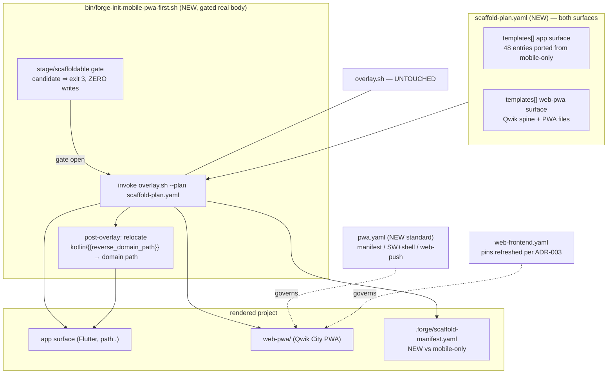
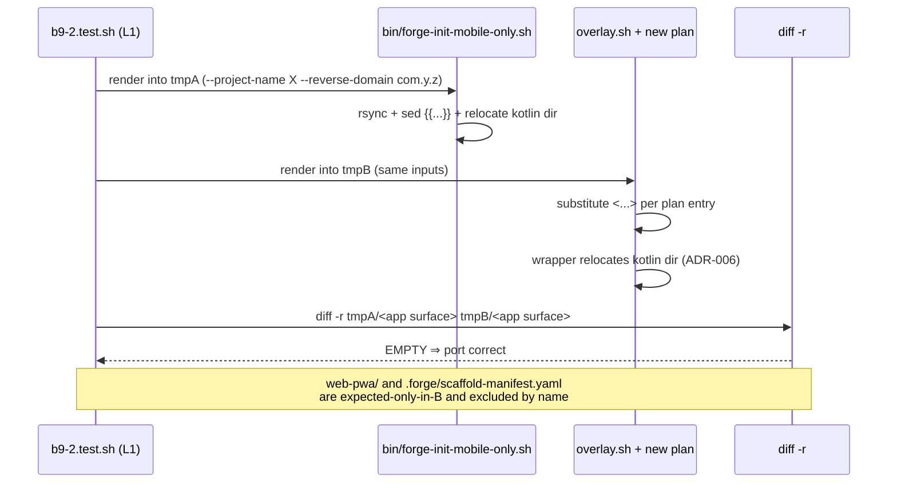

# Design: b9-2-web-pwa

<!-- Status: designed -->
<!-- Schema: default -->
<!-- Audit: B.9.2 (docs/new-archetypes-plan.md §5.2) -->

**Namespace** : `ADR-B9-2-*`. **Constitution** : v2.0.0, no amendment.
**Agent routing** : `app` surface → **Hera** / Athena ; `web-pwa` surface →
**Iris-Web** (K.4) ; cross-surface arbitration → Janus.
**Context7** : deliberately NOT invoked at design. Every dependency version is
resolved **live at `/forge:implement`** (FR-B9-2-014, verify-then-pin — the T5.3.2 /
b8-coroot lesson). No pin appears in this document.

---

## Architecture Decisions

### ADR-B9-2-001 — reuse the B.8.9 spine; the Connect exclusion is three edits, not one file

**Context.** FR-B9-2-010 excludes `src/lib/connect-client.ts` because this archetype
has no backend layer. The exclusion is not a simple omission: the file is wired in.

**Observed coupling.** `src/routes/index.tsx.tmpl:8` reads
`import { sayHello } from "../lib/connect-client";` and `package.json.tmpl:30-31`
declares `@connectrpc/connect` and `@connectrpc/connect-web`.

**Decision.** Port the build/config spine — `vite.config.ts`, `tsconfig.json`,
`qwik.env.d.ts`, `.nvmrc`, `src/root.tsx`, `src/entry.ssr.tsx` — verbatim in shape.
Then three targeted changes:

1. **Omit** `src/lib/connect-client.ts`.
2. **Rewrite** `src/routes/index.tsx` as a backend-free landing route that exercises
   the offline shell instead of an RPC round-trip.
3. **Prune** `@connectrpc/connect` and `@connectrpc/connect-web` from `package.json`,
   and re-point `name`/`description` off the `-web-public` convention.

Then **add** the PWA files that B.8.9 has no equivalent of: the web app manifest, the
Service Worker, the offline-shell route, and the push-subscription module.

**Consequences.** A reviewer diffing against `web-public/` will see three intentional
divergences; each is named here so none reads as an oversight. If a future brick gives
this archetype a backend, restoring the Connect client is additive.

**Constitution Compliance**: Article III.4 — the archetype declares no component it
does not have.

### ADR-B9-2-002 — full `scaffold-plan.yaml` covering both surfaces

**DECIDED 2026-07-28 by the maintainer (Q-002).** Port all 48 `mobile-only` template
files forward and express both surfaces in one plan rendered by `overlay.sh`.

**Deciding evidence.** The bespoke wrapper emits no `scaffold-manifest.yaml`;
`overlay.sh` does, and 8 harnesses key off it (`a7`, `b8-10`, `b8-12`, `b8-15`,
`b6-8`, `b7-7`, `c1`, `scaffolder`). B.9.9 is a migration script and B.9.11 a
promotion gate: rendering through the bespoke path would inherit `mobile-only`'s
exclusion from all of it.

**Consequences.** Bigger brick, and the port is only correct if FR-B9-2-004's
byte-equivalence diff is empty. `mobile-only` is copied forward, never moved.

### ADR-B9-2-003 — pins verified live at implement; the ledger records match *or* drift

**Context.** `web-frontend.yaml` v1.0.0 declares `pin_review_cadence` of `P30D` for
`qwik` / `qwik_city` / `vite` with `last_reviewed: 2026-06-03` — lapsed. The standard
is not EXPIRED (`expires_at: 2027-06-03`), so nothing is blocked, but its pins cannot
be treated as a trustworthy source.

**Decision.** Resolve every version **live at `/forge:implement`**, never at design.
Then:

- **Live versions differ from the recorded pins** → bump `web-frontend.yaml`'s
  `versions:` and its `version:` per SemVer, refresh `last_reviewed`, and append a
  `REVIEW.md` entry describing the drift.
- **Live versions match** → refresh `last_reviewed` only, no version bump, and still
  append a `REVIEW.md` entry saying the pins were re-verified and held.

Either way the ledger states which happened. **Specifically re-check** whether Qwik's
peer range still excludes Vite 8 — `vite: "7.3.5"` is an exact pin justified solely by
that exclusion, so if the range moved, the pin's justification is gone.

**Constitution Compliance**: Article III.4 + `global/standards-lifecycle.md`.

### ADR-B9-2-004 — a new role-named `pwa.yaml`, NOT a section inside `web-frontend.yaml`

**This reverses the lean recorded in the proposal.** The lean was "extend
`web-frontend.yaml`"; reading the file changed the answer.

**Context.** `web-frontend.yaml` is a **framework-selection** standard: its payload is
`default: qwik-city`, `alternatives:`, `forbidden: []`, plus the `versions:` /
`pin_review_cadence:` for the chosen framework. Its own header states it is role-named
so it "survives a Qwik→SvelteKit pivot without rename".

**Decision.** Create `.forge/standards/pwa.yaml`, role-named, governing installability
(manifest), offline behaviour (Service Worker + shell) and push delivery (Web Push /
VAPID).

**Rationale.** PWA capability is **orthogonal to framework choice** — the same
obligations apply under SvelteKit. Folding them into a framework-selection standard
would give that file two responsibilities and would make a SvelteKit adopter read
Qwik-titled prose for rules that are not Qwik's. A separate role-named manifest matches
the existing `gateway.yaml` / `identity.yaml` / `persistence.yaml` / `web-frontend.yaml`
family, and `web-frontend.yaml` stays untouched apart from ADR-B9-2-003's pin refresh.

**Consequences.** One more standard to keep fresh; it needs the 8-field frontmatter
contract, an `index.yml` entry and a `REVIEW.md` birth entry. It resolves B.9.1's four
`delivered_by: B.9.2` forward-pointers, which should now name `pwa.yaml`.

### ADR-B9-2-005 — Web Push: client-side subscription only

**Decision.** Scaffold service-worker push handling and the client subscription call.
Do **not** scaffold a push server, a VAPID key generator, or key storage. Document
VAPID provenance as an adopter responsibility in the `web-pwa` README and in
`pwa.yaml`.

**Rationale.** A push server is a backend, and `layer_profile: client-only` is the
archetype's defining constraint (ADR-B9-1-001). Scaffolding one would recreate at the
template level the fiction B.9.1 refused at the schema level — the same error shape as
copying `connect-client.ts`.

**Consequences.** A scaffolded project can receive push only once the adopter supplies
a sender. That is the honest state and the README must say so plainly.

### ADR-B9-2-006 — the Kotlin relocation stays in the wrapper; byte-equivalence forces it

**Context.** `android/app/src/main/kotlin/{{reverse_domain_path}}/` is a literal
directory holding exactly two files — `MainActivity.kt.tmpl` and
`PlayIntegrityService.kt.tmpl`. `overlay.sh` substitutes **only in file contents**
(`:187-189`); `tgt_rel = entry['target']` is used literally, so a plan `target` cannot
be domain-derived. The alternative floated in specs.md was to restructure the template
onto a fixed directory (legal in Kotlin, where package need not match path) and let the
`package` declaration alone carry the domain.

**Decision.** Keep the relocation **in the wrapper**, post-overlay, reproducing
`bin/forge-init-mobile-only.sh:136-146`. Reject the restructuring.

**Rationale — the decision is forced, not preferred.** FR-B9-2-004 requires the ported
`app` surface to be **byte-identical** to the bespoke render. Restructuring changes the
directory layout, so the equivalence diff could never be empty. The two requirements
are incompatible and byte-equivalence is the one protecting existing adopters. The
restructuring idea is recorded as viable-but-out-of-scope: it belongs to a later brick
that can also re-baseline the expected output, if anyone judges it worth it.

**Consequences.** `overlay.sh` is untouched (NFR-B9-2-001). The wrapper carries ~10
lines of archetype-specific post-work, which is exactly what the ADR-B7-2-007 gated
real body pattern allows.

---

## Component Design

## Data Flow — the byte-equivalence gate (FR-B9-2-004)

## Testing Strategy

`.forge/scripts/tests/b9-2.test.sh` — L1 hermetic (bash + rsync + python3 only; no
network, no npm), L2 opt-in for anything needing a Node toolchain.

| Test | Asserts | FR |
|------|---------|-----|
| T-001 | `scaffold-plan.yaml` exists, has `archetype`/`version`/`templates[]` | FR-B9-2-005 |
| T-002 | every `templates[].source` resolves to a real file | FR-B9-2-005 |
| T-003 | all 48 mobile-only files are represented in the plan | FR-B9-2-001 |
| T-004 | `mobile-only` tree, wrapper and dispatch entry byte-unchanged | NFR-B9-2-002 |
| T-005 | **zero `{{…}}` tokens** remain in any ported file | FR-B9-2-002 |
| T-006 | ported contents use `<project-name>` / `<reverse-domain>` only | FR-B9-2-002 |
| T-007 | **byte-equivalence** — `diff -r` of the two renders is empty | **FR-B9-2-004** |
| T-008 | render emits `.forge/scaffold-manifest.yaml` with version + SHAs | FR-B9-2-006 |
| T-009 | Kotlin dir relocated; no literal `{{reverse_domain_path}}` dir survives | FR-B9-2-003 |
| T-010 | `overlay.sh` byte-unchanged vs HEAD | NFR-B9-2-001 |
| T-011 | wrapper refuses exit 3 while candidate, **zero filesystem writes** | FR-B9-2-007 |
| T-012 | `web-pwa/` has the spine files; **no `connect-client.ts`** | FR-B9-2-010, ADR-001 |
| T-013 | **negative** — no `@connectrpc/*` in the web-pwa `package.json` | ADR-B9-2-001 |
| T-014 | **negative** — no `import … from "../lib/connect-client"` anywhere | ADR-B9-2-001 |
| T-015 | manifest declares name/short_name/start_url/display + ≥1 icon | FR-B9-2-011 |
| T-016 | Service Worker present and registered; offline-shell route exists | FR-B9-2-012 |
| T-017 | push subscription client-side present; **no push server / VAPID keygen** | FR-B9-2-013, ADR-005 |
| T-018 | zero resolved pin in the plan or the standard (no `\d+\.\d+` literal) | FR-B9-2-014 |
| T-019 | `pwa.yaml` exists with the 8-field frontmatter + `index.yml` entry | FR-B9-2-030/031 |
| T-020 | B.9.1's four `delivered_by: B.9.2` pointers now name `pwa.yaml` | FR-B9-2-030 |
| T-021 | `dispatch-table.yml` has a `mobile-pwa-first:` key; `mobile-only:` alias metadata intact | FR-B9-2-020 |
| T-022 | schema still `candidate` / `scaffoldable: false` | FR-B9-2-023 |
| T-L2-001 | (opt-in) `forge init --archetype mobile-pwa-first` exits **3**, renders nothing | FR-B9-2-021 |
| T-L2-002 | (opt-in) `npm install && tsc --noEmit` in a rendered `web-pwa/` | FR-B9-2-014 |

**Coupled sibling edit — `b9-1.test.sh`.** T-022 (key absent → key present) and
T-L2-001 (exit 2 → exit 3) MUST both flip in this change (FR-B9-2-022). B.9.1 recorded
the coupling; `b9-1.test.sh` must be GREEN before this brick is archivable.

**BDD.** The three scenarios in specs.md are user-facing (offline usability,
installability, clean refusal). The first two are exercised by T-016/T-015 statically
and belong to an L2 browser leg only when a later brick ships one; the third is
T-L2-001. Recorded so the gap is explicit rather than silent.

## Standards Applied

- **`pwa.yaml`** — created here (ADR-B9-2-004); 8-field frontmatter, `index.yml`
  registration, `REVIEW.md` birth entry.
- **`web-frontend.yaml`** — consumed; `last_reviewed` refreshed and possibly bumped
  per ADR-B9-2-003, with a `REVIEW.md` entry either way.
- **`global/scaffolding.md`** — the wrapper ABI this brick's wrapper must satisfy.
- **`global/standards-lifecycle.md`** — governs both ledger entries above.
- **`state-management.yaml`** — consumed unchanged; Article VI.3 is Flutter-scoped and
  is not extended to `web-pwa` (FR-B9-2-015, the B.9.1 F7 correction).

## Constitutional Compliance Gate

| Article | Verdict |
|---------|---------|
| I (TDD) | ✅ `b9-2.test.sh` authored first; T-007 must be RED before the port exists. |
| II (BDD) | ✅ Three scenarios specified; the browser-level legs are explicitly deferred with the gap recorded, not hidden. |
| III.1/III.2 | ✅ propose → specify → design complete before any template is written. |
| III.4 | ✅ No pin in this document. The Connect coupling, the placeholder delta, the `post_steps` non-support and the relocation constraint were all read from source and cited. ADR-004 reverses its own proposal lean on evidence. |
| IV (delta-based) | ✅ Additive: `mobile-only` copied forward, never moved; `overlay.sh` untouched. |
| VI (Flutter) | ✅ `app` surface ported byte-identically; no architecture change. |
| VII / VIII | ✅ Not applicable — client-only archetype, no backend or infra. |
| IX | ✅ `observability.yaml` referenced by the schema; wiring is not this brick's. |
| X.1 | ✅ Coverage threshold unchanged at 80. |
| XII | ✅ No amendment. |

**No BLOCK.** Design complete.
