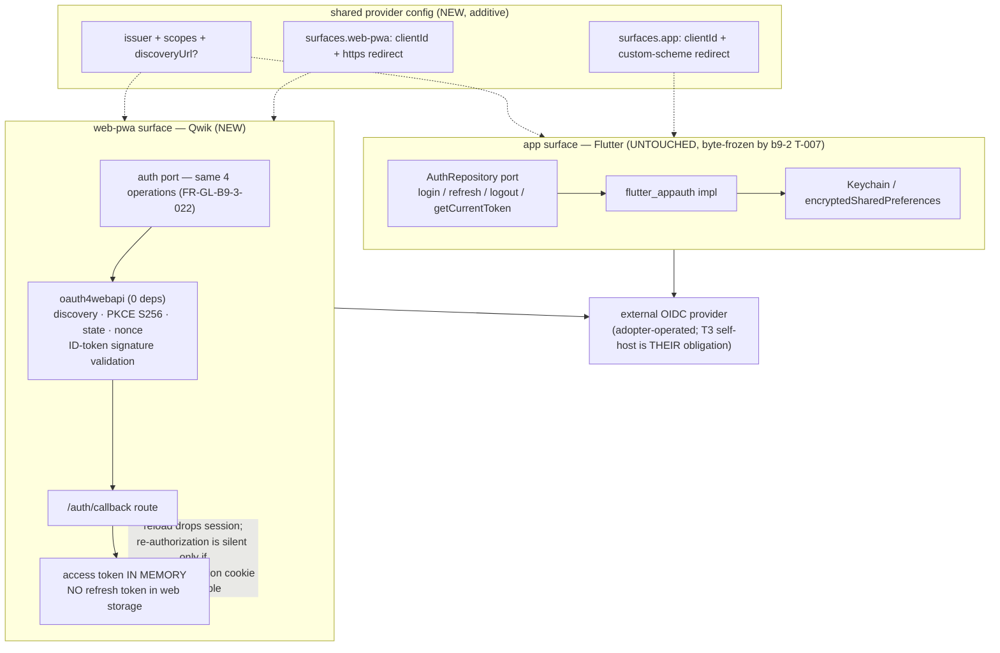

# Design: b9-3-shared-oidc

<!-- Status: designed -->
<!-- Schema: default -->
<!-- Audit: B.9.3 (docs/new-archetypes-plan.md §5.2, as corrected by cf822fb) -->

**Namespace** : `ADR-B9-3-*`. **Constitution** : v2.0.0, no amendment.
**Agent routing** : `web-pwa` → **Iris-Web** ; `app` → **Hera** (untouched here) ;
cross-layer arbitration → **Janus**.
**Context7** : invoked for `oauth4webapi` (`/panva/oauth4webapi`) — the one external
library this brick considers. Version pinning is still deferred to
`/forge:implement` (NFR-B9-3-002); the version observed at design is recorded below
as evidence, not as a pin.

---

## Architecture Decisions

### ADR-B9-3-001 / ADR-B9-3-003 — use `oauth4webapi`; this REVERSES the "hand-rolled" lean

**Context.** The corrected plan calls for a browser OIDC client. The proposal leaned
*dependency-free*, reasoning that B.9.2 established this surface as dependency-lean
and the archetype already hand-rolls base64url for VAPID. Surveying the actual
landscape reversed that.

**Live survey (npm, 2026-07-29):**

| Candidate | Version | Dependencies | Verdict |
|-----------|---------|--------------|---------|
| **`oauth4webapi`** | **3.8.6** | **none** | **Chosen** |
| `oidc-client-ts` | 3.5.0 | `jwt-decode` | Rejected — see the corrected note below. A **higher-level** session manager where this brick needs protocol primitives, and it carries a dependency where the chosen one carries none |
| `openid-client` | 6.8.4 | `jose`, `oauth4webapi` | Rejected — a layer *on top of* the chosen library; adds surface without adding capability here |
| `@auth/qwik` | 0.9.3 | `@auth/core`, `set-cookie-parser` | Rejected — **server-side session framework**. Evidence from the source, not inferred from the dependency list (review): it reads `AUTH_SECRET` from the environment, uses `onRequest` / `globalAction$` / `routeLoader$` / `RequestEvent`, and moves `set-cookie` headers between request and response; install tree is 7 packages including `preact`. A public client in a `layer_profile: client-only` archetype has no server to hold that secret |
| hand-rolled | — | — | Rejected — see below |

**Decision.** Build on **`oauth4webapi`**, zero-dependency, WebCrypto-based.

**Correction to an earlier draft of this table (self-caught before review).** The
first draft rejected `oidc-client-ts` because it *"manages its own storage
(sessionStorage/localStorage by default), fighting FR-B9-3-030"*. Checked against the
vendor docs (Context7 `/authts/oidc-client-ts`) rather than from memory, that is
**not a fair rejection**: `WebStorageStateStore` does default to `sessionStorage`
(falling back to `localStorage`), but the store is **injectable via the constructor**
and the library ships an **`InMemoryWebStorage`** class for exactly this purpose. It
does not fight FR-B9-3-030; it can satisfy it.

The rejection stands on the honest grounds instead: `oidc-client-ts` is a
**higher-level session manager** (user store, silent renew, session monitoring) where
this brick needs protocol primitives it can hold at arm's length, and it adds a
transitive dependency where `oauth4webapi` adds none. Preferring the lower-level
library is a judgement call about surface area, not a compatibility verdict — and
saying so is the difference between an argument and a rationalisation.

**Why the hand-rolled lean was wrong.** A *correct* OIDC client does not stop at
generating a verifier and swapping a code. It must **validate the ID token** —
fetch JWKS, select the key, verify the JWS signature — and validate `iss`, `aud`,
`exp` and the `nonce`. That is precisely the class of code that should not be
hand-written: the failure mode is silent acceptance of a forged token, which no
scaffold test would catch — and, until review finding B1, no test in this brick did
(→ FR-B9-3-009). `oauth4webapi`'s SECURITY.md lists its security guarantees as a
bulleted set covering state parameter validation, PKCE, nonce validation, issuer
identification and validation, token signature verification and JWT claims validation.
*Paraphrased, not quoted* (review N5 — an earlier draft rendered the bullets as an
inline quotation, implying wording that is not in the source), and note the file lives
in the **repository**, not the npm tarball, which ships only `LICENSE.md`,
`README.md` and `package.json`:
<https://github.com/panva/oauth4webapi/blob/main/SECURITY.md>. Context7 confirms the
primitives this brick needs: `discoveryRequest` (OIDC + RFC 8414 algorithms),
`generateRandomCodeVerifier`, `calculatePKCECodeChallenge` (S256).

**Why it does not contradict B.9.2's dependency-leanness.** B.9.2 pruned
`@connectrpc/*` because they served a backend that does not exist — the objection was
*uselessness*, not dependency count. This dependency does work the archetype genuinely
needs and cannot safely do itself, and it carries **zero transitive dependencies**, so
the installed tree grows by exactly one package.

**Consequences.** `web-pwa/package.json` gains one runtime dependency —
`NFR-B9-3-002`'s first branch (unchanged `dependencies`) does **not** apply, so its
second branch does: verify-then-pin LIVE at implement, with evidence. It is
storage-agnostic, which is what keeps ADR-B9-3-005 achievable.

**Constitution Compliance**: Article III.4 — chosen on live evidence and vendor
documentation, with the rejected candidates and their reasons recorded.

### ADR-B9-3-002 — one issuer, two client registrations

**Context.** FR-GL-B9-3-020/021: the surfaces share a provider, not a client entry.

**Decision.** A single configuration artefact declares `issuer`, `scopes` and the
optional `discoveryUrl` **once**, and a `surfaces` map carries `clientId` +
`redirectUri` per surface:

```
issuer, scopes, discoveryUrl?          # shared — one source of truth
surfaces:
  app:      clientId, redirectUri      # <reverse-domain>://callback
  web-pwa:  clientId, redirectUri      # https://…/auth/callback
```

**Rationale.** A native custom-scheme redirect and a browser HTTPS redirect are
normally two client entries at the provider. Modelling one tuple would be wrong for
the common case and would push adopters into editing scaffolded code rather than
configuration.

**Consequences.** The Dart `OidcConfig` keeps its exact current field set — it is
byte-frozen by the B.9.2 equivalence gate (NFR-B9-3-001) and MUST NOT change. The
shared artefact is therefore **additive**: a new file the two surfaces read, not a
refactor of the existing Dart config. Whether the Dart side is rewired to consume it
is explicitly **out of scope** and left to a later brick — doing it here would break
T-007.

### ADR-B9-3-004 — the T3 gap is recorded in the scaffold; `identity.yaml` is NOT edited

**Context.** `identity.yaml` v1.1.0 declares `compliance_tier_aware: true` with
"T3 requires self-host" and pins Zitadel chart + images.
`mobile-pwa-first` is `layer_profile: client-only` — no infra layer, nothing to
self-host.

**Decision.** Record the gap in the `web-pwa` README and the shared-config artefact.
**Do not edit `identity.yaml`.**

**Rationale.** The standard is not wrong; it is correctly scoped to archetypes that
*can* deploy an identity provider. The gap is not a defect in the standard but a
property of this archetype, and the honest place to state "your provider must satisfy
this, we cannot" is where the adopter configures the provider. Editing a shared
standard to accommodate one archetype's shape would push archetype-specific
qualification into a file three other archetypes read — the same single-responsibility
argument that produced `pwa.yaml` in ADR-B9-2-004, applied in the opposite direction.

**Consequences.** A T3 adopter reads, at the point of configuration, that the T3
self-host obligation transfers to their separately-operated provider deployment.
Recorded rather than silently inherited.

### ADR-B9-3-005 — access token in memory; no refresh token in web storage; the cost is stated

**Context.** FR-B9-3-030 forbids `localStorage`/`sessionStorage` for the refresh
token. The native surface has Keychain `first_unlock_this_device` + Android
`encryptedSharedPreferences`; the browser has no equivalent.

**Decision.** The access token lives **in memory only**. No refresh token is persisted
to web storage. Session continuity across a reload is re-established by **running the
authorization request again** rather than by persisting a long-lived credential.

**CORRECTED at implementation (2026-08-03, review finding F2).** This ADR originally
said that continuity came from a *silent re-authorization* (`prompt=none`). It does
not: `beginAuthorization()` sends no `prompt` parameter and nothing restores a session
on boot, so what actually happens is an ordinary full redirect that a live provider
cookie usually satisfies without user interaction. The observable outcome is close
enough that the error survived design review, which is precisely why it is corrected
here rather than quietly reworded — this brick's whole stance is that a scaffold must
not claim a capability it does not implement. A true silent renewal (`prompt=none`
plus `login_required` handling) is left as a named, unbuilt option.

**The cost, stated rather than hidden.** In-memory means a page reload drops the
session. Re-running the authorization request recovers it without a visible prompt
*only* while the provider's own session cookie is present and reachable, which
third-party-cookie restrictions increasingly prevent depending on whether the provider
is same-site. So on some deployments a reload will
mean a visible redirect. That is a genuine UX regression against the native surface,
and the README must say so plainly, alongside what an adopter adds if they need
better — a BFF holding the refresh token server-side, which is a backend and therefore
outside this archetype.

**Rejected**: refresh token in `localStorage`. It is the easy path and it is the
third instance of the pattern this module has already refused twice — stub layers in
B.9.1, a push server in B.9.2 — where a scaffold claims a capability its architecture
does not support.

**A note on Qwik City SSR.** The surface ships `entry.ssr.tsx` and a `vite --mode ssr`
script, so Qwik City *can* render server-side, and a BFF would technically have
somewhere to live. This archetype does **not** commit to operating a server: the
design must work in the pure-static deployment, so no server-held secret is assumed
anywhere.

**Constitution Compliance**: Article X.2 — no secret scaffolded; a public client uses
none.

---

## Component Design



## Data Flow — sign-in on the web-pwa surface

```mermaid
sequenceDiagram
  participant U as User
  participant P as web-pwa (Qwik)
  participant O as oauth4webapi
  participant I as OIDC provider

  U->>P: start sign-in
  P->>O: discoveryRequest(issuer)
  O->>I: GET /.well-known/openid-configuration
  I-->>O: authorization / token / jwks endpoints
  P->>O: generateRandomCodeVerifier()
  P->>O: calculatePKCECodeChallenge(verifier)  [S256]
  P->>P: mint fresh state + nonce (CSPRNG)
  P->>I: redirect to authorization endpoint
  I-->>P: redirect to /auth/callback?code&state
  P->>P: state matches pending? NO -> reject, do NOT exchange
  P->>O: exchange code (+ verifier)
  O->>I: POST token endpoint
  I-->>O: access + id token (+ refresh if issued)
  O->>O: verify ID token signature (JWKS), iss, aud, exp, nonce
  O-->>P: validated token set
  P->>P: hold access token IN MEMORY; scrub code/state from the URL
  Note over P: refresh token NEVER written to web storage (ADR-B9-3-005)
```

## Testing Strategy

`.forge/scripts/tests/b9-3.test.sh` — L1 hermetic (no network, no npm, no provider);
the `tsc` typecheck of the rendered surface is L2 opt-in, as in B.9.2 where that leg
caught a real bug the static asserts could not see.

| Test | Asserts | FR |
|------|---------|-----|
| T-001 | the auth client module exists under `web-pwa/src/lib/` | FR-B9-3-001 |
| T-002 | `oauth4webapi` declared in `dependencies`, pinned, not a range on a major boundary | ADR-B9-3-001, NFR-B9-3-002 |
| T-003 | **negative** — no `@connectrpc/*` in `package.json` deps | **FR-B9-3-002** |
| T-004 | **negative** — no `connect-client` import anywhere in `web-pwa/` (reuses the b9-2 T-014 4-form matcher) | FR-B9-3-002 |
| T-005 | `code_challenge_method` is `S256`; no `plain` anywhere | FR-B9-3-001/003 |
| T-006 | **negative** — `Math.random` absent from the auth path **AND positive** — `crypto.getRandomValues` + `crypto.subtle.digest` are actually called. Review N3: absence of the wrong primitive does not establish presence of the right one, and FR-B9-3-003 requires the CSPRNG affirmatively | FR-B9-3-003 |
| T-007 | `state` and `nonce` are both generated and both sent | FR-B9-3-004 |
| T-008 | **negative, L2** — with a stubbed `fetch`, a mismatched `state` means the **token endpoint is never requested**. Moved to L2 after review N1: asserting source-text ORDER proves nothing about control flow (the comparison can sit in a branch that does not return; the exchange can be defined early and called late). A behavioural test is falsifiable; a text-order proxy is not. If an L1 signal is wanted alongside, it may assert only that an early `return`/`throw` exists between the comparison and the exchange — **explicitly labelled a proxy, not a proof** | FR-B9-3-004 |
| **T-009a-proxy** | **L1, EXPLICITLY A PROXY, NOT A PROOF.** `processAuthorizationCodeResponse` is imported and appears called in the callback module. **`validateAuthResponse` does NOT satisfy it** (`index.d.ts:2258` vs `:1833` — different stage, no ID-token validation). Kept only as a fast smoke signal: a static match proves a token exists in a file, never that the call is on the path the callback takes. It passes on a dead branch, an uncalled helper, or a computed-then-discarded result. **The proof is T-L2-002** | **FR-B9-3-009** (partial) |
| **T-009a-state** | the **state** half, split out from the above: `validateAuthResponse` receives the pending state **string** — not `skipStateCheck` (`:2231`) and not `expectNoState` (`:2237`), either of which satisfies "is invoked" while checking nothing | FR-B9-3-004 |
| **T-009b** | **negative** — the ID token is NOT hand-decoded: no bare `atob`/`JSON.parse` on a JWT segment, no `jwt-decode`-style split. **Comments stripped before matching** — the auth module and README will *explain* why hand-decoding is forbidden, and a naive matcher would trip on that prose. Third appearance of this trap in the module; specified out of existence before writing | **FR-B9-3-009** |
| **T-009c** | `expectedNonce` receives the minted nonce **string** — asserted as present and non-symbolic. It is optional with documented default `expectNoNonce` (`:1792`, `:1802`), so omitting it voids clause 5 **silently**: no nonce check, no error | **FR-B9-3-009**, FR-B9-3-004 |
| **T-009d** | `requireIdToken: true` is set (`:1813`). Unset, a provider returning no ID token resolves the call and nothing is validated | **FR-B9-3-009** |
| **T-L2-002** | **behavioural — THE proof of FR-B9-3-009.** One stubbed-`fetch` fixture, a table of token responses each differing in exactly one way. Tests the **property**, not the call path, so it cannot be satisfied by decoration and survives refactoring | **FR-B9-3-009** clauses 1–5 + `requireIdToken` |
| T-009 | a callback route exists under `src/routes/` | FR-B9-3-005 |
| T-010 | the URL is scrubbed of `code`/`state` after completion | FR-B9-3-005 |
| T-011 | discovery uses `<issuer>/.well-known/...` with a `discoveryUrl` override; no hard-coded provider endpoint | FR-B9-3-006 |
| T-012 | refresh + logout paths present; `end_session_endpoint` used when advertised | FR-B9-3-007 |
| T-013 | the TS expiry skew is **30 s**, matching `auth_token.dart:17` | FR-B9-3-008 |
| T-014 | the shared config declares `issuer`/`scopes` once | FR-GL-B9-3-020 |
| T-015 | it declares `clientId`+`redirectUri` **per surface** | FR-GL-B9-3-021 |
| T-016 | the TS port exposes exactly `login`/`refresh`/`logout`/`getCurrentToken` | FR-GL-B9-3-022 |
| T-017 | docs state the sessions are independent and NOT SSO | FR-GL-B9-3-023 |
| T-018 | **negative** — no `localStorage`/`sessionStorage` **write** in the auth path. **Scoped up front per review N2**: comments stripped, restricted to the auth module(s) rather than the whole surface, and matching member expressions (`localStorage.setItem`, `sessionStorage.setItem`) rather than the bare identifier. A naive grep over `web-pwa/` would be tripped by the very README that FR-B9-3-031 *requires* — the exact trap that made b9-2's T-013/T-014/T-017 false-positive on their own documentation | **FR-B9-3-030** |
| T-019 | the README documents the reload cost and the BFF escape hatch | FR-B9-3-031 |
| T-020 | the TS token model does not expose token material via `toString`/`toJSON` | FR-B9-3-032 |
| T-021 | the T3 gap is recorded in the scaffold; `identity.yaml` byte-unchanged | FR-B9-3-040, ADR-B9-3-004 |
| T-022 | `lib/`, `ios/`, `android/`, `test/` byte-unchanged (`git diff HEAD`) | NFR-B9-3-001 |
| T-023 | schema still `candidate`; dispatch entry still `status: candidate` | NFR-B9-3-006 |
| T-L2-001 | (opt-in) `npm install && tsc --noEmit` on the rendered `web-pwa/` | NFR-B9-3-002 |

### T-L2-002 — the rejection table

One fixture, seven cases. An implementation that bare-fetches the token endpoint fails
every rejection row; one that calls `processAuthorizationCodeResponse` in a dead branch
fails them too; one that wraps the call in a swallowing `try/catch` fails them as well.
There is no way to be green without the validation running on the live path.

| Case — token response differs in exactly one way | Expected |
|---|---|
| forged / bad JWS signature | rejected |
| `nonce` ≠ the minted nonce | rejected |
| `iss` ≠ configured issuer | rejected |
| `aud` excludes this surface's `clientId` | rejected |
| `exp` in the past (beyond the FR-B9-3-008 skew) | rejected |
| no `id_token` at all | rejected — this is the `requireIdToken: true` clause, behaviourally |
| **fully valid** | **accepted** |

**The last row is not padding.** Without it, every rejection row passes on an
implementation that rejects *everything* — a callback that always throws would score a
perfect six. The valid case is what makes the six negatives mean something, and it is
the row a hurried author omits. Added at review.

**NFR-B9-3-003 and NFR-B9-3-005 deliberately have no test row** — they are
separately-run gates (`verify.sh` / `constitution-linter.sh`, and the `forge-ci.yml`
line budget), not properties of this brick's artefacts. Said explicitly so the absence
reads as a decision rather than an oversight.

**Every negative above must be probe-proven**, not merely present. Three of this
module's real defects were assertions that could not fail (b9-2 T-013/T-014/T-016),
and the last one was a fix reported without its probe ever running.

**Sibling coupling.** `b9-2.test.sh` T-007 (byte-equivalence of the `app` surface) is
the load-bearing guard on NFR-B9-3-001 and MUST stay green — if this brick touches the
Flutter tree, that is where it will show.

**BDD.** Scenario 2 (state rejection) maps to T-008; scenario 3 (independent
sessions) to T-017. Scenario 1 (sign-in) is **partly** covered — its static properties
(S256, fresh state + nonce) by T-005/T-007, and its ID-token validation behaviourally
by T-L2-002 — while its **observable browser leg is deferred**: it needs a
live provider and a real browser, which no brick in this repo provides. Stated
precisely after review, where an earlier draft read as if all three were fully
covered.

## Standards Applied

- `identity.yaml` — consumed **by reference, unedited** (ADR-B9-3-004).
- `pwa.yaml` — unaffected; this brick adds no PWA capability.
- `web-frontend.yaml` — the framework pins stay its business; this brick adds a
  library it does not own, pinned in `package.json` and recorded in evidence.
- `global/scaffolding.md` — no wrapper change; the new files are plan entries.

## Constitutional Compliance Gate

| Article | Verdict |
|---------|---------|
| I (TDD) | ✅ `b9-3.test.sh` authored first; every negative probe-proven. |
| II (BDD) | ✅ Three scenarios specified; the live-provider leg is explicitly deferred with the gap named, not hidden. |
| III.1/III.2 | ✅ propose → specify → design complete before any client code. |
| III.4 | ✅ The library was chosen on a live survey + vendor SECURITY doc, with rejected candidates recorded. The hand-rolled lean is **reversed with reasons**. No pin resolved here. |
| IV | ✅ Additive: the Flutter surface and `identity.yaml` are untouched. |
| VI | ✅ Not engaged — no Flutter change. |
| VII / VIII | ✅ Not applicable — client-only, no backend or infra. |
| X.2 | ✅ Public client, no secret; no credential persisted to web storage. |
| XII | ✅ No amendment. |

**No BLOCK.** Design complete.
