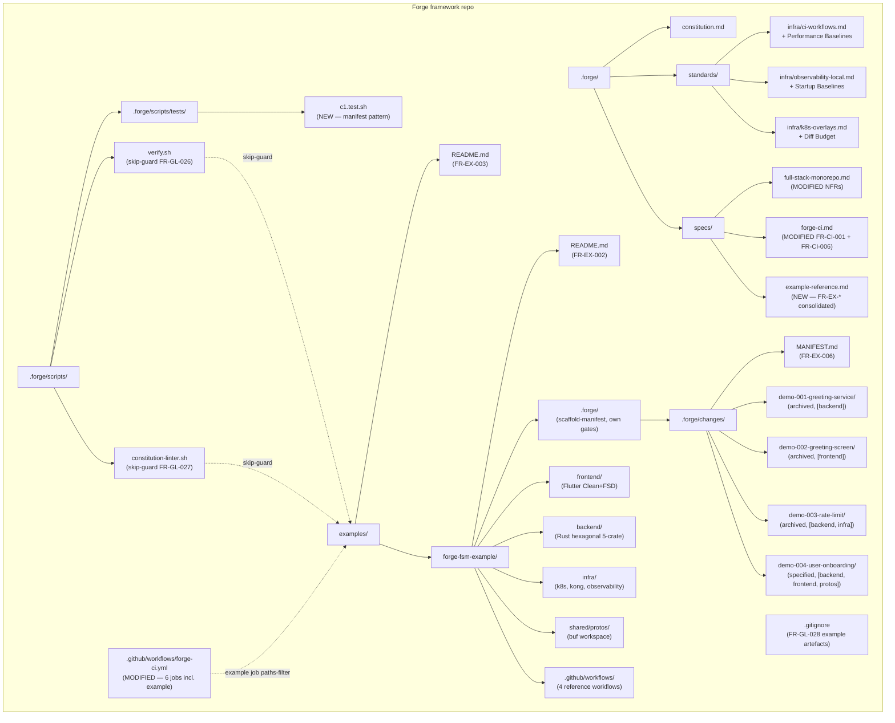
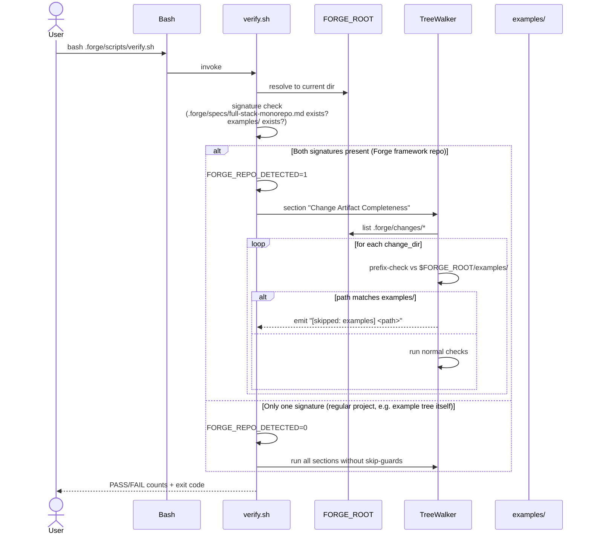

# Design: c1-reference-project

<!-- Audit: Module C.1 — first public reference project (XL effort). -->
<!-- Depends on: b1-foundations + b1-scaffolder + b1-workflow + b1-delivery + g1-forge-ci. -->

This design transforms `specs.md` into concrete technical decisions.
The change is **meta-organizational**: the architectural patterns for
the demos themselves (Flutter Clean+FSD, Rust hexagonal, Kustomize
overlays, OTel pipelines) are already governed by archived changes.
What this design must decide is :

1. **Where** the example lives, **how** Forge's gates avoid it,
   **how** Forge's CI conditionally exercises it.
2. **Which demos**, **what shape**, **what order**, and how they
   demonstrate the discipline rather than the product.
3. **How** measured NFR baselines flow back into the archetype
   standards.
4. **How** the test harness `c1.test.sh` validates the artefacts.

The 13 ADRs below cover these decisions.

---

## Architecture Decisions

### ADR-001: Example tree lives at `examples/forge-fsm-example/` inside the Forge repo

**Context.** The proposal evaluated three hosting options (separate
repo / `examples/` subdir / generated on demand). The user confirmed
**Option B + mono-change** — single change shipping the example
inside the Forge repo. Reasoning: archetype evolution and example
content stay in lock-step ; review fatigue is mitigated by 3 commit
clusters (scaffold / demos / CI+docs) instead of 3 separate changes.

**Decision.**

- The example lives at `examples/forge-fsm-example/`. The path is
  fixed and referenced by `FR-EX-001`.
- The directory `examples/` itself contains a `README.md` (FR-EX-003)
  that documents its purpose and lists the example(s).
- Future archetypes (mobile-only B.4, flutter-firebase B.2) will add
  sibling examples (`examples/forge-mobile-only/`,
  `examples/forge-flutter-firebase/`). The `examples/README.md` will
  list them ; no nesting beyond one level.
- The example is committed **verbatim after scaffolder execution**.
  Once committed, it evolves only through its own demo changes — the
  example is **not regenerated** on every archetype bump (that would
  defeat the purpose of inspecting archived demos).

**Consequences.**

- ✅ Adopters browse the example directly on GitHub without cloning.
- ✅ Archetype evolution is mechanically caught when an `examples/`
  PR fails the new `example` job.
- ✅ Maintenance burden is contained : one example, one README, one
  CI job.
- ⚠️ Forge repo size grows by ~1-3 MB (committed source, no build
  artefacts thanks to `.gitignore` per FR-GL-028). Below NFR-EX-002's
  5 MB budget.
- ⚠️ When the archetype contract bumps (e.g. schema 1.1.0), the
  example may become stale until a follow-up change re-scaffolds.
  Acceptable : the example carries its own
  `.forge/scaffold-manifest.yaml` declaring its scaffold-time version
  (FR-EX-001), so adopters know exactly what archetype version they
  are looking at.

**Constitution Compliance:** Article III.2 (specs as code, including
example artefacts), Article X.3 (public docs).

---

### ADR-002: Skip-guard implementation in shell scripts uses path-prefix detection

**Context.** Forge's own `verify.sh` and `constitution-linter.sh`
walk the file tree from `$FORGE_ROOT`. With `examples/` populated, the
default behaviour would be to apply Article VI/VII checks to the
example's Flutter and Rust code — but the example owns its own gates,
so we must skip. We must also handle the inverse case : when invoked
*from inside* the example tree (its own `verify.sh` lives there too,
copied by the scaffolder), the skip MUST NOT activate (FR-GL-026).

**Decision.**

- Detect the Forge repo identity by checking for the **Forge
  framework signature** : `$FORGE_ROOT/.forge/specs/full-stack-monorepo.md`
  AND `$FORGE_ROOT/examples/` directory both exist. If both are
  present, the script is running from the Forge repo root, not from
  inside an example.
- Within the framework-repo case, every section that walks the tree
  (`Change Artifact Completeness`, layer-scoped checks for backend /
  frontend / infra) gets a guard at the top : if the inspected path
  starts with `$FORGE_ROOT/examples/`, emit
  `[skipped: examples] <path>` and `continue`.
- The detection is fast (two `[ -e ]` tests at script start) and
  cached in a script-local variable `FORGE_REPO_DETECTED=1` so that
  the per-loop guard is a single string-prefix comparison.
- The guard is **additive** — it does NOT change any existing line
  for the non-monorepo case (preserving NFR-010 from `b1-workflow`).

**Consequences.**

- ✅ Single shared detection block at the top of each script ;
  per-loop overhead is negligible (string-prefix comparison).
- ✅ Both `verify.sh` and `constitution-linter.sh` use the same
  pattern (FR-GL-026 + FR-GL-027 mirror each other).
- ✅ Backwards-compatible : Forge repos without `examples/` see no
  skip lines (NFR-EX-006 regression test enforces).
- ⚠️ The detection signature (`.forge/specs/full-stack-monorepo.md`
  + `examples/`) is heuristic : if a downstream user happens to
  create both files with these exact names, the skip activates.
  Acceptable : the heuristic is documented and the canonical
  archetype check (`schema: full-stack-monorepo` in `.forge.yaml`) is
  not appropriate here because example trees also declare that
  schema. This signature is the correct discriminator.

**Constitution Compliance:** Article V.1 (gates), NFR-010 of
`b1-workflow` preserved.

---

### ADR-003: `.gitignore` covers build artefacts only — committed source is the artefact

**Context.** `flutter create` and `cargo new` produce many files :
some are source (`lib/main.dart`, `Cargo.toml`, `src/lib.rs`, `pubspec.yaml`)
and must be committed ; others are build artefacts (`build/`,
`target/`, `.dart_tool/`) and must NOT be committed. The committed
example is the inspectable artefact — we want adopters to read the
real `pubspec.yaml`, the real `Cargo.toml`, not a placeholder.

**Decision.**

- Forge repo's root `.gitignore` adds explicit paths under
  `examples/*/`: `build/`, `target/`, `.dart_tool/`, `node_modules/`,
  `.cargo/`, `coverage/`. These are language-specific build outputs.
- The example's own `.gitignore` (committed under
  `examples/forge-fsm-example/.gitignore`) preserves the standard
  per-language ignores delivered by the scaffolder (which itself was
  written by `b1-scaffolder`).
- `.env`, `.env.local`: ignored at every level. `.env.example` and
  `.env.dev` are **committed** (consistent with FR-IN-009 of
  `b1-delivery` — they are documentation, not secrets ; secret
  whitelist whitelists placeholder markers).
- Lock files : `pubspec.lock`, `Cargo.lock` ARE committed (Flutter
  recommends `.lock` commit for apps ; Rust recommends `Cargo.lock`
  commit for binary projects ; both apply here).

**Consequences.**

- ✅ Adopter who clones the Forge repo gets the full source tree of
  the example, ready to inspect or to build (after running
  `flutter pub get` + `cargo build`).
- ✅ `examples/` byte size stays small (NFR-EX-002 ≤ 5 MB).
- ⚠️ Committing lock files means that Forge's CI for the example
  must use the locked dependency versions. This is desirable
  reproducibility — locked versions = same versions everywhere.

**Constitution Compliance:** Article X (reproducibility), Article VIII.

---

### ADR-004: Demo numbering convention `demo-NNN-<slug>` with chronological order

**Context.** Adopters reading `examples/forge-fsm-example/.forge/changes/`
need a clear order. Forge's own changes use audit-IDs (`b1-foundations`,
`g1-forge-ci`) which trace back to roadmap modules. Demos do not have
audit-IDs because they are illustrative, not framework deliverables.

**Decision.**

- Demos are numbered `demo-NNN-<slug>` with `NNN` zero-padded 3
  digits, starting at `001`. The slug is descriptive (kebab-case).
- The numbering is **chronological** — demo-001 is the first demo
  archived, demo-002 the second, etc. This makes the directory
  listing read like a narrative.
- Each demo's `.forge.yaml` declares `parent_audit_items: [C.1]`
  pointing back to the parent change of this whole tree.
- The four canonical demos for c1 :

| Demo | Layers | What it demonstrates | Status |
|---|---|---|---|
| `demo-001-greeting-service` | `[backend]` | Single-layer backend, hexagonal Rust, proto-first design, BDD via cucumber-rs | archived |
| `demo-002-greeting-screen` | `[frontend]` | Single-layer frontend, Flutter Clean+FSD, BLoC, golden test, BDD via bdd_widget_test | archived |
| `demo-003-rate-limit` | `[backend, infra]` | Multi-layer with Janus orchestration, per-layer designs / tasks, Kong plugin pattern | archived |
| `demo-004-user-onboarding` | `[backend, frontend, protos]` | In-flight at `status: specified`, demonstrates `[NEEDS CLARIFICATION]` marker | specified |

- Future demos (rare) append at the end of the sequence and are
  added by their own changes (not by c1).

**Consequences.**

- ✅ Demos are inspectable in directory order.
- ✅ Layer combinations are distinct (NFR-EX-005 satisfied).
- ⚠️ The chosen names (greeting / rate-limit / onboarding) are
  trivial product semantics. Deliberate per proposal : the example's
  value is the **process artefacts**, not the product.

**Constitution Compliance:** Article IV.4 (lifecycle), Article III.2.

---

### ADR-005: Demo-004 ships at `status: specified` to demonstrate the in-flight state

**Context.** Q1 in the proposal asked whether demo-004 should be at
`specified` (no design / tasks) or escalated to `designed` (with ADRs).
The spec resolved Q1 at spec time : demo-004 stays at `specified` only.
This ADR formalizes the rationale.

**Decision.**

- Demo-004 ships only `proposal.md` and `specs.md`. No `design.md`.
  No `tasks.md`. No `features/`.
- Demo-004's `.forge.yaml` declares `status: specified` and
  populates `timeline.specified` only ; later timeline fields are
  commented out.
- Demo-004's `specs.md` MUST contain at least one realistic
  `[NEEDS CLARIFICATION: ...]` marker per Article III.4.
- The 3 archived demos already exercise the design phase via their
  shipped `design.md` files (demo-001 single-layer design, demo-002
  single-layer design, demo-003 per-layer designs). Demo-004's
  unique role is to show what an "in-flight spec" looks like in
  practice.

**Consequences.**

- ✅ Adopter sees a real `[NEEDS CLARIFICATION]` marker — the
  Article III.4 anti-hallucination protocol becomes tangible.
- ✅ Sets up a future c1-followup change to "advance demo-004 to
  designed" if that walkthrough is requested by adopters.
- ⚠️ Demo-004 is a perpetually-in-flight artefact. Documented as
  intentional in the example's README.

**Constitution Compliance:** Articles III.2, III.4, IV.4.

---

### ADR-006: `forge-ci.yml` example job uses paths-filter + parse-only (no `act`)

**Context.** Q2 asked whether the new `example` job in `forge-ci.yml`
runs the example's reference workflows (via `act` or similar) or
just parses them structurally. The spec resolved Q2 at spec time :
parse-only.

**Decision.**

- The new `example` job (FR-CI-012) declares `dorny/paths-filter@v3`
  on `examples/**`. On a paths-filter miss, the job emits `skipped`
  and exits 0 — paths-filter mismatch is success, not failure
  (per FR-CI-006 modified semantics).
- When the filter matches, the job executes :
  1. `cd examples/forge-fsm-example`
  2. `bash .forge/scripts/verify.sh` (the example's own
     verify.sh, scoped to the example tree's `FORGE_ROOT`)
  3. `bash .forge/scripts/constitution-linter.sh` (same)
  4. Structural YAML parse of every
     `.github/workflows/*.yml.tmpl` in the example tree
     (Python `yaml.safe_load` ; fail on parse error)
- The job does NOT invoke `act` to actually run the archetype
  reference workflows. Reasoning : `act` would require Docker-in-CI,
  network for image pulls, and would duplicate the example's own
  GitHub Actions runs (which the example owns and runs from its own
  `.github/workflows/`). Pure structural validation is sufficient
  for the `example` job's purpose : "is the example tree
  internally-consistent ?"
- The example's reference workflows are themselves exercised when
  someone scaffolds a real project from the archetype and pushes a
  PR — their CI runs the workflows for real. The Forge repo's job
  is to ensure the example's structure stays valid.

**Consequences.**

- ✅ `example` job runtime ≤ 4 min warm (NFR-EX-003) — no Docker
  spin-up, no act overhead.
- ✅ Forge's CI dependencies stay minimal : Python + Bash, same as
  the existing `harness` job.
- ⚠️ The `example` job does not catch runtime regressions in the
  archetype workflow templates. Acceptable trade-off : the
  scaffolder test harness (`scaffolder.test.sh` L3) already exercises
  the templates end-to-end via real scaffolding.

**Constitution Compliance:** Articles V, X.

---

### ADR-007: NFR baselines flow back into archetype standards, not into `specs.md` only

**Context.** FR-EX-008 / MODIFIED NFR-013/014/015/017 commit to
recording measured baselines. Where do the values live ? Two options :
inline in `.forge/specs/full-stack-monorepo.md` or in the standards
documents (`standards/infra/*.md`).

**Decision.**

- Each NFR's `Baseline at archive time of c1-reference-project:` line
  in `.forge/specs/full-stack-monorepo.md` is a **pointer** to the
  authoritative location in the standards :
    - NFR-013 → `standards/infra/ci-workflows.md` § Performance Baselines
    - NFR-014 → `standards/infra/ci-workflows.md` § Performance Baselines
    - NFR-015 → `standards/infra/observability-local.md` § Startup Baselines
    - NFR-017 → `standards/infra/k8s-overlays.md` § Diff Budget
- The standards files gain a new H2 section (or extend an existing
  section) named `## Performance Baselines` / `## Startup Baselines`
  / `## Diff Budget` recording the measured value, the date, the
  measurement method, and the SHA of the example commit measured.
- The spec stays authoritative on the **threshold** (the MUST /
  SHALL clause) ; the standard becomes authoritative on the
  **observed value**. This separation prevents the spec from
  bloating into a measurement log.

**Consequences.**

- ✅ Specs stay tight (one-line baseline pointer instead of a
  measurement table).
- ✅ Standards become the operational reference — adopters reading
  `standards/infra/ci-workflows.md` see the real numbers.
- ✅ Future re-measurements (per release) update the standards
  without spec churn.
- ⚠️ Adds 3 new H2 sections across 3 standards files. Documented in
  the relevant standards' headers.

**Constitution Compliance:** Article X (operational data lives with
operational rules), Article IV.

---

### ADR-008: New consolidated spec `example-reference.md` for `FR-EX-*` namespace

**Context.** The `FR-EX-*` namespace is new (introduced by this change
for example-tree-specific requirements). It is conceptually distinct
from `full-stack-monorepo.md` (archetype contract) — the example IS
NOT part of the archetype contract, it is a *demonstration* of it.

**Decision.**

- Create `.forge/specs/example-reference.md` at archive time as the
  consolidated spec for the `FR-EX-*` namespace. Same convention as
  `forge-ci.md` (consolidated `FR-CI-*` namespace from `g1-forge-ci`).
- The new spec opens with a one-paragraph audience note clarifying :
  it governs the **reference project tree under `examples/`** ; it is
  distinct from `full-stack-monorepo.md` (which governs the
  **archetype contract** itself). Adopters learning the archetype
  read `full-stack-monorepo.md` ; adopters scanning the demonstration
  read `example-reference.md`.
- The spec lists the 10 `FR-EX-*` requirements + the 6 `NFR-EX-*`
  requirements + a `## Archived changes` table linking back to
  `c1-reference-project`.

**Consequences.**

- ✅ Three canonical spec files emerge from the framework :
  `full-stack-monorepo.md` (archetype contract),
  `forge-ci.md` (Forge's own CI), `example-reference.md` (the
  reference example tree). Each has a clear audience.
- ✅ Future C.X changes (walkthrough video, anti-pattern gallery,
  comparison matrix) layer on top of `example-reference.md` if they
  ship example-tree-touching FRs.
- ⚠️ Adds one file to `.forge/specs/`. The spec index is implicit
  (file presence) — no central index file to update.

**Constitution Compliance:** Articles III.2, IV.

---

### ADR-009: Test harness `c1.test.sh` uses the manifest pattern, hermetic L1 only

**Context.** All prior harnesses (`foundations.test.sh`,
`scaffolder.test.sh`, `workflow.test.sh`, `delivery.test.sh`,
`g1.test.sh`) follow the manifest pattern : a `# MANIFEST: test_* —
FR-XX-NNN` comment block declares each test, and a meta self-check
`test_manifest_self_consistency` parses the manifest and asserts
every declared function is defined. We follow the same pattern.

**Decision.**

- `c1.test.sh` lives at `.forge/scripts/tests/c1.test.sh`, executable,
  sources `_helpers.sh` (no new framework).
- The manifest block at the top of the file enumerates every
  `test_*` function with its `FR-XX-NNN` mapping. The self-consistency
  meta-check enforces parity (RED if a manifest line has no
  matching function definition).
- L1 (hermetic) tests cover :
    - Skip-guard structural assertions (verify.sh + constitution-linter.sh
      contain the detection block + the per-section guard ; FR-GL-026
      / FR-GL-027).
    - `.gitignore` content assertions (FR-GL-028).
    - Example tree structural assertions : path exists, contains the 4
      layers, contains `.forge/`, scaffold-manifest is parseable
      (FR-EX-001).
    - Example readme has the 4 H2 sections (FR-EX-002).
    - Each demo has its 5 artefacts (FR-EX-004), demo-004 is at
      `status: specified` only (FR-EX-005), MANIFEST.md lists 4
      demos (FR-EX-006).
    - `forge-ci.yml` example job present + paths-filter + steps
      (FR-CI-012).
    - NFR baseline lines present in their target standards
      (FR-EX-008).
    - Workflow file under size budget (NFR-CI-002 / FR-CI-013).
- L2 (opt-in) tests :
    - Run the example's own `verify.sh` (requires the example's
      Python + bash setup).
    - Run the example's own `constitution-linter.sh`.
    - Parse-validate every `.github/workflows/*.yml.tmpl` in the
      example tree (FR-CI-012 step 4 mirror).
- L3 (opt-in via `--require-external-tools`) :
    - Re-run the scaffolder against a fresh tmpdir and compare the
      output to the committed example (NFR-EX-001 reproducibility).
      Requires `flutter`, `cargo`, `buf` on PATH.
- The harness is invoked by Forge's own `verify.sh` Section 7 at L1
  only, alongside the existing harnesses. L2 / L3 are CI-opt-in via
  flags.

**Consequences.**

- ✅ Harness is hermetic for L1, fits in CI's `harness` job
  alongside the others without slowing them.
- ✅ Reproducibility check (L3) is opt-in, exercised by a future
  scheduled CI run (or by a maintainer pre-release).
- ⚠️ Adds one harness invocation to the existing 5 (foundations,
  scaffolder L1+L2, workflow L1+L2, delivery, g1). Cumulative
  runtime stays under NFR-CI-001's 5-min budget (each harness is
  ≤ 1 s, c1 is no exception at L1).

**Constitution Compliance:** Articles I, V.

---

### ADR-010: 3-commit-cluster delivery for review ergonomics

**Context.** The proposal noted that mono-change c1 has a large
diff surface (~50-100 new files in `examples/`, ~20-30 new files in
demo changes, 2 script edits, 1 workflow edit, 1 new harness, 1
new standard section). Reviewer fatigue is a real risk.

**Decision.**

Even though c1 is a single Forge change, its **commit clusters**
are deliberate and reviewable in sequence :

| Cluster | Files | Reviewer focus |
|---|---|---|
| **Phase 1 — scaffold** | `examples/forge-fsm-example/` raw scaffolded tree (no demos yet) + Forge `.gitignore` updates + skip-guards in `verify.sh` / `constitution-linter.sh` + L1 tests for FR-GL-026..028 + FR-EX-001..003 + FR-EX-007 | Verify that the example tree is the unmodified scaffolder output ; verify skip-guards do not regress non-monorepo scripts |
| **Phase 2 — demos** | `examples/forge-fsm-example/.forge/changes/demo-001..004/` + the demos' application code under `frontend/` `backend/` `infra/` `shared/protos/` + L1 tests for FR-EX-004..006 + the example's `.forge/changes/MANIFEST.md` | Read each demo's lifecycle artefacts in order (demo-001 first, demo-004 last) ; verify per-layer delta semantics in demo-003 |
| **Phase 3 — CI + docs + baselines** | `.github/workflows/forge-ci.yml` extension (new `example` job) + `cli/.nvmrc` unchanged + `docs/CONTRIBUTING.md` extension + measured baselines appended to standards (FR-EX-008) + `examples/README.md` + spec consolidation `example-reference.md` + L1 tests for FR-CI-012..013 + FR-EX-008 + FR-EX-010 | Verify CI integration and baseline correctness |

- Each cluster is its own commit on the change branch. The branch is
  not merged commit-by-commit ; the merge happens once at archive
  time.
- The phase boundaries match the test harness phases — running
  `c1.test.sh` after each phase produces a cleanly-progressing
  RED→GREEN signal (Article I).

**Consequences.**

- ✅ Reviewer can sign off each cluster independently.
- ✅ Phase 1 is small and uncontroversial (skip-guards + scaffolder
  output + 3 readmes).
- ✅ Phase 2 is the bulk of the diff, but each demo is a self-
  contained sub-tree with its own `.forge/changes/` lifecycle.
- ✅ Phase 3 closes the loop and integrates with Forge's CI.
- ⚠️ Three commits on one branch is heavier than three separate
  Forge changes ; the user has accepted this trade-off via "mono-change".

**Constitution Compliance:** Article I (TDD applies per phase),
Article IV.4 (single change-id `c1-reference-project`).

---

### ADR-011: Reproducibility check is L3 opt-in, not part of standard CI

**Context.** NFR-EX-001 ("running `forge init --archetype
full-stack-monorepo forge-fsm-example` produces a tree byte-equivalent
to `examples/forge-fsm-example/` after `SOURCE_DATE_EPOCH` pinning")
is the strongest reproducibility guarantee. Enforcing it on every
PR would require flutter + cargo + buf on the runner, which the
existing forge-ci.yml does not provide (it stays minimal).

**Decision.**

- The reproducibility check lives at `c1.test.sh` L3.
- L3 is opt-in via `--require-external-tools`.
- L3 is exercised by :
    - A maintainer pre-release (manual invocation).
    - A future scheduled GitHub Action (out of scope for c1, deferred
      to a follow-up change like `c1-nightly` or extension of
      `g1-forge-ci`).
- The reproducibility test compares :
    - Files in the scaffolder's plan (`scaffold-plan.yaml`) — these
      MUST match byte-for-byte after substitution.
    - Files generated by `flutter create` and `cargo new` — these
      are NOT compared (they vary across SDK patch versions).
    - The example's demo changes are NOT included in the comparison
      (they evolve via demo lifecycle, not via the scaffolder).

**Consequences.**

- ✅ Standard CI stays fast (no flutter/cargo/buf install on PR).
- ✅ Pre-release reproducibility check catches scaffolder drift.
- ⚠️ A scaffolder regression that affects non-overlay files could
  ship undetected for one release cycle. Mitigated by :
    1. The scaffolder's own L3 harness (`scaffolder.test.sh --level 3`)
       which runs scaffolds in tmpdirs.
    2. The pre-release manual L3 of `c1.test.sh`.

**Constitution Compliance:** Article V (gates), Article X.

---

### ADR-012: Example's demos use the trivial-product convention

**Context.** The proposal's Scope Out states "no actual product
semantics. The 'greeting service', 'greeting screen', 'rate-limit'
features are deliberately trivial. The example's value is the
**process artefacts**, not the product."

**Decision.**

- Each demo's product code is the **minimum** required to be
  TDD-conformant and architecturally correct. No product feature
  expansion in the demos.
- Demo-001's gRPC `Greeter` exposes a single RPC `Greet(GreetRequest{
  name: string }) returns (GreetResponse{ message: string })`. The
  domain entity is `Greeter` with one method `greet(name: NonEmptyString)
  -> Greeting`. One unit test, one cucumber-rs scenario, one
  integration test against a tonic in-process server.
- Demo-002's Flutter screen is a `StatefulWidget` with one text input
  + one submit button + one display area. One BLoC (Cubit), three
  states (initial / loading / success). One widget test, one golden
  test, one bdd_widget_test scenario.
- Demo-003's rate-limit is a single Kong plugin declaration in
  `infra/kong/kong.yml` (10 RPS per consumer). Backend impact :
  zero code change ; the demo's interest is the multi-layer
  per-layer delta + Janus orchestration, not new code.
- Demo-004's spec is rich (covers a multi-layer onboarding flow with
  several FR-BE-/FR-FE-/FR-IN- requirements) but ships NO code (it's
  in-flight at `specified`).

**Consequences.**

- ✅ Adopter understands the **shape** of a demo without being
  distracted by product reasoning.
- ✅ Each demo's diff is small enough to read end-to-end in 10
  minutes.
- ⚠️ Adopters wanting to see "real-world" product complexity will
  not find it here. Documented in the example's README under
  "What this example does NOT show".

**Constitution Compliance:** Article III.2 (specs are the source of
intent — demos demonstrate the discipline, not a product).

---

### ADR-013: Demo-001 ships first ; demo-002 depends on demo-001's proto stubs

**Context.** Demo execution order matters : demo-002 (frontend)
consumes the proto generated by demo-001 (backend). If we tried to
ship demo-002 before demo-001, the Flutter generated stubs would be
empty.

**Decision.**

- **Archive order** (chronological, reflected in
  `timeline.archived` and demo numbering) :
    1. demo-001-greeting-service archived first → adds the
       `shared/protos/v1/greeting/greeting.proto` + the Rust
       stubs in `backend/crates/grpc-api/src/generated/`.
    2. demo-002-greeting-screen archived second → consumes the
       Flutter stubs (regenerated via `task proto`) +
       `frontend/lib/generated/protos/greeting/greeting.pbgrpc.dart`.
       The `task proto` step ran during demo-002's design phase.
    3. demo-003-rate-limit archived third → adds Kong configuration
       under `infra/kong/kong.yml` ; cross-references the existing
       `Greeter` service.
    4. demo-004-user-onboarding stays at `specified` — it is the
       in-flight demo. Its proposal references demo-001..003 as
       prerequisites but does not yet implement.
- The archive timestamps in each demo's `timeline.archived` are
  intentionally **distinct ISO dates** (e.g. demo-001 archived
  on D, demo-002 on D+1, demo-003 on D+2) to model a realistic
  development cadence.

**Consequences.**

- ✅ The dependency chain is linear and visible in the demo
  numbering.
- ✅ An adopter can replay the example's history by reading
  archive timestamps.
- ⚠️ The synthesized timestamps must not exceed today's date.
  `c1.test.sh` enforces : every demo's `timeline.archived` is ≤
  today. Demo-001..003 archive within the c1 implementation window.

**Constitution Compliance:** Articles III, IV.

---

## Component Design



---

## Data Flow

### Skip-guard activation (verify.sh)



### `forge-ci.yml` example job conditional execution

```mermaid
sequenceDiagram
    actor Maintainer
    participant GH as GitHub
    participant ForgeCi as forge-ci.yml
    participant PathsFilter as dorny/paths-filter@v3
    participant ExampleJob as job: example
    participant Summary as job: summary
    participant Verify as example/verify.sh
    participant Linter as example/constitution-linter.sh
    participant Yaml as Python yaml.safe_load

    Maintainer->>GH: opens PR (touches .forge/scripts/verify.sh OR examples/...)
    GH->>ForgeCi: trigger pull_request
    ForgeCi->>ExampleJob: schedule
    ExampleJob->>PathsFilter: query "examples/**" filter

    alt PR touches examples/**
        PathsFilter-->>ExampleJob: matched=true
        ExampleJob->>Verify: cd examples/forge-fsm-example && bash .forge/scripts/verify.sh
        Verify-->>ExampleJob: exit 0 (example tree is internally consistent)
        ExampleJob->>Linter: bash .forge/scripts/constitution-linter.sh
        Linter-->>ExampleJob: exit 0
        ExampleJob->>Yaml: parse every .github/workflows/*.yml.tmpl
        Yaml-->>ExampleJob: all parse successfully
        ExampleJob-->>Summary: result=success
    else PR doesn't touch examples/**
        PathsFilter-->>ExampleJob: matched=false
        ExampleJob-->>Summary: result=skipped (treated as success per FR-CI-006)
    end

    Summary->>Summary: inspect needs.* via env: indirection
    Summary->>Summary: example=success OR skipped → counted as PASS<br/>others MUST be exactly 'success'
    alt all green
        Summary-->>GH: ::notice::forge-ci: 5/5 jobs PASS
    else any failure
        Summary-->>GH: ::error::forge-ci: <job>=<result> FAILED ; exit 1
    end
```

---

## Testing Strategy

### Coverage of FRs

| FR | Test (in `c1.test.sh`) | Level |
|---|---|---|
| FR-GL-026 | `test_verify_skips_examples_tree`<br/>`test_verify_runs_inside_example_tree`<br/>`test_verify_no_skip_when_no_examples_dir` | L1 (fixture-based) |
| FR-GL-027 | `test_constitution_linter_skips_examples_tree` | L1 |
| FR-GL-028 | `test_gitignore_covers_example_artefacts` | L1 |
| FR-EX-001 | `test_example_tree_canonical_structure`<br/>`test_example_scaffold_manifest_complete` | L1 |
| FR-EX-002 | `test_example_readme_has_required_sections` | L1 |
| FR-EX-003 | `test_examples_meta_readme_present` | L1 |
| FR-EX-004 | `test_archived_demos_count_and_status`<br/>`test_each_archived_demo_has_five_artefacts`<br/>`test_demo_003_is_multi_layer` | L1 |
| FR-EX-005 | `test_demo_004_is_specified_only`<br/>`test_demo_004_has_needs_clarification_marker` | L1 |
| FR-EX-006 | `test_demos_manifest_present_and_lists_four_demos` | L1 |
| FR-EX-007 | `test_example_tree_verify_exits_zero`<br/>`test_example_tree_constitution_linter_exits_zero`<br/>`test_example_workflows_parse` | L2 (opt-in via `--require-example-tools`) |
| FR-EX-008 | `test_nfr_baselines_recorded` (multi-target) | L1 |
| FR-EX-009 | `test_manifest_self_consistency` (the harness's own meta-test) | L1 |
| FR-EX-010 | `test_example_reference_spec_present_post_archive` (gated on `status: archived`) | L1 |
| FR-CI-012 | `test_forge_ci_example_job_present`<br/>`test_forge_ci_example_job_paths_filter`<br/>`test_forge_ci_example_job_steps`<br/>`test_forge_ci_summary_treats_example_skip_as_success` | L1 |
| FR-CI-013 | `test_forge_ci_under_size_budget` (extends existing g1.test.sh assertion ; mirrored locally) | L1 |
| MODIFIED FR-CI-001 | `test_forge_ci_workflow_shape_six_jobs` (replaces g1.test.sh's 5-job assertion via override fixture) | L1 |
| MODIFIED FR-CI-006 | `test_forge_ci_summary_aggregates_five_needs` | L1 |
| MODIFIED NFR-013/014/015/017 | `test_nfr_<n>_baseline_recorded` × 4 | L1 |

### Coverage of NFRs

| NFR | Test | Level |
|---|---|---|
| NFR-EX-001 | `test_example_reproducible_from_scaffolder` | L3 (`--require-external-tools`) |
| NFR-EX-002 | `test_example_tree_byte_budget` | L1 |
| NFR-EX-003 | not tested in c1.test.sh ; measured at first archive cycle | n/a |
| NFR-EX-004 | `test_each_demo_proposal_under_size_budget` | L1 |
| NFR-EX-005 | `test_demos_cover_distinct_layer_combinations` | L1 |
| NFR-EX-006 | `test_verify_no_skip_when_no_examples_dir` (regression fixture, FR-GL-026) | L1 |

### BDD scenarios

The four ACs in `specs.md` (`AC-EX-001..004`) are exercised by `c1.test.sh`
**indirectly** : each AC's "Then" assertions map to one or more L1 tests
above. We do NOT ship a `.feature` file at the c1 level (the c1 change is
meta-organizational, not a feature change). The demos individually ship
their own `.feature` files (per FR-EX-004).

### Test ordering during implementation

Following Article I (TDD) :

1. **Phase 1 RED** — write `c1.test.sh` with the L1 tests for FR-GL-026..028
   + FR-EX-001..003 + FR-EX-007. Run → all FAIL (no implementation yet).
2. **Phase 1 GREEN** — implement skip-guards in `verify.sh` /
   `constitution-linter.sh`, add `.gitignore` lines, run scaffolder to
   produce example tree, write `examples/README.md` +
   `examples/forge-fsm-example/README.md`. Run → all PASS.
3. **Phase 2 RED** — extend `c1.test.sh` with FR-EX-004..006 tests.
   Run → fail (no demos yet).
4. **Phase 2 GREEN** — write demos in chronological order per ADR-013
   (demo-001 backend, demo-002 frontend, demo-003 multi-layer,
   demo-004 specified-only). Run → all PASS.
5. **Phase 3 RED** — extend `c1.test.sh` with FR-CI-012..013 +
   FR-EX-008 + FR-EX-010 tests. Run → fail.
6. **Phase 3 GREEN** — extend `forge-ci.yml` with the `example` job,
   append baseline lines to standards, write
   `.forge/specs/example-reference.md`, update
   `docs/CONTRIBUTING.md` if needed. Run → all PASS.
7. **REFACTOR** — across all 3 phases, normalize helper usage in
   `c1.test.sh`, deduplicate any logic shared with prior harnesses,
   run all 6 harnesses to confirm no cross-regression.

---

## Standards Applied

| Standard | How |
|---|---|
| `global/monorepo-layout` | The example tree IS the canonical layout (FR-EX-001). The skip-guards (FR-GL-026/027) preserve the standard's enforcement on the framework repo while delegating layer enforcement to the example's own `verify.sh` for the example tree. |
| `global/proto-contracts` | Demo-001 ships one proto file under `shared/protos/v1/greeting/greeting.proto` ; demo-002 consumes the generated stubs. Buf lint passes (delivered by `b1-scaffolder`'s scaffolder). |
| `global/multi-layer-workflow` | Demo-003 declares `layers: [backend, infra]` ≥ 2 → triggers Janus per FR-GL-015. Demo-004 declares 3 layers, also Janus-orchestrated. |
| `global/forge-self-ci` | The new `example` job (FR-CI-012) follows this standard's branch-protection guidance and its size-budget rule. |
| `global/git-workflow` (b1-foundations FR-GL-005) | Commits in this change use scoped Conventional Commits : `feat(forge):`, `feat(examples):`, `docs(examples):`, `chore(forge):`. The Forge repo is itself a `full-stack-monorepo`-conformant scope set per FR-GL-005. |
| `infra/ci-workflows` | Gains the new H2 `## Performance Baselines` section (ADR-007) recording the measured NFR-013 / NFR-014 values from the example. |
| `infra/k8s-overlays` | Gains the new H2 `## Diff Budget` section (ADR-007) recording NFR-017's measured value. |
| `infra/observability-local` | Gains the new H2 `## Startup Baselines` section (ADR-007) recording NFR-015's measured value. |
| `flutter/architecture` + `flutter/state-management` + `flutter/testing` | Demo-002 follows these strictly. Validated by the example's own `verify.sh` (which loads the `flutter/*` standards via the example's `frontend/CLAUDE.md` JIT loading). |
| `rust/architecture` + `rust/error-handling` + `rust/testing` + `rust/grpc` | Demo-001 follows these strictly. Validated by the example's own `verify.sh`. |
| `infra/kong` | Demo-003 exercises the rate-limit plugin pattern. |

---

## Constitutional compliance gate

| Article | Gate-blocked? | Justification |
|---|---|---|
| I — TDD | NO | RED→GREEN→REFACTOR per phase (testing strategy above). c1.test.sh follows manifest pattern. |
| II — BDD | NO | Demos ship `.feature` files (FR-EX-004). c1 itself ships ACs as Gherkin in specs.md (AC-EX-001..004). |
| III — Specs Before Code | NO | This design is the gate ; specs.md preceded it ; tasks.md follows. Demo-004 demonstrates `[NEEDS CLARIFICATION]` per Article III.4. |
| IV — Delta-Based Change | NO | Every modification is in delta format (ADDED / MODIFIED / REMOVED in specs.md). Demo-003 demonstrates per-layer delta. |
| V — Conformance Gate | NO | Skip-guards (ADR-002) preserve gate behaviour ; the example owns its own gates. forge-ci.yml example job (ADR-006) enforces gate continuity. |
| VI — Flutter Architecture | NO | Demo-002's product code follows Clean+FSD. The example's `frontend/CLAUDE.md` scopes Flutter standards. |
| VII — Rust Architecture | NO | Demo-001's product code follows hexagonal 5-crate. The example's `backend/CLAUDE.md` scopes Rust standards. Domain crate has zero external deps. `unwrap()`/`panic!()` prohibited in production code paths. |
| VIII — Infrastructure | NO | Demo-003 exercises the Kong plugin pattern. The example's `infra/k8s/` uses the canonical Kustomize overlays from `b1-delivery`. |
| IX — Observability | NO | Example demonstrates real OTLP traces flowing into local SigNoz on `task dev`. NFR-015 measured baseline closes the loop. |
| X — Quality | NO | Each demo passes Nemesis (Flutter) and Tribune (Rust). The example's CI enforces zero warnings. NFR-EX-002..005 keep the example tight. |
| XI — AI-First | NO | Out of scope for this example (deferred). |

✅ **No constitutional violation. Proceeding to /forge:plan.**
