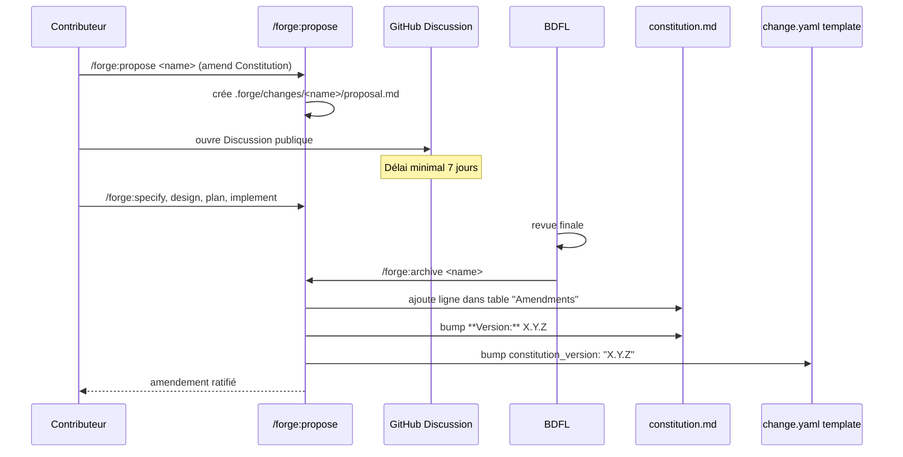
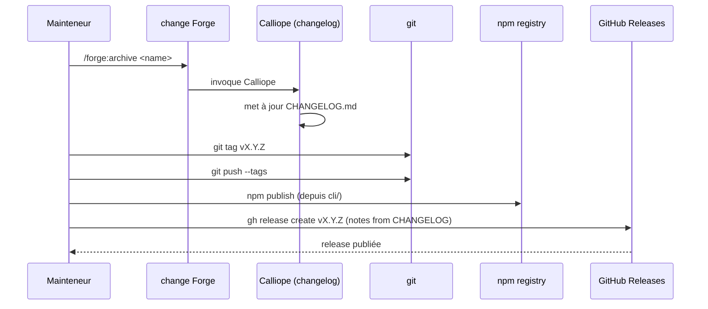

# Design: d5-governance

**Agents pertinents** : Eris (Test Architect) pour la stratégie de tests L1. Pas d'Athena/Ferris/Atlas/Hermes-API/Apollo : aucun code applicatif, aucune infra runtime, aucune API.

**Périmètre** : documentation Markdown + amendement de Constitution + harness shell. Zéro TypeScript, zéro Dart, zéro Rust.

---

## Architecture Decisions

### ADR-001 : Emplacement des fichiers de gouvernance — racine du dépôt

**Context** : GitHub détecte automatiquement les "Community Standards" lorsque les fichiers sont à la racine du dépôt (ou dans `.github/` ou `docs/`). La racine est la convention la plus reconnue par les outils tiers et les contributeurs externes.

**Decision** :
- `GOVERNANCE.md` → racine du dépôt
- `CODE_OF_CONDUCT.md` → racine du dépôt
- Pas de variantes dans `.github/` ou `docs/` pour éviter la duplication.

**Consequences** :
- (+) Détection automatique GitHub Community Standards (NFR-GOV-004).
- (+) Discoverability maximale (`README.md` voisin).
- (-) Légèrement plus de fichiers à la racine (acceptable, le repo a déjà `README.md`, `LICENSE`, `CHANGELOG.md`).

**Constitution Compliance** : NA (organisation de fichiers documentaires).

---

### ADR-002 : Code of Conduct = Contributor Covenant v2.1 verbatim

**Context** : la communauté OSS a un standard de fait pour le Code of Conduct ; Contributor Covenant 2.1 est adopté par la majorité des projets sérieux (Node, Rust, Flutter, etc.). Rédiger un CoC sur mesure introduit du risque juridique et de l'effort sans bénéfice.

**Decision** : copier le **texte intégral officiel** de Contributor Covenant v2.1 depuis https://www.contributor-covenant.org/version/2/1/code_of_conduct/, en remplaçant uniquement le placeholder `[INSERT CONTACT METHOD]` par `contact@benoitfontaine.fr`.

**Consequences** :
- (+) Texte juridiquement éprouvé, accepté par la communauté.
- (+) Aucun effort de rédaction ; aucune ambiguïté de traduction (anglais d'origine conservé).
- (-) Texte en anglais uniquement ; le projet Forge utilise du français côté conversation utilisateur, mais l'OSS standard est l'anglais — alignement attendu.

**Constitution Compliance** : NA (document non normatif au sens des articles techniques).

---

### ADR-003 : Modèle de gouvernance — BDFL-with-fallback

**Context** : le projet n'a aujourd'hui qu'un seul mainteneur actif. Un BDFL strict est honnête vis-à-vis de la réalité, mais cela n'envoie pas le bon signal aux contributeurs externes ("le projet est-il pérenne au-delà de l'auteur ?"). Un comité de mainteneurs immédiat serait artificiel et lourd.

**Decision** : modèle hybride :

- **Phase actuelle (Constitution `1.x` ET `< 5` contributeurs réguliers)** : BDFL = Benoit Fontaine ; il merge, release, ratifie.
- **Phase mature (déclenchée par amendement explicite, à partir de Constitution `2.x` au plus tôt OU `≥ 5` contributeurs réguliers)** : comité de mainteneurs (3 à 7 membres, vote majoritaire, BDFL conserve un veto sur les amendements de Constitution uniquement).
- **Conditions de transition** : un amendement de Constitution explicite doit être ratifié pour activer la Phase mature. La transition ne se fait pas automatiquement.

**Consequences** :
- (+) Honnête sur la réalité actuelle.
- (+) Trajectoire ouverte : un contributeur sait qu'une transition est prévue.
- (+) La transition est un acte délibéré (amendement), pas un drift implicite.
- (-) Le seuil "≥ 5 contributeurs réguliers" reste subjectif ("régulier" = ?). Acceptable car le déclenchement final reste un acte humain (amendement), pas un seuil automatique.

**Constitution Compliance** : ✅ — l'amendement futur (Phase actuelle → Phase mature) suivra exactement le processus formel défini en FR-GOV-006.

---

### ADR-004 : Notation de version de Constitution — ligne `**Version:**` sous H1

**Context** : la Constitution actuelle ne porte pas de numéro de version visible humainement (la version est implicite dans `constitution_version` des `.forge.yaml` des changes, pas dans `constitution.md` lui-même). Le bump `1.0.0 → 1.1.0` doit être détectable à la fois par un humain (en lisant le fichier) et par un test automatisé.

**Decision** : ajouter, immédiatement sous le titre H1 `# Forge Constitution`, une ligne :

```markdown
**Version:** 1.1.0
```

Cette ligne sera mise à jour à chaque amendement futur (exact mécanisme défini par l'amendement lui-même).

**Consequences** :
- (+) Détection humaine immédiate.
- (+) Test L1 trivial (`grep -q '^\*\*Version:\*\* 1\.1\.0'`).
- (+) Pas de surcharge sur la table « Amendments » qui reste l'historique exhaustif.
- (-) Risque léger de désynchronisation si quelqu'un édite la table sans mettre à jour la ligne. Mitigation : ajouter dans `constitution-linter.sh` (existant) une règle "si table Amendments a N lignes, la version mineure DOIT être ≥ N" (hors scope D.5, ticket de suivi possible en H.x).

**Constitution Compliance** : ✅ — l'ajout de cette ligne fait partie de l'amendement Article XII.

---

### ADR-005 : Placement de l'Article XII

**Context** : la Constitution comporte aujourd'hui 11 articles (I-XI), suivis de la section `## Amendments`. Un nouvel Article XII s'insère naturellement avant la table.

**Decision** :
- L'Article XII MUST être placé **après** l'Article XI (« AI-First Design ») et **avant** la section `## Amendments`.
- Format identique aux autres articles : titre H2 `## Article XII — Governance`, paragraphes courts, bullets si nécessaire, ≤ 30 lignes.
- L'article ne réécrit pas `GOVERNANCE.md` : il **délègue** explicitement (« la source de vérité est `GOVERNANCE.md` à la racine du dépôt »). Ainsi, modifier `GOVERNANCE.md` ne nécessite pas un amendement de Constitution **pour les détails opérationnels** (ex : ajouter un co-mainteneur). En revanche, modifier le **modèle** lui-même (BDFL → comité, durée minimale de discussion, etc.) reste un amendement de Constitution.

**Consequences** :
- (+) `GOVERNANCE.md` est vivant (peut évoluer souvent), Constitution reste stable.
- (+) Délimitation claire entre « principes constitutionnels » et « procédures opérationnelles ».
- (-) Risque qu'un futur mainteneur étende `GOVERNANCE.md` au-delà du périmètre opérationnel pour court-circuiter le processus d'amendement. Mitigation : NFR-GOV-002 documente cette discipline.

**Constitution Compliance** : ✅ — l'amendement est précisément le mécanisme prévu par la Constitution.

---

### ADR-006 : `constitution_version` du change `d5-governance` lui-même reste `1.0.0`

**Context** : le change qui crée `1.1.0` est ratifié SOUS `1.0.0`. Si on lui assignait `1.1.0`, on aurait une référence circulaire conceptuelle (le change valide les règles qu'il crée).

**Decision** : `.forge/changes/d5-governance/.forge.yaml` MUST conserver `constitution_version: "1.0.0"`. Tous les **futurs** changes (proposés après archive de D.5) MUST utiliser `1.1.0` (mis à jour dans `.forge/templates/change.yaml`).

**Consequences** :
- (+) Cohérence temporelle : un change est validé sous la version en vigueur au moment de son ouverture.
- (+) Précédent réutilisable pour tous les futurs amendements de Constitution (chaque change-amendement reste sous l'ancienne version).
- (-) Subtilité à documenter dans le futur `.forge/standards/global/governance.md` ou directement dans `GOVERNANCE.md § Amendment Process`.

**Constitution Compliance** : ✅.

---

### ADR-007 : Stratégie de tests — harness `d5.test.sh` au pattern manifest

**Context** : Forge a déjà 8 harnais (`a7`, `b1-foundations`, `b1-scaffolder`, `b5`, `c1`, `foundations`, `g1`, `workflow`) qui suivent un pattern manifest standardisé. Il faut s'aligner.

**Decision** : `d5.test.sh` MUST suivre le même pattern :
- Manifeste = liste de fonctions `_test_d5_001` à `_test_d5_NNN`
- Boucle `_run_test "<id>" "<description>" _test_d5_NNN`
- Compteurs `PASSED`, `FAILED`, `TOTAL`
- Exit code 0 si tous passent, 1 sinon
- Helper `_assert_contains "<file>" "<pattern>"` réutilisé (si déjà mutualisé) ou local
- Découvert automatiquement par `verify.sh` (déjà en place via `find tests -name '*.test.sh'`)
- Enregistré dans `.github/workflows/forge-ci.yml` job `harness` par nom (cf. enregistrement nominatif des autres harnais)

**Tests prévus (≥ 15, un par FR + 1-2 transverses)** :
- `_test_d5_001` : `GOVERNANCE.md` existe à la racine
- `_test_d5_002` : `GOVERNANCE.md` ≥ 50 lignes
- `_test_d5_003` : 7 sections H2 présentes (boucle sur la liste)
- `_test_d5_004` : section Maintainers contient « Benoit Fontaine » + « @bfontaine » + « BDFL »
- `_test_d5_005` : section Roles ≥ 4 bullets
- `_test_d5_006` : section Decision Making mentionne « phase actuelle/current phase » ET « phase mature/mature phase »
- `_test_d5_007` : section Amendment Process contient « 7 jours/days » et ≥ 4 étapes numérotées
- `_test_d5_008` : section Release Process mentionne `vX.Y.Z` ou pattern semver
- `_test_d5_009` : section Code of Conduct contient « CODE_OF_CONDUCT.md » et « Contributor Covenant »
- `_test_d5_010` : section Contact contient `contact@benoitfontaine.fr`
- `_test_d5_011` : `CODE_OF_CONDUCT.md` existe + Contributor Covenant + 2.1 + email
- `_test_d5_012` : Constitution contient `## Article XII` + référence à `GOVERNANCE.md`
- `_test_d5_013` : Constitution contient `**Version:** 1.1.0` + ≥ 1 ligne dans la table Amendments
- `_test_d5_014` : `change.yaml` template a 2 occurrences de `1.1.0` ; archetype tmpl a 1 occurrence ; `d5-governance/.forge.yaml` reste à `1.0.0`
- `_test_d5_015` : `README.md` référence `GOVERNANCE.md` ET `CODE_OF_CONDUCT.md`

**Consequences** : alignement pattern, intégration CI immédiate, RED→GREEN incrémental.

**Constitution Compliance** : ✅ Article I respecté via tests L1 RED→GREEN.

---

### ADR-008 : Consolidation des specs — nouveau namespace `governance.md`

**Context** : Forge consolide les FR par namespace dans `.forge/specs/<namespace>.md` à l'archive d'un change (cf. pattern établi par `forge-ci.md`, `init-wizard.md`, `upgrade.md`, `example-reference.md`, `full-stack-monorepo.md`).

**Decision** : à l'archive de D.5, créer `.forge/specs/governance.md` avec les 15 FR-GOV-* + les 4 NFR-GOV-* + les 5 scénarios BDD. Ce fichier devient la source de vérité long terme pour le namespace governance.

**Consequences** : 6 fichiers de specs au total après D.5 (full-stack-monorepo, forge-ci, example-reference, upgrade, init-wizard, governance).

**Constitution Compliance** : ✅ Article IV (delta-based) respecté : aucun spec existant n'est modifié, on ajoute un nouveau namespace.

---

## Component Design

```mermaid
graph TD
    A[GOVERNANCE.md] -->|delegated authority| B[Article XII Constitution]
    A -->|points to| C[CODE_OF_CONDUCT.md]
    A -->|points to| D[GitHub Discussions]
    A -->|points to| E[GitHub Issues]
    A -->|email| F[contact@benoitfontaine.fr]

    B -->|amends| G[".forge/constitution.md (1.1.0)"]
    G -->|consumed by| H[".forge/templates/change.yaml"]
    G -->|consumed by| I[".forge.yaml.tmpl archetypes"]

    J[README.md] -->|links to| A
    J -->|links to| C

    K[.forge/scripts/tests/d5.test.sh] -->|verifies| A
    K -->|verifies| C
    K -->|verifies| G
    K -->|verifies| J
    K -->|verifies| H
    K -->|verifies| I

    L[.github/workflows/forge-ci.yml] -->|invokes| K

    M[.forge/scripts/verify.sh] -->|discovers| K

    style A fill:#fef3c7,stroke:#d97706,stroke-width:2px
    style B fill:#fef3c7,stroke:#d97706,stroke-width:2px
    style G fill:#fee2e2,stroke:#dc2626,stroke-width:2px
    style K fill:#dbeafe,stroke:#2563eb,stroke-width:2px
```

---

## Data Flow

### Flow 1 : un contributeur amende la Constitution



### Flow 2 : un mainteneur publie une release



---

## Testing Strategy

### Niveau L1 — tests structurels hermétiques

**Harnais** : `.forge/scripts/tests/d5.test.sh`
**Volume** : ≥ 15 tests
**Pattern** : manifest (cf. ADR-007)
**Couverture FR** : 1 test minimum par FR (15 FR → 15 tests, possible mutualisation `_test_d5_003` qui boucle sur les 7 sections H2).

### Niveau L2 — fixture-based

NA pour D.5 (pas de fixture multi-fichier requise au-delà des fichiers du dépôt eux-mêmes).

### Niveau L3 — intégration externe

NA pour D.5 (pas d'outil externe ; npm/git/gh restent du domaine release, hors scope d'un harnais automatisé).

### BDD scenarios

Les 5 scénarios Gherkin écrits en specs.md restent **documentaires** (lisibilité contributeur), non automatisés. C'est cohérent avec les autres changes "facilitateurs" (D.6, A.7) où les BDD documentaires accompagnent les FR sans exécution automatisée.

### CI integration

`.github/workflows/forge-ci.yml` job `harness` MUST inclure une étape qui appelle `bash .forge/scripts/tests/d5.test.sh` (ou laisser la découverte automatique via `verify.sh` faire le travail si déjà en place — à confirmer en lecture du workflow au moment de l'implémentation).

---

## Standards Applied

- **Article I (TDD)** : harness `d5.test.sh` suit RED→GREEN, écrit avant le contenu des fichiers Markdown.
- **Article II (BDD)** : 5 scénarios Gherkin documentaires (cf. ADR-007 raison du non-automatisé).
- **Article III (Specs Before Code)** : ce design suit `specs.md`, lui-même suit `proposal.md`.
- **Article III.4 (Anti-hallucination)** : zéro `[NEEDS CLARIFICATION:]`. Décisions tranchées en proposal + ADR.
- **Article IV (Delta-based)** : nouveau namespace, ADDED uniquement.
- **Article V (Process Gates)** : pipeline complet.
- **Articles VI-XI** : NA.

---

## Risks & Mitigations

| Risque | Probabilité | Impact | Mitigation |
|---|---|---|---|
| Désynchronisation `**Version:**` ↔ table Amendments | Faible | Faible | NFR-GOV-002 + ticket H.x optionnel pour étendre `constitution-linter.sh` |
| Texte CoC v2.1 modifié par erreur lors du copier-coller | Faible | Moyen | test L1 vérifie présence chaîne `Contributor Covenant` + `2.1` |
| Email exposé indéfiniment alors que `contact@benoitfontaine.fr` n'existe plus | Très faible | Moyen | adresse contrôlée par l'auteur, à maintenir activement ; NFR-GOV-003 limite à un seul email |
| `cli/src/` modifié par erreur (scope creep) | Faible | Faible | FR-GOV-015 + revue manuelle au gate `/forge:archive` |
| Test L1 trop strict sur titres exacts → friction future | Moyen | Faible | tests utilisent `grep -c '^## Maintainers$'` mais pas de match d'ordre, l'ordre étant SHOULD pas MUST |

---

## Implementation Order (preview pour `/forge:plan`)

1. **Phase 0** — Harness RED : créer `d5.test.sh` avec les 15 tests, tous échouent.
2. **Phase 1** — `GOVERNANCE.md` complet (sections 1-7) → tests `_test_d5_001` à `_test_d5_010` passent.
3. **Phase 2** — `CODE_OF_CONDUCT.md` (Contributor Covenant 2.1) → `_test_d5_011` passe.
4. **Phase 3** — Amendement Constitution (Article XII + `**Version:** 1.1.0` + ligne table Amendments) + bumps templates → `_test_d5_012` à `_test_d5_014` passent.
5. **Phase 4** — `README.md` mis à jour → `_test_d5_015` passe.
6. **Phase 5** — Intégration CI (`.github/workflows/forge-ci.yml`) + lancement complet `verify.sh` (160 tests existants → 160 + 15 = 175 tests).
7. **Phase 6** — Archive : consolidation des FR-GOV-* dans `.forge/specs/governance.md`, mise à jour roadmap, plan d'audit, CHANGELOG.

---

**Status** : `designed`. Next : `/forge:plan d5-governance`.
