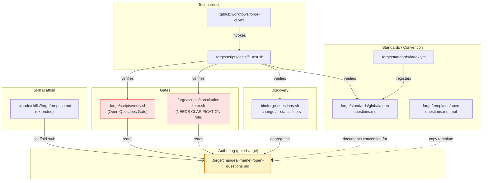
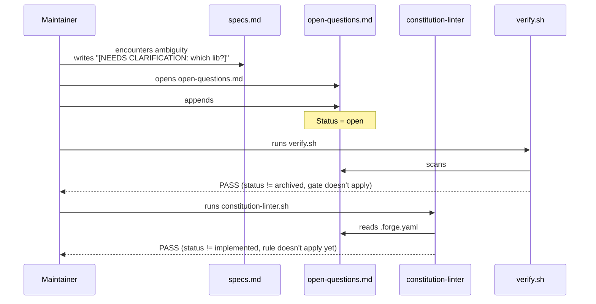
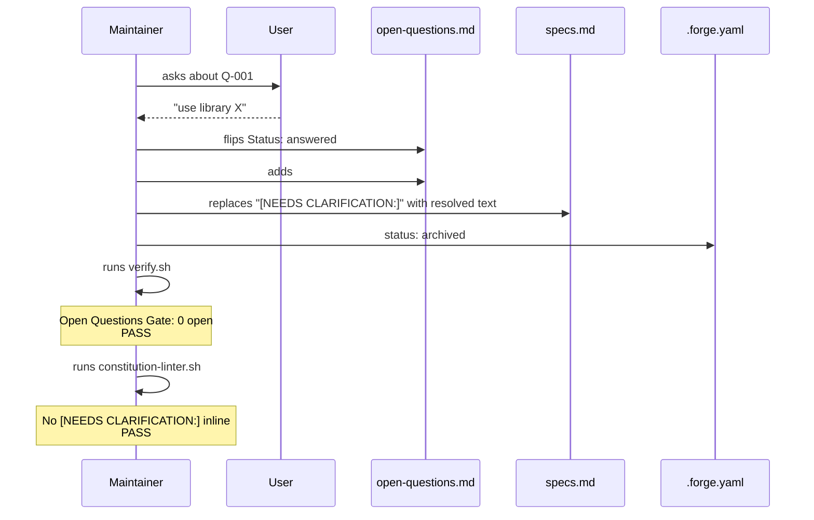
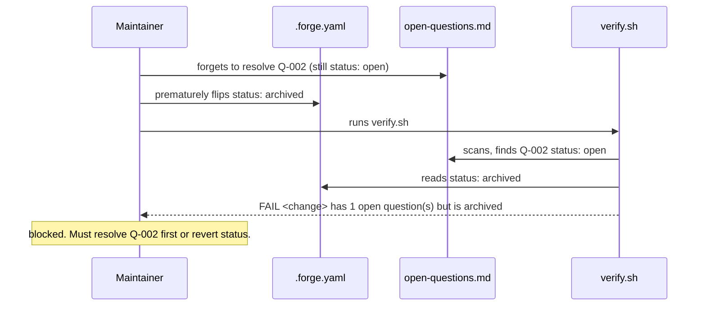

# Design: f1-open-questions

**Agents pertinents** : Eris (Test Architect) pour la stratégie L2 fixture-based. Pas d'Athena/Ferris/Atlas/Hermes-API : aucun code applicatif Flutter/Rust/infra/API. F.1 est un gate de discipline + outil shell.

**Périmètre** : 1 standard, 1 template, 1 gate verify.sh, 1 règle linter, 1 script bash, 1 stub skill, 1 harness, mises à jour doc.

**Effort** : `M` — single-session, 1 commit final.

---

## Architecture Decisions

### ADR-001 : Per-change file under `.forge/changes/<name>/open-questions.md`

**Context** : 3 emplacements alternatifs ont été considérés :
1. Per-change file — `.forge/changes/<name>/open-questions.md`
2. Centralized — `.forge/open-questions.md` (toutes les questions du projet)
3. Inline only — pas de fichier dédié, scan des `[NEEDS CLARIFICATION:]` à la volée

**Decision** : option 1, **per-change**.

**Consequences** :
- (+) Co-localisation avec le change : ouvrir un change = voir ses questions.
- (+) Pas de coordination cross-change pour les Q-IDs.
- (+) Les changes archivés conservent leurs questions tracées (immuable history).
- (+) `forge-questions.sh` agrège les fichiers en mode discovery — pas besoin d'un index central.
- (-) Une vue globale exige le script de discovery (vs option 2 qui aurait un fichier unique). Acceptable, le script est trivial.

**Constitution Compliance** : ✅ Article IV (delta-based change management). Cohérent avec le pattern `proposal.md` / `specs.md` / `design.md` / `tasks.md` per-change.

---

### ADR-002 : Markdown format (pas YAML, pas JSON)

**Context** : un fichier structuré pourrait être YAML (machine-parsable) ou JSON. Mais Forge a une discipline forte de "Markdown-as-code" pour tout ce qui est human-authored.

**Decision** : Markdown avec sections H2/H3 + bullet-list de champs `**Key**: value`.

**Consequences** :
- (+) Lecture directe sur GitHub/IDE.
- (+) Diffs git lisibles.
- (+) Cohérent avec les autres `*.md` du change (proposal/specs/design/tasks).
- (-) Parsing nécessite des heuristiques shell (grep + sed). Acceptable pour le cas simple ici.

Le parsing dans `verify.sh`, `constitution-linter.sh`, et `forge-questions.sh` utilise des patterns grep ciblés (`^- \*\*Status\*\*: open$`, etc.) qui sont robustes et ne nécessitent pas de parser Markdown complet.

**Constitution Compliance** : ✅.

---

### ADR-003 : Q-NNN format sequential per-change

**Context** : décision tranchée en proposal — Q-IDs séquentiels par change, jamais réutilisés.

**Decision** : regex `^Q-[0-9]{3}$` (zéro-padded à 3 digits = 999 questions max par change, largement suffisant).

**Consequences** :
- (+) Pas de coordination globale.
- (+) Préfixe `<change>:Q-NNN` au moment de la vue transverse via `forge-questions.sh`.
- (-) 999 max théorique. Jamais atteint en pratique (un change qui dépasse 50 questions ouvertes a un problème de scope, pas de naming).

**Constitution Compliance** : ✅.

---

### ADR-004 : Status enum à 3 valeurs

**Context** : alternatives évaluées : `open / answered / wontfix` (3) vs `open / in-discussion / answered / wontfix` (4) vs `open / answered / wontfix / deferred` (4 différent).

**Decision** : 3 valeurs strictes — `open`, `answered`, `wontfix`. La nuance "in-discussion" est implicite (toute question `open` est implicitement en discussion). "Deferred" est `wontfix` avec un rationale "deferred to <change>".

**Consequences** :
- (+) Linter trivial (set membership test).
- (+) UI mentale claire pour un mainteneur.
- (-) Pas de granularité fine sur "en discussion active". Si besoin émerge, F.5 pourrait raffiner.

**Constitution Compliance** : ✅.

---

### ADR-005 : Resolution = immutable history

**Context** : que faire d'une question résolue ? Options :
1. La supprimer du fichier (clean).
2. La conserver avec status flippé (audit trail).

**Decision** : conserver, l'historique est précieux. Une question `answered` conserve la trace de la décision et du rationale (utile 6 mois plus tard quand on se demande pourquoi telle archi a été choisie).

**Consequences** :
- (+) Audit trail complet.
- (+) Forensic friendly (debug "pourquoi cette décision ?" → grep open-questions.md).
- (-) Le fichier grossit avec le temps. Acceptable, un change a typiquement < 10 questions sur sa vie.

**Constitution Compliance** : ✅.

---

### ADR-006 : verify.sh gate scoped to `archived` only

**Context** : à quel status le gate doit-il fail ?
- Option A : fail dès `implemented` (cohérent avec ADR-007 pour le linter).
- Option B : fail seulement à `archived`.

**Decision** : option B — **fail seulement à `archived`**.

**Rationale** : le verify.sh gate est un check macro à l'archive (le moment où le change "scelle" son état). Pendant `implemented`, des questions peuvent légitimement émerger lors du run (un edge-case découvert pendant le RED→GREEN). C'est le linter qui s'occupe du finer-grained "no `[NEEDS CLARIFICATION:]` inline dès `implemented`" (cf ADR-007). Le gate verify.sh agit en filet de sécurité au moment archive.

**Consequences** :
- (+) Pas de friction pendant le développement.
- (+) Filet ferme à l'archive.
- (-) Un change peut être en `implemented` longtemps avec une question `open` → mitigé par le linter (qui détecte le `[NEEDS CLARIFICATION:]` inline correspondant).

**Constitution Compliance** : ✅ Article V — gate cohérent.

---

### ADR-007 : Linter rule scope = `implemented` + `archived`

**Context** : la règle linter "pas de `[NEEDS CLARIFICATION:]` inline" doit s'appliquer à quels status ?

**Decision** : `implemented` ET `archived`. Pas `proposed` / `specified` / `designed` / `planned` (où les questions ouvertes sont normales).

**Consequences** :
- (+) Discipline imposée au moment où ça compte (dès qu'on a écrit du code).
- (+) Pas de friction sur les phases de design.
- (-) Si un change passe `planned → implemented` avec une question encore inline, le linter fail au prochain run. C'est le résultat voulu (signal "redescendez à `planned` pour résoudre").

**Constitution Compliance** : ✅ Article III.4 — mécanisation directe.

---

### ADR-008 : `bin/forge-questions.sh` en bash pur

**Context** : alternatives possibles : TypeScript (cohérent avec `forge` CLI), Python (déjà utilisé par verify.sh pour YAML), bash (cohérent avec autres `bin/forge-*.sh`).

**Decision** : **bash pur**. Pattern aligné avec `bin/forge-init-fsm.sh`, `bin/forge-init-mobile-only.sh`, `bin/forge-snapshot.sh`, `bin/forge-upgrade.sh`. Pas de nouveau langage requis.

**Implementation** : itère sur `.forge/changes/*/open-questions.md`, parse via `awk` la zone autour de `## Q-NNN: ` jusqu'au prochain `##` pour extraire titre + champs. Output formaté.

**Consequences** :
- (+) Pas de nouvelle dépendance (NFR-OQ-001).
- (+) Cohérent avec l'écosystème `bin/forge-*.sh`.
- (+) Portable BSD/GNU.
- (-) Pas d'autocomplétion ou flags riches comme un parser TS aurait. Acceptable pour un outil simple.

**Constitution Compliance** : ✅.

---

### ADR-009 : Skill `/forge:propose` modification strategy

**Context** : peut-on modifier le skill `forge:propose` pour qu'il scaffold automatiquement `open-questions.md` ?

Le skill vit dans `.claude/skills/forge/propose.md` (à confirmer). Modification possible si fichier user-modifiable.

**Decision** :
1. **Tentative principale** : modifier `.claude/skills/forge/propose.md` (ou équivalent) pour ajouter une étape "Step 2c (modified): also create open-questions.md stub".
2. **Fallback documenté** : si l'emplacement du skill est read-only ou non-modifiable, le standard `open-questions.md` documente clairement la création manuelle du stub par le mainteneur ou l'agent au moment du `/forge:propose` (ou copy-paste depuis le template).

Le test L1 passera dans les 2 cas : il vérifie SOIT le skill modifié SOIT la doc complète dans le standard.

**Consequences** :
- (+) Robust to skill-system constraints.
- (+) Pas de dépendance technique dure sur la modifiabilité du skill.

**Constitution Compliance** : ✅.

---

### ADR-010 : Backwards compatibility par default (absence = OK)

**Context** : les 10 changes archivés sur `optim` n'ont PAS de `open-questions.md`. F.1 ne doit pas faire fail le verify.sh sur ces changes.

**Decision** : la logique du gate vérifie `[ -f open-questions.md ]` avant de scanner. Si absent → SKIP (PASS sans warning). C'est la définition opérationnelle de "rétrocompatibilité".

Pour les nouveaux changes (créés post-F.1), le skill scaffold le stub vide → fichier présent mais pas de question → PASS aussi.

**Consequences** :
- (+) Zéro risque de casser les changes existants.
- (+) Migration sans douleur.
- (-) Aucune.

**Constitution Compliance** : ✅.

---

### ADR-011 : Single-session execution

**Context** : effort `M` (~+1500-2500 LOC), comparable à `d5-governance` qui a été single-session sans problème.

**Decision** : single-session, 1 commit final. Pas de découpage en phases.

**Order d'exécution** :
1. Harness RED (tous les tests fail).
2. Standard `.forge/standards/global/open-questions.md`.
3. Template `.forge/templates/open-questions.md.tmpl`.
4. `bin/forge-questions.sh`.
5. Update `verify.sh` (Open Questions Gate).
6. Update `constitution-linter.sh` (NEEDS CLARIFICATION rule).
7. Update `.forge/standards/index.yml`.
8. Update `.github/workflows/forge-ci.yml` (register f1.test.sh).
9. Update skill `.claude/skills/forge/propose.md` (si modifiable) OU doc fallback.
10. Update `docs/GUIDE.md` ou nouveau `docs/OPEN_QUESTIONS.md`.
11. Verify GREEN sur f1 + zéro régression sur 10 harnais.
12. Spec consolidée `.forge/specs/open-questions.md`.
13. Update roadmap + plan d'audit + CHANGELOG.
14. Flip `.forge.yaml` status `archived`.
15. Commit + push.

**Consequences** :
- (+) Cohérent avec l'effort. Single commit lisible.
- (+) Pas de pause au milieu (skill+gate+linter+script forment un tout).

**Constitution Compliance** : ✅.

---

## Component Design



---

## Data Flow

### Flow 1 — Maintainer raises a question during `/forge:specify`



### Flow 2 — Resolution + archive



### Flow 3 — Archive blocked by lingering open question



---

## Testing Strategy

### Niveau L1 — tests structurels hermétiques

**Harnais** : `.forge/scripts/tests/f1.test.sh --level 1`
**Volume** : ≥ 12 tests L1
**Couverture** : présence fichiers (standard, template, script, harness), grep des sections H2 dans le standard, structure de `forge-questions.sh` (args parsing), entrée `index.yml`, registration CI.

### Niveau L2 — fixture-based

**Volume** : ≥ 5 tests L2
**Approche** : créer un faux change dans tmpdir avec `.forge.yaml` `status: archived` + `open-questions.md` avec une question `open`, lancer verify.sh **scopé sur ce tmpdir** (via env var `FORGE_ROOT`), vérifier exit ≠ 0.

Tests L2 prévus :
- `_test_f1_l2_001` : fixture `archived + Q open` → verify.sh FAIL.
- `_test_f1_l2_002` : fixture `archived + Q answered` → verify.sh PASS.
- `_test_f1_l2_003` : fixture `archived + no open-questions.md` → verify.sh PASS (rétrocompat).
- `_test_f1_l2_004` : fixture `implemented + [NEEDS CLARIFICATION:]` in specs.md → constitution-linter FAIL.
- `_test_f1_l2_005` : fixture multi-change → forge-questions.sh aggregates correctly + filter --change works.

### CI integration

`.github/workflows/forge-ci.yml` job `harness` ajoute :
```yaml
- name: f1.test.sh
  run: bash .forge/scripts/tests/f1.test.sh --level 1,2
```

Total après F.1 : 11 harnais (foundations + scaffolder + workflow + delivery + g1 + c1 + a7 + b5 + d5 + b4 + **f1**).

### BDD scenarios

6 scénarios documentés dans specs.md sont **documentaires** (lisibilité contributeur). Les flux Verify-gate / Linter-rule / Discovery sont couverts par les tests L2 fixture-based.

---

## Standards Applied

- **Article I (TDD)** : harness `f1.test.sh` RED→GREEN.
- **Article II (BDD)** : 6 scénarios documentés.
- **Article III (Specs Before Code)** : ce design suit specs.md.
- **Article III.4 (Anti-hallucination)** : F.1 EST la mécanique de cet article. Méta-cohérence : zéro `[NEEDS CLARIFICATION:]` reste dans la pipeline (3 décisions tranchées en proposal).
- **Article IV (Delta-based)** : ADDED-only namespace.
- **Article V (Process Gates)** : nouveau gate (verify.sh "Open Questions") + nouvelle règle linter.
- **Article XII (Governance)** : `constitution_version: "1.1.0"`.

---

## Risks & Mitigations

| Risque | Probabilité | Impact | Mitigation |
|---|---|---|---|
| Skill `/forge:propose` non-modifiable | Moyen | Faible | ADR-009 fallback documenté + test L1 accepte les 2 cas |
| `verify.sh` gate parsing fragile sur Markdown | Faible | Moyen | grep ciblés sur `^- \*\*Status\*\*: open$` ; tests L2 fixture-based valident le parsing |
| Performance verify.sh dégradée par scan additionnel | Faible | Faible | NFR-OQ-002 budget 500ms ; mesure avant/après ; le scan est borné à `.forge/changes/` |
| Régression sur les 10 changes archivés (rétrocompat) | Faible | Critique | NFR-OQ-003 vérifié ; logique gate skip-on-absent (ADR-010) |
| Rule linter trop stricte → bloque un change avec une question légitime en `implemented` | Moyen | Moyen | Documenter dans le standard : si question légitime émerge en `implemented`, redescendre à `planned`, résoudre, remonter |
| Q-NNN duplicates (mainteneur edit manuel sans incrémenter) | Faible | Faible | Linter peut ajouter règle "duplicate Q-NNN detected" en F.5+ ; hors scope F.1 |

---

## Implementation Order (preview pour `/forge:plan`)

1. **Phase 1 : Harness RED** — `f1.test.sh` (~17 tests L1+L2), `0/17 PASS`.
2. **Phase 2 : Standard + template + index** — `.forge/standards/global/open-questions.md` + `.forge/templates/open-questions.md.tmpl` + `index.yml` entry.
3. **Phase 3 : Discovery script** — `bin/forge-questions.sh`.
4. **Phase 4 : Gates** — `verify.sh` Open Questions section + `constitution-linter.sh` NEEDS CLARIFICATION rule.
5. **Phase 5 : Skill + doc** — modify `.claude/skills/forge/propose.md` (or documented fallback) + `docs/GUIDE.md` section.
6. **Phase 6 : CI integration** — register `f1.test.sh --level 1,2` in `forge-ci.yml`.
7. **Phase 7 : Verify global** — 11 harnais + verify.sh + constitution-linter all GREEN.
8. **Phase 8 : Archive** — spec consolidée `.forge/specs/open-questions.md`, roadmap, plan, CHANGELOG, flip status, commit, push.

Single-session, 1 commit final.

---

**Status** : `designed`. Next : `/forge:plan f1-open-questions`.
