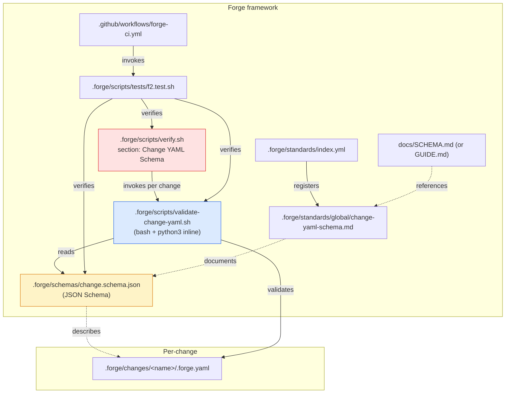
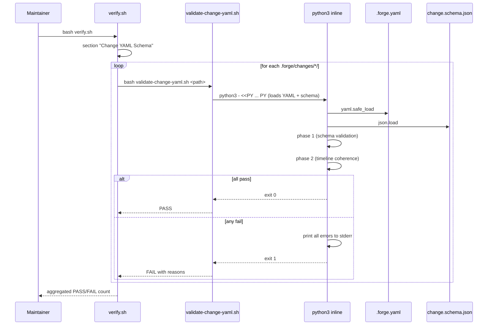
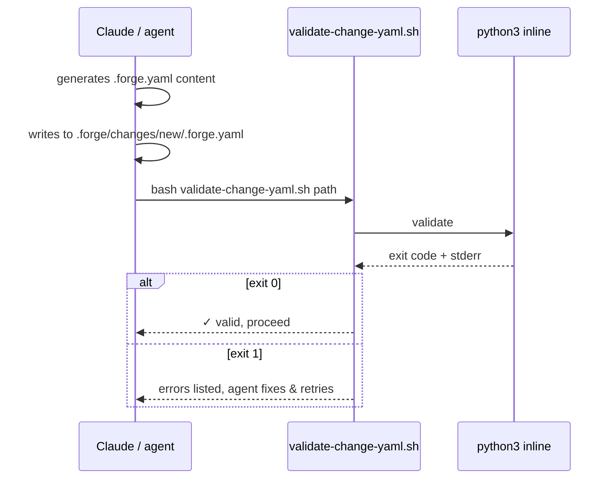

# Design: f2-yaml-schema

**Agents pertinents** : Eris (Test Architect) pour la stratégie L1 + L2 fixture-based. Pas d'autre agent : F.2 est un gate structurel + script shell, aucun code applicatif.

**Périmètre** : 1 schema JSON, 1 script shell + Python inline, 1 section verify.sh, 1 standard, 1 harness, doc, index.

**Effort** : `S` — single-session, 1 commit final.

---

## Architecture Decisions

### ADR-001 : Schema location `.forge/schemas/change.schema.json`

**Context** : Forge a déjà `.forge/schemas/<archetype>/schema.yaml`
(per-archetype contracts pour le **root** `.forge.yaml` du projet
adopter). Le `.forge.yaml` per-change est un sujet **distinct** : il
décrit un change, pas un archetype.

Trois emplacements considérés :
1. `.forge/schemas/change.schema.json` (sibling des archetypes)
2. `.forge/schemas/per-change/change.schema.json` (sous-répertoire dédié)
3. `.forge/templates/change.schema.json` (à côté du template)

**Decision** : option **1** — `.forge/schemas/change.schema.json`.

**Rationale** : `schemas/` est déjà conceptuellement "le contenu
formel". Pas besoin d'un sous-répertoire dédié — le suffix
`.schema.json` (vs `schema.yaml` pour les archetypes) le distingue.
Templates restent réservés aux `.tmpl` files copiés tels quels.

**Consequences** :
- (+) Cohérent avec convention `schemas/`.
- (+) Découvrable par discovery (`find .forge/schemas -name '*.json'`).
- (-) Coexistence avec les `<archetype>/schema.yaml` peut surprendre — atténué par les noms différents (`*.schema.json` vs `schema.yaml`).

**Constitution Compliance** : ✅.

---

### ADR-002 : Validator engine = pure Python inline

**Context** : Q-001 résolue. Pas de `jsonschema` library, pas de
nouvelle dep.

**Decision** : `validate-change-yaml.sh` invoque Python 3 inline
(`python3 - <<PY`) qui :
1. `import yaml` (PyYAML, déjà disponible).
2. `import json` (stdlib).
3. Charge `.forge/schemas/change.schema.json`.
4. Charge le fichier `.forge.yaml` cible.
5. Implémente les checks manuels :
   - **Required keys** : itère sur `schema['required']`, FAIL si manquant.
   - **Enum** : pour chaque key avec `enum:`, vérifie membership.
   - **Pattern** : pour chaque key avec `pattern:`, `re.match()`.
   - **Type** : `isinstance(value, ...)` (string/object/array).
   - **AdditionalProperties false** : warn si keys non-déclarées.
6. Apply post-schema rules (timeline coherence, FR-YS-008, FR-YS-009).
7. Émet erreurs sur stderr, exit 1 si toute erreur.

**Pourquoi pas la lib `jsonschema`** : ~5 MB d'install pip pour ~50
lignes de Python que F.2 implémente directement. Quand le schema
gagnera en complexité (oneOf, allOf, conditional), F.5+ pourra bumper.

**Consequences** :
- (+) Zéro nouvelle dep (NFR-YS-003).
- (+) Cohérent avec le pattern `python3 - <<PY` existant dans verify.sh.
- (+) Lisible, debug-friendly.
- (-) ~50 lignes de Python à écrire vs 5 lignes avec `jsonschema`. Acceptable.

**Constitution Compliance** : ✅.

---

### ADR-003 : Schema enum maintenu statiquement avec harness drift-detector

**Context** : `schema` field accepte une enum dynamique (la liste des
sous-répertoires de `.forge/schemas/`). Faut-il :
1. Calculer dynamiquement (`find .forge/schemas -name schema.yaml`) ?
2. Lister statiquement dans `change.schema.json` + tester la dérive ?

**Decision** : option **2** — enum statique + drift test.

**Rationale** : un schema JSON dynamique n'a pas de sens (le schema
est en lui-même un artefact statique versionné). On liste les valeurs
explicitement : `default, full-stack-monorepo, mobile-only,
ai-first, rapid, tdd-flutter, tdd-rust`.

Le harness `f2.test.sh` ajoute un test L1 "drift detection" qui
compare la liste enum avec le résultat de
`find .forge/schemas -mindepth 1 -maxdepth 1 -type d -exec basename {} \;`.
Si un nouvel archetype est ajouté sans bumper le schema, le test
fail — c'est le signal pour mettre à jour.

**Consequences** :
- (+) Schema versionnable + diffable.
- (+) Drift détecté, pas accumulé silencieusement.
- (-) Une étape manuelle quand on ajoute un archetype (mettre à jour le schema). Acceptable, c'est rare (~1/an).

**Constitution Compliance** : ✅.

---

### ADR-004 : Timeline coherence rules en post-schema (Python)

**Context** : JSON Schema Draft 2020-12 supporte `if/then/else` mais
les conditions sur "absence d'une clé" sont awkward. Plus simple
d'implémenter en Python directement.

**Decision** : 2 phases dans `validate-change-yaml.sh` :
1. **Phase 1** : schema validation (required, enum, pattern, type).
2. **Phase 2** : règles métier :
   - `status: specified` → `timeline.specified` MUST exist.
   - `status: designed` → `timeline.designed` MUST exist.
   - ... (pour chaque phase intermédiaire)
   - `status: archived` → toutes les phases (proposed → archived) MUST avoir leur timestamp.

**Consequences** :
- (+) Logique claire, Python natif lisible.
- (+) Messages d'erreur précis (`timeline.archived: missing while status is 'archived'`).
- (-) Logique non-exprimable en JSON Schema standard. Acceptable, c'est la nature des règles métier.

**Constitution Compliance** : ✅ Article V.

---

### ADR-005 : Error message format

**Context** : un validateur peut accumuler N erreurs. Faut-il fail au
premier ou émettre toutes ?

**Decision** : **émettre toutes les erreurs**, exit 1 à la fin.

**Format** : `validate-change-yaml: <path>: <field>: <reason>` (1 ligne par erreur, sur stderr).

**Consequences** :
- (+) Mainteneur voit toutes les erreurs en un seul run, fix tout en
  un coup.
- (+) Cohérent avec `flutter analyze`, `cargo clippy` etc.
- (-) Légèrement plus de code (accumulator + final exit). Trivial.

**Constitution Compliance** : ✅.

---

### ADR-006 : Validator as standalone shell script (réutilisable)

**Context** : où placer la logique de validation ?
1. Inline dans `verify.sh` (sa nouvelle section).
2. Standalone script `.forge/scripts/validate-change-yaml.sh`.

**Decision** : option **2** — standalone.

**Rationale** :
- `verify.sh` (futur) appellera le script en boucle.
- Un agent (Claude, etc.) peut invoquer le script directement pour valider un `.forge.yaml` qu'il génère.
- Le script peut être appelé par CI hooks futurs (pre-commit, etc.).
- Tests L2 du harness peuvent invoquer le script directement avec des fixtures.

**Consequences** :
- (+) Réutilisable.
- (+) Testable indépendamment.
- (+) Découplage clean.
- (-) 1 fichier supplémentaire vs 50 lignes embarquées dans verify.sh. Trivial.

**Constitution Compliance** : ✅.

---

### ADR-007 : Backward-compat first — audit avant gate

**Context** : NFR-YS-001 exige que les 11 changes archivés passent
post-F.2. Si on ajoute le gate avant audit, le premier `verify.sh`
post-F.2 fail tout — mauvais signal.

**Decision** : ordre d'implémentation strict :
1. Écrire le schema.
2. Écrire le validateur.
3. **Lancer le validateur sur les 11 changes archivés existants**.
4. Si fail → debug schema (assouplir) ou fix change-amendment (rare).
5. Une fois 11/11 PASS → ajouter le gate à verify.sh.

**Consequences** : F.2 ne dégrade jamais la qualité existante.
**Constitution Compliance** : ✅ Article X.

---

### ADR-008 : Single-session execution

**Context** : effort `S` (~+800-1500 LOC), comparable à F.1 (M).

**Decision** : single-session, 1 commit final.

**Order** :
1. Harness RED (`f2.test.sh` ~17 tests).
2. Schema `change.schema.json`.
3. Validator `validate-change-yaml.sh`.
4. **Audit existant** : valider les 11 changes archivés. Fix si nécessaire.
5. Section verify.sh "Change YAML Schema".
6. Standard `change-yaml-schema.md` + index.yml entry.
7. Doc.
8. CI registration.
9. Verify global GREEN + zéro régression.
10. Spec consolidée + roadmap + plan + CHANGELOG + status flip.
11. Commit + push.

**Consequences** : 1 commit lisible.

**Constitution Compliance** : ✅.

---

## Component Design

---

## Data Flow

### Flow 1 — Maintainer runs verify.sh

### Flow 2 — Validator standalone (agent or CI hook)

---

## Testing Strategy

### Niveau L1 — tests structurels hermétiques

**Harnais** : `.forge/scripts/tests/f2.test.sh --level 1`
**Volume** : ≥ 12 tests L1
**Couverture** :
- Présence schema, validator, verify section, standard, index entry, harness, docs.
- Schema parses as valid JSON.
- Required fields listed in schema.
- Enum drift detector (FR-YS-005, ADR-003).
- Pattern checks (semver, ISO date, name slug) present in schema.

### Niveau L2 — fixture-based

**Volume** : ≥ 5 tests L2
**Approche** : créer `.forge.yaml` fixtures dans tmpdir, invoke validator, assert exit code + stderr.

Tests L2 :
- `_test_f2_l2_001` : valid `.forge.yaml` → exit 0.
- `_test_f2_l2_002` : `name` invalide (uppercase) → exit 1 + stderr mention.
- `_test_f2_l2_003` : `status` hors enum → exit 1.
- `_test_f2_l2_004` : `archived` sans `timeline.archived` → exit 1.
- `_test_f2_l2_005` : **all 11 archived changes pass** (NFR-YS-001).

### CI integration

`forge-ci.yml` job `harness` ajoute `f2.test.sh --level 1,2`.

### BDD scenarios

5 scénarios documentés dans `specs.md` — couverts par L2 fixtures.

---

## Standards Applied

- **Article I (TDD)** : harness RED→GREEN.
- **Article II (BDD)** : 5 scénarios documentés.
- **Article III (Specs Before Code)** : ce design suit specs.
- **Article III.4 (Anti-hallucination)** : 0 `[NEEDS CLARIFICATION:]` ; 3 questions Q-001..003 résolues via convention F.1.
- **Article IV (Delta-based)** : ADDED-only.
- **Article V (Process Gates)** : nouveau gate verify.sh + nouveau script réutilisable.
- **Article X (Quality)** : NFR perf + backward-compat.
- **Article XII (Governance)** : `constitution_version: "1.1.0"`.

---

## Risks & Mitigations

| Risque | Probabilité | Impact | Mitigation |
|---|---|---|---|
| 1+ change archivé fail le schema | Moyen | Moyen | ADR-007 audit avant gate ; option d'assouplir le schema |
| Validator perf > 150ms par fichier | Faible | Faible | Python startup ~50ms ; le YAML/JSON load est trivial. Si dépassé, batch validation possible (1 Python invocation, N fichiers) |
| Schema enum dérive sans bumper | Moyen | Faible | Test L1 drift detector (ADR-003) |
| Validator script invoqué hors `verify.sh` (agent) avec mauvais path | Moyen | Faible | Exit 2 sur usage error, message clair stderr |
| Timeline coherence trop strict, fail des changes valides | Faible | Moyen | Strict (a+c) seulement (Q-002), permissif sur ordre des dates |

---

## Implementation Order (preview pour `/forge:plan`)

1. **Harness RED** — `f2.test.sh` ~17 tests, 0/17 PASS.
2. **Schema** — `change.schema.json` avec required + enum + pattern.
3. **Validator** — `validate-change-yaml.sh` (bash wrapper + Python inline pour validation).
4. **Audit existant** — invoquer le validator sur 11 changes archivés. Si fail, debug.
5. **verify.sh** — nouvelle section "Change YAML Schema".
6. **Standard** — `change-yaml-schema.md` + index entry.
7. **Doc** — `docs/SCHEMA.md` (ou section dans GUIDE.md).
8. **CI** — register `f2.test.sh --level 1,2` dans `forge-ci.yml`.
9. **Verify global + 12 harnais** — zéro régression.
10. **Archive admin** — spec consolidée, roadmap, plan, CHANGELOG, status flip.
11. **Commit + push**.

---

**Status** : `designed`. Next : `/forge:plan f2-yaml-schema`.
