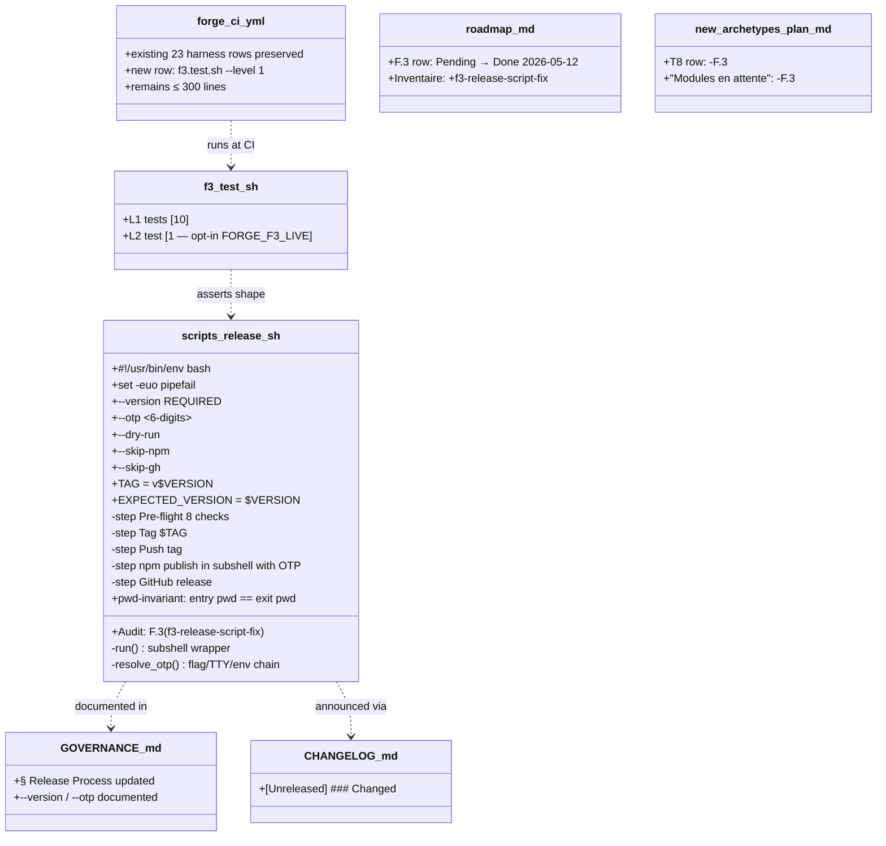
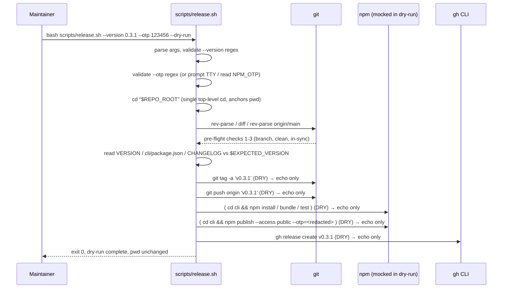

# Design: f3-release-script-fix
<!-- Status: archived -->
<!-- Schema: default -->

> Read alongside `specs.md` (FR-F3-* / NFR-F3-*) and
> `open-questions.md` (Q-001..Q-004). This document locks the
> implementation strategy and resolves Q-001 / Q-002 / Q-003 /
> Q-004 via ADR-F3-001..004.

## Architecture Decisions

### ADR-F3-001 — Delete old script `scripts/release-v0.3.0.sh` ; no symlink (resolves Q-001)

**Context** : Q-001 weighed two options for the legacy file
`scripts/release-v0.3.0.sh` once the new `scripts/release.sh`
ships :

- **Option A — Delete the old file.** Cleanest break ; one fewer
  file in `scripts/`.
- **Option B — Replace with a symlink** to `release.sh`. Preserves
  old invocation paths.

The symlink's apparent backward-compat value is **illusory** : the
new generic script REQUIRES `--version <X.Y.Z>` and exits 2
without it (FR-F3-021). A caller invoking
`bash scripts/release-v0.3.0.sh` against the symlink would fail
with the same usage error a missing-file error would produce.

**Decision** : **Option A — delete** `scripts/release-v0.3.0.sh`.

**Consequences** :
- ✅ Clean diff. No stale marker.
- ✅ No risk of the symlink becoming orphan in a future audit.
- ⚠️ Anyone (CI, runbook, alias) who had the old filename pinned
  will get `No such file or directory` at next invocation. The
  alternative — same failure with a `--version: missing` usage
  error — is no better.
- ✅ GOVERNANCE.md is updated in the same change (FR-F3-110), so
  the canonical invocation form is documented.

**Constitution Compliance** : Article XII (governance — the
documented release process is updated in lockstep). Article V
(audit trail — the rename + deletion are captured in a single
commit ; CHANGELOG entry FR-F3-120 records the breaking change).

---

### ADR-F3-002 — `cli/assets/scripts/` template OUT of scope (resolves Q-002)

**Context** : the mission brief asks F.3 to update an
adopter-side template at `cli/assets/scripts/release-v0.3.0.sh`
to mirror the new generic script while preserving the filename.
The brief explicitly allows surfacing a `[NEEDS CLARIFICATION:]`
if that file turns out not to exist.

**Investigation 2026-05-12** :

- `find cli/assets -type d -maxdepth 4` returns
  `cli/assets/scripts` → **does not exist**.
- `find . -name "release-v0.3.0.sh"` returns exactly one path :
  `scripts/release-v0.3.0.sh` (maintainer-side).
- Grep for `release-v0.3.0` across the repo finds only :
  references in `.forge/product/roadmap.md`, `GOVERNANCE.md`,
  the script itself, and CHANGELOG history.

So : the adopter template the brief mentions **does not exist
in this tree**. There is nothing to update or preserve.

**Decision** : **out of scope** for F.3. The script is currently
maintainer-side only. If a future change ships a release helper
to adopters as part of `forge init`, that change owns :
- Creating the `cli/assets/scripts/release.sh` template.
- Choosing the filename versioning policy (generic vs pinned).
- Adding the corresponding scaffold + harness wiring.

**Consequences** :
- ✅ No risk of inventing a non-existent template artifact
  (Article III.4 anti-hallucination compliance).
- ✅ F.3 scope stays tight on the bug fixes that motivated it.
- ⚠️ Adopter-side release tooling remains a gap. That gap
  predates F.3 and is not the bug F.3 is chartered to fix.

**Constitution Compliance** : Article III.4 (anti-hallucination
— the question was answered definitively before any code was
written). Article XII (governance — scope discipline preserved).

---

### ADR-F3-003 — Flag form `--version <X.Y.Z>` (resolves Q-003)

**Context** : Q-003 weighed two flag forms :

- **Option A — `--version <X.Y.Z>`**. Explicit ; matches
  `git tag` mental model ; trivial validation.
- **Option B — `--bump <patch|minor|major>`**. Implicit ; the
  script reads `VERSION`, computes the next semver, rewrites
  `VERSION`.

The Forge release workflow per `GOVERNANCE.md § Release Process`
step 1 has the **maintainer archive the change first**, which
seals a `## [X.Y.Z]` block in CHANGELOG.md and pins the next
version in `VERSION` + `cli/package.json` by hand. The script's
job is to **verify and execute** that decision, not to make it.

**Decision** : **Option A — `--version <X.Y.Z>`**.

**Consequences** :
- ✅ Validation reduces to one regex
  (`^[0-9]+\.[0-9]+\.[0-9]+$`).
- ✅ The script's pre-flight `VERSION` + `cli/package.json` +
  CHANGELOG checks (preserving the original script's checks 4,
  5, 7) cross-validate the supplied `--version` against the
  three pinned surfaces. A mismatch fails loudly.
- ✅ No shell-side semver arithmetic ; no risk of the script
  computing a different "next" version than the maintainer
  expected.
- ⚠️ The maintainer types `--version 0.3.1` rather than
  `--bump patch`. Five extra characters in exchange for
  explicitness. Acceptable.

**Constitution Compliance** : Article III.4 (the version is
explicit in every invocation — no implicit derivation that
could drift). Article V (audit trail — the invoked version
is visible in shell history).

---

### ADR-F3-004 — OTP fallback chain : flag → TTY → env-var ; fail loudly (resolves Q-004)

**Context** : `npm publish` requires a 6-digit OTP at release
time when 2FA is enabled. The mission brief sketches three
input mechanisms ; we lock the **order** and the
**failure mode**.

**Decision** : **flag → TTY → env-var, fail with exit 2
otherwise**.

Concretely (mirrors FR-F3-040..047) :

1. If `--otp <6-digits>` was passed, use it. Validate
   `^[0-9]{6}$` ; exit 2 on mismatch.
2. If `--otp` is absent AND `[ -t 0 ]` is true (stdin is a TTY)
   AND `--skip-npm` is absent AND `--dry-run` is absent :
   prompt with `read -rsp "npm 2FA OTP (6 digits, leave blank
   to skip): " OTP`. Empty → exit 2. Non-empty → validate
   per `^[0-9]{6}$`.
3. If `--otp` absent AND stdin is not a TTY AND `--skip-npm`
   absent AND `--dry-run` absent : consult `$NPM_OTP`.
   Empty → exit 2.
4. If `--skip-npm` is present OR `--dry-run` is present : do
   NOT collect the OTP at all. Publish is skipped (former) or
   simulated (latter).

The OTP, once resolved, is forwarded to `npm publish` via
`--otp="$OTP"`. The forwarding lives inside a subshell
`( cd cli && npm publish --access public --otp="$OTP" )` so
the `cd cli` cannot affect the parent shell (FR-F3-061).

**Non-disclosure** : the OTP value is treated as a secret. The
script :
- Does NOT echo the OTP value anywhere.
- Does NOT write it to a temp file.
- Does NOT activate `set -x` (which would leak the OTP via
  the publish command trace).
- In the dry-run path, renders the OTP placeholder as
  `<redacted>` or `<would-be-resolved-at-publish-time>`
  depending on whether `--otp` was supplied.

**Why fail loudly rather than silent skip** :
- Silent OTP omission would invoke `npm publish` interactively,
  re-hanging the script — the exact bug F.3 is fixing.
- A maintainer running with `--skip-npm` is opting out
  explicitly ; that's the clear signal.

**Why interactive `read -rsp` over `read -sp`** :
- `-r` prevents backslash mangling (a leading-zero OTP could
  otherwise be misinterpreted).
- `-s` (silent) hides the input ; the secret is never on
  screen.

**Consequences** :
- ✅ Automation-friendly : pass `--otp` from a vault tool.
- ✅ CI-friendly : set `NPM_OTP` from a CI secret store.
- ✅ Interactive-friendly : leave the flag off, type the OTP at
  the prompt.
- ✅ The OTP is never logged or echoed.
- ⚠️ Maintainer must remember either to pass `--otp`, run on a
  TTY, or export `NPM_OTP`. Failure is loud (exit 2 with
  clear message), so the failure mode is obvious.

**Constitution Compliance** : Article III.4 (the OTP-required
state is explicit — failure exits 2 with a clear message
rather than silently re-hanging on stdin). Article V (audit
trail — the OTP source is logged as
`OTP: provided via --otp` or `OTP: prompted on TTY` or
`OTP: resolved from $NPM_OTP`, but the **value** never is).

---

## Implementation strategy

### Phase 1 — RED harness + CI registration

Create `.forge/scripts/tests/f3.test.sh` with **10 L1 stubs all
returning `_not_implemented`** + **1 L2 stub returning 0
(skip-pass)** by default per FR-F3-083. Register the harness in
`.github/workflows/forge-ci.yml` `harness` matrix immediately
after `i5.test.sh` with `--level 1`.

**Exit gate** : `bash .forge/scripts/tests/f3.test.sh --level 1`
exits 1 with `Failed: 10 / Passed: 0`. `verify.sh` overall PASS
unchanged. `constitution-linter.sh` OVERALL PASS unchanged.
`forge-ci.yml` line count ≤ 300.

### Phase 2 — Script rename + refactor (production code)

1. Copy `scripts/release-v0.3.0.sh` to `scripts/release.sh` (git
   mv would be cleaner ; `git mv` preserves blame).
2. Update the audit comment to `F.3 (f3-release-script-fix)`.
3. Update the header comment block (lines 2-22) to describe the
   new `--version` + `--otp` flags + the OTP fallback chain.
4. Refactor the argument-parsing `while` loop :
   - Add `--version <X.Y.Z>` (required) + `--version=<X.Y.Z>`.
   - Add `--otp <6-digits>` + `--otp=<6-digits>`.
   - Validate both with regex ; exit 2 on mismatch.
5. Refactor `run()` to wrap `eval` in a subshell (FR-F3-060) :
   ```bash
   run() {
     if [ "$DRY_RUN" = "1" ]; then
       # Redact OTP in the dry-run trace.
       local rendered="$*"
       if [ -n "${OTP:-}" ]; then
         rendered="${rendered//$OTP/<redacted>}"
       fi
       echo "    [dry-run] $rendered"
     else
       ( eval "$@" )
     fi
   }
   ```
6. Rewrite the publish block (original line 144-168) :
   - The original `cd cli && npm install` / `cd cli && npm run
     bundle` / `cd cli && npm test` go through `run()`, so they
     already become subshells under the refactored `run()`.
   - The original `cd cli && npm publish ... && cd "$REPO_ROOT"`
     (line 166) becomes :
     ```bash
     if [ "$DRY_RUN" = "1" ]; then
       echo "    [dry-run] cd cli && npm publish --access public --otp=<redacted>"
     else
       ( cd cli && npm publish --access public --otp="$OTP" )
     fi
     ok "@sdd-forge/cli@$EXPECTED_VERSION published to npm"
     ```
7. Add an OTP-collection block immediately before the publish
   step (after `npm whoami` check), gated by the
   flag → TTY → env-var chain per ADR-F3-004.
8. Remove the date check `^## \[0\.3\.0\] — 2026-05-01` from the
   CHANGELOG sanity check ; replace with the version-only
   match `^## \[$EXPECTED_VERSION\]`.
9. Delete `scripts/release-v0.3.0.sh` (the rename completes ;
   no symlink).

**Exit gate** : 9 of 10 L1 tests flip GREEN. The 10th (CHANGELOG
entry) waits for Phase 3.

### Phase 3 — Doc + governance + CHANGELOG + roadmap

1. Update `GOVERNANCE.md § Release Process` (lines 134-154) :
   - Replace `scripts/release-v0.3.0.sh` references with
     `scripts/release.sh`.
   - Document `--version <X.Y.Z>` requirement.
   - Document `--otp <6-digits>` flag + OTP fallback chain.
2. Append `CHANGELOG.md [Unreleased]` entry citing the rename
   + the subshell-isolation fix + the OTP plumbing.
3. Update `.forge/product/roadmap.md` :
   - Line 192 F.3 row : Pending → Done 2026-05-12.
   - Line 173 T8 row : remove trailing `, F.3` ; add inline
     note.
   - Inventaire table line ~472 : new row
     `f3-release-script-fix | archived | T2 / T3 tooling`.
   - v0.3.x deliveries table line ~123 : new row for F.3.
4. Update `docs/new-archetypes-plan.md` :
   - Line 470 : flip F.3 in "Modules toujours en attente".
   - Line 1120 : T8 row module list + inline note.
   - Inventaire table line ~486 : optional new row.

**Exit gate** : all 10 L1 tests GREEN. L2 stays gated (skip-
pass). `verify.sh` overall PASS preserved (no FAIL ; Passed
total ≥ baseline). `constitution-linter.sh` OVERALL PASS
preserved.

### Phase 4 — Final gates + archive

Run `verify.sh`, `constitution-linter.sh`, `f3.test.sh`,
shellcheck (if available locally — best effort), assert
`forge-ci.yml` ≤ 300 lines.

Flip `.forge.yaml` `status: archived` with all timeline dates
set to `2026-05-12`. Single archive commit.

---

## L1 / L2 test catalogue

### L1 (10 tests — hermetic, ≤ 3 s total)

| # | Test name                                | FR/NFR ID                                          |
|---|------------------------------------------|----------------------------------------------------|
| 1 | `_test_f3_001_script_presence`           | FR-F3-001                                          |
| 2 | `_test_f3_002_old_script_removed`        | FR-F3-004                                          |
| 3 | `_test_f3_003_audit_comment`             | FR-F3-002                                          |
| 4 | `_test_f3_004_strict_mode`               | FR-F3-003                                          |
| 5 | `_test_f3_005_version_flag_handling`     | FR-F3-020..023                                     |
| 6 | `_test_f3_006_otp_flag_handling`         | FR-F3-040..043                                     |
| 7 | `_test_f3_007_no_eval_cd`                | FR-F3-063                                          |
| 8 | `_test_f3_008_top_level_cd_count`        | FR-F3-061 / FR-F3-062                              |
| 9 | `_test_f3_009_npm_publish_otp_forward`   | FR-F3-044                                          |
| 10 | `_test_f3_010_changelog_entry`          | FR-F3-120                                          |

Total : **10 L1 tests** at the FR-F3-082 minimum of 10. Each
test function maps to one or more FR identifiers via the
MANIFEST comments.

### L2 (1 fixture-based test, opt-in)

| # | Test name                                | FR/NFR ID                                          |
|---|------------------------------------------|----------------------------------------------------|
| 1 | `_test_f3_l2_dry_run_otp_forward`        | FR-F3-044 / FR-F3-047 / ADR-F3-004                 |

The L2 test :
1. Check `--level` includes 2 ; otherwise not invoked.
2. Check `FORGE_F3_LIVE=1` ; otherwise emit
   `[INFO: L2 dry-run gated by FORGE_F3_LIVE=1, skipping]`,
   return 0 (PASS as skip).
3. Materialise a tmpdir fixture with a fake `VERSION` file
   (`0.0.1`), a fake `CHANGELOG.md` containing
   `## [0.0.1]`, a fake `cli/package.json` carrying
   `"version": "0.0.1"`, a fake `.git/` (or skip the git
   pre-flight via `--skip-gh` + monkey-patched `git` shim).
4. Invoke `bash scripts/release.sh --dry-run --version 0.0.1
   --otp 654321 --skip-gh` from the tmpdir.
5. Capture stdout/stderr ; assert the dry-run trace contains
   `npm publish` AND `--otp=<redacted>` AND does NOT contain
   the literal `654321`.

The L2 test is intentionally **dry-run only** : we never
exercise the real `npm publish` (would require an npm registry
mock or a real publish). Dry-run alone proves the OTP plumbing
+ redaction contract.

---

## Component Design



---

## Data flow — release.sh invocation (dry-run path)



---

## Dependencies on shipped state

| Dep                                     | Version / status                  | release.sh consumes                                                                  |
|-----------------------------------------|-----------------------------------|--------------------------------------------------------------------------------------|
| `git`                                   | system                            | `rev-parse`, `tag`, `push`, `fetch`, `ls-remote`                                     |
| `npm`                                   | system (Node 20.x ships npm 10.x) | `whoami`, `install`, `run bundle`, `test`, `publish --otp=`                          |
| `gh` (optional)                         | system or absent                  | `release create` (falls back to manual instructions if absent — preserves original) |
| `bash`                                  | system                            | strict mode, subshells, `read -rsp`                                                  |
| `awk`, `grep`, `sed`                    | system                            | CHANGELOG section extraction (preserves original lines 178-185)                      |
| `.forge/scripts/verify.sh`              | always present                    | invoked from pre-flight check 8 (preserved verbatim)                                  |
| `.forge/scripts/constitution-linter.sh` | always present                    | invoked from pre-flight check 8 (preserved verbatim)                                  |

No new external dependency. The `--otp=<value>` flag is part
of `npm publish` since `npm@6` ; current Forge CI Node 20.18.0
ships `npm@10.x`, well above the floor.

---

## Out of scope (deferred)

- **`cli/assets/scripts/` adopter template** — does not exist
  in current tree (ADR-F3-002 ; verified 2026-05-12).
- **CI release pipeline / GitHub Actions release workflow** —
  the release stays maintainer-driven per GOVERNANCE.md.
- **Sigstore / cosign signing** of the published npm tarball.
- **GitHub release notes generator beyond the existing
  CHANGELOG section extraction**.
- **Constitution amendment.** No Article touched.

---

## Constitutional Compliance per Article

- **Article I (TDD)** — Phase 1 captures full RED witness (10
  tests FAIL) before any production code.
- **Article II (BDD)** — Gherkin scenario in `proposal.md`
  covers the maintainer's release flow.
- **Article III.4 (anti-hallucination)** — Four Q-NNN tracked
  and resolved at design time. Q-002 specifically prevented
  invention of a non-existent template artifact ; no inline
  `[NEEDS CLARIFICATION:]` marker in `proposal.md` /
  `specs.md` / this file.
- **Article V (audit trail)** — every task tagged
  `[Story: FR-F3-XXX]` in `tasks.md` ; script + harness both
  carry the `<!-- Audit: F.3 (...) -->` anchor ; CHANGELOG +
  GOVERNANCE updated in lockstep with the rename.
- **Article VIII (infrastructure)** — the script is a
  maintainer-side bash helper ; no service / daemon /
  privileged ops introduced.
- **Article XI (AI-first)** — N/A.
- **Article XII (governance)** — `GOVERNANCE.md § Release
  Process` is updated to reflect the new invocation form.
  The Release Process itself remains BDFL-driven ; no
  Article amended.

No constitutional amendment required.
