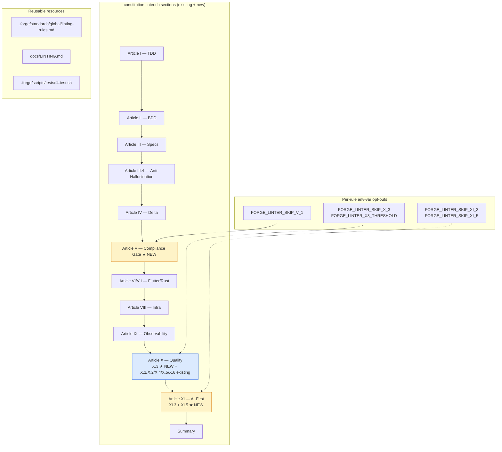
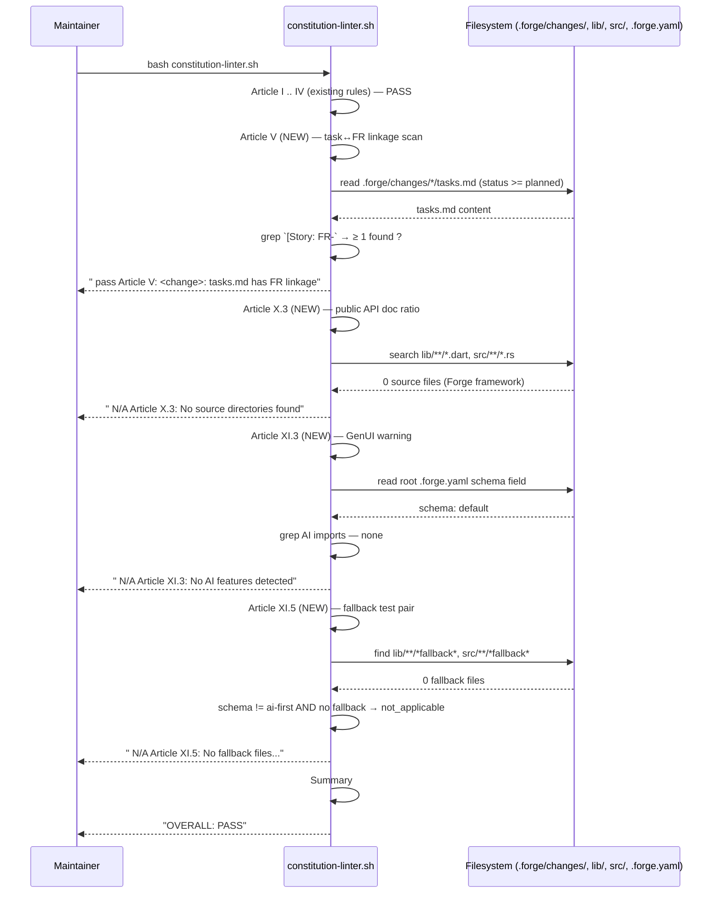

# Design: f4-linter-extension

**Agents pertinents** : Eris (Test Architect) pour la stratégie L1+L2 fixture-based. Pas d'autre agent : F.4 est un script shell + bash + Python inline.

**Périmètre** : 4 nouvelles règles dans `constitution-linter.sh`, 1 standard, 1 doc, 1 harness.

**Effort** : `L` — single-session, 1 commit final.

---

## Architecture Decisions

### ADR-001 : 4 règles séparées dans 4 sections distinctes

**Context** : `constitution-linter.sh` suit déjà le pattern une-section-par-article (Article I, II, III, IV, VI, VII, VIII, IX, X, XI). F.4 ajoute 4 règles couvrant V.1, X.3, XI.3, XI.5.

**Decision** : 4 sections distinctes, chacune isolée :
1. Section "Article V (Constitutional Compliance Gate)" — task↔FR linkage.
2. Section "Article X.3 (Public API Documentation)" — ratio Dart/Rust.
3. Section "Article XI.3 (Generative UI)" — warning heuristique.
4. Section "Article XI.5 (Mandatory Fallback Tested)" — name-based pair.

Chaque section commence par `echo "" ; echo "Article X (...)"` (cohérent avec pattern existant).

**Consequences** :
- (+) Lisible, isolable.
- (+) Chaque règle peut être désactivée indépendamment via env var (ADR-002).
- (-) ~150 lignes additionnelles. Acceptable.

**Constitution Compliance** : ✅ Article IV (delta-based, additif).

---

### ADR-002 : Opt-out via env vars per-règle

**Context** : adopters peuvent avoir des contraintes spécifiques (legacy code sans doc, AI features sans schema déclaratif, etc.). Forcer FAIL bloquerait l'adoption.

**Decision** : 4 env vars d'opt-out :
- `FORGE_LINTER_SKIP_V_1=1`
- `FORGE_LINTER_SKIP_X_3=1`
- `FORGE_LINTER_SKIP_XI_3=1`
- `FORGE_LINTER_SKIP_XI_5=1`

Plus 1 env var de seuil :
- `FORGE_LINTER_X3_THRESHOLD=80` (défaut)

Chaque section commence par check de l'env var ; si activée, émet `skipped via FORGE_LINTER_SKIP_<rule>` et passe à la section suivante.

**Consequences** :
- (+) Adopteurs progressifs ne sont pas bloqués.
- (+) Pattern reproductible pour futures règles.
- (-) 4 env vars à documenter. OK, le standard les liste.

**Constitution Compliance** : ✅.

---

### ADR-003 : Heuristic implementations (bash + Python inline)

**Context** : règles X.3 (public API doc), XI.3 (GenUI schema-driven), XI.5 (fallback testing) demandent des heuristiques non-triviales. Options :
1. AST parser (tree-sitter, dart analyze, syn) — précis mais lourd.
2. Heuristique grep + Python inline — fragile mais sans nouvelle dep.

**Decision** : option 2 — bash + Python inline (cohérent avec verify.sh + validate-change-yaml.sh).

**Consequences** :
- (+) Pas de nouvelle dep (NFR-LE-002).
- (+) Cohérent pattern.
- (-) Heuristiques fragiles : multi-line declarations, complex generics, attribute macros peuvent causer faux positifs/négatifs. Mitigé par :
  - Ratio threshold (X.3) tolère imperfection.
  - Warning-only (XI.3) ne bloque pas.
  - Name-based pair (XI.5) prévisible si convention respectée.

**Constitution Compliance** : ✅.

---

### ADR-004 : X.3 ratio threshold 80% configurable

**Context** : Q-002 résolue. Threshold 80% est le compromis adoption / qualité.

**Decision** :
- Default 80%.
- Override via `FORGE_LINTER_X3_THRESHOLD` env var (entier 0-100).
- Lister les 5 premiers symboles non-documentés (FAIL message).

**Algorithme** :
```python
public_count = count_public_decls(source_files)
documented_count = count_decls_with_/// (source_files)
ratio = (documented_count / public_count) * 100
if ratio < threshold: fail
```

**Consequences** :
- (+) Adoption progressive possible (start at 50%, grow).
- (-) Le ratio peut osciller avec micro-changes. Acceptable.

**Constitution Compliance** : ✅ Article X.3.

---

### ADR-005 : XI.3 = warn-only

**Context** : Q-003 résolue. XI.3 GenUI est trop dynamique pour static linting.

**Decision** : émettre `warn` (pas `fail`) — incrémente WARN counter, n'affecte pas exit code.

**Heuristique de détection** :
1. Lire root `.forge.yaml` ; si `schema: ai-first` → AI features assumed present.
2. Sinon, grep récursif `anthropic|openai|gpt-|claude|@google/genai|llm|langchain` dans `lib/**/*.dart`, `src/**/*.rs`, `package.json`, `pubspec.yaml`, `Cargo.toml`.

Si aucune détection → `not_applicable`.

Si AI détecté :
- Grep `Widget|render` dans `lib/**/*.dart` ou `src/**/*.{ts,tsx,jsx}`.
- Grep `*.schema.json` references.
- Si UI rendering ET pas de schema JSON → `warn`.
- Sinon → `pass`.

**Consequences** :
- (+) Adopteurs voient le warning sans blocage.
- (-) Faux positifs possibles ; warning level les rend acceptables.

**Constitution Compliance** : ✅ Article XI.3 (limité par nature).

---

### ADR-006 : XI.5 = name-based pair `*fallback*` ↔ `*fallback*_test*`

**Context** : Q-004 résolue. Convention de nommage simple et visible.

**Decision** :
- Sources : `lib/**/*[fF]allback*.dart`, `src/**/*[fF]allback*.rs`.
- Tests Dart : pour chaque source, chercher `test/**/*[fF]allback*_test*.dart` OU
  `test/**/*[fF]allback*.dart`.
- Tests Rust : `tests/**/*[fF]allback*.rs` OU le fichier source contient `#[cfg(test)]` ou `#[test]`.

Si source sans pair → FAIL.

Cas particulier `schema: ai-first` :
- Si le projet déclare `schema: ai-first` MAIS aucun fichier `*fallback*` → FAIL "Article XI.5 requires a fallback implementation in ai-first projects".

**Consequences** :
- (+) Convention apprenable, lisible.
- (-) Adopteurs avec autre nommage (`offline_*`, `degraded_*`) bloqués → opt-out via env var.

**Constitution Compliance** : ✅ Article XI.5.

---

### ADR-007 : Standard `linting-rules.md`

**Context** : F.4 ajoute des règles ; standard nécessaire pour documenter (Article XII gouvernance).

**Decision** : nouveau standard `.forge/standards/global/linting-rules.md`. Section dédiée par règle. Englobe les règles existantes ET les 4 nouvelles. Indexé dans `index.yml`.

**Consequences** :
- (+) Référence unique pour le linter.
- (-) Maintenance : à mettre à jour quand nouvelles règles arrivent (F.5+).

**Constitution Compliance** : ✅ Article XII (governance amendment process for new rules).

---

### ADR-008 : Single-session, 1 commit final

**Context** : effort `L` (~+1500-2500 LOC). Comparable à F.2.

**Decision** : single-session.

**Order** :
1. Harness RED (`f4.test.sh` ~22 tests).
2. Section linter "Article V" (V.1 task ↔ FR linkage).
3. Section linter "Article X.3" (public API doc ratio).
4. Section linter "Article XI.3" (GenUI warning heuristic).
5. Section linter "Article XI.5" (fallback name-based pair).
6. Standard `linting-rules.md` + index entry.
7. Doc `LINTING.md`.
8. CI registration.
9. Verify + linter global GREEN + zéro régression.
10. Spec consolidée + roadmap + plan + CHANGELOG + status flip.
11. Commit + push.

**Consequences** : 1 commit final.

**Constitution Compliance** : ✅.

---

## Component Design



---

## Data Flow

### Flow 1 — Lint full run (framework repo)



### Flow 2 — Lint with violations

```mermaid
sequenceDiagram
    participant Dev as Maintainer
    participant L as constitution-linter.sh
    participant Project as adopter project

    Dev->>L: bash constitution-linter.sh
    L->>Project: read tasks.md for change `feat-x`
    Project-->>L: tasks.md without [Story: FR-...]
    L-->>Dev: "  ✗  V: feat-x: tasks.md missing [Story: FR-XXX] audit trail"
    L->>Project: count public Dart/Rust symbols vs documented
    Project-->>L: 8/12 documented (66%)
    L-->>Dev: "  ✗  X.3: ratio 66% < 80%; missing: lib/foo.dart:14 class Foo, ..."
    L->>Project: detect AI imports + Widget without schema.json
    Project-->>L: matches found
    L-->>Dev: "  ⚠  XI.3 warning: AI features + UI rendering without coexisting *.schema.json"
    L->>Project: find lib/translation_fallback.dart
    Project-->>L: no test/translation_fallback_test.dart
    L-->>Dev: "  ✗  XI.5: lib/translation_fallback.dart has no matching *fallback*_test*"
    L-->>Dev: "OVERALL: FAIL (3 violations + 1 warning)"
```

---

## Testing Strategy

### Niveau L1 — tests structurels hermétiques

**Harnais** : `.forge/scripts/tests/f4.test.sh --level 1`
**Volume** : ≥ 16 tests L1
**Couverture** :
- Section présente dans linter (4 tests, un par règle).
- Standard existe + 6 H2 sections.
- Index entry.
- Doc présente avec keywords.
- CI workflow registers f4.test.sh.
- Env var opt-outs documentés dans le standard.

### Niveau L2 — fixture-based (linter exécuté sur tmpdirs)

**Volume** : ≥ 6 tests L2 (1-2 par règle).

Approche commune : créer un tmpdir avec `.forge/`, `lib/`, `test/` minimal pour exercer une règle, lancer le linter avec `FORGE_ROOT=$tmp`, vérifier exit code + stderr.

Tests prévus :
- `_test_f4_l2_v1_fail` : change `planned` sans `[Story: FR-` → exit ≠ 0.
- `_test_f4_l2_v1_pass` : change `planned` avec `[Story: FR-001]` → ne contribue pas au FAIL count.
- `_test_f4_l2_x3_fail` : lib/ avec ratio < 80% → FAIL X.3.
- `_test_f4_l2_x3_threshold_env` : `FORGE_LINTER_X3_THRESHOLD=50` → ratio 60% PASS.
- `_test_f4_l2_xi3_warn` : AI imports + Widget sans schema → WARN (pas FAIL).
- `_test_f4_l2_xi5_fail` : `lib/foo_fallback.dart` sans test → FAIL.
- `_test_f4_l2_xi5_pass` : pair source + test → PASS.
- `_test_f4_l2_optout` : `FORGE_LINTER_SKIP_X_3=1` → règle skip, pas de FAIL.

### CI integration

`forge-ci.yml` ajoute `f4.test.sh --level 1,2`.

---

## Standards Applied

- **Article I (TDD)** : `f4.test.sh` RED→GREEN.
- **Article II (BDD)** : 6 scénarios.
- **Article III (Specs Before Code)** : ce design suit specs.
- **Article III.4** : 4 questions résolues via F.1.
- **Article IV (Delta-based)** : ADDED-only ; sections existantes du linter intactes.
- **Article V (Process Gates)** : F.4 RENFORCE cet article.
- **Article X (Quality)** : NFR perf ≤ 3s.
- **Article XII (Governance)** : v1.1.0.

---

## Risks & Mitigations

| Risque | Probabilité | Impact | Mitigation |
|---|---|---|---|
| Heuristique X.3 fragile sur multi-line decl | Moyen | Faible | Ratio 80% tolère imperfection ; threshold env var |
| Heuristique XI.3 faux positifs | Élevé | Faible | Warning only (pas FAIL) |
| Convention `*fallback*` trop stricte | Moyen | Moyen | Opt-out env var ; doc explicite |
| Linter perf > 3s | Faible | Moyen | NFR-LE-001 budget ; mesure avant/après ; les scans bash sont rapides |
| Env vars non documentés | Faible | Faible | Standard les liste explicitement |
| Test L2 flaky (mktemp + bash linter) | Faible | Moyen | Pattern éprouvé dans f1/f2 ; mêmes helpers |

---

## Implementation Order (preview pour `/forge:plan`)

1. Harness RED `f4.test.sh` ~22 tests, 0/22 PASS.
2. Section "Article V" dans linter.
3. Section "Article X.3" dans linter.
4. Section "Article XI.3" dans linter (warning, pas fail).
5. Section "Article XI.5" dans linter.
6. Standard `linting-rules.md` + index entry.
7. Doc `LINTING.md`.
8. CI registration.
9. Verify global + 13 harnais + linter OVERALL PASS.
10. Archive admin (spec consolidée + roadmap + plan + CHANGELOG + status flip).
11. Commit + push.

---

**Status** : `designed`. Next : `/forge:plan f4-linter-extension`.
