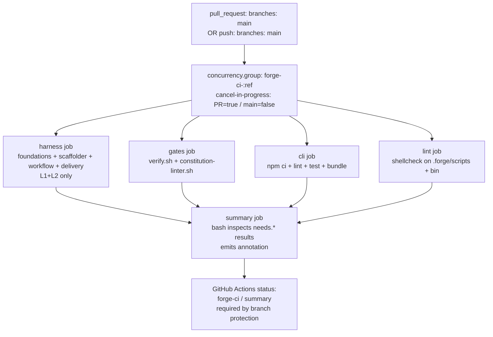
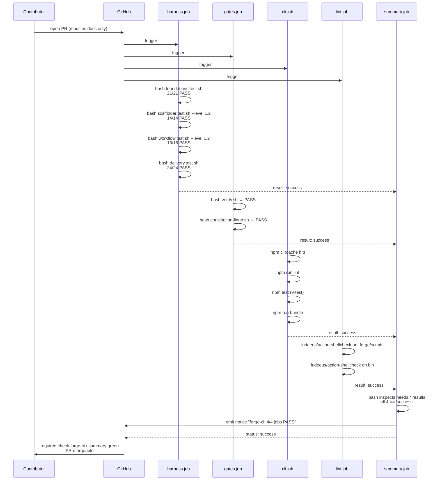
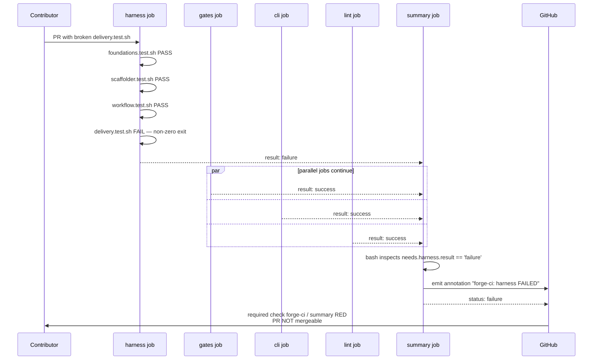

# Design: g1-forge-ci
<!-- Audit: G.1 -->
<!-- Agents invoked: Atlas (CI workflow architecture), Eris (test strategy + g1.test.sh shape), Aegis (permissions + supply-chain) -->
<!-- Depends on: b1-delivery (archived) — workflow conventions inherited from infra/ci-workflows.md -->

## Architecture Decisions

### ADR-001: Single workflow file with five jobs, not five separate workflows

- **Context** — FR-CI-001 prescribes 5 jobs : `harness`, `gates`,
  `cli`, `lint`, `summary`. We could ship them as five
  workflow files or as five jobs in a single file.

- **Options Considered** —
    - Option A — five workflow files (`forge-harness.yml`,
      `forge-gates.yml`, etc.). Each gets its own GitHub
      Actions status. Branch protection would require five
      required checks. Heavier UI surface, harder to add a
      new check (every adopter rebases their branch protection
      config), but each workflow can be re-run independently
      from the UI.
    - Option B — single file with 5 jobs + 1 summary. One
      required check (`forge-ci / summary`) covers all four
      gates. Branch protection trivial. Re-running a single
      job uses the GitHub Actions UI's per-job re-run.

- **Decision** — **Option B**. One file, five jobs. The
  `summary` job's `needs:` array makes the dependency
  explicit. Branch protection requires only `forge-ci / summary`.

- **Consequences** —
    - ✅ Single required check minimises branch-protection
      churn when adding a 6th gate (just extend `summary.needs`).
    - ✅ Maintainer reads one YAML file to understand the
      whole gate.
    - ✅ Concurrency control applies to the whole gate
      uniformly.
    - ⚠️ Re-running just one of the 4 worker jobs needs the
      GitHub Actions UI's "Re-run failed jobs" button.
      Acceptable.

- **Constitution Compliance** — Article V (gates), Article X
  (developer experience).

---

### ADR-002: `cancel-in-progress` asymmetry via conditional expression, not split workflows

- **Context** — FR-CI-007 mandates `cancel-in-progress: true`
  for `pull_request` events and `false` for `push: main`. Two
  implementation patterns exist.

- **Options Considered** —
    - Option A — split into `forge-ci-pr.yml` (cancel:true) and
      `forge-ci-main.yml` (cancel:false). Duplicates ~80% of
      content. Two summary statuses. Branch protection now
      needs two required checks (or just the PR one — but
      then push:main has no required check).
    - Option B — single workflow with conditional expression :
      `cancel-in-progress: ${{ github.event_name == 'pull_request' }}`.
      GitHub Actions evaluates the expression to `true` for
      PR events and `false` for push events. Single file,
      single status name, no duplication.

- **Decision** — **Option B**. Conditional expression. GitHub
  Actions has supported boolean evaluation in the
  `concurrency` block since the feature shipped (2021).

- **Consequences** —
    - ✅ Compact, idiomatic, single source of truth.
    - ✅ Nightly main pushes do not cancel each other (matches
      the spirit of `b1-delivery` `forge-integration.yml`'s
      `cancel-in-progress: false`).
    - ⚠️ The expression is small, but the asymmetry is subtle.
      Inline comment in the workflow explains the rationale.

- **Constitution Compliance** — Article X.

---

### ADR-003: Standard placement — new `global/forge-self-ci.md`, not extension of `infra/ci-workflows.md`

- **Context** — Open question from spec : where to document
  Forge's own CI conventions ?

- **Options Considered** —
    - Option A — extend `infra/ci-workflows.md` with a
      § "Forge's own CI" section. Keeps CI standards in one
      file but mixes audiences (adopters scaffolding their
      own projects vs Forge maintainers). The "Per-layer paths
      filter" section explicitly does not apply to Forge ;
      mixing the two would dilute the standard.
    - Option B — new file `.forge/standards/global/forge-self-ci.md`.
      Cleanly separates the two audiences. Tiny standard
      (~80 lines) but with a clear, single-purpose scope.

- **Decision** — **Option B**. New `global/forge-self-ci.md`.
  Three `H2` sections : "Workflow shape", "What's intentionally
  different from `infra/ci-workflows.md`", "Branch protection".

- **Consequences** —
    - ✅ Adopters reading `infra/ci-workflows.md` are not
      distracted by Forge-internal concerns.
    - ✅ The new standard's purpose is single and clear.
    - ✅ `index.yml` gains one entry (scope: meta or global).
    - ⚠️ Two documents instead of one. Acceptable — the
      audience split makes this a real distinction, not
      bureaucracy.

- **Constitution Compliance** — Article V (standards as
  single source of truth).

---

### ADR-004: `g1.test.sh` is a standalone harness, not a section in `delivery.test.sh`

- **Context** — Open question from spec : where does the
  workflow-shape validator live ?

- **Decision** — **Standalone** `.forge/scripts/tests/g1.test.sh`.
  Mirrors ADR-010 of `b1-delivery` (every change ships its
  own harness sourcing `_helpers.sh`).

- **Consequences** —
    - ✅ Each harness is independently runnable and reviewable.
    - ✅ Failure attribution is unambiguous (`g1.test.sh
      [FAIL] ...` clearly belongs to G.1).
    - ⚠️ Five harnesses now exist. Extraction of a
      `_scaffolder_lib.sh` (deferred carry-over) becomes
      slightly more attractive ; tracked in CHANGELOG.

- **Constitution Compliance** — Article I.

---

### ADR-005: `ludeeus/action-shellcheck` for the lint job

- **Context** — FR-CI-005 mandates `shellcheck` ; the action
  ecosystem offers several wrappers.

- **Options Considered** —
    - Option A — `ludeeus/action-shellcheck`. Well-maintained,
      version-pinnable, default severity configurable, supports
      glob-based scope. ~1.5K stars on GitHub.
    - Option B — custom install (`apt-get install -y shellcheck`)
      then bash loop. More verbose (~10 lines), but no
      third-party action dependency.
    - Option C — `koalaman/shellcheck-precommit`. Designed for
      pre-commit hooks, awkward in CI.

- **Decision** — **Option A**. `ludeeus/action-shellcheck`
  pinned to a tag (`@2.0.0` or the current latest stable at
  implementation time). Inputs : `severity: warning`,
  `scandir: '.forge/scripts'` for one invocation, `scandir:
  './bin'` for a second invocation (the action does not
  natively support multiple scandirs in one call).

- **Consequences** —
    - ✅ Two short steps in the lint job, easy to read.
    - ✅ Version pin per FR-CI-009 / NFR-CI-005.
    - ⚠️ Two invocations (one per scope) instead of one.
      Trade-off accepted for clarity.

- **Constitution Compliance** — Article X.

---

### ADR-006: Top-level `permissions: contents: read`, no per-job overrides

- **Context** — FR-CI-001 requires minimal permissions ;
  NFR-CI-005 forbids broader scopes. Permissions can be
  declared at workflow root or per-job.

- **Decision** — **Workflow-level only**. `permissions:
  contents: read` at the top of the file. No per-job
  overrides. None of the 5 jobs need to write anything,
  comment on PRs, push tags, etc.

- **Consequences** —
    - ✅ Single line, single source of truth, audit trivial.
    - ✅ Aegis security pass : the workflow cannot escalate
      via a compromised action.
    - ⚠️ A future change that needs e.g. `pull-requests: write`
      (to post a comment) MUST escalate via a separate Forge
      change with explicit Aegis review. The friction is
      desirable.

- **Constitution Compliance** — Article X (supply-chain hygiene).

---

### ADR-007: Summary job uses bash to inspect `needs.<job>.result`

- **Context** — FR-CI-006 requires `summary` to fail when any
  upstream job is not exactly `'success'`. Two patterns.

- **Options Considered** —
    - Option A — `if: ${{ contains(needs.*.result, 'failure') ||
      contains(needs.*.result, 'cancelled') || contains(needs.*.result,
      'skipped') }}` on the summary job. Job either runs (and
      reports failure) or doesn't run (status: skipped). The
      "skipped" outcome is itself a problem for branch
      protection — it's not "success".
    - Option B — summary job ALWAYS runs (no `if:`), and its
      first step is a bash script that reads each
      `${{ needs.<job>.result }}` via env vars and exits
      non-zero if any is not `success`. The bash script also
      emits a structured annotation summarising the result.

- **Decision** — **Option B**. Summary always runs, reports a
  meaningful annotation, and fails explicitly. Branch protection
  consistently sees `success` or `failure`, never `skipped`.

- **Consequences** —
    - ✅ Single GitHub Actions outcome that branch protection
      can rely on.
    - ✅ The summary annotation gives the maintainer a one-line
      readout of what failed without clicking into per-job
      logs.
    - ⚠️ The summary job runs even when an upstream is
      cancelled (e.g. PR force-pushed mid-flight). The bash
      script handles that gracefully — it explains in the
      annotation that the run was superseded.

- **Constitution Compliance** — Article V.

---

### ADR-008: `actions/setup-node@v4` built-in cache, not explicit `actions/cache@v4`

- **Context** — FR-CI-004 requires `npm ci` caching. Both
  patterns are idiomatic.

- **Decision** — **Built-in `cache: 'npm'` with
  `cache-dependency-path: cli/package-lock.json`**.
  `actions/setup-node@v4` handles the cache lifecycle and
  picks the right Node-version-aware key automatically.

- **Consequences** —
    - ✅ One step instead of two (no separate `actions/cache@v4`
      block).
    - ✅ Cache key includes the Node version, so an `.nvmrc`
      bump invalidates the cache automatically (correct
      semantics).
    - ✅ NFR-CI-004 (cache hit rate ≥ 95%) achievable.
    - ⚠️ Coupling the cache to `actions/setup-node@v4` means
      bumping the action invalidates the cache too. Acceptable
      — bumps are rare and a one-time cache miss is harmless.

- **Constitution Compliance** — Article X.

---

### ADR-009: Forge does NOT run the archetype reference workflows on itself

- **Context** — `b1-delivery` ships four reference workflows
  for `full-stack-monorepo` projects. A naive reading might
  expect Forge itself to run them too.

- **Decision** — **Forge runs `forge-ci.yml` only**. The
  archetype reference workflows live under
  `.forge/templates/archetypes/full-stack-monorepo/.github/workflows/`
  with `.tmpl` extension and are scaffolded into target
  projects, not Forge's own `.github/workflows/`. This is
  the inverse formalisation of `b1-delivery` ADR-001.

- **Consequences** —
    - ✅ The archetype reference workflows have a
      `dorny/paths-filter` step looking for `backend/**` etc.
      which would match nothing on Forge ; running them on
      Forge would mean every job skips, which is useless.
    - ✅ `forge-ci.yml` is purpose-built for the Forge repo
      shape (flat, single-language Node/CLI + many shell
      harnesses), not a contortion of an archetype workflow.

- **Constitution Compliance** — Article X (right tool for the
  right job).

---

### ADR-010: PyYAML install repeated per job, not factored into a composite action

- **Context** — `harness` and `gates` jobs both need
  `python3 -m pip install pyyaml`. Composite actions are an
  option to factor this out.

- **Decision** — **Repeat the step in each job**. Two jobs ×
  3 lines (`uses: actions/setup-python@v5` + `with:
  python-version: '3.11'` + `run: pip install pyyaml`).
  ~6 lines of "duplication" — acceptable.

- **Consequences** —
    - ✅ Workflow stays in one file (no
      `.github/actions/setup-python-pyyaml/action.yml`
      sub-directory to discover).
    - ✅ NFR-CI-002 (≤250 lines) satisfied with margin.
    - ⚠️ A future change adding a 3rd job needing PyYAML
      would justify the composite extraction. Re-evaluate
      then.

- **Constitution Compliance** — Article X (avoid premature
  abstraction).

---

## Component Design

### Workflow job graph



### Files created or modified by this change

```
.github/workflows/forge-ci.yml                  ← NEW (~180 lines, FR-CI-001..009)

cli/.nvmrc                                      ← NEW (1 line, Node 20.x patch-pinned)

.forge/standards/global/forge-self-ci.md        ← NEW (~90 lines, ADR-003)
.forge/standards/index.yml                      ← MODIFIED (+1 entry)

.forge/scripts/tests/g1.test.sh                 ← NEW (~250 lines, FR-CI-010)

docs/CONTRIBUTING.md                            ← MODIFIED (+ § Branch protection,
                                                              FR-CI-011)

.forge/changes/g1-forge-ci/features/
└── g1-forge-ci.feature                         ← NEW (BDD scenarios per spec ACs)

.forge/specs/forge-ci.md                        ← NEW at archive time
                                                  (consolidated FR-CI-* spec)
```

---

## Data Flow

### Sequence — clean PR opened, all jobs pass



### Sequence — PR breaking `delivery.test.sh`



---

## Testing Strategy

### Test layers per FR

| FR        | Layer                                  | Mechanism                                                                                                | Where                  |
|-----------|----------------------------------------|----------------------------------------------------------------------------------------------------------|------------------------|
| FR-CI-001 | Workflow YAML structure                | `yq`/PyYAML parses, asserts triggers, 5 jobs, no `continue-on-error: true`, permissions minimal           | `g1.test.sh`           |
| FR-CI-002 | Harness job invocation                 | YAML inspection : `jobs.harness.steps[*].run` references the 4 harnesses with `bash` prefix               | `g1.test.sh`           |
| FR-CI-003 | Gates job invocation                   | YAML : `jobs.gates.steps` runs verify.sh then constitution-linter.sh                                      | `g1.test.sh`           |
| FR-CI-004 | CLI job invocation                     | YAML : `jobs.cli.defaults.run.working-directory == 'cli'`, runs npm ci/lint/test/bundle                   | `g1.test.sh`           |
| FR-CI-005 | Lint job invocation                    | YAML : `jobs.lint.steps[*].uses` references `ludeeus/action-shellcheck` pinned, two scandirs              | `g1.test.sh`           |
| FR-CI-006 | Summary aggregation                    | YAML : `jobs.summary.needs` is the 4-job array ; `steps[0].run` contains a needs-result inspection script | `g1.test.sh`           |
| FR-CI-007 | Concurrency policy                     | YAML : top-level `concurrency.group` + cancel-in-progress conditional expression                          | `g1.test.sh`           |
| FR-CI-008 | `cli/.nvmrc` pinning                   | File exists, content matches `^20\.[0-9]+\.[0-9]+$`                                                       | `g1.test.sh`           |
| FR-CI-009 | Action version pinning                 | `grep -E 'uses: [^@]+@(main\|master\|HEAD)'` against the workflow → must be empty ; no `:latest`         | `g1.test.sh`           |
| FR-CI-010 | Harness self-consistency               | `g1.test.sh` MANIFEST comment block lists every `test_*` ; meta-test asserts each is defined              | `g1.test.sh` (meta)    |
| FR-CI-011 | CONTRIBUTING.md branch protection      | Section "## CI" or "## Branch protection" exists with required-status text                                | `g1.test.sh`           |
| NFR-CI-002 | Workflow file size                    | `wc -l .github/workflows/forge-ci.yml ≤ 250`                                                              | `g1.test.sh`           |
| NFR-CI-005 | Permissions hygiene                   | YAML : top-level `permissions == {contents: read}` exactly                                                | `g1.test.sh`           |

### TDD cycle

For each FR :

1. **RED** — add the corresponding `test_*` function in
   `g1.test.sh` and run the harness. Test fails because the
   workflow file (or `.nvmrc`, or standard, etc.) does not
   yet exist.
2. **Verify RED** — `bash g1.test.sh` exits non-zero with
   `[FAIL] <test-name>: <reason>`.
3. **GREEN** — write the minimum YAML / file content to
   satisfy the test.
4. **Verify GREEN** — re-run, line flips to `[PASS]`.
5. **REFACTOR** — clean up comments, extract repeated patterns
   if any.

### BDD scenarios (Eris)

Spec ACs 001..007 are kept as Gherkin in
`.forge/changes/g1-forge-ci/features/g1-forge-ci.feature`.
AC-001..005 (PR-level pass/fail scenarios) and AC-007
(runtime) are **aspirational acceptance** : they describe
runtime behaviour validated only when the workflow actually
runs in GitHub Actions. The structural assertions in
`g1.test.sh` cover the contract surface ; CI execution
itself proves the runtime.

AC-006 (concurrency cancellation on force-push) is also
aspirational — only observable on real GitHub Actions, not
in `act`.

### Anti-rationalization checks

| Temptation                                                     | Why rejected                                                                                                                                     |
|----------------------------------------------------------------|--------------------------------------------------------------------------------------------------------------------------------------------------|
| "The workflow is small, no test harness needed"                | The workflow is the safety net for the safety net. Every gate Forge ships has a test ; this one is no exception.                                  |
| "Use `continue-on-error: true` so a flaky test doesn't block"  | Flakiness is a bug to fix, not paper over. Allowed nowhere (NFR-CI-003).                                                                           |
| "Skip the shellcheck job, the harnesses already test the scripts" | Shellcheck catches a different class of bug (unquoted vars, subshell exits). The harnesses test behaviour, shellcheck tests robustness.         |
| "Put the cli tests in the harness job"                         | Different toolchains (Node vs Bash), different cache semantics. Separation keeps each job under its runtime budget.                                |

---

## Standards Applied

| Standard                                         | How applied                                                                                                                                                            |
|--------------------------------------------------|------------------------------------------------------------------------------------------------------------------------------------------------------------------------|
| `infra/ci-workflows.md` (existing, b1-delivery)  | Inherited principles : tool version pinning, no `continue-on-error: true`, gate ordering (lang checks → Forge gates), concurrency policy. Adapted because Forge is not a `full-stack-monorepo` project. |
| `global/forge-self-ci.md` (NEW, this change)     | Authoritative for `forge-ci.yml`. Documents the 5-job shape, the conditional cancel-in-progress, the minimal permissions, and how this differs from the archetype workflows.       |
| `global/git-workflow.md` (existing)              | Commits scoped : `feat(ci): forge-ci.yml — ...` (or `chore(ci): ...`).                                                                                                   |
| `global/scaffolding.md` (existing)               | N/A — Forge does not scaffold itself. The `forge-ci.yml` is purpose-built, not generated from a template.                                                                  |

---

## Security Considerations (Aegis)

- **Permissions hygiene.** ADR-006 + NFR-CI-005 : workflow
  declares `permissions: contents: read` at the top, no per-job
  overrides. The workflow can read the repo, run the gates,
  and report a status — nothing more.
- **No secrets used.** The workflow doesn't reference any
  `secrets.*`. Adding one in the future requires an Aegis
  review + Forge change.
- **Action pinning.** Every `uses:` reference pinned to a
  version (FR-CI-009). No `@main`, no `@master`, no `@HEAD`.
  Bumps go through Forge changes (slow path is the safe path).
- **Third-party action audit.** Two third-party actions :
  - `actions/checkout@v4`, `actions/setup-node@v4`,
    `actions/setup-python@v5` : official GitHub maintained.
  - `ludeeus/action-shellcheck@2.0.0` : ~1.5K stars,
    actively maintained, simple wrapper around upstream
    shellcheck. Acceptable risk surface ; pinned to a
    specific tag.
- **No write to repo settings.** Branch-protection rule is
  configured manually by the maintainer via the GitHub UI
  (FR-CI-011). The workflow does not call the GitHub API to
  update settings.
- **Supply-chain check.** A future change will add Dependabot
  for the actions ; deferred (Scope Out of this change).

---

## Observability Plan (Argus)

Not directly applicable — `forge-ci.yml` is a CI workflow,
not a runtime service. The summary annotation emitted by
`jobs.summary` (ADR-007) provides the only observable
signal : a one-line GitHub Actions notice summarising the
4-job aggregate.

A future enhancement (out of scope here) could publish
workflow run metrics (duration, cache hit rate, failure
distribution) to a long-term store for trend analysis. That
would be its own Forge change.

---

## Constitutional Compliance Gate

| Article                              | Compliance evidence                                                                                                                                              |
|--------------------------------------|------------------------------------------------------------------------------------------------------------------------------------------------------------------|
| **I — TDD**                          | Every FR has a Testable line ; `g1.test.sh` (FR-CI-010) hosts the RED-first cycle. ADR-004 documents the standalone-harness pattern.                              |
| **II — BDD**                         | AC-001..007 in spec ; BDD `.feature` file in `features/`. AC-006 (concurrency) and AC-007 (runtime) marked aspirational.                                         |
| **III — Specs Before Code**          | Spec is complete (`status: specified`). Design references spec FR-IDs ; no YAML / .nvmrc / standard mentioned in design without a spec FR.                          |
| **IV — Semantic Deltas**             | New FR namespace `FR-CI-*` ; archive will create `.forge/specs/forge-ci.md` (no MODIFIED, no REMOVED, all ADDED).                                                |
| **V — Conformance Gate**             | This change *is* the gate. The 5-job workflow becomes the single required check `forge-ci / summary`. Gate-on-the-gate via `g1.test.sh`.                            |
| **VI — Flutter architecture**        | N/A — no Flutter code.                                                                                                                                            |
| **VII — Rust architecture**          | N/A — no Rust code.                                                                                                                                               |
| **VIII — Infrastructure**            | Atlas-led design. CI is infrastructure. Conventions inherited from `infra/ci-workflows.md` adapted via ADR-001..010.                                              |
| **IX — Observability**               | N/A directly ; the summary annotation (ADR-007) is the workflow's own minimal observability surface.                                                              |
| **X — Quality**                      | Action pinning (FR-CI-009 + ADR-005), permissions minimal (NFR-CI-005 + ADR-006), no `continue-on-error: true` (NFR-CI-003), runtime budgets (NFR-CI-001).        |
| **XI — AI-First**                    | N/A — no AI feature ships in this change.                                                                                                                         |

**Gate status: PASS.** No article violation detected.

---

## Open Questions (post-design)

*None.* All three open-design questions from the spec resolved
into ADRs (ADR-002, ADR-003, ADR-004). Implementation can
proceed without further clarification.
