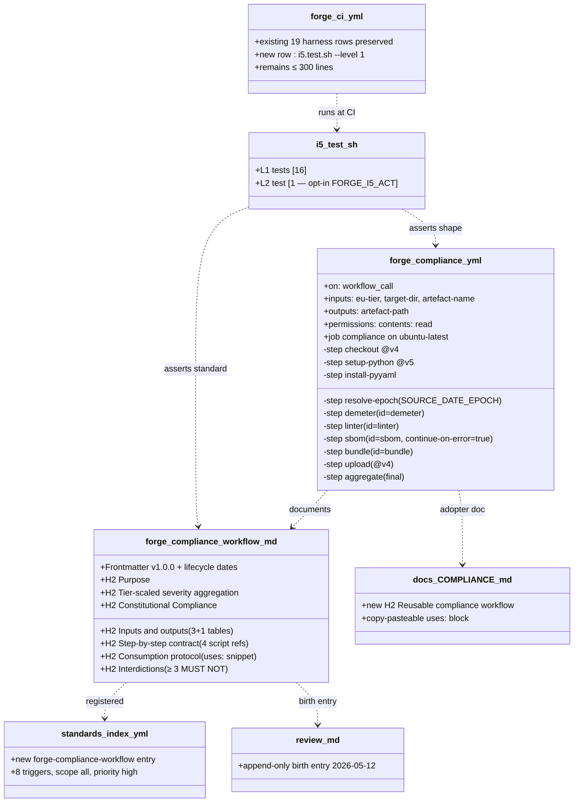
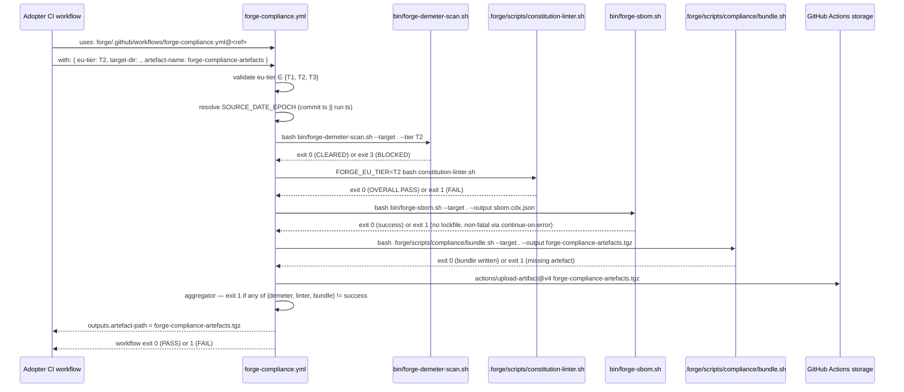

# Design: i5-compliance-workflow
<!-- Status: archived -->
<!-- Schema: default -->

> Read alongside `specs.md` (FR-I5-CW-* / NFR-I5-CW-*) and
> `open-questions.md` (Q-001..Q-003). This document locks the
> implementation strategy and resolves Q-001 / Q-002 / Q-003 via
> ADR-I5-CW-001..003.

## Architecture Decisions

### ADR-I5-CW-001 — Exit code aggregation : trust each script's tier scaling (resolves Q-001)

**Context** : the reusable workflow runs four scripts, each
already carrying its own tier-scaled severity envelope :

- **Demeter** (`bin/forge-demeter-scan.sh`) — exit `0` CLEARED,
  exit `3` BLOCKED on T2 High / T3 Critical findings, exit `2`
  no lockfile / usage error.
- **Constitution linter** (`bash .forge/scripts/constitution-linter.sh`)
  — exit `1` if any OVERALL FAIL section ; the I.3 ADR-I3-001
  T3-Forbidden section emits WARN at T1/T2 (no exit code impact
  Phase A) and FAIL at T3.
- **SBOM** (`bin/forge-sbom.sh`) — exit `0` success, exit `1` no
  lockfile (FR-I6-CA-019 precedent : non-fatal).
- **Bundle** (`bash .forge/scripts/compliance/bundle.sh`) —
  exit `0` success, exit `1` missing source artefact (fatal),
  exit `2` usage error (fatal).

Three options for aggregation considered (see `open-questions.md`
Q-001). Strict propagation (any non-zero → fail) creates
false-positives ; per-step tier inspection re-litigates work the
scripts already did.

**Decision** : **Option C — trust each script's tier scaling
end-to-end**. The workflow does not re-implement severity
mapping. Concretely :

- `demeter` step uses default `continue-on-error: false`. Any
  non-zero exit fails the step, which the aggregator translates
  to workflow failure.
- `linter` step uses default `continue-on-error: false`. Exit
  `1` fails the step.
- `sbom` step uses **`continue-on-error: true`** so a missing
  lockfile (exit 1, the documented non-fatal case) does not
  break the workflow. The aggregator inspects
  `steps.sbom.outcome` and emits `::warning::` instead of
  failing.
- `bundle` step uses default `continue-on-error: false`. Any
  non-zero exit fails the step.

The final `aggregator` step inspects `steps.<id>.outcome` for
all four and exits `1` if any of {demeter, linter, bundle} is
not `'success'`. SBOM outcome is treated as informational only.

**Consequences** :
- ✅ Adopters get the same effective tier scaling Demeter and
  the linter already encode internally.
- ✅ SBOM no-lockfile (common for pure-doc / monorepo-root
  projects) does not block compliance audits.
- ✅ The workflow surface is minimal — 9 steps, no per-tier
  branching in YAML.
- ⚠️ Adopters expecting strict-mode aggregation can wrap the
  reusable workflow's outcome in their own gate (treat any
  `::warning::` as failure via `actions/github-script` if
  desired). Documented in the standard's "Consumption protocol"
  H2.

**Constitution Compliance** : Article III.4 (anti-hallucination
— the tier scaling is delegated to the canonical sources, not
re-invented). Article V (audit trail — the four script exit
codes remain visible in the GitHub Actions logs).

---

### ADR-I5-CW-002 — `SOURCE_DATE_EPOCH` source : commit timestamp with run-time fallback (resolves Q-002)

**Context** : Q-002 weighed three sources for the
`SOURCE_DATE_EPOCH` env var that the bundle script consumes.

- **Option A** — `github.event.head_commit.timestamp`. Stable
  across re-runs ; absent on `workflow_dispatch` /
  `workflow_call` from external invocations.
- **Option B** — `github.run_started_at`. Always available ;
  varies across re-runs.
- **Option C** — additional `inputs.epoch`. Most flexible ;
  adds input surface.

**Decision** : **Option A with B fallback**, no additional
input. The workflow resolves `SOURCE_DATE_EPOCH` in a dedicated
step (or inline before the `bundle` step) :

```bash
TS="${{ github.event.head_commit.timestamp || github.run_started_at }}"
EPOCH="$(date -u -d "$TS" +%s)"
echo "SOURCE_DATE_EPOCH=$EPOCH" >> "$GITHUB_ENV"
```

**Why no `inputs.epoch`** :
- Adds an input field the typical adopter never sets ;
  surface bloat.
- `global/sbom-policy.md::Regeneration cadence` already
  declares the commit timestamp as the canonical source ; honour
  the precedent.
- The fallback `github.run_started_at` is acceptable for the
  `workflow_dispatch` case (re-runs produce different bundles ;
  that is the user's choice when running manually).

**Consequences** :
- ✅ Single env-var resolution path inside the workflow.
- ✅ Stable artefact bytes for the same commit across re-runs
  triggered by `push` / `pull_request` / `workflow_call` with
  commit context.
- ✅ Honours the SBOM policy precedent.
- ⚠️ `workflow_dispatch` re-runs produce different bytes — the
  workflow logs the resolved `SOURCE_DATE_EPOCH` value at INFO
  so adopters can audit the source.

**Constitution Compliance** : Article XI.3 (schema-driven —
deterministic output ; epoch source documented in the standard).
Article V (audit trail — epoch value logged).

---

### ADR-I5-CW-003 — L2 act-runner gating : opt-in env var, skip-when-absent (resolves Q-003)

**Context** : Q-003 weighed three L2-fixture strategies for
`i5.test.sh`. Mandatory `act` rejects environments without the
tool ; pure-YAML parsing gives no fidelity over L1 grep ; the
opt-in env-var precedent is well-established in the Forge
harness corpus.

**Decision** : **Option B — opt-in via `FORGE_I5_ACT=1`,
skip-when-absent semantics**. Verbatim pattern reuse of
`t5-otel-live-run::FORGE_LIVE_RUN_DOCKER=1` :

1. Default invocation `bash .forge/scripts/tests/i5.test.sh`
   (no `--level`) runs L1 only. Default L1-only `--level=1`.
2. `--level 2` or `--level 1,2` enables the L2 phase.
3. Inside the L2 phase, the test checks `FORGE_I5_ACT` :
   - Unset / not `1` → emit
     `[INFO: L2 act run gated by FORGE_I5_ACT=1, skipping]`
     to stderr, return 0 (PASS as skip).
   - Set to `1` → check `command -v act`.
     - Absent → emit
       `[INFO: act not installed on PATH, skipping]`,
       return 0.
     - Present → execute the fixture flow (see § L2 fixture
       contract below).

**Why opt-in not mandatory** :
- `act` is not on standard `ubuntu-latest` GitHub runners.
- Adopter laptops vary widely in tool availability.
- The L1 grep tests already validate every structural property
  of the workflow YAML ; the L2 test is **end-to-end smoke**,
  not coverage. Skipping when absent costs no correctness.

**Consequences** :
- ✅ CI runs (no `act`) PASS the harness without spawning a
  Docker daemon.
- ✅ Local dev with `act` installed can exercise the workflow
  end-to-end on demand.
- ✅ Matches the Forge precedent for Docker / external-tool
  gates.

**Constitution Compliance** : Article I (TDD — L1 alone
provides the RED witness ; L2 is supplementary). Article III.4
(no `[NEEDS CLARIFICATION:]` left dangling — the L2 contract is
explicit and documented).

---

## Implementation strategy

### Phase 1 — RED harness (foundation)

Create `.forge/scripts/tests/i5.test.sh` with 13+ L1 stubs all
returning `_not_implemented`, plus 1 L2 stub that returns 0
(skip) by default. Register in `forge-ci.yml` matrix immediately
after `i3.test.sh` with `--level 1`.

Exit gate : `bash .forge/scripts/tests/i5.test.sh --level 1`
exits 1 with `Failed: 13 / Passed: 0`. `verify.sh` overall PASS
unchanged.

### Phase 2 — Workflow + standard (production code)

Author `.github/workflows/forge-compliance.yml` per FR-I5-CW-001..060
+ NFR-I5-CW-002 + NFR-I5-CW-005. Author
`.forge/standards/global/forge-compliance-workflow.md` per
FR-I5-CW-070..085.

Exit gate : 8-9 of 13 L1 tests flip GREEN (workflow + standard
structural tests).

### Phase 3 — Index + REVIEW + docs

Author `.forge/standards/index.yml` entry per FR-I5-CW-090..094.
Append entry to `REVIEW.md` per FR-I5-CW-100..101. Extend
`docs/COMPLIANCE.md` per FR-I5-CW-110..113.

Exit gate : 12 of 13 L1 tests GREEN.

### Phase 4 — CHANGELOG + roadmap inventory

Append to `CHANGELOG.md [Unreleased]` per FR-I5-CW-142. Update
`docs/new-archetypes-plan.md` per FR-I5-CW-140. Update
`.forge/product/roadmap.md` per FR-I5-CW-141.

Exit gate : all 13 L1 tests GREEN. L2 stays gated (skip-pass).
`verify.sh` overall PASS (no FAIL ; Passed total ≥ baseline).
`constitution-linter.sh` OVERALL PASS. `forge-ci.yml` ≤ 300
lines. Status flips to `implemented`. Ready for `/forge:archive`.

---

## L1 / L2 test catalogue

### L1 (13 tests — hermetic, ≤ 5 s total)

| #  | Test name                              | FR/NFR ID                                              |
|----|----------------------------------------|--------------------------------------------------------|
| 1  | `_test_i5_001_workflow_presence`       | FR-I5-CW-001                                           |
| 2  | `_test_i5_002_workflow_yaml_parses`    | FR-I5-CW-003                                           |
| 3  | `_test_i5_003_workflow_audit_comment`  | FR-I5-CW-002                                           |
| 4  | `_test_i5_004_on_workflow_call`        | FR-I5-CW-005                                           |
| 5  | `_test_i5_005_inputs_schema`           | FR-I5-CW-010..012                                      |
| 6  | `_test_i5_006_outputs_schema`          | FR-I5-CW-020                                           |
| 7  | `_test_i5_007_step_invocations`        | FR-I5-CW-040..043 / 045                                |
| 8  | `_test_i5_008_action_pins`             | FR-I5-CW-033 / 034 / 045 / NFR-I5-CW-005               |
| 9  | `_test_i5_009_standard_presence`       | FR-I5-CW-070 / 073                                     |
| 10 | `_test_i5_010_standard_frontmatter`    | FR-I5-CW-074                                           |
| 11 | `_test_i5_011_standard_h2_sections`    | FR-I5-CW-075                                           |
| 12 | `_test_i5_012_standard_must_not`       | FR-I5-CW-080                                           |
| 13 | `_test_i5_013_index_entry`             | FR-I5-CW-090..094                                      |
| 14 | `_test_i5_014_review_entry`            | FR-I5-CW-100                                           |
| 15 | `_test_i5_015_compliance_doc_h2`       | FR-I5-CW-110..112                                      |
| 16 | `_test_i5_016_changelog_entry`         | FR-I5-CW-142                                           |

Total : **16 L1 tests** (above the FR-I5-CW-116 minimum of 13).
The headroom absorbs the four "step invocation" sub-checks
(Demeter / linter / SBOM / bundle) into a single test plus the
three input fields into another single test, keeping each test
function small.

### L2 (1 fixture-based test, opt-in)

| #  | Test name                              | FR/NFR ID                                              |
|----|----------------------------------------|--------------------------------------------------------|
| 1  | `_test_i5_l2_act_workflow_call`        | FR-I5-CW-117 / NFR-I5-CW-009 / ADR-I5-CW-003           |

The L2 test :
1. Check `--level` includes 2 ; otherwise not invoked.
2. Check `FORGE_I5_ACT=1` ; otherwise emit `[INFO: ...]`,
   return 0.
3. Check `command -v act` ; otherwise emit `[INFO: ...]`,
   return 0.
4. Create tmpdir fixture with the workflow + minimal scripts
   (or symlink the live ones).
5. Run `act workflow_call -W
   .github/workflows/forge-compliance.yml -P
   ubuntu-latest=node:20-buster-slim --input eu-tier=T2`.
6. Assert exit 0.

---

## Component Design



---

## Data flow — adopter `uses:` invocation



---

## Dependencies on shipped state

| Dep                                     | Version / archive date           | Workflow consumes                                                                            |
|-----------------------------------------|----------------------------------|----------------------------------------------------------------------------------------------|
| `i2-compliance-tiers`                   | archived 2026-05-12              | `.forge/standards/global/compliance-tiers.md` v1.0.0 (tier matrix referenced by linter)      |
| `i3-t3-forbidden-linter`                | archived 2026-05-12              | `constitution-linter.sh::ADR-I3-001 T3-Forbidden Components` section ; tier-scaled severity  |
| `i6-compliance-artefacts`               | archived 2026-05-12              | `.forge/scripts/compliance/bundle.sh` ; `.forge/templates/compliance/forge-dpa-declared.template` |
| `k3-demeter`                            | archived 2026-05-12              | `bin/forge-demeter-scan.sh` (tier-scaled severity, exit 3 BLOCKED)                            |
| `j8-janus-rules`                        | archived 2026-05-10              | `bin/forge-sbom.sh` (CycloneDX 1.5) ; `.forge/.forge-tier` ledger ; ADR-J8-003 exit envelope  |
| `t4-adr-ratification`                   | archived 2026-05-04              | `compliance-tier.schema.json` v1.0.0 transitively via I.2                                     |

No new external dependency. Workflow uses three actions
(`actions/checkout@v4`, `actions/setup-python@v5`,
`actions/upload-artifact@v4`) already pinned in `forge-ci.yml`.

---

## Out of scope (deferred)

- **NIS2 / DORA / CRA / AI Act regulatory-deadline artefacts**
  under `.forge/compliance/{nis2,dora,cra,ai-act}/*`. Themis
  (K.5, T7+) territory. The workflow's bundle step transparently
  ships any future additions to the bundle layout.
- **Forge CLI wrapper** (`forge compliance run`). The workflow
  is the only entry point at I.5 v1.0.0.
- **Multi-archetype validation matrices**. The workflow runs on
  one `ubuntu-latest` job ; future archetype-aware variants are
  a separate change.
- **Artefact signing** (Sigstore cosign), transparency-log
  upload (Rekor). Out of scope per
  `global/sbom-policy.md::Out-of-scope`.

---

## Constitutional Compliance per Article

- **Article I (TDD)** — Phase 1 captures full RED witness (13+
  tests FAIL) before any production code.
- **Article II (BDD)** — Gherkin scenario in `proposal.md` covers
  the adopter `uses:` flow at T2 with the bundle uploaded.
- **Article III.4 (anti-hallucination)** — Three Q-NNN tracked
  and resolved at design time ; no inline `[NEEDS CLARIFICATION:]`
  marker in `proposal.md` / `specs.md` / this file.
- **Article V (audit trail)** — every task tagged
  `[Story: FR-I5-CW-XXX]` in `tasks.md` ; workflow + standard +
  harness all carry the `<!-- Audit: I.5 (...) -->` anchor.
- **Article VIII (infrastructure)** — the workflow is a
  declarative YAML executed by GitHub Actions on
  `ubuntu-latest` ; no service / daemon / privileged ops ;
  `permissions: contents: read` only.
- **Article XI (AI-first)** — Demeter / Aegis / Janus consume
  the uploaded bundle ; deterministic structured artefact ; no
  opaque LLM-generated content.
- **Article XII (governance)** — the standard ENFORCES the
  workflow's input / output / step list contract ; does NOT amend
  any Article. Extensions follow `global/standards-lifecycle.md`
  SemVer.

No constitutional amendment required.
