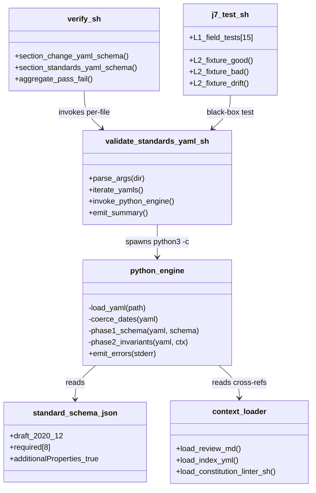
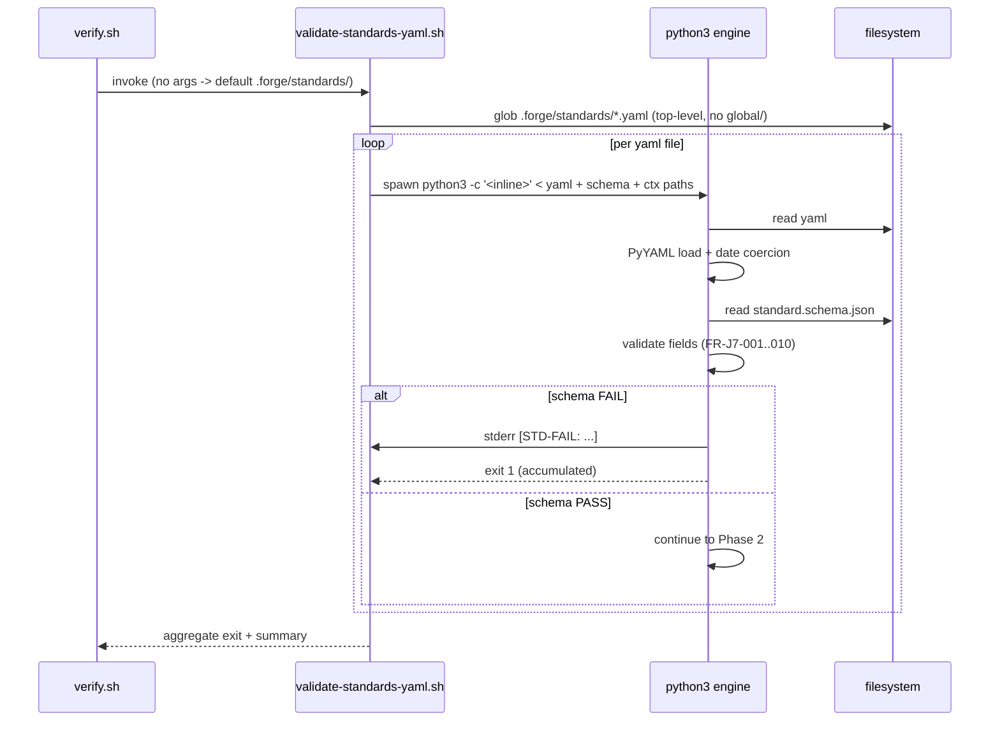
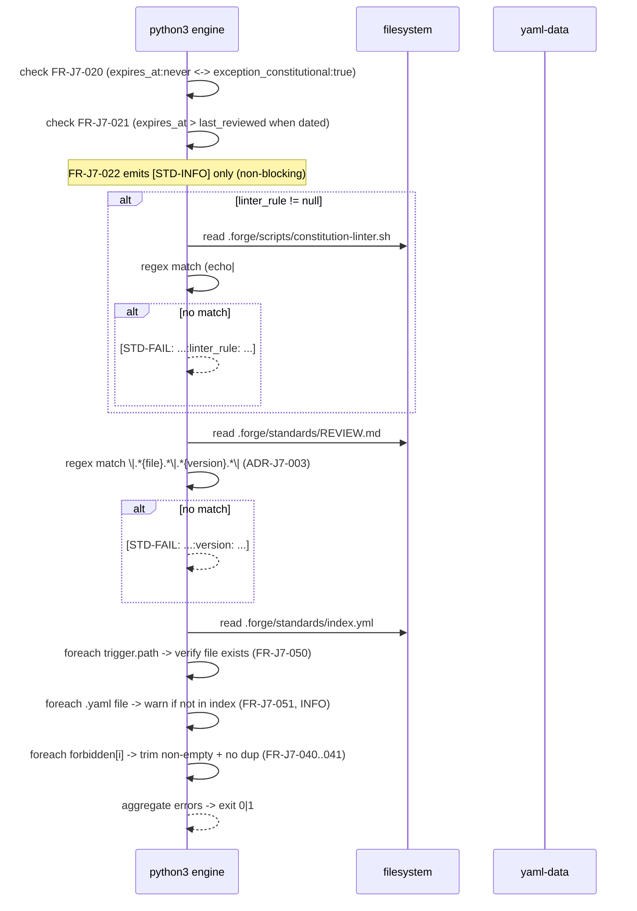

# Design: j7-validate-standards-yaml
<!-- Status: designed -->
<!-- Schema: default -->

> Read alongside `specs.md` (FR-J7-* / NFR-J7-*) and `open-questions.md`
> (Q-001..Q-004). This document locks the implementation strategy and
> resolves Q-003 + Q-004 by reading the live `constitution-linter.sh`
> and `REVIEW.md` shapes.

## Architecture Decisions

### ADR-J7-001 — Validator architecture : F.2 verbatim reuse

**Context** : The validator must enforce a JSON Schema Draft 2020-12
contract on YAML files plus several cross-field invariants. The
`f2-yaml-schema` change (archived 2026-05-01) already shipped
`bin/validate-change-yaml.sh` solving the **same architectural problem**
(YAML + Schema + cross-field invariants + verify.sh integration) for the
`change.yaml` family. NFR-J7-004 mandates F.2 pattern alignment.

**Decision** : Adopt the F.2 architecture **verbatim**, swapping only :
- the schema file path (`change.schema.json` → `standard.schema.json`),
- the input set (`changes/*/.forge.yaml` → `standards/*.yaml`),
- the Phase 2 invariants (timeline coherence → lifecycle / linter_rule /
  forbidden / index.yml / REVIEW.md cross-references),
- the error prefix (`validate-change-yaml:` → `[STD-FAIL: ...]`).

The skeleton (bash thin + Python 3 inline, PyYAML date coercion,
Phase 1/Phase 2 split, accumulating errors before exit, exit codes
0/1/2) is copied with attribution.

**Consequences** :
- ✅ Lowest risk : F.2 has been GREEN in CI for ≈ 6 days against 14
  archived changes.
- ✅ Zero new external dependencies (PyYAML already required by F.2).
- ✅ Reviewer cognitive load minimised : a maintainer who knows F.2
  understands J.7 instantly.
- ⚠️  If a future bug is found in the F.2 Python helpers, both
  validators must be patched. Acceptable — the helpers are tiny
  (~ 30 LOC) and the duplication is a deliberate « dumb-and-obvious »
  vs « shared lib » trade-off.

**Constitution Compliance** : Article V (audit trail preserved through
deterministic single-line errors), Article X (raises gate coverage from
human-review-only to automated). No violation.

---

### ADR-J7-002 — `linter_rule` cross-reference pattern (resolves Q-003)

**Context** : FR-J7-030 requires that a non-null `linter_rule:` value
in a standard YAML maps to a real section in `constitution-linter.sh`.
Q-003 raised four candidate regexes (A through D in `open-questions.md`).

A grep on the live `.forge/scripts/constitution-linter.sh` (run
2026-05-07) shows that the **only** non-null `linter_rule` currently in
use is `no-state-management-alternatives` (in `state-management.yaml`),
matching :

```
665:# ── ADR-006: State Management Discipline (no-state-management-alternatives) — T.4 ──
672:echo "ADR-006 (State Management Discipline — no-state-management-alternatives):"
```

The linter does NOT use the cosmetic `# === ${rule} ===` header pattern
(candidate A), nor `# Rule: ${rule}` (candidate B). It uses Article /
ADR-anchored sections that mention the rule name **as a parenthetical
inside a comment header AND inside a section-print echo**.

**Decision** : The cross-reference test is a **structured grep** :

```python
pattern = re.compile(r'^\s*(echo|#).*\b' + re.escape(rule) + r'\b', re.M)
if not pattern.search(linter_text):
    fail(f'{path}:linter_rule: rule "{rule}" not found as section header or comment in constitution-linter.sh')
```

Specifically : the rule name must appear on a line whose first non-space
token is either `echo` or `#`. This excludes incidental matches inside
`fail "..."` / `warn "..."` arguments (which are body code, not section
anchors), while accepting both the comment-header form and the echo-form
the live linter uses.

**Consequences** :
- ✅ Matches the live convention without forcing a refactor of
  `constitution-linter.sh`.
- ✅ Robust : kebab-case rule names are highly unlikely to collide with
  unrelated comments.
- ✅ One-line Python ; no AST parser, no bash function discovery.
- ⚠️  A maintainer adding a new linter rule must remember to add either
  a comment header OR an echo line that includes the rule name. This is
  already the convention in practice ; the linter formalises it.

**Constitution Compliance** : Article V (rule-existence becomes a
machine-checked invariant). No violation.

---

### ADR-J7-003 — REVIEW.md drift detection scope (resolves Q-004)

**Context** : FR-J7-023 requires the declared `version` in a standard
YAML to appear in `.forge/standards/REVIEW.md`. Q-004 weighed
"latest entry only" (option A) vs "full ledger scan" (option B).

Reading the live REVIEW.md (2026-05-07, 109 lines) :
- 3 entries today (initial 2026-05-04 + 2026-05-05 transport bump +
  2026-05-05 correction note).
- Schema : H2 heading `## YYYY-MM-DD — summary`, body table with
  columns `Standard | Version | Decision | Next review due | Notes`.
- transport.yaml has **two** matching version mentions (`1.1.0` in
  the bump entry, `1.1.0` in the correction note), confirming that
  multiple entries per `(file, version)` pair are normal — option B
  must accept N ≥ 1.

**Decision** : **Full ledger scan** (option B). The validator parses
REVIEW.md as plain text and tests :

```python
needle = re.compile(
    r'\|\s*' + re.escape(standard_basename) + r'\s*\|\s*' + re.escape(version) + r'\s*\|',
    re.M,
)
if not needle.search(review_text):
    fail(f'{path}:version: declared {version} not present in REVIEW.md ledger')
```

I.e. find at least one row where the `Standard` cell matches the file
basename and the `Version` cell matches the declared SemVer. Subsequent
columns and surrounding heading are ignored — they're informational.

**Consequences** :
- ✅ Catches version-rollback accidents (a YAML reverted to v1.0.0
  while the latest ledger entry is v1.1.0 still passes — but a YAML
  with a version that has *never* been recorded fails).
- ✅ Linear scan ; ledger is small (currently ≈ 7 row entries),
  sub-millisecond.
- ✅ Tolerant of the multi-entry pattern observed for transport.yaml
  (three legitimate v1.1.0 mentions across the bump + correction
  entries).
- ⚠️  Does NOT enforce that the *latest* entry matches. A future
  J.7-extension could tighten this when the ledger gets a status
  field per-row, but for now the loose check is "the version was
  reviewed at some point" which is the right semantics for an
  append-only ledger.

**Constitution Compliance** : Article XII (append-only invariant
preserved — the validator reads REVIEW.md, never writes to it). No
violation.

---

### ADR-J7-004 — Schema location and `additionalProperties` policy

**Context** : The schema file must be discoverable and consistent
with the existing `change.schema.json` location convention.

**Decision** :
- File path : `.forge/schemas/standard.schema.json` (sibling of
  `change.schema.json`, `compliance-tier.schema.json`, and
  `archetype.schema.json`).
- `$schema` : `https://json-schema.org/draft/2020-12/schema`.
- `additionalProperties: true` at the **root** level, because each
  standard carries domain-specific body fields beyond the frontmatter
  (e.g. `transport.yaml`'s `protocol`, `codegen`, `server_runtime` ;
  `state-management.yaml`'s `framework`, `forbidden_alternatives`
  body). The schema only constrains the frontmatter contract
  (FR-J7-002..010) ; body shape is the standard's own concern.
- `additionalProperties: false` on the `enforcement` sub-object only
  (FR-J7-008) — that one is a closed contract.

**Consequences** :
- ✅ Aligns with the F.2 schema convention while accommodating the
  heterogeneous body content of standards.
- ⚠️  A typo in a body field is NOT caught by J.7. This is by design ;
  body validation belongs to per-standard schemas (potential T7+ work,
  not in this scope).

**Constitution Compliance** : Article III (specs document the
boundary explicitly). No violation.

---

### ADR-J7-005 — Error format and exit codes

**Context** : NFR-J7-003 requires deterministic, machine-parseable
errors. F.2 ships the format `validate-change-yaml: <path>: <field>: <reason>`.

**Decision** : Adopt a **bracketed prefix** to distinguish J.7 lines
from J.2 lines in mixed `verify.sh` output :

- PASS line (stdout) : `[STD-PASS] <relative-path>`
- FAIL line (stderr) : `[STD-FAIL: <relative-path>:<field>: <reason>]`
- INFO line (stdout) : `[STD-INFO: <relative-path>:<field>: <reason>]`
  (non-blocking, e.g. FR-J7-022 cycle-loose, FR-J7-051 orphan
  standard)

Exit codes mirror F.2 :
- `0` : all PASS (INFO lines do not affect exit).
- `1` : ≥ 1 FAIL.
- `2` : usage error (bad arguments, missing schema file).

**Consequences** :
- ✅ CI greps for `\[STD-FAIL` are unambiguous.
- ✅ Maintainers can `2>&1 | grep '\[STD-'` to filter the section's
  output without false positives.
- ⚠️  Slight asymmetry with F.2's `validate-change-yaml:` prefix.
  Acceptable : the two validators target different artefact families,
  the bracket form is more recognisable in mixed `verify.sh` output.

**Constitution Compliance** : Article V (errors carry the schema
field path, machine-parseable). No violation.

---

## Component Design



## Data Flow

### Phase 1 — Schema validation (per-file)



### Phase 2 — Cross-field invariants



## Testing Strategy (Eris perspective)

### L1 — unit-level (15 tests minimum, FR-J7-081)

The L1 layer treats `validate-standards-yaml.sh` as a black box and
asserts exit code + presence/absence of specific `[STD-FAIL]` lines.
Each test calls the validator on a **synthetic single-file fixture**
(written to a `mktemp -d` dir) and greps the captured stderr.

| Test ID                        | FR covered     | Fixture mutation                                              | Expected output                           |
|--------------------------------|----------------|---------------------------------------------------------------|-------------------------------------------|
| `_test_j7_001_required_version`| FR-J7-002/003  | drop `version:` field                                         | exit 1 + `version` field error            |
| `_test_j7_002_bad_semver`      | FR-J7-003      | `version: "v1"` (non-semver)                                  | exit 1 + pattern error                    |
| `_test_j7_003_bad_date`        | FR-J7-004      | `last_reviewed: 2026/05/04`                                   | exit 1 + date error                       |
| `_test_j7_004_expires_never`   | FR-J7-005      | `expires_at: never` valid + `exception_constitutional: true`  | exit 0                                    |
| `_test_j7_005_expires_dated`   | FR-J7-005      | `expires_at: 2027-05-04`                                      | exit 0                                    |
| `_test_j7_006_exc_bool`        | FR-J7-006      | `exception_constitutional: "yes"`                             | exit 1 + type error                       |
| `_test_j7_007_linter_rule_null`| FR-J7-007      | `linter_rule: null`                                           | exit 0                                    |
| `_test_j7_008_enforcement_shape`| FR-J7-008     | drop `pre_commit_hook` from enforcement                       | exit 1 + sub-required error               |
| `_test_j7_009_forbidden_array` | FR-J7-009      | `forbidden: "single-string"` (must be array)                  | exit 1 + type error                       |
| `_test_j7_010_rationale_empty` | FR-J7-010      | `rationale: ""`                                               | exit 1 + minLength error                  |
| `_test_j7_020_xii_coupling`    | FR-J7-020      | `expires_at: never` + `exception_constitutional: false`       | exit 1 + Article XII coupling error       |
| `_test_j7_021_expires_order`   | FR-J7-021      | `expires_at: 2026-01-01` < `last_reviewed: 2026-05-04`        | exit 1 + ordering error                   |
| `_test_j7_023_review_drift`    | FR-J7-023      | `version: "9.9.9"` not in REVIEW.md fixture                   | exit 1 + drift error                      |
| `_test_j7_030_linter_rule_miss`| FR-J7-030      | `linter_rule: nonexistent-rule`                               | exit 1 + rule-not-found error             |
| `_test_j7_041_forbidden_dup`   | FR-J7-041      | `forbidden: ["riverpod", "riverpod"]`                         | exit 1 + duplicate error                  |
| `_test_j7_050_index_dangling`  | FR-J7-050      | index.yml fixture with path to non-existent standard          | exit 1 + dangling-trigger error           |

**16 L1 tests** (one over the FR-J7-081 minimum) + helper assertions.

### L2 — fixture-level (3 tests minimum, FR-J7-082)

L2 fixtures use temp dirs that **mirror the `.forge/standards/` layout**
in miniature : a fake `index.yml`, a fake `REVIEW.md`, and N synthetic
`*.yaml` files. The validator runs against the fixture root and the
test asserts the full stdout/stderr trace.

| Fixture           | Coverage                                                        | Expected                          |
|-------------------|-----------------------------------------------------------------|-----------------------------------|
| `good/`           | Mirrors transport.yaml+state-management.yaml minimally          | exit 0, all `[STD-PASS]` lines     |
| `bad/`            | Each of the six failure modes in one file                       | exit 1, six `[STD-FAIL]` lines    |
| `drift/`          | Standard claims v1.2.0, REVIEW.md has only v1.1.0               | exit 1, exactly one drift error   |

### Production tree (NFR-J7-002)

A 17th L1 test runs the validator against the **live** `.forge/standards/`
directory and asserts exit 0 + zero `[STD-FAIL]` lines. This is the
GREEN-baseline guard mandated by NFR-J7-002.

### Performance (NFR-J7-001)

A 4th L2 test wraps the live-tree run in `time` and asserts wall-clock
≤ 2 s. The harness self-reports wall-clock at `--level 1,2` exit and
asserts ≤ 8 s total.

## Standards Applied

- `global/standards-lifecycle.md` (T.4) : the J.7 linter is the
  automated enforcement leg of this standard. ADR-J7-002 + ADR-J7-003
  + FR-J7-020..023 directly mechanise its invariants.
- `global/change-yaml-schema.md` (F.2) : pattern reuse confirmed by
  ADR-J7-001. F.2's bash + Python 3 inline architecture is the
  template.
- `global/linting-rules.md` (F.4) : the new section in
  `constitution-linter.sh` is **NOT** added by this change ; the
  `validate-standards-yaml.sh` linter is **standalone**, called by
  `verify.sh` independently. Rationale : the constitution-linter is
  for *constitutional articles* ; the J.7 linter is for *standard
  contract*. Different concerns → different scripts.
- `global/source-document-pinning.md` (T.4) : not applicable
  directly (no external doc pinned), but the F.2 spec reference in
  ADR-J7-001 is locked to its archived path
  `.forge/specs/change-yaml-schema.md`.

## Constitutional Compliance Gate

- **Article I (TDD)** : ✅ enforced via `j7.test.sh` RED → GREEN
  cadence per task in `tasks.md` (next phase).
- **Article II (BDD)** : ✅ Scenario 1/2/3 in `specs.md` cover the
  three meaningful user journeys (happy path, coupling break, drift).
- **Article III (Specs Before Code)** : ✅ specs.md done, design.md
  about to ship, no impl code yet.
- **Article III.4** : ✅ Q-001/Q-002 answered in `open-questions.md`
  ; Q-003/Q-004 will flip to `answered` (this design resolves them
  but the file flip happens at archive time per F.1 convention).
- **Article IV (Delta-Based Changes)** : ✅ specs.md uses ADDED
  Requirements, no MODIFIED/REMOVED.
- **Article V (Audit Trail)** : ✅ every FR has a deterministic test
  + the validator emits a deterministic field path on failure.
- **Article VI (Flutter)** : N/A — no Dart code.
- **Article VII (Rust)** : N/A — no Rust code.
- **Article VIII (Infra)** : N/A — local script + CI YAML edit only.
- **Article IX (Sec/Obs)** : N/A — no runtime, no secrets, no
  network.
- **Article X (Code Quality)** : ✅ raises gate coverage from
  human-review-only to automated for the standards lifecycle
  contract.
- **Article XI (AI-First)** : N/A.
- **Article XII (Governance)** : ✅ enforces, does not amend.
  REVIEW.md remains append-only ; the validator is read-only on it.

**No constitutional violation detected. Design proceeds to
`/forge:plan`.**

## Open Questions remaining post-design

- Q-003 → **answered by ADR-J7-002**. Will flip at next
  `open-questions.md` update (during `/forge:plan` or first impl
  commit).
- Q-004 → **answered by ADR-J7-003**. Same.
