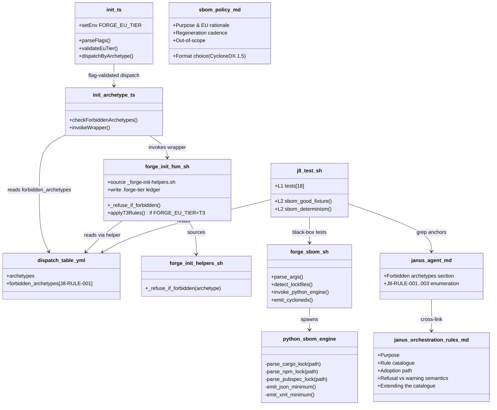
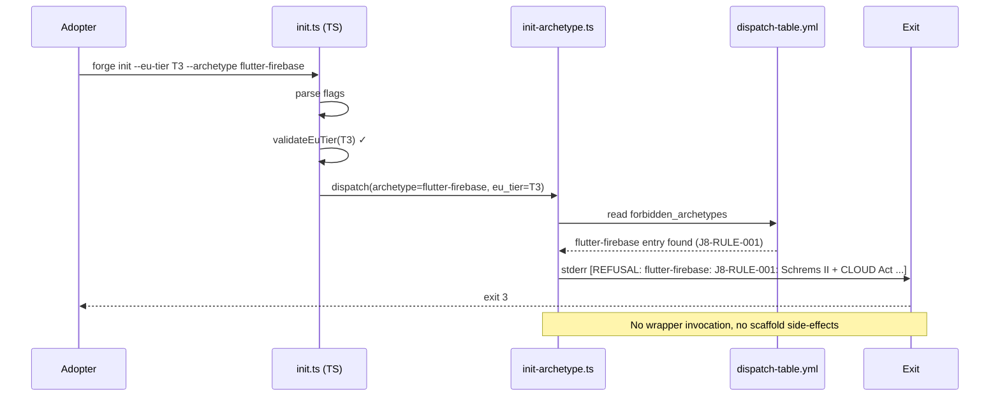
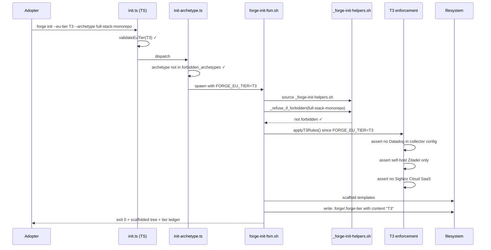
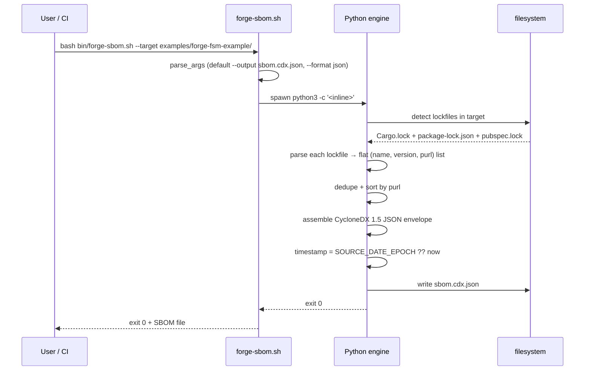

# Design: j8-janus-rules
<!-- Status: designed -->
<!-- Schema: default -->

> Read alongside `specs.md` (FR-J8-* / NFR-J8-*) and
> `open-questions.md` (Q-001..Q-003). This document locks the
> implementation strategy across the 3 sub-modules (J.8.a / J.8.b /
> J.8.d) and resolves Q-001 + Q-002 + Q-003 via Context7 + grep on
> existing CLI exit-code conventions.

## Architecture Decisions

### ADR-J8-001 — SBOM tooling : handcrafted Python 3 inline (resolves Q-001)

**Context** : FR-J8-073 + NFR-J8-005 require a CycloneDX 1.5 JSON
SBOM without introducing new external dependencies. Q-001 weighed
handcraft (Option A) vs shell-out to `cargo-cyclonedx` /
`cyclonedx-npm` (Option B).

Context7 review of `/cyclonedx/cyclonedx-python-lib`
(2026-05-10) confirms the **minimum-viable CycloneDX 1.5 JSON**
fits in :

```json
{
  "bomFormat": "CycloneDX",
  "specVersion": "1.5",
  "version": 1,
  "metadata": {
    "component": {"type": "application", "name": "<x>", "version": "<v>"}
  },
  "components": []
}
```

The 3 truly mandatory fields are `bomFormat`, `specVersion`,
`version`. `metadata.component` + `components[]` are recommended
for traceability ; we ship them. `serialNumber` (optional) is also
shipped for SBOM-to-SBOM linking. `metadata.timestamp` is shipped
for chronological tracking, controlled by `SOURCE_DATE_EPOCH` for
reproducibility (FR-J8-075).

**Decision** : **Option A — handcraft via Python 3 inline**. The
script :
- Parses Cargo.lock (TOML stdlib `tomllib` since Python 3.11), npm
  lockfiles (JSON stdlib), pubspec.lock (PyYAML — already required
  by F.2 / J.7).
- Emits the minimum-viable JSON via `json.dumps(...,
  sort_keys=True, indent=2)` for determinism.
- Emits XML (FR-J8-074) via `xml.etree.ElementTree` minimal
  handcrafted structure.
- No external CycloneDX lib, no new install requirement for adopters.

**Consequences** :
- ✅ NFR-J8-005 satisfied : zero new external dep.
- ✅ Reviewable in ≈ 200 LOC of Python ; easier to audit than a
  binary dependency.
- ⚠️  Handcrafted SBOM lacks rich features (license enrichment,
  vulnerability cross-refs, dependency graph). Acceptable for
  initial Forge offering ; adopters who need richer SBOMs run
  upstream tooling on the generated baseline.

**Constitution Compliance** : Article VIII (CI artefact). No
violation.

---

### ADR-J8-002 — `--eu-tier` flag default : no default (resolves Q-002)

**Context** : NFR-J8-002 mandates backward compat — existing
`forge init` invocations must behave identically. Q-002 weighed
"no default" (Option A) vs "T2 default" (Option B).

**Decision** : **Option A — no default**. Behaviour when the flag
is absent : identical to today (no tier-specific refusals fire).
The TS dispatcher passes `FORGE_EU_TIER=` (empty) to wrappers ;
wrappers gate their tier-specific blocks on `[ -n "$FORGE_EU_TIER" ]`.

A **soft warning** is emitted to stderr when `forge init` runs
without `--eu-tier` AND no `.forge/.forge-tier` file is found in
the target tree :

```
[INFO: --eu-tier not set ; defaulting to no tier. Pass --eu-tier T1|T2|T3 to enable EU compliance enforcement. See docs/CLI-FLAGS.md.]
```

The warning is informational, single-line, NEVER blocks. Adopters
can suppress with `FORGE_EU_TIER_QUIET=1` env var if the noise
becomes annoying in CI.

**Consequences** :
- ✅ Backward compat preserved (NFR-J8-002).
- ✅ Discoverability : the warning surfaces the new flag without
  forcing immediate adoption.
- ⚠️  Adopters who never set `--eu-tier` get the warning on every
  `forge init` run. Mitigated by the `_QUIET` env-var opt-out and
  by the `.forge-tier` file (once written by a single tier-aware
  init, the warning silences itself thereafter).

**Constitution Compliance** : Article XII (governance — does not
amend, only reminds). No violation.

---

### ADR-J8-003 — Refusal exit code : `3` (resolves Q-003)

**Context** : Q-003 weighed exit code `3` (used by
`forge-snapshot.sh` for "regex mismatch" — different domain) vs
`4` (used by `forge-snapshot.sh` for "I/O collision").

**Decision** : Refusal exit code is **3** (policy violation),
distinct from :
- `0` : success
- `1` : invalid input (e.g. bad YAML, validation FAIL)
- `2` : usage error (bad args, missing file)
- `3` : **policy refusal** (request was syntactically valid but
  refused — J8-RULE-* fired)
- `4..` : reserved for I/O / tooling errors

Cross-domain reuse with `forge-snapshot.sh::3` (regex mismatch) is
acceptable — the two binaries are invoked from different contexts
and exit-code interpretation is per-binary. A future
`global/cli-exit-codes.md` standard (out of scope here) will lock
the convention repo-wide. **Mention** in
`global/janus-orchestration-rules.md` per FR-J8-030.

**Consequences** :
- ✅ Distinct from 1/2 ; CI scripts can grep `exit 3` to detect
  policy refusals specifically.
- ⚠️  Convention not yet repo-wide ; future standard locks it.

**Constitution Compliance** : Article V (audit trail — exit code
+ structured stderr line are jointly machine-parseable). No
violation.

---

### ADR-J8-004 — Janus rule ID format : `J8-RULE-NNN`

**Context** : Refusal error format (FR-J8-021) carries a `rule_id`.
The rule registry needs a stable, kebab-case-ish ID format that's
greppable + cross-referenceable.

**Decision** : Rule IDs use the format `J8-RULE-NNN` where :
- `J8` : audit module ID (matches `parent_audit_items` in the
  change `.forge.yaml`).
- `RULE` : literal token signaling rule semantics.
- `NNN` : zero-padded 3-digit sequential counter, never reused.

Seed entries :
- `J8-RULE-001` : flutter-firebase forbidden.
- `J8-RULE-002` : T3 ⇒ self-host Zitadel.
- `J8-RULE-003` : T3 ⇒ self-host SigNoz + no Datadog.

Future J.8 extensions append `J8-RULE-004..` ; future audit
modules use their own prefix (`K3-RULE-NNN` for Demeter agent
when K.3 ships, etc.).

**Consequences** :
- ✅ Greppable across `cross-layer-orchestrator.md`, dispatch-table,
  wrapper scripts, error messages.
- ✅ Self-documenting (the `J8` prefix makes the source obvious).

**Constitution Compliance** : Article V. No violation.

---

### ADR-J8-005 — Wrapper refusal helper : shared bash sourced from `_forge-init-helpers.sh`

**Context** : FR-J8-022 mandates wrapper-side defense in depth
(each `bin/forge-init-<archetype>.sh` checks the forbidden-list
even when the dispatcher already did). DRY suggests a shared
helper.

**Decision** : New helper file `bin/_forge-init-helpers.sh`
(underscore prefix per the existing `_helpers.sh` convention in
`.forge/scripts/tests/`). Contents :

```bash
#!/usr/bin/env bash
# shellcheck shell=bash
# Forge — Shared init wrapper helpers (J.8 j8-janus-rules)

# _refuse_if_forbidden <archetype-name>
# Reads .forge/scaffolding/dispatch-table.yml ; if archetype is on
# forbidden_archetypes list, emit the structured refusal error to
# stderr and exit 3.
_refuse_if_forbidden() {
  local archetype="$1"
  # Inline Python 3 read of the YAML (PyYAML already required)
  local refusal
  refusal="$(python3 - "$archetype" <<'PY'
import sys, yaml, os
archetype = sys.argv[1]
forge_root = os.environ.get('FORGE_ROOT', os.getcwd())
table = os.path.join(forge_root, '.forge', 'scaffolding', 'dispatch-table.yml')
try:
    with open(table) as f:
        data = yaml.safe_load(f) or {}
except Exception:
    sys.exit(0)
for entry in data.get('forbidden_archetypes') or []:
    if entry.get('name') == archetype:
        rid = entry.get('rule_id', 'J8-RULE-???')
        reason = entry.get('reason', '<no reason>')
        alt = entry.get('alternative', '<no alternative>')
        print(f'[REFUSAL: {archetype}: {rid}: {reason} ; alternative: {alt}]')
        sys.exit(0)
PY
)"
  if [ -n "$refusal" ]; then
    echo "$refusal" >&2
    exit 3
  fi
}
```

Each wrapper sources the helper at the top :
```bash
source "$(dirname "${BASH_SOURCE[0]}")/_forge-init-helpers.sh"
_refuse_if_forbidden "<archetype-name>"
```

The TS dispatcher's check (FR-J8-020) is the **first line of
defense** ; the wrapper helper is the **second line** for cases
where the dispatcher is bypassed (e.g. CI scripts directly invoking
the wrapper).

**Consequences** :
- ✅ DRY — single source of truth for the refusal logic.
- ✅ Defense in depth without duplication.
- ⚠️  PyYAML required at wrapper invocation time. Already required
  by F.2 ; no new dependency.

**Constitution Compliance** : Article VIII. No violation.

---

### ADR-J8-006 — `.forge-tier` ledger is plain text, not YAML

**Context** : FR-J8-060 requires a `.forge/.forge-tier` ledger
file recording the chosen tier. Two shapes :
- **A** : Plain text — exactly one line `<tier>` (e.g. `T3`).
- **B** : YAML — `tier: T3` + future-extensible metadata.

**Decision** : **Plain text (Option A)**. One line, content is
`T1`, `T2`, or `T3` (uppercase). Trailing newline mandatory (POSIX
text-file convention).

Rationale : the file is read by adopter-side downstream tooling
(deploy scripts, CI gates) which prefer the simplest possible
shape. YAML adds a parser dependency on the consumer side. If
future metadata (e.g. tier history) is needed, swap the convention
to YAML in a SemVer minor bump of the file format (track via a
top-level `.forge-tier-version` file if needed).

**Consequences** :
- ✅ Trivial to read (`cat .forge/.forge-tier` works).
- ⚠️  Limited extensibility. Acceptable for v1.

**Constitution Compliance** : N/A. No violation.

---

### ADR-J8-007 — SBOM script architecture : F.2 / J.7 pattern verbatim

**Context** : FR-J8-070..076 + NFR-J8-004 mandate F.2 / J.7 pattern
alignment. The validator scripts in those changes use bash thin +
Python 3 inline.

**Decision** : `bin/forge-sbom.sh` follows the F.2 pattern verbatim :
- Bash header (`#!/usr/bin/env bash`, `set -uo pipefail`, no
  `-e` because we accumulate diagnostics).
- Args parsing via simple `case` loop.
- Python 3 inline via `python3 - <<'PY' ... PY` with stdin =
  formatted args.
- Output to stdout (default `--output sbom.cdx.json`) or to a file
  via `--output <path>`.
- Exit codes 0 / 1 / 2 mirror F.2 + J.7 conventions.

The Python engine in 3 phases :
1. **Detect** : walk `--target` for lockfiles, build a list of
   `(format, path)` tuples.
2. **Parse** : per-format parser (TOML for Cargo, JSON for npm,
   YAML for pubspec) emits a flat list of `(name, version, purl)`
   tuples.
3. **Emit** : assemble the CycloneDX 1.5 JSON / XML envelope and
   the `components[]` list, sort by purl, write.

**Consequences** :
- ✅ NFR-J8-004 satisfied.
- ✅ Reviewer cognitive load minimised — same shape as F.2 / J.7.
- ⚠️  Lockfile parsing is tied to current upstream formats ;
  future format changes (e.g. Cargo MSRV-driven schema bumps)
  may require parser updates.

**Constitution Compliance** : Article VIII. No violation.

---

## Component Design



## Data Flow — `forge init --eu-tier T3 --archetype flutter-firebase`



## Data Flow — `forge init --eu-tier T3 --archetype full-stack-monorepo`



## Data Flow — SBOM generation



## Testing Strategy (Eris perspective)

### L1 — unit-level (≥ 18 tests, FR-J8-101)

The L1 layer treats each artefact as a black box and asserts file
presence + key anchors via grep / `_yq_eval`.

| Test ID                              | FR covered                  | Anchor asserted                                                                   |
|--------------------------------------|-----------------------------|------------------------------------------------------------------------------------|
| `_test_j8_001_janus_section`         | FR-J8-001 / FR-J8-005       | "Forbidden archetypes & combinations" H2 + audit comment                          |
| `_test_j8_002_janus_rule_001`        | FR-J8-002                   | `J8-RULE-001` mention in agent file                                               |
| `_test_j8_003_janus_rule_002_003`    | FR-J8-002                   | `J8-RULE-002` + `J8-RULE-003` mentions                                            |
| `_test_j8_010_dispatch_forbidden`    | FR-J8-010                   | `forbidden_archetypes:` top-level key in dispatch-table                           |
| `_test_j8_011_entry_shape`           | FR-J8-011                   | first entry has name + reason + since + alternative + rule_id                     |
| `_test_j8_012_seed_flutter_firebase` | FR-J8-012                   | seed entry name = "flutter-firebase", rule_id = "J8-RULE-001"                     |
| `_test_j8_020_helper_exists`         | FR-J8-022 / ADR-J8-005      | `bin/_forge-init-helpers.sh` exists, `_refuse_if_forbidden` function defined      |
| `_test_j8_021_wrapper_sources_helper`| FR-J8-022                   | `bin/forge-init-fsm.sh` sources the helper                                        |
| `_test_j8_022_dispatcher_check`      | FR-J8-020                   | `cli/src/commands/init-archetype.ts` checks forbidden_archetypes                   |
| `_test_j8_023_refusal_format`        | FR-J8-021                   | refusal helper emits the canonical `[REFUSAL: ...]` format                        |
| `_test_j8_030_standard_exists`       | FR-J8-030                   | `global/janus-orchestration-rules.md` exists with ≥ 5 H2 sections                 |
| `_test_j8_040_eu_tier_flag`          | FR-J8-040                   | `init.ts` declares `--eu-tier <tier>` flag                                        |
| `_test_j8_041_eu_tier_validation`    | FR-J8-041                   | invalid value rejected with exit 2 + schema reference                             |
| `_test_j8_042_no_default`            | FR-J8-042 / NFR-J8-002      | flag absent → no behavioural change (regression guard)                            |
| `_test_j8_050_t3_self_host_zitadel`  | FR-J8-051                   | wrapper refuses Auth0 / Keycloak-cloud when FORGE_EU_TIER=T3 (fixture)             |
| `_test_j8_060_tier_ledger`           | FR-J8-060                   | `.forge/.forge-tier` written with single line + tier value                        |
| `_test_j8_070_sbom_signature`        | FR-J8-070                   | `bin/forge-sbom.sh` exists, signature parses, exit 2 on usage                     |
| `_test_j8_080_sbom_policy_standard`  | FR-J8-080                   | `global/sbom-policy.md` exists with ≥ 4 H2 sections                               |

**18 L1 tests** matching the FR-J8-101 minimum.

### L2 — fixture-level (2 tests, FR-J8-102)

| Fixture                       | Coverage                                                                                       | Expected                                                                |
|-------------------------------|------------------------------------------------------------------------------------------------|-------------------------------------------------------------------------|
| `_test_j8_l2_sbom_good`       | tmpdir with synthetic Cargo.lock + package-lock.json ; assert valid CycloneDX 1.5 JSON output | exit 0, JSON has `bomFormat`, `specVersion: "1.5"`, ≥ 2 components      |
| `_test_j8_l2_sbom_determinism`| same fixture, run twice with `SOURCE_DATE_EPOCH=0`                                            | byte-identical output (NFR-J8-005 reproducible)                          |

### Performance (NFR-J8-001)

`bin/forge-sbom.sh` against the example tree ≤ 5 s. Harness
`--level 1` ≤ 5 s ; full ≤ 15 s.

## Standards Applied

- **`global/scaffolding.md`** (B.5.1) → wrapper ABI preserved ; new
  env-var `FORGE_EU_TIER` declared as additive per the existing
  ABI extension convention.
- **`identity.yaml`** (T.4) → forbidden Firebase Auth surfaced at
  scaffold time by the T3 enforcement (FR-J8-051).
- **`observability.yaml`** (T.4 + T.5) → forbidden Datadog
  surfaced at scaffold time (FR-J8-053).
- **`global/janus-orchestration-rules.md`** (NEW, FR-J8-030) →
  the rule catalogue itself.
- **`global/sbom-policy.md`** (NEW, FR-J8-080) → the SBOM format
  + cadence.
- **`global/forge-self-ci.md`** (G.1) → new `sbom` job in the CI
  matrix per FR-J8-090.
- **`compliance-tier.schema.json`** (T.4) → `--eu-tier` flag
  validates against the T1/T2/T3 enum.

## Constitutional Compliance Gate

- **Article I (TDD)** : ✅ enforced via `j8.test.sh` RED → GREEN
  cadence.
- **Article II (BDD)** : ✅ 3 Gherkin scenarios in specs.md cover
  the 3 user-facing behaviours.
- **Article III (Specs Before Code)** : ✅ specs.md done,
  design.md ratifies ADRs.
- **Article III.4** : ✅ Q-001/Q-002/Q-003 answered ; will flip to
  `answered` in `/forge:plan`.
- **Article IV (Delta-Based Changes)** : ✅ ADDED Requirements
  only.
- **Article V (Audit Trail)** : ✅ FR-J8-* tags + `J8-RULE-NNN`
  IDs are machine-parseable.
- **Article VI (Flutter)** : N/A.
- **Article VII (Rust)** : N/A.
- **Article VIII (Infra)** : ✅ new CI job, no privileged steps.
- **Article IX (Sec/Obs)** : ✅ realises Schrems II / CLOUD Act
  refusals + EU compliance posture at scaffold time.
- **Article X (Code Quality)** : ✅ NFR-J8-006 preserves TS strict.
- **Article XI (AI-First)** : N/A.
- **Article XII (Governance)** : ✅ Janus rules ENFORCE the ARCH
  ADRs ; do NOT amend any constitutional article.

**No constitutional violation detected. Design proceeds to
`/forge:plan`.**

## Open Questions remaining post-design

- Q-001 → **answered by ADR-J8-001** (handcraft Python inline,
  Context7-verified minimum CycloneDX 1.5 fields).
- Q-002 → **answered by ADR-J8-002** (no default, soft warning
  with `_QUIET` opt-out).
- Q-003 → **answered by ADR-J8-003** (exit 3 for policy refusal).
