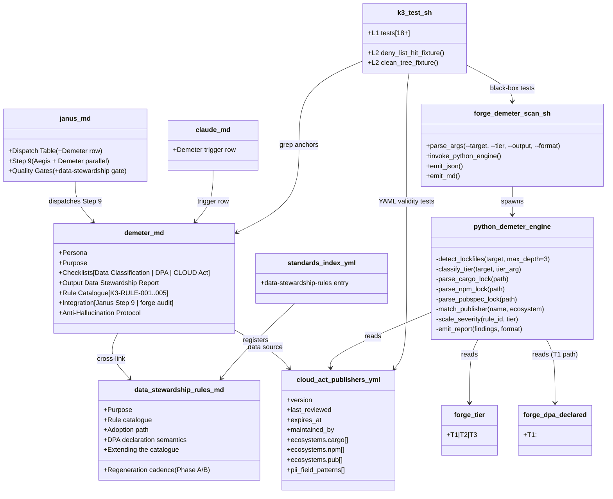
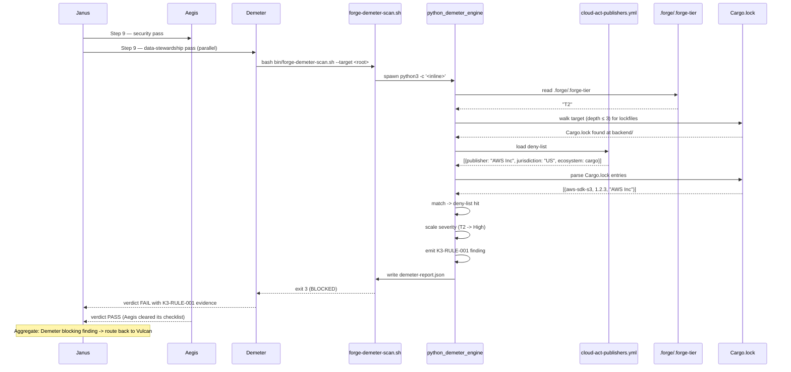
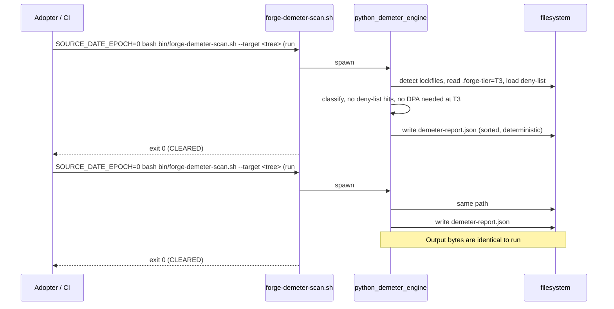

# Design: k3-demeter
<!-- Status: designed -->
<!-- Schema: default -->

> Read alongside `specs.md` (FR-K3-DEM-* / NFR-K3-DEM-*) and
> `open-questions.md` (Q-001..Q-003). This document locks the
> implementation strategy across the 3 sub-modules (K.3.a persona /
> K.3.b scanner / K.3.c standards-and-dispatch integration) and
> resolves Q-001 + Q-002 + Q-003 via ADR-K3-001..006.

## Architecture Decisions

### ADR-K3-001 — Persona file path : `.claude/agents/demeter.md`

**Context** : FR-K3-DEM-001 declares the persona file under
`.claude/agents/`. Three layout candidates were considered :

- **Option A** : `.claude/agents/demeter.md` — flat layout, same
  level as `security-auditor.md` (Aegis) and
  `cross-layer-orchestrator.md` (Janus).
- **Option B** : `.claude/agents/compliance/demeter.md` — group
  with future K.5 Themis under a `compliance/` subdirectory.
- **Option C** : `.claude/agents/data/demeter.md` — group with
  future Pythia (K.2) under a `data/` subdirectory.

**Decision** : **Option A — flat layout**. All 16 existing
Forge agents live flat in `.claude/agents/`. Sub-directories
exist for `flutter/` and `rust/` (sub-team specialists), but
top-level orchestrators / specialists are flat. Demeter is a
top-level specialist, not a sub-team member.

**Consequences** :
- ✅ Discoverability — single `ls .claude/agents/` shows the full
  agent roster.
- ✅ Symmetry with Aegis / Atlas / Panoptes / Socrates —
  Demeter is a sibling, not a sub-team member.
- ⚠️ When Themis (K.5) ships, the flat layout will be evaluated
  against a potential `compliance/` regroup. Out of scope here.

**Constitution Compliance** : Article XI.1 (agent-native
architecture). No violation.

---

### ADR-K3-002 — DPA declaration surface : `.forge/.forge-dpa-declared` plain text (resolves Q-001)

**Context** : Q-001 weighed three candidate declaration
surfaces : ledger file (Option A) vs `.forge.yaml` block (Option
B) vs both (Option C). FR-K3-DEM-040..044 require a
proof-of-attestation surface — Demeter does NOT parse legal
documents.

**Decision** : **Option A — ledger file** at
`.forge/.forge-dpa-declared`. Plain text, one line, content :
```
T1: <ISO-8601-date> <free-form-ref>
```
Mandatory trailing newline (POSIX). Example :
```
T1: 2026-04-15 LegalOps-Confluence-DPA-2026-Q2
```

The ledger MIRRORS the J.8 `.forge/.forge-tier` pattern shipped
by `j8-janus-rules` ADR-J8-006 verbatim. Both ledgers live in
`.forge/` (per-project, not committed by default — adopters
decide). Demeter reads via simple `cat`-equivalent in Python ;
no YAML parser dependency on the consumer side.

**Rejected alternatives** :
- **Option B** (`.forge.yaml` block) — risks slipping into
  legal-document territory. Demeter MUST NOT verify SCC clauses
  or signature authenticity (FR-K3-DEM-044 explicit
  out-of-scope). A schema-validatable structured block invites
  reviewers to add fields like `parties:`, `signatures:`,
  `expires:` which would creep toward legal parsing.
- **Option C** (both) — doubles the surface for inconsistency.
  When the ledger and the YAML disagree, which wins?
  Adjudication adds complexity without value.

**Consequences** :
- ✅ Trivial reader (1 line, no parser).
- ✅ Pattern parity with `.forge-tier` (one ledger family ;
  reviewers learn one shape).
- ✅ Adopter-side downstream tooling (deploy gates, CI checks)
  can grep without YAML deps.
- ⚠️ Limited extensibility — same trade-off as `.forge-tier`,
  acceptable per ADR-J8-006 reasoning. If richer DPA metadata is
  needed later, swap to YAML in a SemVer minor bump of the
  ledger format (track via a top-level `.forge-dpa-version`
  file if needed). Out of scope here.

**Constitution Compliance** : Articles III.4 (anti-hallucination
— attestation surface, not legal parsing), V (audit trail —
ledger is auditable). No violation.

---

### ADR-K3-003 — Publisher list governance : interim BDFL / 12-month, permanent Themis / 6-month (resolves Q-002)

**Context** : Q-002 weighed three orthogonal sub-questions
about `.forge/data/cloud-act-publishers.yml` :
- WHO curates : Demeter agent itself, Themis (K.5), or BDFL.
- WHAT frequency : 12-month aligned with `standards-lifecycle`
  vs 6-month rolling.
- WHAT triggers a mid-cycle refresh.

**Decision** : Two-phase governance per the K.3-K.5 ship
schedule :

**Phase A — Interim (T5 → T7, ~ 8 months)** :
- WHO : BDFL (per `GOVERNANCE.md`).
- FREQUENCY : 12-month default `expires_at` per
  `standards-lifecycle.md`.
- TRIGGER : explicit publisher acquisition (e.g. crates.io
  publisher acquired by US-jurisdiction parent), EDPB opinion
  shifting Schrems II interpretation.

**Phase B — Post-K.5 / Themis ship (T7+)** :
- WHO : Themis agent (proposes deny-list edits via PR).
- FREQUENCY : 6-month rolling cadence (faster than standards
  because acquisition velocity outpaces standards drift).
- TRIGGER : same as Phase A, plus Themis's monthly
  `forge review-standards` cycle (per
  `new-archetypes-plan` §1.4 row K.5).

The transition from Phase A to Phase B is a single PR (Themis
shipped + `cloud-act-publishers.yml::maintained_by:` edited).
No data migration required.

**Encoded in** :
- `.forge/data/cloud-act-publishers.yml::version` SemVer.
- `.forge/data/cloud-act-publishers.yml::last_reviewed` date.
- `.forge/data/cloud-act-publishers.yml::expires_at` date
  (Phase A : `last_reviewed + 12 months` ; Phase B :
  `last_reviewed + 6 months`).
- `.forge/data/cloud-act-publishers.yml::maintained_by` string.
- `.forge/standards/global/data-stewardship-rules.md` H2
  "Regeneration cadence" prose.

**Consequences** :
- ✅ Cadence acknowledges that the deny-list ages faster than
  the standards corpus (acquisition velocity).
- ✅ Two-phase split avoids waiting for K.5 ship to deploy K.3
  — interim governance is functional from day 1.
- ⚠️ The transition Phase A → B requires deliberate handoff
  (K.5 spec must reference this ADR). Captured in
  `tasks.md` as a forward-pointer note.

**Constitution Compliance** : Article XII (Governance
delegates to `GOVERNANCE.md` for Phase A maintainership ;
Themis ship in Phase B is itself a future change subject to
the constitution). No violation.

---

### ADR-K3-004 — Scanner architecture : F.2 / J.7 / J.8.d pattern verbatim

**Context** : FR-K3-DEM-060..074 + NFR-K3-DEM-004 require F.2 /
J.7 / J.8.d pattern alignment. The scanner walks lockfiles in
three ecosystems and emits a structured report.

**Decision** : `bin/forge-demeter-scan.sh` follows the F.2
pattern verbatim, identical to `forge-sbom.sh` shipped by
J.8.d :
- Bash header (`#!/usr/bin/env bash`, `set -uo pipefail`, no
  `-e` because we accumulate findings).
- Args parsing via simple `case` loop (`--target`, `--tier`,
  `--output`, `--format`).
- Python 3 inline via `python3 - <<'PY' ... PY` with stdin =
  formatted args.
- Output to file (default `demeter-report.json`) or stdout if
  `--output -`.
- Exit codes 0 / 1 / 2 / 3 per FR-K3-DEM-061.

The Python engine in 4 phases :
1. **Detect** : walk `--target` (max depth 3) for lockfiles ;
   build `(ecosystem, path)` tuples.
2. **Classify tier** : read `--tier` arg or
   `.forge/.forge-tier` ledger ; emit `[NEEDS CLARIFICATION:]`
   if ambiguous.
3. **Parse + match** : per-ecosystem parser emits flat
   `(name, version, publisher)` tuples ; match against
   `.forge/data/cloud-act-publishers.yml::ecosystems.*`.
4. **Emit** : assemble JSON report (or MD), sort findings by
   `(severity_rank, rule_id, evidence)` lexicographic key,
   write.

**Consequences** :
- ✅ NFR-K3-DEM-004 satisfied : pattern alignment.
- ✅ Reviewer cognitive load minimised — same shape as
  `forge-sbom.sh`.
- ✅ NFR-K3-DEM-005 reproducibility : `json.dumps(...,
  sort_keys=True, indent=2)` + `SOURCE_DATE_EPOCH`.
- ⚠️ Lockfile parsing tied to current upstream formats. Future
  format changes (Cargo schema bumps, npm v8 lock format
  drift) may require parser updates. Acceptable risk.

**Constitution Compliance** : Article VIII (CI artefact). No
violation.

---

### ADR-K3-005 — Rule-ID namespace : K3-RULE-NNN, 5 seed rules, incremental growth (resolves Q-003)

**Context** : Q-003 weighed pre-allocation (Option A — 10
rules) vs incremental (Option B — 5 rules now, 6+ later) for
the seed K.3 rule catalogue. ADR-J8-004 already locked the
`<MODULE>-RULE-NNN` format.

**Decision** : **Option B — 5 seed rules, incremental growth**.
Seed catalogue :

- **K3-RULE-001** — US-jurisdiction publisher (FR-K3-DEM-120).
- **K3-RULE-002** — DPA undeclared at T1 (FR-K3-DEM-121).
- **K3-RULE-003** — Tier downgrade refused (FR-K3-DEM-122).
- **K3-RULE-004** — Data classification missing (FR-K3-DEM-123).
- **K3-RULE-005** — Cargo workspace drift (FR-K3-DEM-124).

Plus operational rules emerging from NFR-K3-DEM-008 :

- **K3-RULE-006** — publisher list staleness
  (`expires_at < today`) — declared in spec FR-K3-DEM-073,
  severity `Medium`. This was originally numbered as part of
  the operational guardrails, not the seed catalogue, but is
  documented here for cross-reference.

Future K.3 extensions append `K3-RULE-007..` ; future audit
modules use their own prefix (e.g. `K5-RULE-NNN` for Themis
when K.5 ships).

**Rejected alternative** : Option A (pre-allocate 10) couples
K.3 to scope explicitly excluded by the proposal (I.2 / I.3 /
I.5 / I.6 are out of scope and would consume rule slots
prematurely).

**Numbering invariant** : per ADR-J8-004 inheritance, IDs are
NEVER reused. If K3-RULE-007 is decommissioned in a future
change, the catalogue marks it `DEPRECATED` ; the slot is not
recycled.

**Consequences** :
- ✅ Spec discipline preserved.
- ✅ 5 seed rules cover the 3 BDD scenarios + cross-tier
  enforcement matrix.
- ✅ Future audit modules can claim their own prefix without
  collision.

**Constitution Compliance** : Article V (audit trail). No
violation.

---

### ADR-K3-006 — PII heuristic for K3-RULE-004 : explicit field-name list, conservative

**Context** : FR-K3-DEM-123 declares `K3-RULE-004 — Data
classification missing` triggered by entity field names matching
PII heuristics. The heuristic must be deterministic (no LLM
call), conservative (false-positives annoy ; false-negatives
hide PII), and language-agnostic.

**Decision** : Explicit field-name regex list, case-insensitive,
applied to entity / DTO / proto field names :

```yaml
pii_field_patterns:
  # Identity
  - email
  - e-?mail
  - phone(_number)?
  - ssn
  - social_security
  - passport
  - national_id

  # Financial
  - iban
  - account_number
  - card_number
  - cc_number
  - cvv

  # Personal
  - first_?name
  - last_?name
  - full_?name
  - dob
  - date_of_birth
  - birthday
  - gender

  # Contact
  - address
  - postal_code
  - zip_code
  - street_address
  - billing_address

  # Sensitive
  - ip_address
  - device_id
  - mac_address
  - geo_location
  - latitude
  - longitude
```

The list is encoded in
`.forge/data/cloud-act-publishers.yml::pii_field_patterns` (or
in a sibling `pii-heuristics.yml` data file — locked at impl
time per task T-DEM-XXX). The list is deliberately
conservative and Anglo-Saxon-biased ; non-English projects MAY
extend the list via PR.

The heuristic is applied to :
- Rust struct field names (`grep`-able from the source).
- Dart class field names.
- Protobuf message field names.

The heuristic is **NOT** applied to local variables, arguments,
or comments. Scope is structural (entity / DTO / message), not
expressional.

**Rejected alternatives** :
- LLM-based classification : non-deterministic, requires LLM
  gateway access (T1 only per `compliance-tier.schema.json`),
  contradicts NFR-K3-DEM-005 reproducibility.
- Embedding-based similarity : same constraints as LLM.

**Consequences** :
- ✅ Deterministic, offline-capable.
- ✅ Reviewable in ≈ 30 LOC of YAML.
- ⚠️ False negatives (non-English field names, obfuscated
  names like `f1`, `data`) — adopters extend the list when
  needed. Documented in the standard.
- ⚠️ False positives (a field literally named `email_template`
  is not PII) — accepted ; severity is `Medium`, not blocking,
  so a Cleared-with-explanation entry is the natural escape
  hatch.

**Constitution Compliance** : Articles III.4 (anti-hallucination
— deterministic, no LLM call), XI.3 (schema-driven — the
heuristic is YAML-defined, not generated at runtime). No
violation.

---

### ADR-K3-007 — Janus integration : delta MODIFICATION to Step 9, no full rewrite

**Context** : FR-K3-DEM-080..081 require Janus dispatch-table
gain a Demeter row + Step 9 narrative gain a Demeter
paragraph. Article IV.1 requires delta-based modifications, no
wholesale rewrites.

**Decision** : Two surgical edits to
`.claude/agents/cross-layer-orchestrator.md` :

1. **Dispatch Table row addition** (one new row inserted after
   the Aegis row, before the closing `---`) :
   ```markdown
   | Data stewardship across layers — tier classification, DPA, CLOUD Act exposure | **Demeter** (Data Steward EU) | Demeter performs data-stewardship reviews that cross layer boundaries ; complementary to Aegis's vulnerability-focused security pass. |
   ```

2. **Step 9 H3 rename + paragraph addition** :
   - Rename H3 `### Step 9 — Security Pass (Aegis)` →
     `### Step 9 — Security & Data-Stewardship Pass (Aegis + Demeter)`.
   - Existing Aegis paragraph **unchanged**.
   - New Demeter paragraph appended :

   > After Aegis returns its verdict, Janus dispatches to
   > **Demeter** for a parallel data-stewardship review.
   > Demeter examines : declared compliance tier consistency
   > (`.forge/.forge-tier` ledger ↔ `--eu-tier` flag),
   > DPA declaration presence at T1
   > (`.forge/.forge-dpa-declared` ledger ↔ T1-flagged
   > components per ARCHITECTURE-TARGET §10.2), and
   > CLOUD Act exposure across all detected lockfiles per the
   > `K3-RULE-*` catalogue. Janus collects Demeter's verdict
   > and aggregates it alongside Aegis's. A finding from
   > Demeter at severity `Critical` or `High` is a blocking
   > result ; Janus MUST route it back to the responsible
   > specialist before proceeding to step 10. Demeter's
   > findings are independent from Aegis's — the two pass in
   > parallel without overlap.

**Quality Gates** H2 of `cross-layer-orchestrator.md` SHALL
also gain a one-bullet entry for "Data-stewardship gate —
dispatched to **Demeter** at step 9 alongside Aegis". This is
captured in `tasks.md` as a sibling delta.

**Constitution compliance** H2 of
`cross-layer-orchestrator.md` MUST gain a new bullet :
- Article IX.X (data stewardship as cross-layer surface) —
  Demeter has reviewed the tier classification + DPA + CLOUD
  Act exposure. *(Article reference locked at impl time per
  task T-JAN-K3-002 — Article IX.6 on AI features and
  Article XII on governance are the closest fits.)*

**Consequences** :
- ✅ Article IV.1 delta-based modification respected.
- ✅ The 12-step workflow shape preserved — only the
  semantics of Step 9 are extended.
- ⚠️ Janus reviewers (cross-layer changes) now see two
  parallel reviews. Documented in the new standard.

**Constitution Compliance** : Articles IV.1, V (audit trail
via the H2 dispatch table + Step 9 narrative). No violation.

---

## Component Design



## Data Flow — Demeter dispatched by Janus at Step 9 (T2 project, US-jurisdiction crate detected)



## Data Flow — Demeter standalone (T3 clean tree, deterministic re-run)



## Test Harness Design

### L1 — unit-level (≥ 18 tests, FR-K3-DEM-101)

The L1 layer treats each artefact as a black box and asserts
file presence + key anchors via grep / `_yq_eval`.

| Test ID                                  | FR covered                  | Anchor asserted                                                                          |
|------------------------------------------|-----------------------------|------------------------------------------------------------------------------------------|
| `_test_k3_001_persona_exists`            | FR-K3-DEM-001               | `.claude/agents/demeter.md` exists                                                       |
| `_test_k3_002_audit_comment`             | FR-K3-DEM-010               | `<!-- Audit: K.3 (k3-demeter) -->` comment at top of file                                |
| `_test_k3_003_persona_h2`                | FR-K3-DEM-002 / 003         | `## Persona` + `## Purpose` H2 anchors                                                   |
| `_test_k3_004_checklists_h2`             | FR-K3-DEM-004               | `## Checklists` H2 + ≥ 3 H3 sub-sections (Data Classification / DPA / CLOUD Act)         |
| `_test_k3_005_checklists_items`          | FR-K3-DEM-004               | each checklist sub-section has ≥ 5 `[ ]` items                                           |
| `_test_k3_006_output_h2`                 | FR-K3-DEM-005               | `## Output: Data Stewardship Report` H2 + Summary table                                  |
| `_test_k3_007_rule_catalogue`            | FR-K3-DEM-006 / 120..124    | `## Rule Catalogue` H2 + K3-RULE-001..005 anchors                                        |
| `_test_k3_008_integration`               | FR-K3-DEM-007               | `## Integration` H2 + cross-link to Janus Step 9                                         |
| `_test_k3_009_anti_halluc`               | FR-K3-DEM-008               | `## Anti-Hallucination Protocol` H2 + `[NEEDS CLARIFICATION:]` mention                   |
| `_test_k3_010_scanner_signature`         | FR-K3-DEM-060               | `bin/forge-demeter-scan.sh` exists, executable, signature parses                         |
| `_test_k3_011_scanner_exits`             | FR-K3-DEM-061               | exit codes 0/1/2/3 reachable from `--help` / dry-run paths                               |
| `_test_k3_012_scanner_no_lockfile`       | FR-K3-DEM-062               | scanner exits 2 when no lockfile found in target                                         |
| `_test_k3_013_publisher_list_yaml`       | FR-K3-DEM-064               | `.forge/data/cloud-act-publishers.yml` valid YAML                                        |
| `_test_k3_014_publisher_list_metadata`   | NFR-K3-DEM-008              | publisher list has `version`, `last_reviewed`, `expires_at`, `maintained_by`             |
| `_test_k3_015_standard_exists`           | FR-K3-DEM-083               | `.forge/standards/global/data-stewardship-rules.md` exists with ≥ 5 H2 sections          |
| `_test_k3_016_index_registered`          | FR-K3-DEM-082               | `data-stewardship-rules` entry in `standards/index.yml` with required triggers           |
| `_test_k3_017_janus_dispatch_row`        | FR-K3-DEM-080               | `cross-layer-orchestrator.md` Dispatch Table contains `**Demeter**` row                  |
| `_test_k3_018_janus_step9_modified`      | FR-K3-DEM-081 / ADR-K3-007  | Step 9 H3 renamed to "Security & Data-Stewardship Pass (Aegis + Demeter)"                |
| `_test_k3_019_claude_md_trigger`         | FR-K3-DEM-084               | repo `CLAUDE.md` agent table contains `Demeter` row                                      |
| `_test_k3_020_no_namespace_collision`    | FR-K3-DEM-086               | grep K3-RULE in J8-RULE files returns empty (and vice-versa)                             |

**20 L1 tests** — exceeds the FR-K3-DEM-101 ≥ 18 minimum.

### L2 — fixture-level (2 tests, FR-K3-DEM-102)

| Fixture                          | Coverage                                                                                             | Expected                                                                                  |
|----------------------------------|------------------------------------------------------------------------------------------------------|-------------------------------------------------------------------------------------------|
| `_test_k3_l2_deny_list_hit`      | tmpdir with synthetic Cargo.lock (1 EU crate + 1 deny-listed US crate) + `.forge/.forge-tier` = `T3` | exit 3, JSON has `overall_status: "BLOCKED"`, ≥ 1 K3-RULE-001 finding severity `Critical` |
| `_test_k3_l2_clean_tree_t2`      | tmpdir with synthetic Cargo.lock + package-lock.json (no deny-list hits) + `.forge-tier` = `T2`      | exit 0, JSON has `overall_status: "CLEARED"`, 0 findings, byte-identical re-run with SOURCE_DATE_EPOCH=0 |

### Performance (NFR-K3-DEM-001)

`bin/forge-demeter-scan.sh` against the example tree ≤ 8 s.
Harness `--level 1` ≤ 5 s ; full ≤ 20 s.

## Standards Applied

- **`global/scaffolding.md`** (B.5.1) — wrapper ABI preserved ;
  Demeter does NOT extend the wrapper ABI (it is a Janus-time
  agent, not a scaffold-time agent). Constraint asserted as a
  guard.
- **`global/janus-orchestration-rules.md`** (J.8) — sibling
  pattern. K3-RULE-NNN extends J8-RULE-NNN per ADR-J8-004. The
  K.3 standard `data-stewardship-rules.md` is authored in
  parallel structure to the J.8 standard.
- **`global/standards-lifecycle.md`** (T.4) — the new standard
  declares `expires_at` per the 12-month cadence. The
  publisher list YAML uses the same lifecycle convention.
- **`global/source-document-pinning.md`** (T.4) — the persona
  file cites `docs/ARCHITECTURE-TARGET.md` and
  `docs/new-archetypes-plan.md` with section + line pinning.
  SHA256 pinning of the source documents is OUT of scope here
  (already handled by T.4 drift detector for live-tree
  citations).
- **`compliance-tier.schema.json`** (T.4) — Demeter consumes
  verbatim ; no schema bump. T1 / T2 / T3 enum and
  `x-tier-descriptions` are the single source of truth.
- **`identity.yaml`** (T.4) + **`observability.yaml`** (T.4 +
  T.5) — Demeter cross-references the `forbidden:` blocks but
  does NOT modify the standards. Demeter is the runtime check
  surface ; the standards are the policy surface.
- **`global/forge-self-ci.md`** (G.1) — Demeter's harness
  `k3.test.sh` registers in `.github/workflows/forge-ci.yml`
  `harness` job matrix per the existing convention. Captured
  in `tasks.md`.

## Constitutional Compliance Gate

- **Article I (TDD)** : ✅ enforced via `k3.test.sh` RED → GREEN
  cadence ; tasks.md Phase 1 writes 18+ L1 stubs all FAIL.
- **Article II (BDD)** : ✅ 3 Gherkin scenarios in specs.md
  cover the 3 user-facing flows.
- **Article III (Specs Before Code)** : ✅ specs.md + design.md
  precede any implementation.
- **Article III.4** : ✅ Q-001/Q-002/Q-003 answered via
  ADR-K3-002/003/005. Open-questions.md flips to `answered` in
  `/forge:plan`.
- **Article IV (Delta-Based Changes)** : ✅ ADDED Requirements
  predominate ; the only MODIFIED entry is the
  `cross-layer-orchestrator.md` Step 9 narrative, captured per
  ADR-K3-007 with the exact delta block.
- **Article V (Audit Trail)** : ✅ FR-K3-DEM-* tags +
  `K3-RULE-NNN` IDs + structured JSON report shape are
  jointly machine-parseable.
- **Article VI (Flutter)** : N/A.
- **Article VII (Rust)** : N/A.
- **Article VIII (Infra)** : ✅ scanner is one-shot bash +
  Python 3, no service / daemon / privileged ops.
- **Article IX (Sec/Obs)** : ✅ Demeter realises the EU
  data-stewardship posture at review time. Observability of
  Demeter itself is OUT of scope (no OTel emission — Demeter
  is a spec-time / review-time agent, not a runtime
  component).
- **Article X (Code Quality)** : ✅ NFR-K3-DEM-007 preserves
  TS-strict (this change touches NO TypeScript) ; bash +
  Python pass shellcheck / pylint per existing CI gates.
- **Article XI (AI-First Design)** :
  - **XI.1 (Agent-Native)** : ✅ Demeter is a first-class
    agent persona file.
  - **XI.3 (Schema-Driven)** : ✅ Demeter outputs structured
    JSON ; no opaque LLM-generated content consumed
    downstream.
  - **XI.5 (Mandatory Fallback)** : ✅ offline mode
    (FR-K3-DEM-070) is the fallback when network access /
    `crates.io` enrichment is unavailable.
  - **XI.6 (Privacy / Data Minimisation)** : ✅ Demeter's PII
    heuristic (ADR-K3-006) operates on field NAMES only — no
    actual PII data is read or transmitted.
- **Article XII (Governance)** : ✅ Demeter ENFORCES the EU
  posture encoded in T.4 ADRs ; does NOT amend any
  constitutional article. The publisher-list governance
  (ADR-K3-003 Phase A → B) delegates to `GOVERNANCE.md` for
  maintainer assignment.

**No constitutional violation detected. Design proceeds to
`/forge:plan`.**

## Open Questions remaining post-design

- Q-001 → **answered by ADR-K3-002** (`.forge/.forge-dpa-declared`
  plain-text ledger, mirrors ADR-J8-006).
- Q-002 → **answered by ADR-K3-003** (Phase A : BDFL / 12-month
  interim ; Phase B : Themis / 6-month post-T7).
- Q-003 → **answered by ADR-K3-005** (5 seed rules, incremental
  growth, `K3-RULE-NNN` namespace per ADR-J8-004 inheritance).

`open-questions.md` will flip Q-001..Q-003 to `Status: answered`
during `/forge:plan` per the J.8 precedent.
