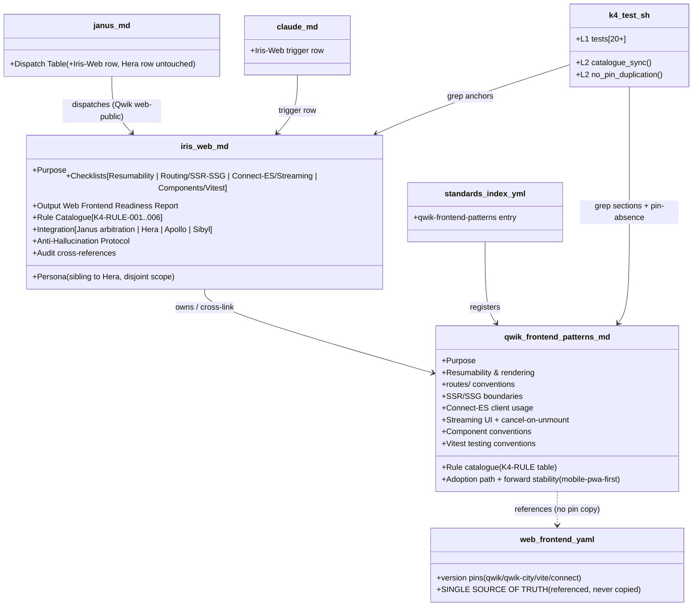
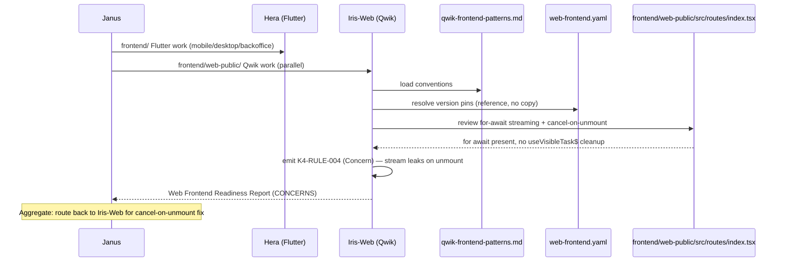

# Design: k4-iris-web
<!-- Status: designed -->
<!-- Schema: default -->

> Read alongside `specs.md` (FR-K4-IW-* / NFR-K4-IW-*) and
> `open-questions.md` (Q-001..Q-003). This document locks the
> implementation strategy across the 3 sub-modules (K.4.a persona /
> K.4.b conventions standard / K.4.c standards-and-dispatch
> integration) and resolves Q-001 + Q-002 + Q-003 via ADR-K4-001..003.

## Architecture Decisions

### ADR-K4-001 — Severity ladder : advisory (Advisory/Concern/Blocking), one Blocking rule (resolves Q-001)

**Context** : Q-001 weighed Demeter's refusal ladder
(Critical/High/Medium/Low/Informational) vs Sibyl's advisory ladder
(Advisory/Concern/Blocking) for Iris-Web's rule catalogue.

**Decision** : **Sibyl's advisory ladder**. Iris-Web *maintains
standards* and *reviews* the Qwik surface at design/review time — it
recommends, it does not refuse scaffolding. `web-frontend.yaml`
explicitly keeps machine enforcement OFF at birth ("that is
Iris-Web/K.4 territory"), so Iris-Web's findings are advisory by
construction. The single `Blocking` rule is **K4-RULE-005**
(server-only secret leaking into the client bundle) — a public web
surface leaking secrets is, like Sibyl's XI.5 fallback gate, a
non-negotiable that maps the report status to `BLOCKED`.

**Consequences** :
- ✅ Symmetry with Sibyl (the sibling advisory specialist).
- ✅ Documentation-first posture preserved ; no CI gate flipped.
- ⚠️ If a future change flips `web-frontend.yaml` `ci_blocking: true`,
  the ladder is re-evaluated (more rules may become `Blocking`). Out
  of scope here.

**Constitution Compliance** : Article XI.1 (agent-native). No
violation.

---

### ADR-K4-002 — Conventions standard is reference-only against web-frontend.yaml (resolves Q-002)

**Context** : Q-002 weighed reference-only (Option A — no pins
reproduced) vs reproduce-and-sync (Option B) vs merge into
`web-frontend.yaml` (Option C) for the new conventions standard's
relationship to the existing version-pin standard.

**Decision** : **Option A — reference-only**. `web-frontend.yaml`
(v1.0.0, B.8.9) owns the version PINS ; `qwik-frontend-patterns.md`
owns the CONVENTIONS. The conventions standard references
`web-frontend.yaml` as the single source of truth for pins and NEVER
reproduces a version number. This mirrors the B.8.9 reference-only
annotation (`transport.yaml owns these — NOT re-pinned here`).

**Rejected alternatives** :
- **Option B** (reproduce-and-sync) — duplicates pins ; drift is
  guaranteed the moment `web-frontend.yaml` bumps. NFR-K4-IW-003
  forbids it.
- **Option C** (merge into `web-frontend.yaml`) — mixes a fast-moving
  version-pin YAML (30-day cadence) with slow-moving prose
  conventions ; the two have different review lifecycles. Keeping them
  separate is the `data-stewardship-rules.md` (prose) vs
  `cloud-act-publishers.yml` (data) precedent.

**Consequences** :
- ✅ Zero pin drift ; the harness asserts the vite pin literal is
  absent from the standard (NFR-K4-IW-003).
- ✅ Two standards, two lifecycles, one source of truth per concern.

**Constitution Compliance** : Articles IV.1 (delta — additive
standard, no rewrite of `web-frontend.yaml`), XII (governance —
`standards-lifecycle.md` cadence honored). No violation.

---

### ADR-K4-003 — Rule-ID namespace : K4-RULE-NNN, 6 seed rules, incremental growth (resolves Q-003)

**Context** : Q-003 weighed pre-allocation (Option A — 10 rules) vs
incremental (Option B — 6 seed rules) for the K.4 catalogue.
ADR-J8-004 locked the `<MODULE>-RULE-NNN` format ; K3-RULE-* already
extended it.

**Decision** : **Option B — 6 seed rules, incremental growth**,
namespace `K4-RULE-NNN`. Seed catalogue :

- **K4-RULE-001** — Eager hydration instead of resumability
  (FR-K4-IW-120 ; `Concern`).
- **K4-RULE-002** — Business logic outside route loaders/actions
  (FR-K4-IW-121 ; `Concern`).
- **K4-RULE-003** — Connect transport re-instantiated per call
  (FR-K4-IW-122 ; `Advisory`).
- **K4-RULE-004** — Streaming without cancel-on-unmount
  (FR-K4-IW-123 ; `Concern`).
- **K4-RULE-005** — Server-only secret leaks into client bundle
  (FR-K4-IW-124 ; `Blocking`).
- **K4-RULE-006** — Web-public route/component missing Vitest coverage
  (FR-K4-IW-125 ; `Advisory`).

Future K.4 extensions append `K4-RULE-007..`. Per ADR-J8-004
inheritance, IDs are NEVER reused — decommissioned rules carry
`DEPRECATED`, the slot is not recycled. The `K4-RULE-*` namespace is
syntactically disjoint from `J8-RULE-*` / `K3-RULE-*`.

**Rejected alternative** : Option A (pre-allocate 10) couples K.4 to
speculative conventions not yet grounded in the shipped surface.

**Consequences** :
- ✅ 6 rules cover the 4 convention areas + the 3 BDD scenarios.
- ✅ Namespace disjoint from J.8 / K.3.

**Constitution Compliance** : Article V (audit trail). No violation.

---

### ADR-K4-004 — Janus integration : additive dispatch row, Hera's row untouched

**Context** : FR-K4-IW-083..085 require Janus's dispatch table to gain
an Iris-Web row WITHOUT narrowing Hera. `ARCHITECTURE-TARGET` §9.2 line
743 states Janus becomes the arbitration point between Iris-Web (Qwik)
and Hera (Flutter). Article IV.1 requires delta-based edits.

**Decision** : ONE additive edit to
`.claude/agents/cross-layer-orchestrator.md` Dispatch Table — a new
row inserted AFTER the Hera row and BEFORE the Vulcan row (grouping the
two `frontend/` owners adjacently) :

```markdown
| `frontend/web-public/` work — Qwik / SvelteKit resumability, routes, SSR/SSG boundaries, Connect-ES client, streaming UI, component + Vitest conventions | **Iris-Web** (Frontend Web Specialist) | Iris-Web owns the Qwik/SvelteKit public web surface (ADR-005) ; distinct from Hera (Flutter mobile + desktop + Flutter Web back-office). Janus arbitrates between the two frontend owners on the flagship (ARCHITECTURE-TARGET §9.2 line 743). |
```

Hera's existing row (`frontend/` Flutter work → Hera) is **NOT**
edited — Iris-Web claims only the Qwik public web surface, which Hera
never owned (ADR-005 keeps the Flutter Web back-office with Hera). The
edit is purely additive.

**Rejected alternative** : editing Hera's row to carve out "Flutter
only" — rejected because Hera's row already enumerates Flutter-specific
concerns (architecture, state-management, widgets, tests, a11y, i18n,
performance), so no narrowing is needed. Adding a second row is the
minimal delta.

**Consequences** :
- ✅ Article IV.1 delta respected ; NFR-K4-IW-006 (Hera scope intact).
- ✅ Janus now has two adjacent frontend owners ; the arbitration
  narrative in `ARCHITECTURE-TARGET` §9.2 line 743 is realised.
- ⚠️ A future full Janus 12-step integration (Iris-Web dispatched at a
  numbered step like Demeter at Step 9) is deferred — the dispatch-table
  row is the minimal wiring K.4 needs. Documented as a forward pointer.

**Constitution Compliance** : Articles IV.1, V. No violation.

---

## Component Design



## Data Flow — Iris-Web reviews a streaming route (Janus arbitration on the flagship)



## Test Harness Design

### L1 — unit-level (20 tests, FR-K4-IW-101)

Each artefact is treated as a black box ; presence + key anchors are
asserted via grep.

| Test ID                              | FR covered                | Anchor asserted                                                                 |
|--------------------------------------|---------------------------|---------------------------------------------------------------------------------|
| `_test_k4_001_persona_exists`        | FR-K4-IW-001              | `.claude/agents/iris-web.md` exists                                             |
| `_test_k4_002_audit_comment`         | FR-K4-IW-010              | `<!-- Audit: K.4 (k4-iris-web) -->` in first 5 lines                            |
| `_test_k4_003_persona_h2`            | FR-K4-IW-002 / 003        | `## Persona` + `## Purpose` H2                                                  |
| `_test_k4_004_checklists_h2`         | FR-K4-IW-004              | `## Checklists` + 4 H3 (Resumability / Routing / Connect-ES / Components-Vitest)|
| `_test_k4_005_checklists_items`      | FR-K4-IW-004              | each H3 has ≥ 5 `[ ]` items                                                     |
| `_test_k4_006_output_h2`             | FR-K4-IW-005              | `## Output: Web Frontend Readiness Report` + `| Severity |` table               |
| `_test_k4_007_rule_catalogue`        | FR-K4-IW-006 / 120..125   | `## Rule Catalogue` + K4-RULE-001..006 anchors                                  |
| `_test_k4_008_integration`           | FR-K4-IW-007              | `## Integration` + Janus arbitration + `cross-layer-orchestrator` + Hera        |
| `_test_k4_009_anti_halluc`           | FR-K4-IW-008              | `## Anti-Hallucination Protocol` + `[NEEDS CLARIFICATION:`                      |
| `_test_k4_010_audit_xrefs`           | FR-K4-IW-011              | `## Audit cross-references` + `ARCHITECTURE-TARGET` §9.2                        |
| `_test_k4_011_standard_exists`       | FR-K4-IW-080              | `qwik-frontend-patterns.md` exists with ≥ 5 H2                                  |
| `_test_k4_012_standard_resumability_routes_ssr` | FR-K4-IW-020..022 | standard covers resumability + routes + SSR/SSG                                 |
| `_test_k4_013_standard_connect_streaming` | FR-K4-IW-023..024   | standard covers Connect-ES + streaming/cancel-on-unmount + B.7.10 ref           |
| `_test_k4_014_standard_components_vitest` | FR-K4-IW-025..026   | standard covers `component$` + Vitest                                          |
| `_test_k4_015_standard_pins_reference` | FR-K4-IW-081            | standard references `web-frontend.yaml` (single source of truth)                |
| `_test_k4_016_index_registered`      | FR-K4-IW-082              | `qwik-frontend-patterns` entry in `index.yml` with required triggers            |
| `_test_k4_017_janus_dispatch_row`    | FR-K4-IW-083              | `cross-layer-orchestrator.md` Dispatch Table contains `**Iris-Web**` row        |
| `_test_k4_018_claude_md_trigger`     | FR-K4-IW-084              | repo `CLAUDE.md` agent table contains an Iris-Web row                           |
| `_test_k4_019_hera_scope_intact`     | FR-K4-IW-085 / NFR-006    | Hera's Flutter row still present in Janus + CLAUDE.md (additive, not narrowed)   |
| `_test_k4_020_namespace_forward`     | FR-K4-IW-085 / NFR-005    | no J8-RULE/K3-RULE leak into K.4 surfaces + `mobile-pwa-first` forward mention   |

### L2 — cross-surface (2 tests, FR-K4-IW-102)

| Fixture                          | Coverage                                                                 | Expected                                          |
|----------------------------------|--------------------------------------------------------------------------|---------------------------------------------------|
| `_test_k4_l2_catalogue_sync`     | every `K4-RULE-NNN` in `iris-web.md` also appears in the standard table  | both surfaces list K4-RULE-001..006               |
| `_test_k4_l2_no_pin_duplication` | standard references `web-frontend.yaml` AND omits the exact vite pin     | reference present, `7.3.5` literal absent         |

**22 tests** (20 L1 + 2 L2) — comparable to k3.test.sh's 22.

## Standards Applied

- **`global/standards-lifecycle.md`** (T.4) — the new MD standard is
  prose (no dated frontmatter contract like the YAML standards) ;
  mirrors `data-stewardship-rules.md` / `janus-orchestration-rules.md`.
- **`web-frontend.yaml`** (B.8.9) — consumed by reference as the
  single source of truth for version pins. NOT modified, NOT copied.
- **`transport.yaml`** (B.8.6 / T.4) — owns `@connectrpc/connect`
  `^2.0.0` ; referenced for the Connect-ES convention, not re-pinned.
- **`global/janus-orchestration-rules.md`** (J.8) — sibling pattern ;
  `K4-RULE-NNN` extends `J8-RULE-NNN` per ADR-J8-004.
- **`global/forge-self-ci.md`** (G.1) — `k4.test.sh` registers in
  `.github/workflows/forge-ci.yml` `harness` matrix per convention.

## Constitutional Compliance Gate

- **Article I (TDD)** : ✅ `k4.test.sh` RED → GREEN cadence ; tasks.md
  Phase 1 writes 22 stubs all FAIL.
- **Article II (BDD)** : ✅ 3 Gherkin scenarios in specs.md.
- **Article III (Specs Before Code)** : ✅ specs.md + design.md precede
  implementation.
- **Article III.4** : ✅ Q-001/Q-002/Q-003 answered via
  ADR-K4-001/002/003.
- **Article IV (Delta-Based Changes)** : ✅ ADDED requirements
  predominate ; the only MODIFIED surfaces are additive rows (Janus
  dispatch, CLAUDE.md, index). Hera's row untouched (ADR-K4-004).
- **Article V (Audit Trail)** : ✅ FR-K4-IW-* tags + `K4-RULE-NNN` IDs.
- **Article VI (Flutter)** : N/A — this change does not touch Flutter
  (Hera's scope preserved).
- **Article VII (Rust)** : N/A.
- **Article VIII (Infra)** : ✅ no service / scanner / daemon.
- **Article IX (Sec/Obs)** : ✅ K4-RULE-005 (secret-leak) is the
  security-adjacent Blocking rule for the public web surface.
- **Article X (Code Quality)** : ✅ NFR-K4-IW-004 preserves TS-strict
  (touches NO TypeScript) ; Vitest conventions target the 80%
  threshold.
- **Article XI (AI-First Design)** :
  - **XI.1 (Agent-Native)** : ✅ Iris-Web is a first-class persona.
  - **XI.3 (Schema-Driven)** : ✅ structured Web Frontend Readiness
    Report ; no opaque generated content downstream.
- **Article XII (Governance)** : ✅ Iris-Web ENFORCES the ADR-005
  Qwik conventions ; does NOT amend any article. The standard follows
  `standards-lifecycle.md`.

**No constitutional violation detected. Design proceeds to
`/forge:plan`.**

## Open Questions remaining post-design

- Q-001 → **answered by ADR-K4-001** (advisory ladder, one Blocking
  rule K4-RULE-005).
- Q-002 → **answered by ADR-K4-002** (reference-only against
  `web-frontend.yaml`, no pin duplication).
- Q-003 → **answered by ADR-K4-003** (6 seed rules, incremental,
  `K4-RULE-NNN` per ADR-J8-004 inheritance).
