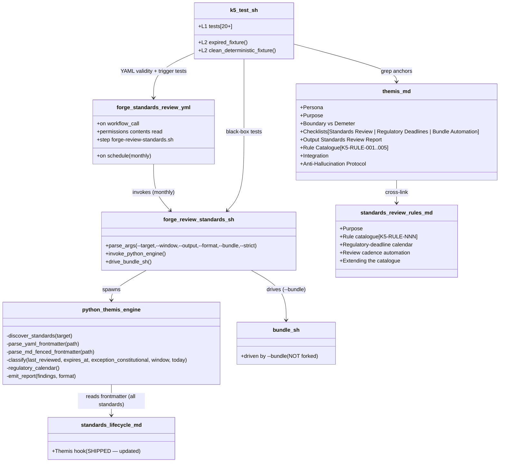

# Design: k5-themis
<!-- Status: designed -->
<!-- Schema: default -->

> Read alongside `specs.md` (FR-K5-THE-* / NFR-K5-THE-*) and
> `open-questions.md` (Q-K5-001..Q-K5-003). This document locks the
> implementation strategy across the 3 sub-modules (K.5.a persona /
> K.5.b CLI / K.5.c standards-workflow-dispatch integration) and
> resolves Q-K5-001 + Q-K5-002 + Q-K5-003 via ADR-K5-001..006.

## Architecture Decisions

### ADR-K5-001 — Persona file path : `.claude/agents/themis.md` (flat)

**Context** : FR-K5-THE-001 declares the persona under `.claude/agents/`.
Demeter's ADR-K3-001 already flagged that "when Themis (K.5) ships, the
flat layout will be evaluated against a potential `compliance/`
regroup."

**Decision** : **flat layout** — `.claude/agents/themis.md`, sibling to
`demeter.md`. The `compliance/` regroup is deferred : moving Demeter
into a subdirectory now would break `k3.test.sh` (which hard-codes
`.claude/agents/demeter.md`) and the Janus dispatch cross-links. A
regroup is a separate, cross-agent refactor out of K.5 scope.

**Consequences** : ✅ discoverability (`ls .claude/agents/`) ; ✅
symmetry with Demeter ; ⚠️ two compliance agents live flat — acceptable,
documented.

**Constitution** : Article XI.1. No violation.

---

### ADR-K5-002 — CLI architecture : F.2 / J.7 / J.8.d / K.3 pattern verbatim

**Context** : FR-K5-THE-020..036 + NFR-K5-THE-004 require pattern
alignment with the existing bash-thin + Python-3-inline scanners.

**Decision** : `bin/forge-review-standards.sh` mirrors
`bin/forge-demeter-scan.sh` verbatim :
- Bash header (`#!/usr/bin/env bash`, `set -uo pipefail`, no `-e` —
  findings accumulate).
- `case` arg loop (`--target`, `--window`, `--output`, `--format`,
  `--bundle`, `--strict`, `--help`), bogus arg → exit 2.
- `python3 - "$TARGET" ... <<'PY' ... PY` inline engine.
- 4 phases : (1) **discover** — `os.walk(.forge/standards)` collecting
  `*.yaml` + `*.md`, excluding `REVIEW.md` + `index.yml` ; (2) **parse
  frontmatter** — for `*.yaml` read top-level keys ; for `*.md` extract
  the first fenced ```` ```yaml ```` block and read keys ; (3)
  **classify** — FRESH / DUE-SOON / EXPIRED / STRUCTURAL + emit
  K5-RULE findings + build the regulatory calendar ; (4) **emit** —
  JSON (sort_keys) or MD, sorted deterministically.

**Frontmatter parsing** : the `*.md` frontmatter is a fenced ```yaml
block, NOT true document frontmatter. The engine scans for the first
line matching ```` ```yaml ```` and reads subsequent lines until the
closing ```` ``` ````, parsing `key: value` at any indentation ≤ the
block. YAML standards (`*.yaml`) parse via a line scan for top-level
(column-0) `last_reviewed:` / `expires_at:` / `exception_constitutional:`
/ `version:` — deliberately NOT a full `yaml.safe_load` (the `.yaml`
standards carry `#`-comments and rationale blocks that a naive load
tolerates, but a targeted key scan is more robust to the mixed
comment/`>-` folded-scalar shapes seen in `identity.yaml` /
`observability.yaml`). PyYAML remains available for the `*.md` fenced
block where it is clean.

**Consequences** : ✅ NFR-K5-THE-004 satisfied ; ✅ reviewer cognitive
load minimised ; ✅ NFR-K5-THE-005 reproducibility via
`json.dumps(sort_keys=True)` + `SOURCE_DATE_EPOCH`.

**Constitution** : Article VIII (CI script). No violation.

---

### ADR-K5-003 — Rule-ID namespace : K5-RULE-NNN, 5 seed rules, incremental (resolves Q-K5-003 numbering)

**Context** : Demeter's ADR-K3-005 reserved `K5-RULE-NNN` for Themis.
Q-K5-003 weighed pre-allocation vs incremental growth.

**Decision** : **5 seed rules, incremental growth**, namespace
`K5-RULE-NNN` :
- **K5-RULE-001** — Standard past review window (FR-K5-THE-070 ;
  Medium ; blocking only under `--strict`).
- **K5-RULE-002** — Standard due for review (FR-K5-THE-071 ; Low).
- **K5-RULE-003** — Standard missing lifecycle frontmatter
  (FR-K5-THE-072 ; Medium / Informational for pre-T.4 prose).
- **K5-RULE-004** — Regulatory deadline on horizon (FR-K5-THE-073 ;
  Informational).
- **K5-RULE-005** — Structural-exception coherence (FR-K5-THE-074 ;
  Medium).

Future extensions append `K5-RULE-006..`. Per ADR-J8-004 inheritance,
IDs are NEVER reused ; decommissioned rules carry `DEPRECATED`.

**Namespace non-collision** (FR-K5-THE-086 / NFR-K5-THE-006) :
`K5-RULE` MUST NOT appear in K.3 surfaces (`demeter.md`,
`data-stewardship-rules.md`, `forge-demeter-scan.sh`) except the single
forward-reference Demeter already carries ; `K3-RULE` MUST NOT appear
in Themis surfaces. The harness asserts both directions.

**Constitution** : Article V. No violation.

---

### ADR-K5-004 — Missing-frontmatter severity split (resolves the pre-T.4 corpus false-positive risk)

**Context** : FR-K5-THE-025. The `.forge/standards/` tree carries ~40
files. The T.4-era `*.yaml` standards + the compliance `global/*.md`
standards carry the frontmatter contract ; but the pre-T.4 prose
standards (`flutter/*.md`, `rust/*.md`, `infra/*.md`,
`observability/*.md`, and many `global/*.md` like `naming.md`,
`solid.md`) do NOT. Flagging all of them Medium would produce a
false-positive storm and drown the real signal.

**Decision** : two-tier severity for `K5-RULE-003` :
- **Medium** — a top-level `*.yaml` standard (registered in `index.yml`
  with `path: standards/*.yaml`) OR a `global/*.md` compliance-family
  standard that a reasonable maintainer expects to carry the contract,
  missing `last_reviewed`/`expires_at`.
- **Informational** — a sub-directory prose standard (`flutter/`,
  `rust/`, `infra/`, `observability/`) missing frontmatter. These
  predate the T.4 contract ; migrating them is a separate backlog item,
  not a K.5 blocker.

The split is encoded as a directory heuristic in the Python engine.

**Consequences** : ✅ real signal (stale `*.yaml` pins) is not buried ;
⚠️ the heuristic is Forge-corpus-specific — documented in the standard.

**Constitution** : Article III.4 (deterministic, no guessing). No
violation.

---

### ADR-K5-005 — Workflow placement : sibling `forge-standards-review.yml`, NOT a step in `forge-compliance.yml` (resolves Q-K5-001)

**Context** : Q-K5-001. The plan (§0.11 lines 449-451) says
`forge-compliance.yml` is "forward-stable pour les artefacts
réglementaires Themis-territory … additive step additions per
FR-I5-CW-083." So an additive step is *sanctioned*. But three factors
argue for a sibling workflow instead.

**Decision** : **new sibling workflow**
`.github/workflows/forge-standards-review.yml` with `on: schedule:`
(monthly cron) + `on: workflow_call:`.

**Rationale (the tradeoff, per the task brief)** :

1. **Trigger mismatch**. `forge-compliance.yml` is a **per-PR / per-push
   gate** keyed on `eu-tier`, invoked by adopters on every change.
   Themis's cadence is **time-triggered** (monthly — realising
   `standards-lifecycle.md` line 73's "issue de revue mensuelle"). A
   `schedule:` trigger cannot live cleanly inside a `workflow_call:`-only
   reusable workflow ; bolting it on would require either a second
   trigger on the shared file (polluting every adopter PR with a
   cadence run) or dead conditional logic.

2. **Blocking-posture mismatch**. `forge-compliance.yml` **BLOCKS** on
   Demeter/linter/bundle failure (exit 1 aggregation). Themis is
   **WARN-only** (`standards-lifecycle.md` : "WARN n'est jamais
   bloquant"). Mixing a non-blocking cadence into a blocking gate
   conflates two lifecycles and risks either false-blocking on review
   debt or a confusing `continue-on-error` island inside the gate.

3. **Sibling-harness safety** (NFR-K5-THE-006). `i5.test.sh::_test_i5_007`
   pins `forge-compliance.yml`'s exact step set (demeter / linter /
   sbom / bundle). Adding a Themis step would break that pinned
   harness — a sibling-harness regression the memory
   `shared_standard_sibling_harness_coupling` explicitly warns against.
   A sibling workflow sidesteps it entirely.

**Rejected alternative** : additive step in `forge-compliance.yml`.
Sanctioned by FR-I5-CW-083 but blocked in practice by (1)–(3). If a
future change wants both surfaces unified, it can re-home the cadence
as a `workflow_call` job the compliance workflow *optionally* invokes —
out of K.5 scope.

**Consequences** : ✅ ambient monthly cadence matches Themis's
repo-lifecycle-time nature ; ✅ zero edit to the pinned I.5 gate ; ⚠️
two compliance-family workflows — documented in `standards-review-rules.md`.

**Constitution** : Articles VIII (CI), IV.1 (no rewrite of the I.5
workflow). No violation.

---

### ADR-K5-006 — Bundle interaction : DRIVE `bundle.sh`, never fork or bump the I.6 standard (resolves Q-K5-001 bundle facet)

**Context** : the task brief says Themis should "DRIVE/AUTOMATE, not
replace or fork" the I.6 bundle. `compliance-artefacts-bundle.md`
Interdiction #3 reserves NIS2/CRA members "before Themis (K.5, T7+)
ships" — Themis is now shipping, so the reservation is lifted in
principle. BUT `i6.test.sh::_test_i6_021` exact-pins the bundle
standard at `version: 1.1.0` / `last_reviewed: 2026-06-22` /
`expires_at: 2027-06-22`. Any frontmatter bump breaks that sibling
harness (NFR-K5-THE-006).

**Decision** : `forge-review-standards.sh --bundle` **drives** the
existing `.forge/scripts/compliance/bundle.sh` (invokes it,
propagating `SOURCE_DATE_EPOCH`) and emits a standalone
`forge-regulatory-deadlines.md` summary alongside the report. It does
NOT :
- edit or byte-alter `bundle.sh` (its determinism recipe is frozen),
- bump `compliance-artefacts-bundle.md` (exact-pinned by i6),
- inject NIS2/CRA member files into the `.tgz` (that would require the
  standard bump + touch the frozen recipe).

The "extend the bundle with a regulatory-deadline summary" requirement
(FR-K5-THE-032) is satisfied by driving the canonical bundle AND
producing the deterministic deadline summary as a companion artefact —
the minimal viable interpretation that honours "drive, not fork" and
leaves every sibling harness GREEN. A future change (when the I.6
standard is next reviewed on its own cadence) may fold the NIS2/CRA
members into the `.tgz` with the sanctioned additive minor bump.

**Consequences** : ✅ zero sibling-harness breakage ; ✅ Themis
demonstrably drives the I.6 bundle ; ⚠️ NIS2/CRA members do not yet
ride the `.tgz` — deferred to the I.6 standard's own review, noted in
`standards-review-rules.md`.

**Constitution** : Articles IV.1 (no rewrite of the I.6 script/standard),
III.4 (regulatory summary carries only verbatim-sourced dates). No
violation.

---

## Component Design



## Data Flow — monthly cadence run (one expired standard)

```mermaid
sequenceDiagram
    participant Cron as GitHub schedule (monthly)
    participant WF as forge-standards-review.yml
    participant CLI as forge-review-standards.sh
    participant Py as python_themis_engine
    participant FS as .forge/standards/

    Cron->>WF: trigger (cron)
    WF->>CLI: bash bin/forge-review-standards.sh --target .
    CLI->>Py: spawn python3 -c '<inline>'
    Py->>FS: os.walk, collect *.yaml + global/*.md
    FS-->>Py: [transport.yaml (never), gateway.yaml (2027-05-31), ...]
    Py->>Py: classify each (skip structural; compare expires_at vs today+window)
    Py->>Py: gateway.yaml expired -> K5-RULE-001 Medium
    Py->>Py: build regulatory calendar (verbatim dates)
    Py->>CLI: write standards-review-report.json (sorted, deterministic)
    CLI-->>WF: exit 1 (REVIEW-DUE, WARN)
    Note over WF: continue-on-error: true -> job SUCCEEDS, review debt surfaced in logs
```

## Test Harness Design

### L1 — unit-level (≥ 20 tests, FR-K5-THE-101)

| Test ID | FR | Anchor |
|---|---|---|
| `_test_k5_001_persona_exists` | FR-K5-THE-001 | `.claude/agents/themis.md` exists |
| `_test_k5_002_audit_comment` | FR-K5-THE-010 | `<!-- Audit: K.5 (k5-themis) -->` in first 5 lines |
| `_test_k5_003_persona_h2` | FR-K5-THE-002/003 | `## Persona` + `## Purpose` |
| `_test_k5_004_boundary_h2` | FR-K5-THE-004 | `## Boundary — Themis vs Demeter` + scaffold-time/repo-lifecycle-time terms |
| `_test_k5_005_checklists_h2` | FR-K5-THE-005 | `## Checklists` + 3 H3 |
| `_test_k5_006_checklists_items` | FR-K5-THE-005 | ≥ 5 `[ ]` per H3 |
| `_test_k5_007_output_h2` | FR-K5-THE-006 | `## Output: Standards Review Report` + Summary table |
| `_test_k5_008_rule_catalogue` | FR-K5-THE-007/070..074 | `## Rule Catalogue` + K5-RULE-001..005 |
| `_test_k5_009_integration` | FR-K5-THE-008 | `## Integration` + `forge review-standards` + bundle drive |
| `_test_k5_010_anti_halluc` | FR-K5-THE-009 | `## Anti-Hallucination Protocol` + `[NEEDS CLARIFICATION:` |
| `_test_k5_011_cli_signature` | FR-K5-THE-020/035 | CLI exists, executable, shebang, `set -uo pipefail`, flags |
| `_test_k5_012_cli_help_exit0` | FR-K5-THE-035 | `--help` exits 0 + `Usage:` |
| `_test_k5_013_cli_bogus_exit2` | FR-K5-THE-035 | bogus arg exits 2 |
| `_test_k5_014_cli_empty_tree_exit2` | FR-K5-THE-036 | no `.forge/standards/` → exit 2 |
| `_test_k5_015_cli_regulatory_verbatim` | FR-K5-THE-027 | CLI carries verbatim NIS2/DORA/CRA/AI-Act dates |
| `_test_k5_016_standard_exists` | FR-K5-THE-050 | `standards-review-rules.md` ≥ 5 H2 |
| `_test_k5_017_index_registered` | FR-K5-THE-051 | index entry + triggers (themis, review-standards, nis2, dora, cra, ai-act, k5-rule) |
| `_test_k5_018_lifecycle_updated` | FR-K5-THE-052 | standards-lifecycle.md Themis section says shipped + keeps structural table |
| `_test_k5_019_workflow_presence` | FR-K5-THE-060/061/063 | workflow parses, has schedule + workflow_call + permissions |
| `_test_k5_020_workflow_invocation` | FR-K5-THE-062 | workflow invokes forge-review-standards.sh |
| `_test_k5_021_claude_md_trigger` | FR-K5-THE-053 | CLAUDE.md Themis row |
| `_test_k5_022_guide_row` | FR-K5-THE-054 | GUIDE.md Themis row |
| `_test_k5_023_compliance_doc_h2` | FR-K5-THE-055 | COMPLIANCE.md Themis H2 |
| `_test_k5_024_no_namespace_collision` | FR-K5-THE-086 | K5-RULE not in K.3 surfaces ; K3-RULE not in Themis surfaces |
| `_test_k5_025_changelog_entry` | FR-K5-THE-111 | CHANGELOG references k5-themis |

**25 L1 tests** — exceeds the FR-K5-THE-101 ≥ 20 minimum.

### L2 — fixture-level (2 tests, FR-K5-THE-102)

| Fixture | Coverage | Expected |
|---|---|---|
| `_test_k5_l2_expired` | tmpdir `.forge/standards/` : 1 expired MD standard + 1 fresh YAML standard + 1 structural (`never`) | exit 1, `overall_status: "REVIEW-DUE"`, ≥ 1 `K5-RULE-001` Medium citing the expired path |
| `_test_k5_l2_clean_deterministic` | tmpdir where all standards fresh/structural + `SOURCE_DATE_EPOCH=0` × 2 | exit 0, `overall_status: "CLEARED"`, byte-identical reports |

### Performance (NFR-K5-THE-001)

CLI against live tree ≤ 5 s ; harness `--level 1` ≤ 5 s ; full ≤ 20 s.

## Standards Applied

- **`global/standards-lifecycle.md`** (T.4) — the cadence Themis
  automates ; the "Themis hook" section is delta-updated to "shipped."
- **`global/data-stewardship-rules.md`** (K.3) — sibling rule-catalogue
  pattern ; K5-RULE-NNN extends J8-RULE-NNN per ADR-J8-004, distinct
  from K3-RULE-NNN.
- **`global/compliance-artefacts-bundle.md`** (I.6) — Themis drives
  `bundle.sh` ; the standard is NOT bumped (i6 pin).
- **`global/forge-compliance-workflow.md`** (I.5) — sibling workflow
  pattern ; the I.5 workflow is NOT edited (i5 pin).
- **`global/scaffolding.md`** (B.5.1) — Themis does NOT extend the
  scaffolder ABI (repo-lifecycle-time agent, not scaffold-time).
- **`global/forge-self-ci.md`** (G.1) — `k5.test.sh` registers in
  `forge-ci.yml` `harness` matrix per the existing convention.

## Constitutional Compliance Gate

- **Article I (TDD)** : ✅ `k5.test.sh` RED → GREEN cadence ; Phase 1
  writes 20+ L1 stubs all FAIL.
- **Article II (BDD)** : ✅ 3 Gherkin scenarios in specs.md.
- **Article III + III.4** : ✅ specs precede code ; regulatory dates
  verbatim from the plan doc ; Q-K5-001..003 resolved via ADRs.
- **Article IV (Delta)** : ✅ standards-lifecycle / CLAUDE.md / GUIDE.md
  / COMPLIANCE.md edits are additive deltas.
- **Article V (Audit Trail)** : ✅ FR-K5-THE-* tags + K5-RULE-NNN IDs.
- **Article VI / VII** : N/A.
- **Article VIII (Infra)** : ✅ one-shot bash + Python 3 ; sibling
  workflow `contents: read`.
- **Article IX (Obs)** : ✅ Themis is repo-lifecycle-time ; no OTel
  emission.
- **Article X (Quality)** : ✅ no TypeScript touched (NFR-K5-THE-007) ;
  bash + Python pass shellcheck / existing gates.
- **Article XI (AI-First)** : ✅ XI.1 agent-native persona ; XI.3
  schema-driven JSON output.
- **Article XII (Governance)** : ✅ Themis ENFORCES the cadence, does
  NOT amend ; structural exceptions (`transport.yaml`,
  `state-management.yaml`, `expires_at: never`) are NEVER flagged.

**No constitutional violation detected. Design proceeds to
`/forge:plan`.**

## Open Questions remaining post-design

- Q-K5-001 → **answered by ADR-K5-005 + ADR-K5-006** (sibling workflow
  ; drive-not-fork bundle).
- Q-K5-002 → **answered by ADR (verbatim)** — regulatory dates copied
  verbatim from `new-archetypes-plan.md` §7.1 I.6 bullet, never
  re-derived (Article III.4 ; NFR-K5-THE-009).
- Q-K5-003 → **answered by ADR-K5-003 + the WARN doctrine** (WARN-only
  default, `--strict` opt-in blocking).
