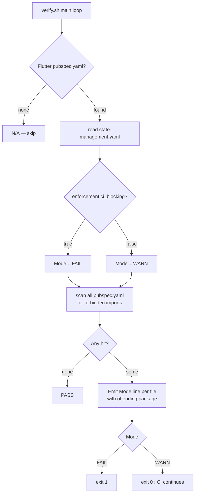
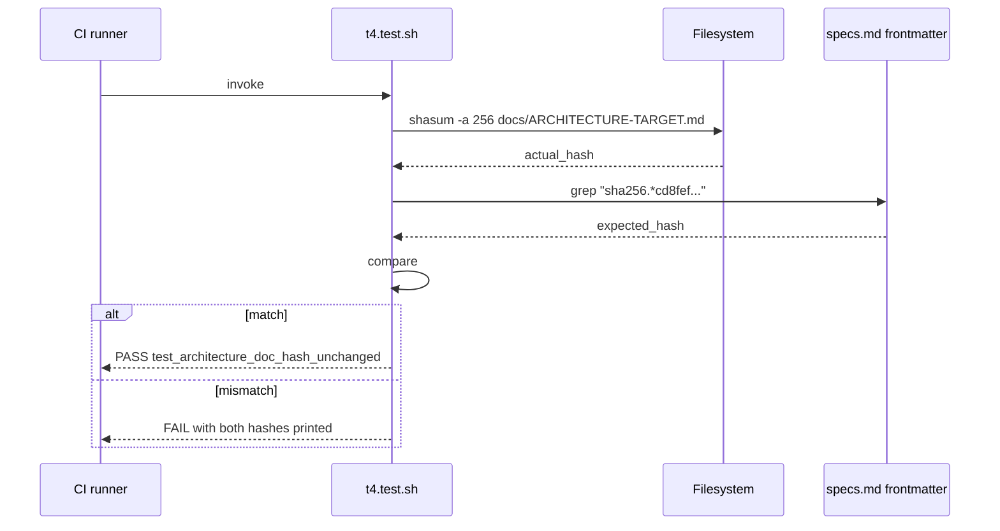
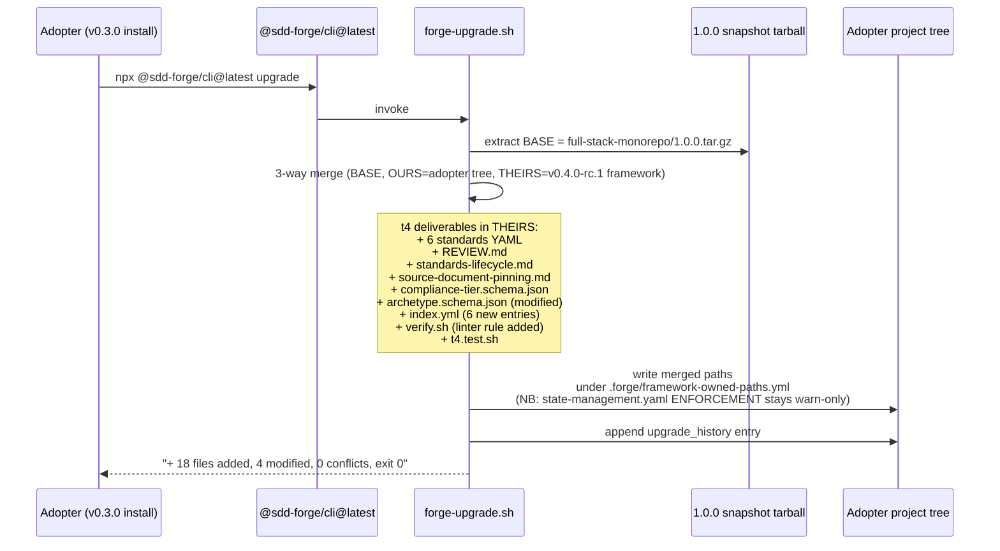

# Design: t4-adr-ratification
<!-- Status: designed -->
<!-- Schema: default -->

## 0. Scope and intent

This is a **methodology change** — no runtime code is touched. The deliverables
are 18 declarative artefacts (YAML / JSON / Markdown / shell harness) that
ratify the 10 ADRs of `docs/ARCHITECTURE-TARGET.md` (sha256
`cd8fef37…3de925`) under Constitution v1.1.0, materialise the 6 versioned
standards announced by `docs/new-archetypes-plan.md`, install the 12-month
review cycle, and add JSON schemas for the new compliance-tier dimension and
the 5-archetype taxonomy.

**Out of scope (deferred per `proposal.md::Scope Out`)** : agent refactor (P-5),
B.6/B.7/B.8/B.9 implementations, Constitution amendment, Themis agent (K.5),
flagship migration script (B.8 / T6).

---

## 1. Architecture Decisions (verbatim ratification)

Each ADR below is the canonical Forge-internal record of a decision documented
in `docs/ARCHITECTURE-TARGET.md`. The Decision / Context / Consequences
triplets are reproduced verbatim from that document at the lines indicated.
The hash gate (FR-T4-LNT-002) ensures the line ranges stay authoritative.

### ADR-001 — REPLACE Kong → Envoy Gateway

> Source : `docs/ARCHITECTURE-TARGET.md` lines 315–326 (sha256 cd8fef37…)

- **Decision** : Remplacer Kong par Envoy Gateway sur l'archétype
  `full-stack-monorepo`.
- **Context** : Latence p99 supérieure (Lua plugin chain), control plane
  DB-coupled, propagation routes ~3 s, multi-Gateway non isolé. Envoy Gateway
  est CNCF, Gateway API natif, ms-level propagation, xDS dynamique
  [source: dev.to/mechcloud_academy/kubernetes-gateway-api-in-2026,
  accessed 2026-04].
- **Consequences** :
  - ✅ Latence p99 réduite (~50 µs idle), service mesh path possible (Istio
    Ambient ou Cilium).
  - ✅ Standardisation sur Gateway API → portabilité.
  - ❌ Perte de plugins Kong commerciaux (rate-limit, dev portal) — à
    reconstruire via Envoy filters Wasm ou ajouter Apigee/Tyk en complément
    si besoin.
  - ❌ Courbe d'apprentissage CRD Gateway API.
- **Forge ratification** : referenced from `transport.yaml` (FR-T4-STD-001).
  Activation deferred to B.8 (T6 — flagship migration). No template change
  in this ratification.
- **Constitution compliance** : Article VIII (Infrastructure) — KEEP-WITH-CHANGES,
  K8s base unchanged ; new Helm overlay required at B.8 time. Article IX
  (Security) — Aegis review required at B.8 to assess privileged DaemonSets
  and trust boundary shift.

### ADR-002 — KEEP-WITH-CHANGES Temporal → DBOS par défaut

> Source : `docs/ARCHITECTURE-TARGET.md` lines 328–340

- **Decision** : Adopter DBOS comme orchestrateur par défaut dans
  `full-stack-monorepo`. Temporal réservé à `event-driven-eu`.
- **Context** : Temporal exige un cluster dédié (Cassandra ou Postgres +
  frontend/history/matching/worker services). Pour la majorité des workflows
  monorepo (charge < 1k workflows/s, < 10 services), DBOS suffit avec
  Postgres déjà présent
  [source: dbos.dev/blog/durable-execution-coding-comparison, accessed 2026-04].
- **Consequences** :
  - ✅ -1 control plane, -50 % TCO ops.
  - ✅ Workflows expressivement code, pas DSL.
  - ❌ Migration Temporal→DBOS non triviale si déjà en prod.
  - ❌ DBOS Go SDK encore récent (avril 2026), maturité <
    Temporal [source: tiarebalbi.com/en/blog/dbos-vs-temporal-postgres-durable-execution,
    accessed 2026-04].
- **Forge ratification** : referenced from `orchestration.yaml` (FR-T4-STD-004).
  Fallback trigger : `workflow_volume_per_day_gt_10000 OR cross_service_count_gt_10`.
  Activation deferred to B.8 (T6).
- **Constitution compliance** : Article VII (Rust architecture) — KEEP. DBOS-rs
  embedded library does not break hexagonal layering ; integrates as outbound
  port from domain to durable execution.

### ADR-003 — REPLACE REST/JSON Kong-bridge → Connect Protocol

> Source : `docs/ARCHITECTURE-TARGET.md` lines 342–354

- **Decision** : Connect-RPC comme protocole de bord pour clients Flutter/Web.
  tonic continue côté serveur (Connect/gRPC compatibles).
- **Context** : Kong REST↔gRPC bridge est un translateur fragile. Connect
  supporte HTTP/1.1+JSON+binary, curl-friendly, gRPC-compatible côté serveur ;
  Buf utilise Connect en prod en remplacement de
  grpc-go [source: buf.build/blog/connect-a-better-grpc, accessed 2026-04].
- **Consequences** :
  - ✅ Suppression du bridge → -1 hop → p99 baisse.
  - ✅ Web inspector friendly, debug facile.
  - ❌ Connect-Dart pas officiel (utiliser connectrpc community ou
    Connect-Kotlin via Flutter FFI).
  - ❌ Headers OTel `traceparent` à valider sur tous les clients SDK.
- **Forge ratification** : referenced from `transport.yaml` (FR-T4-STD-001).
  Activation deferred to B.8 (T6).
- **Constitution compliance** : Article IV (delta specs) — Connect-RPC
  represents an ADDED protocol contract ; existing gRPC contracts remain
  unchanged (gRPC is a strict subset that Connect handlers serve compatibly).

### ADR-004 — KEEP Rust + tonic

> Source : `docs/ARCHITECTURE-TARGET.md` lines 356–364

- **Decision** : Conserver tonic (0.14.x) + axum + tokio.
- **Context** : Performance benchmark TechEmpower top 10, écosystème
  observability mature, native gRPC, support HTTP/3 expérimental via
  `tonic-h3` [source: github.com/youyuanwu/tonic-h3, accessed 2026-04].
- **Consequences** :
  - ✅ p99 < 5 ms typique, RSS faible.
  - ❌ Compile times Rust restent un coût DX (mitigé par Forge).
  - ❌ Écosystème tonic en évolution (master prépare breaking changes 0.15)
    — épingler 0.14 dans `.forge/standards/`.
- **Forge ratification** : pinned in `transport.yaml` under
  `server_runtime.versions: { tonic: ^0.14, axum: ^0.8 }`. Subject to
  12-month review (`expires_at: 2027-05-04`).

### ADR-005 — KEEP Flutter mobile + desktop, REPLACE Flutter Web → Qwik

> Source : `docs/ARCHITECTURE-TARGET.md` lines 366–375

- **Decision** : Flutter mobile/desktop conservé. Web public (SEO-sensitive)
  en Qwik City. Back-office web peut rester Flutter Web.
- **Context** : Flutter Web rend en Canvas, casse SEO/accessibility, bundle
  lourd. Qwik resumability ~2 KiB eager
  JS [source: github.com/BuilderIO/framework-benchmarks, accessed 2026-04].
- **Consequences** :
  - ✅ LCP/TTI public dramatiquement réduit.
  - ❌ Deux frameworks UI (Flutter+Qwik) ⇒ double-écosystème pour la flagship.
  - ❌ Codegen depuis proto en Connect-ES vs Connect-Dart à maintenir sur
    deux pipelines.
- **Forge ratification** : referenced from `transport.yaml` (Connect-ES added
  to `codegen.tools`) and inscribed as design constraint in B.8 (T6) and
  B.9 (T8). Iris-Web agent (K.4, T7) will own the Qwik standard. No template
  change in this ratification.

### ADR-006 — KEEP flutter_bloc comme standard unique

> Source : `docs/ARCHITECTURE-TARGET.md` lines 377–398

- **Decision** : flutter_bloc est le seul state management prescrit par Forge
  sur tous les archétypes Flutter. Aucun fallback Riverpod, aucune dual-track.
  Toute alternative (Riverpod, Provider, GetX, MobX) est explicitement
  interdite et bloquée par linter CI.
- **Context** (verbatim) : flutter_bloc impose une discipline event-driven
  (Event → Bloc → State) qui s'aligne nativement sur les principes SDD de
  Forge (specs déterministes → événements typés). La structure est explicite,
  testable, et compatible BDD via `bloc_test`. Le boilerplate est compensé
  par les générateurs Forge (agent Hera). Riverpod, malgré ses gains de
  concision, introduit une surface API moins prévisible et des patterns
  émergents qui contredisent l'esprit "specs first" de Forge. La
  standardisation absolue est aussi un signal de positionnement premium :
  un seul cadre canonique, pas un menu d'options.
- **Consequences** :
  - ✅ Standardisation absolue : tous les projets Forge sont structurellement
    identiques côté state.
  - ✅ Tests BDD via `bloc_test` + `bdd_widget_test` cohérents avec la
    méthodologie Forge.
  - ✅ Onboarding cross-projet immédiat pour tout dev formé Bloc.
  - ✅ Mapping naturel `proto.Event` → `bloc.Event` quand on consomme des
    streams gRPC/Connect.
  - ❌ Boilerplate par feature non négligeable (mitigé par codegen Hera +
    freezed + agent Hephaestus pour la génération de Bloc skeletons).
  - ❌ Courbe d'apprentissage initiale plus raide qu'un setState ou un
    Riverpod simple — assumée comme barrière à l'entrée premium.
  - ❌ Risque de friction recrutement si le marché bascule majoritairement
    vers Riverpod — accepté comme coût de positionnement.
- **Forge ratification** : declared `exception_constitutional: true` in
  `state-management.yaml` (FR-T4-STD-002). Linter `no-state-management-alternatives`
  ships in WARN mode (FR-T4-LNT-001), transitions to ERROR with B.8 (T6) per
  Q-001 resolution.

### ADR-007 — REPLACE Firebase implicite → Zitadel

> Source : `docs/ARCHITECTURE-TARGET.md` lines 399–407

- **Decision** : Aucun BaaS Google par défaut. Zitadel comme IdP par défaut.
- **Context** : Schrems II + CLOUD Act incompatibles RGPD strict pour données
  EU. Zitadel multi-tenant Go,
  AGPL [source: zitadel.com/blog/zitadel-vs-keycloak, accessed 2026-04].
- **Consequences** :
  - ✅ Souveraineté T2/T3 atteignable (self-host EU).
  - ❌ Self-host = ops à charge utilisateur (mitigé par agent Atlas).
  - ❌ Migration de prototypes Firebase vers Zitadel = réécriture auth.
- **Forge ratification** : referenced from `identity.yaml` (FR-T4-STD-005).
  `forbidden: [firebase-auth, auth0-saas-us]`. Cascade consequence : the
  `flutter-firebase` archetype placeholder is annotated `removed_from_roadmap`
  in `dispatch-table.yml` (FR-T4-DSP-001).

### ADR-008 — KEEP-WITH-CHANGES SigNoz + ajout Coroot/OBI

> Source : `docs/ARCHITECTURE-TARGET.md` lines 409–419

- **Decision** : SigNoz reste backend principal ; OBI + Coroot ajoutés pour
  eBPF coverage.
- **Context** : OTel SDK seul ~35 % CPU
  overhead [source: infoq.com/news/2025/06/opentelemetry-go-performance,
  accessed 2026-04]. eBPF complète sans toucher code app.
- **Consequences** :
  - ✅ Couverture telemetry > 90 % sans instrumentation manuelle.
  - ❌ Nécessite kernel Linux ≥ 5.8 (Linux RHEL 4.18+
    exception) [source: opentelemetry.io/docs/zero-code/obi/, accessed 2026-04].
  - ❌ Privileged DaemonSet → audit sécu nécessaire.
- **Forge ratification** : referenced from `observability.yaml` (FR-T4-STD-003).
  `kernel_min: 5.8` declared. Aegis privileged-DaemonSet review required at
  B.8 / B.6 / B.7 deployment time.

### ADR-009 — KEEP buf+proto, ADD Connect codegen

> Source : `docs/ARCHITECTURE-TARGET.md` lines 421–431

- **Decision** : buf reste single source of truth. Codegen Connect pour
  TS/Kotlin/Swift ; tonic pour Rust ; OpenAPI 3.1 dérivé pour partenaires REST.
- **Context** : Connect interopère avec gRPC, OpenAPI peut être généré
  depuis proto via `protoc-gen-openapi`. Smithy plus expressif mais lossy en
  conversion [source: smithy.io/2.0/guides/model-translations/converting-to-openapi.html,
  accessed 2026-04].
- **Consequences** :
  - ✅ Une seule IDL pour tout l'écosystème.
  - ❌ AsyncAPI à maintenir séparément pour event-driven-eu.
  - ❌ Connect-Dart pas officiel encore — risque écosystème Flutter.
- **Forge ratification** : referenced from `transport.yaml` (FR-T4-STD-001).
  `exception_constitutional: true` (transport contracts not subject to
  12-month review per ADR-006 + ADR-009 jointly).

### ADR-010 — KEEP Postgres comme défaut universel + pgvector pour AI

> Source : `docs/ARCHITECTURE-TARGET.md` lines 433–445

- **Decision** : Postgres 17 + pgvector 0.8 comme persistence par défaut, peu
  importe l'archétype.
- **Context** : Couvre relationnel, JSON, vectoriel, time-series (TimescaleDB),
  géo (PostGIS) ; bench pgvectorscale 471 QPS @ 99 % recall sur 50 M
  vecteurs [source: instaclustr.com/education/vector-database/pgvector-performance-benchmark-results,
  accessed 2026-04].
- **Consequences** :
  - ✅ Un seul système à opérer.
  - ❌ Sharding nécessite Citus/Patroni au-delà de ~5 TB.
  - ❌ Vector p99 latency Qdrant reste meilleur sur charges vector-pures
    > 50 M.
- **Forge ratification** : referenced from `persistence.yaml` (FR-T4-STD-006).
  `forbidden_for_eu_strict: [dynamodb, firestore, cosmosdb]` (T2/T3 only).

---

## 2. Component design

### 2.1 Uniform YAML standard frontmatter

All six standards under `.forge/standards/*.yaml` share the schema below.
Field semantics are defined once in `.forge/standards/global/standards-lifecycle.md`
(FR-T4-LC-001..005).

```yaml
# Required frontmatter (uniform across all standards)
version: <semver>                   # standard own version, independent of Constitution
last_reviewed: <ISO-8601>           # date of most recent review (ratification = 2026-05-04)
expires_at: <ISO-8601 | "never">    # next review due ; "never" only when exception_constitutional: true
exception_constitutional: <bool>    # if true, structural — only Constitution amendment can change
linter_rule: <string | null>        # name of the deterministic rule that enforces this standard
enforcement:
  ci_blocking: <bool>               # FAIL the CI gate or not
  pre_commit_hook: <bool>           # block commit locally
forbidden: [<string>...]            # libraries / providers / patterns disallowed by this standard
rationale: <multiline string>       # the "why" — short paragraph, < 10 lines

# Optional / standard-specific keys follow
```

### 2.2 The six standards (full content)

#### 2.2.1 `transport.yaml`
```yaml
version: "1.0.0"
last_reviewed: 2026-05-04
expires_at: never
exception_constitutional: true
linter_rule: null
enforcement:
  ci_blocking: false
  pre_commit_hook: false
forbidden: []
rationale: |
  Transport contracts (proto + Connect) are structural to Forge's spec→code
  pipeline. ADR-009 (buf SSOT + Connect codegen) and ADR-003 (Connect over
  REST-bridge) jointly establish this. Subject only to Constitution amendment
  (Article XII process).

protocol: connect-rpc
fallback: grpc-web
http_versions: [http/1.1, http/2, http/3-experimental]

server_runtime:
  language: rust
  versions:
    tonic: ^0.14
    axum: ^0.8

codegen:
  source_of_truth: protobuf
  tools:
    - buf
    - protoc-gen-connect-go
    - protoc-gen-connect-es
    - protoc-gen-connect-dart-community
    - tonic-build
  derived_outputs: [openapi-3.1, asyncapi-3.1]

breaking_change_check: "buf breaking --against '.git#branch=main'"
```

#### 2.2.2 `state-management.yaml`
```yaml
version: "1.0.0"
last_reviewed: 2026-05-04
expires_at: never
exception_constitutional: true
linter_rule: no-state-management-alternatives
enforcement:
  ci_blocking: false              # Q-001 Option A — warn-only at v0.4.0-rc.1
  pre_commit_hook: false
  activation_planned: "B.8 (T6)"  # planned warn → error transition
forbidden:
  - flutter_riverpod
  - riverpod
  - provider
  - get
  - getx
  - mobx
  - flutter_mobx
  - states_rebuilder
rationale: |
  flutter_bloc imposes an event-driven discipline (Event → Bloc → State) that
  natively aligns with Forge's SDD principles (deterministic specs → typed
  events). Per ADR-006, alternatives are not a quality judgment but a
  deliberate single-cadre choice. Structural exception — Article XII only.

flutter:
  standard: flutter_bloc
  version_pinned: ^9.0.0
  companions: [bloc_test, hydrated_bloc, replay_bloc]
```

#### 2.2.3 `observability.yaml`
```yaml
version: "1.0.0"
last_reviewed: 2026-05-04
expires_at: 2027-05-04
exception_constitutional: false
linter_rule: null
enforcement:
  ci_blocking: false
  pre_commit_hook: false
forbidden:
  - datadog            # cloud-act-non-eu
rationale: |
  ADR-008. SigNoz remains main backend ; OBI + Coroot complete eBPF
  coverage without app instrumentation. Privileged DaemonSet — Aegis
  review at deployment.

sdk: opentelemetry
ebpf_complement: opentelemetry-obi
service_map: coroot
backend: signoz

sampler: parentbased_traceidratio
ratios:
  prod: 0.1
  staging: 1.0
  dev: 1.0

kernel_min: "5.8"
deployment_constraints:
  - privileged_daemonset_required: true
  - aegis_audit_required_for_prod: true
```

#### 2.2.4 `orchestration.yaml`
```yaml
version: "1.0.0"
last_reviewed: 2026-05-04
expires_at: 2027-05-04
exception_constitutional: false
linter_rule: null
enforcement:
  ci_blocking: false
  pre_commit_hook: false
forbidden:
  - inngest            # saas-first eu-sovereignty-low
rationale: |
  ADR-002. DBOS by default removes one external control plane and -50% TCO ops
  for monorepo workflows. Temporal is reserved for high cross-service volume
  (event-driven-eu archetype).

default: dbos
fallback: temporal
fallback_trigger: "workflow_volume_per_day_gt_10000 OR cross_service_count_gt_10"
```

#### 2.2.5 `identity.yaml`
```yaml
version: "1.0.0"
last_reviewed: 2026-05-04
expires_at: 2027-05-04
exception_constitutional: false
linter_rule: null
enforcement:
  ci_blocking: false
  pre_commit_hook: false
forbidden:
  - firebase-auth      # cloud-act-non-eu / schrems-ii-disqualified
  - auth0-saas-us      # cloud-act-non-eu
rationale: |
  ADR-007. Schrems II + CLOUD Act make any US-based managed IdP unfit for
  EU-strict tiers. Zitadel (Go, AGPL, multi-tenant) becomes default ;
  Keycloak / Authentik are alternatives for org constraints.

default: zitadel
alternatives: [keycloak, authentik]
compliance_tier_aware: true       # T3 requires self-host
```

#### 2.2.6 `persistence.yaml`
```yaml
version: "1.0.0"
last_reviewed: 2026-05-04
expires_at: 2027-05-04
exception_constitutional: false
linter_rule: null
enforcement:
  ci_blocking: false
  pre_commit_hook: false
forbidden_for_eu_strict:
  - dynamodb           # cloud-act-non-eu
  - firestore          # cloud-act-non-eu
  - cosmosdb           # cloud-act-non-eu
rationale: |
  ADR-010. Postgres 17 + pgvector 0.8 covers relational + JSON + vector
  + time-series + geo in one operable system. Sharding via Citus when
  > ~5 TB.

default: postgres-17
extensions:
  - pgvector-0.8
  - postgis
  - timescaledb
sharding: citus
```

### 2.3 Lifecycle artefacts

#### 2.3.1 `.forge/standards/REVIEW.md` (seed)

Initial seed — 6 entries, one per standard, all reviewed 2026-05-04.

```markdown
# Standards Review Ledger

This file is append-only. Every review event is one H2 section.

## 2026-05-04 — Initial ratification

- **Reviewer**: @bfontaine
- **Reviewed standards**:
  | Standard               | Version | Decision | Next review due | Notes                              |
  |------------------------|---------|----------|------------------|------------------------------------|
  | transport.yaml         | 1.0.0   | KEEP     | never (struct.)  | Structural exception ADR-006/009  |
  | state-management.yaml  | 1.0.0   | KEEP     | never (struct.)  | Structural exception ADR-006      |
  | observability.yaml     | 1.0.0   | KEEP     | 2027-05-04       | OBI eBPF kernel ≥ 5.8 prerequisite|
  | orchestration.yaml     | 1.0.0   | KEEP     | 2027-05-04       | DBOS-rs maturity to revisit       |
  | identity.yaml          | 1.0.0   | KEEP     | 2027-05-04       | Zitadel AGPL — confirm at review  |
  | persistence.yaml       | 1.0.0   | KEEP     | 2027-05-04       | Citus sharding threshold review   |
- **Decision**: All 6 standards ratified under Constitution v1.1.0 via change
  `t4-adr-ratification` (2026-05-04).
```

#### 2.3.2 `.forge/standards/global/standards-lifecycle.md` (skeleton)

Six H2 sections : Purpose, Frontmatter, 12-month review window, Structural
exception, Themis hook (deferred), Linter integration. Verbatim of the
canonical text lives in `tasks.md` step T-LC-001.

### 2.4 JSON schemas

#### 2.4.1 `compliance-tier.schema.json`
```json
{
  "$schema": "https://json-schema.org/draft/2020-12/schema",
  "$id": "https://forge.dev/schemas/compliance-tier.schema.json",
  "title": "Forge Compliance Tier",
  "description": "Graded EU compliance dimension per ADR / ARCHITECTURE-TARGET §10.",
  "type": "string",
  "enum": ["T1", "T2", "T3"],
  "x-tier-descriptions": {
    "T1": "RGPD-compliant via DPA — SaaS hors EU acceptable si DPA + SCC + protections complémentaires.",
    "T2": "Self-hostable — déployable sur n'importe quel K8s EU, contrôle technique mais pas qualification sovereign.",
    "T3": "Hébergement EU strict — SecNumCloud / HDS / EUCS High, 100% EU jurisdiction, immune CLOUD Act."
  }
}
```

#### 2.4.2 `archetype.schema.json` v2 (post-bump)
```json
{
  "$schema": "https://json-schema.org/draft/2020-12/schema",
  "$id": "https://forge.dev/schemas/archetype.schema.json",
  "title": "Forge Archetype",
  "version": "2.0.0",
  "description": "Canonical taxonomy per ARCHITECTURE-TARGET §3 + new-archetypes-plan §3.7.",
  "type": "string",
  "enum": [
    "full-stack-monorepo",
    "mobile-pwa-first",
    "event-driven-eu",
    "ai-native-rag",
    "rust-cli-tui",
    "mobile-only"
  ],
  "x-archetype-descriptions": {
    "full-stack-monorepo": "Premium SaaS flagship — Flutter + Rust + Envoy + DBOS + Connect + Postgres.",
    "mobile-pwa-first":    "Public-app archetype — Qwik PWA default + Flutter native iOS fallback.",
    "event-driven-eu":     "EDA archetype — NATS JetStream + Temporal + AsyncAPI 3.1 ; NIS2/DORA-aware.",
    "ai-native-rag":       "AI-first archetype — pgvector + LLM gateway + MCP + Qwik streaming UI.",
    "rust-cli-tui":        "Devtools archetype — clap + ratatui + cargo-dist signed releases.",
    "mobile-only":         "DEPRECATED — alias for mobile-pwa-first ; legacy compat only ; see B.9 (T8)."
  }
}
```

The current `archetype.schema.json` (v1) is overwritten in place. The v1
content (whatever the current enum) is captured into the file's git history
— no separate v1 archive file is kept (NFR-T4-002 file-count budget).

### 2.5 Linter rule design



Implementation detail :
- Live as a new function `lint_state_management()` inside
  `constitution-linter.sh` (NOT as a separate script — consistent with F.4
  pattern of grouping rules in one linter).
- Reads `enforcement.ci_blocking` from `.forge/standards/state-management.yaml`
  via `yq eval '.enforcement.ci_blocking' …`.
- Skip-guard : if `examples/` walk is in progress, skip (consistent with
  F.4 conventions FR-GL-026/027).

### 2.6 Drift detector



Escape hatch `bin/forge-rehash-architecture-doc.sh` :
1. Compute fresh sha256.
2. Update the line in `specs.md` that begins with `| **sha256** |` to
   carry the new hash.
3. Append `## YYYY-MM-DD — rehash by @<handle>` to a new
   `.forge/changes/t4-adr-ratification/REHASH-LOG.md` (created on first
   invocation).
4. Print old + new hash diff for audit.

### 2.7 Test harness layout

```
.forge/scripts/harnesses/t4.test.sh
├── header (set -euo pipefail, source _helpers.sh)
├── PASS_COUNT / FAIL_COUNT / SKIP_COUNT counters
├── L1 hermetic tests (no fs side effects beyond /tmp)
│   ├── test_transport_yaml_parses
│   ├── test_state_management_yaml_parses
│   ├── test_observability_yaml_parses
│   ├── test_orchestration_yaml_parses
│   ├── test_identity_yaml_parses
│   ├── test_persistence_yaml_parses
│   ├── test_transport_yaml_frontmatter
│   ├── test_state_management_yaml_frontmatter
│   ├── … (one per standard) …
│   ├── test_state_management_forbidden_non_empty
│   ├── test_identity_forbidden_non_empty
│   ├── test_persistence_forbidden_non_empty
│   ├── test_transport_exception_constitutional_true
│   ├── test_state_management_exception_constitutional_true
│   ├── test_compliance_tier_schema_valid
│   ├── test_compliance_tier_schema_accepts_T1_T2_T3_only
│   ├── test_archetype_schema_v2_valid
│   ├── test_archetype_schema_v2_accepts_5_canonical_plus_legacy
│   ├── test_archetype_schema_v2_rejects_flutter_firebase
│   ├── test_architecture_doc_hash_unchanged
│   ├── test_review_md_has_6_seed_entries
│   └── test_standards_lifecycle_lists_structural_exceptions
├── L2 fixture tests (use tmp/t4-fixtures/ ; setup_l2 / teardown_l2)
│   ├── test_l2_lint_state_management_warn_when_riverpod_present
│   ├── test_l2_lint_state_management_pass_when_only_bloc
│   ├── test_l2_drift_detector_fails_on_byte_change
│   ├── test_l2_drift_detector_passes_after_rehash
│   └── test_l2_no_expired_standards_warns_when_past_due
└── footer (final report PASS/FAIL/SKIP counters, exit non-zero if any FAIL)
```

Total : 6 (parse) + 6 (frontmatter) + 3 (forbidden) + 2 (excep struct) + 2
(compliance schema) + 3 (archetype schema) + 1 (drift) + 1 (review.md) +
1 (lifecycle) + 5 (L2) = **30 tests** ≥ FR-T4-TST-002 budget of 25.

---

## 3. Data flow — `forge upgrade` post-t4



The `.forge/framework-owned-paths.yml` is updated in `tasks.md` step
T-IDX-002 to include the 6 new standards + REVIEW.md + lifecycle.md +
source-document-pinning.md + compliance-tier.schema.json paths under
`framework_owned: true`.

---

## 4. Testing strategy

### 4.1 TDD cycle (Article I)

The harness `t4.test.sh` is written **first**, ALL tests RED, then each
artefact is added one-at-a-time to flip tests GREEN, then refactored if
needed. Order :

1. Write `t4.test.sh` skeleton with all 30 test functions returning FAIL.
2. Add `transport.yaml` → `test_transport_yaml_parses` GREEN.
3. Iterate per standard (6 cycles).
4. Add JSON schemas → 5 schema tests GREEN.
5. Add lifecycle docs → 2 lifecycle tests GREEN.
6. Add drift detector → 1 test GREEN (plus 1 L2 FAIL test on byte change).
7. Implement linter `lint_state_management` → 2 L2 tests GREEN.
8. Final integration : `verify.sh` aggregate green.

### 4.2 Test pyramid

| Level   | Count | Scope                                                                    |
|---------|-------|--------------------------------------------------------------------------|
| L1      | 25    | Hermetic — `yq` parses, `python3 jsonschema` validates, hash compares    |
| L2      | 5     | Fixture-based — synthetic `pubspec.yaml`, synthetic doc edit, expired std|
| L3      | 0     | None — no e2e against `examples/forge-fsm-example/` since no template change |

### 4.3 BDD scenarios

The 6 BDD scenarios from `specs.md::Acceptance Criteria` map to harness
tests as follows :

| Scenario                                              | Harness test                                         |
|-------------------------------------------------------|------------------------------------------------------|
| Adopter upgrades from v0.3.0                          | NOT covered in t4.test.sh ; manual e2e + a7 harness  |
| Adopter runs `forge verify` with Riverpod             | `test_l2_lint_state_management_warn_when_riverpod_present` |
| Architecture document edited without rehash           | `test_l2_drift_detector_fails_on_byte_change`        |
| Maintainer rehashes after reviewed edit               | `test_l2_drift_detector_passes_after_rehash`         |
| New standard reaches `expires_at`                     | `test_l2_no_expired_standards_warns_when_past_due`   |
| Architect sets `mobile-only` in fresh `.forge.yaml`   | `test_archetype_schema_v2_accepts_5_canonical_plus_legacy` (covers it) |

### 4.4 Performance budget

Wall-clock measurement plan :
- `time bash .forge/scripts/harnesses/t4.test.sh` on baseline laptop.
- NFR-T4-001 budget : ≤ 3 s. NFR-T4-006 hash gate alone : ≤ 100 ms.
- Verified in CI by capturing output and `grep` for the time line ; no
  extra harness for this — visible in CI log.

---

## 5. Standards applied

| Standard / Article                               | How it's applied                                                                                    |
|--------------------------------------------------|-----------------------------------------------------------------------------------------------------|
| Constitution Article I (TDD)                     | `t4.test.sh` written before standards ; RED-GREEN-REFACTOR for all 30 tests                         |
| Constitution Article III (specs before code)     | This `design.md` references `specs.md` FR/NFR ids exhaustively                                     |
| Constitution Article IV (delta specs)            | `specs.md` opens with `## ADDED` / `## MODIFIED` / `## REMOVED` headers (linter F.4 verifies)      |
| Constitution Article V (constitution gate)       | Run `bash .forge/scripts/constitution-linter.sh` post-design ; OVERALL PASS required                |
| Constitution Article XII (governance)            | Stays at v1.1.0 ; ratification under Article XII delegation ; ADR-006 of d5-governance precedent    |
| `global/open-questions.md` (F.1)                 | 3 Q resolved with Resolution blocks ; gate clean                                                    |
| `global/change-yaml-schema.md` (F.2)             | `.forge.yaml` validated by `validate-change-yaml.sh` ; exit 0                                       |
| `global/linting-rules.md` (F.4)                  | New rule integrated under `constitution-linter.sh` framework ; opt-out via `FORGE_LINTER_SKIP_NSMA` |
| `global/upgrade-policy.md` (A.7)                 | `framework-owned-paths.yml` updated for the 6 new standards + lifecycle artefacts                   |
| `global/source-document-pinning.md` (NEW, FR-T4-DOC-002) | sha256-pinning convention + rehash escape hatch documented                                  |

---

## 6. Constitutional compliance check

| Article                                   | Verdict           | Justification                                                                                        |
|-------------------------------------------|-------------------|------------------------------------------------------------------------------------------------------|
| I (TDD)                                   | PASS              | Test-first cycle for harness ; RED-GREEN-REFACTOR for each artefact                                  |
| II (BDD for user-facing features)         | N/A               | Methodology change ; no UI behaviour                                                                 |
| III (specs before code)                   | PASS              | `specs.md` complete with 35 FR + 8 NFR ; status was `specified` before design started                |
| IV (delta specs)                          | PASS              | `specs.md` carries `## ADDED` / `## MODIFIED` / `## REMOVED` blocks                                  |
| V (constitution gate)                     | PASS              | `constitution-linter.sh` OVERALL PASS at post-proposal and post-specs runs                           |
| VI (Flutter architecture)                 | N/A               | No Flutter code touched                                                                              |
| VII (Rust architecture)                   | N/A               | No Rust code touched                                                                                 |
| VIII (Infrastructure)                     | N/A               | No K8s / Helm / Docker change                                                                        |
| IX (security)                             | PASS              | `forbidden:` lists encode security boundaries (firebase-auth, datadog, dynamodb-T2/T3-strict)        |
| X (quality)                               | PASS              | `tasks.md` will encode `[Story: FR-T4-...]` linkage (Article V.1) ; Article X.3 N/A (no public API)  |
| XI (AI-first)                             | N/A               | Not an AI feature                                                                                    |
| XII (governance)                          | PASS              | Constitution v1.1.0 unchanged ; public discussion via ARCHITECTURE-TARGET review (≥ 7 days satisfied) |

No `[CONSTITUTION VIOLATION]` markers. Design proceeds to `tasks.md`.
